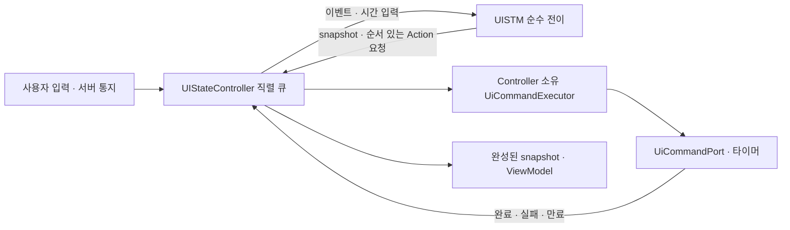

# UI_STM–UI_Controller 책임 분리 구현·검증

기준 commit: `58727e2901a04a2a0faeb6dd594b94dc51b232d8`. 이 commit의 사용자 동작과 명령 호출을 기준으로 실행 책임만 이동했다. XState `5.32.5`, 단일 루트 계층, 병렬 Region, deep history와 Event–Action Table의 182개 ID를 유지한다.

## 실제 실행 경로와 설계 대응



| 설계 요소 | 실제 파일과 책임 |
|---|---|
| `UISTM` | [UISTM.ts](/Users/oscar/Desktop/Binance_Auto/UI/src/app/machines/UISTM.ts): `initialTransition`·`transition`으로 상태를 평가하고 `UITransitionResult` 반환. 살아 있는 actor나 실행 자원을 소유하지 않음. |
| 루트 상태 정의 | [uiApplicationMachine.ts](/Users/oscar/Desktop/Binance_Auto/UI/src/app/machines/uiApplicationMachine.ts): 기존 계층·병렬 Region·history·final, 서버 snapshot과 내부 이벤트 묶음 유지. |
| 기능 조립 | [uiFeatureDefinitions.ts](/Users/oscar/Desktop/Binance_Auto/UI/src/app/machines/uiFeatureDefinitions.ts), [uiRegionComposition.ts](/Users/oscar/Desktop/Binance_Auto/UI/src/app/machines/uiRegionComposition.ts): 기능별 상태·가드·내부 데이터 변경·명령 요청을 한 루트에 조립. |
| 요청 계약 | [uiActions.ts](/Users/oscar/Desktop/Binance_Auto/UI/src/app/machines/uiActions.ts): 명령 시작·취소, 타이머 시작·취소, 전체 정리의 데이터 계약. |
| `UIStateController` | [UIStateController.ts](/Users/oscar/Desktop/Binance_Auto/UI/src/app/control/UIStateController.ts): 입력 변환, 시간 공급, STM 평가, Action 실행, 결과 이벤트 큐, 구독·ViewModel·수명 관리. |
| 실행부 | [UiCommandExecutor.ts](/Users/oscar/Desktop/Binance_Auto/UI/src/app/control/UiCommandExecutor.ts): 실제 Port 호출, Promise·AbortController·타이머 핸들 관리. 전이 조건을 판단하지 않음. |
| 기존 Facade | [UiApplicationFacade.ts](/Users/oscar/Desktop/Binance_Auto/UI/src/app/control/UiApplicationFacade.ts): 같은 `UIStateController` 클래스를 기존 이름으로 재수출. 기존 타입·selector 공개 경로 유지. |

외부의 `dispatch`, `start`, `stop`, `subscribe`, `get_snapshot`, `get_view_model`, Intent·ViewModel·`UiCommandPort`와 기존 Facade 생성자 호출은 그대로 사용할 수 있다. Facade와 Controller의 클래스 동일성도 테스트한다. 별도 Facade 상태나 두 번째 실행 경로는 없다.

기능별 machine의 Port·Promise actor·외부 callback·현재 시각 조회를 제거했다. 작업 정의는 `meta.command`, 시간 규칙은 `meta.timers`에 선언하며, 조립기는 이를 순수 요청 Action으로 바꾼다. 조립된 루트에는 `invoke`, `after`, 실행 actor가 없다. 기존 `app/machines/uiCommandExecutor.ts`는 제거했다.

## 전이와 실행의 계약

`UITransitionResult`는 최종 `snapshot`과 순서 있는 `actions`를 반환한다. 시작 요청에는 작업 key·token·명령 종류·입력값이, 타이머 요청에는 key·token·절대 만료 시각이 담긴다. 취소 요청은 해당 key의 현재 작업을 정리한다. 함수·Promise·actor·Port 참조를 요청에 담지 않는다.

Controller는 각 입력을 다음 순서로 처리한다.

1. 현재 시각과 필요한 날짜를 확보하여 STM을 평가한다.
2. STM의 최종 snapshot을 반영한다.
3. Action 목록을 순서대로 시작하거나 취소한다.
4. 완성된 snapshot을 구독자에게 발행한다.
5. 실행 중 들어온 입력·작업 결과를 다음 큐 항목으로 처리한다.

여러 내부 이벤트는 같은 전이 계산 안에서 처리하며 중간 상태는 발행하지 않는다. Promise 완료를 기다리며 큐를 막지 않는다. 동기 예외와 비동기 실패는 모두 작업 결과 이벤트가 된다. 작업 교체·전체 종료 이후의 callback은 실행부가 차단하고, STM은 요청 token을 독립적으로 검사하여 오래된 결과를 거부한다.

생성 직후에는 외부 작업 없는 초기 snapshot을 제공한다. `start()`는 초기 Action을 한 번 실행하고 시작 전에 큐에 들어온 입력을 처리한다. `stop()`은 화면 런타임을 폐기하여 읽기·타이머·구독·남은 이벤트를 정리한다. 업무상 정상 종료는 네이티브 종료 확인을 받은 뒤 `UI_FINAL_STATE`에 도달하고 `stop_all`을 요청한다. 이미 제출한 쓰기에 대해 backend 취소를 수행했다고 간주하지 않는다.

## 시간·화면 복귀·비동기 동작 보존

- 현재 시각과 단조 시각은 Controller가 공급한다. STM은 전달된 숫자로 KST 자정과 강조 타이머 만료 시각을 계산한다. 같은 지표 재수신 시 최초 수신 시각을 유지한다.
- CSV 날짜 제공 함수는 실제 새 창 열기로 `reset_draft`가 선택될 때 한 번 호출한다. STM의 순수 사전 평가가 `ui.read_current_date` 표식을 확인하며, Controller에 CSV 가드를 복제하지 않는다. 무시된 중복 열기는 날짜를 다시 읽지 않는다.
- `self.getSnapshot()` 의존을 제거하고 전이 직전 `snapshot.value`를 명시적으로 전달한다. 순수 XState 평가에서 초기 상태를 복귀 데이터로 잘못 저장하지 않는다.
- 요청 token·pending·summary revision·숨겨진 화면의 지연 전이는 STM에 남는다. 화면을 떠난 제출 쓰기는 유지하며, 숨겨진 완료는 데이터에 한 번 반영하고 복귀 시 상태만 정리한다. deep history 복귀는 재제출 조건이 아니다.
- 거래 내역 이탈 시 실제 AbortSignal로 조회를 취소하고 늦은 결과를 차단한다. 기존 필터, 조회 중 입력 제한, 체결 뒤 추가 조회, 최신 summary 우선 정책을 유지한다.
- 강조 타이머는 화면이 숨겨져도 원래 만료 시점을 유지한다. CSV 편집·폴더 선택·내보내기·실패 복구, REGIME 후보/확정, 매매 수락/완료, 종료 오류별 복구는 기존 전이 정의를 유지한다.

## 변경 전후 비교와 테스트 결과

[uiSeparationReplay.test.ts](/Users/oscar/Desktop/Binance_Auto/UI/src/app/control/uiSeparationReplay.test.ts)의 세 기준 기록은 책임 분리 전에 위 기준 commit에서 생성했다. 구현 뒤 기대 기록을 갱신하지 않고 재생 비교했다. 고정 시간·가짜 Adapter·제어 가능한 Promise 완료 순서로 모든 snapshot 발행, 상태 경로, ViewModel, 입력 수락 여부와 명령 인자·횟수·순서를 기록한다.

| 기준 기록 | 시나리오 | 비교 결과 |
|---|---|---|
| `ui-separation-navigation.json` | REGIME 선택·시작·분할 입력, 차트/history, 거래 내역 필터, 폴더 선택 취소/성공, CSV 내보내기·새 날짜 | 동일 |
| `ui-separation-races.json` | 연속 쓰기 교체, 숨겨진 화면에서 최신 실패·오래된 성공, REGIME 완료 후 복귀 | 동일 |
| `ui-separation-timers.json` | 숨겨진 강조, KST 자정 재조회, 원래 강조 만료 후 복귀 | 동일 |

2026-09-17 검증 결과:

- 전체 UI 테스트 **60개 파일, 660개 테스트 통과**. 기존 로컬 Python backend 프로세스 연동 테스트 포함.
- [uiEventActionCoverage.test.ts](/Users/oscar/Desktop/Binance_Auto/UI/src/app/machines/uiEventActionCoverage.test.ts)의 **182개 ID 행동 검증 유지**.
- [UISTM.test.ts](/Users/oscar/Desktop/Binance_Auto/UI/src/app/machines/UISTM.test.ts): 외부 시계·타이머·fetch를 금지한 순수 평가, 결정성, 데이터 요청, 오래된 token, history·만료 시각.
- [UIStateController.test.ts](/Users/oscar/Desktop/Binance_Auto/UI/src/app/control/UIStateController.test.ts), [UiCommandExecutor.test.ts](/Users/oscar/Desktop/Binance_Auto/UI/src/app/control/UiCommandExecutor.test.ts): 실행 순서·재진입·중복 시작·날짜 경계·실제 취소·동기/비동기 실패·종료 후 결과 차단.
- [uiArchitecture.test.ts](/Users/oscar/Desktop/Binance_Auto/UI/src/app/machines/uiArchitecture.test.ts): 타입 전용 import를 제외한 런타임 의존 그래프와 조립된 루트 검사. STM에서 Controller·Port·Adapter·실행 actor·실시간 타이머·현재 시각 접근이 들어오는 경로를 차단.
- TypeScript 타입 검사, Vite production build, `git diff --check` 통과. 빌드는 503.31 kB 단일 chunk에 대한 크기 경고를 출력한다.

기능 단위 테스트는 [createFeatureTestController.ts](/Users/oscar/Desktop/Binance_Auto/UI/src/shared/testing/createFeatureTestController.ts)를 통해 실제 STM–Controller 경계로 실행한다. 기존 상태·결과 기대값은 유지했다. 독립 feature actor의 실행 설정에 의존하던 준비 코드만 교체했으며, 자정 테스트는 지연 callback 대신 고정 시각을 사용한다.

재현 명령은 `UI` 폴더에서 다음과 같다. 설치된 도구의 직접 실행은 package script와 같은 검사다.

```sh
node node_modules/vitest/vitest.mjs run
node node_modules/typescript/bin/tsc -b --pretty false
node node_modules/vite/bin/vite.js build
```

전체 테스트에는 로컬 loopback 사용 권한이 필요하다. 샌드박스에서 차단된 프로세스 연동 검사는 loopback 허용 환경에서 다시 실행하여 통과했다. [검증 기록](/Users/oscar/Desktop/Binance_Auto/artifacts/ui-stm-controller-separation-20260917/verification.json)에 테스트 요약과 기준 기록의 SHA-256을 남겼다.

## 별도 발견 사항과 검증 범위

추가 문서 검사 `python3 scripts/check_communication_traceability.py`는 기존 backend 테스트 참조 오류 때문에 전체 통과하지 않는다. 모든 UI production owner 및 UI 테스트 참조는 검사에 통과했다. 아래 세 참조와 해당 backend 테스트 파일은 착수 commit과 동일하며 이번 책임 분리 범위에서 변경하지 않았다.

| Communication 항목 | 누락된 기존 테스트 참조 |
|---|---|
| CASE_1 `6.1.1.1.1` positive | `backend/tests/unit/trading/test_logic_registry.py`의 `test_type_zero_uses_exact_lower_bb_registry_and_safe_termination` |
| CASE_1 `8.1.1.3` positive | `backend/tests/unit/trading/test_stm.py`의 `test_g_07_position_uses_force_sell_then_g_06f_completion` |
| CASE_1 `8.1.1.3` negative | `backend/tests/unit/trading/test_stm.py`의 `test_g_07_force_sell_failure_uses_g_06r_retry_policy` |

검증은 가짜 Adapter와 로컬 backend fixture를 사용했다. 실제 Binance 주문, 전체 backend 테스트군, 네이티브 바이너리 패키징·실기 종료는 이번 검증에 포함하지 않는다. 네이티브 종료 **완료 대기 계약**은 기존 UI 테스트로 검증했다. backend 거래 정책·저장 형식·네이티브 종료 정책·화면 스타일은 수정하지 않았다. 유한한 회귀 시나리오의 동등성 검증이며 모든 가능한 이벤트 순서를 증명한다는 의미는 아니다.

9월 15일/16일 구현 설명서와 PDF는 당시 구조의 기록으로 남겨 두었으며 해당 Markdown 첫머리에 현재 문서 링크를 추가했다. 동작 명세와 Event–Action ID는 수정하지 않았다.
