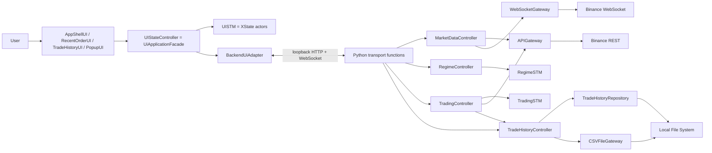

# Binance Auto 통합 시스템 단위 구현 로드맵

| 항목 | 내용 |
|---|---|
| 문서 상태 | 실행 기준 문서 / Phase 10 완료·Phase 9 실제 Testnet 검증 대기 |
| 기준일 | 2026-08-23 (Asia/Seoul) |
| 기준 커밋 | `d9532077dc2cd9c5b1c25f0718b675e4fcb072bb` (`main`, Phase 10 시작 기준) |
| 구현 목표 | 한 번에 전체를 구현하지 않고, 검증 가능한 단위별로 실제 거래 가능한 통합 시스템까지 완성한다. |
| 최우선 설계 기준 | `Design/Architecture/Communication_Diagram_Message_Flow_Specification.md` |
| 현재 결론 | Phase 10의 strict `/v1/trades` composite query, `TradeHistoryController.get_trade_details`, D-12 summary/filtered rows 분리, 12개 filter 조합, live order/account/performance event, reconnect 교체, KST 자정 자동 summary refresh와 실제 UI 상태를 완료했다. 사용자가 Phase 10을 명시적으로 요청했고 Phase 9의 남은 항목은 credential이 필요한 외부 검증이어서, 기술 선행 Phase 5/8이 완료된 이 범위만 예외적으로 진행했다. Phase 9 master는 계속 `[ ]`이며 다음 작업은 credential 기반 실제 Testnet 검증이다. |

---

## 1. 이 문서를 사용하는 방법

이 문서는 다음 개발 작업의 프롬프트를 대신한다. 구현자는 아래 규칙을 그대로 지킨다.

- [x] 현재 코드와 테스트를 기준으로 완료/미완료 범위를 구분했다.
- [x] 항상 **가장 앞에 있는 미완료 Phase 하나만** 구현한다.
- [x] Phase를 시작하기 전에 그 Phase에 적힌 Communication 메시지 번호와 클래스 Operation을 다시 읽는다.
- [x] 한 Phase에서 다음 Phase의 기능을 미리 구현하지 않는다.
- [x] 각 작업은 테스트를 먼저 추가하거나, 최소한 같은 변경 묶음 안에 테스트를 포함한다. Phase 0은 동작 코드가 없어 기존 전체 baseline을 먼저 재실행했다.
- [x] 완료 조건을 모두 만족한 뒤에만 해당 Phase의 체크박스를 `[x]`로 바꾼다.
- [x] 체크할 때 실행 명령, 통과한 테스트 수, 주요 파일, 커밋 ID를 Phase의 `완료 증거`에 기록한다.
- [x] 실패하거나 미확정인 정책을 임의 기본값으로 숨기지 않는다. Phase 0에서 `TRADING_LOGIC_INCOMPLETE`로 격리했던 상단 BB gap은 Phase 6에서 명시적 `SAFE_TERMINATION`으로 닫았고, 미지원 REGIME fallback은 없다.
- [x] 실제 **live** Binance 주문은 Phase 13의 별도 승인 전까지 실행하지 않는다. Phase 9
  Spot Testnet 주문은 고정 endpoint, read-only opt-in, 별도 주문 opt-in과 양수
  max-notional 상한을 모두 만족한 명시적 검증에서만 허용한다. 기본 mode는 `disabled`다.

상태 표기는 다음처럼 사용한다.

| 표기 | 의미 |
|---|---|
| `[x]` | 코드와 자동 검증으로 완료가 확인됨 |
| `[ ] 부분 완료` | 일부 계층만 있으며 종단 간 계약은 아직 미완료 |
| `[ ] 미구현` | production 구현이 없음 |
| `[ ] 결정 필요` | 업무 규칙 확정 전에는 안전하게 구현할 수 없음 |

### Phase 실행 요청 형식

후속 구현 작업은 다음 한 문장으로 시작할 수 있다.

```text
INTEGRATED_SYSTEM_IMPLEMENTATION_ROADMAP.md를 기준으로 가장 앞의 미완료 Phase 하나만 구현하라.
해당 Phase가 참조하는 Communication Diagram 메시지와 기존 클래스를 먼저 확인하고,
범위를 넘는 기능이나 새 업무 클래스를 만들지 말며, 완료 조건의 테스트와 문서 체크까지 수행하라.
```

- [x] 이 섹션의 실행 규칙을 Phase 0 작업에 적용했고 후속 Phase의 고정 규칙으로 유지한다.

---

## 2. 기준 자료와 우선순위

### 2.1 반드시 먼저 보는 자료

1. `Design/Architecture/Communication_Diagram_Message_Flow_Specification.md`
2. `backend/src/binance_auto_trader/domain/regime/`, `backend/tests/unit/regime/`, `backend/docs/Regime_STM_Implementation_Plan.md`
3. `backend/src/binance_auto_trader/domain/trading/`, `backend/tests/unit/trading/`, `backend/docs/Trading_STM_Implementation_Plan.md`
4. `UI/`의 실제 소스, 테스트, `UI_ARCHITECTURE_AND_FILE_REFERENCE.md`

충돌 시 적용 순서는 다음과 같다.

1. 아직 수정되지 않은 Communication Diagram을 먼저 확인한다.
2. 현재 필요한 Operation이 없으면 다이어그램에 존재하는 클래스 중 책임이 맞는 클래스를 찾는다.
3. 기존 클래스에 넣었을 때 책임이 과도해지고 coupling이 커지며 cohesion이 낮아지는 경우에만 새 production 클래스를 검토한다.
4. Operation 또는 signature를 바꿔야 하면 코드부터 바꾸지 말고 Phase 0에서 Communication 명세를 먼저 동기화한다.
5. 테스트 helper, 불변 DTO/value object, module 함수는 Communication 참여 업무 클래스와 구분한다.

### 2.2 현재 구현 계획 문서의 지위

- `Regime_STM_Implementation_Plan.md`와 `Trading_STM_Implementation_Plan.md`는 순수 STM과 Controller 책임 분리에 대한 상세 설계다.
- `UI_Implementation_Architecture_Plan.md`는 목표 구조 제안서다.
- `UI_ARCHITECTURE_AND_FILE_REFERENCE.md`는 현재 구현의 사실을 설명한다.
- 본 문서는 이들을 통합한 **앞으로의 실행 순서와 완료 판단 기준**이다.

- [x] 기준 자료의 역할과 우선순위를 확인했다.

---

## 3. 2026-08-23 현재 검증된 상태

### 3.1 자동 검증 결과

| 영역 | 실행 결과 | 판단 |
|---|---|---|
| 통합 backend | 표준 `unittest` 527개 실행, 523개 통과·credential 기반 4개 safe skip | 기존 Phase 0~9 회귀와 Phase 10 controller/transport/event/Case 3 계약 검증 통과 |
| Phase 9 집중 | adapter, bootstrap, pending journal, startup/reconnect, fee migration과 deterministic fault injection 검증 | timeout/5xx/429, `-2010` UNKNOWN, same-ID 복구, PREPARED ambiguity, 두 REST snapshot gap, reset provenance와 이중 opt-in 검증 |
| Phase 10 집중 | architecture 49개, Case 3 backend/UI trace, 12개 filter, KST 자정·save/retry rollover, empty/failure/retry, load 중 체결, replay gap resync 검증 | filter는 rows만 교체하고 Account version/KST 날짜/Trade publication이 바뀐 summary만 재결합하며 event pair는 원자 발행 |
| package/static | offline wheel build, `compileall`, generated contract drift와 `git diff --check` 최종 재검증 | Phase 10 controller/query/route/event public type을 wheel과 generated TypeScript 계약에 포함 |
| UI | Vitest 31개 파일, 200개 테스트 전부 통과 | 실제 history loading/ready/empty/failed/retry, in-flight 취소·재진입, event race, KST 자정 timer, 12개 결합 filter와 reconnect 회귀 포함 |
| UI typecheck/build | `tsc -b --pretty false`, Vite build 285 modules, Storybook static build 성공 | TypeScript strict schema v2 details/event 계약, production bundle과 fake Storybook 정상 |
| process/HTTP 검증 | 실제 Python child UI test 1개와 loopback HTTP/CORS/query tests를 통과 | startup 메시지 `1 → 2 → 3 → 4 → 5` 뒤 `전체 보기`에서 Case 3 상세 heading과 실제 empty 응답까지 확인 |
| generated contract | Python schema v2 renderer와 `backendContracts.generated.ts` byte-for-byte 일치 | max 1,000 rows, details composite와 ORDER/PERFORMANCE event payload를 Python authoritative source로 유지 |
| Git 범위 | Phase 10 History controller/domain query/transport/UI/test/docs 변경만 포함 | Binance payload/client, credential, CSV writer, Tauri와 live enable 변경 없음 |
| Tauri/Rust | memory-only one-shot descriptor source와 unit test 3개 추가, Rust toolchain 명령은 미실행 | 현 환경에 `cargo`/`rustc`가 없으며 sidecar spawn/package/shutdown은 Phase 12에서 검증 |

현재 환경에는 `pytest`가 설치되어 있지 않아 Python 검증은 프로젝트가 실제 사용하는
표준 `unittest`로 수행했다. offline wheel을 clean venv에
`--no-deps`로 설치한 Phase 9 wheel 검증을 유지하고, Phase 10에서는 수정된 package를
`uv build --wheel --offline`으로 다시 생성했다. UI는 설치된 `node_modules/.bin`으로
실제 loopback child-process의 Trade History 상세 진입까지 다시 검증했다.
Rust toolchain은 설치되어 있지 않아 native descriptor unit test 3개는 실행하지 못했으며,
이 사실을 Phase 12 인계 조건으로 유지한다.

### 3.2 현재 완료된 핵심

- [x] 두 STM이 `backend/src/binance_auto_trader/domain/` 하나의 설치 가능한 package로 통합되어 있다.
- [x] `domain/common/enums.py`의 `RegimeType.TYPE_0`~`TYPE_4`가 두 STM의 유일한 Python REGIME enum이다.
- [x] `RegimeSTM`의 상태, 이벤트, 불변 평가 Context, Action request, 결과, guard, 13개 transition registry가 구현되어 있다.
- [x] `RegimeSTM`은 Controller·Gateway·UI를 import하지 않는 순수 결정 엔진이다.
- [x] `TradingSTM`의 계층/병렬 상태 구성, 이벤트, 불변 Context view, Action request, 109개 transition ID가 구현되어 있다.
- [x] `TradingSTM`의 Case C 우선권, 중지 우선권, 주문 결과 microstep, stale event와 context version 방어가 테스트되어 있다.
- [x] Phase 6 불변 `TradingLogicConfiguration` 5개가 canonical REGIME 순서를 보존하고 `TYPE_0`만 exact 109개 lower-BB registry와 `SAFE_TERMINATION`을 선택한다.
- [x] `TradingSTM` 생성자와 factory에는 암묵적 `TYPE_0` 기본값이 없고, `TYPE_1`~`TYPE_4`는 `UnsupportedTradingLogicError(code=UNSUPPORTED_TRADING_LOGIC)`로 거부한다.
- [x] G-07은 `realtime_price >= upper_band`에서 pending 주문 취소·같은 ID reconciliation을 우선하고, pending 없는 포지션은 STOPPING·force-sell, 둘 다 없으면 즉시 runtime 종료로 완결한다.
- [x] canonical `Interval`과 Decimal/UTC 불변 `Kline`, 원자적·versioned `MarketSnapshot`이 구현되어 있다.
- [x] backend `MarketDataController`가 fake client 경계에서 WS start → REST load → drain/merge → snapshot update를 직렬 실행한다.
- [x] Binance Spot REST 12-field Kline과 raw/combined WebSocket Kline을 Decimal·UTC 내부 타입으로 엄격히 정규화한다.
- [x] `IndicatorSnapshot`이 closed 4H EMA9/slope/swing과 진행봉 live EMA9를 같은 MarketSnapshot version provenance로 보존한다.
- [x] `RegimeController`가 initial/4H close 두 microstep Action을 직렬 실행하고 추천/선택 분리, candle dedup, stale/failure trace를 소유한다.
- [x] `MarketDataController`에서 메시지 `1.4`~`1.5.1`의 fake vertical slice가 실제 `RegimeSTM` 추천 결과까지 연결된다.
- [x] `Account`가 full/partial snapshot, 자산별 free/locked Decimal, ETH current price·valuation, UTC updated_at과 monotonic version을 보존하며 `get_holdings()`를 제공한다.
- [x] `APIGateway`와 `WebSocketGateway`가 공식 Spot account payload를 `AccountSnapshot`으로 정규화하고 `outboundAccountPosition`의 변경 자산만 absolute patch로 적용한다.
- [x] account stream은 source time·fingerprint·subscription generation으로 stale/duplicate
  callback을 차단한다. 수신 루프는 bounded 단일 FIFO worker에 event를 넘기며 enqueue부터
  callback 완료와 queue drain까지 `account_ready=false`를 유지한다. overflow·consumer/worker
  failure와 termination은 socket close와 reconciliation-required로 전환한다.
- [x] `TradingController.load_account()`가 REST fetch → Account commit → account stream start 순서를 보장하며 REST 실패 시 stream을 시작하지 않는다.
- [x] ADR-004 JSONL v1/v2 reader·v2 writer의 frozen `Trade`, order ID idempotent
  `TradeHistory`, KST inclusive-date/side query와 D-11 `Performance` startup 복원이
  구현되어 있다. 열린 v1 ETH-fee lot은 명시적 migration 전까지 주문을 차단한다.
- [x] Trade 수수료는 USDT 동일값, ETH per-fill quote aggregate의 zero-pair 일관성을 검증하고 제3 asset은 `FEE_ASSET_CONVERSION_REQUIRED`로 fail closed한다.
- [x] `TradeHistoryRepository`가 streaming startup read, missing/empty 처리, strict partial-tail recovery와 order ID index rebuild를 수행한다.
- [x] `TradeHistoryController`가 Repository → TradeHistory → Performance를 local에서 완성한 뒤 원자적으로 publish한다.
- [x] `TradeHistoryController.get_trade_details()`가 KST period/side query 행, shared `Account`의 ETH free+locked와 D-12 `Performance`를 불변 결과로 결합한다. 같은 Account version·KST 날짜의 filter는 rows만 재조회하고, account/day/trade 변경 때만 summary를 재결합한다.
- [x] strict `GET /v1/trades?period=...&side=...`가 최대 1,000개의 Decimal string 행과 query echo, account provenance, 전체 성과를 하나의 composite 응답으로 제공한다.
- [x] 메시지 `2`~`2.2.1`과 `3`~`3.3`의 구조화 trace가 caller/receiver, command ID, state version, result/failure code와 secret 비노출을 검증한다.
- [x] UI의 Dashboard, Trade History, modal, REGIME 선택, start/stop 확인, split order, CSV form, 차트, Storybook 기준 화면이 구현되어 있다.
- [x] Trade History UI가 최초 `TODAY + ALL`, 12개 결합 filter, loading/ready/empty/failed/retry와 D-12 summary/rows 분리를 실제 backend 응답으로 수행한다.
- [x] `ORDER_EXECUTED`는 recent orders와 현재 history query를, `ACCOUNT_UPDATED`/`PERFORMANCE_UPDATED`는 provenance가 맞는 summary를 갱신한다. sequence gap/session reconnect는 진행 중 응답을 폐기하고 현재 query를 snapshot-first로 재조회한다.
- [x] ready/empty Trade History는 고정 KST(UTC+09:00) 자정에 현재 query와 summary를 자동 재조회하고 화면 이탈 시 timer를 취소한다.
- [x] UI 가격 차트는 공개 Binance REST/WebSocket에서 `1m`, `30m`, `4h`, `1d`를 조회한다.
- [x] UI 차트는 WebSocket을 먼저 열고 REST를 조회한 뒤 동일 봉에서는 WebSocket 값을 우선하여 병합한다.
- [x] UI의 backend 명령은 `UiCommandPort` 뒤에 격리되어 있다.
- [x] application bootstrap이 market·Regime readiness → Account REST+stream → History/Performance 순서를 고정하고 마지막 단계 뒤에만 ready state를 원자 publish한다.
- [x] loopback transport가 IPv4 `127.0.0.1` random port, launch별 256-bit token, Host/Origin/CORS/Bearer, WebSocket first-frame 인증과 strict envelope를 구현한다.
- [x] snapshot DTO와 마지막 event `sequence`를 같은 application `RLock` 임계 구역에서 읽고 event replay를 10,000개 또는 15분으로 제한한다.
- [x] Python transport schema가 generated TypeScript contract의 authoritative source이며 byte drift test가 존재한다.
- [x] schema v2 trading snapshot이 5개 `logic_coverage`, session status/version/ratio/position과 mode별 `command_enabled`를 UI에 제공한다.
- [x] UI는 5개 REGIME의 지원 상태를 표시하고 미지원 추천·표시·선택을 유지하되, 시작 요청과 stale 확인에서 backend command를 0회로 차단한다.
- [x] mutable `TradingContext`가 Account/REGIME/분할 비율과 immutable runtime·Position·pending snapshot을 lock 아래 보존하고 typed mutation마다 version을 증가시킨다.
- [x] `RegimeController.set_regime_type()`만 선택을 변경하며 active session에서는 STM·Context·선택을 그대로 둔 채 `TRADING_ACTIVE`로 거부한다.
- [x] fake mode의 `TradingController.start_trading()`이 readiness와 version을 검증하고 Context 초기화 뒤 session 전용 `TradingSTM.run()`을 정확히 한 번 실행한다.
- [x] `SerialEventQueue`와 run-to-completion processor가 Controller에 연결되어 Action 순서, reentrant 차단, Context version race rollback과 deadline 기반 scheduler cleanup을 보장한다.
- [x] `RUNNING` 최초 stop은 `STOP_CONFIRMED`를 먼저 처리하고 pending → 보유 Position → position 0 우선순위로 typed Action을 만들며 position 0에서는 sell Action을 요청하지 않는다. 이미 중지·종료 상태인 후속 stop은 성공 no-op이다.
- [x] Decimal128 `Order`/`Fill`/`ExecutionSummary`와 average-cost `Position`이 intent, 실제 fill, owner, 매도 사전 원가를 보존한다.
- [x] `TradingController`가 fake `APIGateway`의 즉시·active·partial·UNKNOWN·terminal 결과를 동일 ID 조회·bounded retry로 조정하고 Position → History/Performance → durable Repository → concrete outcome 순서를 보장한다.
- [x] JSONL order ID 멱등 append/flush/fsync, 저장 실패 save-only retry, KST Performance 일자 전환과 Case 2 메시지 `1`~`14` 상관 trace를 구현했다.
- [x] 고정 Testnet REST/WebSocket adapter가 server time/HMAC, MARKET 수량/notional 사전 검사, account·order
  mapping과 현행 signed user-data stream을 제공한다. Testnet 주문은 generic factory가 아닌
  전용 bootstrap의 이중 opt-in·양수 cap·pending journal을 모두 요구하고 live는 잠겨 있다.
- [x] startup은 stream ACK 뒤 두 번째 account snapshot, open/recent/same-ID query와
  durable Position provenance를 확인한다. reconnect도 새 stream 뒤 두 번째 REST snapshot을
  다시 적용하며 설명되지 않은 fill, 잔액 감소와 Testnet reset을 fail closed한다. 숫자
  `orderId`가 reset 뒤 재사용돼도 `(clientOrderId, orderId)` pair와 terminal fill 집계가
  durable Trade에 정확히 일치해야 하며, 충돌은 Position 적용 전에 차단한다.
- [x] pending-order sidecar v2가 `PREPARED` UPSERT와
  `SUBMISSION_REJECTED_CONFIRMED` TRANSITION을 각각 file+directory fsync하고, legacy v1
  UPSERT는 보수적으로 `PREPARED`로 읽는다.
- [x] REGIME/select/start/stop/split HTTP와 UI command가 command ID·expected version·Decimal string 계약으로 연결되고 lifecycle event/snapshot을 단조 version으로 동기화한다.
- [x] production UI는 coherent ready snapshot을 먼저 적용한 뒤 actor와 event stream을 시작한다.
- [x] duplicate/out-of-order/event ID 중복을 거르고 gap·session change에서는 snapshot-first full resync한다.
- [x] 실제 Python child process의 read-only ETHUSDT/USDT snapshot을 React App에 표시하고 메시지 `1`~`5` 통합 trace를 검증했다.
- [x] backend market event parity 전에는 공개 Binance chart를 교체하지 않고 display-only로 유지한다.

### 3.3 현재 완료되지 않은 핵심

- [ ] 부분 완료 — `TradingController`의 실제 Testnet Order Action, pending journal,
  startup/reconnect reconciliation까지 연결됐다. credential 기반 lifecycle 증거는 아직 없다.
- [ ] 부분 완료 — 공식 account/order REST와 signed user-data stream client 조립,
  credential/signature/session 관리는 구현했지만 실제 credential parity 실행은 남아 있다.
- [ ] 부분 완료 — backend `Account`, `Order`, mutable `Position`, `ExecutionSummary`,
  v1/v2 `Trade`, `TradeHistory`, `Performance`가 실제 Binance mapping까지 연결됐다.
  credential 기반 외부 Testnet lifecycle과 열린 legacy lot migration 도구는 완료되지 않았다.
- [x] 완료 — JSONL `TradeHistoryRepository`의 startup read/recovery/index, order ID 멱등
  append/flush/fsync/save-only retry와 byte snapshot `stream_trades`를 구현하고, native
  no-replace rename 기반 CSV writer까지 Phase 11에서 연결했다.
- [ ] 부분 완료 — Python application bootstrap, loopback HTTP/WebSocket와 backend event stream은 구현됐다. Tauri sidecar spawn, descriptor stage, package와 안전 종료 lifecycle은 Phase 12 범위다.
- [x] 완료 — production read/command path는 `BackendUiAdapter`를 사용하고
  demo/Storybook/tests는 `FakeUiCommandAdapter`를 유지한다. Phase 11에서 Tauri native directory
  picker와 실제 streaming filesystem export receipt까지 production adapter에 연결했다.
- [ ] 부분 완료 — authoritative backend market/regime/account/history/trading-session snapshot과
  Testnet runtime은 구현됐지만 packaged UI가 Testnet composition을 선택하는 경로는 Phase 12
  범위다. UI 공개 차트는 parity 전 display-only로 유지한다.
- [x] 완료 — strict `TYPE_0`~`TYPE_4` ↔ `type0`~`type4` transport 변환, REGIME별 전략 coverage/start guard, G-07 상단 BB 안전 종료와 UI zero-command gate를 Phase 6에서 완료했다.
- [x] 완료 — fake `APIGateway`에 주문을 제출하고 fill을 Position/History/Performance에 일관되게 반영한 뒤 durable 저장 이후에만 outcome을 내는 Case 2 pipeline을 Phase 8에서 완료했다.
- [ ] 부분 완료 — 메시지 `1`~`5`, Case 2 `1`~`14`를 검증하고 actual adapter 기반
  lifecycle harness를 구현했으며 local restart reconciliation을 검증했다. harness의
  credential 기반 실행과 전체 UI Communication Case는 아직 남아 있다.

### 3.4 Phase 1~11에서 해소한 위험과 남은 계약 공백

Phase 1에서 두 독립 distribution을 `backend/` 하나로 통합했다. root의
`RegimeSTM/`·`TradingSTM/` source tree를 제거했고, clean environment에 설치한
하나의 wheel에서 두 STM을 동시에 import했다.

Phase 2에서 중복 `Interval` 정의 없이 common canonical enum을
market/regime이 공유하고, 실패·disconnect·concurrent reinitialize에서 기존
snapshot version을 역행시키지 않는 full-resync 계약을 고정했다.

Phase 3에서 Decimal 4H 지표 공식과 golden vector를 production code에 고정하고,
RegimeSTM의 Action 요청을 Controller만 수행하도록 연결했다. recommendation과
selection은 분리했고 duplicate/stale/과거 candle 및 입력 실패는 마지막 정상 추천을
보존하는 typed trace로 닫았다.

Phase 4에서 Decimal/UTC Account, 공식 Spot account payload 정규화와 REST commit 후
account stream 시작 순서를 고정했다. account stream은 변경 자산 absolute patch,
stale/duplicate/generation 방어와 callback·termination·start failure 처리를 갖는다.
ADR-004 JSONL v1 Trade, KST TradeHistory query, D-11 Performance, strict partial-tail
recovery Repository와 atomic TradeHistoryController publication을 구현했고 메시지
`2`~`3.3`의 구조화 trace를 고정했다. Phase 4 시점에는 주문·append·CSV·transport
책임을 후속 Phase에 남겼다.

Phase 5에서 하나의 application `RLock`으로 startup readiness, Account stream callback과
snapshot/sequence publication을 직렬화했다. loopback transport는 random port와 launch별
token, Host/Origin/CORS/Bearer와 WebSocket first-frame auth, strict JSON/idempotency,
bounded replay/resync를 fail closed로 고정했다. generated TypeScript drift test와 UI의
snapshot-first/StrictMode/reconnect 경계를 추가했으며 모든 write command는 owner Operation이
생길 때까지 `FEATURE_NOT_AVAILABLE`이다.

Phase 6에서 Phase 0이 `TRADING_LOGIC_INCOMPLETE`로 격리했던 `TYPE_0`
상단 BB gap을 G-07 `SAFE_TERMINATION`으로 닫았다. 새 상단 매매 전략을
추측하지 않고 기존 STOPPING/reconciliation/runtime cleanup 계약을
재사용했다. immutable 5-row registry, `TradingController` selection façade,
schema v2 snapshot/UI gate를 함께 고정했으며 session/start/stop orchestration은
Phase 7에 남겼다.

Phase 7에서 mutable `TradingContext`와 Controller-owned session lifecycle을 연결했다.
REGIME 선택, split, start/stop은 command ID와 expected Context version으로 직렬화되며,
start는 readiness 검증과 Context 초기화 뒤 선택된 STM을 한 번만 실행한다. `RUNNING`
세션의 최초 stop은 `STOP_CONFIRMED`를 먼저 처리하고 pending/보유/무포지션 branch를
authoritative backend snapshot으로 결정한다. 이미 `STOPPING`,
`RECONCILIATION_REQUIRED` 또는 `TERMINATED`인 세션의 후속 stop은 새 STM Action 없는
성공 no-op으로 현재 상태를 반환한다. Phase 7에서는 `SubmitOrder`, `ForceSellAll`,
cancel/reconcile을 typed Action으로 보존해 Phase 8 execution owner에게 넘겼다.

Phase 8에서는 그 Action을 Decimal `Order`/`Position`과 fake `APIGateway`에 연결했다.
active·UNKNOWN과 terminal zero-fill은 동일 ID 조회로 확정하고, partial fill은 새 delta만
Position에 반영한다. terminal execution은 D-11 Trade/Performance와 order ID 멱등
JSONL fsync를 끝낸 후에만 concrete outcome을 STM에 전달한다.

Phase 9에서는 고정 Spot Testnet endpoint의 실제 서명 client, MARKET 수량/notional rules,
현행 signed user-data stream과 open/recent/same-ID startup reconciliation을 연결했다.
PREPARED sidecar는 네 번의 `-2013`만으로 삭제하지 않고, history와 정확히 같은 exchange
execution만 crash 잔여물로 정리한다. reconnect는 REST → 새 stream → 두 번째 REST의
gap을 닫고 설명되지 않은 최근 fill·잔액 감소·Testnet reset을 차단한다. history 저장 뒤
sidecar REMOVE가 실패하면 별도 durable marker와 실제 sidecar replay가 command gate를
유지하며, 같은 ID 재조회와 REMOVE fsync가 끝난 뒤에만 해제한다. 신규 Trade는
v2 실제 자산 흐름 회계를 사용하며 열린 v1 ETH-fee lot은 migration을 요구한다. 다만
authenticated read-only와 capped lifecycle은 credential 부재로 아직 실행하지 않았다.

Phase 10에서는 Case 3의 최초 `TODAY + ALL`과 모든 period/side 조합을 strict composite
query로 연결했다. D-12의 filtered rows와 filter 독립 summary를 분리하고, backend Decimal을
wire string으로 보존했다. durable Trade 뒤 `ORDER_EXECUTED`와 `PERFORMANCE_UPDATED`를 한
event batch로 발행하며 Account/Performance event와 sequence gap을 UI actor가 단조 revision으로
처리한다. 최초 결합·warm cache·durable save/retry의 KST 자정 경쟁은 새 날짜 결과만 게시하도록
재시도하고, UI도 KST 자정 timer로 현재 query를 다시 읽는다. 이 Phase는 Binance client나
payload를 변경하지 않아 새 공식 Binance 문서 해석이 필요하지 않았고 Communication Case 3,
ADR-004와 ADR-005의 기존 계약만 적용했다.

Phase 11에서는 Case 4의 UI draft와 독립된 backend `CSVExportOptions` 검증, KST preset과
JSONL byte snapshot iterator를 연결했다. ADR-004의 고정 21열을 UTF-8 BOM·CRLF·RFC 4180으로
한 행씩 기록하고 file fsync 뒤 OS native no-replace rename으로 게시한다. native picker 취소,
빈 결과, destination 경합과 filesystem fault는 경로를 반사하지 않는 typed 결과로 닫았다.
장기 write는 TradeHistory operation lock과 transport의 전역 idempotency lock 밖에서 실행해
terminal Trade publication 및 서로 다른 stop/shutdown command를 차단하지 않는다. Binance API
payload를 변경하지 않았으므로 이 Phase도 새 Binance 공식 문서 해석이 필요하지 않았다.

남은 표현과 지원 상태는 다음과 같다.

| 위치 | 현재 값 |
|---|---|
| backend domain | 유일한 `RegimeType.TYPE_0` ~ `TYPE_4` |
| UI wire 값 | `'type0'` ~ `'type4'` |
| `TYPE_0` TradingSTM registry | `SUPPORTED`, `LOWER_BB` 정확히 109개, `READY`, `SAFE_TERMINATION` |
| `TYPE_1`~`TYPE_4` TradingSTM registry | `UNSUPPORTED`, transition source 없음, `UNSUPPORTED_TRADING_LOGIC` |
| trading command | 검증된 in-process `fake` 조립은 연결 상태에서 허용; Phase 9 `testnet`은 전용 고정-endpoint bootstrap·startup reconciliation·별도 주문 opt-in·양수 cap·연결 상태가 모두 필요; `disabled`·read-only testnet·`live`는 fail closed |

Domain에는 UI wire 변환을 넣지 않았다. strict `TYPE_0` ↔ `type0` 변환은
transport 계층에서만 수행하고 private `LOWER_BB` key와 transition ID는 UI에
노출하지 않는다. 미지원 REGIME은 추천·표시·선택하되 start만
`UNSUPPORTED_TRADING_LOGIC`으로 차단하고 `TYPE_0`으로 fallback하지 않는다.

- [x] 중복 package와 transport 공백을 해소했고 Phase 9 actual Testnet adapter contract,
  local session/order/fill/history/restart/STOP pipeline과 lifecycle harness 구조를 검증했다.

---

## 4. Communication Diagram 클래스별 구현 현황

`완료`는 해당 클래스의 production 책임이 현재 범위에서 실제로 존재할 때만 사용한다. UI fixture나 snapshot type만 있는 경우는 부분 완료다.

| 체크 | Communication 클래스 | 현재 상태와 근거 | 남은 일 |
|---|---|---|---|
| [x] | `AppShellUI` | React `App`, `AppHeader`, modal host와 live snapshot/loading/typed failure Boundary를 구현 | 없음 |
| [x] | `UIStateController` | `UiApplicationFacade`가 snapshot/event bridge, Phase 7 command, Phase 10 Trade History와 Phase 11 native picker/export lifecycle을 조정 | 없음 |
| [x] | `UISTM` | root/feature XState actor와 Phase 5 snapshot 전체 동기화/reconnect를 구현 | 후속 command ack E2E 추가 |
| [ ] | `TradingController` | account, strict selection, session start/stop, queue/scheduler, Phase 8 Order/Position/history/force-sell 실행과 Phase 9 pending journal·confirmed-rejection durability·startup/reconnect reconciliation을 구현 | credential 기반 실제 Testnet lifecycle 증거 |
| [x] | `TradingSTM` | exact 109개 lower-BB transition·queue, 5-row immutable coverage, typed unsupported/no-fallback, G-07 안전 종료와 session `run` 연결을 구현 | 없음 |
| [x] | `TradingContext` | mutable/versioned owner, `initialize`, ordered runtime patch 적용, typed mutation·split ratio·Position/pending Order publication을 구현 | 없음 |
| [ ] | `MarketDataController` | backend authoritative WS-first/REST/merge/snapshot 초기화와 RegimeController 최초/full-resync 평가를 구현 | 4H/30m live event 발행과 후속 runtime 연결 |
| [x] | `APIGateway` | Kline/Spot account 정규화, normalized 주문 Operation과 실제 Testnet authenticated REST client의 raw order/open/recent/same-ID mapping을 구현 | 없음; credential 기반 외부 parity 실행은 Phase 9 완료 증거로 별도 남음 |
| [x] | `WebSocketGateway` | Kline·account/order event 정규화, stale·duplicate·generation 방어와 실제 Testnet signed session·disconnect reconciliation 연결을 구현 | 없음; credential 기반 외부 stream parity 실행은 Phase 9 완료 증거로 별도 남음 |
| [x] | `MarketSnapshot` | canonical Decimal/UTC Kline 4주기, current ETH price, monotonic version과 same-version 지표 파생을 구현 | 없음 |
| [x] | `RegimeController` | 지표 계산, RegimeSTM Action 실행, 추천/선택 분리, dedup/stale/error trace와 sole-writer `set_regime_type`/TradingController 연결을 구현 | 없음 |
| [x] | `IndicatorSnapshot` | Decimal EMA9 series/slope, strict swing, live EMA9과 source version/candle/time provenance를 구현 | 없음 |
| [x] | `RegimeSTM` | 순수 engine, 13개 transition과 Controller 두 microstep 통합 구현 | 없음 |
| [x] | `Order` | intent/client/exchange ID, 최초·재조회 결과, fill key 멱등, Decimal ExecutionSummary와 typed 충돌을 구현하고 Phase 9 Gateway의 실제 exchange filter 준비와 연결 | 없음 |
| [x] | `Position` | owner, quantity, average-cost basis, 사전 `get_cost_basis`와 원자적 `apply_execution`을 가진 entity를 구현 | 없음 |
| [x] | `Trade` | frozen JSONL v1/v2 reader·v2 writer, strict Decimal/plain/UTC/schema와 실제 자산 흐름 수수료 회계를 Order/ExecutionSummary/RealizedResult에 연결 | 열린 v1 ETH-fee lot의 별도 migration 도구는 후속 운영 과제 |
| [x] | `TradeHistory` | constructor, same-content idempotent `add_trade`/conflict, KST inclusive-date/side `find` 구현 | 없음 |
| [x] | `Performance` | D-11 startup/daily aggregate, `calculate_realized_result`, `apply_new_trade`, KST day rollover를 구현 | 없음 |
| [x] | `TradeHistoryController` | startup atomic publish, terminal execution/save-only retry, Phase 10 details와 Phase 11 KST preset·snapshot streaming export 조정을 구현 | 없음 |
| [x] | `TradeHistoryRepository` | streaming read/recovery/index, order ID 멱등 append·flush·fsync·uncertain-save, pending sidecar v2와 byte-length snapshot `stream_trades`를 구현 | 없음 |
| [x] | `Account` | balance/current price/valuation/UTC/version/`get_holdings`, transport DTO와 update event 연결 구현 | 없음 |
| [x] | `RecentOrderUI` | recent-orders Boundary와 backend `ORDER_EXECUTED` event 갱신을 구현 | 없음 |
| [x] | `TradeHistoryUI` | live details page, 12개 filter, 실제 상태/retry, event·resync·KST 자정 갱신, D-12 summary/rows 분리와 실제 CSV 결과 진입을 구현 | 없음 |
| [x] | `TradeHistoryQuery` | backend LocalDate·side 불변 query와 KST 경계 구현 | 없음; period→date/wire mapping은 Controller/transport 책임 |
| [x] | `PopupUI` | CSV dialog, native picker 취소 보존, pending 중복 차단과 실제 success/error modal을 구현 | 없음 |
| [x] | `CSVExportOptions` | UI draft와 독립적인 backend frozen value object, KST preset, 날짜·파일명·경로 구조 검증을 구현 | 없음 |
| [x] | `CSVFileGateway` | ADR-004 schema streaming, UTF-8 BOM/CRLF, fsync와 OS native no-replace atomic rename을 구현 | 없음 |

- [x] 27개 Communication 클래스의 현재 상태를 검토했다.

---

## 5. Communication Case별 종단 간 현황

| Case | 현재 완료 범위 | 현재 끊기는 지점 | 완료 Phase |
|---|---|---|---|
| Case 1 Start/Stop | UI 확인 흐름, RegimeSTM/TradingSTM core, backend startup, actual-process 메시지 `1`~`5`, fake session branch와 실제 Testnet adapter 기반 local lifecycle harness를 구현 | credential 기반 실제 Testnet lifecycle 증거, Phase 12 packaged sidecar | Phase 7, 9, 12 |
| Case 2 Buy/Sell | fake pipeline 메시지 `1`~`14`, 실제 Binance order mapping·pending journal·startup/reconnect reconciliation과 production-runtime lifecycle harness를 구현 | credential 기반 capped BUY/force-sell 실행; harness의 BUY trigger는 test-only private action seam이라 market-event→strategy E2E는 Phase 13에 남음 | Phase 8~9, 13 |
| Case 3 Trade History | `SHOW_TRADE_HISTORY` 최초 `TODAY + ALL`, 12개 결합 filter, backend composite details, D-12 summary/rows 분리, order/account/performance event와 gap resync/KST 자정 갱신을 구현 | 없음 | Phase 10 |
| Case 4 CSV Export | popup, backend option/KST 검증, byte snapshot `stream_trades`, native picker, 실제 atomic file write와 typed receipt/failure를 구현 | 없음 | Phase 11 |

현재 기준으로 live trading 준비 완료라고 볼 수 있는 Case는 **0개**다. startup read 경로,
fake Trading Order pipeline과 실제 Binance Testnet adapter/reconciliation 구현은 연결됐지만
credential 기반 외부 lifecycle 증거와 packaged sidecar가 남아 있기 때문이다.

- [x] 네 Communication Case의 종단 간 중단 지점을 확인했다.

---

## 6. 클래스와 Operation 추가 원칙

### 6.1 기존 클래스에 배치할 Operation

| 필요한 Operation | Communication 확인 결과 | 배치 결정 |
|---|---|---|
| `handle(event, context) -> RegimeSTMResult` | 8.13의 `RegimeSTM`이 guard/전이 책임을 이미 소유 | 새 클래스 없이 `RegimeSTM`에 canonical Operation으로 명세 추가 |
| 구체 주문 결과를 받는 `order_finished(event, context)` | 8.5 `TradingSTM.orderFinished()`가 이미 존재 | 새 클래스 없이 기존 Operation signature를 구체화 |
| 4H close 처리와 Kline event 정규화 | 8.7 `MarketDataController`가 시장 snapshot 흐름을 소유 | public 필요 시 명세 추가, 아니면 private method로 유지 |
| STM Action dispatcher와 event loop | 8.4 `TradingController`가 주문 실행 조정 책임을 소유 | `TradingController` private method/module로 구현 |
| REGIME evaluation loop/action dispatcher | 8.11 `RegimeController`가 지표와 추천 연결 책임을 소유 | `RegimeController` private method/module로 구현 |
| startup orchestration | 메시지 1~5의 호출자가 `UIStateController` | `UiApplicationFacade` live bootstrap에서 수행 |

### 6.2 새 production 클래스가 허용되는 유일한 예외

현재 계획에서 새 업무 domain class는 추가하지 않는다. 다만 Communication Diagram이 in-process 논리 호출을 표현하고 현재 제품이 React/Tauri와 Python의 process boundary를 사용하므로, 다음 하나의 transport adapter는 필요하다.

| 새 구현 클래스 | 필요한 이유 | 새 클래스가 없을 때 생기는 문제 | 제한 |
|---|---|---|---|
| `BackendUiAdapter` | `UiCommandPort`를 HTTP command/query와 WebSocket event로 실현 | React Boundary 또는 `UiApplicationFacade`가 HTTP/WS serialization, token, reconnect까지 떠안아 coupling이 커짐 | 업무 판단 금지, wire 변환·연결 수명주기만 소유 |

`SerialEventQueue`, `RunToCompletionEventProcessor`, immutable event/result/action DTO, Kline/Fill 같은 value type, test double은 업무 collaboration을 새로 만드는 것이 아니라 기존 클래스의 구현 세부 또는 공통 타입이다. 이들은 public use-case 책임을 가져서는 안 된다.

새 production 클래스를 더 제안하려면 아래를 모두 문서에 먼저 기록한다.

- [ ] Communication Diagram의 기존 27개 클래스와 Operation을 재검토했다.
- [ ] 후보 책임을 기존 클래스에 넣었을 때의 coupling/cohesion 문제를 구체적으로 적었다.
- [ ] 새 클래스의 단일 책임, 입력, 출력, 소유 상태, 의존 방향을 적었다.
- [ ] Communication/Class Diagram과 본 파일 트리를 먼저 갱신했다.
- [ ] architecture test로 새 경계를 고정했다.

- [ ] 전체 구현이 완료될 때까지 불필요한 새 업무 클래스를 만들지 않았다.

---

## 7. 구현 전에 반드시 잠가야 하는 결정

이 표가 Phase 0의 핵심 산출물이다. `권장 결정`은 구현 기본안이며, 기존 업무 규칙과 다르면 코드가 아니라 명세를 먼저 수정한다.

| ID | 결정 항목 | 현재 충돌/공백 | 권장 결정 | 완료 |
|---|---|---|---|---|
| D-01 | canonical `RegimeType` | Python 두 package와 TS가 서로 다름 | Domain `TYPE_0`~`TYPE_4`, wire `type0`~`type4`의 strict 일대일 변환. `LOWER_BB`는 private registry key | [x] ADR-001 |
| D-02 | REGIME별 Trading logic | Phase 0에서는 `TYPE_0` 상단 BB 정책이 비어 있었고 UI는 5개를 선택 | Phase 6 현재 `TYPE_0 = SUPPORTED/LOWER_BB` exact 109/`READY`/`SAFE_TERMINATION`; `TYPE_1`~`TYPE_4 = UNSUPPORTED`/registry 없음/`UNSUPPORTED_TRADING_LOGIC`. 미지원 선택은 보존하되 start 0회, fallback 금지 | [x] ADR-001/Phase 6 |
| D-03 | RegimeSTM canonical signature | Communication은 `run() -> RegimeType`, 구현은 `handle() -> RegimeSTMResult` | `handle(event, context?) : RegimeSTMResult`가 canonical이고 Controller façade가 두 microstep Action 적용 뒤 타입 반환 | [x] ADR-001 |
| D-04 | TradingSTM 주문 완료 signature | Communication은 parameter 없는 `orderFinished()` | `orderFinished(event, context) : TradingSTMResult` 검증 adapter, concrete normalized outcome만 허용 | [x] ADR-001 |
| D-05 | position 없는 stop | Communication 4.7은 무조건 sell-all, UI는 position 유무 분기 | `RUNNING` 최초 stop은 `STOP_CONFIRMED` 선행; quantity 0/no pending은 sell Action 0회 종료, 보유는 force-sell, pending은 query/cancel/reconcile 후 잔여 매도. 이미 중지·종료 상태인 후속 stop은 성공 no-op | [x] ADR-003 |
| D-06 | 거래 상품 | UI/계좌는 ETH spot 보유량 중심이나 일부 설계 문구는 short를 암시 | Binance Spot `ETHUSDT` long-only. Margin/Futures/short/naked sell 금지 | [x] ADR-003 |
| D-07 | 4H 지표 공식 | 최소 candle, slope 단위, swing threshold, live price 시점이 미확정 | 14개 확정봉, EMA9 SMA seed/alpha 0.2, 최근 6개 OLS/current price, strict pivot 2/2와 0.30%, same-version live EMA9를 golden vector로 고정 | [x] ADR-004 |
| D-08 | retry/partial fill/reconcile | 간격·최대 횟수·잔여 주문 정책 미확정 | 같은 주문 조회 `1/2/4/8초 ±20%` 4회, 실제 fill 우선, terminal partial BUY no top-up, SELL 잔여량만 retry, force-sell 3초 최대 4회, restart lock 표 확정 | [x] ADR-002 |
| D-09 | REGIME 실행 중 변경 | UI는 적용 command가 가능하고 Communication은 start 전 선택 흐름 | active session hot-swap 금지. `TRADING_ACTIVE`로 거부하고 stop 완료 뒤 선택/start 요구 | [x] ADR-001/003 |
| D-10 | 거래 이력 형식 | file serialization schema와 crash 복구 규칙 없음 | UTF-8 no-BOM JSONL v1/v2 reader·v2 writer, Decimal string, UTC, order ID idempotency, partial last line만 보존 후 truncate; malformed middle은 fatal | [x] ADR-004 |
| D-11 | Performance 공식 | 수익률/수수료/승패의 정확한 분모·일 경계 미확정 | average cost + buy fee, net sell proceeds - allocated cost, realized return 분모, KST day, win/loss/breakeven을 numeric example로 고정 | [x] ADR-004 |
| D-12 | History summary 의미 | filter 변경 시 summary 재계산 여부 충돌 | summary는 account day/전체 history 고정, table row만 period/side filter; UI label에 범위 명시 | [x] ADR-004 |
| D-13 | CSV 세부 정책 | 빈 결과, encoding, overwrite 규칙 미확정 | KST inclusive date, schema v1 column, UTF-8 BOM/CRLF, empty 오류, overwrite 금지, same-dir temp + no-replace atomic rename | [x] ADR-004 |
| D-14 | transport/security | 실제 endpoint, event sequence, token handshake 없음 | `/v1/*` endpoint, response/event envelope, `127.0.0.1` random port, per-launch 256-bit token, monotonic sequence/replay/resync 고정. Phase 6 `logic_coverage` 계약은 schema v2 | [x] ADR-005/Phase 6 |
| D-15 | live 안전장치 | 실행 mode와 승인 절차 없음 | `disabled/fake/testnet/live`, default `disabled`; live는 commit 승인, 매 실행 확인과 non-null order/position/loss 한도 없이는 fail closed | [x] ADR-003 |

특히 D-02는 누락된 투자 전략을 코드가 추측하지 못하게 하는 gate다. Phase 6은 lower-BB Event-Action Table을 `TYPE_0`에만 연결했고 나머지 네 REGIME을 미지원으로 보존했다. 새 REGIME을 지원할 때는 먼저 해당 Event-Action Table과 state diagram을 확정해야 한다.

- [x] D-01~D-15를 Communication 명세와 ADR-001~ADR-005에 반영했다.

---

## 8. 목표 런타임 구조



의존성 규칙은 다음과 같다.

- [x] React Boundary는 Binance SDK, filesystem, Python domain 규칙을 import하지 않는다.
- [x] `BackendUiAdapter`는 업무 guard를 판단하지 않는다.
- [x] Controller는 STM의 guard를 중복 구현하지 않는다.
- [x] STM은 Controller, Gateway, Repository, clock, file, network를 import하지 않는다.
- [x] Entity는 UI/transport DTO를 import하지 않는다.
- [x] Gateway는 Binance 원본 응답을 domain 밖으로 노출하지 않는다.
- [x] 모든 금융 수치는 Python `Decimal`, wire에서는 decimal string을 사용한다.
- [x] 저장 시각은 UTC aware datetime, 사용자 날짜 경계는 `Asia/Seoul`로 명시한다.

- [ ] 목표 런타임의 의존 방향을 architecture test로 고정했다.

---

## 9. 최종 예상 디렉터리와 파일 트리

아래는 모든 Phase가 끝난 뒤의 human-maintained source 기준 트리다. `node_modules`, `dist`, `target`, `storybook-static`, cache, runtime data와 build 산출물은 제외한다. `RegimeSTM/`과 `TradingSTM/`은 Phase 1에서 `git mv`로 `backend/`에 통합했고, 회귀 검증 후 중복 source tree를 제거했다.

```text
Binance_Auto/
├── README.md
├── CODING_CONVENTIONS.md
├── INTEGRATED_SYSTEM_IMPLEMENTATION_ROADMAP.md
├── Design/
│   ├── Architecture/
│   │   ├── Communication_Diagram_Message_Flow_Specification.md
│   │   ├── Communication_Diagram/
│   │   └── Decisions/
│   │       ├── ADR-001-canonical-regime-and-trading-mapping.md
│   │       ├── ADR-002-order-retry-and-reconciliation.md
│   │       ├── ADR-003-stop-and-product-mode.md
│   │       ├── ADR-004-persistence-performance-and-csv.md
│   │       └── ADR-005-loopback-transport-and-sidecar-security.md
│   └── ...                                  # 기존 설계 산출물 유지
├── backend/
│   ├── README.md
│   ├── pyproject.toml
│   ├── uv.lock
│   ├── src/
│   │   └── binance_auto_trader/
│   │       ├── __init__.py
│   │       ├── bootstrap/
│   │       │   ├── __init__.py
│   │       │   ├── application.py           # 기존 클래스 인스턴스 조립
│   │       │   └── lifecycle.py             # start/flush/close 순서 함수
│   │       ├── domain/
│   │       │   ├── __init__.py
│   │       │   ├── common/
│   │       │   │   ├── __init__.py
│   │       │   │   ├── enums.py             # canonical RegimeType/Interval/side/status
│   │       │   │   └── validation.py
│   │       │   ├── market/
│   │       │   │   ├── __init__.py
│   │       │   │   ├── kline.py             # 공통 Kline value type
│   │       │   │   ├── market_snapshot.py   # MarketSnapshot
│   │       │   │   └── indicator_snapshot.py# IndicatorSnapshot
│   │       │   ├── regime/
│   │       │   │   ├── __init__.py
│   │       │   │   ├── action_requests.py
│   │       │   │   ├── evaluation.py
│   │       │   │   ├── events.py
│   │       │   │   ├── guards.py
│   │       │   │   ├── results.py
│   │       │   │   ├── states.py
│   │       │   │   ├── stm.py               # RegimeSTM
│   │       │   │   └── transitions.py
│   │       │   ├── trading/
│   │       │   │   ├── __init__.py
│   │       │   │   ├── account.py           # Account
│   │       │   │   ├── action_requests.py
│   │       │   │   ├── context.py           # TradingContext + immutable view
│   │       │   │   ├── event_queue.py
│   │       │   │   ├── events.py
│   │       │   │   ├── logic_registry.py    # Phase 6 REGIME coverage
│   │       │   │   ├── order.py             # Order/Fill/ExecutionSummary
│   │       │   │   ├── position.py          # Position
│   │       │   │   ├── results.py
│   │       │   │   ├── states.py
│   │       │   │   ├── stm.py               # TradingSTM
│   │       │   │   └── transitions/
│   │       │   │       ├── __init__.py
│   │       │   │       ├── base.py
│   │       │   │       ├── catalog.py
│   │       │   │       ├── helpers.py
│   │       │   │       ├── global_transitions.py
│   │       │   │       ├── ownership_transitions.py
│   │       │   │       ├── case_b_signal_transitions.py
│   │       │   │       ├── case_c_signal_transitions.py
│   │       │   │       ├── case_b_position_transitions.py
│   │       │   │       └── case_c_position_transitions.py
│   │       │   └── history/
│   │       │       ├── __init__.py
│   │       │       ├── trade.py              # Trade
│   │       │       ├── trade_history.py      # TradeHistory
│   │       │       ├── performance.py        # Performance
│   │       │       ├── query.py              # TradeHistoryQuery
│   │       │       └── csv_export_options.py # CSVExportOptions
│   │       ├── application/
│   │       │   ├── __init__.py
│   │       │   ├── market_data_controller.py # MarketDataController
│   │       │   ├── regime_controller.py      # RegimeController
│   │       │   ├── trading_controller.py     # TradingController
│   │       │   └── trade_history_controller.py# TradeHistoryController
│   │       ├── adapters/
│   │       │   ├── __init__.py
│   │       │   ├── binance/
│   │       │   │   ├── __init__.py
│   │       │   │   ├── api_gateway.py        # APIGateway
│   │       │   │   ├── websocket_gateway.py  # WebSocketGateway
│   │       │   │   └── mappers.py
│   │       │   ├── persistence/
│   │       │   │   ├── __init__.py
│   │       │   │   └── trade_history_repository.py
│   │       │   └── filesystem/
│   │       │       ├── __init__.py
│   │       │       └── csv_file_gateway.py
│   │       └── transport/
│   │           ├── __init__.py
│   │           ├── app.py
│   │           ├── contracts.py
│   │           ├── event_stream.py
│   │           └── routes/
│   │               ├── __init__.py
│   │               ├── system.py
│   │               ├── snapshot.py
│   │               ├── regime.py
│   │               ├── trading.py
│   │               ├── trade_history.py
│   │               └── csv_export.py
│   └── tests/
│       ├── architecture/
│       │   ├── test_dependency_boundaries.py
│       │   ├── test_communication_operations.py
│       │   └── test_contract_schema_drift.py
│       ├── unit/
│       │   ├── regime/                       # 기존 RegimeSTM tests 이동
│       │   ├── trading/                      # 기존 TradingSTM tests 이동
│       │   ├── market/
│       │   └── history/
│       ├── integration/
│       │   ├── test_startup_flow.py
│       │   ├── test_regime_evaluation_flow.py
│       │   ├── test_account_stream_flow.py
│       │   ├── test_buy_sell_flow.py
│       │   ├── test_stop_flow.py
│       │   ├── test_trade_history_flow.py
│       │   ├── test_csv_export_flow.py
│       │   └── test_transport_contract.py
│       ├── scenario/
│       │   ├── test_case_b_scenarios.py
│       │   ├── test_case_c_scenarios.py
│       │   ├── test_reconciliation_scenarios.py
│       │   └── test_restart_recovery.py
│       └── fixtures/
│           ├── market_snapshots/
│           ├── binance_responses/
│           └── golden_trades.jsonl
├── UI/
│   ├── .storybook/
│   │   ├── main.ts
│   │   └── preview.ts
│   ├── apps/desktop/src-tauri/
│   │   ├── Cargo.toml
│   │   ├── build.rs
│   │   ├── tauri.conf.json
│   │   ├── capabilities/main-window.json
│   │   └── src/
│   │       ├── main.rs
│   │       ├── lib.rs
│   │       ├── sidecar.rs                    # sidecar lifecycle 함수
│   │       └── dialog.rs                     # directory picker 함수
│   ├── src/
│   │   ├── app/
│   │   │   ├── App.tsx
│   │   │   ├── App.module.css
│   │   │   ├── bootstrap/
│   │   │   │   ├── createDemoUiApplication.ts
│   │   │   │   ├── createLiveUiApplication.ts
│   │   │   │   ├── demoFixtures.ts
│   │   │   │   └── index.ts
│   │   │   ├── components/
│   │   │   ├── control/UiApplicationFacade.ts
│   │   │   ├── hooks/
│   │   │   ├── machines/uiShellMachine.ts
│   │   │   ├── presenters/
│   │   │   ├── providers/AppProviders.tsx
│   │   │   └── runtime/
│   │   ├── assets/figma/                     # 기존 SVG 유지
│   │   ├── features/
│   │   │   ├── account-summary/
│   │   │   ├── app-exit/
│   │   │   ├── connection-status/
│   │   │   ├── csv-export/
│   │   │   ├── price-chart/
│   │   │   ├── recent-orders/
│   │   │   ├── regime-selection/
│   │   │   ├── split-order/
│   │   │   ├── trade-history/
│   │   │   └── trading-control/
│   │   ├── routes/
│   │   │   ├── dashboard/
│   │   │   └── trade-history/
│   │   ├── shared/
│   │   │   ├── api/
│   │   │   │   ├── BackendUiAdapter.ts
│   │   │   │   ├── BackendUiAdapter.test.ts
│   │   │   │   └── backendEventMapper.ts
│   │   │   ├── contracts/
│   │   │   │   ├── uiContracts.ts
│   │   │   │   ├── backendContracts.generated.ts
│   │   │   │   └── index.ts
│   │   │   ├── ports/UiCommandPort.ts
│   │   │   ├── testing/FakeUiCommandAdapter.ts
│   │   │   ├── hooks/
│   │   │   ├── styles/
│   │   │   └── ui/
│   │   ├── stories/
│   │   ├── test/setup.ts
│   │   └── main.tsx
│   ├── e2e/
│   │   ├── startup.spec.ts
│   │   ├── trading-lifecycle.spec.ts
│   │   ├── history.spec.ts
│   │   ├── csv-export.spec.ts
│   │   └── reconnect.spec.ts
│   ├── visual-regression/                    # 기존 16개 기준 PNG 유지
│   ├── index.html
│   ├── package.json
│   ├── pnpm-lock.yaml
│   ├── pnpm-workspace.yaml
│   ├── tsconfig.app.json
│   ├── tsconfig.json
│   ├── tsconfig.node.json
│   ├── vite.config.ts
│   └── vitest.config.ts
└── scripts/
    ├── check_all.sh
    ├── generate_ui_contracts.sh
    └── package_sidecar.sh
```

트리 원칙:

- `application.py` 같은 bootstrap 파일은 기존 클래스들을 조립할 뿐 새 업무 책임을 갖지 않는다.
- scheduler는 별도 업무 클래스가 아니라 `TradingController`가 소유하는 private task 관리 함수로 둔다. 파일 분리가 필요하면 `application/_trading_scheduler.py`처럼 private module로만 추출한다.
- transport route는 함수 기반으로 두며 Controller의 업무 판단을 복제하지 않는다.
- TypeScript generated contract는 직접 편집하지 않고 schema generation으로 갱신한다.
- 현재 UI의 component, CSS module, test, SVG는 삭제하지 않고 위 feature 디렉터리에 그대로 유지한다.

- [ ] 최종 source tree가 위 구조와 일치하고 중복 Python package가 없다.

### 9.1 Communication 클래스의 최종 파일 배치

UI `<<boundary>>` classifier는 ES class 하나가 아니라 component/module 묶음으로 실현한다. 나머지 업무 클래스는 아래 파일을 authoritative owner로 사용한다.

| Communication 클래스 | 최종 authoritative 파일/모듈 |
|---|---|
| `AppShellUI` | `UI/src/app/App.tsx`, `UI/src/features/trading-control/components/AppHeader.tsx`, `UI/src/app/components/AppModalHost.tsx` |
| `UIStateController` | `UI/src/app/control/UiApplicationFacade.ts`, live wiring은 `createLiveUiApplication.ts` |
| `UISTM` | `UI/src/app/machines/uiShellMachine.ts`와 `UI/src/features/*/machines/*Machine.ts` |
| `TradingController` | `backend/src/binance_auto_trader/application/trading_controller.py` |
| `TradingSTM` | `backend/src/binance_auto_trader/domain/trading/stm.py`, `logic_registry.py`와 `transitions/` |
| `TradingContext` | `backend/src/binance_auto_trader/domain/trading/context.py` |
| `MarketDataController` | `backend/src/binance_auto_trader/application/market_data_controller.py` |
| `APIGateway` | `backend/src/binance_auto_trader/adapters/binance/api_gateway.py` |
| `WebSocketGateway` | `backend/src/binance_auto_trader/adapters/binance/websocket_gateway.py` |
| `MarketSnapshot` | `backend/src/binance_auto_trader/domain/market/market_snapshot.py` |
| `RegimeController` | `backend/src/binance_auto_trader/application/regime_controller.py` |
| `IndicatorSnapshot` | `backend/src/binance_auto_trader/domain/market/indicator_snapshot.py` |
| `RegimeSTM` | `backend/src/binance_auto_trader/domain/regime/stm.py`와 `transitions.py` |
| `Order` | `backend/src/binance_auto_trader/domain/trading/order.py` |
| `Position` | `backend/src/binance_auto_trader/domain/trading/position.py` |
| `Trade` | `backend/src/binance_auto_trader/domain/history/trade.py` |
| `TradeHistory` | `backend/src/binance_auto_trader/domain/history/trade_history.py` |
| `Performance` | `backend/src/binance_auto_trader/domain/history/performance.py` |
| `TradeHistoryController` | `backend/src/binance_auto_trader/application/trade_history_controller.py` |
| `TradeHistoryRepository` | `backend/src/binance_auto_trader/adapters/persistence/trade_history_repository.py` |
| `Account` | `backend/src/binance_auto_trader/domain/trading/account.py` |
| `RecentOrderUI` | `UI/src/features/recent-orders/components/TraderPanel.tsx`, `RecentOrdersList.tsx` |
| `TradeHistoryUI` | `UI/src/routes/trade-history/TradeHistoryPage.tsx`, `UI/src/features/trade-history/components/` |
| `TradeHistoryQuery` | backend `domain/history/query.py`; UI wire 표현은 `shared/contracts/uiContracts.ts` |
| `PopupUI` | `UI/src/features/csv-export/components/CSVExportDialog.tsx`, `UI/src/app/components/AppModalHost.tsx` |
| `CSVExportOptions` | backend `domain/history/csv_export_options.py`; UI에는 draft DTO만 유지 |
| `CSVFileGateway` | backend `adapters/filesystem/csv_file_gateway.py`; directory picker realization은 Tauri `dialog.rs` |

- [x] 각 Communication 클래스의 authoritative 구현 위치가 위 표와 일치한다.

---

## 10. 단계별 구현 계획

### Phase 0 — 명세·정책 잠금과 baseline 고정

**목표:** 코드 통합 전에 이름, Operation, 안전 정책을 하나의 기준으로 확정한다.

**범위:** Communication 전체, 코드 동작 변경 없음.

**수정/생성 파일:**

- `Design/Architecture/Communication_Diagram_Message_Flow_Specification.md`
- `Design/Architecture/Decisions/ADR-001...ADR-005.md`
- `backend/docs/Regime_STM_Implementation_Plan.md`
- `backend/docs/Trading_STM_Implementation_Plan.md`
- 본 문서의 D-01~D-15와 Phase 0 체크박스

**작업 체크리스트:**

- [x] 현재 기준 커밋에서 Regime 31, Trading 24, UI 88 테스트를 다시 실행해 baseline을 기록했다.
- [x] D-01 canonical `RegimeType`과 TS wire 변환표를 확정했다.
- [x] D-02의 5개 REGIME → Trading transition registry mapping과 현재 start gate를 확정했다.
- [x] lower-BB registry를 `TYPE_0`에 매핑한 근거와 당시 상단 BB 정책 공백을 함께 명시했다. 이 공백은 후속 Phase 6의 `SAFE_TERMINATION`으로 닫혔다.
- [x] 정의되지 않은 REGIME logic은 Event-Action Table 없이는 구현하지 않는다고 명시했다.
- [x] 메시지 `1.5.1`과 클래스 8.13에 `RegimeSTM.handle(event, context) : RegimeSTMResult`를 반영했다.
- [x] 클래스 8.5의 `orderFinished()`를 concrete outcome event/context 계약으로 동기화했다.
- [x] 메시지 8 stop 흐름에 position 0/보유/pending guard와 branch별 완료 결과를 반영했다.
- [x] Spot/Margin/Futures와 short 허용 여부를 확정했다.
- [x] EMA9/slope/swing/live snapshot을 numeric example과 golden vector로 확정했다.
- [x] 주문 retry, timeout, partial fill, unknown, cancel, restart reconciliation 표를 확정했다.
- [x] Performance 공식과 KST 날짜 경계를 numeric example로 확정했다.
- [x] JSONL/CSV schema와 overwrite/empty/encoding 정책을 확정했다.
- [x] loopback endpoint/event envelope, token, sequence, schema version을 확정했다.
- [x] `disabled/fake/testnet/live` mode와 live 승인 gate를 확정했다.
- [x] Communication Operation 추적성 표를 작성해 모든 변경 signature의 owner를 표시했다.

**금지:**

- [x] 정책 공백을 상수나 `else: TYPE_0` 같은 fallback으로 넣지 않았다.
- [x] 새 trading strategy class를 만들지 않았다.
- [x] 실제 Binance credential 또는 주문 호출을 추가하지 않았다.

**완료 조건:**

- [x] D-01~D-15가 모두 `[x]`다.
- [x] Communication 문서와 두 STM 계획의 public signature가 모순되지 않는다.
- [x] 5개 REGIME의 mapping/지원 상태와 start 거부 동작이 명시되어 있다.
- [x] baseline test 결과와 기준 커밋이 ADR-001과 아래 완료 증거에 기록되어 있다.

**완료 증거:**

| 항목 | 기록 |
|---|---|
| 실행 시각 | 2026-08-20 20:39 KST |
| 기준 commit | `2a70b45adbc443a9c782cf3699e76ec527e2d6be` (`main`) |
| RegimeSTM | `cd RegimeSTM && PYTHONPATH=src python3 -m unittest discover -s tests -v` → 31/31 통과 |
| TradingSTM | `cd TradingSTM && PYTHONPATH=src python3 -m unittest discover -s tests -v` → 24/24 통과 |
| UI test | `cd UI && ./node_modules/.bin/vitest run --reporter=dot` → 26 files, 88/88 통과 |
| UI typecheck | `cd UI && ./node_modules/.bin/tsc -b --pretty false` → 통과 |
| UI build | `cd UI && ./node_modules/.bin/vite build` → 274 modules, 성공 |
| 주요 산출물 | Communication 명세, ADR-001~005, 두 STM 계획, 본 roadmap |
| production 동작 변경 | 없음 |
| Phase 0 문서 commit | 생성하지 않음 — 사용자 요청 범위에 commit은 포함되지 않았으며 기준 commit만 기록 |

Phase 0은 당시 정책 공백을 숨기지 않고 `TYPE_0`의 상단 BB 공백을
`TRADING_LOGIC_INCOMPLETE` gate로 격리했으며 strategy를 추측해 구현하지
않았다. 해당 역사적 gate는 Phase 6에서 새 상단 전략이 아닌
G-07 `SAFE_TERMINATION`을 명세·구현·검증함으로써 닫혔다.

---

### Phase 1 — Python package 통합과 계약 단일화

**목표:** 동작을 바꾸지 않고 RegimeSTM/TradingSTM을 하나의 설치 가능한 backend package로 합친다.

**참조:** Communication 8.5, 8.6, 8.13; Phase 0 D-01~D-04.

**생성/이동 파일:** `backend/pyproject.toml`, `backend/src/binance_auto_trader/domain/{common,regime,trading}`, 기존 Python tests.

**작업 체크리스트:**

- [x] `backend/` package skeleton과 단일 `binance_auto_trader` package를 만든다.
- [x] `RegimeSTM/src/.../regime`를 `backend/.../domain/regime`로 `git mv`한다.
- [x] `TradingSTM/src/.../trading`를 `backend/.../domain/trading`으로 `git mv`한다.
- [x] 기존 테스트도 unit/architecture 영역으로 `git mv`하고 history를 보존한다.
- [x] canonical `RegimeType`을 `domain/common/enums.py` 한 곳에 정의한다.
- [x] UI wire 값 변환은 backend domain이 아니라 transport 단계에서만 수행하도록 테스트한다.
- [x] TradingSTM의 `LOWER_BB` enum 오용을 Phase 0 mapping에 따라 제거하거나 private registry key로 내린다.
- [x] RegimeSTM과 TradingSTM public import surface를 새 package에서 재노출한다.
- [x] `RegimeSTM/`과 `TradingSTM/` 중복 source는 통합 테스트 통과 뒤 제거하고, 필요한 문서는 `backend/docs` 또는 `Design`으로 이동한다.
- [x] architecture test로 domain → application/adapters/transport import를 금지한다.
- [x] 두 transition ID 집합이 각각 정확히 13개/109개인지 검사한다.

**검증:**

```bash
cd backend
python3 -m unittest discover -s tests -v
```

- [x] 기존 Regime 31개와 Trading 24개 테스트가 모두 통과한다.
- [x] test 수가 줄었다면 삭제된 이유와 대체 test를 기록한다.
- [x] package를 clean environment에 설치하고 두 STM을 같은 interpreter에서 import한다.
- [x] `rg`로 중복 `class RegimeType` production 정의가 한 개뿐인지 확인한다.

**완료 조건:**

- [x] 하나의 backend distribution에서 두 STM을 동시에 import할 수 있다.
- [x] 동작 회귀가 없고 새로운 network/file dependency가 domain에 없다.
- [x] root에 중복 Python source tree가 없다.

**완료 증거:**

| 항목 | 기록 |
|---|---|
| 실행 시각 | 2026-08-20 21:35 KST |
| Phase 1 시작 commit | `38f0e9e14923a90d2adb66b33b0b5a2254123061` (`main`) |
| 통합 backend | `cd backend && PYTHONPATH=src python3 -m unittest discover -s tests -v` → 64/64 통과 |
| 기존 Regime 회귀 | Regime architecture/unit module 지정 실행 → 31/31 통과 |
| 기존 Trading 회귀 | Trading architecture/unit module 지정 실행 → 24/24 통과 |
| 테스트 수 | 기존 55개 삭제 없음, 통합 package/contract/architecture 테스트 9개 추가 |
| package build | `uv build --wheel --offline` → `binance_auto_trader_backend-0.1.0-py3-none-any.whl` 성공 |
| clean install | 새 `python3 -m venv`에 wheel을 `--no-deps --no-index`로 설치, 두 STM과 동일 enum identity import 통과 |
| 중복 enum/source | production `class RegimeType` 1개, root `RegimeSTM/`·`TradingSTM/` 0개 |
| 주요 산출물 | `backend/pyproject.toml`, `domain/common/enums.py`, 통합 `domain/regime`, `domain/trading`, `tests/architecture/test_integrated_package.py` |
| 작업 commit | 생성하지 않음 — 사용자 요청 범위에 commit은 포함되지 않음 |

---

### Phase 2 — MarketSnapshot과 시장 데이터 초기화

**목표:** Communication 메시지 `1`~`1.3`을 fake client로 완성한다.

**참조 Operation:**

- `MarketDataController.InitializeMarketData`
- `WebSocketGateway.startAllKlineBuffering`
- `APIGateway.loadAllKlines`
- `MarketSnapshot.update`

**생성 파일:**

- `domain/market/kline.py`
- `domain/market/market_snapshot.py`
- `adapters/binance/api_gateway.py`
- `adapters/binance/websocket_gateway.py`
- `application/market_data_controller.py`
- 대응 unit/integration tests

**작업 체크리스트:**

- [x] Kline을 `symbol`, `interval`, UTC `open_time`, OHLCV Decimal, closed flag의 불변 value로 구현한다.
- [x] `MarketSnapshot`에 네 interval, current ETH price, version, updated_at을 구현한다.
- [x] `MarketSnapshot.update()`가 `(symbol, interval, open_time)`으로 dedup하고 incoming WebSocket 값을 우선한다.
- [x] merge 후 interval별 시간순 정렬, 중복 없음, 잘못된 symbol/interval 거부를 검증한다.
- [x] `WebSocketGateway.start_all_kline_buffering()`가 REST보다 먼저 구독을 시작하고 buffer를 소유하게 한다.
- [x] `APIGateway.load_all_klines()`가 네 interval 응답을 내부 Kline으로 정규화한다.
- [x] `MarketDataController.initialize_market_data()`가 WS start → REST load → buffer drain/merge → snapshot update 순서를 보장한다.
- [x] REST 도중 들어온 동일 candle이 WS 값으로 남는 concurrency test를 추가한다.
- [x] disconnect 시 snapshot version을 되돌리지 않고 외부 caller의 동일 Operation 재호출로 full resync하는 fail-closed 정책을 구현한다.
- [x] UI의 현재 공개 chart module은 이 Phase에서 제거하지 않는다. backend authoritative 경로가 검증될 때까지 display fallback으로 유지한다.

**검증 시나리오:**

- [x] 네 interval 정상 초기화.
- [x] REST 응답 전 WS candle 수신.
- [x] 같은 key의 REST/WS 충돌에서 WS 우선.
- [x] malformed Binance payload 거부.
- [x] 한 interval REST 실패 시 부분 snapshot을 ready로 표시하지 않음.
- [x] reconnect 중 중복 candle과 version monotonicity.

**완료 조건:**

- [x] fake REST/WS로 메시지 `1.1`~`1.3` 호출 순서가 spy test에서 정확히 증명된다.
- [x] 금융 수치에 float가 사용되지 않는다.
- [x] 아직 Regime 판정이나 주문은 실행하지 않는다.

**완료 증거:**

| 항목 | 기록 |
|---|---|
| 실행 시각 | 2026-08-20 22:53 KST |
| Phase 2 시작 commit | `a384fb242a8e61d17eb17387376ad2f9cd112ec6` (`main`) |
| 통합 backend | `cd backend && PYTHONPATH=src python3 -m unittest discover -s tests -v` → 131/131 통과 |
| Phase 2 집중 회귀 | market unit 46/46, integration 13/13, market architecture 8/8 통과 |
| UI 회귀 | `vitest run --reporter=dot` → 26 files, 88/88; `tsc -b --pretty false` → 통과; `vite build` → 274 modules 성공 |
| 공식 문서 확인 | Binance 공식 [Spot REST Market Data](https://developers.binance.com/en/docs/catalog/core-trading-spot-trading/api/rest-api/market)의 Kline 12-field schema·limit·millisecond 시각과 [Spot WebSocket Streams](https://developers.binance.com/en/docs/catalog/core-trading-spot-trading/api/ws-streams/~)의 raw/combined Kline stream·lowercase stream name·payload field를 fixture와 일치시켰다. |
| 주요 산출물 | `domain/common/enums.py`, `domain/market/`, `adapters/binance/`, `application/market_data_controller.py`, market unit/integration/architecture tests |
| 범위 방어 | actual Binance client·credential·Regime/Trading 연결·주문 실행 없음; UI production source 변경 없음 |
| 작업 commit | 생성하지 않음 — 사용자 요청 범위에 commit은 포함되지 않음 |

Phase 2 완료 당시 남은 위험은 실제 Binance client/bootstrap을 조립하지
않았다는 점이었다. disconnect는 기존 ready snapshot을 보존하고
fail closed하며, caller-triggered `initialize_market_data()` 재호출로 full
resync했다. 자동 감지·backoff·재연결 lifecycle은 당시 Communication
Operation에 없었으므로 후속 runtime/bootstrap Phase에서 명세를 먼저
확정하도록 남겼다. 또한 하나의 `MarketDataController`가 gateway/snapshot의 단일
owner라는 조립 불변식을 후속 bootstrap에서 고정하도록 인계했다. 최종 REST
cutoff 뒤 snapshot commit 전에 interval 경계가 지나고 WS buffer에도
final/current candle이 없으면 stale open을 게시하지 않고 해당
시도를 fail closed한다. 기존 version을 보존하고 caller의 동일
Operation 재호출로 full resync한다.

---

### Phase 3 — IndicatorSnapshot, RegimeController, 추천 vertical slice

**목표:** 메시지 `1.4`~`1.5.1`과 RegimeSTM Action 수행을 완성한다.

**참조 Operation:** `calculate4HIndicators`, `IndicatorSnapshot.update`, `recommendRegime`, `RegimeSTM.handle`.

**생성 파일:**

- `domain/market/indicator_snapshot.py`
- `application/regime_controller.py`
- Regime controller unit/integration tests와 golden indicator fixtures

**작업 체크리스트:**

- [x] Phase 0의 확정 공식만 사용해 closed 4H candle과 진행 4H candle을 분리한다.
- [x] closed candle로 EMA9 series를 계산한다.
- [x] 최근 6개 EMA9의 LR slope를 확정 단위와 Decimal precision으로 계산한다.
- [x] 확정 swing으로 HH/HL/LH/LL을 계산한다.
- [x] 진행 candle의 현재가로 live EMA9를 계산한다.
- [x] 동일 MarketSnapshot version에서 `IndicatorSnapshot`과 `RegimeEvaluationContext`를 생성한다.
- [x] initial event → `EA-001` → `StartRegimeEvaluation` → `EVALUATION_READY` microstep을 Controller가 직렬 실행한다.
- [x] `EA-002`~`EA-008`의 `ApplyRecommendedRegime`을 Controller만 실행한다.
- [x] `recommended_regime`과 `selected_regime`을 별도 필드와 별도 event로 유지한다.
- [x] 같은 4H candle ID 재수신을 dedup한다.
- [x] stale MarketSnapshot version 결과를 적용하지 않는다.
- [x] 입력 부족/계산 실패 시 마지막 정상 추천을 유지하고 오류를 기록한다.
- [x] 추천 결과에 transition ID, evaluation ID, candle ID, snapshot version을 기록한다.

**검증 시나리오:**

- [x] 13개 `EA-*` ID positive coverage.
- [x] slope `-0.30`, `-0.15`, `0.15`, `0.30` exact boundary.
- [x] strong up/down structure 성공·fallback.
- [x] 현재가와 live EMA9 equality.
- [x] duplicate 4H close와 stale result.
- [x] 추천 변경이 selected 값이나 TradingSTM을 바꾸지 않음.

**완료 조건:**

- [x] fake MarketSnapshot 하나로 추천 결과까지 end-to-end 완료된다.
- [x] RegimeSTM source에는 indicator 계산과 Controller state write가 없다.
- [x] Communication 메시지 `1.4`~`1.5.1` trace test가 통과한다.

**완료 증거:**

| 항목 | 기록 |
|---|---|
| 실행 시각 | 2026-08-21 00:09 KST |
| Phase 3 시작 commit | `903e5c8e4cc68adb2d4896af859f71d4b06e9ff2` (`main`) |
| 통합 backend | `cd backend && PYTHONPATH=src python3 -m unittest discover -s tests -v` → 162/162 통과 |
| Phase 3 집중 회귀 | market unit 55/55, regime unit 39/39, Regime integration 2/2, 관련 architecture 13/13 통과 |
| package | `cd backend && uv build --wheel --offline` → `binance_auto_trader_backend-0.1.0-py3-none-any.whl` 성공 |
| 공식·golden 검증 | ADR-004의 14개 closed candle, EMA9 SMA seed/alpha 0.2, 최근 6개 OLS/current price, strict pivot 2/2·0.30%, same-version live EMA9 fixture가 exact Decimal 결과와 `TYPE_2`를 재현 |
| Event-Action 검증 | Controller 경유 13개 ID positive coverage, exact slope 4경계, strong up/down success·fallback, price/live EMA equality 통과 |
| 실패·동시성 검증 | duplicate INITIAL/4H close, stale version 재준비, 과거 candle watermark, same-version 실패 retry 금지, 새 version retry, Action provenance, 실패 trace provenance race, evaluation 직렬화 통과 |
| Communication trace | fake `MarketDataController → RegimeController → IndicatorSnapshot/RegimeSTM`에서 `1.4`, `1.4.1`, `1.5`, `1.5.1`, caller/receiver, event/evaluation/candle/version, `EA-001/EA-005`와 `EA-103/EA-005` 확인 |
| UI 회귀 | `vitest run --reporter=dot` → 26 files, 88/88; `tsc -b --pretty false` → 통과; `vite build` → 274 modules 성공 |
| Binance 공식 문서 | 새 Binance payload/client 동작을 추가하지 않고 Phase 2에서 공식 문서로 고정한 내부 `Kline`/`MarketSnapshot`만 소비하므로 추가 조회 불필요 |
| 주요 산출물 | `domain/market/indicator_snapshot.py`, `application/regime_controller.py`, MarketDataController 연결, golden fixture, unit/integration/architecture tests |
| 범위 방어 | selected 값·TradingSTM·UI production·실제 Binance client/credential/order 변경 없음 |
| 작업 commit | 생성하지 않음 — 사용자 요청 범위에 commit은 포함되지 않음 |

---

### Phase 4 — Account, TradeHistory, Performance 초기 로드

**목표:** Communication 메시지 `2`~`3.3`을 local/fake adapter로 완성한다. 이 Phase에서는 `TradingController` 전체를 만들지 않고, 메시지 `2`의 기존 책임인 `load_account()` slice만 먼저 구현한다. session/STM/order 책임은 Phase 7~8에서 같은 클래스에 이어서 추가한다.

**생성 파일:**

- `domain/trading/account.py`
- `domain/history/{trade,trade_history,performance,query}.py`
- `adapters/persistence/trade_history_repository.py`
- `application/trading_controller.py`의 `load_account()` slice
- `application/trade_history_controller.py`
- 관련 unit/integration fixtures와 tests

**작업 체크리스트:**

- [x] `Account`가 자산별 free/locked balance, current price, valuation, updated_at을 Decimal로 보존한다.
- [x] `Account.get_holdings("ETH")`를 구현한다.
- [x] `APIGateway.fetch_account_snapshot()`이 Binance 원본 계좌 응답을 normalized snapshot으로 변환한다.
- [x] `WebSocketGateway.start_account_info_stream()`의 partial absolute callback, source-time/fingerprint/generation dedup과 callback·termination·start failure close/propagation 계약을 구현한다.
- [x] `TradingController.load_account()`가 REST snapshot을 Account에 적용한 뒤 account stream을 시작하도록 호출 순서를 고정한다.
- [x] `Trade` schema를 D-10 기준으로 구현하고 USDT 동일값·ETH authoritative aggregate zero-pair 계약을 검증하며 제3 fee asset은 `FEE_ASSET_CONVERSION_REQUIRED`로 fail closed한다.
- [x] `TradeHistory.add_trade()`가 같은 order ID·같은 내용은 idempotent no-op, 다른 내용은 `OrderHistoryConflictError`로 처리한다.
- [x] `TradeHistory.find(query)`가 KST 날짜 경계와 side를 정확히 적용한다.
- [x] `Performance(trades)`가 D-11 공식으로 startup 복원을 수행한다.
- [x] Repository가 파일 없음은 빈 history로 처리하되 permission/corruption 오류는 숨기지 않는다.
- [x] Repository가 JSONL을 streaming parse하고 non-LF 마지막 줄의 UTF-8/strict JSON decode failure만 durable backup+truncate하며, schema/domain failure와 LF-terminated malformed line은 fatal 처리한다.
- [x] order ID index를 startup에 재구성한다.
- [x] `TradeHistoryController.load_trade_history()`가 Repository → TradeHistory → Performance를 local에서 완성한 뒤 원자적으로 교체한다.

**검증 시나리오:**

- [x] 빈 파일/파일 없음.
- [x] 여러 거래와 Decimal round-trip.
- [x] duplicate order ID.
- [x] malformed complete line, malformed non-LF partial tail, valid non-LF record와 non-LF schema/domain failure를 구분한다.
- [x] KST midnight/date range/side filter.
- [x] Performance golden vectors.
- [x] REST account commit 후 WebSocket delta 순서와 REST/start/callback/`eventStreamTerminated` failure를 검증한다.
- [x] duplicate JSON key, invalid UTF-8와 permission/fsync failure를 숨기지 않는다.
- [x] USDT 동일값, ETH authoritative aggregate zero-pair와 제3 fee asset reconciliation-required 경로를 검증한다.

**완료 조건:**

- [x] 메시지 `2`~`3.3`가 fake Binance와 temporary directory에서 통과한다.
- [x] UI fixture 없이 backend가 Account/History/Performance snapshot을 만들 수 있다.

**완료 증거:**

| 항목 | 기록 |
|---|---|
| 실행 시각 | 2026-08-21 01:23 KST |
| Phase 4 시작 commit | `eef045e9e54662da39d13238ea929dc4c1251640` (`main`) |
| 통합 backend | `cd backend && PYTHONPATH=src python3 -m unittest discover -s tests -v` → 228/228 통과 |
| Phase 4 집중 | Account 9, account Gateway 13, History/Performance/Repository 31, integration 6, architecture 7 → 66/66 통과 |
| 집중 실행 명령 | `cd backend && PYTHONPATH=src python3 -m unittest -v tests.unit.trading.test_account tests.unit.market.test_account_binance_gateways tests.unit.history.test_trade tests.unit.history.test_trade_history tests.unit.history.test_performance tests.unit.history.test_trade_history_repository tests.integration.test_account_stream_flow tests.integration.test_trade_history_flow tests.architecture.test_phase4_boundaries` |
| Binance 공식 문서 | [Spot REST Account](https://developers.binance.com/en/docs/catalog/core-trading-spot-trading/api/rest-api/account)에서 `GET /api/v3/account`의 balances/updateTime과 `GET /api/v3/myTrades`의 fill별 price/qty/commission을 각각 확인하고, [User Data Stream](https://developers.binance.com/en/docs/products/spot/user-data-stream)의 changed-assets-only `outboundAccountPosition`/`eventStreamTerminated`, [WebSocket API event format](https://developers.binance.com/en/docs/products/spot/web-socket-api#event-format), [Commission FAQ](https://developers.binance.com/en/docs/products/spot/faqs/commission_faq)를 확인 |
| Account/Gateway | strict REST normalization, full/partial absolute patch, ETH valuation/version, stale·duplicate·generation 방어와 REST/start/callback/termination failure 검증 |
| Trade/fee | frozen JSONL v1, exact schema/plain Decimal/UTC, BUY/SELL realized consistency, USDT 동일값 검증·ETH execution-time authoritative per-fill aggregate 보존과 zero-pair 일관성·제3 asset typed reconciliation 검증 |
| Repository | missing/empty, streaming parse, duplicate index, malformed complete fatal, JSON/UTF-8 partial tail backup file+parent directory fsync 후 truncate, schema/domain non-LF fatal, 모든 I/O 오류 전파와 permission/directory-fsync 등 pre-truncate 실패 시 원본 JSONL 유지 |
| Performance/Controller | D-11 KST 당일·누적 aggregate, 8자리 `ROUND_HALF_EVEN`, Repository → TradeHistory → Performance 순서와 실패 시 이전 state 보존 |
| Communication trace | Account `(2, 2.1, 2.1.1, 2.2, 2.2.1)`, History `(3, 3.1, 3.1.1, 3.2, 3.3)` 순서 및 caller/receiver/command/version/result/failure/no-secret 검증 |
| package/static | `uv build --wheel --offline`, clean venv `--force-reinstall --no-deps --no-index`와 public import, `python3 -m compileall -q src tests`, `git diff --check` 통과 |
| UI 회귀 | `vitest run` → 26 files, 88/88; `tsc -b --pretty false` → 통과; `vite build` → 274 modules 성공 |
| 주요 산출물 | `domain/trading/account.py`, `domain/history/*`, `adapters/persistence/trade_history_repository.py`, 두 Controller slice, Phase 4 unit/integration/architecture tests |
| 범위 방어 | actual Binance client/credential/order, Phase 8 append·calculate/apply, Phase 11 stream/export, transport/UI production 변경 없음 |
| 남은 경계 (Phase 4 완료 당시) | 명세가 고정한 REST commit → WS start 사이 live event replay를 Phase 9 실제 client의 buffer/full-resync/reconnect로 인계했다. Phase 4 startup recovery는 단일 bootstrap writer ownership을 요구한다. |
| 작업 commit | 생성하지 않음 — 사용자 요청 범위에 commit은 포함되지 않음 |

---

### Phase 5 — Application startup, loopback transport, UI live read 연결

**목표:** 메시지 `1`~`5`를 하나의 startup use case로 묶고 UI가 fake 초기 fixture 대신 backend snapshot을 읽게 한다.

**생성/수정 파일:**

- `backend/.../bootstrap/{application,lifecycle}.py`
- `backend/.../transport/{app,contracts,event_stream,routes/*}.py`
- `UI/src/shared/api/BackendUiAdapter.ts`
- `UI/src/shared/contracts/backendContracts.generated.ts`
- `UI/src/app/bootstrap/createLiveUiApplication.ts`
- `UiApplicationFacade`, store, providers 관련 tests

**고정 endpoint 계약:**

| 종류 | 경로 | 책임 |
|---|---|---|
| GET | `/v1/health` | 인증된 process/session/schema readiness |
| GET | `/v1/snapshot` | connection, market, recommended/applied regime, trading, account, recent trades, performance의 일관된 active read snapshot |
| GET | `/v1/trades` | strict period/side query, 최대 1,000개의 Trade row와 Account/Performance summary composite 계약 |
| POST | `/v1/regime/selection` | 사용자 REGIME 선택 계약; Phase 7 owner 전에는 `FEATURE_NOT_AVAILABLE` |
| POST | `/v1/trading/start` | trading start 계약; Phase 7 owner 전에는 `FEATURE_NOT_AVAILABLE` |
| POST | `/v1/trading/stop` | authoritative Position 기준 stop 계약; Phase 7 owner 전에는 `FEATURE_NOT_AVAILABLE` |
| PATCH | `/v1/trading/split-ratios` | scale-in/out 계약; Phase 7 owner 전에는 `FEATURE_NOT_AVAILABLE` |
| POST | `/v1/csv-exports` | 검증된 option을 streaming export하고 absolute path/row count 또는 typed failure를 반환 |
| POST | `/v1/shutdown` | flush/stream close 계약; Phase 12 owner 전에는 `FEATURE_NOT_AVAILABLE` |
| WS | `/v1/events` | sequence가 있는 active read backend event stream |

**작업 체크리스트:**

- [x] bootstrap이 기존 Controller/Entity/Gateway를 생성하고 순환 의존 없이 wiring한다.
- [x] startup 순서를 market → Regime readiness → account REST+stream → history/performance → UISTM/live UI start로 고정한다.
- [x] startup 중 일부가 실패하면 ready snapshot을 발행하지 않고 typed failure를 반환한다.
- [x] transport DTO와 domain object를 분리하고 Decimal을 string으로 직렬화한다.
- [x] 공통 envelope에 `schema_version`, `event_id`, `sequence`, `occurred_at`, `type`, `payload`를 넣는다.
- [x] snapshot에도 마지막 `sequence`를 포함해 reconnect gap을 판단한다.
- [x] `BackendUiAdapter`가 `UiCommandPort`를 구현하고 업무 guard 없이 HTTP/WS만 담당한다.
- [x] backend schema에서 TS contract를 생성하고 CI drift test를 추가한다.
- [x] UI의 중복 `RegimeType` 정의를 제거하고 `shared/contracts`의 한 정의만 feature에서 import/re-export한다.
- [x] `createLiveUiApplication`을 추가하되 Storybook/tests는 fake bootstrap을 계속 사용할 수 있게 한다.
- [x] backend event를 기존 facade intent (`REGIME_RECOMMENDED`, account/trade update 등)로 변환한다.
- [x] reconnect 시 최신 snapshot을 먼저 받은 뒤 이후 sequence event만 적용한다.
- [x] backend market event parity가 아직 입증되지 않았으므로 public Binance chart를 교체하지 않고 display-only로 유지했다.

**검증 시나리오:**

- [x] cold startup 정상.
- [x] market/account/history 중 하나 실패.
- [x] malformed/unknown schema event.
- [x] duplicate/out-of-order/gap sequence.
- [x] reconnect full resync.
- [x] UI snapshot render와 fake Storybook 회귀.

**완료 조건:**

- [x] 실제 Python process와 UI 사이에서 read-only startup snapshot이 표시된다.
- [x] 주문 command는 여전히 `disabled` 또는 fake mode다.
- [x] 메시지 `1`~`5` 통합 trace와 UI component test가 통과한다.

**완료 증거:**

| 항목 | 기록 |
|---|---|
| 실행 시각 | 2026-08-21 KST |
| Phase 5 시작 commit | `ccc23ffae1e680933f1e856484313c4410aaa15a` (`main`) |
| 통합 backend | `cd backend && PYTHONPATH=src python3 -m unittest discover -s tests -v` → 279/279 통과 |
| Phase 5 집중 | bootstrap/startup, contract/event stream, HTTP/WebSocket/process, architecture test 전부 통과 |
| UI | `cd UI && ./node_modules/.bin/vitest run --reporter=dot` → 31 files, 122/122 통과 |
| actual process trace | `createLiveUiApplication.process.test.mjs`가 inherited-FD token을 사용한 실제 Python child snapshot을 React StrictMode App에 표시하고 `1 → 2 → 3 → 4 → 5` 확인 |
| UI typecheck/build | `tsc -b --pretty false`, Vite 284 modules build, Storybook static build 통과 |
| contract drift | Python renderer와 `backendContracts.generated.ts` byte-for-byte 일치 |
| transport/security | random loopback port, 256-bit token, Host/Origin/CORS/Bearer, WebSocket first-frame auth, strict request/idempotency schema와 replay/resync 검증 |
| 주요 산출물 | `backend/.../bootstrap/*`, `backend/.../transport/*`, `UI/src/shared/api/*`, generated contract, `createLiveUiApplication.ts`, `main.tsx`, native descriptor state와 Phase 5 unit/integration/architecture tests |
| package/static | offline wheel build, clean venv install/import, `compileall`, `git diff --check` 통과 |
| Binance 공식 문서 | 새 Binance payload/client 동작을 추가하지 않고 Phase 2/4에서 공식 문서로 고정한 내부 domain snapshot만 사용했으므로 추가 조회가 필요하지 않았다. |
| Tauri/Rust | memory-only one-shot descriptor source는 추가했으나 현 환경에 Rust toolchain이 없어 unit test 3개를 실행하지 못했다. sidecar spawn/package/shutdown은 Phase 12 범위다. |
| 범위 방어 | 실제 Binance client·credential·TradingSTM session·order·history detail query·CSV writer·sidecar lifecycle 없음; default `disabled` |
| 후속 인계 (Phase 5 완료 당시) | Phase 7/10/11 command owner에는 endpoint별 body·idempotency 재시도·resync 중 command 차단을, Phase 9/12 actual async client에는 application/account callback lock-order·deadlock 검증을 인계했다. Phase 9은 local callback/reconnect 검증을 추가했고 외부 장시간 검증은 Phase 13에 남긴다. |
| 작업 commit | 생성하지 않음 — 사용자 요청 범위에 commit은 포함되지 않음 |

---

### Phase 6 — REGIME별 TradingSTM coverage gate

**목표:** UI에서 선택 가능한 모든 REGIME에 대해 어떤 TradingSTM registry가 실행되는지 명확히 하고 누락 logic을 완료한다.

**참조:** 메시지 `6.1.1.1`, `6.1.1.1.1`, `TradingSTM.getSTMInstance(regimeType)`.

**작업 체크리스트:**

- [x] TYPE_0~TYPE_4 각각에 `지원/미지원`, transition source, start guard를 가진 mapping table을 코드와 문서에 만들었다.
- [x] 현재 lower-BB 정확히 109개 transition을 Phase 0 근거대로 `TYPE_0`에만 연결했다.
- [x] 별도 Event-Action Table/state diagram이 없는 `TYPE_1`~`TYPE_4`의 trading logic은 추측해 만들지 않고 미지원으로 보존했다.
- [x] 새 strategy/Communication class 없이 기존 `TradingSTM`이 selected `RegimeType`에 맞는 immutable `TradingLogicConfiguration`을 선택한다.
- [x] 상태/guard 과결합으로 새 업무 클래스가 필요하다는 증거가 없어 6.2 승인 절차를 사용하지 않았다.
- [x] 미지원 type은 명시적인 `UnsupportedTradingLogicError(code=UNSUPPORTED_TRADING_LOGIC)`로 생성을 거부한다.
- [x] REGIME 생략·잘못된 값·`TYPE_1`~`TYPE_4`가 lower-BB로 fallback하지 않는 테스트를 추가했다.
- [x] 지원 type `TYPE_0`에 exact 109 ID coverage, G-07 경계/세 branch와 deterministic replay test를 추가했다.
- [x] UI가 schema v2 snapshot의 5행 coverage를 strict 검증해 badge를 표시하고 미지원 start를 설명과 함께 0회로 차단한다.

**확정 mapping:**

| REGIME | transition source | 지원 상태 | registry start guard | 상단 BB 정책 |
|---|---|---|---|---|
| `TYPE_0` | `LOWER_BB` 정확히 109개 | `SUPPORTED` | `READY` | `SAFE_TERMINATION` |
| `TYPE_1` | 없음 | `UNSUPPORTED` | `UNSUPPORTED_TRADING_LOGIC` | 없음 |
| `TYPE_2` | 없음 | `UNSUPPORTED` | `UNSUPPORTED_TRADING_LOGIC` | 없음 |
| `TYPE_3` | 없음 | `UNSUPPORTED` | `UNSUPPORTED_TRADING_LOGIC` | 없음 |
| `TYPE_4` | 없음 | `UNSUPPORTED` | `UNSUPPORTED_TRADING_LOGIC` | 없음 |

G-07은 `realtime_price >= upper_band`에서 pending 주문을 포지션보다 우선한다.
pending이면 `STOPPING`에서 취소와 같은 ID reconciliation을 요청하고 즉시
전량 매도하지 않는다. pending 없이 포지션이 있으면 기존 G-06F/G-06R로
이어지는 force-sell을 요청하며, 둘 다 없으면 lower/Case Context를 정리하고
runtime을 즉시 종료한다. 이는 새 상단 전략이 아니라 lower-BB session의
안전 종료다.

**완료 조건:**

- [x] 사용자가 누르는 5개 버튼 각각의 지원 badge·선택 intent·start gate가 문서와 test로 추적된다.
- [x] 해당 없음 — 제품 범위는 5개 모두 지원이 아니라 `TYPE_0`만 지원으로 확정했다.
- [x] UI와 backend가 같은 5행 지원 목록을 사용하며 미지원 항목의 추천·표시·선택은 유지하고 start만 차단한다.

**완료 증거:**

| 항목 | 기록 |
|---|---|
| 실행 시각 | 2026-08-21 KST |
| Phase 6 시작 commit | `c1fa29f7a2b69171565b83ec07c19e26a8f70483` (`main`) |
| 통합 backend | `cd backend && PYTHONPATH=src python3 -m unittest discover -s tests -q` → 290/290 통과 |
| Phase 6 domain/controller | canonical 5행, exact 109 ID, typed unsupported/no-fallback, G-07 경계·pending 우선·position·무노출·G-06F/G-06R·deterministic replay, 메시지 `6.1.1.1` selection 검증 통과 |
| transport/schema | 필수 `trading.logic_coverage` 때문에 schema `1 → 2`; Python renderer와 checked-in generated TypeScript가 byte-for-byte 일치하고 구 schema는 fail closed |
| UI | `cd UI && ./node_modules/.bin/vitest run --reporter=dot` → actual Python child/loopback 포함 31 files, 136/136 통과 |
| UI gate | exact 5행/순서/guard runtime 검증, 1개 지원·4개 미지원 badge, 미지원 선택 유지, unsupported/command-disabled/stale-confirmation command 0회, 미선택 TYPE_0 표시 fallback 부재 검증 |
| UI typecheck/build | `tsc -b --pretty false`, Vite 285 modules build, Storybook static build 통과 |
| coding convention | Trading source/Controller/transport architecture test 15개 통과; 변경 Python 업무 블록에 함수·클래스, 블록, 문장 주석을 함께 유지 |
| package/static | `compileall`, offline wheel build, clean venv `--no-deps --no-index` 설치/import, `git diff --check` 통과 |
| Binance 공식 문서 | Binance payload/client/order 동작을 추가하거나 변경하지 않아 새 공식 문서 조회가 필요하지 않았다. |
| 범위 방어 | Phase 7 session/start/stop route, Phase 8 Action 실행·주문, actual Binance client/credential 없음; live `command_enabled=false` 유지 |
| 주요 산출물 | `logic_registry.py`, `TradingSTM`/G-07/Controller selection, schema v2 generated contract, UI coverage mapper/badge/start gate, Communication/ADR/Event-Action Table/구현 계획/본 roadmap |
| 작업 commit | 생성하지 않음 — 사용자 요청 범위에 commit은 포함되지 않음 |

---

### Phase 7 — TradingContext와 start/stop session lifecycle

**목표:** 메시지 `6`~`8`의 selection/start/stop application lifecycle과 HTTP command
계약을 fake `ApplicationRuntime`에서 완성한다. 전체 caller/receiver Communication trace는
§12와 Phase 13의 별도 완료 조건으로 유지한다.

**생성/수정 파일:**

- `domain/trading/context.py`의 mutable `TradingContext`
- `application/trading_controller.py`
- Trading session/scheduler/controller integration tests
- UI regime/trading command adapter integration

**작업 체크리스트:**

- [x] `TradingContext.initialize(account, selected_regime, position, scale ratios)`를 구현한다.
- [x] Context의 모든 mutation을 typed method/Action request로 제한하고 version을 증가시킨다.
- [x] `apply_trading_stm_result()`가 action 자체를 실행하지 않고 runtime patch 적용 계약만 담당하게 한다.
- [x] `get_split_ratio()`가 pending side에 따라 scale-in/out Decimal을 반환한다.
- [x] `RegimeController.set_regime_type()`만 selected regime을 바꾸고 `TradingController.fetch_selected_trading_logic()`를 호출한다.
- [x] trading 중 regime 변경은 D-09 정책에 따라 거부하거나 stop/restart로 처리한다.
- [x] `TradingController.start_trading()`이 selected/account/position/connection 전제조건을 검증한다.
- [x] start가 Context 초기화 후 `TradingSTM.run(context_view)`를 정확히 한 번 호출한다.
- [x] 기존 `SerialEventQueue`와 `RunToCompletionEventProcessor`를 Controller에 연결한다.
- [x] `PatchRuntimeContext`, lower-event, queue, schedule Action을 Controller가 순서대로 실행한다.
- [x] scheduler가 즉시 busy loop를 만들지 않고 candle/deadline/backoff에만 event를 넣는다.
- [x] `RUNNING` 세션의 최초 stop은 `STOP_CONFIRMED`를 STM에 먼저 전달한다. 이미 `STOPPING`, `RECONCILIATION_REQUIRED`, `TERMINATED`이면 새 STM Action 없는 성공 no-op을 반환한다.
- [x] position 0 stop과 position 보유 force-sell branch를 D-05대로 구현한다.
- [x] stop 중 신규 market entry/action을 차단한다.
- [x] selection/start/stop/split application Operation이 `command_id`, `expected_version`을 받고 typed 결과를 반환하며 중복 click을 idempotent 처리한다.

**검증 시나리오:**

- [x] REGIME 미선택, API offline, unsupported logic start 거부.
- [x] 정상 start와 중복 start.
- [x] position 0 stop.
- [x] position 보유 stop 요청과 force-sell Action 생성까지.
- [x] pending order 중 stop → reconciliation Action.
- [x] context version race와 reentrant processing 차단.
- [x] timer/subscription cleanup.

**완료 조건:**

- [x] fake `ApplicationRuntime` loopback HTTP 계층에서 Case 1의 select/split/start/stop command·event·version 계약을 검증한다. caller/receiver와 Communication message ID를 포함한 전체 trace는 §12와 Phase 13에 남긴다.
- [x] 실제 주문/fill pipeline은 선구현하지 않고 Phase 8 범위로 유지한다.

**완료 증거:**

| 항목 | 기록 |
|---|---|
| 실행 시각 | 2026-08-21 15:26 KST |
| Phase 7 시작 commit | `3e799e126bbb87a88b1e3a522c8f1a7015e5a8e0` (`main`) |
| 통합 backend | `cd backend && PYTHONPATH=src python3 -m unittest discover -s tests -v` → actual loopback 포함 325/325 통과 |
| Phase 7 domain/controller | mutable Context initialize/mutation/version/split, STM `run` 1회, Action 순서, queue reentrancy/version-race rollback, scheduler와 session cleanup 검증 통과 |
| start/selection guard | REGIME 미선택·offline·unsupported·stale·disabled mode 거부, 중복 command replay, active REGIME 변경 `TRADING_ACTIVE`와 기존 선택/STM/Context 보존, 정상 종료 뒤 REGIME 재선택 전 restart 거부 검증 통과 |
| stop D-05/ADR-003 | `RUNNING` 최초 stop의 `STOP_CONFIRMED` 선행, position 0 sell Action 0회/G-05, 보유 G-06 `ForceSellAll`, pending G-06P cancel/reconcile, 중지 상태 후속 stop no-op과 신규 market 차단 검증 통과 |
| HTTP lifecycle contract | 실제 fake `ApplicationRuntime` loopback HTTP에서 select → split → start → zero-position stop과 Context version `0 → 1 → 2 → 3 → 4`, idempotent replay/conflict, strict DTO/event correlation 검증 통과. 전체 Communication caller/receiver trace 완료를 뜻하지 않음 |
| UI | `cd UI && ./node_modules/.bin/vitest run --reporter=dot` → actual Python child/loopback 포함 31 files, 155/155 통과 |
| UI command/lifecycle | REGIME/start/stop/split body·expected version·idempotency, `REGIME_SELECTED`/`TRADING_SESSION_UPDATED` 단조 동기화, stopping/reconciliation 대기와 terminated 완료 표시 검증 통과 |
| UI typecheck/build | `tsc -b --pretty false`, Vite 285 modules build, Storybook static build 통과 |
| contract drift | Python schema v2 renderer, checked-in `backendContracts.generated.ts`와 Tauri native descriptor gate가 일치 |
| package/static | `compileall`, offline wheel build, clean venv 설치/import, `git diff --check` 통과 |
| coding convention | architecture test는 변경 Python source의 클래스/함수 docstring과 transport 파일별 블록·문장 주석 존재를 검증한다. 모든 업무 단위의 주석 위치·누락 여부는 별도 최종 diff audit 대상으로 유지 |
| Binance 공식 문서 | Binance payload/client/order 동작을 추가하거나 변경하지 않았고 Phase 2/4의 기존 정규화 계약만 사용해 새 공식 문서 조회가 필요하지 않았다. |
| 범위 방어 | Order/Fill/mutable Position entity, Gateway 주문·취소·reconciliation 실행, history append와 실제 Binance client/credential 없음; 외부 효과 Action은 기록만 함 |
| 주요 산출물 | `domain/trading/context.py`, `application/trading_controller.py`, `application/regime_controller.py`, queue/STM/bootstrap, trading transport route/contract, `BackendUiAdapter`/facade/actor와 Phase 7 unit/integration/process tests |
| 작업 commit | 생성하지 않음 — 사용자 요청 범위에 commit은 포함되지 않음 |

---

### Phase 8 — Order, Position, Trade, Performance와 Buy/Sell pipeline

**목표:** Case 2 메시지 `1`~`14`를 fake APIGateway와 temporary Repository에서 완성한다.

**생성 파일:**

- `domain/trading/order.py`
- `domain/trading/position.py`
- `domain/history/trade.py`, `performance.py` 보강
- `TradingController` order Action handlers
- buy/sell/reconcile integration and scenario tests

**작업 체크리스트:**

- [x] `Order`가 intent와 exchange result/fills/failure를 보존한다.
- [x] `apply_order_result`, `reapply_order_result`, `build_execution_summary`를 구현한다.
- [x] 여러 fill의 quantity/amount/weighted price/fee를 Decimal로 집계한다.
- [x] 주문 수량은 account/position과 split ratio에서 계산하되 exchange filter 반영 전 원래 intent도 보존한다.
- [x] `APIGateway.submit_order()`와 `query_order_result()`의 normalized result 계약을 구현한다.
- [x] `NEW/PARTIALLY_FILLED/UNKNOWN`에서 새 주문을 만들지 않고 같은 ID를 조회한다.
- [x] `Position.get_cost_basis()`와 `apply_execution()`을 average-cost 정책으로 구현한다.
- [x] buy fill 후에만 position owner를 설정한다.
- [x] sell은 cost basis를 Position 적용 전에 고정한다.
- [x] `Performance.calculate_realized_result()`를 D-11 공식으로 구현한다.
- [x] `Trade(order, summary, realized_result)`를 실제 fill 기준으로 생성한다.
- [x] `TradeHistoryController.record_order_execution()`이 Performance → Trade → TradeHistory → Repository 책임 순서를 명세대로 조정한다.
- [x] Repository 저장 성공 후에만 concrete order outcome event를 internal queue에 넣는다.
- [x] 저장 실패 시 같은 주문을 다시 제출하지 않고 reconciliation-required 상태로 남긴다.
- [x] force-sell도 동일한 Order/Position/Trade pipeline을 재사용한다.
- [x] `TradingSTM.order_finished(event, context)`가 concrete outcome만 받도록 한다.

**필수 fault matrix:**

- [x] 최초 응답 즉시 `FILLED`.
- [x] `NEW` 후 `FILLED`.
- [x] 여러 partial fill 후 완전 체결.
- [x] terminal 일부 fill과 잔여 position.
- [x] status unknown/timeout 후 query 복구.
- [x] terminal zero fill 실패.
- [x] duplicate order result event.
- [x] Position update 실패.
- [x] history append/fsync 실패.
- [x] 매도 후 잔여 수량과 완전 청산.
- [x] stop force-sell retry와 completion.

**완료 조건:**

- [x] Case 2의 모든 메시지 번호가 integration trace에서 순서대로 확인된다.
- [x] Position/History/Performance가 같은 execution summary에서 일관되게 갱신된다.
- [x] 실제 Binance network 없이 모든 성공/실패/reconcile branch가 통과한다.

**완료 증거:**

| 항목 | 기록 |
|---|---|
| 실행 시각 | 2026-08-22 KST |
| Phase 8 시작 commit | `e599a8db99609751c4929e81c396eb1ca444d62a` (`main`) |
| 통합 backend | `cd backend && PYTHONPATH=src .venv/bin/python -m unittest discover -s tests -q` → loopback 포함 395/395 통과 |
| Phase 8 집중 | buy/sell/fault/reconciliation/STOP persistence/trace와 Order·Position·history regression 58/58 통과 |
| Case 2 trace | BUY 즉시 체결 `1,2,3,4,5,6,6.1,7,10,12,13,13.2,13.3,13.4,13.5,13.5.1,14`, SELL의 `11·13.1`, active 조회의 `8·8.1·8.2·9`와 원 event ID 상관관계 검증 |
| ADR-002 fault/scheduler | 동일 client/exchange ID 조회, `1·2·4·8초` + 주입 jitter `0.8~1.2`, terminal zero-fill 조회 확인 전 재제출 금지, 총 5회 제출, force-sell 확인 후 `3초` retry를 결정론 clock으로 검증 |
| 일관성·장애 | fill key 멱등, terminal partial/residual, Position 사전 원가, history fsync 실패 save-only retry, pending client/exchange ID 보존, KST day rollover와 교차 Repository durability 검증 |
| package/static | `compileall`, architecture 전체 49/49와 Phase 8 관련 coding-convention 14/14, `git diff --check`, offline wheel build과 clean venv wheel import 통과 |
| coding convention | 변경 production 11개 파일의 모든 클래스·함수 docstring 항목을 architecture test로 검증했고, 파일별 블록 주석과 문장 주석이 모두 있음을 token audit로 확인 |
| Binance 공식 문서 | 공식 `binance-spot-api-docs` REST/상태 enum에서 submit/query/cancel/myTrades, `NEW`·`PARTIALLY_FILLED`·terminal 상태, timeout·5xx unknown execution status와 `429 Retry-After`를 확인하고 fake normalized contract·ADR-002 분류와 대조 |
| 범위 방어 (Phase 8 완료 당시) | 실제 Binance client·credential·symbol filter·testnet과 restart open-order/recent-execution reconciliation을 Phase 9에 인계했고 UI/CSV를 변경하지 않음 |
| 주요 산출물 | `domain/trading/order.py`, `position.py`, `application/trading_controller.py`, `trade_history_controller.py`, `domain/history/trade.py`, `performance.py`, `trade_history_repository.py`, Phase 8 unit/integration/fault tests |
| 작업 commit | 생성하지 않음 — 사용자 요청 범위에 commit은 포함되지 않음 |

---

### Phase 9 — 실제 Binance Gateway와 testnet 검증

**목표:** fake Gateway를 실제 Binance adapter로 교체하되 testnet과 read-only 검증을 먼저 통과한다.

**참조:** 외부 Actor 계약 9.1/9.2와 APIGateway/WebSocketGateway Operation.

**현재 상태:** 실제 Testnet REST/WebSocket adapter, 안전 gate와 opt-in test harness는
구현·로컬 검증했다. 다만 이 작업 환경에는 사용자 Testnet credential이 없어
authenticated read-only, capped BUY/force-sell lifecycle과 open-order/position 실제
restart scenario는 실행하지 않았다. 외부
network를 사용하지 않는 deterministic timeout/partial-fill/disconnect fault injection은
in-memory transport에서 2/2 통과했다.
따라서 Phase 9와 실제 Testnet 완료 조건은 아직 완료로 판정하지 않는다.

**작업 체크리스트:**

- [x] 2026-08-23 기준 공식 Binance Spot Testnet REST/WebSocket 문서를 다시 확인하고 고정 Testnet endpoint와 현재 payload schema를 adapter fixture test에 반영했다.
- [x] API key/secret을 renderer, URL, localStorage, source, 일반 log에 넣지 않고 configuration/client `repr`에서도 값과 길이를 redaction한다.
- [x] server time offset과 `-1021` 단일 재동기화, percent-encoding 후 HMAC signature,
  timeout/5xx/`-1007` UNKNOWN, `429`/`418` 및 최대 30초 `Retry-After`, retryable/terminal
  오류를 분류했다. `-2010` duplicate 응답도 제출 거부로 단정하지 않고 UNKNOWN으로
  유지해 같은 client ID 조회로만 확정한다.
- [x] symbol의 `TRADING` 상태, Spot·`MARKET` 허용 여부, base precision,
  `LOT_SIZE`·`MARKET_LOT_SIZE` 수량 규칙과 `MIN_NOTIONAL`·`NOTIONAL`의 MARKET 적용
  flag를 Decimal로 주문 전에 검사한다. price/stopPrice가 없는 MARKET 주문에
  `PRICE_FILTER`를 로컬 적용한다고 가정하지 않는다.
- [x] 별도 Testnet max-notional은 decision price × 준비 수량의 로컬 사전 상한으로
  서명 전에 검사한다. 실제 MARKET 체결 금액과 거래소가 사용하는 평균/reference 가격 기반
  notional filter 판정은 가격 변동·slippage를 포함한 거래소 결과가 최종 권위다.
- [x] session namespace를 포함한 `bat-` application client order ID를 한 session의 같은
  intent에서는 안정적으로 재사용하고, 다른 process session과는 충돌하지 않게 생성한다.
  durable pending record가 있는 재시작은 기록된 동일 ID로만 조회·취소·reconciliation한다.
- [x] startup은 `PREPARED` record가 있으면 항상 같은 client ID를 먼저 조회한다. 반복된
  `-2013`만으로 record를 삭제하거나 새 주문을 제출하지 않고, open/recent result 또는
  client/exchange ID와 실행 요약까지 정확히 같은 durable history로만 정리한다.
- [x] Testnet reset의 숫자 `orderId` 재사용은 startup, live result와 reconnect preflight에서
  `(clientOrderId, orderId)` pair로 차단한다. 같은 pair도 terminal status, 누적 수량·금액,
  평균가, fee 자산·금액·quote 환산액과 마지막 fill 시각이 durable Trade와 모두 같아야 한다.
- [x] typed `-1013`/재동기화 뒤의 `-1021`/`-1022` 제출 거부는 후속 query 예약보다 먼저
  `SUBMISSION_REJECTED_CONFIRMED`로 fsync한다. 재시작은 이 durable 전이와 네 번의 exact
  `-2013`/`ORDER_NOT_VISIBLE`가 모두 있을 때만 journal을 제거하고 READY로 돌아가며,
  일반 `PREPARED`에는 이 예외를 적용하지 않는다.
- [x] account snapshot과 현행 signed user-data stream의 `outboundAccountPosition`/`executionReport`를 `AccountSnapshot`/`OrderResult`로 정규화한다.
- [x] legacy listen-key 대신 현행 `userDataStream.subscribe.signature` session을 사용하고,
  Testnet-only worker가 disconnect 뒤 READY/startup guard 아래 첫 REST snapshot → 새 signed
  subscription → 두 번째 REST snapshot의 gap-closing reconciliation을 `1/2/4/8초`
  backoff로 수행한다. 주문 POST 직전 account 연결도 다시 확인하고 disconnect면 durable
  `PREPARED` record를 유지한 채 제출 없이 reconciliation-required로 닫는다.
- [x] account event는 receive loop에서 application callback을 직접 실행하지 않고 bounded
  단일 FIFO worker로 넘긴다. enqueue 즉시 `account_ready=false`, callback 완료와 queue
  drain 뒤에만 `true`가 되며 overflow·consumer/worker failure는 socket close와
  reconciliation-required를 발생시킨다. command/start/startup/reconnect와 주문 POST 직전
  gate는 단순 연결 flag가 아니라 이 readiness를 요구한다.
- [x] signed subscription의 non-200 ACK는 공식 integer `error.code`만 진단에 보존하고,
  문자열·bool 등 비정상 code는 `invalid`/`missing`으로 고정해 credential 반사를 막는다.
- [x] 공개 combined Kline stream과 authenticated order stream에서 generation, source cursor, duplicate와 out-of-order fill을 처리하고 불명확한 gap은 reconciliation-required로 닫는다.
- [ ] 부분 완료 — `test_binance_testnet_read_only.py`에 market/account/open/recent parity를 구현했지만 실제 credential 실행 증거가 없다.
- [ ] 부분 완료 — fake 전체 suite와 Testnet 소액 주문 suite를 분리했지만 credential 기반 BUY/SELL suite를 아직 실행하지 않았다.
- [x] accepted-response timeout, partial cumulative fill과 disconnect fault injection을
  실제 network와 무관한 in-memory transport로 2/2 통과했다. 이는 외부 Testnet 장애나
  credential parity 증거가 아니다.
- [x] Testnet test는 기본 suite에서 자동 실행하지 않고 `BINANCE_RUN_TESTNET=1`이 있어야 하며, 주문은 `BINANCE_RUN_TESTNET_ORDERS=1`과 양수 `BINANCE_TESTNET_MAX_NOTIONAL`을 추가로 요구한다.
- [x] 실제 주문 harness의 history와 pending sidecar는 run별
  `backend/.testnet-artifacts/phase9-order-lifecycle-*`에 보존한다. 실패·cleanup 오류에는
  credential 없는 경로와 관찰한 client ID를 표시하며 불명 주문이 남을 수 있는 artifact를
  자동 삭제하지 않는다.

**완료 조건:**

- [ ] testnet에서 start → buy/sell 또는 force-sell → history 저장 → stop trace가 완성된다.
- [ ] 재실행 시 open order/position reconciliation이 중복 주문 없이 완료된다.
- [x] `live` mode는 여전히 비활성이며 Testnet bootstrap에는 production endpoint를 선택하는 설정 surface가 없다.

**구현·검증 증거:**

| 항목 | 기록 |
|---|---|
| 공식 문서 | [Spot Testnet General Info](https://developers.binance.com/en/docs/products/spot/testnet/general-info), [REST API](https://developers.binance.com/en/docs/products/spot/testnet/rest-api), [WebSocket API user-data requests](https://developers.binance.com/en/docs/products/spot/testnet/web-socket-api#user-data-stream-requests), [User Data Stream](https://developers.binance.com/en/docs/products/spot/testnet/user-data-stream), [Filters](https://developers.binance.com/en/docs/products/spot/testnet/filters) 확인 |
| 통합 backend | `cd backend && BINANCE_RUN_TESTNET=0 BINANCE_RUN_TESTNET_ORDERS=0 PYTHONPATH=src .venv/bin/python -m unittest discover -s tests -p 'test_*.py' -q` → 497개 실행, 493개 통과·credential 기반 4개 safe skip |
| 실제 adapter | `adapters/binance/{spot_rest_client.py,spot_websocket_client.py,mappers.py,api_gateway.py,websocket_gateway.py}` |
| 안전 조립 | `bootstrap/testnet.py`의 고정 Testnet endpoint, credential redaction, read-only/order 이중 opt-in과 notional cap; `bootstrap/application.py`의 `live` order lock |
| 재시작 내구성 | `trade_history_repository.py`의 pending sidecar v2 `PREPARED` UPSERT/`SUBMISSION_REJECTED_CONFIRMED` TRANSITION file+directory fsync와 v1 호환 reader, `TradingController`의 open/recent/same-ID startup reconciliation. submit 거부 → query 전 crash → restart → exact absence 4회에서 재제출 0회·safe cleanup, 일반 PREPARED 차단, reset numeric-ID collision의 pre-Position 차단, exact terminal summary와 REMOVE 재시도 회귀를 검증 |
| stream 자동 복구 | `cd backend && PYTHONPATH=src .venv/bin/python -m unittest -q tests.unit.bootstrap.test_account_stream_recovery tests.unit.bootstrap.test_application` → reconciliation worker·READY/startup guard·두 REST snapshot·backoff·close 13/13 통과. `tests.unit.binance.test_spot_websocket_client` → receive loop bounded FIFO·enqueue ready 차단·순서/drain·overflow/failure close barrier와 ACK error-code redaction 포함 17/17 통과 |
| architecture | `cd backend && PYTHONPATH=src python3 -m unittest discover -s tests/architecture -p 'test_*.py' -v` → dependency/Communication/coding-convention 경계 49/49 통과 |
| adapter unit | `cd backend && BINANCE_RUN_TESTNET=0 BINANCE_RUN_TESTNET_ORDERS=0 PYTHONPATH=src .venv/bin/python -m unittest discover -s tests/unit/binance -p 'test_*.py' -q` → 39/39 통과 |
| bootstrap/restart 집중 | `cd backend && BINANCE_RUN_TESTNET=0 BINANCE_RUN_TESTNET_ORDERS=0 PYTHONPATH=src .venv/bin/python -m unittest -q tests.unit.bootstrap.test_testnet_configuration tests.unit.history.test_pending_order_recovery_repository tests.integration.test_testnet_restart_reconciliation_flow` → rejection durability·read-only allowlist·ACK 주문 공백·numeric-ID reset·exact summary·REMOVE retry 포함 36/36 통과 |
| opt-in gate | 같은 두 flag를 `0`으로 두고 `python3 -m unittest discover -s tests/testnet -p 'test_*.py' -v` → 4개 모두 의도대로 skip, network/order 0회 |
| deterministic fault injection | `BINANCE_RUN_TESTNET=1 BINANCE_RUN_TESTNET_ORDERS=0 BINANCE_TESTNET_API_KEY=local-fixture-key BINANCE_TESTNET_API_SECRET=local-fixture-secret PYTHONPATH=src .venv/bin/python -m unittest -v tests.testnet.test_binance_testnet_fault_injection` → in-memory accepted-timeout·partial/disconnect 2/2 통과, 외부 network/order 0회 |
| lifecycle harness 범위 | `test_binance_testnet_order_lifecycle.py`는 production Testnet runtime·Controller·Gateway·history/pending persistence·public stop을 사용한다. run별 recovery artifact는 ignored `backend/.testnet-artifacts/`에 보존하고 실패에는 path·client ID를 남긴다. 다만 BUY trigger만 test 전용 private action seam을 사용하므로 market event → strategy signal E2E 증거는 아니다. |
| 실제 Testnet | credential을 사용한 authenticated read-only 1개와 capped BUY/force-sell lifecycle 1개는 미실행했고, open-order/position 실제 restart 증거도 없다. 따라서 실제 lifecycle·restart 완료 조건과 Phase 9 master checkbox는 `[ ]` 유지 |
| reset 운영 조건 | 공식 안내대로 Spot Testnet은 대략 월 1회 예고 없이 reset될 수 있으므로 reset 뒤 parity/reconciliation 재검증 필요 |
| 작업 commit | 생성하지 않음 — 사용자 요청 범위에 commit은 포함되지 않음 |

---

### Phase 10 — Trade History 상세 조회와 실시간 UI 연결

**목표:** Case 3 메시지 `1`~`2.1.3`을 실제 backend data로 완성한다.

**작업 체크리스트:**

- [x] `TradeHistoryController.get_trade_details(period, side)`가 Trade, Account holdings, Performance를 결합한다.
- [x] 최초 진입은 `TODAY + ALL`을 사용한다.
- [x] filter 변경은 period와 side를 항상 한 query로 결합한다.
- [x] D-12대로 summary와 filtered rows의 범위를 구분한다.
- [x] backend `Trade`를 UI `TradeRecord` decimal string 계약으로 변환한다.
- [x] UI `SHOW_TRADE_HISTORY`가 live query를 실행한다.
- [x] loading/ready/empty/failed/retry 상태가 실제 응답으로 전이한다.
- [x] order execution event가 recent orders와 현재 history query를 일관되게 갱신한다.
- [x] account/performance event가 summary cards를 갱신한다.
- [x] reconnect 후 cache를 무조건 이어 붙이지 않고 snapshot/sequence로 재동기화한다.

**검증 시나리오:**

- [x] 오늘/7일/30일/전체 × all/buy/sell 조합.
- [x] KST midnight 경계.
- [x] empty 결과와 repository failure/retry.
- [x] 화면 진입 중 새 order execution.
- [x] reconnect gap 후 snapshot 교체.

**완료 조건:**

- [x] Case 3의 각 message ID가 backend/UI integration test에 연결된다.
- [x] `FakeUiCommandAdapter.trade_history`를 production bootstrap이 사용하지 않는다.

**완료 증거:**

| 항목 | 결과 |
|---|---|
| 시작 기준 | `d9532077dc2cd9c5b1c25f0718b675e4fcb072bb`; 작업 시작 시 `main` clean |
| 설계 재확인 | Communication Diagram Case 3 `1`~`2.1.3`, D-12, ADR-004 JSONL/Decimal/KST와 ADR-005 strict loopback/max 1,000 rows를 다시 확인 |
| controller/domain | `HistoryPeriod` 4개와 `TradeSide` 3개를 inclusive KST `TradeHistoryQuery`로 변환하고, filtered `rows`·ETH free+locked·Account version·전체 `Performance`를 frozen `TradeDetailsResult`로 결합 |
| D-12/cache | 최초 진입과 summary provenance 변경 때만 Account/Performance를 읽고, 일반 filter는 Query→`TradeHistory.find()` 결과만 교체; Account version, KST 날짜 또는 durable Trade 변경 시 summary를 재결합 |
| KST 경계 | 최초 결합, warm-cache `find`, 정상 save와 save-only retry가 자정을 가로지르는 회귀를 각각 검증; UI는 ready/empty에서 다음 KST 자정에 자동 refresh하고 이탈 시 timer 취소 |
| transport | exact lowercase period/side query와 raw percent decoding, query echo, Decimal string row, account provenance와 Performance composite를 검증; malformed/unknown/duplicate query는 400, 1,000 초과는 typed 413, repository failure는 redacted 503 |
| event | durable publication 뒤 `ORDER_EXECUTED`와 `PERFORMANCE_UPDATED`를 사전 검증한 단일 batch로 연속 발행; Account observer와 event replay gap/full-resync를 검증 |
| UI | `BackendUiAdapter` strict composite parsing, 최초 `today/all`, 12개 query, loading/ready/empty/failed/retry, load 중 order follow-up, 화면 이탈 HTTP abort·재진입 stale discard, row-only filter, summary revision guard와 reconnect 현재-query 재조회를 검증 |
| Case 3 trace | backend `test_show_trade_details_and_filter_backend_message_trace`; UI `test_show_trade_details_message_trace`, `test_trade_history_filter_message_trace` 통과 |
| backend 전체 | `cd backend && BINANCE_RUN_TESTNET=0 BINANCE_RUN_TESTNET_ORDERS=0 PYTHONPATH=src .venv/bin/python -m unittest discover -s tests -p 'test_*.py' -v` → 527개 실행, 523개 통과·credential 기반 4개 safe skip |
| architecture | 같은 환경에서 `python -m unittest discover -s tests/architecture -p 'test_*.py' -v` → 49/49 통과; block/sentence comment와 전체 Korean docstring 규칙 포함 |
| UI 전체 | `cd UI && npm test -- --run` → 31개 파일, 200/200 통과 |
| 실제 process | `cd UI && ./node_modules/.bin/vitest run src/app/bootstrap/createLiveUiApplication.process.test.mjs` → 실제 Python child Trade History 상세 진입 1/1 통과 |
| static/build | `tsc -b --pretty false`, Vite build(285 modules), Storybook static build, Python `compileall`, generated-contract byte drift, offline wheel build와 `git diff --check` 통과 |
| 공식 문서 범위 | Binance Gateway/client/payload와 trading rule을 변경하지 않아 Phase 10에서 새 Binance 공식 문서 해석은 필요하지 않았다. 기존 Communication/ADR 계약만 적용 |
| 범위 방어 | production bootstrap은 `BackendUiAdapter`만 사용하고 fake는 demo/Storybook/test에만 유지. CSV writer/native picker/Tauri/live enable은 변경하지 않음 |
| 작업 commit | 생성하지 않음 — 사용자 요청 범위에 commit은 포함되지 않음 |

---

### Phase 11 — CSVExportOptions, streaming export, native picker

**목표:** Case 4 메시지 `1`~`4.1.6b`를 실제 filesystem에서 완성한다.

**생성/수정 파일:**

- `domain/history/csv_export_options.py`
- `adapters/filesystem/csv_file_gateway.py`
- `TradeHistoryController.export_csv()`
- Tauri `dialog.rs`와 UI adapter picker 연결
- CSV unit/integration/E2E tests

**작업 체크리스트:**

- [x] UI draft validation과 별개로 backend가 directory, filename, date range를 다시 검증한다.
- [x] preset을 KST 시작/종료 LocalDate로 변환한다.
- [x] picker 취소 시 기존 선택 경로를 유지하고 backend export를 호출하지 않는다.
- [x] `TradeHistoryRepository.stream_trades(query)`가 전체 history 복제 없이 iterator를 반환한다.
- [x] CSV column과 순서를 schema로 고정한다.
- [x] Decimal은 locale과 무관한 plain string, timestamp는 ISO-8601로 기록한다.
- [x] D-13 encoding/빈 결과/overwrite 규칙을 구현한다.
- [x] filename traversal, separator, reserved name, 빈 이름을 거부한다.
- [x] 같은 directory 내부 temporary file에 기록하고 flush/fsync 후 atomic rename한다.
- [x] 성공 시 path/row count, 실패 시 typed reason을 반환한다.
- [x] UI progress 중 중복 submit을 막고 success/error modal을 실제 결과로 표시한다.
- [x] 실패 시 options를 유지해 수정 후 재시도할 수 있게 한다.

**검증 시나리오:**

- [x] 정상 export와 정확한 header/row golden file.
- [x] picker cancel.
- [x] invalid filename/date/directory.
- [x] empty query.
- [x] destination exists.
- [x] permission/disk/write/rename failure.
- [x] 큰 history의 bounded-memory streaming.
- [x] KST 날짜 경계와 UTF-8 한국어 필드.

**완료 조건:**

- [x] temporary directory E2E에서 실제 CSV가 생성되고 내용이 golden file과 일치한다.
- [x] Case 4의 모든 성공/validation/I/O failure message branch가 검증된다.

**완료 증거 (2026-08-24):**

| 항목 | 증거 |
|---|---|
| Communication 범위 | Case 4 `1`~`4.1.6b`: popup validation, native picker, backend option/KST 재검증, snapshot stream, CSV write, success와 typed failure |
| Domain/계약 | frozen `CSVExportOptions`/`CSVExportResult`, `today`/7일/30일/custom, safe basename, generated schema v2 request/receipt drift gate |
| Streaming | Repository가 lock 아래 JSONL byte length와 dedup index count를 snapshot으로 고정하고 iterator를 반환한다. Controller는 snapshot 획득 뒤 operation lock을 해제하며 Gateway의 5,000행 test는 추가 Trade를 한 번에 하나만 유지한다. |
| 파일 정책 | ADR-004 21열, CSV schema literal `1`, UTF-8 BOM, CRLF, RFC 4180, plain Decimal, UTC `Z`/KST offset, null empty field, same-directory temporary, file fsync, OS native no-replace atomic rename |
| Fault/경합 | empty/no-file, invalid·empty directory, destination 선점 race, permission/write/fsync/rename/cleanup, iterator close, 상대 receipt 차단, export 중 terminal publication과 서로 다른 idempotency key 병행을 검증 |
| 실제 E2E | real Repository → Controller → CSVFileGateway temporary-directory 흐름에서 KST 경계, BUY/SELL, 한국어·쉼표·따옴표·개행과 independent exact golden bytes를 검증 |
| Native/UI | Tauri dialog plugin의 folder picker를 `string \| null` IPC로 제한하고 취소 보존, pending 중복 차단, 실제 receipt modal, 실패 option 보존과 KST 자정 재개방을 검증 |
| 전체 회귀 | backend `unittest discover` 573개 실행: 569 통과, credential 기반 4개 safe skip; architecture 53/53, UI Vitest 31 files·220/220, TypeScript/Vite build, contract generator drift, `compileall`, `git diff --check` 통과 |
| 공식 문서 | Tauri 2 dialog plugin 설치/초기화와 Rust `blocking_pick_folder`/`FilePath.into_path` 계약을 공식 문서로 확인 |
| 범위 방어 | Trade History 화면의 1,000행 한도를 export에 재사용하지 않았고 Phase 12 sidecar spawn/package/shutdown 및 Phase 13 live enable은 변경하지 않음 |
| 남은 환경 검증 | 현재 host에 Cargo/Rust toolchain이 없어 native Rust unit 6개와 desktop compile은 실행하지 못했으며 Phase 12 toolchain/package gate에 유지 |
| 작업 commit | 생성하지 않음 — 사용자 요청 범위에 commit은 포함되지 않음 |

---

### Phase 12 — Tauri sidecar, 보안, 종료 lifecycle

**목표:** Python backend를 desktop app과 함께 안전하게 시작·연결·종료·배포한다.

**작업 체크리스트:**

- [ ] Tauri가 Python sidecar를 random loopback port로 시작한다.
- [ ] session token을 renderer source나 log에 노출하지 않고 handshake에만 사용한다.
- [ ] CSP와 capability를 loopback, window destroy, dialog, sidecar 실행에 필요한 최소 범위로 제한한다.
- [ ] production bundle에 맞는 Python executable/sidecar를 빌드한다.
- [ ] backend ready 전 UI가 command를 보내지 않도록 connection state를 연결한다.
- [ ] window close → UI confirmation → trading stop/force-sell → history flush → stream close → sidecar shutdown → window destroy 순서를 구현한다.
- [ ] shutdown timeout에서 process를 즉시 kill하기 전에 open position/order 상태를 표시하고 운영자 결정을 요구한다.
- [ ] sidecar crash를 감지해 신규 주문을 차단하고 UI를 offline/recovery 상태로 보낸다.
- [ ] credential은 OS credential store 또는 renderer 밖의 안전한 mechanism으로 관리한다.
- [ ] `.env` 값과 secret이 log, crash dump, test snapshot에 없는지 검사한다.
- [ ] macOS clean machine bundle smoke test를 수행한다.

**완료 조건:**

- [ ] web dev mode와 packaged desktop mode가 같은 contract suite를 통과한다.
- [ ] 정상 종료와 비정상 sidecar 종료에서 중복 주문 없이 복구 가능하다.
- [ ] production UI는 fake adapter를 사용하지 않는다.

**완료 증거:** 미기록

---

### Phase 13 — 장애 복구, 전체 E2E, live readiness gate

**목표:** 모든 Communication Case와 장애 시나리오를 testnet에서 검증하고, 별도 승인 전까지 live를 잠근다.

**작업 체크리스트:**

- [ ] startup 메시지 1~5 전체 trace.
- [ ] REGIME 선택/start/stop 메시지 6~8 전체 trace.
- [ ] Case 2 buy/sell 즉시 fill, partial, unknown, failure trace.
- [ ] Case 3 history initial/filter/empty/failure trace.
- [ ] Case 4 CSV validation/success/I/O failure trace.
- [ ] REST timeout, WS disconnect, out-of-order/duplicate event, rate limit fault injection.
- [ ] process crash 직전/직후 pending order reconciliation.
- [ ] repository append 실패와 재시작 복구.
- [ ] sidecar crash/restart와 snapshot sequence resync.
- [ ] 13개 Regime ID와 지원되는 모든 Trading registry ID coverage report.
- [ ] deterministic trace replay 결과 일치.
- [ ] UI 16개 visual regression, keyboard/focus, reduced motion, accessibility 검사.
- [ ] secret scanning과 dependency/license/security 검사.
- [ ] 24시간 이상 testnet soak test에서 memory/task/socket leak 확인.
- [ ] live notional, daily loss, max position, manual kill switch를 확정한다.
- [ ] live mode enable은 별도 사용자 승인과 release checklist 서명이 있을 때만 가능하게 한다.

**최종 완료 조건:**

- [ ] `scripts/check_all.sh` 한 번으로 backend unit/integration, UI test/typecheck/build, contract drift, E2E 선택 suite를 실행할 수 있다.
- [ ] 모든 Communication message가 코드 Operation과 최소 한 개의 test로 역추적된다.
- [ ] fake/testnet/live mode가 명확히 분리되고 default는 `disabled`다.
- [ ] open order/position이 있는 crash 이후 중복 주문 없이 복구한다.
- [ ] 사용자 승인 전에는 어떤 경로에서도 live order가 제출되지 않는다.

**완료 증거:** 미기록

---

## 11. Phase 간 의존성과 진행 순서

| Phase | 선행 Phase | 다음 Phase로 넘기는 산출물 |
|---|---|---|
| 0 | 없음 | 확정 명세, ADR, mapping, safety policy |
| 1 | 0 | 단일 backend package와 회귀 없는 두 STM |
| 2 | 1 | versioned MarketSnapshot과 fake market adapters |
| 3 | 2 | RegimeController 추천 결과와 trace |
| 4 | 1 | Account/History/Performance와 local repository |
| 5 | 2, 3, 4 | startup snapshot, loopback contract, UI read 연결 |
| 6 | 0, 1 | 모든 사용자 REGIME의 TradingSTM 지원/missing 상태 |
| 7 | 5, 6 | TradingController session lifecycle |
| 8 | 4, 7 | fake exchange 완전 주문/체결/이력 pipeline |
| 9 | 8 | 실제 Binance Testnet adapter와 local reconciliation; credential 기반 lifecycle 증거는 완료 전 필수 |
| 10 | 5, 8 | 실제 History 상세 UI |
| 11 | 4, 5, 10 | 실제 CSV export |
| 12 | 5, 7, 11 | packaged desktop/sidecar lifecycle |
| 13 | 9, 10, 11, 12 | 전체 E2E와 live readiness 판단 |

Phase 2/3 경로와 Phase 4 경로를 선행 완료한 뒤 Phase 5를 구현했고, Phase 0/1의
mapping 및 package를 선행한 뒤 Phase 6 coverage gate와 Phase 7 session lifecycle을
완료했고, Phase 4/7 산출물 위에 Phase 8 fake exchange 주문/History pipeline을
완성했다. Phase 9 production 구현과 local fault/restart 검증까지 완료했으며, 다음 작업은
Phase 9의 credential 기반 실제 Testnet 검증이다. 사용자가 Phase 10을 명시적으로 요청했고
그 기술 선행 Phase 5/8은 완료되어 있어, 외부 credential만 기다리는 Phase 9 master를
완료 처리하지 않은 채 Phase 10의 독립 History read/UI 범위만 예외적으로 완료했다.
사용자가 Phase 11을 명시적으로 요청했고 기술 선행 Phase 4/5/10이 모두 완료되어 있어,
같은 원칙으로 Phase 9 외부 credential 증거를 오표기하지 않은 채 독립 CSV 범위를 완료했다.
이후에도 병렬 개발이 필요하면 같은 source 파일을 동시에 수정하지 않는다.

- [x] Phase 9 local 구현까지 의존 순서를 지키고 선행 완료 조건을 건너뛰지 않았다.
- [x] Phase 10은 완료된 Phase 5/8 산출물만 사용했고, Phase 9 외부 검증을 완료로 오표기하지 않았다.
- [x] Phase 11은 완료된 Phase 4/5/10 산출물만 사용했고, Phase 9 외부 검증을 완료로 오표기하지 않았다.

---

## 12. Communication 메시지 추적성 표

| 메시지 범위 | 주 책임 클래스 | 구현 Phase | 필수 test 이름/범주 |
|---|---|---|---|
| `1.1`~`1.3` | MarketDataController, APIGateway, WebSocketGateway, MarketSnapshot | 2 | `test_market_initialization_*` |
| `1.4`~`1.5.1` | RegimeController, IndicatorSnapshot, RegimeSTM | 3 | `test_regime_evaluation_flow_*` |
| `2`~`2.2.1` | TradingController, APIGateway, WebSocketGateway, Account | 4/7/9 | `test_account_startup_and_stream_trace_applies_rest_before_delta`, `test_load_account_*` |
| `3`~`3.3` | TradeHistoryController, Repository, TradeHistory, Performance | 4 | `test_history_startup_trace_reproduces_golden_snapshot`, `test_controller_*` |
| `4`~`5` | UIStateController, UISTM, AppShellUI | 5 | `createLiveUiApplication.process.test.mjs`, `createLiveUiApplication.test.tsx` |
| `6`~`6.1.1.1.1` | AppShellUI, UIStateController, RegimeController, TradingController, TradingSTM | 6/7 | Phase 6 `test_message_6_1_1_1_selects_exact_trading_logic_without_fallback`, registry/mapper/RegimePanel/start-gate tests; Phase 7 `test_supported_selection_starts_exactly_once_and_rejects_active_swap`, `test_case1_select_split_start_duplicate_and_zero_position_stop` |
| `7`~`7.1.1.2` | UIStateController, TradingController, TradingContext, TradingSTM | 7 | `test_supported_selection_starts_exactly_once_and_rejects_active_swap`, `test_unselected_unsupported_offline_and_disabled_start_fail_closed`, `test_case1_select_split_start_duplicate_and_zero_position_stop` |
| `8`~`8.1.1.3` | UIStateController, TradingController, TradingSTM, Position, APIGateway | 7/8/9 | Phase 7 stop branch tests; Phase 8 `test_pending_stop_*`, `test_force_sell_zero_fill_retries_every_three_seconds_then_locks`, `test_stop_persistence_*`; Phase 9 production-adapter local lifecycle/restart trace와 credential lifecycle 대기 |
| Case 2 `1`~`10` | TradingController, TradingSTM, Context, MarketSnapshot, Order, APIGateway | 8 | `test_immediate_buy_filled_updates_all_phase8_outputs_and_trace`, `test_new_then_filled_queries_same_order_once`, `test_partials_then_filled_applies_only_fill_deltas` |
| Case 2 `11`~`14` | Position, TradeHistoryController, Performance, Trade, Repository, TradingSTM | 8 | `test_terminal_partial_sell_records_cost_before_residual_retry`, `test_fsync_failure_keeps_position_and_retries_only_pending_trade`, `test_order_trace_invariants` |
| Case 3 `1` 계열 | RecentOrderUI, UIStateController, TradeHistoryController/UI | 10 | backend `test_show_trade_details_and_filter_backend_message_trace`; UI `test_show_trade_details_message_trace`, `test_show_trade_details_initial_query`, `test_show_trade_details_adapter_contract` |
| Case 3 `2` 계열 | TradeHistoryUI, Query, TradeHistory | 10 | backend 같은 Case 3 trace; UI `test_trade_history_filter_message_trace`, `test_trade_history_filter_combination`, `test_trade_history_filter_adapter_contract` |
| Case 4 `1`~`3` | TradeHistoryUI, UIStateController, PopupUI, CSVExportOptions | 11 | `test_csv_options_*` |
| Case 4 `4` 계열 | UIStateController, TradeHistoryController, Repository, CSVFileGateway | 11 | `test_csv_export_flow_*` |

Phase 4의 메시지 `2`~`3.3`과 Phase 5 backend startup 메시지 `1`~`3` 구조화 trace는
아래 필드를 검증했다. Phase 5 actual-process test는 그 backend trace 뒤에 UISTM `4`와
AppShellUI render `5`를 이어 `1 → 2 → 3 → 4 → 5` 순서와 화면 결과를 검증했다.
Phase 7의 loopback 테스트는 HTTP command/event/version 계약을 검증하고, Phase 8 Case 2
integration trace는 message ID, caller/receiver, 원 event ID, Context version, intent/client/exchange
order ID, result/failure code를 함께 기록한다. 아래 체크박스는 아직 구현되지 않은 전체
메시지 범위를 포함해
전체 추적성 완료 전까지 유지한다. 각 완전한 integration trace는 최소한 다음을 기록한다.

- [ ] message ID 또는 Event-Action ID
- [ ] caller와 receiver
- [ ] command/event ID
- [ ] state/context version before/after
- [ ] order/evaluation/candle ID 해당 시
- [ ] result와 typed failure code
- [ ] secret 또는 raw credential이 없는지

- [ ] 모든 메시지 범위에 구현 파일과 test가 연결되었다.

---

## 13. 공통 테스트와 품질 규칙

### 13.1 모든 Phase에 적용

- [ ] happy path만이 아니라 validation, timeout, duplicate, stale, retry branch를 테스트한다.
- [ ] 현재 작업과 무관한 기존 테스트를 삭제하거나 약화하지 않는다.
- [ ] float를 금융 계산에 사용하지 않는 architecture test를 둔다.
- [ ] naive datetime을 domain에 허용하지 않는다.
- [ ] network/file/clock은 STM test에 등장하지 않는다.
- [ ] test는 실제 live order를 제출하지 않는다.
- [ ] generated/build/cache 파일을 source처럼 수정하지 않는다.
- [ ] lint/type/test/build 중 Phase에 해당하는 검증을 모두 실행한다.
- [ ] test 결과를 Phase `완료 증거`에 기록한다.

### 13.2 권장 전체 검증 명령

Phase 1 이후 최종 script가 만들어지기 전에는 다음 범주를 개별 실행한다.

```bash
cd backend
python3 -m unittest discover -s tests -v

cd ../UI
./node_modules/.bin/vitest run
./node_modules/.bin/tsc -b --pretty false
./node_modules/.bin/vite build
```

`pytest`, `pnpm`, `uv`를 표준 명령으로 채택할 때는 lockfile과 개발 환경에서 재현되는지 먼저 확인한다. tool 설치 문제를 code failure로 기록하지 않는다.

### 13.3 Phase 완료 보고 형식

```text
Phase:
Communication message/operation:
변경 파일:
추가/변경된 public contract:
실행한 검증:
통과 결과:
남은 위험/결정:
다음에 수행 가능한 Phase:
```

- [x] 공통 품질 규칙과 완료 보고 형식을 사용했다.

---

## 14. 절대 하지 말아야 할 구현

- [ ] Regime 추천값을 사용자 선택값에 자동 적용하지 않는다.
- [ ] 미지원 REGIME을 TYPE_0 또는 lower-BB로 fallback하지 않는다.
- [ ] STM 안에서 REST/WebSocket/file/timer/Controller를 호출하지 않는다.
- [ ] UI component에서 Binance SDK, credential, filesystem writer를 호출하지 않는다.
- [ ] timeout을 주문 실패로 단정하고 같은 주문을 다시 제출하지 않는다.
- [ ] 실제 fill 전에 `position_owner` 또는 성공 상태를 확정하지 않는다.
- [ ] history 저장 실패 뒤 새 주문을 재제출하지 않는다.
- [ ] position 0에 sell 주문을 보내지 않는다.
- [ ] Spot 확정 상태에서 naked sell/short를 만들지 않는다.
- [ ] float, JS number로 가격·수량·수수료·손익을 계산하지 않는다.
- [ ] UI filter 결과를 backend authoritative Account/Performance 상태로 덮어쓰지 않는다.
- [ ] CSV 경로에 사용자 입력 separator/traversal을 허용하지 않는다.
- [ ] secret을 `.env` 내용 출력, renderer, URL, log, fixture에 노출하지 않는다.
- [ ] Phase 13 승인 전에 `live` mode를 활성화하지 않는다.

- [ ] 전체 구현에서 위 금지 사항 위반이 없음을 검토했다.

---

## 15. 전체 진행 체크리스트

- [x] 현재 구현 감사와 baseline 검증 완료
- [x] Communication 27개 클래스 현황 분류 완료
- [x] 네 Case의 종단 간 gap 분류 완료
- [x] 최종 예상 source tree 작성 완료
- [x] Phase 0 — 명세·정책 잠금
- [x] Phase 1 — Python package 통합
- [x] Phase 2 — 시장 데이터 초기화
- [x] Phase 3 — REGIME 추천 vertical slice
- [x] Phase 4 — Account/History/Performance 초기 로드
- [x] Phase 5 — startup/transport/UI live read
- [x] Phase 6 — REGIME별 TradingSTM coverage
- [x] Phase 7 — Trading session start/stop
- [x] Phase 8 — Buy/Sell execution pipeline
- [ ] Phase 9 — Binance testnet adapter (구현 완료·credential 검증 대기)
- [x] Phase 10 — Trade History live UI
- [x] Phase 11 — CSV 실제 export
- [ ] Phase 12 — Tauri sidecar/package/shutdown
- [ ] Phase 13 — 장애 복구/E2E/live readiness
- [ ] 모든 Communication message ↔ code ↔ test 추적성 완료
- [ ] 별도 사용자 승인에 따른 live release 완료

---

## 16. 다음 작업

Phase 9 production 구현은 완료되었고, 다음 작업은 **Phase 9의 credential 기반 실제
Binance Spot Testnet 검증 완료**다. 고정 Testnet endpoint의 authenticated read-only
parity를 먼저 실행하고, 기본·local fault suite 성공을 확인한 뒤 별도 주문 opt-in과
양수 max-notional을 제공한 capped BUY/force-sell lifecycle을 실행한다. open-order 또는
position이 있는 실제 restart도 중복 제출 없이 복구됨을 별도로 확인한다. 이 외부 검증의
실행 명령·통과 수·reset 시각을 완료 증거에 기록하기 전에는 Phase 9 master checkbox를
`[x]`로 바꾸지 않는다.

이미 구현된 Phase 9 범위는 HMAC/server-time, timeout/5xx/429 분류, MARKET symbol
수량/notional 사전 검사, signed account/order stream, session-unique client order ID,
pending journal과 startup/reconnect open/recent/same-ID reconciliation이다. local
deterministic fault injection은 2/2 통과했다. lifecycle harness는 production runtime을
사용하지만 BUY trigger가 test-only private action seam이므로 market-event→strategy E2E로
과장하지 않는다. 실제 MARKET 체결 금액과 거래소 filter 판정도 decision-price local
max-notional 사전 검사보다 authoritative하다.

Phase 11은 완료했다. 다음 내부 구현 Phase는 Phase 12 Tauri sidecar/package/shutdown이지만,
roadmap의 가장 앞선 미완료 완료 조건은 여전히 Phase 9의 credential 기반 외부 검증이다.
CSV export는 strict details query의 1,000-row 화면 한도를 재사용하지 않고 ADR-004/005와
`TradeHistoryRepository.stream_trades()`를 따르는 별도 snapshot streaming 경계로 구현했다.

`TYPE_1`~`TYPE_4`는 해당 Event-Action Table과 state diagram이 생기기 전까지 계속
`UNSUPPORTED_TRADING_LOGIC`이다. `stream_trades()`/CSV는 Phase 11에서 완료했고,
Tauri sidecar/package는 Phase 12, live enable은 Phase 13의 별도 사용자 승인 범위로 남긴다.

- [x] Phase 0 완료 조건과 증거를 기록했다.
- [x] Phase 1을 시작하기 전 Communication/ADR-001과 현재 git 상태를 다시 확인했다.
- [x] Phase 1 완료 조건과 증거를 기록했다.
- [x] Phase 2를 시작하기 전 Communication 1.1~1.3과 market Operation을 다시 확인했다.
- [x] Phase 2 완료 조건과 증거를 기록했다.
- [x] Phase 3을 시작하기 전 Communication 1.4~1.5.1과 Regime Operation을 다시 확인했다.
- [x] Phase 3 완료 조건과 증거를 기록했다.
- [x] Phase 4를 시작하기 전 Communication 2~3.3과 Account/History/Performance Operation을 다시 확인했다.
- [x] Phase 4 완료 조건과 증거를 기록했다.
- [x] Phase 5를 시작하기 전 Communication 1~5, ADR-005와 startup/transport Operation을 다시 확인했다.
- [x] Phase 5 완료 조건과 증거를 기록했다.
- [x] Phase 6을 시작하기 전 Communication 6.1.1.1~6.1.1.1.1, ADR-001과 TradingSTM registry/start gate를 다시 확인했다.
- [x] Phase 6 완료 조건과 증거를 기록했다.
- [x] Phase 7을 시작하기 전 Communication 6~8, ADR-001/003과 Trading session/Action 적용 경계를 다시 확인했다.
- [x] Phase 7 완료 조건과 증거를 기록했다.
- [x] Phase 8을 시작하기 전 Communication Case 2 `1`~`14`, ADR-002/003/004와 Order/Position/History durable 경계를 다시 확인했다.
- [x] Phase 8 완료 조건, fault matrix, 실행 명령, 통과 수와 시작 commit 증거를 기록했다.
- [x] Phase 9를 시작하기 전 공식 Spot Testnet 문서, Communication 외부 Actor `9.1`/`9.2`, ADR-002/003/004와 normalized `OrderResult`·reconciliation 계약을 다시 확인했다.
- [x] Phase 9 production adapter, 안전 gate, pending journal, local restart와 deterministic fault 증거를 기록했다.
- [ ] Phase 9 authenticated read-only, capped BUY/force-sell lifecycle과 open-order/position restart의 실제 Testnet 통과 증거를 기록했다.
- [x] Phase 10을 시작하기 전 Communication Case 3 `1`~`2.1.3`, D-12, ADR-004/005와 현재 UI/roadmap 구현을 다시 확인했다.
- [x] Phase 10 controller/transport/event/UI 구현, Case 3 trace, fault·KST 경계와 전체 회귀 완료 증거를 기록했다.
- [x] Phase 11을 시작하기 전 Communication Case 4 `1`~`4.1.6b`, D-13, ADR-004 검증 의무와 UI/roadmap 구현을 다시 확인했다.
- [x] Phase 11 option/streaming/native picker/atomic CSV 구현, golden·fault·경합·KST 경계와 전체 회귀 완료 증거를 기록했다.
