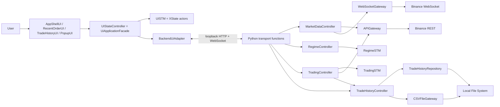

# Binance Auto 통합 시스템 단위 구현 로드맵

| 항목 | 내용 |
|---|---|
| 문서 상태 | 실행 기준 문서 / Phase 6 완료 |
| 기준일 | 2026-08-21 (Asia/Seoul) |
| 기준 커밋 | `c1fa29f7a2b6` (`main`, Phase 6 시작 기준) |
| 구현 목표 | 한 번에 전체를 구현하지 않고, 검증 가능한 단위별로 실제 거래 가능한 통합 시스템까지 완성한다. |
| 최우선 설계 기준 | `Design/Architecture/Communication_Diagram_Message_Flow_Specification.md` |
| 현재 결론 | Phase 6에서 `TYPE_0`을 `SUPPORTED/LOWER_BB` 정확히 109개/`READY`/`SAFE_TERMINATION`으로 고정하고 `TYPE_1`~`TYPE_4`를 registry 없는 `UNSUPPORTED/UNSUPPORTED_TRADING_LOGIC`으로 고정했다. G-07은 pending 주문 우선의 안전 종료로 완결했고 UI와 backend가 schema v2의 같은 5개 coverage를 사용한다. 미지원 추천·표시·선택은 허용하되 start는 0회로 차단하고, Phase 7 session orchestration 전이므로 live `command_enabled=false`다. 다음 작업은 Phase 7 하나다. |

---

## 1. 이 문서를 사용하는 방법

이 문서는 다음 개발 작업의 프롬프트를 대신한다. 구현자는 아래 규칙을 그대로 지킨다.

- [x] 현재 코드와 테스트를 기준으로 완료/미완료 범위를 구분했다.
- [x] 항상 **가장 앞에 있는 미완료 Phase 하나만** 구현한다.
- [x] Phase를 시작하기 전에 그 Phase에 적힌 Communication 메시지 번호와 클래스 Operation을 다시 읽는다.
- [x] 한 Phase에서 다음 Phase의 기능을 미리 구현하지 않는다.
- [x] 각 작업은 테스트를 먼저 추가하거나, 최소한 같은 변경 묶음 안에 테스트를 포함한다. Phase 0은 동작 코드가 없어 기존 전체 baseline을 먼저 재실행했다.
- [x] 완료 조건을 모두 만족한 뒤에만 해당 Phase의 체크박스를 `[x]`로 바꾼다.
- [x] 체크할 때 실행 명령, 통과한 테스트 수, 주요 파일, 커밋 ID를 Phase의 `완료 증거`에 기록한다.
- [x] 실패하거나 미확정인 정책을 임의 기본값으로 숨기지 않는다. Phase 0에서 `TRADING_LOGIC_INCOMPLETE`로 격리했던 상단 BB gap은 Phase 6에서 명시적 `SAFE_TERMINATION`으로 닫았고, 미지원 REGIME fallback은 없다.
- [x] 실제 Binance 주문은 Phase 13의 승인 전까지 실행하지 않는다. 기본 실행 모드는 항상 `disabled` 또는 `fake`다.

상태 표기는 다음처럼 사용한다.

| 표기 | 의미 |
|---|---|
| `[x]` | 코드와 자동 검증으로 완료가 확인됨 |
| `[ ] 부분 완료` | 일부 계층만 있으며 종단 간 계약은 아직 미완료 |
| `[ ] 미구현` | production 구현이 없음 |
| `[ ] 결정 필요` | 업무 규칙 확정 전에는 안전하게 구현할 수 없음 |

### Phase 실행 요청 형식

후속 구현 작업은 다음 한 문장으로 시작할 수 있다.

```text
INTEGRATED_SYSTEM_IMPLEMENTATION_ROADMAP.md를 기준으로 가장 앞의 미완료 Phase 하나만 구현하라.
해당 Phase가 참조하는 Communication Diagram 메시지와 기존 클래스를 먼저 확인하고,
범위를 넘는 기능이나 새 업무 클래스를 만들지 말며, 완료 조건의 테스트와 문서 체크까지 수행하라.
```

- [x] 이 섹션의 실행 규칙을 Phase 0 작업에 적용했고 후속 Phase의 고정 규칙으로 유지한다.

---

## 2. 기준 자료와 우선순위

### 2.1 반드시 먼저 보는 자료

1. `Design/Architecture/Communication_Diagram_Message_Flow_Specification.md`
2. `backend/src/binance_auto_trader/domain/regime/`, `backend/tests/unit/regime/`, `backend/docs/Regime_STM_Implementation_Plan.md`
3. `backend/src/binance_auto_trader/domain/trading/`, `backend/tests/unit/trading/`, `backend/docs/Trading_STM_Implementation_Plan.md`
4. `UI/`의 실제 소스, 테스트, `UI_ARCHITECTURE_AND_FILE_REFERENCE.md`

충돌 시 적용 순서는 다음과 같다.

1. 아직 수정되지 않은 Communication Diagram을 먼저 확인한다.
2. 현재 필요한 Operation이 없으면 다이어그램에 존재하는 클래스 중 책임이 맞는 클래스를 찾는다.
3. 기존 클래스에 넣었을 때 책임이 과도해지고 coupling이 커지며 cohesion이 낮아지는 경우에만 새 production 클래스를 검토한다.
4. Operation 또는 signature를 바꿔야 하면 코드부터 바꾸지 말고 Phase 0에서 Communication 명세를 먼저 동기화한다.
5. 테스트 helper, 불변 DTO/value object, module 함수는 Communication 참여 업무 클래스와 구분한다.

### 2.2 현재 구현 계획 문서의 지위

- `Regime_STM_Implementation_Plan.md`와 `Trading_STM_Implementation_Plan.md`는 순수 STM과 Controller 책임 분리에 대한 상세 설계다.
- `UI_Implementation_Architecture_Plan.md`는 목표 구조 제안서다.
- `UI_ARCHITECTURE_AND_FILE_REFERENCE.md`는 현재 구현의 사실을 설명한다.
- 본 문서는 이들을 통합한 **앞으로의 실행 순서와 완료 판단 기준**이다.

- [x] 기준 자료의 역할과 우선순위를 확인했다.

---

## 3. 2026-08-21 현재 검증된 상태

### 3.1 자동 검증 결과

| 영역 | 실행 결과 | 판단 |
|---|---|---|
| 통합 backend | 표준 `unittest` 290개 전부 통과 | 기존 Regime/Trading/Market/Account/History/bootstrap/transport 회귀와 Phase 6 registry·G-07·snapshot 검증 통과 |
| Phase 6 집중 | 5개 configuration, exact 109 ID, typed unsupported/no-fallback, G-07 boundary/branch/replay, Controller selection, schema/UI gate 통과 | `TYPE_0` 지원과 `TYPE_1`~`TYPE_4` 미지원, pending 우선 종료, zero-command와 주석 규약 검증 |
| package/static | offline wheel build, clean venv 재설치/import, `compileall`, `git diff --check` 성공 | Phase 6 registry/Controller/transport public type이 wheel에 포함됨 |
| UI | Vitest 31개 파일, 136개 테스트 전부 통과 | 5개 coverage strict mapping, 지원 badge, 미지원 선택, start zero-command, resync 후 stale confirmation, 미선택 표시 no-fallback 회귀 포함 |
| UI typecheck/build | `tsc -b --pretty false`, Vite build, Storybook static build 성공 | TypeScript strict schema v2 계약, production bundle과 fake Storybook 정상 |
| actual process trace | `createLiveUiApplication.process.test.mjs` 통과 | inherited-FD token을 받은 실제 Python child snapshot이 React App에 표시되고 `1 → 2 → 3 → 4 → 5` 확인 |
| generated contract | Python schema v2 renderer와 `backendContracts.generated.ts` byte-for-byte 일치 | `logic_coverage`/`command_enabled`를 추가하고 Python schema를 authoritative source로 유지 |
| Git 범위 | Phase 6 registry/G-07/Controller selection/transport/UI gate/test/docs 변경만 포함 | Phase 7 session, 실제 주문, credential과 Binance payload/client 변경 없음 |
| Tauri/Rust | memory-only one-shot descriptor source와 unit test 3개 추가, Rust toolchain 명령은 미실행 | 현 환경에 `cargo`/`rustc`가 없으며 sidecar spawn/package/shutdown은 Phase 12에서 검증 |

현재 환경에는 `pytest`가 설치되어 있지 않아 Python 검증은 프로젝트가 실제 사용하는
표준 `unittest`로 수행했다. offline wheel을 clean venv에
`--force-reinstall --no-deps --no-index`로 설치한 뒤 Phase 6 public type을 import했다.
UI는 설치된 `node_modules/.bin`으로 실제 loopback child-process test까지 다시 검증했다.
Rust toolchain은 설치되어 있지 않아 native descriptor unit test 3개는 실행하지 못했으며,
이 사실을 Phase 12 인계 조건으로 유지한다.

### 3.2 현재 완료된 핵심

- [x] 두 STM이 `backend/src/binance_auto_trader/domain/` 하나의 설치 가능한 package로 통합되어 있다.
- [x] `domain/common/enums.py`의 `RegimeType.TYPE_0`~`TYPE_4`가 두 STM의 유일한 Python REGIME enum이다.
- [x] `RegimeSTM`의 상태, 이벤트, 불변 평가 Context, Action request, 결과, guard, 13개 transition registry가 구현되어 있다.
- [x] `RegimeSTM`은 Controller·Gateway·UI를 import하지 않는 순수 결정 엔진이다.
- [x] `TradingSTM`의 계층/병렬 상태 구성, 이벤트, 불변 Context view, Action request, 109개 transition ID가 구현되어 있다.
- [x] `TradingSTM`의 Case C 우선권, 중지 우선권, 주문 결과 microstep, stale event와 context version 방어가 테스트되어 있다.
- [x] Phase 6 불변 `TradingLogicConfiguration` 5개가 canonical REGIME 순서를 보존하고 `TYPE_0`만 exact 109개 lower-BB registry와 `SAFE_TERMINATION`을 선택한다.
- [x] `TradingSTM` 생성자와 factory에는 암묵적 `TYPE_0` 기본값이 없고, `TYPE_1`~`TYPE_4`는 `UnsupportedTradingLogicError(code=UNSUPPORTED_TRADING_LOGIC)`로 거부한다.
- [x] G-07은 `realtime_price >= upper_band`에서 pending 주문 취소·같은 ID reconciliation을 우선하고, pending 없는 포지션은 STOPPING·force-sell, 둘 다 없으면 즉시 runtime 종료로 완결한다.
- [x] canonical `Interval`과 Decimal/UTC 불변 `Kline`, 원자적·versioned `MarketSnapshot`이 구현되어 있다.
- [x] backend `MarketDataController`가 fake client 경계에서 WS start → REST load → drain/merge → snapshot update를 직렬 실행한다.
- [x] Binance Spot REST 12-field Kline과 raw/combined WebSocket Kline을 Decimal·UTC 내부 타입으로 엄격히 정규화한다.
- [x] `IndicatorSnapshot`이 closed 4H EMA9/slope/swing과 진행봉 live EMA9를 같은 MarketSnapshot version provenance로 보존한다.
- [x] `RegimeController`가 initial/4H close 두 microstep Action을 직렬 실행하고 추천/선택 분리, candle dedup, stale/failure trace를 소유한다.
- [x] `MarketDataController`에서 메시지 `1.4`~`1.5.1`의 fake vertical slice가 실제 `RegimeSTM` 추천 결과까지 연결된다.
- [x] `Account`가 full/partial snapshot, 자산별 free/locked Decimal, ETH current price·valuation, UTC updated_at과 monotonic version을 보존하며 `get_holdings()`를 제공한다.
- [x] `APIGateway`와 `WebSocketGateway`가 공식 Spot account payload를 `AccountSnapshot`으로 정규화하고 `outboundAccountPosition`의 변경 자산만 absolute patch로 적용한다.
- [x] account stream은 source time·fingerprint·subscription generation으로 stale/duplicate callback을 차단하고 callback·termination·start failure를 close 또는 propagate한다.
- [x] `TradingController.load_account()`가 REST fetch → Account commit → account stream start 순서를 보장하며 REST 실패 시 stream을 시작하지 않는다.
- [x] ADR-004 JSONL v1의 frozen `Trade`, order ID idempotent `TradeHistory`, KST inclusive-date/side query와 D-11 `Performance` startup 복원이 구현되어 있다.
- [x] Trade 수수료는 USDT 동일값, ETH per-fill quote aggregate의 zero-pair 일관성을 검증하고 제3 asset은 `FEE_ASSET_CONVERSION_REQUIRED`로 fail closed한다.
- [x] `TradeHistoryRepository`가 streaming startup read, missing/empty 처리, strict partial-tail recovery와 order ID index rebuild를 수행한다.
- [x] `TradeHistoryController`가 Repository → TradeHistory → Performance를 local에서 완성한 뒤 원자적으로 publish한다.
- [x] 메시지 `2`~`2.2.1`과 `3`~`3.3`의 구조화 trace가 caller/receiver, command ID, state version, result/failure code와 secret 비노출을 검증한다.
- [x] UI의 Dashboard, Trade History, modal, REGIME 선택, start/stop 확인, split order, CSV form, 차트, Storybook 기준 화면이 구현되어 있다.
- [x] UI 가격 차트는 공개 Binance REST/WebSocket에서 `1m`, `30m`, `4h`, `1d`를 조회한다.
- [x] UI 차트는 WebSocket을 먼저 열고 REST를 조회한 뒤 동일 봉에서는 WebSocket 값을 우선하여 병합한다.
- [x] UI의 backend 명령은 `UiCommandPort` 뒤에 격리되어 있다.
- [x] application bootstrap이 market·Regime readiness → Account REST+stream → History/Performance 순서를 고정하고 마지막 단계 뒤에만 ready state를 원자 publish한다.
- [x] loopback transport가 IPv4 `127.0.0.1` random port, launch별 256-bit token, Host/Origin/CORS/Bearer, WebSocket first-frame 인증과 strict envelope를 구현한다.
- [x] snapshot DTO와 마지막 event `sequence`를 같은 application `RLock` 임계 구역에서 읽고 event replay를 10,000개 또는 15분으로 제한한다.
- [x] Python transport schema가 generated TypeScript contract의 authoritative source이며 byte drift test가 존재한다.
- [x] schema v2 trading snapshot이 5개 `logic_coverage(regime_type, support_status, start_guard)`와 live `command_enabled=false`를 UI에 제공한다.
- [x] UI는 5개 REGIME의 지원 상태를 표시하고 미지원 추천·표시·선택을 유지하되, 시작 요청과 stale 확인에서 backend command를 0회로 차단한다.
- [x] production UI는 coherent ready snapshot을 먼저 적용한 뒤 actor와 event stream을 시작한다.
- [x] duplicate/out-of-order/event ID 중복을 거르고 gap·session change에서는 snapshot-first full resync한다.
- [x] 실제 Python child process의 read-only ETHUSDT/USDT snapshot을 React App에 표시하고 메시지 `1`~`5` 통합 trace를 검증했다.
- [x] backend market event parity 전에는 공개 Binance chart를 교체하지 않고 display-only로 유지한다.

### 3.3 현재 완료되지 않은 핵심

- [ ] 부분 완료 — `TradingController`는 `load_account()`과 `fetch_selected_trading_logic()` slice, `TradeHistoryController`는 `load_trade_history()` slice가 구현됐다. session/context/start/stop은 Phase 7, order Action과 record 반영은 Phase 8, details/export는 Phase 10~11 범위다.
- [ ] 부분 완료 — 공식 account REST와 user-data stream payload 정규화는 주입 fake client 경계에서 구현됐지만 실제 Binance client 조립, credential/signature/session 관리와 order REST는 Phase 9 범위다.
- [ ] 부분 완료 — backend `Account`, `Trade`, `TradeHistory`, `Performance`는 구현됐고 `Order`와 mutable `Position`은 아직 없다. Order/ExecutionSummary 기반 Trade 생성과 신규 거래 성과 반영은 Phase 8 범위다.
- [ ] 부분 완료 — JSONL `TradeHistoryRepository`의 startup read/recovery/index는 구현됐지만 append/save는 Phase 8, `stream_trades`와 CSV writer는 Phase 11 범위다.
- [ ] 부분 완료 — Python application bootstrap, loopback HTTP/WebSocket와 backend event stream은 구현됐다. Tauri sidecar spawn, descriptor stage, package와 안전 종료 lifecycle은 Phase 12 범위다.
- [ ] 부분 완료 — production read path는 `BackendUiAdapter`를 사용하고 demo/Storybook/tests는 `FakeUiCommandAdapter`를 유지한다. Phase 6 live trading command는 `command_enabled=false`/`FEATURE_NOT_AVAILABLE`이며 실제 session/history query/CSV는 후속 Phase 범위다.
- [ ] 부분 완료 — authoritative backend market/regime/account/history snapshot의 UI read는 연결됐지만 실제 Binance client와 Trading runtime은 아직 연결되지 않았다. UI 공개 차트는 parity 전 display-only로 유지한다.
- [x] 완료 — strict `TYPE_0`~`TYPE_4` ↔ `type0`~`type4` transport 변환, REGIME별 전략 coverage/start guard, G-07 상단 BB 안전 종료와 UI zero-command gate를 Phase 6에서 완료했다.
- [ ] 미구현 — 실제 주문을 제출하고 fill을 Position/History/Performance에 반영하는 Case 2 pipeline이 없다.
- [ ] 부분 완료 — 메시지 `1`~`5` actual-process startup trace는 injected fake Binance와 temporary storage 경계에서 UI까지 검증됐다. 실제 Binance/order/filesystem을 포함한 전체 Communication Case는 아직 없다.

### 3.4 Phase 1~6에서 해소한 위험과 남은 계약 공백

Phase 1에서 두 독립 distribution을 `backend/` 하나로 통합했다. root의
`RegimeSTM/`·`TradingSTM/` source tree를 제거했고, clean environment에 설치한
하나의 wheel에서 두 STM을 동시에 import했다.

Phase 2에서 중복 `Interval` 정의 없이 common canonical enum을
market/regime이 공유하고, 실패·disconnect·concurrent reinitialize에서 기존
snapshot version을 역행시키지 않는 full-resync 계약을 고정했다.

Phase 3에서 Decimal 4H 지표 공식과 golden vector를 production code에 고정하고,
RegimeSTM의 Action 요청을 Controller만 수행하도록 연결했다. recommendation과
selection은 분리했고 duplicate/stale/과거 candle 및 입력 실패는 마지막 정상 추천을
보존하는 typed trace로 닫았다.

Phase 4에서 Decimal/UTC Account, 공식 Spot account payload 정규화와 REST commit 후
account stream 시작 순서를 고정했다. account stream은 변경 자산 absolute patch,
stale/duplicate/generation 방어와 callback·termination·start failure 처리를 갖는다.
ADR-004 JSONL v1 Trade, KST TradeHistory query, D-11 Performance, strict partial-tail
recovery Repository와 atomic TradeHistoryController publication을 구현했고 메시지
`2`~`3.3`의 구조화 trace를 고정했다. Phase 4 시점에는 주문·append·CSV·transport
책임을 후속 Phase에 남겼다.

Phase 5에서 하나의 application `RLock`으로 startup readiness, Account stream callback과
snapshot/sequence publication을 직렬화했다. loopback transport는 random port와 launch별
token, Host/Origin/CORS/Bearer와 WebSocket first-frame auth, strict JSON/idempotency,
bounded replay/resync를 fail closed로 고정했다. generated TypeScript drift test와 UI의
snapshot-first/StrictMode/reconnect 경계를 추가했으며 모든 write command는 owner Operation이
생길 때까지 `FEATURE_NOT_AVAILABLE`이다.

Phase 6에서 Phase 0이 `TRADING_LOGIC_INCOMPLETE`로 격리했던 `TYPE_0`
상단 BB gap을 G-07 `SAFE_TERMINATION`으로 닫았다. 새 상단 매매 전략을
추측하지 않고 기존 STOPPING/reconciliation/runtime cleanup 계약을
재사용했다. immutable 5-row registry, `TradingController` selection façade,
schema v2 snapshot/UI gate를 함께 고정했으며 session/start/stop orchestration은
Phase 7에 남겼다.

남은 표현과 지원 상태는 다음과 같다.

| 위치 | 현재 값 |
|---|---|
| backend domain | 유일한 `RegimeType.TYPE_0` ~ `TYPE_4` |
| UI wire 값 | `'type0'` ~ `'type4'` |
| `TYPE_0` TradingSTM registry | `SUPPORTED`, `LOWER_BB` 정확히 109개, `READY`, `SAFE_TERMINATION` |
| `TYPE_1`~`TYPE_4` TradingSTM registry | `UNSUPPORTED`, transition source 없음, `UNSUPPORTED_TRADING_LOGIC` |
| live trading command | Phase 7 전 `command_enabled=false`; 지원 `TYPE_0`도 실제 start command는 아직 실행하지 않음 |

Domain에는 UI wire 변환을 넣지 않았다. strict `TYPE_0` ↔ `type0` 변환은
transport 계층에서만 수행하고 private `LOWER_BB` key와 transition ID는 UI에
노출하지 않는다. 미지원 REGIME은 추천·표시·선택하되 start만
`UNSUPPORTED_TRADING_LOGIC`으로 차단하고 `TYPE_0`으로 fallback하지 않는다.

- [x] 중복 package와 transport 공백을 해소했고 Phase 6 registry/start guard/G-07/UI coverage gate까지 검증했다.

---

## 4. Communication Diagram 클래스별 구현 현황

`완료`는 해당 클래스의 production 책임이 현재 범위에서 실제로 존재할 때만 사용한다. UI fixture나 snapshot type만 있는 경우는 부분 완료다.

| 체크 | Communication 클래스 | 현재 상태와 근거 | 남은 일 |
|---|---|---|---|
| [x] | `AppShellUI` | React `App`, `AppHeader`, modal host와 live snapshot/loading/typed failure Boundary를 구현 | 없음 |
| [ ] | `UIStateController` | `UiApplicationFacade`가 snapshot/event bridge와 Phase 6 REGIME coverage badge·start zero-command·stale confirmation guard를 조정 | Phase 7/10/11 live command와 query/export 조정 |
| [x] | `UISTM` | root/feature XState actor와 Phase 5 snapshot 전체 동기화/reconnect를 구현 | 후속 command ack E2E 추가 |
| [ ] | `TradingController` | `load_account()` slice와 REST commit 후 stream start/failure 순서, `fetch_selected_trading_logic()`의 strict configuration 선택을 구현 | Phase 7 session/context/STM/stop과 Phase 8 order Action 실행 |
| [ ] | `TradingSTM` | exact 109개 lower-BB transition·queue, 5-row immutable coverage, typed unsupported/no-fallback, G-07 안전 종료를 구현 | Phase 7 session에서 선택된 STM run/Action 실행 연결 |
| [ ] | `TradingContext` | 읽기 전용 `TradingContextView`/runtime snapshot만 구현 | mutable owner, `initialize`, result/action 적용, version 증가, split ratio 구현 |
| [ ] | `MarketDataController` | backend authoritative WS-first/REST/merge/snapshot 초기화와 RegimeController 최초/full-resync 평가를 구현 | 4H/30m live event 발행과 후속 runtime 연결 |
| [ ] | `APIGateway` | Kline과 공식 Spot account 전체 잔액·updateTime 정규화를 구현 | 실제 authenticated client 조립과 order operation |
| [ ] | `WebSocketGateway` | Kline과 `outboundAccountPosition`/`eventStreamTerminated`, stale·duplicate·generation·callback failure 처리를 구현 | 실제 authenticated client/session/reconnect 조립 |
| [x] | `MarketSnapshot` | canonical Decimal/UTC Kline 4주기, current ETH price, monotonic version과 same-version 지표 파생을 구현 | 없음 |
| [ ] | `RegimeController` | Phase 3 지표 계산, RegimeSTM Action 실행, 추천/선택 분리, dedup/stale/error trace와 Phase 5 read DTO를 구현 | Phase 7 `set_regime_type`/TradingController 연결 |
| [x] | `IndicatorSnapshot` | Decimal EMA9 series/slope, strict swing, live EMA9과 source version/candle/time provenance를 구현 | 없음 |
| [x] | `RegimeSTM` | 순수 engine, 13개 transition과 Controller 두 microstep 통합 구현 | 없음 |
| [ ] | `Order` | 없음 | 최초/재조회 결과, fills, execution summary 구현 |
| [ ] | `Position` | 불변 `PositionSnapshot`만 존재 | cost basis와 execution 반영을 가진 entity 구현 |
| [ ] | `Trade` | frozen JSONL v1 entity, strict Decimal/plain/UTC/schema·realized result·fee conversion과 Phase 5 wire mapper 구현 | Phase 8의 Order/ExecutionSummary 기반 생성 |
| [x] | `TradeHistory` | constructor, same-content idempotent `add_trade`/conflict, KST inclusive-date/side `find` 구현 | 없음 |
| [ ] | `Performance` | D-11 startup aggregate, `get_performance`와 Phase 5 startup summary mapper 구현 | Phase 8 `calculate_realized_result`/`apply_new_trade` |
| [ ] | `TradeHistoryController` | `load_trade_history`의 local build, atomic publish와 Phase 5 snapshot read 구현 | Phase 10 details/query와 Phase 11 export |
| [ ] | `TradeHistoryRepository` | streaming startup read, strict recovery, order index rebuild 구현 | Phase 8 append/save와 Phase 11 `stream_trades` |
| [x] | `Account` | balance/current price/valuation/UTC/version/`get_holdings`, transport DTO와 update event 연결 구현 | 없음 |
| [x] | `RecentOrderUI` | recent-orders Boundary가 구현됨 | backend `ORDER_EXECUTED` event 연결 |
| [x] | `TradeHistoryUI` | page, filter, empty/error/retry UI와 startup rows/summary live read 구현 | Phase 10 live filter/details query 연결 |
| [x] | `TradeHistoryQuery` | backend LocalDate·side 불변 query와 KST 경계 구현 | 없음; period→date/wire mapping은 Controller/transport 책임 |
| [x] | `PopupUI` | CSV dialog와 modal state로 구현 | native picker/실제 export 결과 연결 |
| [ ] | `CSVExportOptions` | TypeScript draft와 UI validation만 구현 | backend 최종 검증 value object 구현 |
| [ ] | `CSVFileGateway` | fake receipt만 반환 | native picker realization과 atomic CSV write 구현 |

- [x] 27개 Communication 클래스의 현재 상태를 검토했다.

---

## 5. Communication Case별 종단 간 현황

| Case | 현재 완료 범위 | 현재 끊기는 지점 | 완료 Phase |
|---|---|---|---|
| Case 1 Start/Stop | UI 확인 흐름, RegimeSTM/TradingSTM core, backend market·Regime·Account·History/Performance startup, actual-process 메시지 `1`~`5`, Phase 6 REGIME coverage·G-07 정책·UI zero-command | Phase 7 session/start/stop, Phase 9 실제 Binance client, Phase 12 sidecar | Phase 7, 9, 12 |
| Case 2 Buy/Sell | TradingSTM이 주문 Action request를 결정 | `TradingController -> Order -> APIGateway -> Position -> History -> orderFinished` 전체 | Phase 8~9 |
| Case 3 Trade History | 화면/filter actor, backend TradeHistory/Query, JSONL startup Repository/Performance와 loopback startup rows/summary read | `TradeHistoryController.get_trade_details`, live filter/query/event refresh | Phase 10 |
| Case 4 CSV Export | popup, date/file validation, fake picker/receipt, backend KST `TradeHistoryQuery` | backend option 검증, `stream_trades`, native picker, 실제 atomic file write | Phase 11~12 |

현재 기준으로 live trading 준비 완료라고 볼 수 있는 Case는 **0개**다. startup read 경로는
application/transport/UI까지 연결됐지만 Trading session, 주문 pipeline, 실제 Binance
adapter와 packaged sidecar가 의도적으로 후속 Phase에 남아 있기 때문이다.

- [x] 네 Communication Case의 종단 간 중단 지점을 확인했다.

---

## 6. 클래스와 Operation 추가 원칙

### 6.1 기존 클래스에 배치할 Operation

| 필요한 Operation | Communication 확인 결과 | 배치 결정 |
|---|---|---|
| `handle(event, context) -> RegimeSTMResult` | 8.13의 `RegimeSTM`이 guard/전이 책임을 이미 소유 | 새 클래스 없이 `RegimeSTM`에 canonical Operation으로 명세 추가 |
| 구체 주문 결과를 받는 `order_finished(event, context)` | 8.5 `TradingSTM.orderFinished()`가 이미 존재 | 새 클래스 없이 기존 Operation signature를 구체화 |
| 4H close 처리와 Kline event 정규화 | 8.7 `MarketDataController`가 시장 snapshot 흐름을 소유 | public 필요 시 명세 추가, 아니면 private method로 유지 |
| STM Action dispatcher와 event loop | 8.4 `TradingController`가 주문 실행 조정 책임을 소유 | `TradingController` private method/module로 구현 |
| REGIME evaluation loop/action dispatcher | 8.11 `RegimeController`가 지표와 추천 연결 책임을 소유 | `RegimeController` private method/module로 구현 |
| startup orchestration | 메시지 1~5의 호출자가 `UIStateController` | `UiApplicationFacade` live bootstrap에서 수행 |

### 6.2 새 production 클래스가 허용되는 유일한 예외

현재 계획에서 새 업무 domain class는 추가하지 않는다. 다만 Communication Diagram이 in-process 논리 호출을 표현하고 현재 제품이 React/Tauri와 Python의 process boundary를 사용하므로, 다음 하나의 transport adapter는 필요하다.

| 새 구현 클래스 | 필요한 이유 | 새 클래스가 없을 때 생기는 문제 | 제한 |
|---|---|---|---|
| `BackendUiAdapter` | `UiCommandPort`를 HTTP command/query와 WebSocket event로 실현 | React Boundary 또는 `UiApplicationFacade`가 HTTP/WS serialization, token, reconnect까지 떠안아 coupling이 커짐 | 업무 판단 금지, wire 변환·연결 수명주기만 소유 |

`SerialEventQueue`, `RunToCompletionEventProcessor`, immutable event/result/action DTO, Kline/Fill 같은 value type, test double은 업무 collaboration을 새로 만드는 것이 아니라 기존 클래스의 구현 세부 또는 공통 타입이다. 이들은 public use-case 책임을 가져서는 안 된다.

새 production 클래스를 더 제안하려면 아래를 모두 문서에 먼저 기록한다.

- [ ] Communication Diagram의 기존 27개 클래스와 Operation을 재검토했다.
- [ ] 후보 책임을 기존 클래스에 넣었을 때의 coupling/cohesion 문제를 구체적으로 적었다.
- [ ] 새 클래스의 단일 책임, 입력, 출력, 소유 상태, 의존 방향을 적었다.
- [ ] Communication/Class Diagram과 본 파일 트리를 먼저 갱신했다.
- [ ] architecture test로 새 경계를 고정했다.

- [ ] 전체 구현이 완료될 때까지 불필요한 새 업무 클래스를 만들지 않았다.

---

## 7. 구현 전에 반드시 잠가야 하는 결정

이 표가 Phase 0의 핵심 산출물이다. `권장 결정`은 구현 기본안이며, 기존 업무 규칙과 다르면 코드가 아니라 명세를 먼저 수정한다.

| ID | 결정 항목 | 현재 충돌/공백 | 권장 결정 | 완료 |
|---|---|---|---|---|
| D-01 | canonical `RegimeType` | Python 두 package와 TS가 서로 다름 | Domain `TYPE_0`~`TYPE_4`, wire `type0`~`type4`의 strict 일대일 변환. `LOWER_BB`는 private registry key | [x] ADR-001 |
| D-02 | REGIME별 Trading logic | Phase 0에서는 `TYPE_0` 상단 BB 정책이 비어 있었고 UI는 5개를 선택 | Phase 6 현재 `TYPE_0 = SUPPORTED/LOWER_BB` exact 109/`READY`/`SAFE_TERMINATION`; `TYPE_1`~`TYPE_4 = UNSUPPORTED`/registry 없음/`UNSUPPORTED_TRADING_LOGIC`. 미지원 선택은 보존하되 start 0회, fallback 금지 | [x] ADR-001/Phase 6 |
| D-03 | RegimeSTM canonical signature | Communication은 `run() -> RegimeType`, 구현은 `handle() -> RegimeSTMResult` | `handle(event, context?) : RegimeSTMResult`가 canonical이고 Controller façade가 두 microstep Action 적용 뒤 타입 반환 | [x] ADR-001 |
| D-04 | TradingSTM 주문 완료 signature | Communication은 parameter 없는 `orderFinished()` | `orderFinished(event, context) : TradingSTMResult` 검증 adapter, concrete normalized outcome만 허용 | [x] ADR-001 |
| D-05 | position 없는 stop | Communication 4.7은 무조건 sell-all, UI는 position 유무 분기 | 항상 `STOP_CONFIRMED`; quantity 0/no pending은 sell 0회 종료, 보유는 force-sell, pending은 query/cancel/reconcile 후 잔여 매도 | [x] ADR-003 |
| D-06 | 거래 상품 | UI/계좌는 ETH spot 보유량 중심이나 일부 설계 문구는 short를 암시 | Binance Spot `ETHUSDT` long-only. Margin/Futures/short/naked sell 금지 | [x] ADR-003 |
| D-07 | 4H 지표 공식 | 최소 candle, slope 단위, swing threshold, live price 시점이 미확정 | 14개 확정봉, EMA9 SMA seed/alpha 0.2, 최근 6개 OLS/current price, strict pivot 2/2와 0.30%, same-version live EMA9를 golden vector로 고정 | [x] ADR-004 |
| D-08 | retry/partial fill/reconcile | 간격·최대 횟수·잔여 주문 정책 미확정 | 같은 주문 조회 `1/2/4/8초 ±20%` 4회, 실제 fill 우선, terminal partial BUY no top-up, SELL 잔여량만 retry, force-sell 3초 최대 4회, restart lock 표 확정 | [x] ADR-002 |
| D-09 | REGIME 실행 중 변경 | UI는 적용 command가 가능하고 Communication은 start 전 선택 흐름 | active session hot-swap 금지. `TRADING_ACTIVE`로 거부하고 stop 완료 뒤 선택/start 요구 | [x] ADR-001/003 |
| D-10 | 거래 이력 형식 | file serialization schema와 crash 복구 규칙 없음 | UTF-8 no-BOM JSONL v1, Decimal string, UTC, order ID idempotency, partial last line만 보존 후 truncate; malformed middle은 fatal | [x] ADR-004 |
| D-11 | Performance 공식 | 수익률/수수료/승패의 정확한 분모·일 경계 미확정 | average cost + buy fee, net sell proceeds - allocated cost, realized return 분모, KST day, win/loss/breakeven을 numeric example로 고정 | [x] ADR-004 |
| D-12 | History summary 의미 | filter 변경 시 summary 재계산 여부 충돌 | summary는 account day/전체 history 고정, table row만 period/side filter; UI label에 범위 명시 | [x] ADR-004 |
| D-13 | CSV 세부 정책 | 빈 결과, encoding, overwrite 규칙 미확정 | KST inclusive date, schema v1 column, UTF-8 BOM/CRLF, empty 오류, overwrite 금지, same-dir temp + no-replace atomic rename | [x] ADR-004 |
| D-14 | transport/security | 실제 endpoint, event sequence, token handshake 없음 | `/v1/*` endpoint, response/event envelope, `127.0.0.1` random port, per-launch 256-bit token, monotonic sequence/replay/resync 고정. Phase 6 `logic_coverage` 계약은 schema v2 | [x] ADR-005/Phase 6 |
| D-15 | live 안전장치 | 실행 mode와 승인 절차 없음 | `disabled/fake/testnet/live`, default `disabled`; live는 commit 승인, 매 실행 확인과 non-null order/position/loss 한도 없이는 fail closed | [x] ADR-003 |

특히 D-02는 누락된 투자 전략을 코드가 추측하지 못하게 하는 gate다. Phase 6은 lower-BB Event-Action Table을 `TYPE_0`에만 연결했고 나머지 네 REGIME을 미지원으로 보존했다. 새 REGIME을 지원할 때는 먼저 해당 Event-Action Table과 state diagram을 확정해야 한다.

- [x] D-01~D-15를 Communication 명세와 ADR-001~ADR-005에 반영했다.

---

## 8. 목표 런타임 구조



의존성 규칙은 다음과 같다.

- [x] React Boundary는 Binance SDK, filesystem, Python domain 규칙을 import하지 않는다.
- [x] `BackendUiAdapter`는 업무 guard를 판단하지 않는다.
- [x] Controller는 STM의 guard를 중복 구현하지 않는다.
- [x] STM은 Controller, Gateway, Repository, clock, file, network를 import하지 않는다.
- [x] Entity는 UI/transport DTO를 import하지 않는다.
- [x] Gateway는 Binance 원본 응답을 domain 밖으로 노출하지 않는다.
- [x] 모든 금융 수치는 Python `Decimal`, wire에서는 decimal string을 사용한다.
- [x] 저장 시각은 UTC aware datetime, 사용자 날짜 경계는 `Asia/Seoul`로 명시한다.

- [ ] 목표 런타임의 의존 방향을 architecture test로 고정했다.

---

## 9. 최종 예상 디렉터리와 파일 트리

아래는 모든 Phase가 끝난 뒤의 human-maintained source 기준 트리다. `node_modules`, `dist`, `target`, `storybook-static`, cache, runtime data와 build 산출물은 제외한다. `RegimeSTM/`과 `TradingSTM/`은 Phase 1에서 `git mv`로 `backend/`에 통합했고, 회귀 검증 후 중복 source tree를 제거했다.

```text
Binance_Auto/
├── README.md
├── CODING_CONVENTIONS.md
├── INTEGRATED_SYSTEM_IMPLEMENTATION_ROADMAP.md
├── Design/
│   ├── Architecture/
│   │   ├── Communication_Diagram_Message_Flow_Specification.md
│   │   ├── Communication_Diagram/
│   │   └── Decisions/
│   │       ├── ADR-001-canonical-regime-and-trading-mapping.md
│   │       ├── ADR-002-order-retry-and-reconciliation.md
│   │       ├── ADR-003-stop-and-product-mode.md
│   │       ├── ADR-004-persistence-performance-and-csv.md
│   │       └── ADR-005-loopback-transport-and-sidecar-security.md
│   └── ...                                  # 기존 설계 산출물 유지
├── backend/
│   ├── README.md
│   ├── pyproject.toml
│   ├── uv.lock
│   ├── src/
│   │   └── binance_auto_trader/
│   │       ├── __init__.py
│   │       ├── bootstrap/
│   │       │   ├── __init__.py
│   │       │   ├── application.py           # 기존 클래스 인스턴스 조립
│   │       │   └── lifecycle.py             # start/flush/close 순서 함수
│   │       ├── domain/
│   │       │   ├── __init__.py
│   │       │   ├── common/
│   │       │   │   ├── __init__.py
│   │       │   │   ├── enums.py             # canonical RegimeType/Interval/side/status
│   │       │   │   └── validation.py
│   │       │   ├── market/
│   │       │   │   ├── __init__.py
│   │       │   │   ├── kline.py             # 공통 Kline value type
│   │       │   │   ├── market_snapshot.py   # MarketSnapshot
│   │       │   │   └── indicator_snapshot.py# IndicatorSnapshot
│   │       │   ├── regime/
│   │       │   │   ├── __init__.py
│   │       │   │   ├── action_requests.py
│   │       │   │   ├── evaluation.py
│   │       │   │   ├── events.py
│   │       │   │   ├── guards.py
│   │       │   │   ├── results.py
│   │       │   │   ├── states.py
│   │       │   │   ├── stm.py               # RegimeSTM
│   │       │   │   └── transitions.py
│   │       │   ├── trading/
│   │       │   │   ├── __init__.py
│   │       │   │   ├── account.py           # Account
│   │       │   │   ├── action_requests.py
│   │       │   │   ├── context.py           # TradingContext + immutable view
│   │       │   │   ├── event_queue.py
│   │       │   │   ├── events.py
│   │       │   │   ├── logic_registry.py    # Phase 6 REGIME coverage
│   │       │   │   ├── order.py             # Order/Fill/ExecutionSummary
│   │       │   │   ├── position.py          # Position
│   │       │   │   ├── results.py
│   │       │   │   ├── states.py
│   │       │   │   ├── stm.py               # TradingSTM
│   │       │   │   └── transitions/
│   │       │   │       ├── __init__.py
│   │       │   │       ├── base.py
│   │       │   │       ├── catalog.py
│   │       │   │       ├── helpers.py
│   │       │   │       ├── global_transitions.py
│   │       │   │       ├── ownership_transitions.py
│   │       │   │       ├── case_b_signal_transitions.py
│   │       │   │       ├── case_c_signal_transitions.py
│   │       │   │       ├── case_b_position_transitions.py
│   │       │   │       └── case_c_position_transitions.py
│   │       │   └── history/
│   │       │       ├── __init__.py
│   │       │       ├── trade.py              # Trade
│   │       │       ├── trade_history.py      # TradeHistory
│   │       │       ├── performance.py        # Performance
│   │       │       ├── query.py              # TradeHistoryQuery
│   │       │       └── csv_export_options.py # CSVExportOptions
│   │       ├── application/
│   │       │   ├── __init__.py
│   │       │   ├── market_data_controller.py # MarketDataController
│   │       │   ├── regime_controller.py      # RegimeController
│   │       │   ├── trading_controller.py     # TradingController
│   │       │   └── trade_history_controller.py# TradeHistoryController
│   │       ├── adapters/
│   │       │   ├── __init__.py
│   │       │   ├── binance/
│   │       │   │   ├── __init__.py
│   │       │   │   ├── api_gateway.py        # APIGateway
│   │       │   │   ├── websocket_gateway.py  # WebSocketGateway
│   │       │   │   └── mappers.py
│   │       │   ├── persistence/
│   │       │   │   ├── __init__.py
│   │       │   │   └── trade_history_repository.py
│   │       │   └── filesystem/
│   │       │       ├── __init__.py
│   │       │       └── csv_file_gateway.py
│   │       └── transport/
│   │           ├── __init__.py
│   │           ├── app.py
│   │           ├── contracts.py
│   │           ├── event_stream.py
│   │           └── routes/
│   │               ├── __init__.py
│   │               ├── system.py
│   │               ├── snapshot.py
│   │               ├── regime.py
│   │               ├── trading.py
│   │               ├── trade_history.py
│   │               └── csv_export.py
│   └── tests/
│       ├── architecture/
│       │   ├── test_dependency_boundaries.py
│       │   ├── test_communication_operations.py
│       │   └── test_contract_schema_drift.py
│       ├── unit/
│       │   ├── regime/                       # 기존 RegimeSTM tests 이동
│       │   ├── trading/                      # 기존 TradingSTM tests 이동
│       │   ├── market/
│       │   └── history/
│       ├── integration/
│       │   ├── test_startup_flow.py
│       │   ├── test_regime_evaluation_flow.py
│       │   ├── test_account_stream_flow.py
│       │   ├── test_buy_sell_flow.py
│       │   ├── test_stop_flow.py
│       │   ├── test_trade_history_flow.py
│       │   ├── test_csv_export_flow.py
│       │   └── test_transport_contract.py
│       ├── scenario/
│       │   ├── test_case_b_scenarios.py
│       │   ├── test_case_c_scenarios.py
│       │   ├── test_reconciliation_scenarios.py
│       │   └── test_restart_recovery.py
│       └── fixtures/
│           ├── market_snapshots/
│           ├── binance_responses/
│           └── golden_trades.jsonl
├── UI/
│   ├── .storybook/
│   │   ├── main.ts
│   │   └── preview.ts
│   ├── apps/desktop/src-tauri/
│   │   ├── Cargo.toml
│   │   ├── build.rs
│   │   ├── tauri.conf.json
│   │   ├── capabilities/main-window.json
│   │   └── src/
│   │       ├── main.rs
│   │       ├── lib.rs
│   │       ├── sidecar.rs                    # sidecar lifecycle 함수
│   │       └── dialog.rs                     # directory picker 함수
│   ├── src/
│   │   ├── app/
│   │   │   ├── App.tsx
│   │   │   ├── App.module.css
│   │   │   ├── bootstrap/
│   │   │   │   ├── createDemoUiApplication.ts
│   │   │   │   ├── createLiveUiApplication.ts
│   │   │   │   ├── demoFixtures.ts
│   │   │   │   └── index.ts
│   │   │   ├── components/
│   │   │   ├── control/UiApplicationFacade.ts
│   │   │   ├── hooks/
│   │   │   ├── machines/uiShellMachine.ts
│   │   │   ├── presenters/
│   │   │   ├── providers/AppProviders.tsx
│   │   │   └── runtime/
│   │   ├── assets/figma/                     # 기존 SVG 유지
│   │   ├── features/
│   │   │   ├── account-summary/
│   │   │   ├── app-exit/
│   │   │   ├── connection-status/
│   │   │   ├── csv-export/
│   │   │   ├── price-chart/
│   │   │   ├── recent-orders/
│   │   │   ├── regime-selection/
│   │   │   ├── split-order/
│   │   │   ├── trade-history/
│   │   │   └── trading-control/
│   │   ├── routes/
│   │   │   ├── dashboard/
│   │   │   └── trade-history/
│   │   ├── shared/
│   │   │   ├── api/
│   │   │   │   ├── BackendUiAdapter.ts
│   │   │   │   ├── BackendUiAdapter.test.ts
│   │   │   │   └── backendEventMapper.ts
│   │   │   ├── contracts/
│   │   │   │   ├── uiContracts.ts
│   │   │   │   ├── backendContracts.generated.ts
│   │   │   │   └── index.ts
│   │   │   ├── ports/UiCommandPort.ts
│   │   │   ├── testing/FakeUiCommandAdapter.ts
│   │   │   ├── hooks/
│   │   │   ├── styles/
│   │   │   └── ui/
│   │   ├── stories/
│   │   ├── test/setup.ts
│   │   └── main.tsx
│   ├── e2e/
│   │   ├── startup.spec.ts
│   │   ├── trading-lifecycle.spec.ts
│   │   ├── history.spec.ts
│   │   ├── csv-export.spec.ts
│   │   └── reconnect.spec.ts
│   ├── visual-regression/                    # 기존 16개 기준 PNG 유지
│   ├── index.html
│   ├── package.json
│   ├── pnpm-lock.yaml
│   ├── pnpm-workspace.yaml
│   ├── tsconfig.app.json
│   ├── tsconfig.json
│   ├── tsconfig.node.json
│   ├── vite.config.ts
│   └── vitest.config.ts
└── scripts/
    ├── check_all.sh
    ├── generate_ui_contracts.sh
    └── package_sidecar.sh
```

트리 원칙:

- `application.py` 같은 bootstrap 파일은 기존 클래스들을 조립할 뿐 새 업무 책임을 갖지 않는다.
- scheduler는 별도 업무 클래스가 아니라 `TradingController`가 소유하는 private task 관리 함수로 둔다. 파일 분리가 필요하면 `application/_trading_scheduler.py`처럼 private module로만 추출한다.
- transport route는 함수 기반으로 두며 Controller의 업무 판단을 복제하지 않는다.
- TypeScript generated contract는 직접 편집하지 않고 schema generation으로 갱신한다.
- 현재 UI의 component, CSS module, test, SVG는 삭제하지 않고 위 feature 디렉터리에 그대로 유지한다.

- [ ] 최종 source tree가 위 구조와 일치하고 중복 Python package가 없다.

### 9.1 Communication 클래스의 최종 파일 배치

UI `<<boundary>>` classifier는 ES class 하나가 아니라 component/module 묶음으로 실현한다. 나머지 업무 클래스는 아래 파일을 authoritative owner로 사용한다.

| Communication 클래스 | 최종 authoritative 파일/모듈 |
|---|---|
| `AppShellUI` | `UI/src/app/App.tsx`, `UI/src/features/trading-control/components/AppHeader.tsx`, `UI/src/app/components/AppModalHost.tsx` |
| `UIStateController` | `UI/src/app/control/UiApplicationFacade.ts`, live wiring은 `createLiveUiApplication.ts` |
| `UISTM` | `UI/src/app/machines/uiShellMachine.ts`와 `UI/src/features/*/machines/*Machine.ts` |
| `TradingController` | `backend/src/binance_auto_trader/application/trading_controller.py` |
| `TradingSTM` | `backend/src/binance_auto_trader/domain/trading/stm.py`, `logic_registry.py`와 `transitions/` |
| `TradingContext` | `backend/src/binance_auto_trader/domain/trading/context.py` |
| `MarketDataController` | `backend/src/binance_auto_trader/application/market_data_controller.py` |
| `APIGateway` | `backend/src/binance_auto_trader/adapters/binance/api_gateway.py` |
| `WebSocketGateway` | `backend/src/binance_auto_trader/adapters/binance/websocket_gateway.py` |
| `MarketSnapshot` | `backend/src/binance_auto_trader/domain/market/market_snapshot.py` |
| `RegimeController` | `backend/src/binance_auto_trader/application/regime_controller.py` |
| `IndicatorSnapshot` | `backend/src/binance_auto_trader/domain/market/indicator_snapshot.py` |
| `RegimeSTM` | `backend/src/binance_auto_trader/domain/regime/stm.py`와 `transitions.py` |
| `Order` | `backend/src/binance_auto_trader/domain/trading/order.py` |
| `Position` | `backend/src/binance_auto_trader/domain/trading/position.py` |
| `Trade` | `backend/src/binance_auto_trader/domain/history/trade.py` |
| `TradeHistory` | `backend/src/binance_auto_trader/domain/history/trade_history.py` |
| `Performance` | `backend/src/binance_auto_trader/domain/history/performance.py` |
| `TradeHistoryController` | `backend/src/binance_auto_trader/application/trade_history_controller.py` |
| `TradeHistoryRepository` | `backend/src/binance_auto_trader/adapters/persistence/trade_history_repository.py` |
| `Account` | `backend/src/binance_auto_trader/domain/trading/account.py` |
| `RecentOrderUI` | `UI/src/features/recent-orders/components/TraderPanel.tsx`, `RecentOrdersList.tsx` |
| `TradeHistoryUI` | `UI/src/routes/trade-history/TradeHistoryPage.tsx`, `UI/src/features/trade-history/components/` |
| `TradeHistoryQuery` | backend `domain/history/query.py`; UI wire 표현은 `shared/contracts/uiContracts.ts` |
| `PopupUI` | `UI/src/features/csv-export/components/CSVExportDialog.tsx`, `UI/src/app/components/AppModalHost.tsx` |
| `CSVExportOptions` | backend `domain/history/csv_export_options.py`; UI에는 draft DTO만 유지 |
| `CSVFileGateway` | backend `adapters/filesystem/csv_file_gateway.py`; directory picker realization은 Tauri `dialog.rs` |

- [ ] 각 Communication 클래스의 authoritative 구현 위치가 위 표와 일치한다.

---

## 10. 단계별 구현 계획

### Phase 0 — 명세·정책 잠금과 baseline 고정

**목표:** 코드 통합 전에 이름, Operation, 안전 정책을 하나의 기준으로 확정한다.

**범위:** Communication 전체, 코드 동작 변경 없음.

**수정/생성 파일:**

- `Design/Architecture/Communication_Diagram_Message_Flow_Specification.md`
- `Design/Architecture/Decisions/ADR-001...ADR-005.md`
- `backend/docs/Regime_STM_Implementation_Plan.md`
- `backend/docs/Trading_STM_Implementation_Plan.md`
- 본 문서의 D-01~D-15와 Phase 0 체크박스

**작업 체크리스트:**

- [x] 현재 기준 커밋에서 Regime 31, Trading 24, UI 88 테스트를 다시 실행해 baseline을 기록했다.
- [x] D-01 canonical `RegimeType`과 TS wire 변환표를 확정했다.
- [x] D-02의 5개 REGIME → Trading transition registry mapping과 현재 start gate를 확정했다.
- [x] lower-BB registry를 `TYPE_0`에 매핑한 근거와 당시 상단 BB 정책 공백을 함께 명시했다. 이 공백은 후속 Phase 6의 `SAFE_TERMINATION`으로 닫혔다.
- [x] 정의되지 않은 REGIME logic은 Event-Action Table 없이는 구현하지 않는다고 명시했다.
- [x] 메시지 `1.5.1`과 클래스 8.13에 `RegimeSTM.handle(event, context) : RegimeSTMResult`를 반영했다.
- [x] 클래스 8.5의 `orderFinished()`를 concrete outcome event/context 계약으로 동기화했다.
- [x] 메시지 8 stop 흐름에 position 0/보유/pending guard와 branch별 완료 결과를 반영했다.
- [x] Spot/Margin/Futures와 short 허용 여부를 확정했다.
- [x] EMA9/slope/swing/live snapshot을 numeric example과 golden vector로 확정했다.
- [x] 주문 retry, timeout, partial fill, unknown, cancel, restart reconciliation 표를 확정했다.
- [x] Performance 공식과 KST 날짜 경계를 numeric example로 확정했다.
- [x] JSONL/CSV schema와 overwrite/empty/encoding 정책을 확정했다.
- [x] loopback endpoint/event envelope, token, sequence, schema version을 확정했다.
- [x] `disabled/fake/testnet/live` mode와 live 승인 gate를 확정했다.
- [x] Communication Operation 추적성 표를 작성해 모든 변경 signature의 owner를 표시했다.

**금지:**

- [x] 정책 공백을 상수나 `else: TYPE_0` 같은 fallback으로 넣지 않았다.
- [x] 새 trading strategy class를 만들지 않았다.
- [x] 실제 Binance credential 또는 주문 호출을 추가하지 않았다.

**완료 조건:**

- [x] D-01~D-15가 모두 `[x]`다.
- [x] Communication 문서와 두 STM 계획의 public signature가 모순되지 않는다.
- [x] 5개 REGIME의 mapping/지원 상태와 start 거부 동작이 명시되어 있다.
- [x] baseline test 결과와 기준 커밋이 ADR-001과 아래 완료 증거에 기록되어 있다.

**완료 증거:**

| 항목 | 기록 |
|---|---|
| 실행 시각 | 2026-08-20 20:39 KST |
| 기준 commit | `2a70b45adbc443a9c782cf3699e76ec527e2d6be` (`main`) |
| RegimeSTM | `cd RegimeSTM && PYTHONPATH=src python3 -m unittest discover -s tests -v` → 31/31 통과 |
| TradingSTM | `cd TradingSTM && PYTHONPATH=src python3 -m unittest discover -s tests -v` → 24/24 통과 |
| UI test | `cd UI && ./node_modules/.bin/vitest run --reporter=dot` → 26 files, 88/88 통과 |
| UI typecheck | `cd UI && ./node_modules/.bin/tsc -b --pretty false` → 통과 |
| UI build | `cd UI && ./node_modules/.bin/vite build` → 274 modules, 성공 |
| 주요 산출물 | Communication 명세, ADR-001~005, 두 STM 계획, 본 roadmap |
| production 동작 변경 | 없음 |
| Phase 0 문서 commit | 생성하지 않음 — 사용자 요청 범위에 commit은 포함되지 않았으며 기준 commit만 기록 |

Phase 0은 당시 정책 공백을 숨기지 않고 `TYPE_0`의 상단 BB 공백을
`TRADING_LOGIC_INCOMPLETE` gate로 격리했으며 strategy를 추측해 구현하지
않았다. 해당 역사적 gate는 Phase 6에서 새 상단 전략이 아닌
G-07 `SAFE_TERMINATION`을 명세·구현·검증함으로써 닫혔다.

---

### Phase 1 — Python package 통합과 계약 단일화

**목표:** 동작을 바꾸지 않고 RegimeSTM/TradingSTM을 하나의 설치 가능한 backend package로 합친다.

**참조:** Communication 8.5, 8.6, 8.13; Phase 0 D-01~D-04.

**생성/이동 파일:** `backend/pyproject.toml`, `backend/src/binance_auto_trader/domain/{common,regime,trading}`, 기존 Python tests.

**작업 체크리스트:**

- [x] `backend/` package skeleton과 단일 `binance_auto_trader` package를 만든다.
- [x] `RegimeSTM/src/.../regime`를 `backend/.../domain/regime`로 `git mv`한다.
- [x] `TradingSTM/src/.../trading`를 `backend/.../domain/trading`으로 `git mv`한다.
- [x] 기존 테스트도 unit/architecture 영역으로 `git mv`하고 history를 보존한다.
- [x] canonical `RegimeType`을 `domain/common/enums.py` 한 곳에 정의한다.
- [x] UI wire 값 변환은 backend domain이 아니라 transport 단계에서만 수행하도록 테스트한다.
- [x] TradingSTM의 `LOWER_BB` enum 오용을 Phase 0 mapping에 따라 제거하거나 private registry key로 내린다.
- [x] RegimeSTM과 TradingSTM public import surface를 새 package에서 재노출한다.
- [x] `RegimeSTM/`과 `TradingSTM/` 중복 source는 통합 테스트 통과 뒤 제거하고, 필요한 문서는 `backend/docs` 또는 `Design`으로 이동한다.
- [x] architecture test로 domain → application/adapters/transport import를 금지한다.
- [x] 두 transition ID 집합이 각각 정확히 13개/109개인지 검사한다.

**검증:**

```bash
cd backend
python3 -m unittest discover -s tests -v
```

- [x] 기존 Regime 31개와 Trading 24개 테스트가 모두 통과한다.
- [x] test 수가 줄었다면 삭제된 이유와 대체 test를 기록한다.
- [x] package를 clean environment에 설치하고 두 STM을 같은 interpreter에서 import한다.
- [x] `rg`로 중복 `class RegimeType` production 정의가 한 개뿐인지 확인한다.

**완료 조건:**

- [x] 하나의 backend distribution에서 두 STM을 동시에 import할 수 있다.
- [x] 동작 회귀가 없고 새로운 network/file dependency가 domain에 없다.
- [x] root에 중복 Python source tree가 없다.

**완료 증거:**

| 항목 | 기록 |
|---|---|
| 실행 시각 | 2026-08-20 21:35 KST |
| Phase 1 시작 commit | `38f0e9e14923a90d2adb66b33b0b5a2254123061` (`main`) |
| 통합 backend | `cd backend && PYTHONPATH=src python3 -m unittest discover -s tests -v` → 64/64 통과 |
| 기존 Regime 회귀 | Regime architecture/unit module 지정 실행 → 31/31 통과 |
| 기존 Trading 회귀 | Trading architecture/unit module 지정 실행 → 24/24 통과 |
| 테스트 수 | 기존 55개 삭제 없음, 통합 package/contract/architecture 테스트 9개 추가 |
| package build | `uv build --wheel --offline` → `binance_auto_trader_backend-0.1.0-py3-none-any.whl` 성공 |
| clean install | 새 `python3 -m venv`에 wheel을 `--no-deps --no-index`로 설치, 두 STM과 동일 enum identity import 통과 |
| 중복 enum/source | production `class RegimeType` 1개, root `RegimeSTM/`·`TradingSTM/` 0개 |
| 주요 산출물 | `backend/pyproject.toml`, `domain/common/enums.py`, 통합 `domain/regime`, `domain/trading`, `tests/architecture/test_integrated_package.py` |
| 작업 commit | 생성하지 않음 — 사용자 요청 범위에 commit은 포함되지 않음 |

---

### Phase 2 — MarketSnapshot과 시장 데이터 초기화

**목표:** Communication 메시지 `1`~`1.3`을 fake client로 완성한다.

**참조 Operation:**

- `MarketDataController.InitializeMarketData`
- `WebSocketGateway.startAllKlineBuffering`
- `APIGateway.loadAllKlines`
- `MarketSnapshot.update`

**생성 파일:**

- `domain/market/kline.py`
- `domain/market/market_snapshot.py`
- `adapters/binance/api_gateway.py`
- `adapters/binance/websocket_gateway.py`
- `application/market_data_controller.py`
- 대응 unit/integration tests

**작업 체크리스트:**

- [x] Kline을 `symbol`, `interval`, UTC `open_time`, OHLCV Decimal, closed flag의 불변 value로 구현한다.
- [x] `MarketSnapshot`에 네 interval, current ETH price, version, updated_at을 구현한다.
- [x] `MarketSnapshot.update()`가 `(symbol, interval, open_time)`으로 dedup하고 incoming WebSocket 값을 우선한다.
- [x] merge 후 interval별 시간순 정렬, 중복 없음, 잘못된 symbol/interval 거부를 검증한다.
- [x] `WebSocketGateway.start_all_kline_buffering()`가 REST보다 먼저 구독을 시작하고 buffer를 소유하게 한다.
- [x] `APIGateway.load_all_klines()`가 네 interval 응답을 내부 Kline으로 정규화한다.
- [x] `MarketDataController.initialize_market_data()`가 WS start → REST load → buffer drain/merge → snapshot update 순서를 보장한다.
- [x] REST 도중 들어온 동일 candle이 WS 값으로 남는 concurrency test를 추가한다.
- [x] disconnect 시 snapshot version을 되돌리지 않고 외부 caller의 동일 Operation 재호출로 full resync하는 fail-closed 정책을 구현한다.
- [x] UI의 현재 공개 chart module은 이 Phase에서 제거하지 않는다. backend authoritative 경로가 검증될 때까지 display fallback으로 유지한다.

**검증 시나리오:**

- [x] 네 interval 정상 초기화.
- [x] REST 응답 전 WS candle 수신.
- [x] 같은 key의 REST/WS 충돌에서 WS 우선.
- [x] malformed Binance payload 거부.
- [x] 한 interval REST 실패 시 부분 snapshot을 ready로 표시하지 않음.
- [x] reconnect 중 중복 candle과 version monotonicity.

**완료 조건:**

- [x] fake REST/WS로 메시지 `1.1`~`1.3` 호출 순서가 spy test에서 정확히 증명된다.
- [x] 금융 수치에 float가 사용되지 않는다.
- [x] 아직 Regime 판정이나 주문은 실행하지 않는다.

**완료 증거:**

| 항목 | 기록 |
|---|---|
| 실행 시각 | 2026-08-20 22:53 KST |
| Phase 2 시작 commit | `a384fb242a8e61d17eb17387376ad2f9cd112ec6` (`main`) |
| 통합 backend | `cd backend && PYTHONPATH=src python3 -m unittest discover -s tests -v` → 131/131 통과 |
| Phase 2 집중 회귀 | market unit 46/46, integration 13/13, market architecture 8/8 통과 |
| UI 회귀 | `vitest run --reporter=dot` → 26 files, 88/88; `tsc -b --pretty false` → 통과; `vite build` → 274 modules 성공 |
| 공식 문서 확인 | Binance 공식 [Spot REST Market Data](https://developers.binance.com/en/docs/catalog/core-trading-spot-trading/api/rest-api/market)의 Kline 12-field schema·limit·millisecond 시각과 [Spot WebSocket Streams](https://developers.binance.com/en/docs/catalog/core-trading-spot-trading/api/ws-streams/~)의 raw/combined Kline stream·lowercase stream name·payload field를 fixture와 일치시켰다. |
| 주요 산출물 | `domain/common/enums.py`, `domain/market/`, `adapters/binance/`, `application/market_data_controller.py`, market unit/integration/architecture tests |
| 범위 방어 | actual Binance client·credential·Regime/Trading 연결·주문 실행 없음; UI production source 변경 없음 |
| 작업 commit | 생성하지 않음 — 사용자 요청 범위에 commit은 포함되지 않음 |

남은 위험은 Phase 2에 실제 Binance client/bootstrap을 조립하지
않았다는 점이다. disconnect는 기존 ready snapshot을 보존하고
fail closed하며, caller-triggered `initialize_market_data()` 재호출로 full
resync한다. 자동 감지·backoff·재연결 lifecycle은 현재 Communication
Operation에 없으므로 후속 runtime/bootstrap Phase에서 명세를 먼저
확정한다. 또한 하나의 `MarketDataController`가 gateway/snapshot의 단일
owner라는 조립 불변식을 후속 bootstrap에서 고정한다. 최종 REST
cutoff 뒤 snapshot commit 전에 interval 경계가 지나고 WS buffer에도
final/current candle이 없으면 stale open을 게시하지 않고 해당
시도를 fail closed한다. 기존 version을 보존하고 caller의 동일
Operation 재호출로 full resync한다.

---

### Phase 3 — IndicatorSnapshot, RegimeController, 추천 vertical slice

**목표:** 메시지 `1.4`~`1.5.1`과 RegimeSTM Action 수행을 완성한다.

**참조 Operation:** `calculate4HIndicators`, `IndicatorSnapshot.update`, `recommendRegime`, `RegimeSTM.handle`.

**생성 파일:**

- `domain/market/indicator_snapshot.py`
- `application/regime_controller.py`
- Regime controller unit/integration tests와 golden indicator fixtures

**작업 체크리스트:**

- [x] Phase 0의 확정 공식만 사용해 closed 4H candle과 진행 4H candle을 분리한다.
- [x] closed candle로 EMA9 series를 계산한다.
- [x] 최근 6개 EMA9의 LR slope를 확정 단위와 Decimal precision으로 계산한다.
- [x] 확정 swing으로 HH/HL/LH/LL을 계산한다.
- [x] 진행 candle의 현재가로 live EMA9를 계산한다.
- [x] 동일 MarketSnapshot version에서 `IndicatorSnapshot`과 `RegimeEvaluationContext`를 생성한다.
- [x] initial event → `EA-001` → `StartRegimeEvaluation` → `EVALUATION_READY` microstep을 Controller가 직렬 실행한다.
- [x] `EA-002`~`EA-008`의 `ApplyRecommendedRegime`을 Controller만 실행한다.
- [x] `recommended_regime`과 `selected_regime`을 별도 필드와 별도 event로 유지한다.
- [x] 같은 4H candle ID 재수신을 dedup한다.
- [x] stale MarketSnapshot version 결과를 적용하지 않는다.
- [x] 입력 부족/계산 실패 시 마지막 정상 추천을 유지하고 오류를 기록한다.
- [x] 추천 결과에 transition ID, evaluation ID, candle ID, snapshot version을 기록한다.

**검증 시나리오:**

- [x] 13개 `EA-*` ID positive coverage.
- [x] slope `-0.30`, `-0.15`, `0.15`, `0.30` exact boundary.
- [x] strong up/down structure 성공·fallback.
- [x] 현재가와 live EMA9 equality.
- [x] duplicate 4H close와 stale result.
- [x] 추천 변경이 selected 값이나 TradingSTM을 바꾸지 않음.

**완료 조건:**

- [x] fake MarketSnapshot 하나로 추천 결과까지 end-to-end 완료된다.
- [x] RegimeSTM source에는 indicator 계산과 Controller state write가 없다.
- [x] Communication 메시지 `1.4`~`1.5.1` trace test가 통과한다.

**완료 증거:**

| 항목 | 기록 |
|---|---|
| 실행 시각 | 2026-08-21 00:09 KST |
| Phase 3 시작 commit | `903e5c8e4cc68adb2d4896af859f71d4b06e9ff2` (`main`) |
| 통합 backend | `cd backend && PYTHONPATH=src python3 -m unittest discover -s tests -v` → 162/162 통과 |
| Phase 3 집중 회귀 | market unit 55/55, regime unit 39/39, Regime integration 2/2, 관련 architecture 13/13 통과 |
| package | `cd backend && uv build --wheel --offline` → `binance_auto_trader_backend-0.1.0-py3-none-any.whl` 성공 |
| 공식·golden 검증 | ADR-004의 14개 closed candle, EMA9 SMA seed/alpha 0.2, 최근 6개 OLS/current price, strict pivot 2/2·0.30%, same-version live EMA9 fixture가 exact Decimal 결과와 `TYPE_2`를 재현 |
| Event-Action 검증 | Controller 경유 13개 ID positive coverage, exact slope 4경계, strong up/down success·fallback, price/live EMA equality 통과 |
| 실패·동시성 검증 | duplicate INITIAL/4H close, stale version 재준비, 과거 candle watermark, same-version 실패 retry 금지, 새 version retry, Action provenance, 실패 trace provenance race, evaluation 직렬화 통과 |
| Communication trace | fake `MarketDataController → RegimeController → IndicatorSnapshot/RegimeSTM`에서 `1.4`, `1.4.1`, `1.5`, `1.5.1`, caller/receiver, event/evaluation/candle/version, `EA-001/EA-005`와 `EA-103/EA-005` 확인 |
| UI 회귀 | `vitest run --reporter=dot` → 26 files, 88/88; `tsc -b --pretty false` → 통과; `vite build` → 274 modules 성공 |
| Binance 공식 문서 | 새 Binance payload/client 동작을 추가하지 않고 Phase 2에서 공식 문서로 고정한 내부 `Kline`/`MarketSnapshot`만 소비하므로 추가 조회 불필요 |
| 주요 산출물 | `domain/market/indicator_snapshot.py`, `application/regime_controller.py`, MarketDataController 연결, golden fixture, unit/integration/architecture tests |
| 범위 방어 | selected 값·TradingSTM·UI production·실제 Binance client/credential/order 변경 없음 |
| 작업 commit | 생성하지 않음 — 사용자 요청 범위에 commit은 포함되지 않음 |

---

### Phase 4 — Account, TradeHistory, Performance 초기 로드

**목표:** Communication 메시지 `2`~`3.3`을 local/fake adapter로 완성한다. 이 Phase에서는 `TradingController` 전체를 만들지 않고, 메시지 `2`의 기존 책임인 `load_account()` slice만 먼저 구현한다. session/STM/order 책임은 Phase 7~8에서 같은 클래스에 이어서 추가한다.

**생성 파일:**

- `domain/trading/account.py`
- `domain/history/{trade,trade_history,performance,query}.py`
- `adapters/persistence/trade_history_repository.py`
- `application/trading_controller.py`의 `load_account()` slice
- `application/trade_history_controller.py`
- 관련 unit/integration fixtures와 tests

**작업 체크리스트:**

- [x] `Account`가 자산별 free/locked balance, current price, valuation, updated_at을 Decimal로 보존한다.
- [x] `Account.get_holdings("ETH")`를 구현한다.
- [x] `APIGateway.fetch_account_snapshot()`이 Binance 원본 계좌 응답을 normalized snapshot으로 변환한다.
- [x] `WebSocketGateway.start_account_info_stream()`의 partial absolute callback, source-time/fingerprint/generation dedup과 callback·termination·start failure close/propagation 계약을 구현한다.
- [x] `TradingController.load_account()`가 REST snapshot을 Account에 적용한 뒤 account stream을 시작하도록 호출 순서를 고정한다.
- [x] `Trade` schema를 D-10 기준으로 구현하고 USDT 동일값·ETH authoritative aggregate zero-pair 계약을 검증하며 제3 fee asset은 `FEE_ASSET_CONVERSION_REQUIRED`로 fail closed한다.
- [x] `TradeHistory.add_trade()`가 같은 order ID·같은 내용은 idempotent no-op, 다른 내용은 `OrderHistoryConflictError`로 처리한다.
- [x] `TradeHistory.find(query)`가 KST 날짜 경계와 side를 정확히 적용한다.
- [x] `Performance(trades)`가 D-11 공식으로 startup 복원을 수행한다.
- [x] Repository가 파일 없음은 빈 history로 처리하되 permission/corruption 오류는 숨기지 않는다.
- [x] Repository가 JSONL을 streaming parse하고 non-LF 마지막 줄의 UTF-8/strict JSON decode failure만 durable backup+truncate하며, schema/domain failure와 LF-terminated malformed line은 fatal 처리한다.
- [x] order ID index를 startup에 재구성한다.
- [x] `TradeHistoryController.load_trade_history()`가 Repository → TradeHistory → Performance를 local에서 완성한 뒤 원자적으로 교체한다.

**검증 시나리오:**

- [x] 빈 파일/파일 없음.
- [x] 여러 거래와 Decimal round-trip.
- [x] duplicate order ID.
- [x] malformed complete line, malformed non-LF partial tail, valid non-LF record와 non-LF schema/domain failure를 구분한다.
- [x] KST midnight/date range/side filter.
- [x] Performance golden vectors.
- [x] REST account commit 후 WebSocket delta 순서와 REST/start/callback/`eventStreamTerminated` failure를 검증한다.
- [x] duplicate JSON key, invalid UTF-8와 permission/fsync failure를 숨기지 않는다.
- [x] USDT 동일값, ETH authoritative aggregate zero-pair와 제3 fee asset reconciliation-required 경로를 검증한다.

**완료 조건:**

- [x] 메시지 `2`~`3.3`가 fake Binance와 temporary directory에서 통과한다.
- [x] UI fixture 없이 backend가 Account/History/Performance snapshot을 만들 수 있다.

**완료 증거:**

| 항목 | 기록 |
|---|---|
| 실행 시각 | 2026-08-21 01:23 KST |
| Phase 4 시작 commit | `eef045e9e54662da39d13238ea929dc4c1251640` (`main`) |
| 통합 backend | `cd backend && PYTHONPATH=src python3 -m unittest discover -s tests -v` → 228/228 통과 |
| Phase 4 집중 | Account 9, account Gateway 13, History/Performance/Repository 31, integration 6, architecture 7 → 66/66 통과 |
| 집중 실행 명령 | `cd backend && PYTHONPATH=src python3 -m unittest -v tests.unit.trading.test_account tests.unit.market.test_account_binance_gateways tests.unit.history.test_trade tests.unit.history.test_trade_history tests.unit.history.test_performance tests.unit.history.test_trade_history_repository tests.integration.test_account_stream_flow tests.integration.test_trade_history_flow tests.architecture.test_phase4_boundaries` |
| Binance 공식 문서 | [Spot REST Account](https://developers.binance.com/en/docs/catalog/core-trading-spot-trading/api/rest-api/account)에서 `GET /api/v3/account`의 balances/updateTime과 `GET /api/v3/myTrades`의 fill별 price/qty/commission을 각각 확인하고, [User Data Stream](https://developers.binance.com/en/docs/products/spot/user-data-stream)의 changed-assets-only `outboundAccountPosition`/`eventStreamTerminated`, [WebSocket API event format](https://developers.binance.com/en/docs/products/spot/web-socket-api#event-format), [Commission FAQ](https://developers.binance.com/en/docs/products/spot/faqs/commission_faq)를 확인 |
| Account/Gateway | strict REST normalization, full/partial absolute patch, ETH valuation/version, stale·duplicate·generation 방어와 REST/start/callback/termination failure 검증 |
| Trade/fee | frozen JSONL v1, exact schema/plain Decimal/UTC, BUY/SELL realized consistency, USDT 동일값 검증·ETH execution-time authoritative per-fill aggregate 보존과 zero-pair 일관성·제3 asset typed reconciliation 검증 |
| Repository | missing/empty, streaming parse, duplicate index, malformed complete fatal, JSON/UTF-8 partial tail backup file+parent directory fsync 후 truncate, schema/domain non-LF fatal, 모든 I/O 오류 전파와 permission/directory-fsync 등 pre-truncate 실패 시 원본 JSONL 유지 |
| Performance/Controller | D-11 KST 당일·누적 aggregate, 8자리 `ROUND_HALF_EVEN`, Repository → TradeHistory → Performance 순서와 실패 시 이전 state 보존 |
| Communication trace | Account `(2, 2.1, 2.1.1, 2.2, 2.2.1)`, History `(3, 3.1, 3.1.1, 3.2, 3.3)` 순서 및 caller/receiver/command/version/result/failure/no-secret 검증 |
| package/static | `uv build --wheel --offline`, clean venv `--force-reinstall --no-deps --no-index`와 public import, `python3 -m compileall -q src tests`, `git diff --check` 통과 |
| UI 회귀 | `vitest run` → 26 files, 88/88; `tsc -b --pretty false` → 통과; `vite build` → 274 modules 성공 |
| 주요 산출물 | `domain/trading/account.py`, `domain/history/*`, `adapters/persistence/trade_history_repository.py`, 두 Controller slice, Phase 4 unit/integration/architecture tests |
| 범위 방어 | actual Binance client/credential/order, Phase 8 append·calculate/apply, Phase 11 stream/export, transport/UI production 변경 없음 |
| 남은 경계 | 명세가 고정한 REST commit → WS start 사이 live event replay는 보장되지 않으므로 Phase 9 실제 client에서 buffer/full-resync/reconnect가 필요하다. Phase 4 startup recovery는 단일 bootstrap writer ownership을 요구한다. |
| 작업 commit | 생성하지 않음 — 사용자 요청 범위에 commit은 포함되지 않음 |

---

### Phase 5 — Application startup, loopback transport, UI live read 연결

**목표:** 메시지 `1`~`5`를 하나의 startup use case로 묶고 UI가 fake 초기 fixture 대신 backend snapshot을 읽게 한다.

**생성/수정 파일:**

- `backend/.../bootstrap/{application,lifecycle}.py`
- `backend/.../transport/{app,contracts,event_stream,routes/*}.py`
- `UI/src/shared/api/BackendUiAdapter.ts`
- `UI/src/shared/contracts/backendContracts.generated.ts`
- `UI/src/app/bootstrap/createLiveUiApplication.ts`
- `UiApplicationFacade`, store, providers 관련 tests

**고정 endpoint 계약:**

| 종류 | 경로 | 책임 |
|---|---|---|
| GET | `/v1/health` | 인증된 process/session/schema readiness |
| GET | `/v1/snapshot` | connection, market, recommended/applied regime, trading, account, recent trades, performance의 일관된 active read snapshot |
| GET | `/v1/trades` | period/side query 계약; Phase 10 owner 전에는 `FEATURE_NOT_AVAILABLE` |
| POST | `/v1/regime/selection` | 사용자 REGIME 선택 계약; Phase 7 owner 전에는 `FEATURE_NOT_AVAILABLE` |
| POST | `/v1/trading/start` | trading start 계약; Phase 7 owner 전에는 `FEATURE_NOT_AVAILABLE` |
| POST | `/v1/trading/stop` | authoritative Position 기준 stop 계약; Phase 7 owner 전에는 `FEATURE_NOT_AVAILABLE` |
| PATCH | `/v1/trading/split-ratios` | scale-in/out 계약; Phase 7 owner 전에는 `FEATURE_NOT_AVAILABLE` |
| POST | `/v1/csv-exports` | 검증된 export 계약; Phase 11 owner 전에는 `FEATURE_NOT_AVAILABLE` |
| POST | `/v1/shutdown` | flush/stream close 계약; Phase 12 owner 전에는 `FEATURE_NOT_AVAILABLE` |
| WS | `/v1/events` | sequence가 있는 active read backend event stream |

**작업 체크리스트:**

- [x] bootstrap이 기존 Controller/Entity/Gateway를 생성하고 순환 의존 없이 wiring한다.
- [x] startup 순서를 market → Regime readiness → account REST+stream → history/performance → UISTM/live UI start로 고정한다.
- [x] startup 중 일부가 실패하면 ready snapshot을 발행하지 않고 typed failure를 반환한다.
- [x] transport DTO와 domain object를 분리하고 Decimal을 string으로 직렬화한다.
- [x] 공통 envelope에 `schema_version`, `event_id`, `sequence`, `occurred_at`, `type`, `payload`를 넣는다.
- [x] snapshot에도 마지막 `sequence`를 포함해 reconnect gap을 판단한다.
- [x] `BackendUiAdapter`가 `UiCommandPort`를 구현하고 업무 guard 없이 HTTP/WS만 담당한다.
- [x] backend schema에서 TS contract를 생성하고 CI drift test를 추가한다.
- [x] UI의 중복 `RegimeType` 정의를 제거하고 `shared/contracts`의 한 정의만 feature에서 import/re-export한다.
- [x] `createLiveUiApplication`을 추가하되 Storybook/tests는 fake bootstrap을 계속 사용할 수 있게 한다.
- [x] backend event를 기존 facade intent (`REGIME_RECOMMENDED`, account/trade update 등)로 변환한다.
- [x] reconnect 시 최신 snapshot을 먼저 받은 뒤 이후 sequence event만 적용한다.
- [x] backend market event parity가 아직 입증되지 않았으므로 public Binance chart를 교체하지 않고 display-only로 유지했다.

**검증 시나리오:**

- [x] cold startup 정상.
- [x] market/account/history 중 하나 실패.
- [x] malformed/unknown schema event.
- [x] duplicate/out-of-order/gap sequence.
- [x] reconnect full resync.
- [x] UI snapshot render와 fake Storybook 회귀.

**완료 조건:**

- [x] 실제 Python process와 UI 사이에서 read-only startup snapshot이 표시된다.
- [x] 주문 command는 여전히 `disabled` 또는 fake mode다.
- [x] 메시지 `1`~`5` 통합 trace와 UI component test가 통과한다.

**완료 증거:**

| 항목 | 기록 |
|---|---|
| 실행 시각 | 2026-08-21 KST |
| Phase 5 시작 commit | `ccc23ffae1e680933f1e856484313c4410aaa15a` (`main`) |
| 통합 backend | `cd backend && PYTHONPATH=src python3 -m unittest discover -s tests -v` → 279/279 통과 |
| Phase 5 집중 | bootstrap/startup, contract/event stream, HTTP/WebSocket/process, architecture test 전부 통과 |
| UI | `cd UI && ./node_modules/.bin/vitest run --reporter=dot` → 31 files, 122/122 통과 |
| actual process trace | `createLiveUiApplication.process.test.mjs`가 inherited-FD token을 사용한 실제 Python child snapshot을 React StrictMode App에 표시하고 `1 → 2 → 3 → 4 → 5` 확인 |
| UI typecheck/build | `tsc -b --pretty false`, Vite 284 modules build, Storybook static build 통과 |
| contract drift | Python renderer와 `backendContracts.generated.ts` byte-for-byte 일치 |
| transport/security | random loopback port, 256-bit token, Host/Origin/CORS/Bearer, WebSocket first-frame auth, strict request/idempotency schema와 replay/resync 검증 |
| 주요 산출물 | `backend/.../bootstrap/*`, `backend/.../transport/*`, `UI/src/shared/api/*`, generated contract, `createLiveUiApplication.ts`, `main.tsx`, native descriptor state와 Phase 5 unit/integration/architecture tests |
| package/static | offline wheel build, clean venv install/import, `compileall`, `git diff --check` 통과 |
| Binance 공식 문서 | 새 Binance payload/client 동작을 추가하지 않고 Phase 2/4에서 공식 문서로 고정한 내부 domain snapshot만 사용했으므로 추가 조회가 필요하지 않았다. |
| Tauri/Rust | memory-only one-shot descriptor source는 추가했으나 현 환경에 Rust toolchain이 없어 unit test 3개를 실행하지 못했다. sidecar spawn/package/shutdown은 Phase 12 범위다. |
| 범위 방어 | 실제 Binance client·credential·TradingSTM session·order·history detail query·CSV writer·sidecar lifecycle 없음; default `disabled` |
| 후속 인계 | Phase 7/10/11 command owner는 endpoint별 body·idempotency 재시도·resync 중 command 차단을 완성하고, Phase 9/12 actual async client는 application/account callback lock-order와 deadlock을 검증한다. 실제 event producer 활성화 전 event별 mapper·timeout/backoff test를 보강한다. |
| 작업 commit | 생성하지 않음 — 사용자 요청 범위에 commit은 포함되지 않음 |

---

### Phase 6 — REGIME별 TradingSTM coverage gate

**목표:** UI에서 선택 가능한 모든 REGIME에 대해 어떤 TradingSTM registry가 실행되는지 명확히 하고 누락 logic을 완료한다.

**참조:** 메시지 `6.1.1.1`, `6.1.1.1.1`, `TradingSTM.getSTMInstance(regimeType)`.

**작업 체크리스트:**

- [x] TYPE_0~TYPE_4 각각에 `지원/미지원`, transition source, start guard를 가진 mapping table을 코드와 문서에 만들었다.
- [x] 현재 lower-BB 정확히 109개 transition을 Phase 0 근거대로 `TYPE_0`에만 연결했다.
- [x] 별도 Event-Action Table/state diagram이 없는 `TYPE_1`~`TYPE_4`의 trading logic은 추측해 만들지 않고 미지원으로 보존했다.
- [x] 새 strategy/Communication class 없이 기존 `TradingSTM`이 selected `RegimeType`에 맞는 immutable `TradingLogicConfiguration`을 선택한다.
- [x] 상태/guard 과결합으로 새 업무 클래스가 필요하다는 증거가 없어 6.2 승인 절차를 사용하지 않았다.
- [x] 미지원 type은 명시적인 `UnsupportedTradingLogicError(code=UNSUPPORTED_TRADING_LOGIC)`로 생성을 거부한다.
- [x] REGIME 생략·잘못된 값·`TYPE_1`~`TYPE_4`가 lower-BB로 fallback하지 않는 테스트를 추가했다.
- [x] 지원 type `TYPE_0`에 exact 109 ID coverage, G-07 경계/세 branch와 deterministic replay test를 추가했다.
- [x] UI가 schema v2 snapshot의 5행 coverage를 strict 검증해 badge를 표시하고 미지원 start를 설명과 함께 0회로 차단한다.

**확정 mapping:**

| REGIME | transition source | 지원 상태 | registry start guard | 상단 BB 정책 |
|---|---|---|---|---|
| `TYPE_0` | `LOWER_BB` 정확히 109개 | `SUPPORTED` | `READY` | `SAFE_TERMINATION` |
| `TYPE_1` | 없음 | `UNSUPPORTED` | `UNSUPPORTED_TRADING_LOGIC` | 없음 |
| `TYPE_2` | 없음 | `UNSUPPORTED` | `UNSUPPORTED_TRADING_LOGIC` | 없음 |
| `TYPE_3` | 없음 | `UNSUPPORTED` | `UNSUPPORTED_TRADING_LOGIC` | 없음 |
| `TYPE_4` | 없음 | `UNSUPPORTED` | `UNSUPPORTED_TRADING_LOGIC` | 없음 |

G-07은 `realtime_price >= upper_band`에서 pending 주문을 포지션보다 우선한다.
pending이면 `STOPPING`에서 취소와 같은 ID reconciliation을 요청하고 즉시
전량 매도하지 않는다. pending 없이 포지션이 있으면 기존 G-06F/G-06R로
이어지는 force-sell을 요청하며, 둘 다 없으면 lower/Case Context를 정리하고
runtime을 즉시 종료한다. 이는 새 상단 전략이 아니라 lower-BB session의
안전 종료다.

**완료 조건:**

- [x] 사용자가 누르는 5개 버튼 각각의 지원 badge·선택 intent·start gate가 문서와 test로 추적된다.
- [x] 해당 없음 — 제품 범위는 5개 모두 지원이 아니라 `TYPE_0`만 지원으로 확정했다.
- [x] UI와 backend가 같은 5행 지원 목록을 사용하며 미지원 항목의 추천·표시·선택은 유지하고 start만 차단한다.

**완료 증거:**

| 항목 | 기록 |
|---|---|
| 실행 시각 | 2026-08-21 KST |
| Phase 6 시작 commit | `c1fa29f7a2b69171565b83ec07c19e26a8f70483` (`main`) |
| 통합 backend | `cd backend && PYTHONPATH=src python3 -m unittest discover -s tests -q` → 290/290 통과 |
| Phase 6 domain/controller | canonical 5행, exact 109 ID, typed unsupported/no-fallback, G-07 경계·pending 우선·position·무노출·G-06F/G-06R·deterministic replay, 메시지 `6.1.1.1` selection 검증 통과 |
| transport/schema | 필수 `trading.logic_coverage` 때문에 schema `1 → 2`; Python renderer와 checked-in generated TypeScript가 byte-for-byte 일치하고 구 schema는 fail closed |
| UI | `cd UI && ./node_modules/.bin/vitest run --reporter=dot` → actual Python child/loopback 포함 31 files, 136/136 통과 |
| UI gate | exact 5행/순서/guard runtime 검증, 1개 지원·4개 미지원 badge, 미지원 선택 유지, unsupported/command-disabled/stale-confirmation command 0회, 미선택 TYPE_0 표시 fallback 부재 검증 |
| UI typecheck/build | `tsc -b --pretty false`, Vite 285 modules build, Storybook static build 통과 |
| coding convention | Trading source/Controller/transport architecture test 15개 통과; 변경 Python 업무 블록에 함수·클래스, 블록, 문장 주석을 함께 유지 |
| package/static | `compileall`, offline wheel build, clean venv `--no-deps --no-index` 설치/import, `git diff --check` 통과 |
| Binance 공식 문서 | Binance payload/client/order 동작을 추가하거나 변경하지 않아 새 공식 문서 조회가 필요하지 않았다. |
| 범위 방어 | Phase 7 session/start/stop route, Phase 8 Action 실행·주문, actual Binance client/credential 없음; live `command_enabled=false` 유지 |
| 주요 산출물 | `logic_registry.py`, `TradingSTM`/G-07/Controller selection, schema v2 generated contract, UI coverage mapper/badge/start gate, Communication/ADR/Event-Action Table/구현 계획/본 roadmap |
| 작업 commit | 생성하지 않음 — 사용자 요청 범위에 commit은 포함되지 않음 |

---

### Phase 7 — TradingContext와 start/stop session lifecycle

**목표:** 메시지 `6`~`8`을 fake exchange에서 완성한다.

**생성/수정 파일:**

- `domain/trading/context.py`의 mutable `TradingContext`
- `application/trading_controller.py`
- Trading session/scheduler/controller integration tests
- UI regime/trading command adapter integration

**작업 체크리스트:**

- [ ] `TradingContext.initialize(account, selected_regime, position, scale ratios)`를 구현한다.
- [ ] Context의 모든 mutation을 typed method/Action request로 제한하고 version을 증가시킨다.
- [ ] `apply_trading_stm_result()`가 action 자체를 실행하지 않고 runtime patch 적용 계약만 담당하게 한다.
- [ ] `get_split_ratio()`가 pending side에 따라 scale-in/out Decimal을 반환한다.
- [ ] `RegimeController.set_regime_type()`만 selected regime을 바꾸고 `TradingController.fetch_selected_trading_logic()`를 호출한다.
- [ ] trading 중 regime 변경은 D-09 정책에 따라 거부하거나 stop/restart로 처리한다.
- [ ] `TradingController.start_trading()`이 selected/account/position/connection 전제조건을 검증한다.
- [ ] start가 Context 초기화 후 `TradingSTM.run(context_view)`를 정확히 한 번 호출한다.
- [ ] 기존 `SerialEventQueue`와 `RunToCompletionEventProcessor`를 Controller에 연결한다.
- [ ] `PatchRuntimeContext`, lower-event, queue, schedule Action을 Controller가 순서대로 실행한다.
- [ ] scheduler가 즉시 busy loop를 만들지 않고 candle/deadline/backoff에만 event를 넣는다.
- [ ] stop은 항상 `STOP_CONFIRMED`를 STM에 먼저 전달한다.
- [ ] position 0 stop과 position 보유 force-sell branch를 D-05대로 구현한다.
- [ ] stop 중 신규 market entry/action을 차단한다.
- [ ] start/stop command ID와 expected context version으로 중복 click을 idempotent 처리한다.

**검증 시나리오:**

- [ ] REGIME 미선택, API offline, unsupported logic start 거부.
- [ ] 정상 start와 중복 start.
- [ ] position 0 stop.
- [ ] position 보유 stop 요청과 force-sell Action 생성까지.
- [ ] pending order 중 stop → reconciliation Action.
- [ ] context version race와 reentrant processing 차단.
- [ ] timer/subscription cleanup.

**완료 조건:**

- [ ] fake exchange에서 Case 1의 select/start/stop 메시지 trace가 완성된다.
- [ ] 실제 주문/fill pipeline은 아직 Phase 8 fake 구현을 사용한다.

**완료 증거:** 미기록

---

### Phase 8 — Order, Position, Trade, Performance와 Buy/Sell pipeline

**목표:** Case 2 메시지 `1`~`14`를 fake APIGateway와 temporary Repository에서 완성한다.

**생성 파일:**

- `domain/trading/order.py`
- `domain/trading/position.py`
- `domain/history/trade.py`, `performance.py` 보강
- `TradingController` order Action handlers
- buy/sell/reconcile integration and scenario tests

**작업 체크리스트:**

- [ ] `Order`가 intent와 exchange result/fills/failure를 보존한다.
- [ ] `apply_order_result`, `reapply_order_result`, `build_execution_summary`를 구현한다.
- [ ] 여러 fill의 quantity/amount/weighted price/fee를 Decimal로 집계한다.
- [ ] 주문 수량은 account/position과 split ratio에서 계산하되 exchange filter 반영 전 원래 intent도 보존한다.
- [ ] `APIGateway.submit_order()`와 `query_order_result()`의 normalized result 계약을 구현한다.
- [ ] `NEW/PARTIALLY_FILLED/UNKNOWN`에서 새 주문을 만들지 않고 같은 ID를 조회한다.
- [ ] `Position.get_cost_basis()`와 `apply_execution()`을 average-cost 정책으로 구현한다.
- [ ] buy fill 후에만 position owner를 설정한다.
- [ ] sell은 cost basis를 Position 적용 전에 고정한다.
- [ ] `Performance.calculate_realized_result()`를 D-11 공식으로 구현한다.
- [ ] `Trade(order, summary, realized_result)`를 실제 fill 기준으로 생성한다.
- [ ] `TradeHistoryController.record_order_execution()`이 Performance → Trade → TradeHistory → Repository 책임 순서를 명세대로 조정한다.
- [ ] Repository 저장 성공 후에만 concrete order outcome event를 internal queue에 넣는다.
- [ ] 저장 실패 시 같은 주문을 다시 제출하지 않고 reconciliation-required 상태로 남긴다.
- [ ] force-sell도 동일한 Order/Position/Trade pipeline을 재사용한다.
- [ ] `TradingSTM.order_finished(event, context)`가 concrete outcome만 받도록 한다.

**필수 fault matrix:**

- [ ] 최초 응답 즉시 `FILLED`.
- [ ] `NEW` 후 `FILLED`.
- [ ] 여러 partial fill 후 완전 체결.
- [ ] terminal 일부 fill과 잔여 position.
- [ ] status unknown/timeout 후 query 복구.
- [ ] terminal zero fill 실패.
- [ ] duplicate order result event.
- [ ] Position update 실패.
- [ ] history append/fsync 실패.
- [ ] 매도 후 잔여 수량과 완전 청산.
- [ ] stop force-sell retry와 completion.

**완료 조건:**

- [ ] Case 2의 모든 메시지 번호가 integration trace에서 순서대로 확인된다.
- [ ] Position/History/Performance가 같은 execution summary에서 일관되게 갱신된다.
- [ ] 실제 Binance network 없이 모든 성공/실패/reconcile branch가 통과한다.

**완료 증거:** 미기록

---

### Phase 9 — 실제 Binance Gateway와 testnet 검증

**목표:** fake Gateway를 실제 Binance adapter로 교체하되 testnet과 read-only 검증을 먼저 통과한다.

**참조:** 외부 Actor 계약 9.1/9.2와 APIGateway/WebSocketGateway Operation.

**작업 체크리스트:**

- [ ] 구현 시작일의 공식 Binance Spot/Testnet REST/WebSocket 문서를 다시 확인하고 endpoint/schema를 fixture에 고정한다.
- [ ] API key/secret을 renderer, URL, localStorage, source, 일반 log에 넣지 않는다.
- [ ] server time drift, signature, timeout, rate limit과 retryable/terminal 오류를 분류한다.
- [ ] symbol filter, lot size, step size, min notional, precision을 주문 전에 적용한다.
- [ ] client order ID/idempotency key를 모든 제출에 사용한다.
- [ ] account snapshot과 user-data stream event를 Account/OrderResult로 정규화한다.
- [ ] listen-key/session 갱신과 reconnect full reconciliation을 구현한다.
- [ ] 공개 Kline과 authenticated stream의 sequence/duplicate를 처리한다.
- [ ] read-only mode에서 market/account snapshot parity를 검증한다.
- [ ] fake mode 전체 suite를 먼저 통과한 뒤 testnet 소액 주문 suite를 별도로 실행한다.
- [ ] testnet timeout/partial fill/disconnect fault injection을 수행한다.
- [ ] testnet test는 기본 unit suite에서 자동 실행하지 않고 명시적 environment flag가 있어야 실행한다.

**완료 조건:**

- [ ] testnet에서 start → buy/sell 또는 force-sell → history 저장 → stop trace가 완성된다.
- [ ] 재실행 시 open order/position reconciliation이 중복 주문 없이 완료된다.
- [ ] `live` mode는 여전히 비활성이다.

**완료 증거:** 미기록

---

### Phase 10 — Trade History 상세 조회와 실시간 UI 연결

**목표:** Case 3 메시지 `1`~`2.1.3`을 실제 backend data로 완성한다.

**작업 체크리스트:**

- [ ] `TradeHistoryController.get_trade_details(period, side)`가 Trade, Account holdings, Performance를 결합한다.
- [ ] 최초 진입은 `TODAY + ALL`을 사용한다.
- [ ] filter 변경은 period와 side를 항상 한 query로 결합한다.
- [ ] D-12대로 summary와 filtered rows의 범위를 구분한다.
- [ ] backend `Trade`를 UI `TradeRecord` decimal string 계약으로 변환한다.
- [ ] UI `SHOW_TRADE_HISTORY`가 live query를 실행한다.
- [ ] loading/ready/empty/failed/retry 상태가 실제 응답으로 전이한다.
- [ ] order execution event가 recent orders와 현재 history query를 일관되게 갱신한다.
- [ ] account/performance event가 summary cards를 갱신한다.
- [ ] reconnect 후 cache를 무조건 이어 붙이지 않고 snapshot/sequence로 재동기화한다.

**검증 시나리오:**

- [ ] 오늘/7일/30일/전체 × all/buy/sell 조합.
- [ ] KST midnight 경계.
- [ ] empty 결과와 repository failure/retry.
- [ ] 화면 진입 중 새 order execution.
- [ ] reconnect gap 후 snapshot 교체.

**완료 조건:**

- [ ] Case 3의 각 message ID가 backend/UI integration test에 연결된다.
- [ ] `FakeUiCommandAdapter.trade_history`를 production bootstrap이 사용하지 않는다.

**완료 증거:** 미기록

---

### Phase 11 — CSVExportOptions, streaming export, native picker

**목표:** Case 4 메시지 `1`~`4.1.6b`를 실제 filesystem에서 완성한다.

**생성/수정 파일:**

- `domain/history/csv_export_options.py`
- `adapters/filesystem/csv_file_gateway.py`
- `TradeHistoryController.export_csv()`
- Tauri `dialog.rs`와 UI adapter picker 연결
- CSV unit/integration/E2E tests

**작업 체크리스트:**

- [ ] UI draft validation과 별개로 backend가 directory, filename, date range를 다시 검증한다.
- [ ] preset을 KST 시작/종료 LocalDate로 변환한다.
- [ ] picker 취소 시 기존 선택 경로를 유지하고 backend export를 호출하지 않는다.
- [ ] `TradeHistoryRepository.stream_trades(query)`가 전체 history 복제 없이 iterator를 반환한다.
- [ ] CSV column과 순서를 schema로 고정한다.
- [ ] Decimal은 locale과 무관한 plain string, timestamp는 ISO-8601로 기록한다.
- [ ] D-13 encoding/빈 결과/overwrite 규칙을 구현한다.
- [ ] filename traversal, separator, reserved name, 빈 이름을 거부한다.
- [ ] 같은 directory 내부 temporary file에 기록하고 flush/fsync 후 atomic rename한다.
- [ ] 성공 시 path/row count, 실패 시 typed reason을 반환한다.
- [ ] UI progress 중 중복 submit을 막고 success/error modal을 실제 결과로 표시한다.
- [ ] 실패 시 options를 유지해 수정 후 재시도할 수 있게 한다.

**검증 시나리오:**

- [ ] 정상 export와 정확한 header/row golden file.
- [ ] picker cancel.
- [ ] invalid filename/date/directory.
- [ ] empty query.
- [ ] destination exists.
- [ ] permission/disk/write/rename failure.
- [ ] 큰 history의 bounded-memory streaming.
- [ ] KST 날짜 경계와 UTF-8 한국어 필드.

**완료 조건:**

- [ ] temporary directory E2E에서 실제 CSV가 생성되고 내용이 golden file과 일치한다.
- [ ] Case 4의 모든 성공/validation/I/O failure message branch가 검증된다.

**완료 증거:** 미기록

---

### Phase 12 — Tauri sidecar, 보안, 종료 lifecycle

**목표:** Python backend를 desktop app과 함께 안전하게 시작·연결·종료·배포한다.

**작업 체크리스트:**

- [ ] Tauri가 Python sidecar를 random loopback port로 시작한다.
- [ ] session token을 renderer source나 log에 노출하지 않고 handshake에만 사용한다.
- [ ] CSP와 capability를 loopback, window destroy, dialog, sidecar 실행에 필요한 최소 범위로 제한한다.
- [ ] production bundle에 맞는 Python executable/sidecar를 빌드한다.
- [ ] backend ready 전 UI가 command를 보내지 않도록 connection state를 연결한다.
- [ ] window close → UI confirmation → trading stop/force-sell → history flush → stream close → sidecar shutdown → window destroy 순서를 구현한다.
- [ ] shutdown timeout에서 process를 즉시 kill하기 전에 open position/order 상태를 표시하고 운영자 결정을 요구한다.
- [ ] sidecar crash를 감지해 신규 주문을 차단하고 UI를 offline/recovery 상태로 보낸다.
- [ ] credential은 OS credential store 또는 renderer 밖의 안전한 mechanism으로 관리한다.
- [ ] `.env` 값과 secret이 log, crash dump, test snapshot에 없는지 검사한다.
- [ ] macOS clean machine bundle smoke test를 수행한다.

**완료 조건:**

- [ ] web dev mode와 packaged desktop mode가 같은 contract suite를 통과한다.
- [ ] 정상 종료와 비정상 sidecar 종료에서 중복 주문 없이 복구 가능하다.
- [ ] production UI는 fake adapter를 사용하지 않는다.

**완료 증거:** 미기록

---

### Phase 13 — 장애 복구, 전체 E2E, live readiness gate

**목표:** 모든 Communication Case와 장애 시나리오를 testnet에서 검증하고, 별도 승인 전까지 live를 잠근다.

**작업 체크리스트:**

- [ ] startup 메시지 1~5 전체 trace.
- [ ] REGIME 선택/start/stop 메시지 6~8 전체 trace.
- [ ] Case 2 buy/sell 즉시 fill, partial, unknown, failure trace.
- [ ] Case 3 history initial/filter/empty/failure trace.
- [ ] Case 4 CSV validation/success/I/O failure trace.
- [ ] REST timeout, WS disconnect, out-of-order/duplicate event, rate limit fault injection.
- [ ] process crash 직전/직후 pending order reconciliation.
- [ ] repository append 실패와 재시작 복구.
- [ ] sidecar crash/restart와 snapshot sequence resync.
- [ ] 13개 Regime ID와 지원되는 모든 Trading registry ID coverage report.
- [ ] deterministic trace replay 결과 일치.
- [ ] UI 16개 visual regression, keyboard/focus, reduced motion, accessibility 검사.
- [ ] secret scanning과 dependency/license/security 검사.
- [ ] 24시간 이상 testnet soak test에서 memory/task/socket leak 확인.
- [ ] live notional, daily loss, max position, manual kill switch를 확정한다.
- [ ] live mode enable은 별도 사용자 승인과 release checklist 서명이 있을 때만 가능하게 한다.

**최종 완료 조건:**

- [ ] `scripts/check_all.sh` 한 번으로 backend unit/integration, UI test/typecheck/build, contract drift, E2E 선택 suite를 실행할 수 있다.
- [ ] 모든 Communication message가 코드 Operation과 최소 한 개의 test로 역추적된다.
- [ ] fake/testnet/live mode가 명확히 분리되고 default는 `disabled`다.
- [ ] open order/position이 있는 crash 이후 중복 주문 없이 복구한다.
- [ ] 사용자 승인 전에는 어떤 경로에서도 live order가 제출되지 않는다.

**완료 증거:** 미기록

---

## 11. Phase 간 의존성과 진행 순서

| Phase | 선행 Phase | 다음 Phase로 넘기는 산출물 |
|---|---|---|
| 0 | 없음 | 확정 명세, ADR, mapping, safety policy |
| 1 | 0 | 단일 backend package와 회귀 없는 두 STM |
| 2 | 1 | versioned MarketSnapshot과 fake market adapters |
| 3 | 2 | RegimeController 추천 결과와 trace |
| 4 | 1 | Account/History/Performance와 local repository |
| 5 | 2, 3, 4 | startup snapshot, loopback contract, UI read 연결 |
| 6 | 0, 1 | 모든 사용자 REGIME의 TradingSTM 지원/missing 상태 |
| 7 | 5, 6 | TradingController session lifecycle |
| 8 | 4, 7 | fake exchange 완전 주문/체결/이력 pipeline |
| 9 | 8 | real Binance testnet adapters |
| 10 | 5, 8 | 실제 History 상세 UI |
| 11 | 4, 5, 10 | 실제 CSV export |
| 12 | 5, 7, 11 | packaged desktop/sidecar lifecycle |
| 13 | 9, 10, 11, 12 | 전체 E2E와 live readiness 판단 |

Phase 2/3 경로와 Phase 4 경로를 선행 완료한 뒤 Phase 5를 구현했고, Phase 0/1의
mapping 및 package를 선행한 뒤 Phase 6 coverage gate를 완료했다. 다음 작업은
Phase 7이며 이후에도 병렬 개발이 필요하면 같은 source 파일을 동시에 수정하지 않는다.

- [x] Phase 6까지 의존 순서를 지키고 선행 완료 조건을 건너뛰지 않았다.

---

## 12. Communication 메시지 추적성 표

| 메시지 범위 | 주 책임 클래스 | 구현 Phase | 필수 test 이름/범주 |
|---|---|---|---|
| `1.1`~`1.3` | MarketDataController, APIGateway, WebSocketGateway, MarketSnapshot | 2 | `test_market_initialization_*` |
| `1.4`~`1.5.1` | RegimeController, IndicatorSnapshot, RegimeSTM | 3 | `test_regime_evaluation_flow_*` |
| `2`~`2.2.1` | TradingController, APIGateway, WebSocketGateway, Account | 4/7/9 | `test_account_startup_and_stream_trace_applies_rest_before_delta`, `test_load_account_*` |
| `3`~`3.3` | TradeHistoryController, Repository, TradeHistory, Performance | 4 | `test_history_startup_trace_reproduces_golden_snapshot`, `test_controller_*` |
| `4`~`5` | UIStateController, UISTM, AppShellUI | 5 | `createLiveUiApplication.process.test.mjs`, `createLiveUiApplication.test.tsx` |
| `6`~`6.1.1.1.1` | AppShellUI, UIStateController, RegimeController, TradingController, TradingSTM | 6/7 | Phase 6 `test_message_6_1_1_1_selects_exact_trading_logic_without_fallback`, registry/mapper/RegimePanel/start-gate tests; Phase 7 `test_regime_selection_flow_*` |
| `7`~`7.1.1.2` | UIStateController, TradingController, TradingContext, TradingSTM | 7 | `test_start_trading_flow_*` |
| `8`~`8.1.1.3` | UIStateController, TradingController, TradingSTM, Position, APIGateway | 7/8/9 | `test_stop_trading_flow_*` |
| Case 2 `1`~`10` | TradingController, TradingSTM, Context, MarketSnapshot, Order, APIGateway | 8 | `test_order_submission_and_reconcile_*` |
| Case 2 `11`~`14` | Position, TradeHistoryController, Performance, Trade, Repository, TradingSTM | 8 | `test_execution_recording_and_feedback_*` |
| Case 3 `1` 계열 | RecentOrderUI, UIStateController, TradeHistoryController/UI | 10 | `test_show_trade_details_*` |
| Case 3 `2` 계열 | TradeHistoryUI, Query, TradeHistory | 10 | `test_trade_history_filter_*` |
| Case 4 `1`~`3` | TradeHistoryUI, UIStateController, PopupUI, CSVExportOptions | 11 | `test_csv_options_*` |
| Case 4 `4` 계열 | UIStateController, TradeHistoryController, Repository, CSVFileGateway | 11 | `test_csv_export_flow_*` |

Phase 4의 메시지 `2`~`3.3`과 Phase 5 backend startup 메시지 `1`~`3` 구조화 trace는
아래 필드를 검증했다. Phase 5 actual-process test는 그 backend trace 뒤에 UISTM `4`와
AppShellUI render `5`를 이어 `1 → 2 → 3 → 4 → 5` 순서와 화면 결과를 검증했다. 아래
체크박스는 아직 구현되지 않은 전체 메시지 범위를 포함하므로 전체 추적성 완료 전까지
유지한다. 각 integration trace는 최소한 다음을 기록한다.

- [ ] message ID 또는 Event-Action ID
- [ ] caller와 receiver
- [ ] command/event ID
- [ ] state/context version before/after
- [ ] order/evaluation/candle ID 해당 시
- [ ] result와 typed failure code
- [ ] secret 또는 raw credential이 없는지

- [ ] 모든 메시지 범위에 구현 파일과 test가 연결되었다.

---

## 13. 공통 테스트와 품질 규칙

### 13.1 모든 Phase에 적용

- [ ] happy path만이 아니라 validation, timeout, duplicate, stale, retry branch를 테스트한다.
- [ ] 현재 작업과 무관한 기존 테스트를 삭제하거나 약화하지 않는다.
- [ ] float를 금융 계산에 사용하지 않는 architecture test를 둔다.
- [ ] naive datetime을 domain에 허용하지 않는다.
- [ ] network/file/clock은 STM test에 등장하지 않는다.
- [ ] test는 실제 live order를 제출하지 않는다.
- [ ] generated/build/cache 파일을 source처럼 수정하지 않는다.
- [ ] lint/type/test/build 중 Phase에 해당하는 검증을 모두 실행한다.
- [ ] test 결과를 Phase `완료 증거`에 기록한다.

### 13.2 권장 전체 검증 명령

Phase 1 이후 최종 script가 만들어지기 전에는 다음 범주를 개별 실행한다.

```bash
cd backend
python3 -m unittest discover -s tests -v

cd ../UI
./node_modules/.bin/vitest run
./node_modules/.bin/tsc -b --pretty false
./node_modules/.bin/vite build
```

`pytest`, `pnpm`, `uv`를 표준 명령으로 채택할 때는 lockfile과 개발 환경에서 재현되는지 먼저 확인한다. tool 설치 문제를 code failure로 기록하지 않는다.

### 13.3 Phase 완료 보고 형식

```text
Phase:
Communication message/operation:
변경 파일:
추가/변경된 public contract:
실행한 검증:
통과 결과:
남은 위험/결정:
다음에 수행 가능한 Phase:
```

- [x] 공통 품질 규칙과 완료 보고 형식을 사용했다.

---

## 14. 절대 하지 말아야 할 구현

- [ ] Regime 추천값을 사용자 선택값에 자동 적용하지 않는다.
- [ ] 미지원 REGIME을 TYPE_0 또는 lower-BB로 fallback하지 않는다.
- [ ] STM 안에서 REST/WebSocket/file/timer/Controller를 호출하지 않는다.
- [ ] UI component에서 Binance SDK, credential, filesystem writer를 호출하지 않는다.
- [ ] timeout을 주문 실패로 단정하고 같은 주문을 다시 제출하지 않는다.
- [ ] 실제 fill 전에 `position_owner` 또는 성공 상태를 확정하지 않는다.
- [ ] history 저장 실패 뒤 새 주문을 재제출하지 않는다.
- [ ] position 0에 sell 주문을 보내지 않는다.
- [ ] Spot 확정 상태에서 naked sell/short를 만들지 않는다.
- [ ] float, JS number로 가격·수량·수수료·손익을 계산하지 않는다.
- [ ] UI filter 결과를 backend authoritative Account/Performance 상태로 덮어쓰지 않는다.
- [ ] CSV 경로에 사용자 입력 separator/traversal을 허용하지 않는다.
- [ ] secret을 `.env` 내용 출력, renderer, URL, log, fixture에 노출하지 않는다.
- [ ] Phase 13 승인 전에 `live` mode를 활성화하지 않는다.

- [ ] 전체 구현에서 위 금지 사항 위반이 없음을 검토했다.

---

## 15. 전체 진행 체크리스트

- [x] 현재 구현 감사와 baseline 검증 완료
- [x] Communication 27개 클래스 현황 분류 완료
- [x] 네 Case의 종단 간 gap 분류 완료
- [x] 최종 예상 source tree 작성 완료
- [x] Phase 0 — 명세·정책 잠금
- [x] Phase 1 — Python package 통합
- [x] Phase 2 — 시장 데이터 초기화
- [x] Phase 3 — REGIME 추천 vertical slice
- [x] Phase 4 — Account/History/Performance 초기 로드
- [x] Phase 5 — startup/transport/UI live read
- [x] Phase 6 — REGIME별 TradingSTM coverage
- [ ] Phase 7 — Trading session start/stop
- [ ] Phase 8 — Buy/Sell execution pipeline
- [ ] Phase 9 — Binance testnet adapter
- [ ] Phase 10 — Trade History live UI
- [ ] Phase 11 — CSV 실제 export
- [ ] Phase 12 — Tauri sidecar/package/shutdown
- [ ] Phase 13 — 장애 복구/E2E/live readiness
- [ ] 모든 Communication message ↔ code ↔ test 추적성 완료
- [ ] 별도 사용자 승인에 따른 live release 완료

---

## 16. 다음 작업

Phase 6은 완료되었다. 다음 구현 작업은 **Phase 7 — TradingContext와 start/stop
session lifecycle만** 수행한다. Phase 7을 시작하기 전에 Communication 메시지
`6`~`8`, ADR-001/ADR-003과 TradingController/TradingContext/TradingSTM의
session·Action 적용 경계를 다시 읽는다.

Phase 6은 `TYPE_0`의 registry coverage를 `READY`로 만들었지만 production start를
enable하지 않았다. live `command_enabled=false`를 유지했고, 실제 Context 초기화,
STM `run()`, scheduler, start/stop command lifecycle과 G-07 Action 실행은 Phase 7
범위다. `TYPE_1`~`TYPE_4`는 해당 Event-Action Table과 state diagram이 생기기 전까지
계속 `UNSUPPORTED_TRADING_LOGIC`이다.

Phase 5는 실제 Binance client 조립·credential·order submit,
`TradeHistoryRepository` append/save, `Performance.calculate_realized_result()`/
`apply_new_trade()`, `stream_trades()`, CSV write와 command 업무를 선구현하지 않았다.
transport/UI read는 Phase 5에서 완료했고 append/save와 calculate/apply는 Phase 8,
실제 Binance client/credential/order submit은 Phase 9, `stream_trades()`/CSV는
Phase 11 범위에 남긴다.

- [x] Phase 0 완료 조건과 증거를 기록했다.
- [x] Phase 1을 시작하기 전 Communication/ADR-001과 현재 git 상태를 다시 확인했다.
- [x] Phase 1 완료 조건과 증거를 기록했다.
- [x] Phase 2를 시작하기 전 Communication 1.1~1.3과 market Operation을 다시 확인했다.
- [x] Phase 2 완료 조건과 증거를 기록했다.
- [x] Phase 3을 시작하기 전 Communication 1.4~1.5.1과 Regime Operation을 다시 확인했다.
- [x] Phase 3 완료 조건과 증거를 기록했다.
- [x] Phase 4를 시작하기 전 Communication 2~3.3과 Account/History/Performance Operation을 다시 확인했다.
- [x] Phase 4 완료 조건과 증거를 기록했다.
- [x] Phase 5를 시작하기 전 Communication 1~5, ADR-005와 startup/transport Operation을 다시 확인했다.
- [x] Phase 5 완료 조건과 증거를 기록했다.
- [x] Phase 6을 시작하기 전 Communication 6.1.1.1~6.1.1.1.1, ADR-001과 TradingSTM registry/start gate를 다시 확인했다.
- [x] Phase 6 완료 조건과 증거를 기록했다.
- [ ] Phase 7을 시작하기 전 Communication 6~8, ADR-001/003과 Trading session/Action 적용 경계를 다시 확인한다.
