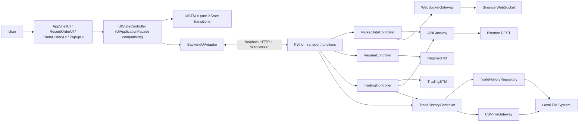

# Binance Auto 통합 시스템 단위 구현 로드맵

| 항목 | 내용 |
|---|---|
| 문서 상태 | 실행 기준 문서 / Phase 9 실제 Testnet 검증 완료, Phase 12 개인용 ad-hoc desktop package·credential·shutdown 검증 완료, Phase 13 부분 구현·live readiness `NO_GO` |
| 기준일 | 2026-09-08 (Asia/Seoul) |
| 기준 커밋 | `d9532077dc2cd9c5b1c25f0718b675e4fcb072bb` (`main`, Phase 10 시작 기준) |
| 구현 목표 | 한 번에 전체를 구현하지 않고, 검증 가능한 단위별로 실제 거래 가능한 통합 시스템까지 완성한다. |
| 최우선 설계 기준 | `Design/Architecture/Communication_Diagram_Message_Flow_Specification.md` |
| 현재 결론 | Phase 9 actual Testnet 범위를 완료했다. Keychain credential의 authenticated read-only 3/3 뒤, 사용자가 승인한 BUY 진입 cap `10 USDT`를 적용했다. 주문 전 실제 `ETHUSDT` `exchangeInfo`의 `LOT_SIZE`, `MARKET_LOT_SIZE`, `NOTIONAL`을 조회해 최신 4시간봉 종가 `2461.41000000`, 제출 수량 `0.0040 ETH`, decision notional `9.845640000000 USDT`가 cap과 모든 filter를 만족할 때만 진행했다. lifecycle과 별도 process cold restart에서 각 BUY를 STOP/recovery SELL로 전량 청산했고, 최종 fresh runtime이 `READY`, history 6건, pending 0건, Position 0, open order 0건임을 실제 Testnet에서 재확인했다. 복구 SELL은 자동 resume 없이 free ETH·filter 뒤 정확한 Position 전량만 허용하며 BUY 진입 cap을 재사용하지 않는다. 개인용·친구용 배포는 App Store/Developer ID 없는 ad-hoc app을 사용자가 직접 신뢰 허용하는 범위로 확정했다. Phase 13은 장애 복구, configured-unbounded 위험 정책, `CANCEL_AND_LIQUIDATE`, 30분 EMA9/OLS production 계산, 전 interval 원자 경계와 public local Case 2를 구현했고 Communication `126/126`, 실제 native picker 선택·취소와 actual-browser axe `16/16 Violations 0`을 검증했다. 2026-09-05에는 Session 3 current-source Spot Testnet E2E의 `ETHUSDT` BUY decision notional `9.9490331561080558036145263224 USDT` 한 건과 same-run exact `0.0042 ETH` STOP SELL 한 건, fresh zero exposure를 canonical SUCCESS evidence로 봉인했다. 같은 checkpoint `c28544e4d22c9c5512c380286d1dfc6dd618e14e`에서 Session 4 arm64 fresh ad-hoc app/DMG의 Keychain read-only `READY`, 핵심 UI, native picker 선택·취소, safe shutdown과 orphan `0`을 통과해 `macOS package ready`를 완료했다. 2026-09-06 Session 5는 Windows의 `pnpm desktop:dev` source 실행 경로와 호환 adapter를 구현하고 macOS 회귀를 통과해 완료했으며, Session 6 Windows native 개발 실행 검증은 `GO`다. 다만 Cross-platform package, Private Beta master, visual SSIM `4/16` PASS·`12/16` FAIL 및 공개 배포용 full supply-chain track은 남았으므로 Phase 13 전체와 live endpoint는 계속 미완료다. |
| 2026-09-01 최신 갱신 | 공식 `/myFilters` strict composite, account-wide empty-state와 고정 30초 submit guard를 유지한 채 reconciliation first cause를 여섯 secret-free category와 monotonic `MISSING\|EXACT\|DUPLICATE\|CONFLICT` latch로 구현했다. Failure writer v2는 raw logical ID를 기록하지 않고 exception-bound `first_cause`, 15개 stable fresh stage, account-wide empty truth와 source/copy descriptor-bound isolated durability snapshot을 봉인한다. Leaf content restore, absent-sidecar와 ancestor rename/restore ABA, producer error 순서, no-attempt zero truth와 serial pending cap까지 fail closed하며 preserved v1 FAILED와 trace v2는 소급 변경 없이 검증한다. V3는 exact session/intent client ID, 2/4/6 Kline batch, account converse, trace command와 fill order를 production producer에 결속한다. Credential/order 환경을 제거한 current tree에서 Backend `Ran 962 tests`, `OK (skipped=8)`, scripts `183/183`, runner `14/14`, cause integration `50/50`, Case 2 helper `29/29`·external actual `1` safe skip, Communication `126/126`을 통과했다. 이번 local 작업의 Keychain·Binance target·주문은 모두 0회이고 historical actual FAILED/INCOMPLETE는 그대로다. Visual `4/16`, supply/readiness `NO_GO`이므로 Phase 13과 live는 계속 `[ ]`/disabled이며 최신 재개 계약은 §16.18이다. |
| 2026-09-04 최신 갱신 | §16.18 이후 중단 지점을 `e402673`에서 복원해 V3 source/provenance/order-ID/zero-fee 계약, process-lifetime startup·direct-start gate, final source→copy→source durability, 모든 cleanup best-effort와 lifecycle `CLOSED` publication을 보강했다. Credential/order 환경을 제거한 Backend는 `Ran 967 tests in 32.817s`, `OK (skipped=8)`이고 focused trace/Case 2 `58`, startup·reconciliation `74`, lifecycle `10`, cause integration `51`, runner `14`, baseline/trace `33`, public Case 2 integration `9`, Communication `126/126`이 통과했다. Root scripts는 source 회귀가 아니라 ignored historical Phase 12 app만 남고 결속된 DMG가 누락된 현재 local artifact 상태를 fail closed해 `Ran 183`, `FAILED (failures=1, errors=2)`다. 원래 DMG를 찾거나 검증된 pair를 정직하게 정리하기 전 supply gate를 PASS로 쓰지 않는다. 이번 작업도 Keychain·Binance target·주문은 모두 0회이며 Phase 13/live는 계속 `[ ]`/disabled다. 최신 유일 재개 계약은 §16.19다. |
| 2026-09-05 최신 갱신 | §16.20.6 Session 3을 current source에서 완료했다. Keychain 두 item의 memory-only read와 signed read-only preflight 뒤 `ETHUSDT` BUY decision notional `9.7814300211721854636528636815 USDT <= 10 USDT` 한 건, same-run exact `0.0041 ETH` STOP SELL 한 건을 실행했다. Canonical SUCCESS trace는 actual order `2`, durable Trade `2`, retry/cancel/duplicate/범위 밖 mutation `0`, fresh Position/pending/unknown/open order `0`, reconciliation `false`를 봉인했다. Post-run signed read-only도 account-wide open order/list `0`을 확인했고 Backend `993`, actual local+external `40`, secure runner/Communication `32`, trace schema `28`, order fault/actual helper `47`, Communication matrix `126/126`이 통과했다. 따라서 Session 4는 `GO`지만 fresh package와 macOS smoke, Phase 13 dependency/license/SBOM gap, live endpoint 승인은 아직 수행하지 않았다. 상세 source checkpoint와 artifact digest는 §16.20.6에 기록했다. |
| 2026-09-05 Session 4 최신 갱신 | §16.20.7 Session 4를 `c28544e4d22c9c5512c380286d1dfc6dd618e14e == origin/main`과 unchanged lockfile 세 개에서 완료했다. 격리 target에 arm64 app/DMG를 fresh build하고 PyInstaller one-file과 hardened ad-hoc library-validation 불일치를 실제 실행에서 발견해 해당 후보를 기각했다. 최종 채택본은 outer seal을 포함한 non-hardened ad-hoc app과 read-only DMG이며 app tree SHA-256 `7e790832c97447df819d08c65c8a080bfd8f32ffbcab9ee18a5a59cbdb931853`, DMG SHA-256 `2c95e0fa33cca0cbf1fd263814be87f761440722237796b13d91d8b5f6b7df7b`다. Network-deny offline OSV 결과 High/Critical `0`, 최종 secret scan `2` canary/`2781` files PASS다. macOS arm64에서 Keychain read-only `READY`, Dashboard/History/stop, picker selected/cancelled, Command-Q safe shutdown, `RELEASED` owner와 orphan `0`을 확인했고 postflight `5/5`도 open order/list `0`을 유지했다. 실제 신규 주문은 `0`회다. 따라서 Session 5는 `GO`지만 Windows native PASS, Cross-platform package, Private Beta, live와 공개 release track은 완료하지 않았다. 상세 증거와 ad-hoc trust 절차는 §16.20.7에 기록했다. |
| 2026-09-06 Session 5 최신 갱신 | §16.20.8의 Windows 11 x64 호환 source를 개발 실행 범위로 완료했다. `pnpm desktop:dev`가 Windows debug Tauri/Vite와 source Python venv를 직접 실행하도록 구성했고 Credential Manager, framed stdio, LockFileEx·LocalAppData adapter를 macOS 구현에서 분리했다. Backend `1046` 실행·`10` safe skip, UI `481`, Rust `45`, 도구 `38`, Communication `126/126`이 통과했다. Session 6 native 개발 실행 검증은 `GO`이며 Windows native PASS·설치 package·Private Beta/live 완료를 의미하지 않는다. |
| 2026-09-07 Session 6 완료 | 사용자 지시에 따라 Windows 10 x64 개발 실행 통과를 완료 조건으로 확정했다. venv·Node/pnpm·Rust/MSVC를 준비하고 Vite EBUSY·main-window Windows capability 누락을 수정했다. Credential Manager와 Mac 이력 복원 후 read-only READY, Dashboard/History, picker, 정상 종료, fresh restart/renderer reload를 통과했다. 최종 RELEASED·잔여 process/port 0·이력 불변이다. Session 6은 완료이며 Windows 11 검증과 설치 배포는 별도 후속 작업이다. 상세 결과와 실패 기록은 §16.20.9 및 `WINDOWS_DEVELOPMENT_VALIDATION.md`에 보존했다. |
| 2026-09-08 Session 6 재검증 | clean HEAD `e726793`에서 Windows 10 x64 backend 1,046 실행(979 PASS/67 skip), UI 480 PASS/2 skip, Rust 37 PASS, 도구 38 실행(20 PASS/18 skip), Communication 126/126을 재확인했다. 실제 Testnet read-only READY, History 16행, native picker 취소·선택, 정상 종료 취소·확정, fresh restart/renderer reload와 안전 종료를 통과했다. 최종 RELEASED·앱/개발 서버 잔여 0·이력 불변이며 production source와 lockfile 변경은 없다. Session 7 구현 착수는 GO이며, 양 OS package와 별도 승인된 live read-only READY는 Session 7의 남은 완료 조건이다. 상세 증거와 최초 UI timeout은 §16.20.9에 기록했다. |
| 2026-09-08 Session 7 macOS 기술 검증 마감 | 별도 live root/capability·fixed endpoint·native Keychain/profile/storage와 10 USDT 정책을 구현했다. 기존 Backend 1058/UI 483/Rust 47/Communication 126/126과 이번 도구 47 PASS. 공인 IP 수정 후 signed 읽기 PASS, native 실계좌·주문 비활성 연결/History 0/정상 종료/fresh restart 확인 및 두 독립 runtime의 READY·zero state·CLOSED를 검증했다. 최종 owner RELEASED, native process 0, secret scan 2 canary/751 files PASS, 주문 0. macOS 읽기 전용 기술 검증과 승인된 ETH 잔여 장부 구현을 완료했다. BNB 회계 후속 확장으로 수수료·잔액 사전조건은 PASS이나 macOS 계좌 운영 확인·실제 주문 승인은 남는다. 사용자 지시로 Windows 검증은 macOS pilot 완료 후 수행한다. 새 패키지와 후속 검증은 §16.20.10을 따른다. Windows live와 계좌 격리 운영 확인 및 전체 master는 별도로 남긴다. 상세는 §16.20.10. |

---

## 1. 이 문서를 사용하는 방법

이 문서는 다음 개발 작업의 프롬프트를 대신한다. 구현자는 아래 규칙을 그대로 지킨다.

- [x] 현재 코드와 테스트를 기준으로 완료/미완료 범위를 구분했다.
- [x] 항상 **가장 앞에 있는 미완료 Phase 하나만** 구현한다.
- [x] Phase를 시작하기 전에 그 Phase에 적힌 Communication 메시지 번호와 클래스 Operation을 다시 읽는다.
- [x] 한 Phase에서 다음 Phase의 기능을 미리 구현하지 않는다.
- [x] 각 작업은 테스트를 먼저 추가하거나, 최소한 같은 변경 묶음 안에 테스트를 포함한다. Phase 0은 동작 코드가 없어 기존 전체 baseline을 먼저 재실행했다.
- [x] 완료 조건을 모두 만족한 뒤에만 해당 Phase의 체크박스를 `[x]`로 바꾼다.
- [x] 체크할 때 실행 명령, 통과한 테스트 수, 주요 파일, 커밋 ID를 Phase의 `완료 증거`에 기록한다.
- [x] 실패하거나 미확정인 정책을 임의 기본값으로 숨기지 않는다. Phase 0에서 `TRADING_LOGIC_INCOMPLETE`로 격리했던 상단 BB gap은 Phase 6에서 명시적 `SAFE_TERMINATION`으로 닫았고, 미지원 REGIME fallback은 없다.
- [x] 실제 **live** Binance 주문은 Phase 13의 별도 승인 전까지 실행하지 않는다. Phase 9
  Spot Testnet 주문은 고정 endpoint, read-only opt-in, 별도 주문 opt-in과 양수
  BUY 진입 max-notional 상한을 모두 만족한 명시적 검증에서만 허용한다. 기본 mode는
  `disabled`다.

상태 표기는 다음처럼 사용한다.

| 표기 | 의미 |
|---|---|
| `[x]` | 코드와 자동 검증으로 완료가 확인됨 |
| `[ ] 부분 완료` | 일부 계층만 있으며 종단 간 계약은 아직 미완료 |
| `[ ] 미구현` | production 구현이 없음 |
| `[ ] 결정 필요` | 업무 규칙 확정 전에는 안전하게 구현할 수 없음 |

### Phase 실행 요청 형식

후속 구현 작업은 다음 한 문장으로 시작할 수 있다.

```text
INTEGRATED_SYSTEM_IMPLEMENTATION_ROADMAP.md를 기준으로 가장 앞의 미완료 Phase 하나만 구현하라.
해당 Phase가 참조하는 Communication Diagram 메시지와 기존 클래스를 먼저 확인하고,
범위를 넘는 기능이나 새 업무 클래스를 만들지 말며, 완료 조건의 테스트와 문서 체크까지 수행하라.
```

- [x] 이 섹션의 실행 규칙을 Phase 0 작업에 적용했고 후속 Phase의 고정 규칙으로 유지한다.

---

## 2. 기준 자료와 우선순위

### 2.1 반드시 먼저 보는 자료

1. `Design/Architecture/Communication_Diagram_Message_Flow_Specification.md`
2. `backend/src/binance_auto_trader/domain/regime/`, `backend/tests/unit/regime/`, `backend/docs/Regime_STM_Implementation_Plan.md`
3. `backend/src/binance_auto_trader/domain/trading/`, `backend/tests/unit/trading/`, `backend/docs/Trading_STM_Implementation_Plan.md`
4. `UI/`의 실제 소스, 테스트, `UI_ARCHITECTURE_AND_FILE_REFERENCE.md`

충돌 시 적용 순서는 다음과 같다.

1. 아직 수정되지 않은 Communication Diagram을 먼저 확인한다.
2. 현재 필요한 Operation이 없으면 다이어그램에 존재하는 클래스 중 책임이 맞는 클래스를 찾는다.
3. 기존 클래스에 넣었을 때 책임이 과도해지고 coupling이 커지며 cohesion이 낮아지는 경우에만 새 production 클래스를 검토한다.
4. Operation 또는 signature를 바꿔야 하면 코드부터 바꾸지 말고 Phase 0에서 Communication 명세를 먼저 동기화한다.
5. 테스트 helper, 불변 DTO/value object, module 함수는 Communication 참여 업무 클래스와 구분한다.

### 2.2 현재 구현 계획 문서의 지위

- `Regime_STM_Implementation_Plan.md`와 `Trading_STM_Implementation_Plan.md`는 순수 STM과 Controller 책임 분리에 대한 상세 설계다.
- `UI_Implementation_Architecture_Plan.md`는 목표 구조 제안서다.
- `UI_ARCHITECTURE_AND_FILE_REFERENCE.md`는 현재 구현의 사실을 설명한다.
- 본 문서는 이들을 통합한 **앞으로의 실행 순서와 완료 판단 기준**이다.

- [x] 기준 자료의 역할과 우선순위를 확인했다.

---

## 3. 2026-08-24 현재 검증된 상태

### 3.1 자동 검증 결과

| 영역 | 실행 결과 | 판단 |
|---|---|---|
| 통합 backend | 표준 `unittest` 643개 실행, 637개 통과·외부 Testnet 6개 safe skip | 기존 Phase 0~12 회귀, verified closed/pending baseline, 공개 복구 청산, event worker, 수수료/dust와 unknown app-order fail-closed 계약 검증 통과 |
| Phase 9 집중 | 복구/worker/transport 69개, Binance adapter 42개, architecture 57개와 deterministic fault injection 2개 통과 | same-ID 복구, PREPARED ambiguity, 전량 free·filter gate, BUY entry cap, STOP SELL 예외와 mutation owner, signed commission, process worker, 두 REST snapshot gap과 reset provenance 검증 |
| Phase 10 집중 | architecture 49개, Case 3 backend/UI trace, 12개 filter, KST 자정·save/retry rollover, empty/failure/retry, load 중 체결, replay gap resync 검증 | filter는 rows만 교체하고 Account version/KST 날짜/Trade publication이 바뀐 summary만 재결합하며 event pair는 원자 발행 |
| package/static | offline wheel build, `compileall`, generated contract drift와 `git diff --check` 최종 재검증 | Phase 12 sidecar entrypoint와 pinned desktop packaging extra를 wheel metadata에 포함 |
| UI | Vitest 36개 파일, 280개 테스트 전부 통과 | 복구 Position 전용 확인/command, 종료 대기·receipt race와 기존 sidecar/shutdown 회귀 포함 |
| UI typecheck/build | `tsc -b --pretty false`, Vite build 286 modules, Storybook static build 성공 | strict native IPC/HTTP shutdown 계약, production bundle과 fake Storybook 정상 |
| process/HTTP 검증 | 실제 Python child와 loopback HTTP/CORS/query/shutdown tests를 통과 | fixed FD configuration, exact `202`/`409`, post-CLOSED process ACK와 기존 startup 메시지 `1 → 2 → 3 → 4 → 5` 검증 |
| generated contract | Python schema v2 renderer와 `backendContracts.generated.ts` byte-for-byte 일치 | max 1,000 rows, details composite와 ORDER/PERFORMANCE event payload를 Python authoritative source로 유지 |
| Git 범위 | Phase 9 `TradingController`, Testnet adapter/bootstrap/transport, 복구 UI, Communication·ADR와 회귀 테스트 변경 | production/live endpoint와 live enable은 변경하지 않음 |
| Tauri/Rust | `cargo fmt --check`, `cargo check --tests --locked`, `cargo test --locked`, `cargo clippy --lib --locked -- -D warnings`, native unit 31개 전부 통과 | random-port sidecar, runtime CSP rewrite, minimal capability, Keychain, late READY/pre-window child exit, AppKit native Quit cancel, release commit marker와 expected/abnormal exit 검증 |
| macOS bundle | arm64 fixed `.app`/`.dmg`, DMG checksum·mounted app/sidecar strict ad-hoc signature, current-host actual Keychain read-only READY와 native safe shutdown/orphan 0 검증 통과 | 친구 전달 전 대상 Mac architecture 확인과 최초 실행 수동 신뢰 허용 안내만 별도 수행; Developer ID/notarization은 선택 사항 |
| Phase 12 release tooling | `backend/.venv/bin/python -m unittest discover -s scripts -p 'test_*.py' -q` → 114/114 통과 | release identity/notary profile preflight, commit-provenance signed app/DMG verifier, atomic fresh DMG builder, live-bound schema v2 evidence gate와 symlink/path-component secret scanner 회귀 검증 |

Python 검증은 프로젝트가 사용하는 표준 `unittest`로 수행했고 수정 package를
`uv build --wheel --offline`으로 다시 생성했다. UI는 설치된 `node_modules/.bin`으로
Vitest, TypeScript, Vite와 Storybook을 검증했다. 이 host에 Rust toolchain을 설치한 뒤
locked Cargo check/test와 release Tauri package를 실행했다. local bundle은 ad-hoc hardened
runtime으로 봉인했지만 배포 인증서가 아니므로 Gatekeeper 배포 증거로 사용하지 않는다.

### 3.2 현재 완료된 핵심

- [x] 두 STM이 `backend/src/binance_auto_trader/domain/` 하나의 설치 가능한 package로 통합되어 있다.
- [x] `domain/common/enums.py`의 `RegimeType.TYPE_0`~`TYPE_4`가 두 STM의 유일한 Python REGIME enum이다.
- [x] `RegimeSTM`의 상태, 이벤트, 불변 평가 Context, Action request, 결과, guard, 13개 transition registry가 구현되어 있다.
- [x] `RegimeSTM`은 Controller·Gateway·UI를 import하지 않는 순수 결정 엔진이다.
- [x] `TradingSTM`의 계층/병렬 상태 구성, 이벤트, 불변 Context view, Action request, 109개 transition ID가 구현되어 있다.
- [x] `TradingSTM`의 Case C 우선권, 중지 우선권, 주문 결과 microstep, stale event와 context version 방어가 테스트되어 있다.
- [x] Phase 6 불변 `TradingLogicConfiguration` 5개가 canonical REGIME 순서를 보존하고 `TYPE_0`만 exact 109개 lower-BB registry와 `SAFE_TERMINATION`을 선택한다.
- [x] `TradingSTM` 생성자와 factory에는 암묵적 `TYPE_0` 기본값이 없고, `TYPE_1`~`TYPE_4`는 `UnsupportedTradingLogicError(code=UNSUPPORTED_TRADING_LOGIC)`로 거부한다.
- [x] G-07은 `realtime_price >= upper_band`에서 pending 주문 취소·같은 ID reconciliation을 우선하고, pending 없는 포지션은 STOPPING·force-sell, 둘 다 없으면 즉시 runtime 종료로 완결한다.
- [x] canonical `Interval`과 Decimal/UTC 불변 `Kline`, 원자적·versioned `MarketSnapshot`이 구현되어 있다.
- [x] backend `MarketDataController`가 fake client 경계에서 WS start → REST load → drain/merge → snapshot update를 직렬 실행한다.
- [x] Binance Spot REST 12-field Kline과 raw/combined WebSocket Kline을 Decimal·UTC 내부 타입으로 엄격히 정규화한다.
- [x] `IndicatorSnapshot`이 closed 4H EMA9/slope/swing과 진행봉 live EMA9를 같은 MarketSnapshot version provenance로 보존한다.
- [x] `RegimeController`가 initial/4H close 두 microstep Action을 직렬 실행하고 추천/선택 분리, candle dedup, stale/failure trace를 소유한다.
- [x] `MarketDataController`에서 메시지 `1.4`~`1.5.1`의 fake vertical slice가 실제 `RegimeSTM` 추천 결과까지 연결된다.
- [x] `Account`가 full/partial snapshot, 자산별 free/locked Decimal, ETH current price·valuation, UTC updated_at과 monotonic version을 보존하며 `get_holdings()`를 제공한다.
- [x] `APIGateway`와 `WebSocketGateway`가 공식 Spot account payload를 `AccountSnapshot`으로 정규화하고 `outboundAccountPosition`의 변경 자산만 absolute patch로 적용한다.
- [x] account stream은 source time·fingerprint·subscription generation으로 stale/duplicate
  callback을 차단한다. 수신 루프는 bounded 단일 FIFO worker에 event를 넘기며 enqueue부터
  callback 완료와 queue drain까지 `account_ready=false`를 유지한다. overflow·consumer/worker
  failure와 termination은 socket close와 reconciliation-required로 전환한다.
- [x] `TradingController.load_account()`가 REST fetch → Account commit → account stream start 순서를 보장하며 REST 실패 시 stream을 시작하지 않는다.
- [x] ADR-004 JSONL v1/v2 reader·v2 writer의 frozen `Trade`, order ID idempotent
  `TradeHistory`, KST inclusive-date/side query와 D-11 `Performance` startup 복원이
  구현되어 있다. 열린 v1 ETH-fee lot은 명시적 migration 전까지 주문을 차단한다.
- [x] Trade 수수료는 USDT 동일값, ETH per-fill quote aggregate의 zero-pair 일관성을 검증하고 제3 asset은 `FEE_ASSET_CONVERSION_REQUIRED`로 fail closed한다.
- [x] `TradeHistoryRepository`가 streaming startup read, missing/empty 처리, strict partial-tail recovery와 order ID index rebuild를 수행한다.
- [x] `TradeHistoryController`가 Repository → TradeHistory → Performance를 local에서 완성한 뒤 원자적으로 publish한다.
- [x] `TradeHistoryController.get_trade_details()`가 KST period/side query 행, shared `Account`의 ETH free+locked와 D-12 `Performance`를 불변 결과로 결합한다. 같은 Account version·KST 날짜의 filter는 rows만 재조회하고, account/day/trade 변경 때만 summary를 재결합한다.
- [x] strict `GET /v1/trades?period=...&side=...`가 최대 1,000개의 Decimal string 행과 query echo, account provenance, 전체 성과를 하나의 composite 응답으로 제공한다.
- [x] 메시지 `2`~`2.2.1`과 `3`~`3.3`의 구조화 trace가 caller/receiver, command ID, state version, result/failure code와 secret 비노출을 검증한다.
- [x] UI의 Dashboard, Trade History, modal, REGIME 선택, start/stop 확인, split order, CSV form, 차트, Storybook 기준 화면이 구현되어 있다.
- [x] Trade History UI가 최초 `TODAY + ALL`, 12개 결합 filter, loading/ready/empty/failed/retry와 D-12 summary/rows 분리를 실제 backend 응답으로 수행한다.
- [x] `ORDER_EXECUTED`는 recent orders와 현재 history query를, `ACCOUNT_UPDATED`/`PERFORMANCE_UPDATED`는 provenance가 맞는 summary를 갱신한다. sequence gap/session reconnect는 진행 중 응답을 폐기하고 현재 query를 snapshot-first로 재조회한다.
- [x] ready/empty Trade History는 고정 KST(UTC+09:00) 자정에 현재 query와 summary를 자동 재조회하고 화면 이탈 시 timer를 취소한다.
- [x] UI 가격 차트는 공개 Binance REST/WebSocket에서 `1m`, `30m`, `4h`, `1d`를 조회한다.
- [x] UI 차트는 WebSocket을 먼저 열고 REST를 조회한 뒤 동일 봉에서는 WebSocket 값을 우선하여 병합한다.
- [x] UI의 backend 명령은 `UiCommandPort` 뒤에 격리되어 있다.
- [x] application bootstrap이 market·Regime readiness → Account REST+stream → History/Performance 순서를 고정하고 마지막 단계 뒤에만 ready state를 원자 publish한다.
- [x] loopback transport가 IPv4 `127.0.0.1` random port, launch별 256-bit token, Host/Origin/CORS/Bearer, WebSocket first-frame 인증과 strict envelope를 구현한다.
- [x] snapshot DTO와 마지막 event `sequence`를 같은 application `RLock` 임계 구역에서 읽고 event replay를 10,000개 또는 15분으로 제한한다.
- [x] Python transport schema가 generated TypeScript contract의 authoritative source이며 byte drift test가 존재한다.
- [x] schema v2 trading snapshot이 5개 `logic_coverage`, session status/version/ratio/position과 mode별 `command_enabled`를 UI에 제공한다.
- [x] UI는 5개 REGIME의 지원 상태를 표시하고 미지원 추천·표시·선택을 유지하되, 시작 요청과 stale 확인에서 backend command를 0회로 차단한다.
- [x] mutable `TradingContext`가 Account/REGIME/분할 비율과 immutable runtime·Position·pending snapshot을 lock 아래 보존하고 typed mutation마다 version을 증가시킨다.
- [x] `RegimeController.set_regime_type()`만 선택을 변경하며 active session에서는 STM·Context·선택을 그대로 둔 채 `TRADING_ACTIVE`로 거부한다.
- [x] fake mode의 `TradingController.start_trading()`이 readiness와 version을 검증하고 Context 초기화 뒤 session 전용 `TradingSTM.run()`을 정확히 한 번 실행한다.
- [x] `SerialEventQueue`와 run-to-completion processor가 Controller에 연결되어 Action 순서, reentrant 차단, Context version race rollback과 deadline 기반 scheduler cleanup을 보장한다.
- [x] `RUNNING` 최초 stop은 `STOP_CONFIRMED`를 먼저 처리하고 pending → 보유 Position → position 0 우선순위로 typed Action을 만들며 position 0에서는 sell Action을 요청하지 않는다. 이미 중지·종료 상태인 후속 stop은 성공 no-op이다.
- [x] Decimal128 `Order`/`Fill`/`ExecutionSummary`와 average-cost `Position`이 intent, 실제 fill, owner, 매도 사전 원가를 보존한다.
- [x] `TradingController`가 fake `APIGateway`의 즉시·active·partial·UNKNOWN·terminal 결과를 동일 ID 조회·bounded retry로 조정하고 Position → History/Performance → durable Repository → concrete outcome 순서를 보장한다.
- [x] JSONL order ID 멱등 append/flush/fsync, 저장 실패 save-only retry, KST Performance 일자 전환과 Case 2 메시지 `1`~`14` 상관 trace를 구현했다.
- [x] 고정 Testnet REST/WebSocket adapter가 server time/HMAC, MARKET 수량/notional 사전 검사, account·order
  mapping과 현행 signed user-data stream을 제공한다. Testnet 주문은 generic factory가 아닌
  전용 bootstrap의 이중 opt-in·양수 cap·pending journal을 모두 요구하고 live는 잠겨 있다.
- [x] startup은 stream ACK 뒤 두 번째 account snapshot, open/recent/same-ID query와
  durable Position provenance를 확인한다. reconnect도 새 stream 뒤 두 번째 REST snapshot을
  다시 적용하며 설명되지 않은 fill, 잔액 감소와 Testnet reset을 fail closed한다. 숫자
  `orderId`가 reset 뒤 재사용돼도 `(clientOrderId, orderId)` pair와 terminal fill 집계가
  durable Trade에 정확히 일치해야 하며, 충돌은 Position 적용 전에 차단한다.
- [x] pending-order sidecar v2가 `PREPARED` UPSERT와
  `SUBMISSION_REJECTED_CONFIRMED` TRANSITION을 각각 file+directory fsync하고, legacy v1
  UPSERT는 보수적으로 `PREPARED`로 읽는다.
- [x] 제출 전 `PREPARED` UPSERT 예외는 fsync 완료 여부가 모호하므로 REST POST를 보내지
  않되 session을 rollback하지 않고 `RECONCILIATION_REQUIRED` operator lock을 유지한다.
  save-then-raise fault에서 POST 0회, journal 존재, command gate 폐쇄를 검증한다.
- [x] startup에서 설명 가능하게 복원한 open Position은 일반 start/stop과 분리된
  `liquidate_recovered_position()`으로만 인수한다. fresh STM에 `STOP_CONFIRMED`를 직접
  전달해 `run()`과 BUY를 금지하고 G-06/G-06F/G-06R을 재사용한다.
- [x] 복구 청산은 effective free ETH와 최신 symbol filter 뒤에도
  `requested == submitted == Position.quantity`인 전량 한 주문만 PREPARED로 저장한다.
  최초 무효 조건은 POST 0회·NOT_STARTED 원자 복원·same-command 재시도를 보장하고,
  terminal partial 뒤 잔량 filter 실패는 operator reconciliation으로 닫는다.
- [x] production bootstrap은 process당 단일 interruptible event runtime worker로 queue와 due
  retry를 bounded 처리하고 authoritative trading lifecycle을 게시한다. 알 수 없는 `bat-`
  주문 event도 command gate를 닫고 REST account/order recovery를 깨운다.
- [x] signed `GET /api/v3/account/commission`의 standard/special/tax와 discount를 엄격
  정규화한다. BNB 등 제3 수수료 자산은 모든 주문에서 차단하고, MARKET BUY 수신 ETH
  수수료율 양수는 dust 회계가 생기기 전까지 신규 BUY 전에 fail closed한다. 실제 discount asset과 두 enable
  flag가 있으면 할인율이 0이어도 tax/special 수수료가 그 자산으로 전환될 수 있어 제3 자산
  가능성을 계속 차단한다. 공식 string schema와 다른 명시적 null은 12개 원시 수수료율과
  discount가 모두 정확히 0인 관찰 조합에만 허용한다.
- [x] 주문 opt-in 전에 실제 `ETHUSDT`의 `TRADING`, Spot·`MARKET` 허용과 `exchangeInfo`
  filter를 조회했다. 최신 4시간봉 종가 `2461.41000000`, `LOT_SIZE` min/step
  `0.00010000`, `MARKET_LOT_SIZE` min/step `0`, `NOTIONAL` min `5`와
  `applyMinToMarket=true`에서 cap `10 USDT`의 raw 수량
  `0.004062712022783689023770928045307364`를 `0.0040 ETH`로 내린 decision notional
  `9.8456400000000000 USDT`가 모든 filter와 cap을 만족함을 확인했다.
- [x] production Testnet runtime actual lifecycle과 process A durable BUY 후 `os._exit` →
  fresh B recovery SELL → fresh C replay를 순차 실행했다. 마지막 authenticated read-only
  startup에서 `READY`, history 6건, pending 0건, Position 0, matching open order 0건을
  확인했으며 새 주문을 추가하지 않았다.
- [x] REGIME/select/start/stop/split HTTP와 UI command가 command ID·expected version·Decimal string 계약으로 연결되고 lifecycle event/snapshot을 단조 version으로 동기화한다.
- [x] production UI는 coherent ready snapshot을 먼저 적용한 뒤 actor와 event stream을 시작한다.
- [x] duplicate/out-of-order/event ID 중복을 거르고 gap·session change에서는 snapshot-first full resync한다.
- [x] 실제 Python child process의 read-only ETHUSDT/USDT snapshot을 React App에 표시하고 메시지 `1`~`5` 통합 trace를 검증했다.
- [x] backend market event parity 전에는 공개 Binance chart를 교체하지 않고 display-only로 유지한다.
- [x] Tauri native owner가 launch별 token과 credential/config를 argv·environment·filesystem 없이
  fixed FD `3`/`6`으로 전달하고, FD `4` READY를 검증한 뒤에만 exact-port CSP로 main window를 만든다.
- [x] backend shutdown은 exact `202 accepted` 뒤 신규 command 차단, trading/open exposure 검사,
  history flush/fsync, stream close와 CLOSED publication을 끝낸 후에만 FD `5` process ACK를 인정한다.
- [x] window close와 Command-Q는 같은 UI confirmation single-flight로 합쳐지고, timeout에는 child를
  kill하지 않은 채 authoritative exposure와 운영자 선택을 표시한다. abnormal sidecar exit는 즉시
  신규 주문을 차단하고 offline/recovery 상태로 전환한다.
- [x] Testnet credential은 macOS Keychain의 `com.binance-auto.trader.testnet` service에서 native만
  읽고 zeroize하며 renderer·URL·log에 전달하지 않는다. packaged configuration은 주문을
  `allow_testnet_orders=false`, `max_notional=null`로 고정한다.

### 3.3 현재 완료되지 않은 핵심

- [x] 완료 — `TradingController`의 실제 Testnet Order Action, pending journal,
  startup/reconnect reconciliation과 10 USDT cap actual lifecycle/cold restart를 연결·검증했다.
- [x] 완료 — 공식 account/order REST와 signed user-data stream client 조립,
  credential/signature/session 관리, authenticated read-only와 actual order mutation parity를
  통과했다.
- [ ] 부분 완료 — backend `Account`, `Order`, mutable `Position`, `ExecutionSummary`,
  v1/v2 `Trade`, `TradeHistory`, `Performance`가 실제 Binance mapping까지 연결됐다.
  actual Testnet lifecycle은 완료했지만 열린 legacy v1 ETH-fee lot migration 도구는 후속
  운영 과제다.
- [x] 완료 — JSONL `TradeHistoryRepository`의 startup read/recovery/index, order ID 멱등
  append/flush/fsync/save-only retry와 byte snapshot `stream_trades`를 구현하고, native
  no-replace rename 기반 CSV writer까지 Phase 11에서 연결했다.
- [x] 완료 — Python application bootstrap, loopback HTTP/WebSocket, Tauri fixed-FD sidecar spawn,
  one-shot descriptor, exact-port CSP, package와 안전 종료 lifecycle을 local에서 구현·자동 검증하고,
  실제 Keychain credential packaged read-only READY와 native Quit/orphan 0까지 current host에서 통과했다.
  개인용 ad-hoc 배포 범위를 완료했으며 Developer ID/notarization은 선택적 외부 배포 hardening이다.
- [x] 완료 — production read/command path는 `BackendUiAdapter`를 사용하고
  demo/Storybook/tests는 `FakeUiCommandAdapter`를 유지한다. Phase 11에서 Tauri native directory
  picker와 실제 streaming filesystem export receipt까지 production adapter에 연결했다.
- [ ] 부분 완료 — authoritative backend market/regime/account/history/trading-session snapshot과
  read-only Testnet composition을 packaged sidecar FD6 경로에 연결했다. Python harness의 실제
  credential read-only 및 capped lifecycle/cold restart와 current-host packaged FD6 actual
  credential read-only 계약은 통과했다. UI 공개 차트는 market-event parity 전 display-only로
  유지하며 전체 market-event E2E는 Phase 13에 남아 있다.
- [x] 완료 — strict `TYPE_0`~`TYPE_4` ↔ `type0`~`type4` transport 변환, REGIME별 전략 coverage/start guard, G-07 상단 BB 안전 종료와 UI zero-command gate를 Phase 6에서 완료했다.
- [x] 완료 — fake `APIGateway`에 주문을 제출하고 fill을 Position/History/Performance에 일관되게 반영한 뒤 durable 저장 이후에만 outcome을 내는 Case 2 pipeline을 Phase 8에서 완료했다.
- [ ] 부분 완료 — 메시지 `1`~`5`, Case 2 `1`~`14`를 검증하고 actual adapter 기반
  lifecycle harness, 공개 복구 UI/Operation과 실제 subprocess cold-restart harness를
  구현했다. credential 기반 read-only와 actual order/cold restart를 통과했고 전체 UI
  Communication E2E는 Phase 13에 남아 있다.
- [x] 완료 — actual Testnet harness는 caught failure에서 새 runtime cleanup을 시도한다. Phase 13은
  parent가 독점 소유한 FD5의 kernel EOF를 liveness 신호로 사용해 parent `SIGKILL`에서도 Python이
  같은 iteration에 신규 BUY를 잠그고 `ORPHANED`를 fsync한다. 다음 native startup은 stale artifact의
  lock·identity·PID 부재를 검증하고 명시적 operator 확인 뒤에만 같은 inode를 `RELEASED`로 바꾼다.
  자동 process kill, order cancel·청산은 수행하지 않는다.

### 3.4 Phase 1~12에서 해소한 위험과 남은 계약 공백

Phase 1에서 두 독립 distribution을 `backend/` 하나로 통합했다. root의
`RegimeSTM/`·`TradingSTM/` source tree를 제거했고, clean environment에 설치한
하나의 wheel에서 두 STM을 동시에 import했다.

Phase 2에서 중복 `Interval` 정의 없이 common canonical enum을
market/regime이 공유하고, 실패·disconnect·concurrent reinitialize에서 기존
snapshot version을 역행시키지 않는 full-resync 계약을 고정했다.

Phase 3에서 Decimal 4H 지표 공식과 golden vector를 production code에 고정하고,
RegimeSTM의 Action 요청을 Controller만 수행하도록 연결했다. recommendation과
selection은 분리했고 duplicate/stale/과거 candle 및 입력 실패는 마지막 정상 추천을
보존하는 typed trace로 닫았다.

Phase 4에서 Decimal/UTC Account, 공식 Spot account payload 정규화와 REST commit 후
account stream 시작 순서를 고정했다. account stream은 변경 자산 absolute patch,
stale/duplicate/generation 방어와 callback·termination·start failure 처리를 갖는다.
ADR-004 JSONL v1 Trade, KST TradeHistory query, D-11 Performance, strict partial-tail
recovery Repository와 atomic TradeHistoryController publication을 구현했고 메시지
`2`~`3.3`의 구조화 trace를 고정했다. Phase 4 시점에는 주문·append·CSV·transport
책임을 후속 Phase에 남겼다.

Phase 5에서 하나의 application `RLock`으로 startup readiness, Account stream callback과
snapshot/sequence publication을 직렬화했다. loopback transport는 random port와 launch별
token, Host/Origin/CORS/Bearer와 WebSocket first-frame auth, strict JSON/idempotency,
bounded replay/resync를 fail closed로 고정했다. generated TypeScript drift test와 UI의
snapshot-first/StrictMode/reconnect 경계를 추가했으며 모든 write command는 owner Operation이
생길 때까지 `FEATURE_NOT_AVAILABLE`이다.

Phase 6에서 Phase 0이 `TRADING_LOGIC_INCOMPLETE`로 격리했던 `TYPE_0`
상단 BB gap을 G-07 `SAFE_TERMINATION`으로 닫았다. 새 상단 매매 전략을
추측하지 않고 기존 STOPPING/reconciliation/runtime cleanup 계약을
재사용했다. immutable 5-row registry, `TradingController` selection façade,
schema v2 snapshot/UI gate를 함께 고정했으며 session/start/stop orchestration은
Phase 7에 남겼다.

Phase 7에서 mutable `TradingContext`와 Controller-owned session lifecycle을 연결했다.
REGIME 선택, split, start/stop은 command ID와 expected Context version으로 직렬화되며,
start는 readiness 검증과 Context 초기화 뒤 선택된 STM을 한 번만 실행한다. `RUNNING`
세션의 최초 stop은 `STOP_CONFIRMED`를 먼저 처리하고 pending/보유/무포지션 branch를
authoritative backend snapshot으로 결정한다. 이미 `STOPPING`,
`RECONCILIATION_REQUIRED` 또는 `TERMINATED`인 세션의 후속 stop은 새 STM Action 없는
성공 no-op으로 현재 상태를 반환한다. Phase 7에서는 `SubmitOrder`, `ForceSellAll`,
cancel/reconcile을 typed Action으로 보존해 Phase 8 execution owner에게 넘겼다.

Phase 8에서는 그 Action을 Decimal `Order`/`Position`과 fake `APIGateway`에 연결했다.
active·UNKNOWN과 terminal zero-fill은 동일 ID 조회로 확정하고, partial fill은 새 delta만
Position에 반영한다. terminal execution은 D-11 Trade/Performance와 order ID 멱등
JSONL fsync를 끝낸 후에만 concrete outcome을 STM에 전달한다.

Phase 9에서는 고정 Spot Testnet endpoint의 실제 서명 client, MARKET 수량/notional rules,
현행 signed user-data stream과 open/recent/same-ID startup reconciliation을 연결했다.
PREPARED sidecar는 네 번의 `-2013`만으로 삭제하지 않고, history와 정확히 같은 exchange
execution만 crash 잔여물로 정리한다. reconnect는 REST → 새 stream → 두 번째 REST의
gap을 닫고 설명되지 않은 최근 fill·잔액 감소·Testnet reset을 차단한다. history 저장 뒤
sidecar REMOVE가 실패하면 별도 durable marker와 실제 sidecar replay가 command gate를
유지하며, 같은 ID 재조회와 REMOVE fsync가 끝난 뒤에만 해제한다. 신규 Trade는
v2 실제 자산 흐름 회계를 사용하며 열린 v1 ETH-fee lot은 migration을 요구한다.
Authenticated read-only 뒤 10 USDT 승인 cap으로 actual lifecycle을 실행했다. 정식 lifecycle
artifact `phase9-order-lifecycle-20260824T094039328340Z-01a7605bebf74ee38bddcd0462501092`는
closed baseline 2건 위에 BUY/SELL 2건을 추가해 history 4건, pending 0건, Position 0으로
끝났다. cold artifact
`phase9-cold-restart-20260824T094110991260Z-edea774ca29f43ffbddb37fc88205b38`는 baseline
4건 위에 process A BUY와 fresh B recovery SELL을 추가했고, fresh authenticated read-only
replay에서 `READY`, history 6건, pending 0건, Position 0, matching open order 0건을 확인했다.

Phase 10에서는 Case 3의 최초 `TODAY + ALL`과 모든 period/side 조합을 strict composite
query로 연결했다. D-12의 filtered rows와 filter 독립 summary를 분리하고, backend Decimal을
wire string으로 보존했다. durable Trade 뒤 `ORDER_EXECUTED`와 `PERFORMANCE_UPDATED`를 한
event batch로 발행하며 Account/Performance event와 sequence gap을 UI actor가 단조 revision으로
처리한다. 최초 결합·warm cache·durable save/retry의 KST 자정 경쟁은 새 날짜 결과만 게시하도록
재시도하고, UI도 KST 자정 timer로 현재 query를 다시 읽는다. 이 Phase는 Binance client나
payload를 변경하지 않아 새 공식 Binance 문서 해석이 필요하지 않았고 Communication Case 3,
ADR-004와 ADR-005의 기존 계약만 적용했다.

Phase 11에서는 Case 4의 UI draft와 독립된 backend `CSVExportOptions` 검증, KST preset과
JSONL byte snapshot iterator를 연결했다. ADR-004의 고정 21열을 UTF-8 BOM·CRLF·RFC 4180으로
한 행씩 기록하고 file fsync 뒤 OS native no-replace rename으로 게시한다. native picker 취소,
빈 결과, destination 경합과 filesystem fault는 경로를 반사하지 않는 typed 결과로 닫았다.
장기 write는 TradeHistory operation lock과 transport의 전역 idempotency lock 밖에서 실행해
terminal Trade publication 및 서로 다른 stop/shutdown command를 차단하지 않는다. Binance API
payload를 변경하지 않았으므로 이 Phase도 새 Binance 공식 문서 해석이 필요하지 않았다.

Phase 12에서는 native Tauri가 OS pipe의 fixed FD `3`~`6`으로 token, READY, stop/ACK와
exact 7-key configuration을 교환하게 했다. main window는 READY의 random port를 production
CSP sentinel에 주입한 뒤에만 생성하고 renderer capability는 one-shot descriptor, native
picker, exit bridge/wait와 final destroy로 제한했다. backend `202` shutdown 뒤 CLOSED와
durability가 끝나기 전 process ACK를 무시하며, timeout과 ambiguous READY에는 child를 자동
kill하지 않는다. Keychain credential은 native에서만 읽고 zeroize하며 packaged order opt-in은
항상 꺼져 있다. 이 Phase는 Binance endpoint/payload를 변경하지 않았고 기존 Phase 9 read-only
Testnet adapter만 조립했으므로 새 Binance 공식 문서 해석을 추가하지 않았다. local arm64
bundle, actual Keychain read-only READY, native safe shutdown/orphan 0과 자동 회귀를 통과해 개인용
ad-hoc 배포 범위는 완료했다. Developer ID/notarization/Gatekeeper와 별도 clean-machine smoke는
광범위한 외부 배포를 선택할 경우의 optional hardening으로 남겼다.

남은 표현과 지원 상태는 다음과 같다.

| 위치 | 현재 값 |
|---|---|
| backend domain | 유일한 `RegimeType.TYPE_0` ~ `TYPE_4` |
| UI wire 값 | `'type0'` ~ `'type4'` |
| `TYPE_0` TradingSTM registry | `SUPPORTED`, `LOWER_BB` 정확히 109개, `READY`, `SAFE_TERMINATION` |
| `TYPE_1`~`TYPE_4` TradingSTM registry | `UNSUPPORTED`, transition source 없음, `UNSUPPORTED_TRADING_LOGIC` |
| trading command | 검증된 in-process `fake` 조립은 연결 상태에서 허용; Phase 9 `testnet`은 전용 고정-endpoint bootstrap·startup reconciliation·별도 주문 opt-in·양수 cap·연결 상태가 모두 필요; `disabled`·read-only testnet·`live`는 fail closed |

Domain에는 UI wire 변환을 넣지 않았다. strict `TYPE_0` ↔ `type0` 변환은
transport 계층에서만 수행하고 private `LOWER_BB` key와 transition ID는 UI에
노출하지 않는다. 미지원 REGIME은 추천·표시·선택하되 start만
`UNSUPPORTED_TRADING_LOGIC`으로 차단하고 `TYPE_0`으로 fallback하지 않는다.

- [x] 중복 package와 transport 공백을 해소했고 Phase 9 actual Testnet adapter contract,
  local session/order/fill/history/restart/STOP pipeline과 lifecycle harness 구조를 검증했다.

---

## 4. Communication Diagram 클래스별 구현 현황

`완료`는 해당 클래스의 production 책임이 현재 범위에서 실제로 존재할 때만 사용한다. UI fixture나 snapshot type만 있는 경우는 부분 완료다.

| 체크 | Communication 클래스 | 현재 상태와 근거 | 남은 일 |
|---|---|---|---|
| [x] | `AppShellUI` | React `App`, `AppHeader`, modal host와 live snapshot/loading/typed failure Boundary를 구현 | 없음 |
| [x] | `UIStateController` | `UIStateController`가 순수 `UISTM`의 전이 결과를 받아 snapshot/event bridge, command, Trade History, native picker/export, 타이머 lifecycle을 조정 (`UiApplicationFacade`는 호환 이름) | 없음 |
| [x] | `UISTM` | 단일 순수 XState 루트의 상태·전이·Action 요청과 Phase 5 snapshot 전체 동기화/reconnect를 구현 | 후속 command ack E2E 추가 |
| [x] | `TradingController` | account, strict selection, session start/stop, queue/scheduler, Phase 8 Order/Position/history/force-sell 실행, Phase 9 pending journal·reconciliation, public market evaluation→Case 2 local trace와 production Spot REST memory-HTTP E2E를 구현·검증 | Phase 13 actual Testnet order trace는 별도 미완료 |
| [x] | `TradingSTM` | exact 109개 lower-BB transition·queue, 5-row immutable coverage, typed unsupported/no-fallback, G-07 안전 종료와 session `run` 연결을 구현 | 없음 |
| [x] | `TradingContext` | mutable/versioned owner, `initialize`, ordered runtime patch 적용, typed mutation·split ratio·Position/pending Order publication을 구현 | 없음 |
| [x] | `MarketDataController` | authoritative WS-first/REST/merge/snapshot 초기화, live promotion, 1m·30m·4H·1D 원자 경계, 30분 production 평가와 Regime/Trading observer 연결을 구현 | 없음; actual Testnet order 증거는 Controller 구현과 별도 |
| [x] | `APIGateway` | Kline/Spot account 정규화, normalized 주문 Operation과 실제 Testnet authenticated REST client의 raw order/open/recent/same-ID mapping을 구현하고 read-only 및 actual mutation parity를 통과 | 없음 |
| [x] | `WebSocketGateway` | Kline·account/order event 정규화, stale·duplicate·generation 방어와 실제 Testnet signed session·disconnect reconciliation을 연결하고 signed stream 활성 상태의 actual lifecycle을 통과 | 장시간 disconnect/soak는 Phase 13 범위 |
| [x] | `MarketSnapshot` | canonical Decimal/UTC Kline 4주기, current ETH price, monotonic version과 same-version 지표 파생을 구현 | 없음 |
| [x] | `RegimeController` | 지표 계산, RegimeSTM Action 실행, 추천/선택 분리, dedup/stale/error trace와 sole-writer `set_regime_type`/TradingController 연결을 구현 | 없음 |
| [x] | `IndicatorSnapshot` | Decimal EMA9 series/slope, strict swing, live EMA9과 source version/candle/time provenance를 구현 | 없음 |
| [x] | `RegimeSTM` | 순수 engine, 13개 transition과 Controller 두 microstep 통합 구현 | 없음 |
| [x] | `Order` | intent/client/exchange ID, 최초·재조회 결과, fill key 멱등, Decimal ExecutionSummary와 typed 충돌을 구현하고 Phase 9 Gateway의 실제 exchange filter 준비와 연결 | 없음 |
| [x] | `Position` | owner, quantity, average-cost basis, 사전 `get_cost_basis`와 원자적 `apply_execution`을 가진 entity를 구현 | 없음 |
| [x] | `Trade` | frozen JSONL v1/v2 reader·v2 writer, strict Decimal/plain/UTC/schema와 실제 자산 흐름 수수료 회계를 Order/ExecutionSummary/RealizedResult에 연결 | 열린 v1 ETH-fee lot의 별도 migration 도구는 후속 운영 과제 |
| [x] | `TradeHistory` | constructor, same-content idempotent `add_trade`/conflict, KST inclusive-date/side `find` 구현 | 없음 |
| [x] | `Performance` | D-11 startup/daily aggregate, `calculate_realized_result`, `apply_new_trade`, KST day rollover를 구현 | 없음 |
| [x] | `TradeHistoryController` | startup atomic publish, terminal execution/save-only retry, Phase 10 details와 Phase 11 KST preset·snapshot streaming export 조정을 구현 | 없음 |
| [x] | `TradeHistoryRepository` | streaming read/recovery/index, order ID 멱등 append·flush·fsync·uncertain-save, pending sidecar v2와 byte-length snapshot `stream_trades`를 구현 | 없음 |
| [x] | `Account` | balance/current price/valuation/UTC/version/`get_holdings`, transport DTO와 update event 연결 구현 | 없음 |
| [x] | `RecentOrderUI` | recent-orders Boundary와 backend `ORDER_EXECUTED` event 갱신을 구현 | 없음 |
| [x] | `TradeHistoryUI` | live details page, 12개 filter, 실제 상태/retry, event·resync·KST 자정 갱신, D-12 summary/rows 분리와 실제 CSV 결과 진입을 구현 | 없음 |
| [x] | `TradeHistoryQuery` | backend LocalDate·side 불변 query와 KST 경계 구현 | 없음; period→date/wire mapping은 Controller/transport 책임 |
| [x] | `PopupUI` | CSV dialog, native picker 취소 보존, pending 중복 차단과 실제 success/error modal을 구현 | 없음 |
| [x] | `CSVExportOptions` | UI draft와 독립적인 backend frozen value object, KST preset, 날짜·파일명·경로 구조 검증을 구현 | 없음 |
| [x] | `CSVFileGateway` | ADR-004 schema streaming, UTF-8 BOM/CRLF, fsync와 OS native no-replace atomic rename을 구현 | 없음 |

- [x] 27개 Communication 클래스의 현재 상태를 검토했다.

---

## 5. Communication Case별 종단 간 현황

| Case | 현재 완료 범위 | 현재 끊기는 지점 | 완료 Phase |
|---|---|---|---|
| Case 1 Start/Stop | UI 확인 흐름, RegimeSTM/TradingSTM core, backend startup, actual-process 메시지 `1`~`5`, public `1L.1`~`1L.3`, 실제 Testnet lifecycle/cold restart와 Phase 12 packaged credential/safe shutdown을 구현·검증 | 없음 | Phase 7, 9, 12~13 |
| Case 2 Buy/Sell | fake pipeline과 public `observeKline` 기반 메시지 `1`~`14`, 실제 Binance order mapping·pending journal·startup/reconnect reconciliation, local immediate/partial/UNKNOWN/failure/SELL/STOP와 production Spot REST memory-HTTP 흐름을 구현·검증 | Phase 13 actual Testnet order/fill trace | Phase 8~9, 13 |
| Case 3 Trade History | `SHOW_TRADE_HISTORY` 최초 `TODAY + ALL`, 12개 결합 filter, backend composite details, D-12 summary/rows 분리, order/account/performance event와 gap resync/KST 자정 갱신을 구현 | 없음 | Phase 10 |
| Case 4 CSV Export | popup, backend option/KST 검증, byte snapshot `stream_trades`, native picker, 실제 atomic file write와 typed receipt/failure를 구현 | 없음 | Phase 11 |

현재 기준으로 live trading 준비 완료라고 볼 수 있는 Case는 **0개**다. Actual Testnet
lifecycle/reconciliation과 개인용 Phase 12 package는 완료했지만 Phase 13 전체
readiness·live 위험 한도가 남아 있기 때문이다.

- [x] 네 Communication Case의 종단 간 중단 지점을 확인했다.

---

## 6. 클래스와 Operation 추가 원칙

### 6.1 기존 클래스에 배치할 Operation

| 필요한 Operation | Communication 확인 결과 | 배치 결정 |
|---|---|---|
| `handle(event, context) -> RegimeSTMResult` | 8.13의 `RegimeSTM`이 guard/전이 책임을 이미 소유 | 새 클래스 없이 `RegimeSTM`에 canonical Operation으로 명세 추가 |
| 구체 주문 결과를 받는 `order_finished(event, context)` | 8.5 `TradingSTM.orderFinished()`가 이미 존재 | 새 클래스 없이 기존 Operation signature를 구체화 |
| 4H close 처리와 Kline event 정규화 | 8.7 `MarketDataController`가 시장 snapshot 흐름을 소유 | public 필요 시 명세 추가, 아니면 private method로 유지 |
| STM Action dispatcher와 event loop | 8.4 `TradingController`가 주문 실행 조정 책임을 소유 | `TradingController` private method/module로 구현 |
| REGIME evaluation loop/action dispatcher | 8.11 `RegimeController`가 지표와 추천 연결 책임을 소유 | `RegimeController` private method/module로 구현 |
| startup orchestration | 메시지 1~5의 호출자가 `UIStateController` | `UiApplicationFacade` live bootstrap에서 수행 |

### 6.2 새 production 클래스가 허용되는 유일한 예외

현재 계획에서 새 업무 domain class는 추가하지 않는다. 다만 Communication Diagram이 in-process 논리 호출을 표현하고 현재 제품이 React/Tauri와 Python의 process boundary를 사용하므로, 다음 하나의 transport adapter는 필요하다.

| 새 구현 클래스 | 필요한 이유 | 새 클래스가 없을 때 생기는 문제 | 제한 |
|---|---|---|---|
| `BackendUiAdapter` | `UiCommandPort`를 HTTP command/query와 WebSocket event로 실현 | React Boundary 또는 `UiApplicationFacade`가 HTTP/WS serialization, token, reconnect까지 떠안아 coupling이 커짐 | 업무 판단 금지, wire 변환·연결 수명주기만 소유 |

`SerialEventQueue`, `RunToCompletionEventProcessor`, immutable event/result/action DTO, Kline/Fill 같은 value type, test double은 업무 collaboration을 새로 만드는 것이 아니라 기존 클래스의 구현 세부 또는 공통 타입이다. 이들은 public use-case 책임을 가져서는 안 된다.

새 production 클래스를 더 제안하려면 아래를 모두 문서에 먼저 기록한다.

- [ ] Communication Diagram의 기존 27개 클래스와 Operation을 재검토했다.
- [ ] 후보 책임을 기존 클래스에 넣었을 때의 coupling/cohesion 문제를 구체적으로 적었다.
- [ ] 새 클래스의 단일 책임, 입력, 출력, 소유 상태, 의존 방향을 적었다.
- [ ] Communication/Class Diagram과 본 파일 트리를 먼저 갱신했다.
- [ ] architecture test로 새 경계를 고정했다.

- [ ] 전체 구현이 완료될 때까지 불필요한 새 업무 클래스를 만들지 않았다.

---

## 7. 구현 전에 반드시 잠가야 하는 결정

이 표가 Phase 0의 핵심 산출물이다. `권장 결정`은 구현 기본안이며, 기존 업무 규칙과 다르면 코드가 아니라 명세를 먼저 수정한다.

| ID | 결정 항목 | 현재 충돌/공백 | 권장 결정 | 완료 |
|---|---|---|---|---|
| D-01 | canonical `RegimeType` | Python 두 package와 TS가 서로 다름 | Domain `TYPE_0`~`TYPE_4`, wire `type0`~`type4`의 strict 일대일 변환. `LOWER_BB`는 private registry key | [x] ADR-001 |
| D-02 | REGIME별 Trading logic | Phase 0에서는 `TYPE_0` 상단 BB 정책이 비어 있었고 UI는 5개를 선택 | Phase 6 현재 `TYPE_0 = SUPPORTED/LOWER_BB` exact 109/`READY`/`SAFE_TERMINATION`; `TYPE_1`~`TYPE_4 = UNSUPPORTED`/registry 없음/`UNSUPPORTED_TRADING_LOGIC`. 미지원 선택은 보존하되 start 0회, fallback 금지 | [x] ADR-001/Phase 6 |
| D-03 | RegimeSTM canonical signature | Communication은 `run() -> RegimeType`, 구현은 `handle() -> RegimeSTMResult` | `handle(event, context?) : RegimeSTMResult`가 canonical이고 Controller façade가 두 microstep Action 적용 뒤 타입 반환 | [x] ADR-001 |
| D-04 | TradingSTM 주문 완료 signature | Communication은 parameter 없는 `orderFinished()` | `orderFinished(event, context) : TradingSTMResult` 검증 adapter, concrete normalized outcome만 허용 | [x] ADR-001 |
| D-05 | position 없는 stop | Communication 4.7은 무조건 sell-all, UI는 position 유무 분기 | `RUNNING` 최초 stop은 `STOP_CONFIRMED` 선행; quantity 0/no pending은 sell Action 0회 종료, 보유는 force-sell, pending은 query/cancel/reconcile 후 잔여 매도. 이미 중지·종료 상태인 후속 stop은 성공 no-op | [x] ADR-003 |
| D-06 | 거래 상품 | UI/계좌는 ETH spot 보유량 중심이나 일부 설계 문구는 short를 암시 | Binance Spot `ETHUSDT` long-only. Margin/Futures/short/naked sell 금지 | [x] ADR-003 |
| D-07 | 4H 지표 공식 | 최소 candle, slope 단위, swing threshold, live price 시점이 미확정 | 14개 확정봉, EMA9 SMA seed/alpha 0.2, 최근 6개 OLS/current price, strict pivot 2/2와 0.30%, same-version live EMA9를 golden vector로 고정 | [x] ADR-004 |
| D-08 | retry/partial fill/reconcile | 간격·최대 횟수·잔여 주문 정책 미확정 | 같은 주문 조회 `1/2/4/8초 ±20%` 4회, 실제 fill 우선, terminal partial BUY no top-up, SELL 잔여량만 retry, force-sell 3초 최대 4회, restart lock 표 확정 | [x] ADR-002 |
| D-09 | REGIME 실행 중 변경 | UI는 적용 command가 가능하고 Communication은 start 전 선택 흐름 | active session hot-swap 금지. `TRADING_ACTIVE`로 거부하고 stop 완료 뒤 선택/start 요구 | [x] ADR-001/003 |
| D-10 | 거래 이력 형식 | file serialization schema와 crash 복구 규칙 없음 | UTF-8 no-BOM JSONL v1/v2 reader·v2 writer, Decimal string, UTC, order ID idempotency, partial last line만 보존 후 truncate; malformed middle은 fatal | [x] ADR-004 |
| D-11 | Performance 공식 | 수익률/수수료/승패의 정확한 분모·일 경계 미확정 | average cost + buy fee, net sell proceeds - allocated cost, realized return 분모, KST day, win/loss/breakeven을 numeric example로 고정 | [x] ADR-004 |
| D-12 | History summary 의미 | filter 변경 시 summary 재계산 여부 충돌 | summary는 account day/전체 history 고정, table row만 period/side filter; UI label에 범위 명시 | [x] ADR-004 |
| D-13 | CSV 세부 정책 | 빈 결과, encoding, overwrite 규칙 미확정 | KST inclusive date, schema v1 column, UTF-8 BOM/CRLF, empty 오류, overwrite 금지, same-dir temp + no-replace atomic rename | [x] ADR-004 |
| D-14 | transport/security | 실제 endpoint, event sequence, token handshake 없음 | `/v1/*` endpoint, response/event envelope, `127.0.0.1` random port, per-launch 256-bit token, monotonic sequence/replay/resync 고정. Phase 6 `logic_coverage` 계약은 schema v2 | [x] ADR-005/Phase 6 |
| D-15 | live 안전장치 | 실행 mode와 승인 절차 없음 | `disabled/fake/testnet/live`, default `disabled`; live는 commit 승인, 매 실행 확인과 non-null order/position/loss 한도 없이는 fail closed | [x] ADR-003 |

특히 D-02는 누락된 투자 전략을 코드가 추측하지 못하게 하는 gate다. Phase 6은 lower-BB Event-Action Table을 `TYPE_0`에만 연결했고 나머지 네 REGIME을 미지원으로 보존했다. 새 REGIME을 지원할 때는 먼저 해당 Event-Action Table과 state diagram을 확정해야 한다.

- [x] D-01~D-15를 Communication 명세와 ADR-001~ADR-005에 반영했다.

---

## 8. 목표 런타임 구조



의존성 규칙은 다음과 같다.

- [x] React Boundary는 Binance SDK, filesystem, Python domain 규칙을 import하지 않는다.
- [x] `BackendUiAdapter`는 업무 guard를 판단하지 않는다.
- [x] Controller는 STM의 guard를 중복 구현하지 않는다.
- [x] STM은 Controller, Gateway, Repository, clock, file, network를 import하지 않는다.
- [x] Entity는 UI/transport DTO를 import하지 않는다.
- [x] Gateway는 Binance 원본 응답을 domain 밖으로 노출하지 않는다.
- [x] 모든 금융 수치는 Python `Decimal`, wire에서는 decimal string을 사용한다.
- [x] 저장 시각은 UTC aware datetime, 사용자 날짜 경계는 `Asia/Seoul`로 명시한다.

- [ ] 목표 런타임의 의존 방향을 architecture test로 고정했다.

---

## 9. 최종 예상 디렉터리와 파일 트리

아래는 모든 Phase가 끝난 뒤의 human-maintained source 기준 트리다. `node_modules`, `dist`, `target`, `storybook-static`, cache, runtime data와 build 산출물은 제외한다. `RegimeSTM/`과 `TradingSTM/`은 Phase 1에서 `git mv`로 `backend/`에 통합했고, 회귀 검증 후 중복 source tree를 제거했다.

```text
Binance_Auto/
├── README.md
├── CODING_CONVENTIONS.md
├── INTEGRATED_SYSTEM_IMPLEMENTATION_ROADMAP.md
├── Design/
│   ├── Architecture/
│   │   ├── Communication_Diagram_Message_Flow_Specification.md
│   │   ├── Communication_Diagram/
│   │   └── Decisions/
│   │       ├── ADR-001-canonical-regime-and-trading-mapping.md
│   │       ├── ADR-002-order-retry-and-reconciliation.md
│   │       ├── ADR-003-stop-and-product-mode.md
│   │       ├── ADR-004-persistence-performance-and-csv.md
│   │       └── ADR-005-loopback-transport-and-sidecar-security.md
│   └── ...                                  # 기존 설계 산출물 유지
├── backend/
│   ├── README.md
│   ├── pyproject.toml
│   ├── uv.lock
│   ├── src/
│   │   └── binance_auto_trader/
│   │       ├── __init__.py
│   │       ├── bootstrap/
│   │       │   ├── __init__.py
│   │       │   ├── application.py           # 기존 클래스 인스턴스 조립
│   │       │   └── lifecycle.py             # start/flush/close 순서 함수
│   │       ├── domain/
│   │       │   ├── __init__.py
│   │       │   ├── common/
│   │       │   │   ├── __init__.py
│   │       │   │   ├── enums.py             # canonical RegimeType/Interval/side/status
│   │       │   │   └── validation.py
│   │       │   ├── market/
│   │       │   │   ├── __init__.py
│   │       │   │   ├── kline.py             # 공통 Kline value type
│   │       │   │   ├── market_snapshot.py   # MarketSnapshot
│   │       │   │   └── indicator_snapshot.py# IndicatorSnapshot
│   │       │   ├── regime/
│   │       │   │   ├── __init__.py
│   │       │   │   ├── action_requests.py
│   │       │   │   ├── evaluation.py
│   │       │   │   ├── events.py
│   │       │   │   ├── guards.py
│   │       │   │   ├── results.py
│   │       │   │   ├── states.py
│   │       │   │   ├── stm.py               # RegimeSTM
│   │       │   │   └── transitions.py
│   │       │   ├── trading/
│   │       │   │   ├── __init__.py
│   │       │   │   ├── account.py           # Account
│   │       │   │   ├── action_requests.py
│   │       │   │   ├── context.py           # TradingContext + immutable view
│   │       │   │   ├── event_queue.py
│   │       │   │   ├── events.py
│   │       │   │   ├── logic_registry.py    # Phase 6 REGIME coverage
│   │       │   │   ├── order.py             # Order/Fill/ExecutionSummary
│   │       │   │   ├── position.py          # Position
│   │       │   │   ├── results.py
│   │       │   │   ├── states.py
│   │       │   │   ├── stm.py               # TradingSTM
│   │       │   │   └── transitions/
│   │       │   │       ├── __init__.py
│   │       │   │       ├── base.py
│   │       │   │       ├── catalog.py
│   │       │   │       ├── helpers.py
│   │       │   │       ├── global_transitions.py
│   │       │   │       ├── ownership_transitions.py
│   │       │   │       ├── case_b_signal_transitions.py
│   │       │   │       ├── case_c_signal_transitions.py
│   │       │   │       ├── case_b_position_transitions.py
│   │       │   │       └── case_c_position_transitions.py
│   │       │   └── history/
│   │       │       ├── __init__.py
│   │       │       ├── trade.py              # Trade
│   │       │       ├── trade_history.py      # TradeHistory
│   │       │       ├── performance.py        # Performance
│   │       │       ├── query.py              # TradeHistoryQuery
│   │       │       └── csv_export_options.py # CSVExportOptions
│   │       ├── application/
│   │       │   ├── __init__.py
│   │       │   ├── market_data_controller.py # MarketDataController
│   │       │   ├── regime_controller.py      # RegimeController
│   │       │   ├── trading_controller.py     # TradingController
│   │       │   └── trade_history_controller.py# TradeHistoryController
│   │       ├── adapters/
│   │       │   ├── __init__.py
│   │       │   ├── binance/
│   │       │   │   ├── __init__.py
│   │       │   │   ├── api_gateway.py        # APIGateway
│   │       │   │   ├── websocket_gateway.py  # WebSocketGateway
│   │       │   │   └── mappers.py
│   │       │   ├── persistence/
│   │       │   │   ├── __init__.py
│   │       │   │   └── trade_history_repository.py
│   │       │   └── filesystem/
│   │       │       ├── __init__.py
│   │       │       └── csv_file_gateway.py
│   │       └── transport/
│   │           ├── __init__.py
│   │           ├── app.py
│   │           ├── contracts.py
│   │           ├── event_stream.py
│   │           └── routes/
│   │               ├── __init__.py
│   │               ├── system.py
│   │               ├── snapshot.py
│   │               ├── regime.py
│   │               ├── trading.py
│   │               ├── trade_history.py
│   │               └── csv_export.py
│   └── tests/
│       ├── architecture/
│       │   ├── test_dependency_boundaries.py
│       │   ├── test_communication_operations.py
│       │   └── test_contract_schema_drift.py
│       ├── unit/
│       │   ├── regime/                       # 기존 RegimeSTM tests 이동
│       │   ├── trading/                      # 기존 TradingSTM tests 이동
│       │   ├── market/
│       │   └── history/
│       ├── integration/
│       │   ├── test_startup_flow.py
│       │   ├── test_regime_evaluation_flow.py
│       │   ├── test_account_stream_flow.py
│       │   ├── test_buy_sell_flow.py
│       │   ├── test_stop_flow.py
│       │   ├── test_trade_history_flow.py
│       │   ├── test_csv_export_flow.py
│       │   └── test_transport_contract.py
│       ├── scenario/
│       │   ├── test_case_b_scenarios.py
│       │   ├── test_case_c_scenarios.py
│       │   ├── test_reconciliation_scenarios.py
│       │   └── test_restart_recovery.py
│       └── fixtures/
│           ├── market_snapshots/
│           ├── binance_responses/
│           └── golden_trades.jsonl
├── UI/
│   ├── .storybook/
│   │   ├── main.ts
│   │   └── preview.ts
│   ├── apps/desktop/src-tauri/
│   │   ├── Cargo.toml
│   │   ├── build.rs
│   │   ├── tauri.conf.json
│   │   ├── capabilities/main-window.json
│   │   └── src/
│   │       ├── main.rs
│   │       ├── lib.rs
│   │       ├── sidecar.rs                    # sidecar lifecycle 함수
│   │       └── dialog.rs                     # directory picker 함수
│   ├── src/
│   │   ├── app/
│   │   │   ├── App.tsx
│   │   │   ├── App.module.css
│   │   │   ├── bootstrap/
│   │   │   │   ├── createDemoUiApplication.ts
│   │   │   │   ├── createLiveUiApplication.ts
│   │   │   │   ├── demoFixtures.ts
│   │   │   │   └── index.ts
│   │   │   ├── components/
│   │   │   ├── control/UiApplicationFacade.ts
│   │   │   ├── hooks/
│   │   │   ├── machines/uiShellMachine.ts
│   │   │   ├── presenters/
│   │   │   ├── providers/AppProviders.tsx
│   │   │   └── runtime/
│   │   ├── assets/figma/                     # 기존 SVG 유지
│   │   ├── features/
│   │   │   ├── account-summary/
│   │   │   ├── app-exit/
│   │   │   ├── connection-status/
│   │   │   ├── csv-export/
│   │   │   ├── price-chart/
│   │   │   ├── recent-orders/
│   │   │   ├── regime-selection/
│   │   │   ├── split-order/
│   │   │   ├── trade-history/
│   │   │   └── trading-control/
│   │   ├── routes/
│   │   │   ├── dashboard/
│   │   │   └── trade-history/
│   │   ├── shared/
│   │   │   ├── api/
│   │   │   │   ├── BackendUiAdapter.ts
│   │   │   │   ├── BackendUiAdapter.test.ts
│   │   │   │   └── backendEventMapper.ts
│   │   │   ├── contracts/
│   │   │   │   ├── uiContracts.ts
│   │   │   │   ├── backendContracts.generated.ts
│   │   │   │   └── index.ts
│   │   │   ├── ports/UiCommandPort.ts
│   │   │   ├── testing/FakeUiCommandAdapter.ts
│   │   │   ├── hooks/
│   │   │   ├── styles/
│   │   │   └── ui/
│   │   ├── stories/
│   │   ├── test/setup.ts
│   │   └── main.tsx
│   ├── e2e/
│   │   ├── startup.spec.ts
│   │   ├── trading-lifecycle.spec.ts
│   │   ├── history.spec.ts
│   │   ├── csv-export.spec.ts
│   │   └── reconnect.spec.ts
│   ├── visual-regression/                    # 기존 16개 기준 PNG 유지
│   ├── index.html
│   ├── package.json
│   ├── pnpm-lock.yaml
│   ├── pnpm-workspace.yaml
│   ├── tsconfig.app.json
│   ├── tsconfig.json
│   ├── tsconfig.node.json
│   ├── vite.config.ts
│   └── vitest.config.ts
└── scripts/
    ├── check_all.sh
    ├── generate_ui_contracts.sh
    └── package_sidecar.sh
```

트리 원칙:

- `application.py` 같은 bootstrap 파일은 기존 클래스들을 조립할 뿐 새 업무 책임을 갖지 않는다.
- scheduler는 별도 업무 클래스가 아니라 `TradingController`가 소유하는 private task 관리 함수로 둔다. 파일 분리가 필요하면 `application/_trading_scheduler.py`처럼 private module로만 추출한다.
- transport route는 함수 기반으로 두며 Controller의 업무 판단을 복제하지 않는다.
- TypeScript generated contract는 직접 편집하지 않고 schema generation으로 갱신한다.
- 현재 UI의 component, CSS module, test, SVG는 삭제하지 않고 위 feature 디렉터리에 그대로 유지한다.

- [ ] 최종 source tree가 위 구조와 일치하고 중복 Python package가 없다.

### 9.1 Communication 클래스의 최종 파일 배치

UI `<<boundary>>` classifier는 ES class 하나가 아니라 component/module 묶음으로 실현한다. 나머지 업무 클래스는 아래 파일을 authoritative owner로 사용한다.

| Communication 클래스 | 최종 authoritative 파일/모듈 |
|---|---|
| `AppShellUI` | `UI/src/app/App.tsx`, `UI/src/features/trading-control/components/AppHeader.tsx`, `UI/src/app/components/AppModalHost.tsx` |
| `UIStateController` | `UI/src/app/control/UIStateController.ts`, 기존 Facade는 호환 재수출, live wiring은 `createLiveUiApplication.ts` |
| `UISTM` | `UI/src/app/machines/UISTM.ts`의 순수 평가와 `uiApplicationMachine.ts`의 단일 계층형 정의; `UI/src/features/*/machines/*Machine.ts`는 루트에 조립할 기능별 정의 |
| `TradingController` | `backend/src/binance_auto_trader/application/trading_controller.py` |
| `TradingSTM` | `backend/src/binance_auto_trader/domain/trading/stm.py`, `logic_registry.py`와 `transitions/` |
| `TradingContext` | `backend/src/binance_auto_trader/domain/trading/context.py` |
| `MarketDataController` | `backend/src/binance_auto_trader/application/market_data_controller.py` |
| `APIGateway` | `backend/src/binance_auto_trader/adapters/binance/api_gateway.py` |
| `WebSocketGateway` | `backend/src/binance_auto_trader/adapters/binance/websocket_gateway.py` |
| `MarketSnapshot` | `backend/src/binance_auto_trader/domain/market/market_snapshot.py` |
| `RegimeController` | `backend/src/binance_auto_trader/application/regime_controller.py` |
| `IndicatorSnapshot` | `backend/src/binance_auto_trader/domain/market/indicator_snapshot.py` |
| `RegimeSTM` | `backend/src/binance_auto_trader/domain/regime/stm.py`와 `transitions.py` |
| `Order` | `backend/src/binance_auto_trader/domain/trading/order.py` |
| `Position` | `backend/src/binance_auto_trader/domain/trading/position.py` |
| `Trade` | `backend/src/binance_auto_trader/domain/history/trade.py` |
| `TradeHistory` | `backend/src/binance_auto_trader/domain/history/trade_history.py` |
| `Performance` | `backend/src/binance_auto_trader/domain/history/performance.py` |
| `TradeHistoryController` | `backend/src/binance_auto_trader/application/trade_history_controller.py` |
| `TradeHistoryRepository` | `backend/src/binance_auto_trader/adapters/persistence/trade_history_repository.py` |
| `Account` | `backend/src/binance_auto_trader/domain/trading/account.py` |
| `RecentOrderUI` | `UI/src/features/recent-orders/components/TraderPanel.tsx`, `RecentOrdersList.tsx` |
| `TradeHistoryUI` | `UI/src/routes/trade-history/TradeHistoryPage.tsx`, `UI/src/features/trade-history/components/` |
| `TradeHistoryQuery` | backend `domain/history/query.py`; UI wire 표현은 `shared/contracts/uiContracts.ts` |
| `PopupUI` | `UI/src/features/csv-export/components/CSVExportDialog.tsx`, `UI/src/app/components/AppModalHost.tsx` |
| `CSVExportOptions` | backend `domain/history/csv_export_options.py`; UI에는 draft DTO만 유지 |
| `CSVFileGateway` | backend `adapters/filesystem/csv_file_gateway.py`; directory picker realization은 Tauri `dialog.rs` |

- [x] 각 Communication 클래스의 authoritative 구현 위치가 위 표와 일치한다.

---

## 10. 단계별 구현 계획

### Phase 0 — 명세·정책 잠금과 baseline 고정

**목표:** 코드 통합 전에 이름, Operation, 안전 정책을 하나의 기준으로 확정한다.

**범위:** Communication 전체, 코드 동작 변경 없음.

**수정/생성 파일:**

- `Design/Architecture/Communication_Diagram_Message_Flow_Specification.md`
- `Design/Architecture/Decisions/ADR-001...ADR-005.md`
- `backend/docs/Regime_STM_Implementation_Plan.md`
- `backend/docs/Trading_STM_Implementation_Plan.md`
- 본 문서의 D-01~D-15와 Phase 0 체크박스

**작업 체크리스트:**

- [x] 현재 기준 커밋에서 Regime 31, Trading 24, UI 88 테스트를 다시 실행해 baseline을 기록했다.
- [x] D-01 canonical `RegimeType`과 TS wire 변환표를 확정했다.
- [x] D-02의 5개 REGIME → Trading transition registry mapping과 현재 start gate를 확정했다.
- [x] lower-BB registry를 `TYPE_0`에 매핑한 근거와 당시 상단 BB 정책 공백을 함께 명시했다. 이 공백은 후속 Phase 6의 `SAFE_TERMINATION`으로 닫혔다.
- [x] 정의되지 않은 REGIME logic은 Event-Action Table 없이는 구현하지 않는다고 명시했다.
- [x] 메시지 `1.5.1`과 클래스 8.13에 `RegimeSTM.handle(event, context) : RegimeSTMResult`를 반영했다.
- [x] 클래스 8.5의 `orderFinished()`를 concrete outcome event/context 계약으로 동기화했다.
- [x] 메시지 8 stop 흐름에 position 0/보유/pending guard와 branch별 완료 결과를 반영했다.
- [x] Spot/Margin/Futures와 short 허용 여부를 확정했다.
- [x] EMA9/slope/swing/live snapshot을 numeric example과 golden vector로 확정했다.
- [x] 주문 retry, timeout, partial fill, unknown, cancel, restart reconciliation 표를 확정했다.
- [x] Performance 공식과 KST 날짜 경계를 numeric example로 확정했다.
- [x] JSONL/CSV schema와 overwrite/empty/encoding 정책을 확정했다.
- [x] loopback endpoint/event envelope, token, sequence, schema version을 확정했다.
- [x] `disabled/fake/testnet/live` mode와 live 승인 gate를 확정했다.
- [x] Communication Operation 추적성 표를 작성해 모든 변경 signature의 owner를 표시했다.

**금지:**

- [x] 정책 공백을 상수나 `else: TYPE_0` 같은 fallback으로 넣지 않았다.
- [x] 새 trading strategy class를 만들지 않았다.
- [x] 실제 Binance credential 또는 주문 호출을 추가하지 않았다.

**완료 조건:**

- [x] D-01~D-15가 모두 `[x]`다.
- [x] Communication 문서와 두 STM 계획의 public signature가 모순되지 않는다.
- [x] 5개 REGIME의 mapping/지원 상태와 start 거부 동작이 명시되어 있다.
- [x] baseline test 결과와 기준 커밋이 ADR-001과 아래 완료 증거에 기록되어 있다.

**완료 증거:**

| 항목 | 기록 |
|---|---|
| 실행 시각 | 2026-08-20 20:39 KST |
| 기준 commit | `2a70b45adbc443a9c782cf3699e76ec527e2d6be` (`main`) |
| RegimeSTM | `cd RegimeSTM && PYTHONPATH=src python3 -m unittest discover -s tests -v` → 31/31 통과 |
| TradingSTM | `cd TradingSTM && PYTHONPATH=src python3 -m unittest discover -s tests -v` → 24/24 통과 |
| UI test | `cd UI && ./node_modules/.bin/vitest run --reporter=dot` → 26 files, 88/88 통과 |
| UI typecheck | `cd UI && ./node_modules/.bin/tsc -b --pretty false` → 통과 |
| UI build | `cd UI && ./node_modules/.bin/vite build` → 274 modules, 성공 |
| 주요 산출물 | Communication 명세, ADR-001~005, 두 STM 계획, 본 roadmap |
| production 동작 변경 | 없음 |
| Phase 0 문서 commit | 생성하지 않음 — 사용자 요청 범위에 commit은 포함되지 않았으며 기준 commit만 기록 |

Phase 0은 당시 정책 공백을 숨기지 않고 `TYPE_0`의 상단 BB 공백을
`TRADING_LOGIC_INCOMPLETE` gate로 격리했으며 strategy를 추측해 구현하지
않았다. 해당 역사적 gate는 Phase 6에서 새 상단 전략이 아닌
G-07 `SAFE_TERMINATION`을 명세·구현·검증함으로써 닫혔다.

---

### Phase 1 — Python package 통합과 계약 단일화

**목표:** 동작을 바꾸지 않고 RegimeSTM/TradingSTM을 하나의 설치 가능한 backend package로 합친다.

**참조:** Communication 8.5, 8.6, 8.13; Phase 0 D-01~D-04.

**생성/이동 파일:** `backend/pyproject.toml`, `backend/src/binance_auto_trader/domain/{common,regime,trading}`, 기존 Python tests.

**작업 체크리스트:**

- [x] `backend/` package skeleton과 단일 `binance_auto_trader` package를 만든다.
- [x] `RegimeSTM/src/.../regime`를 `backend/.../domain/regime`로 `git mv`한다.
- [x] `TradingSTM/src/.../trading`를 `backend/.../domain/trading`으로 `git mv`한다.
- [x] 기존 테스트도 unit/architecture 영역으로 `git mv`하고 history를 보존한다.
- [x] canonical `RegimeType`을 `domain/common/enums.py` 한 곳에 정의한다.
- [x] UI wire 값 변환은 backend domain이 아니라 transport 단계에서만 수행하도록 테스트한다.
- [x] TradingSTM의 `LOWER_BB` enum 오용을 Phase 0 mapping에 따라 제거하거나 private registry key로 내린다.
- [x] RegimeSTM과 TradingSTM public import surface를 새 package에서 재노출한다.
- [x] `RegimeSTM/`과 `TradingSTM/` 중복 source는 통합 테스트 통과 뒤 제거하고, 필요한 문서는 `backend/docs` 또는 `Design`으로 이동한다.
- [x] architecture test로 domain → application/adapters/transport import를 금지한다.
- [x] 두 transition ID 집합이 각각 정확히 13개/109개인지 검사한다.

**검증:**

```bash
cd backend
python3 -m unittest discover -s tests -v
```

- [x] 기존 Regime 31개와 Trading 24개 테스트가 모두 통과한다.
- [x] test 수가 줄었다면 삭제된 이유와 대체 test를 기록한다.
- [x] package를 clean environment에 설치하고 두 STM을 같은 interpreter에서 import한다.
- [x] `rg`로 중복 `class RegimeType` production 정의가 한 개뿐인지 확인한다.

**완료 조건:**

- [x] 하나의 backend distribution에서 두 STM을 동시에 import할 수 있다.
- [x] 동작 회귀가 없고 새로운 network/file dependency가 domain에 없다.
- [x] root에 중복 Python source tree가 없다.

**완료 증거:**

| 항목 | 기록 |
|---|---|
| 실행 시각 | 2026-08-20 21:35 KST |
| Phase 1 시작 commit | `38f0e9e14923a90d2adb66b33b0b5a2254123061` (`main`) |
| 통합 backend | `cd backend && PYTHONPATH=src python3 -m unittest discover -s tests -v` → 64/64 통과 |
| 기존 Regime 회귀 | Regime architecture/unit module 지정 실행 → 31/31 통과 |
| 기존 Trading 회귀 | Trading architecture/unit module 지정 실행 → 24/24 통과 |
| 테스트 수 | 기존 55개 삭제 없음, 통합 package/contract/architecture 테스트 9개 추가 |
| package build | `uv build --wheel --offline` → `binance_auto_trader_backend-0.1.0-py3-none-any.whl` 성공 |
| clean install | 새 `python3 -m venv`에 wheel을 `--no-deps --no-index`로 설치, 두 STM과 동일 enum identity import 통과 |
| 중복 enum/source | production `class RegimeType` 1개, root `RegimeSTM/`·`TradingSTM/` 0개 |
| 주요 산출물 | `backend/pyproject.toml`, `domain/common/enums.py`, 통합 `domain/regime`, `domain/trading`, `tests/architecture/test_integrated_package.py` |
| 작업 commit | 생성하지 않음 — 사용자 요청 범위에 commit은 포함되지 않음 |

---

### Phase 2 — MarketSnapshot과 시장 데이터 초기화

**목표:** Communication 메시지 `1`~`1.3`을 fake client로 완성한다.

**참조 Operation:**

- `MarketDataController.InitializeMarketData`
- `WebSocketGateway.startAllKlineBuffering`
- `APIGateway.loadAllKlines`
- `MarketSnapshot.update`

**생성 파일:**

- `domain/market/kline.py`
- `domain/market/market_snapshot.py`
- `adapters/binance/api_gateway.py`
- `adapters/binance/websocket_gateway.py`
- `application/market_data_controller.py`
- 대응 unit/integration tests

**작업 체크리스트:**

- [x] Kline을 `symbol`, `interval`, UTC `open_time`, OHLCV Decimal, closed flag의 불변 value로 구현한다.
- [x] `MarketSnapshot`에 네 interval, current ETH price, version, updated_at을 구현한다.
- [x] `MarketSnapshot.update()`가 `(symbol, interval, open_time)`으로 dedup하고 incoming WebSocket 값을 우선한다.
- [x] merge 후 interval별 시간순 정렬, 중복 없음, 잘못된 symbol/interval 거부를 검증한다.
- [x] `WebSocketGateway.start_all_kline_buffering()`가 REST보다 먼저 구독을 시작하고 buffer를 소유하게 한다.
- [x] `APIGateway.load_all_klines()`가 네 interval 응답을 내부 Kline으로 정규화한다.
- [x] `MarketDataController.initialize_market_data()`가 WS start → REST load → buffer drain/merge → snapshot update 순서를 보장한다.
- [x] REST 도중 들어온 동일 candle이 WS 값으로 남는 concurrency test를 추가한다.
- [x] disconnect 시 snapshot version을 되돌리지 않고 외부 caller의 동일 Operation 재호출로 full resync하는 fail-closed 정책을 구현한다.
- [x] UI의 현재 공개 chart module은 이 Phase에서 제거하지 않는다. backend authoritative 경로가 검증될 때까지 display fallback으로 유지한다.

**검증 시나리오:**

- [x] 네 interval 정상 초기화.
- [x] REST 응답 전 WS candle 수신.
- [x] 같은 key의 REST/WS 충돌에서 WS 우선.
- [x] malformed Binance payload 거부.
- [x] 한 interval REST 실패 시 부분 snapshot을 ready로 표시하지 않음.
- [x] reconnect 중 중복 candle과 version monotonicity.

**완료 조건:**

- [x] fake REST/WS로 메시지 `1.1`~`1.3` 호출 순서가 spy test에서 정확히 증명된다.
- [x] 금융 수치에 float가 사용되지 않는다.
- [x] 아직 Regime 판정이나 주문은 실행하지 않는다.

**완료 증거:**

| 항목 | 기록 |
|---|---|
| 실행 시각 | 2026-08-20 22:53 KST |
| Phase 2 시작 commit | `a384fb242a8e61d17eb17387376ad2f9cd112ec6` (`main`) |
| 통합 backend | `cd backend && PYTHONPATH=src python3 -m unittest discover -s tests -v` → 131/131 통과 |
| Phase 2 집중 회귀 | market unit 46/46, integration 13/13, market architecture 8/8 통과 |
| UI 회귀 | `vitest run --reporter=dot` → 26 files, 88/88; `tsc -b --pretty false` → 통과; `vite build` → 274 modules 성공 |
| 공식 문서 확인 | Binance 공식 [Spot REST Market Data](https://developers.binance.com/en/docs/catalog/core-trading-spot-trading/api/rest-api/market)의 Kline 12-field schema·limit·millisecond 시각과 [Spot WebSocket Streams](https://developers.binance.com/en/docs/catalog/core-trading-spot-trading/api/ws-streams/~)의 raw/combined Kline stream·lowercase stream name·payload field를 fixture와 일치시켰다. |
| 주요 산출물 | `domain/common/enums.py`, `domain/market/`, `adapters/binance/`, `application/market_data_controller.py`, market unit/integration/architecture tests |
| 범위 방어 | actual Binance client·credential·Regime/Trading 연결·주문 실행 없음; UI production source 변경 없음 |
| 작업 commit | 생성하지 않음 — 사용자 요청 범위에 commit은 포함되지 않음 |

Phase 2 완료 당시 남은 위험은 실제 Binance client/bootstrap을 조립하지
않았다는 점이었다. disconnect는 기존 ready snapshot을 보존하고
fail closed하며, caller-triggered `initialize_market_data()` 재호출로 full
resync했다. 자동 감지·backoff·재연결 lifecycle은 당시 Communication
Operation에 없었으므로 후속 runtime/bootstrap Phase에서 명세를 먼저
확정하도록 남겼다. 또한 하나의 `MarketDataController`가 gateway/snapshot의 단일
owner라는 조립 불변식을 후속 bootstrap에서 고정하도록 인계했다. 최종 REST
cutoff 뒤 snapshot commit 전에 interval 경계가 지나고 WS buffer에도
final/current candle이 없으면 stale open을 게시하지 않고 해당
시도를 fail closed한다. 기존 version을 보존하고 caller의 동일
Operation 재호출로 full resync한다.

---

### Phase 3 — IndicatorSnapshot, RegimeController, 추천 vertical slice

**목표:** 메시지 `1.4`~`1.5.1`과 RegimeSTM Action 수행을 완성한다.

**참조 Operation:** `calculate4HIndicators`, `IndicatorSnapshot.update`, `recommendRegime`, `RegimeSTM.handle`.

**생성 파일:**

- `domain/market/indicator_snapshot.py`
- `application/regime_controller.py`
- Regime controller unit/integration tests와 golden indicator fixtures

**작업 체크리스트:**

- [x] Phase 0의 확정 공식만 사용해 closed 4H candle과 진행 4H candle을 분리한다.
- [x] closed candle로 EMA9 series를 계산한다.
- [x] 최근 6개 EMA9의 LR slope를 확정 단위와 Decimal precision으로 계산한다.
- [x] 확정 swing으로 HH/HL/LH/LL을 계산한다.
- [x] 진행 candle의 현재가로 live EMA9를 계산한다.
- [x] 동일 MarketSnapshot version에서 `IndicatorSnapshot`과 `RegimeEvaluationContext`를 생성한다.
- [x] initial event → `EA-001` → `StartRegimeEvaluation` → `EVALUATION_READY` microstep을 Controller가 직렬 실행한다.
- [x] `EA-002`~`EA-008`의 `ApplyRecommendedRegime`을 Controller만 실행한다.
- [x] `recommended_regime`과 `selected_regime`을 별도 필드와 별도 event로 유지한다.
- [x] 같은 4H candle ID 재수신을 dedup한다.
- [x] stale MarketSnapshot version 결과를 적용하지 않는다.
- [x] 입력 부족/계산 실패 시 마지막 정상 추천을 유지하고 오류를 기록한다.
- [x] 추천 결과에 transition ID, evaluation ID, candle ID, snapshot version을 기록한다.

**검증 시나리오:**

- [x] 13개 `EA-*` ID positive coverage.
- [x] slope `-0.30`, `-0.15`, `0.15`, `0.30` exact boundary.
- [x] strong up/down structure 성공·fallback.
- [x] 현재가와 live EMA9 equality.
- [x] duplicate 4H close와 stale result.
- [x] 추천 변경이 selected 값이나 TradingSTM을 바꾸지 않음.

**완료 조건:**

- [x] fake MarketSnapshot 하나로 추천 결과까지 end-to-end 완료된다.
- [x] RegimeSTM source에는 indicator 계산과 Controller state write가 없다.
- [x] Communication 메시지 `1.4`~`1.5.1` trace test가 통과한다.

**완료 증거:**

| 항목 | 기록 |
|---|---|
| 실행 시각 | 2026-08-21 00:09 KST |
| Phase 3 시작 commit | `903e5c8e4cc68adb2d4896af859f71d4b06e9ff2` (`main`) |
| 통합 backend | `cd backend && PYTHONPATH=src python3 -m unittest discover -s tests -v` → 162/162 통과 |
| Phase 3 집중 회귀 | market unit 55/55, regime unit 39/39, Regime integration 2/2, 관련 architecture 13/13 통과 |
| package | `cd backend && uv build --wheel --offline` → `binance_auto_trader_backend-0.1.0-py3-none-any.whl` 성공 |
| 공식·golden 검증 | ADR-004의 14개 closed candle, EMA9 SMA seed/alpha 0.2, 최근 6개 OLS/current price, strict pivot 2/2·0.30%, same-version live EMA9 fixture가 exact Decimal 결과와 `TYPE_2`를 재현 |
| Event-Action 검증 | Controller 경유 13개 ID positive coverage, exact slope 4경계, strong up/down success·fallback, price/live EMA equality 통과 |
| 실패·동시성 검증 | duplicate INITIAL/4H close, stale version 재준비, 과거 candle watermark, same-version 실패 retry 금지, 새 version retry, Action provenance, 실패 trace provenance race, evaluation 직렬화 통과 |
| Communication trace | fake `MarketDataController → RegimeController → IndicatorSnapshot/RegimeSTM`에서 `1.4`, `1.4.1`, `1.5`, `1.5.1`, caller/receiver, event/evaluation/candle/version, `EA-001/EA-005`와 `EA-103/EA-005` 확인 |
| UI 회귀 | `vitest run --reporter=dot` → 26 files, 88/88; `tsc -b --pretty false` → 통과; `vite build` → 274 modules 성공 |
| Binance 공식 문서 | 새 Binance payload/client 동작을 추가하지 않고 Phase 2에서 공식 문서로 고정한 내부 `Kline`/`MarketSnapshot`만 소비하므로 추가 조회 불필요 |
| 주요 산출물 | `domain/market/indicator_snapshot.py`, `application/regime_controller.py`, MarketDataController 연결, golden fixture, unit/integration/architecture tests |
| 범위 방어 | selected 값·TradingSTM·UI production·실제 Binance client/credential/order 변경 없음 |
| 작업 commit | 생성하지 않음 — 사용자 요청 범위에 commit은 포함되지 않음 |

---

### Phase 4 — Account, TradeHistory, Performance 초기 로드

**목표:** Communication 메시지 `2`~`3.3`을 local/fake adapter로 완성한다. 이 Phase에서는 `TradingController` 전체를 만들지 않고, 메시지 `2`의 기존 책임인 `load_account()` slice만 먼저 구현한다. session/STM/order 책임은 Phase 7~8에서 같은 클래스에 이어서 추가한다.

**생성 파일:**

- `domain/trading/account.py`
- `domain/history/{trade,trade_history,performance,query}.py`
- `adapters/persistence/trade_history_repository.py`
- `application/trading_controller.py`의 `load_account()` slice
- `application/trade_history_controller.py`
- 관련 unit/integration fixtures와 tests

**작업 체크리스트:**

- [x] `Account`가 자산별 free/locked balance, current price, valuation, updated_at을 Decimal로 보존한다.
- [x] `Account.get_holdings("ETH")`를 구현한다.
- [x] `APIGateway.fetch_account_snapshot()`이 Binance 원본 계좌 응답을 normalized snapshot으로 변환한다.
- [x] `WebSocketGateway.start_account_info_stream()`의 partial absolute callback, source-time/fingerprint/generation dedup과 callback·termination·start failure close/propagation 계약을 구현한다.
- [x] `TradingController.load_account()`가 REST snapshot을 Account에 적용한 뒤 account stream을 시작하도록 호출 순서를 고정한다.
- [x] `Trade` schema를 D-10 기준으로 구현하고 USDT 동일값·ETH authoritative aggregate zero-pair 계약을 검증하며 제3 fee asset은 `FEE_ASSET_CONVERSION_REQUIRED`로 fail closed한다.
- [x] `TradeHistory.add_trade()`가 같은 order ID·같은 내용은 idempotent no-op, 다른 내용은 `OrderHistoryConflictError`로 처리한다.
- [x] `TradeHistory.find(query)`가 KST 날짜 경계와 side를 정확히 적용한다.
- [x] `Performance(trades)`가 D-11 공식으로 startup 복원을 수행한다.
- [x] Repository가 파일 없음은 빈 history로 처리하되 permission/corruption 오류는 숨기지 않는다.
- [x] Repository가 JSONL을 streaming parse하고 non-LF 마지막 줄의 UTF-8/strict JSON decode failure만 durable backup+truncate하며, schema/domain failure와 LF-terminated malformed line은 fatal 처리한다.
- [x] order ID index를 startup에 재구성한다.
- [x] `TradeHistoryController.load_trade_history()`가 Repository → TradeHistory → Performance를 local에서 완성한 뒤 원자적으로 교체한다.

**검증 시나리오:**

- [x] 빈 파일/파일 없음.
- [x] 여러 거래와 Decimal round-trip.
- [x] duplicate order ID.
- [x] malformed complete line, malformed non-LF partial tail, valid non-LF record와 non-LF schema/domain failure를 구분한다.
- [x] KST midnight/date range/side filter.
- [x] Performance golden vectors.
- [x] REST account commit 후 WebSocket delta 순서와 REST/start/callback/`eventStreamTerminated` failure를 검증한다.
- [x] duplicate JSON key, invalid UTF-8와 permission/fsync failure를 숨기지 않는다.
- [x] USDT 동일값, ETH authoritative aggregate zero-pair와 제3 fee asset reconciliation-required 경로를 검증한다.

**완료 조건:**

- [x] 메시지 `2`~`3.3`가 fake Binance와 temporary directory에서 통과한다.
- [x] UI fixture 없이 backend가 Account/History/Performance snapshot을 만들 수 있다.

**완료 증거:**

| 항목 | 기록 |
|---|---|
| 실행 시각 | 2026-08-21 01:23 KST |
| Phase 4 시작 commit | `eef045e9e54662da39d13238ea929dc4c1251640` (`main`) |
| 통합 backend | `cd backend && PYTHONPATH=src python3 -m unittest discover -s tests -v` → 228/228 통과 |
| Phase 4 집중 | Account 9, account Gateway 13, History/Performance/Repository 31, integration 6, architecture 7 → 66/66 통과 |
| 집중 실행 명령 | `cd backend && PYTHONPATH=src python3 -m unittest -v tests.unit.trading.test_account tests.unit.market.test_account_binance_gateways tests.unit.history.test_trade tests.unit.history.test_trade_history tests.unit.history.test_performance tests.unit.history.test_trade_history_repository tests.integration.test_account_stream_flow tests.integration.test_trade_history_flow tests.architecture.test_phase4_boundaries` |
| Binance 공식 문서 | [Spot REST Account](https://developers.binance.com/en/docs/catalog/core-trading-spot-trading/api/rest-api/account)에서 `GET /api/v3/account`의 balances/updateTime과 `GET /api/v3/myTrades`의 fill별 price/qty/commission을 각각 확인하고, [User Data Stream](https://developers.binance.com/en/docs/products/spot/user-data-stream)의 changed-assets-only `outboundAccountPosition`/`eventStreamTerminated`, [WebSocket API event format](https://developers.binance.com/en/docs/products/spot/web-socket-api#event-format), [Commission FAQ](https://developers.binance.com/en/docs/products/spot/faqs/commission_faq)를 확인 |
| Account/Gateway | strict REST normalization, full/partial absolute patch, ETH valuation/version, stale·duplicate·generation 방어와 REST/start/callback/termination failure 검증 |
| Trade/fee | frozen JSONL v1, exact schema/plain Decimal/UTC, BUY/SELL realized consistency, USDT 동일값 검증·ETH execution-time authoritative per-fill aggregate 보존과 zero-pair 일관성·제3 asset typed reconciliation 검증 |
| Repository | missing/empty, streaming parse, duplicate index, malformed complete fatal, JSON/UTF-8 partial tail backup file+parent directory fsync 후 truncate, schema/domain non-LF fatal, 모든 I/O 오류 전파와 permission/directory-fsync 등 pre-truncate 실패 시 원본 JSONL 유지 |
| Performance/Controller | D-11 KST 당일·누적 aggregate, 8자리 `ROUND_HALF_EVEN`, Repository → TradeHistory → Performance 순서와 실패 시 이전 state 보존 |
| Communication trace | Account `(2, 2.1, 2.1.1, 2.2, 2.2.1)`, History `(3, 3.1, 3.1.1, 3.2, 3.3)` 순서 및 caller/receiver/command/version/result/failure/no-secret 검증 |
| package/static | `uv build --wheel --offline`, clean venv `--force-reinstall --no-deps --no-index`와 public import, `python3 -m compileall -q src tests`, `git diff --check` 통과 |
| UI 회귀 | `vitest run` → 26 files, 88/88; `tsc -b --pretty false` → 통과; `vite build` → 274 modules 성공 |
| 주요 산출물 | `domain/trading/account.py`, `domain/history/*`, `adapters/persistence/trade_history_repository.py`, 두 Controller slice, Phase 4 unit/integration/architecture tests |
| 범위 방어 | actual Binance client/credential/order, Phase 8 append·calculate/apply, Phase 11 stream/export, transport/UI production 변경 없음 |
| 남은 경계 (Phase 4 완료 당시) | 명세가 고정한 REST commit → WS start 사이 live event replay를 Phase 9 실제 client의 buffer/full-resync/reconnect로 인계했다. Phase 4 startup recovery는 단일 bootstrap writer ownership을 요구한다. |
| 작업 commit | 생성하지 않음 — 사용자 요청 범위에 commit은 포함되지 않음 |

---

### Phase 5 — Application startup, loopback transport, UI live read 연결

**목표:** 메시지 `1`~`5`를 하나의 startup use case로 묶고 UI가 fake 초기 fixture 대신 backend snapshot을 읽게 한다.

**생성/수정 파일:**

- `backend/.../bootstrap/{application,lifecycle}.py`
- `backend/.../transport/{app,contracts,event_stream,routes/*}.py`
- `UI/src/shared/api/BackendUiAdapter.ts`
- `UI/src/shared/contracts/backendContracts.generated.ts`
- `UI/src/app/bootstrap/createLiveUiApplication.ts`
- `UiApplicationFacade`, store, providers 관련 tests

**고정 endpoint 계약:**

| 종류 | 경로 | 책임 |
|---|---|---|
| GET | `/v1/health` | 인증된 process/session/schema readiness |
| GET | `/v1/snapshot` | connection, market, recommended/applied regime, trading, account, recent trades, performance의 일관된 active read snapshot |
| GET | `/v1/trades` | strict period/side query, 최대 1,000개의 Trade row와 Account/Performance summary composite 계약 |
| POST | `/v1/regime/selection` | 사용자 REGIME 선택 계약; Phase 7 owner 전에는 `FEATURE_NOT_AVAILABLE` |
| POST | `/v1/trading/start` | trading start 계약; Phase 7 owner 전에는 `FEATURE_NOT_AVAILABLE` |
| POST | `/v1/trading/stop` | authoritative Position 기준 stop 계약; Phase 7 owner 전에는 `FEATURE_NOT_AVAILABLE` |
| PATCH | `/v1/trading/split-ratios` | scale-in/out 계약; Phase 7 owner 전에는 `FEATURE_NOT_AVAILABLE` |
| POST | `/v1/csv-exports` | 검증된 option을 streaming export하고 absolute path/row count 또는 typed failure를 반환 |
| POST | `/v1/shutdown` | flush/stream close 계약; Phase 12 owner 전에는 `FEATURE_NOT_AVAILABLE` |
| WS | `/v1/events` | sequence가 있는 active read backend event stream |

**작업 체크리스트:**

- [x] bootstrap이 기존 Controller/Entity/Gateway를 생성하고 순환 의존 없이 wiring한다.
- [x] startup 순서를 market → Regime readiness → account REST+stream → history/performance → UISTM/live UI start로 고정한다.
- [x] startup 중 일부가 실패하면 ready snapshot을 발행하지 않고 typed failure를 반환한다.
- [x] transport DTO와 domain object를 분리하고 Decimal을 string으로 직렬화한다.
- [x] 공통 envelope에 `schema_version`, `event_id`, `sequence`, `occurred_at`, `type`, `payload`를 넣는다.
- [x] snapshot에도 마지막 `sequence`를 포함해 reconnect gap을 판단한다.
- [x] `BackendUiAdapter`가 `UiCommandPort`를 구현하고 업무 guard 없이 HTTP/WS만 담당한다.
- [x] backend schema에서 TS contract를 생성하고 CI drift test를 추가한다.
- [x] UI의 중복 `RegimeType` 정의를 제거하고 `shared/contracts`의 한 정의만 feature에서 import/re-export한다.
- [x] `createLiveUiApplication`을 추가하되 Storybook/tests는 fake bootstrap을 계속 사용할 수 있게 한다.
- [x] backend event를 기존 facade intent (`REGIME_RECOMMENDED`, account/trade update 등)로 변환한다.
- [x] reconnect 시 최신 snapshot을 먼저 받은 뒤 이후 sequence event만 적용한다.
- [x] backend market event parity가 아직 입증되지 않았으므로 public Binance chart를 교체하지 않고 display-only로 유지했다.

**검증 시나리오:**

- [x] cold startup 정상.
- [x] market/account/history 중 하나 실패.
- [x] malformed/unknown schema event.
- [x] duplicate/out-of-order/gap sequence.
- [x] reconnect full resync.
- [x] UI snapshot render와 fake Storybook 회귀.

**완료 조건:**

- [x] 실제 Python process와 UI 사이에서 read-only startup snapshot이 표시된다.
- [x] 주문 command는 여전히 `disabled` 또는 fake mode다.
- [x] 메시지 `1`~`5` 통합 trace와 UI component test가 통과한다.

**완료 증거:**

| 항목 | 기록 |
|---|---|
| 실행 시각 | 2026-08-21 KST |
| Phase 5 시작 commit | `ccc23ffae1e680933f1e856484313c4410aaa15a` (`main`) |
| 통합 backend | `cd backend && PYTHONPATH=src python3 -m unittest discover -s tests -v` → 279/279 통과 |
| Phase 5 집중 | bootstrap/startup, contract/event stream, HTTP/WebSocket/process, architecture test 전부 통과 |
| UI | `cd UI && ./node_modules/.bin/vitest run --reporter=dot` → 31 files, 122/122 통과 |
| actual process trace | `createLiveUiApplication.process.test.mjs`가 inherited-FD token을 사용한 실제 Python child snapshot을 React StrictMode App에 표시하고 `1 → 2 → 3 → 4 → 5` 확인 |
| UI typecheck/build | `tsc -b --pretty false`, Vite 284 modules build, Storybook static build 통과 |
| contract drift | Python renderer와 `backendContracts.generated.ts` byte-for-byte 일치 |
| transport/security | random loopback port, 256-bit token, Host/Origin/CORS/Bearer, WebSocket first-frame auth, strict request/idempotency schema와 replay/resync 검증 |
| 주요 산출물 | `backend/.../bootstrap/*`, `backend/.../transport/*`, `UI/src/shared/api/*`, generated contract, `createLiveUiApplication.ts`, `main.tsx`, native descriptor state와 Phase 5 unit/integration/architecture tests |
| package/static | offline wheel build, clean venv install/import, `compileall`, `git diff --check` 통과 |
| Binance 공식 문서 | 새 Binance payload/client 동작을 추가하지 않고 Phase 2/4에서 공식 문서로 고정한 내부 domain snapshot만 사용했으므로 추가 조회가 필요하지 않았다. |
| Tauri/Rust | memory-only one-shot descriptor source는 추가했으나 현 환경에 Rust toolchain이 없어 unit test 3개를 실행하지 못했다. sidecar spawn/package/shutdown은 Phase 12 범위다. |
| 범위 방어 | 실제 Binance client·credential·TradingSTM session·order·history detail query·CSV writer·sidecar lifecycle 없음; default `disabled` |
| 후속 인계 (Phase 5 완료 당시) | Phase 7/10/11 command owner에는 endpoint별 body·idempotency 재시도·resync 중 command 차단을, Phase 9/12 actual async client에는 application/account callback lock-order·deadlock 검증을 인계했다. Phase 9은 local callback/reconnect 검증을 추가했고 외부 장시간 검증은 Phase 13에 남긴다. |
| 작업 commit | 생성하지 않음 — 사용자 요청 범위에 commit은 포함되지 않음 |

---

### Phase 6 — REGIME별 TradingSTM coverage gate

**목표:** UI에서 선택 가능한 모든 REGIME에 대해 어떤 TradingSTM registry가 실행되는지 명확히 하고 누락 logic을 완료한다.

**참조:** 메시지 `6.1.1.1`, `6.1.1.1.1`, `TradingSTM.getSTMInstance(regimeType)`.

**작업 체크리스트:**

- [x] TYPE_0~TYPE_4 각각에 `지원/미지원`, transition source, start guard를 가진 mapping table을 코드와 문서에 만들었다.
- [x] 현재 lower-BB 정확히 109개 transition을 Phase 0 근거대로 `TYPE_0`에만 연결했다.
- [x] 별도 Event-Action Table/state diagram이 없는 `TYPE_1`~`TYPE_4`의 trading logic은 추측해 만들지 않고 미지원으로 보존했다.
- [x] 새 strategy/Communication class 없이 기존 `TradingSTM`이 selected `RegimeType`에 맞는 immutable `TradingLogicConfiguration`을 선택한다.
- [x] 상태/guard 과결합으로 새 업무 클래스가 필요하다는 증거가 없어 6.2 승인 절차를 사용하지 않았다.
- [x] 미지원 type은 명시적인 `UnsupportedTradingLogicError(code=UNSUPPORTED_TRADING_LOGIC)`로 생성을 거부한다.
- [x] REGIME 생략·잘못된 값·`TYPE_1`~`TYPE_4`가 lower-BB로 fallback하지 않는 테스트를 추가했다.
- [x] 지원 type `TYPE_0`에 exact 109 ID coverage, G-07 경계/세 branch와 deterministic replay test를 추가했다.
- [x] UI가 schema v2 snapshot의 5행 coverage를 strict 검증해 badge를 표시하고 미지원 start를 설명과 함께 0회로 차단한다.

**확정 mapping:**

| REGIME | transition source | 지원 상태 | registry start guard | 상단 BB 정책 |
|---|---|---|---|---|
| `TYPE_0` | `LOWER_BB` 정확히 109개 | `SUPPORTED` | `READY` | `SAFE_TERMINATION` |
| `TYPE_1` | 없음 | `UNSUPPORTED` | `UNSUPPORTED_TRADING_LOGIC` | 없음 |
| `TYPE_2` | 없음 | `UNSUPPORTED` | `UNSUPPORTED_TRADING_LOGIC` | 없음 |
| `TYPE_3` | 없음 | `UNSUPPORTED` | `UNSUPPORTED_TRADING_LOGIC` | 없음 |
| `TYPE_4` | 없음 | `UNSUPPORTED` | `UNSUPPORTED_TRADING_LOGIC` | 없음 |

G-07은 `realtime_price >= upper_band`에서 pending 주문을 포지션보다 우선한다.
pending이면 `STOPPING`에서 취소와 같은 ID reconciliation을 요청하고 즉시
전량 매도하지 않는다. pending 없이 포지션이 있으면 기존 G-06F/G-06R로
이어지는 force-sell을 요청하며, 둘 다 없으면 lower/Case Context를 정리하고
runtime을 즉시 종료한다. 이는 새 상단 전략이 아니라 lower-BB session의
안전 종료다.

**완료 조건:**

- [x] 사용자가 누르는 5개 버튼 각각의 지원 badge·선택 intent·start gate가 문서와 test로 추적된다.
- [x] 해당 없음 — 제품 범위는 5개 모두 지원이 아니라 `TYPE_0`만 지원으로 확정했다.
- [x] UI와 backend가 같은 5행 지원 목록을 사용하며 미지원 항목의 추천·표시·선택은 유지하고 start만 차단한다.

**완료 증거:**

| 항목 | 기록 |
|---|---|
| 실행 시각 | 2026-08-21 KST |
| Phase 6 시작 commit | `c1fa29f7a2b69171565b83ec07c19e26a8f70483` (`main`) |
| 통합 backend | `cd backend && PYTHONPATH=src python3 -m unittest discover -s tests -q` → 290/290 통과 |
| Phase 6 domain/controller | canonical 5행, exact 109 ID, typed unsupported/no-fallback, G-07 경계·pending 우선·position·무노출·G-06F/G-06R·deterministic replay, 메시지 `6.1.1.1` selection 검증 통과 |
| transport/schema | 필수 `trading.logic_coverage` 때문에 schema `1 → 2`; Python renderer와 checked-in generated TypeScript가 byte-for-byte 일치하고 구 schema는 fail closed |
| UI | `cd UI && ./node_modules/.bin/vitest run --reporter=dot` → actual Python child/loopback 포함 31 files, 136/136 통과 |
| UI gate | exact 5행/순서/guard runtime 검증, 1개 지원·4개 미지원 badge, 미지원 선택 유지, unsupported/command-disabled/stale-confirmation command 0회, 미선택 TYPE_0 표시 fallback 부재 검증 |
| UI typecheck/build | `tsc -b --pretty false`, Vite 285 modules build, Storybook static build 통과 |
| coding convention | Trading source/Controller/transport architecture test 15개 통과; 변경 Python 업무 블록에 함수·클래스, 블록, 문장 주석을 함께 유지 |
| package/static | `compileall`, offline wheel build, clean venv `--no-deps --no-index` 설치/import, `git diff --check` 통과 |
| Binance 공식 문서 | Binance payload/client/order 동작을 추가하거나 변경하지 않아 새 공식 문서 조회가 필요하지 않았다. |
| 범위 방어 | Phase 7 session/start/stop route, Phase 8 Action 실행·주문, actual Binance client/credential 없음; live `command_enabled=false` 유지 |
| 주요 산출물 | `logic_registry.py`, `TradingSTM`/G-07/Controller selection, schema v2 generated contract, UI coverage mapper/badge/start gate, Communication/ADR/Event-Action Table/구현 계획/본 roadmap |
| 작업 commit | 생성하지 않음 — 사용자 요청 범위에 commit은 포함되지 않음 |

---

### Phase 7 — TradingContext와 start/stop session lifecycle

**목표:** 메시지 `6`~`8`의 selection/start/stop application lifecycle과 HTTP command
계약을 fake `ApplicationRuntime`에서 완성한다. 전체 caller/receiver Communication trace는
§12와 Phase 13의 별도 완료 조건으로 유지한다.

**생성/수정 파일:**

- `domain/trading/context.py`의 mutable `TradingContext`
- `application/trading_controller.py`
- Trading session/scheduler/controller integration tests
- UI regime/trading command adapter integration

**작업 체크리스트:**

- [x] `TradingContext.initialize(account, selected_regime, position, scale ratios)`를 구현한다.
- [x] Context의 모든 mutation을 typed method/Action request로 제한하고 version을 증가시킨다.
- [x] `apply_trading_stm_result()`가 action 자체를 실행하지 않고 runtime patch 적용 계약만 담당하게 한다.
- [x] `get_split_ratio()`가 pending side에 따라 scale-in/out Decimal을 반환한다.
- [x] `RegimeController.set_regime_type()`만 selected regime을 바꾸고 `TradingController.fetch_selected_trading_logic()`를 호출한다.
- [x] trading 중 regime 변경은 D-09 정책에 따라 거부하거나 stop/restart로 처리한다.
- [x] `TradingController.start_trading()`이 selected/account/position/connection 전제조건을 검증한다.
- [x] start가 Context 초기화 후 `TradingSTM.run(context_view)`를 정확히 한 번 호출한다.
- [x] 기존 `SerialEventQueue`와 `RunToCompletionEventProcessor`를 Controller에 연결한다.
- [x] `PatchRuntimeContext`, lower-event, queue, schedule Action을 Controller가 순서대로 실행한다.
- [x] scheduler가 즉시 busy loop를 만들지 않고 candle/deadline/backoff에만 event를 넣는다.
- [x] `RUNNING` 세션의 최초 stop은 `STOP_CONFIRMED`를 STM에 먼저 전달한다. 이미 `STOPPING`, `RECONCILIATION_REQUIRED`, `TERMINATED`이면 새 STM Action 없는 성공 no-op을 반환한다.
- [x] position 0 stop과 position 보유 force-sell branch를 D-05대로 구현한다.
- [x] stop 중 신규 market entry/action을 차단한다.
- [x] selection/start/stop/split application Operation이 `command_id`, `expected_version`을 받고 typed 결과를 반환하며 중복 click을 idempotent 처리한다.

**검증 시나리오:**

- [x] REGIME 미선택, API offline, unsupported logic start 거부.
- [x] 정상 start와 중복 start.
- [x] position 0 stop.
- [x] position 보유 stop 요청과 force-sell Action 생성까지.
- [x] pending order 중 stop → reconciliation Action.
- [x] context version race와 reentrant processing 차단.
- [x] timer/subscription cleanup.

**완료 조건:**

- [x] fake `ApplicationRuntime` loopback HTTP 계층에서 Case 1의 select/split/start/stop command·event·version 계약을 검증한다. caller/receiver와 Communication message ID를 포함한 전체 trace는 §12와 Phase 13에 남긴다.
- [x] 실제 주문/fill pipeline은 선구현하지 않고 Phase 8 범위로 유지한다.

**완료 증거:**

| 항목 | 기록 |
|---|---|
| 실행 시각 | 2026-08-21 15:26 KST |
| Phase 7 시작 commit | `3e799e126bbb87a88b1e3a522c8f1a7015e5a8e0` (`main`) |
| 통합 backend | `cd backend && PYTHONPATH=src python3 -m unittest discover -s tests -v` → actual loopback 포함 325/325 통과 |
| Phase 7 domain/controller | mutable Context initialize/mutation/version/split, STM `run` 1회, Action 순서, queue reentrancy/version-race rollback, scheduler와 session cleanup 검증 통과 |
| start/selection guard | REGIME 미선택·offline·unsupported·stale·disabled mode 거부, 중복 command replay, active REGIME 변경 `TRADING_ACTIVE`와 기존 선택/STM/Context 보존, 정상 종료 뒤 REGIME 재선택 전 restart 거부 검증 통과 |
| stop D-05/ADR-003 | `RUNNING` 최초 stop의 `STOP_CONFIRMED` 선행, position 0 sell Action 0회/G-05, 보유 G-06 `ForceSellAll`, pending G-06P cancel/reconcile, 중지 상태 후속 stop no-op과 신규 market 차단 검증 통과 |
| HTTP lifecycle contract | 실제 fake `ApplicationRuntime` loopback HTTP에서 select → split → start → zero-position stop과 Context version `0 → 1 → 2 → 3 → 4`, idempotent replay/conflict, strict DTO/event correlation 검증 통과. 전체 Communication caller/receiver trace 완료를 뜻하지 않음 |
| UI | `cd UI && ./node_modules/.bin/vitest run --reporter=dot` → actual Python child/loopback 포함 31 files, 155/155 통과 |
| UI command/lifecycle | REGIME/start/stop/split body·expected version·idempotency, `REGIME_SELECTED`/`TRADING_SESSION_UPDATED` 단조 동기화, stopping/reconciliation 대기와 terminated 완료 표시 검증 통과 |
| UI typecheck/build | `tsc -b --pretty false`, Vite 285 modules build, Storybook static build 통과 |
| contract drift | Python schema v2 renderer, checked-in `backendContracts.generated.ts`와 Tauri native descriptor gate가 일치 |
| package/static | `compileall`, offline wheel build, clean venv 설치/import, `git diff --check` 통과 |
| coding convention | architecture test는 변경 Python source의 클래스/함수 docstring과 transport 파일별 블록·문장 주석 존재를 검증한다. 모든 업무 단위의 주석 위치·누락 여부는 별도 최종 diff audit 대상으로 유지 |
| Binance 공식 문서 | Binance payload/client/order 동작을 추가하거나 변경하지 않았고 Phase 2/4의 기존 정규화 계약만 사용해 새 공식 문서 조회가 필요하지 않았다. |
| 범위 방어 | Order/Fill/mutable Position entity, Gateway 주문·취소·reconciliation 실행, history append와 실제 Binance client/credential 없음; 외부 효과 Action은 기록만 함 |
| 주요 산출물 | `domain/trading/context.py`, `application/trading_controller.py`, `application/regime_controller.py`, queue/STM/bootstrap, trading transport route/contract, `BackendUiAdapter`/facade/actor와 Phase 7 unit/integration/process tests |
| 작업 commit | 생성하지 않음 — 사용자 요청 범위에 commit은 포함되지 않음 |

---

### Phase 8 — Order, Position, Trade, Performance와 Buy/Sell pipeline

**목표:** Case 2 메시지 `1`~`14`를 fake APIGateway와 temporary Repository에서 완성한다.

**생성 파일:**

- `domain/trading/order.py`
- `domain/trading/position.py`
- `domain/history/trade.py`, `performance.py` 보강
- `TradingController` order Action handlers
- buy/sell/reconcile integration and scenario tests

**작업 체크리스트:**

- [x] `Order`가 intent와 exchange result/fills/failure를 보존한다.
- [x] `apply_order_result`, `reapply_order_result`, `build_execution_summary`를 구현한다.
- [x] 여러 fill의 quantity/amount/weighted price/fee를 Decimal로 집계한다.
- [x] 주문 수량은 account/position과 split ratio에서 계산하되 exchange filter 반영 전 원래 intent도 보존한다.
- [x] `APIGateway.submit_order()`와 `query_order_result()`의 normalized result 계약을 구현한다.
- [x] `NEW/PARTIALLY_FILLED/UNKNOWN`에서 새 주문을 만들지 않고 같은 ID를 조회한다.
- [x] `Position.get_cost_basis()`와 `apply_execution()`을 average-cost 정책으로 구현한다.
- [x] buy fill 후에만 position owner를 설정한다.
- [x] sell은 cost basis를 Position 적용 전에 고정한다.
- [x] `Performance.calculate_realized_result()`를 D-11 공식으로 구현한다.
- [x] `Trade(order, summary, realized_result)`를 실제 fill 기준으로 생성한다.
- [x] `TradeHistoryController.record_order_execution()`이 Performance → Trade → TradeHistory → Repository 책임 순서를 명세대로 조정한다.
- [x] Repository 저장 성공 후에만 concrete order outcome event를 internal queue에 넣는다.
- [x] 저장 실패 시 같은 주문을 다시 제출하지 않고 reconciliation-required 상태로 남긴다.
- [x] force-sell도 동일한 Order/Position/Trade pipeline을 재사용한다.
- [x] `TradingSTM.order_finished(event, context)`가 concrete outcome만 받도록 한다.

**필수 fault matrix:**

- [x] 최초 응답 즉시 `FILLED`.
- [x] `NEW` 후 `FILLED`.
- [x] 여러 partial fill 후 완전 체결.
- [x] terminal 일부 fill과 잔여 position.
- [x] status unknown/timeout 후 query 복구.
- [x] terminal zero fill 실패.
- [x] duplicate order result event.
- [x] Position update 실패.
- [x] history append/fsync 실패.
- [x] 매도 후 잔여 수량과 완전 청산.
- [x] stop force-sell retry와 completion.

**완료 조건:**

- [x] Case 2의 모든 메시지 번호가 integration trace에서 순서대로 확인된다.
- [x] Position/History/Performance가 같은 execution summary에서 일관되게 갱신된다.
- [x] 실제 Binance network 없이 모든 성공/실패/reconcile branch가 통과한다.

**완료 증거:**

| 항목 | 기록 |
|---|---|
| 실행 시각 | 2026-08-22 KST |
| Phase 8 시작 commit | `e599a8db99609751c4929e81c396eb1ca444d62a` (`main`) |
| 통합 backend | `cd backend && PYTHONPATH=src .venv/bin/python -m unittest discover -s tests -q` → loopback 포함 395/395 통과 |
| Phase 8 집중 | buy/sell/fault/reconciliation/STOP persistence/trace와 Order·Position·history regression 58/58 통과 |
| Case 2 trace | BUY 즉시 체결 `1,2,3,4,5,6,6.1,7,10,12,13,13.2,13.3,13.4,13.5,13.5.1,14`, SELL의 `11·13.1`, active 조회의 `8·8.1·8.2·9`와 원 event ID 상관관계 검증 |
| ADR-002 fault/scheduler | 동일 client/exchange ID 조회, `1·2·4·8초` + 주입 jitter `0.8~1.2`, terminal zero-fill 조회 확인 전 재제출 금지, 총 5회 제출, force-sell 확인 후 `3초` retry를 결정론 clock으로 검증 |
| 일관성·장애 | fill key 멱등, terminal partial/residual, Position 사전 원가, history fsync 실패 save-only retry, pending client/exchange ID 보존, KST day rollover와 교차 Repository durability 검증 |
| package/static | `compileall`, architecture 전체 49/49와 Phase 8 관련 coding-convention 14/14, `git diff --check`, offline wheel build과 clean venv wheel import 통과 |
| coding convention | 변경 production 11개 파일의 모든 클래스·함수 docstring 항목을 architecture test로 검증했고, 파일별 블록 주석과 문장 주석이 모두 있음을 token audit로 확인 |
| Binance 공식 문서 | 공식 `binance-spot-api-docs` REST/상태 enum에서 submit/query/cancel/myTrades, `NEW`·`PARTIALLY_FILLED`·terminal 상태, timeout·5xx unknown execution status와 `429 Retry-After`를 확인하고 fake normalized contract·ADR-002 분류와 대조 |
| 범위 방어 (Phase 8 완료 당시) | 실제 Binance client·credential·symbol filter·testnet과 restart open-order/recent-execution reconciliation을 Phase 9에 인계했고 UI/CSV를 변경하지 않음 |
| 주요 산출물 | `domain/trading/order.py`, `position.py`, `application/trading_controller.py`, `trade_history_controller.py`, `domain/history/trade.py`, `performance.py`, `trade_history_repository.py`, Phase 8 unit/integration/fault tests |
| 작업 commit | 생성하지 않음 — 사용자 요청 범위에 commit은 포함되지 않음 |

---

### Phase 9 — 실제 Binance Gateway와 testnet 검증

**목표:** fake Gateway를 실제 Binance adapter로 교체하되 testnet과 read-only 검증을 먼저 통과한다.

**참조:** 외부 Actor 계약 9.1/9.2와 APIGateway/WebSocketGateway Operation.

**현재 상태:** 실제 Testnet REST/WebSocket adapter, 안전 gate와 opt-in test harness는
구현·로컬 검증했다. 공개 `liquidate_recovered_position()`과 전용 UI 경고/command를 추가해
fresh runtime이 durable open lot의 REGIME·owner를 검증한 뒤 자동 resume 없이 G-06 전량
청산만 수행한다. production의 단일 event runtime worker가 동기/WS outcome과 due retry를
bounded 처리하고, true subprocess A의 durable BUY 직후 `os._exit` → fresh B 청산 → fresh C
Position 0 replay harness를 구현했다. 복구 최초 주문은 free ETH와 최신 filter 뒤에도 정확한
Position 전량이어야 하며 LOT_SIZE 내림은 journal/POST 전에 거부한다. 노출을 늘리는 BUY의
진입 max-notional은 복구 SELL에 적용하지 않고, SELL은 authoritative Position과 free ETH를
절대 넘지 않는다.

공식 signed account commission 응답의 standard/special/tax `taker + buyer`와 discount도 매
prepare 전에 확인한다. 제3 수수료 자산 또는 MARKET BUY 수신 ETH 수수료 가능성은 dust 회계가
구현되기 전까지 fail closed한다. discount enable flag 둘이 참이고 실제 discount asset이 있으면
숫자 할인율이 0이어도 tax/special 수수료는 그 자산으로 전환될 수 있으므로 제3 자산
가능성으로 취급한다. 공식 Account Commission schema는 `discountAsset`을 string으로
정의하지만, 2026-08-24 Spot Testnet은 두 enable flag가 참인 all-zero 수수료 계정에 명시적
`discountAsset: null`을 반환했다. 이 schema drift는 standard/special/tax의 maker/taker/buyer/
seller 12개 원시 비율과 discount가 모두 정확히 0일 때만 허용하며, 필드 누락이나 하나라도
0이 아닌 조합은 mutation 전에 거부한다.

같은 날 Keychain service `com.binance-auto.trader.testnet`의 `api-key`와 `api-secret`이 모두
non-empty임을 값·길이 노출 없이 확인했다. credential을 한 read-only child process에만 전달하고
`BINANCE_RUN_TESTNET_ORDERS=0`으로 account, 네 Kline interval, open/recent orders, signed account
stream과 account commission parity 3/3을 통과했다. 이 read-only 실행의 주문은 0건이다.

이후 사용자가 BUY 진입 cap `10 USDT`를 승인했다. mutation 전에 실제 `ETHUSDT`
`exchangeInfo`를 다시 조회해 `TRADING`, Spot·`MARKET` 허용, `LOT_SIZE` min/max/step
`0.00010000`/`9000.00000000`/`0.00010000`, `MARKET_LOT_SIZE` min/max/step
`0.00000000`/`3539.96789708`/`0.00000000`, `NOTIONAL` min/max
`5.00000000`/`9000000.00000000`, `applyMinToMarket=true`, `applyMaxToMarket=false`,
`avgPriceMins=5`를 확인했다. 최신 4시간봉 종가 `2461.41000000`에서 raw 수량
`0.004062712022783689023770928045307364 ETH`를 공통 격자 `0.0040 ETH`로 내린 decision
notional `9.8456400000000000 USDT`가 cap 이내이고 모든 MARKET filter를 만족해 그때만
actual suite를 진행했다. 현재 응답에는 별도 `MIN_NOTIONAL`이 아니라 `NOTIONAL`이 있었다.

정식 lifecycle은 신규 BUY `0.00400000 ETH`/`9.8542800000000000 USDT`와 STOP SELL
`0.00400000 ETH`/`9.8542400000000000 USDT`를 history에 저장하고 Position 0으로 끝났다.
cold restart는 process A BUY `0.00400000 ETH`/`9.8491200000000000 USDT` 뒤 fresh B가
동일 `0.00400000 ETH` 전량을 `9.8494800000000000 USDT`에 recovery SELL했다. fresh
authenticated read-only startup은 `READY`, history 6건, pending 0건, Position 0, matching
open order 0건을 확인했다. local deterministic timeout/partial-fill/disconnect fault injection도
2/2 통과했다. 따라서 Phase 9 master와 두 actual Testnet 완료 조건을 `[x]`로 변경한다.

**작업 체크리스트:**

- [x] 2026-08-24 기준 공식 Binance Spot Testnet REST/WebSocket 문서를 다시 확인하고 고정 Testnet endpoint와 현재 payload schema를 adapter fixture test에 반영했다.
- [x] API key/secret을 renderer, URL, localStorage, source, 일반 log에 넣지 않고 configuration/client `repr`에서도 값과 길이를 redaction한다.
- [x] server time offset과 `-1021` 단일 재동기화, percent-encoding 후 HMAC signature,
  timeout/5xx/`-1007` UNKNOWN, `429`/`418` 및 축소하지 않은 `Retry-After`, retryable/terminal
  오류를 분류했다. `-2010` duplicate 응답도 제출 거부로 단정하지 않고 UNKNOWN으로
  유지해 같은 client ID 조회로만 확정한다.
- [x] symbol의 `TRADING` 상태, Spot·`MARKET` 허용 여부, base precision,
  `LOT_SIZE`·`MARKET_LOT_SIZE` 수량 규칙과 `MIN_NOTIONAL`·`NOTIONAL`의 MARKET 적용
  flag를 Decimal로 주문 전에 검사한다. price/stopPrice가 없는 MARKET 주문에
  `PRICE_FILTER`를 로컬 적용한다고 가정하지 않는다.
- [x] 별도 Testnet max-notional의 승인 의미는 노출을 늘리는 BUY의 decision price × 준비 수량
  진입 상한이다. 일반 SELL에는 기존 local quote 방어를 유지하고, 가격 상승으로 청산이 막히면
  안 되는 STOP/recovery SELL만 예외로 둔다. 실제 MARKET 체결 금액과 거래소가 사용하는
  평균/reference 가격 기반 notional filter 판정은 가격 변동·slippage를 포함한 거래소 결과가
  최종 권위다. 예외 SELL도 authoritative Position과 free base asset을 절대 상한으로 사용한다.
- [x] session namespace를 포함한 `bat-` application client order ID를 한 session의 같은
  intent에서는 안정적으로 재사용하고, 다른 process session과는 충돌하지 않게 생성한다.
  durable pending record가 있는 재시작은 기록된 동일 ID로만 조회·취소·reconciliation한다.
- [x] startup은 `PREPARED` record가 있으면 항상 같은 client ID를 먼저 조회한다. 반복된
  `-2013`만으로 record를 삭제하거나 새 주문을 제출하지 않고, open/recent result 또는
  client/exchange ID와 실행 요약까지 정확히 같은 durable history로만 정리한다.
- [x] Testnet reset의 숫자 `orderId` 재사용은 startup, live result와 reconnect preflight에서
  `(clientOrderId, orderId)` pair로 차단한다. 같은 pair도 terminal status, 누적 수량·금액,
  평균가, fee 자산·금액·quote 환산액과 마지막 fill 시각이 durable Trade와 모두 같아야 한다.
- [x] typed `-1013`/재동기화 뒤의 `-1021`/`-1022` 제출 거부는 후속 query 예약보다 먼저
  `SUBMISSION_REJECTED_CONFIRMED`로 fsync한다. 재시작은 이 durable 전이와 네 번의 exact
  `-2013`/`ORDER_NOT_VISIBLE`가 모두 있을 때만 journal을 제거하고 READY로 돌아가며,
  일반 `PREPARED`에는 이 예외를 적용하지 않는다.
- [x] account snapshot과 현행 signed user-data stream의 `outboundAccountPosition`/`executionReport`를 `AccountSnapshot`/`OrderResult`로 정규화한다.
- [x] legacy listen-key 대신 현행 `userDataStream.subscribe.signature` session을 사용하고,
  Testnet-only worker가 disconnect 뒤 READY/startup guard 아래 첫 REST snapshot → 새 signed
  subscription → 두 번째 REST snapshot의 gap-closing reconciliation을 `1/2/4/8초`
  backoff로 수행한다. 주문 POST 직전 account 연결도 다시 확인하고 disconnect면 durable
  `PREPARED` record를 유지한 채 제출 없이 reconciliation-required로 닫는다.
- [x] account event는 receive loop에서 application callback을 직접 실행하지 않고 bounded
  단일 FIFO worker로 넘긴다. enqueue 즉시 `account_ready=false`, callback 완료와 queue
  drain 뒤에만 `true`가 되며 overflow·consumer/worker failure는 socket close와
  reconciliation-required를 발생시킨다. command/start/startup/reconnect와 주문 POST 직전
  gate는 단순 연결 flag가 아니라 이 readiness를 요구한다.
- [x] Pending-order recovery를 사용하는 Testnet runtime은
  `startup_reconciliation_complete=true` 전까지 공개 `command_enabled`, direct start Guard와
  내부 주문 effect gate를 모두 닫는다. Account·stream만 준비된 상태의 start가
  `POSITION_RECONCILIATION_REQUIRED`, Context 미초기화, 신규 submit 0회를 유지하는 회귀를
  추가했다.
- [x] recovered-position liquidation의 `PREPARED` UPSERT가 file·directory fsync 뒤 예외를
  반환하는 모호한 cut-point에서도 `NOT_STARTED`로 위장하지 않고 session과 durable same-ID
  근거를 보존하며, 신규 POST와 command/safe-shutdown을 operator reconciliation까지 막는다.
- [x] 공개 recovered-position liquidation과 별도 UI 확인/route를 구현했다. durable open lot의
  REGIME·owner만 사용하고 `TradingSTM.run()`/BUY 없이 `STOP_CONFIRMED`와 G-06을 직접 시작한다.
- [x] 복구 전량의 free ETH·filter exact quantity를 PREPARED 전에 검증한다. BUY 진입 상한은
  노출을 줄이는 복구 SELL을 막지 않으며, filter 내림과 zero/부족 free는 POST 0회다. same
  command retry와 residual operator lock을 회귀 테스트로 고정했다.
- [x] process당 하나의 interruptible event runtime worker가 동기/WS outcome과 due retry를
  bounded 처리해 STOPPING을 TERMINATED까지 진행하고, 실패는 영구 reconciliation gate로 닫는다.
- [x] signed account commission endpoint의 standard/special/tax와 discount를 엄격 정규화하고,
  제3 fee asset은 모든 mutation 전에, MARKET BUY 수신 ETH 수수료율 양수는 신규 BUY 전에
  차단한다. 이미 durable한 Position의 recovery SELL은 과거 BUY 정책 변화만으로 막지 않는다. 공식 string
  schema와 다른 명시적 null은 12개 원시 수수료율과 discount가 모두 정확히 0인 관찰 조합에만
  허용하고, 필드 누락·near-miss는 fail closed한다.
- [x] 별도 process A가 durable capped BUY receipt를 fsync한 뒤 `os._exit`하고, fresh B가 공개
  recovery liquidation, fresh C가 Position 0 replay를 수행하는 cold-restart harness를 구현했다.
- [x] signed subscription의 non-200 ACK는 공식 integer `error.code`만 진단에 보존하고,
  문자열·bool 등 비정상 code는 `invalid`/`missing`으로 고정해 credential 반사를 막는다.
- [x] 공개 combined Kline stream과 authenticated order stream에서 generation, source cursor, duplicate와 out-of-order fill을 처리하고 불명확한 gap은 reconciliation-required로 닫는다.
- [x] 모르는 `bat-` execution report와 일반 account stream disconnect/dispatcher failure는
  command gate를 즉시 닫고 authoritative lifecycle을 게시하며 REST recovery worker를 깨운다.
- [x] account stream 복구 성공은 두 REST snapshot의 authoritative Account와 다시 열린
  command gate/lifecycle을 재조정 commit과 같은 application RLock에서 순서대로 게시한다.
  publication 실패는 backend-only 주문 재개 대신 영구 event-runtime reconciliation gate로 닫는다.
- [x] `test_binance_testnet_read_only.py`의 market/account/open/recent/commission/signed stream
  parity를 실제 credential과 주문 opt-in `0`으로 3/3 통과했다. standard/special/tax의
  원시 비율 12개와 discount가 정확히 0인 명시적 null 정책임을 검증했고 주문은 0건이다.
- [x] fake 전체 suite와 Testnet 소액 주문 suite를 분리하고, 사용자 승인 10 USDT BUY 진입
  cap과 current `exchangeInfo` preflight 뒤 credential 기반 lifecycle/cold restart를 순차
  실행했다.
- [x] accepted-response timeout, partial cumulative fill과 disconnect fault injection을
  실제 network와 무관한 in-memory transport로 2/2 통과했다. 이는 외부 Testnet 장애나
  credential parity 증거가 아니다.
- [x] Testnet test는 기본 suite에서 자동 실행하지 않고 `BINANCE_RUN_TESTNET=1`이 있어야 하며,
  주문은 `BINANCE_RUN_TESTNET_ORDERS=1`과 사용자가 승인한 양수 BUY 진입
  `BINANCE_TESTNET_MAX_NOTIONAL`을 추가로 요구한다.
- [x] 실제 주문 harness의 history와 pending sidecar는 run별
  `backend/.testnet-artifacts/phase9-order-lifecycle-*`에 보존한다. 실패·cleanup 오류에는
  credential 없는 경로와 관찰한 client ID를 표시하며 불명 주문이 남을 수 있는 artifact를
  자동 삭제하지 않는다.
- [x] Testnet account의 이전 `bat-` 완료 주문이 recent history에 남은 후에는
  `BINANCE_TESTNET_BASELINE_HISTORY_PATH`로 같은 account의 canonical closed history만 새
  run artifact에 복사한다. source는 absolute path·pending 0·domain replay Position 0을
  요구하고, 열린 baseline·상대 경로·기존 destination은 POST 전에 거부한다. production의
  unknown app-order startup guard는 완화하지 않았다.

**완료 조건:**

- [x] testnet에서 start → buy/sell 또는 force-sell → history 저장 → stop trace가 완성된다.
- [x] 재실행 시 open order/position reconciliation이 중복 주문 없이 완료된다.
- [x] `live` mode는 여전히 비활성이며 Testnet bootstrap에는 production endpoint를 선택하는 설정 surface가 없다.

**구현·검증 증거:**

| 항목 | 기록 |
|---|---|
| 공식 문서 | 2026-08-24에 [Spot Testnet General Info](https://developers.binance.com/en/docs/products/spot/testnet/general-info), [REST API](https://developers.binance.com/en/docs/products/spot/testnet/rest-api), [WebSocket API signed user-data stream](https://developers.binance.com/en/docs/catalog/core-trading-spot-trading/api/ws-api/user-data-stream), [User Data Stream events](https://developers.binance.com/en/docs/products/spot/testnet/user-data-stream), [Filters](https://developers.binance.com/en/docs/products/spot/testnet/filters), [Errors](https://developers.binance.com/en/docs/products/spot/testnet/errors), signed [Account Commission endpoint](https://developers.binance.com/en/docs/catalog/core-trading-spot-trading/api/rest-api/account)와 [Commission FAQ](https://developers.binance.com/en/docs/products/spot/faqs/commission_faq) 확인 |
| 통합 backend | `cd backend && BINANCE_RUN_TESTNET=0 BINANCE_RUN_TESTNET_ORDERS=0 PYTHONPATH=src .venv/bin/python -m unittest discover -s tests -p 'test_*.py' -q` → 641개 실행, 635개 통과·외부 Testnet 6개 safe skip |
| 실제 adapter | `adapters/binance/{spot_rest_client.py,spot_websocket_client.py,mappers.py,api_gateway.py,websocket_gateway.py}` |
| 안전 조립 | `bootstrap/testnet.py`의 고정 Testnet endpoint, credential redaction, read-only/order 이중 opt-in과 BUY entry notional cap; `bootstrap/application.py`의 `live` order lock |
| 재시작 내구성 | `trade_history_repository.py`의 pending sidecar v2 `PREPARED` UPSERT/`SUBMISSION_REJECTED_CONFIRMED` TRANSITION file+directory fsync와 v1 호환 reader, `TradingController`의 open/recent/same-ID startup reconciliation. submit 거부 → query 전 crash → restart → exact absence 4회에서 재제출 0회·safe cleanup, 일반 PREPARED 차단, reset numeric-ID collision의 pre-Position 차단, exact terminal summary와 REMOVE 재시도 회귀를 검증 |
| stream 자동 복구 | account recovery/application tests에서 READY/startup guard, 두 REST snapshot, backoff/close, unknown `bat-`와 일반 disconnect/overflow의 즉시 lifecycle publication·recovery wake, 복구 성공의 Account→열린 gate publication과 publication 실패 영구 fail-close를 검증. WebSocket client tests는 bounded FIFO·enqueue ready 차단·순서/drain·overflow/failure close barrier와 ACK error-code redaction을 검증 |
| startup fail closed | `test_start_stays_disabled_until_startup_reconciliation_completes`가 Account·stream ready 상태에서도 startup 복구 전 `command_enabled=false`, 주문 effect gate=false, direct start의 `POSITION_RECONCILIATION_REQUIRED`, Context 미초기화와 submit 0회를 검증하고 복구 뒤에만 gate를 연다. |
| architecture | `cd backend && BINANCE_RUN_TESTNET=0 BINANCE_RUN_TESTNET_ORDERS=0 PYTHONPATH=src .venv/bin/python -m unittest discover -s tests/architecture -p 'test_*.py' -q` → dependency/Communication/coding-convention와 주문 mutation owner 경계 57/57 통과 |
| adapter unit | `cd backend && BINANCE_RUN_TESTNET=0 BINANCE_RUN_TESTNET_ORDERS=0 PYTHONPATH=src .venv/bin/python -m unittest discover -s tests/unit/binance -p 'test_*.py' -q` → 42/42 통과 |
| bootstrap/restart 집중 | Testnet configuration, application/stream publication, event worker, pending repository, restart recovery, runtime flow와 recovery route 69/69 통과. startup fail-closed, 전량 free·filter, BUY entry cap, commission dust, ambiguous PREPARED, numeric-ID reset, exact summary와 REMOVE retry를 포함한다. |
| opt-in gate | 두 Testnet flag를 `0`으로 두고 `python3 -m unittest discover -s tests/testnet -p 'test_*.py' -q` → 13개 실행, offline commission/baseline 7개 통과·credential/order 6개 safe skip, network/order 0회 |
| deterministic fault injection | `BINANCE_RUN_TESTNET=1 BINANCE_RUN_TESTNET_ORDERS=0 BINANCE_TESTNET_API_KEY=local-fixture-key BINANCE_TESTNET_API_SECRET=local-fixture-secret PYTHONPATH=src .venv/bin/python -m unittest -v tests.testnet.test_binance_testnet_fault_injection` → in-memory accepted-timeout·partial/disconnect 2/2 통과, 외부 network/order 0회 |
| lifecycle/cold-restart harness 범위 | lifecycle suite는 production Testnet runtime·Controller·Gateway·history/pending persistence·public stop을 사용한다. cold suite는 child A durable BUY 뒤 `os._exit`, fresh B 공개 liquidation과 fresh C Position 0 replay를 수행한다. BUY signal 생성만 test 전용 private action seam이므로 market event → strategy signal E2E 증거는 아니다. caught failure cleanup은 있으나 parent SIGKILL/host crash의 외부 watchdog은 없다. |
| UI 회귀 | `cd UI && ./node_modules/.bin/vitest run --reporter=dot` → 36 files·280/280 통과, `./node_modules/.bin/tsc -b --pretty false`와 `./node_modules/.bin/vite build` → typecheck 및 286-module production build 통과 |
| 실제 Testnet read-only | Keychain service `com.binance-auto.trader.testnet`의 `api-key`/`api-secret` 두 항목이 non-empty임을 값·길이 노출 없이 확인했다. credential을 한 child process에만 주입하고 `BINANCE_RUN_TESTNET_ORDERS=0`으로 `tests.testnet.test_binance_testnet_read_only` 3/3 통과: account, 네 Kline interval, open/recent orders, signed account stream READY/close와 commission parity를 검증했다. Testnet이 공식 string schema와 달리 `discountAsset: null`을 반환했지만 12개 원시 수수료율과 discount는 모두 정확히 0이었다. 이 read-only run의 주문은 0건이다. |
| 실제 order preflight | 사용자 승인 cap `10 USDT`에서 실제 `ETHUSDT` status·Spot/MARKET와 `LOT_SIZE`·`MARKET_LOT_SIZE`·`NOTIONAL`을 먼저 조회했다. 최신 4시간봉 종가 `2461.41000000`, submitted `0.0040 ETH`, decision notional `9.8456400000000000 USDT`가 모든 filter와 cap을 만족해 주문을 허용했다. |
| 실제 lifecycle | 정식 artifact `backend/.testnet-artifacts/phase9-order-lifecycle-20260824T094039328340Z-01a7605bebf74ee38bddcd0462501092`에서 closed baseline 2건 뒤 BUY `5579598`와 STOP SELL `5579599`가 각각 `0.00400000 ETH` 전량 체결됐다. history 4건, active pending 0건, Position 0으로 종료했다. |
| 실제 cold restart | artifact `backend/.testnet-artifacts/phase9-cold-restart-20260824T094110991260Z-edea774ca29f43ffbddb37fc88205b38`에서 closed baseline 4건 뒤 process A BUY `5579715`를 durable 저장하고 fresh B가 recovery SELL `5579746`으로 정확히 `0.00400000 ETH` 전량을 청산했다. fresh authenticated read-only startup은 `READY`, history 6건, pending 0건, Position 0, matching open order 0건이다. |
| actual 실행 중 안전 처리 | 첫 lifecycle run은 BUY/SELL과 durable 저장을 모두 끝낸 뒤 test-only postcondition이 존재하지 않는 `Trade.quantity`를 읽어 오류가 났다. 같은 artifact의 fresh startup에서 `READY`, history 2건, pending 0건, Position 0, open order 0건을 먼저 확인하고 assertion을 `executed_quantity`로 수정한 뒤 정식 lifecycle을 재실행했다. 전체 actual mutation은 BUY 3건·SELL 3건이며 최종 exposure는 0이다. |
| reset 운영 조건 | 공식 안내대로 Spot Testnet은 대략 월 1회 예고 없이 reset될 수 있다. 2026-08-24 authenticated read-only session에서는 reset 발생 시각을 식별하는 증거를 수집하지 않았으므로 임의로 기록하지 않았다. |
| 검증 기준 | 현재 HEAD 위 working tree를 검증했다. 작업 commit은 사용자 요청 범위가 아니므로 생성하지 않았다. |

---

### Phase 10 — Trade History 상세 조회와 실시간 UI 연결

**목표:** Case 3 메시지 `1`~`2.1.3`을 실제 backend data로 완성한다.

**작업 체크리스트:**

- [x] `TradeHistoryController.get_trade_details(period, side)`가 Trade, Account holdings, Performance를 결합한다.
- [x] 최초 진입은 `TODAY + ALL`을 사용한다.
- [x] filter 변경은 period와 side를 항상 한 query로 결합한다.
- [x] D-12대로 summary와 filtered rows의 범위를 구분한다.
- [x] backend `Trade`를 UI `TradeRecord` decimal string 계약으로 변환한다.
- [x] UI `SHOW_TRADE_HISTORY`가 live query를 실행한다.
- [x] loading/ready/empty/failed/retry 상태가 실제 응답으로 전이한다.
- [x] order execution event가 recent orders와 현재 history query를 일관되게 갱신한다.
- [x] account/performance event가 summary cards를 갱신한다.
- [x] reconnect 후 cache를 무조건 이어 붙이지 않고 snapshot/sequence로 재동기화한다.

**검증 시나리오:**

- [x] 오늘/7일/30일/전체 × all/buy/sell 조합.
- [x] KST midnight 경계.
- [x] empty 결과와 repository failure/retry.
- [x] 화면 진입 중 새 order execution.
- [x] reconnect gap 후 snapshot 교체.

**완료 조건:**

- [x] Case 3의 각 message ID가 backend/UI integration test에 연결된다.
- [x] `FakeUiCommandAdapter.trade_history`를 production bootstrap이 사용하지 않는다.

**완료 증거:**

| 항목 | 결과 |
|---|---|
| 시작 기준 | `d9532077dc2cd9c5b1c25f0718b675e4fcb072bb`; 작업 시작 시 `main` clean |
| 설계 재확인 | Communication Diagram Case 3 `1`~`2.1.3`, D-12, ADR-004 JSONL/Decimal/KST와 ADR-005 strict loopback/max 1,000 rows를 다시 확인 |
| controller/domain | `HistoryPeriod` 4개와 `TradeSide` 3개를 inclusive KST `TradeHistoryQuery`로 변환하고, filtered `rows`·ETH free+locked·Account version·전체 `Performance`를 frozen `TradeDetailsResult`로 결합 |
| D-12/cache | 최초 진입과 summary provenance 변경 때만 Account/Performance를 읽고, 일반 filter는 Query→`TradeHistory.find()` 결과만 교체; Account version, KST 날짜 또는 durable Trade 변경 시 summary를 재결합 |
| KST 경계 | 최초 결합, warm-cache `find`, 정상 save와 save-only retry가 자정을 가로지르는 회귀를 각각 검증; UI는 ready/empty에서 다음 KST 자정에 자동 refresh하고 이탈 시 timer 취소 |
| transport | exact lowercase period/side query와 raw percent decoding, query echo, Decimal string row, account provenance와 Performance composite를 검증; malformed/unknown/duplicate query는 400, 1,000 초과는 typed 413, repository failure는 redacted 503 |
| event | durable publication 뒤 `ORDER_EXECUTED`와 `PERFORMANCE_UPDATED`를 사전 검증한 단일 batch로 연속 발행; Account observer와 event replay gap/full-resync를 검증 |
| UI | `BackendUiAdapter` strict composite parsing, 최초 `today/all`, 12개 query, loading/ready/empty/failed/retry, load 중 order follow-up, 화면 이탈 HTTP abort·재진입 stale discard, row-only filter, summary revision guard와 reconnect 현재-query 재조회를 검증 |
| Case 3 trace | backend `test_show_trade_details_and_filter_backend_message_trace`; UI `test_show_trade_details_message_trace`, `test_trade_history_filter_message_trace` 통과 |
| backend 전체 | `cd backend && BINANCE_RUN_TESTNET=0 BINANCE_RUN_TESTNET_ORDERS=0 PYTHONPATH=src .venv/bin/python -m unittest discover -s tests -p 'test_*.py' -v` → 527개 실행, 523개 통과·credential 기반 4개 safe skip |
| architecture | 같은 환경에서 `python -m unittest discover -s tests/architecture -p 'test_*.py' -v` → 49/49 통과; block/sentence comment와 전체 Korean docstring 규칙 포함 |
| UI 전체 | `cd UI && npm test -- --run` → 31개 파일, 200/200 통과 |
| 실제 process | `cd UI && ./node_modules/.bin/vitest run src/app/bootstrap/createLiveUiApplication.process.test.mjs` → 실제 Python child Trade History 상세 진입 1/1 통과 |
| static/build | `tsc -b --pretty false`, Vite build(285 modules), Storybook static build, Python `compileall`, generated-contract byte drift, offline wheel build와 `git diff --check` 통과 |
| 공식 문서 범위 | Binance Gateway/client/payload와 trading rule을 변경하지 않아 Phase 10에서 새 Binance 공식 문서 해석은 필요하지 않았다. 기존 Communication/ADR 계약만 적용 |
| 범위 방어 | production bootstrap은 `BackendUiAdapter`만 사용하고 fake는 demo/Storybook/test에만 유지. CSV writer/native picker/Tauri/live enable은 변경하지 않음 |
| 작업 commit | 생성하지 않음 — 사용자 요청 범위에 commit은 포함되지 않음 |

---

### Phase 11 — CSVExportOptions, streaming export, native picker

**목표:** Case 4 메시지 `1`~`4.1.6b`를 실제 filesystem에서 완성한다.

**생성/수정 파일:**

- `domain/history/csv_export_options.py`
- `adapters/filesystem/csv_file_gateway.py`
- `TradeHistoryController.export_csv()`
- Tauri `dialog.rs`와 UI adapter picker 연결
- CSV unit/integration/E2E tests

**작업 체크리스트:**

- [x] UI draft validation과 별개로 backend가 directory, filename, date range를 다시 검증한다.
- [x] preset을 KST 시작/종료 LocalDate로 변환한다.
- [x] picker 취소 시 기존 선택 경로를 유지하고 backend export를 호출하지 않는다.
- [x] `TradeHistoryRepository.stream_trades(query)`가 전체 history 복제 없이 iterator를 반환한다.
- [x] CSV column과 순서를 schema로 고정한다.
- [x] Decimal은 locale과 무관한 plain string, timestamp는 ISO-8601로 기록한다.
- [x] D-13 encoding/빈 결과/overwrite 규칙을 구현한다.
- [x] filename traversal, separator, reserved name, 빈 이름을 거부한다.
- [x] 같은 directory 내부 temporary file에 기록하고 flush/fsync 후 atomic rename한다.
- [x] 성공 시 path/row count, 실패 시 typed reason을 반환한다.
- [x] UI progress 중 중복 submit을 막고 success/error modal을 실제 결과로 표시한다.
- [x] 실패 시 options를 유지해 수정 후 재시도할 수 있게 한다.

**검증 시나리오:**

- [x] 정상 export와 정확한 header/row golden file.
- [x] picker cancel.
- [x] invalid filename/date/directory.
- [x] empty query.
- [x] destination exists.
- [x] permission/disk/write/rename failure.
- [x] 큰 history의 bounded-memory streaming.
- [x] KST 날짜 경계와 UTF-8 한국어 필드.

**완료 조건:**

- [x] temporary directory E2E에서 실제 CSV가 생성되고 내용이 golden file과 일치한다.
- [x] Case 4의 모든 성공/validation/I/O failure message branch가 검증된다.

**완료 증거 (2026-08-24):**

| 항목 | 증거 |
|---|---|
| Communication 범위 | Case 4 `1`~`4.1.6b`: popup validation, native picker, backend option/KST 재검증, snapshot stream, CSV write, success와 typed failure |
| Domain/계약 | frozen `CSVExportOptions`/`CSVExportResult`, `today`/7일/30일/custom, safe basename, generated schema v2 request/receipt drift gate |
| Streaming | Repository가 lock 아래 JSONL byte length와 dedup index count를 snapshot으로 고정하고 iterator를 반환한다. Controller는 snapshot 획득 뒤 operation lock을 해제하며 Gateway의 5,000행 test는 추가 Trade를 한 번에 하나만 유지한다. |
| 파일 정책 | ADR-004 21열, CSV schema literal `1`, UTF-8 BOM, CRLF, RFC 4180, plain Decimal, UTC `Z`/KST offset, null empty field, same-directory temporary, file fsync, OS native no-replace atomic rename |
| Fault/경합 | empty/no-file, invalid·empty directory, destination 선점 race, permission/write/fsync/rename/cleanup, iterator close, 상대 receipt 차단, export 중 terminal publication과 서로 다른 idempotency key 병행을 검증 |
| 실제 E2E | real Repository → Controller → CSVFileGateway temporary-directory 흐름에서 KST 경계, BUY/SELL, 한국어·쉼표·따옴표·개행과 independent exact golden bytes를 검증 |
| Native/UI | Tauri dialog plugin의 folder picker를 `string \| null` IPC로 제한하고 취소 보존, pending 중복 차단, 실제 receipt modal, 실패 option 보존과 KST 자정 재개방을 검증 |
| 전체 회귀 | backend `unittest discover` 573개 실행: 569 통과, credential 기반 4개 safe skip; architecture 53/53, UI Vitest 31 files·220/220, TypeScript/Vite build, contract generator drift, `compileall`, `git diff --check` 통과 |
| 공식 문서 | Tauri 2 dialog plugin 설치/초기화와 Rust `blocking_pick_folder`/`FilePath.into_path` 계약을 공식 문서로 확인 |
| 범위 방어 | Trade History 화면의 1,000행 한도를 export에 재사용하지 않았고 Phase 12 sidecar spawn/package/shutdown 및 Phase 13 live enable은 변경하지 않음 |
| 남은 환경 검증 | 현재 host에 Cargo/Rust toolchain이 없어 native Rust unit 6개와 desktop compile은 실행하지 못했으며 Phase 12 toolchain/package gate에 유지 |
| 작업 commit | 생성하지 않음 — 사용자 요청 범위에 commit은 포함되지 않음 |

---

### Phase 12 — Tauri sidecar, 보안, 종료 lifecycle

**목표:** Python backend를 desktop app과 함께 안전하게 시작·연결·종료·배포한다.

**작업 체크리스트:**

- [x] Tauri가 Python sidecar를 random loopback port로 시작한다.
- [x] session token을 renderer source나 log에 노출하지 않고 handshake에만 사용한다.
- [x] CSP와 capability를 loopback, window destroy, dialog, sidecar 실행에 필요한 최소 범위로 제한한다.
- [x] production bundle에 맞는 Python executable/sidecar를 빌드한다.
- [x] backend ready 전 UI가 command를 보내지 않도록 connection state를 연결한다.
- [x] window close → UI confirmation → trading stop/force-sell → history flush → stream close → sidecar shutdown → window destroy 순서를 구현한다.
- [x] shutdown timeout에서 process를 즉시 kill하기 전에 open position/order 상태를 표시하고 운영자 결정을 요구한다.
- [x] sidecar crash를 감지해 신규 주문을 차단하고 UI를 offline/recovery 상태로 보낸다.
- [x] credential은 OS credential store 또는 renderer 밖의 안전한 mechanism으로 관리한다.
- [x] 실제 Keychain credential 두 개를 exact-byte canary로 읽어 repository, bundle, mounted DMG,
  Application Support와 credential-bearing packaged crash DiagnosticReport에 없는지 검사했다.
- [x] 개인용 ad-hoc macOS bundle을 current host에서 실제 Keychain read-only READY, 주문 mutation 0,
  native safe shutdown과 orphan 0까지 smoke test한다. 친구 Mac 최초 실행 확인은 배포 시점의
  호환성 확인이며 Phase 12/13 선행 gate가 아니다.

**완료 조건:**

- [x] web/dev와 packaged composition이 같은 generated contract와 adapter suite를 공유하고,
  current-host actual Keychain packaged read-only READY와 orders-disabled mutation 0을 검증했다.
- [x] 정상 종료와 비정상 sidecar 종료에서 중복 주문 없이 복구 가능하다.
- [x] production UI는 fake adapter를 사용하지 않는다.

**완료 증거:** `[x] 완료` — 개인용·친구용 ad-hoc 배포 범위의 local package, actual credential
read-only smoke, 안전 종료, artifact integrity와 secret scan을 완료했다. Developer ID/notarization은
정식 외부 배포를 선택할 경우에만 사용하는 선택적 hardening 경로다.

| 항목 | 2026-08-24 실행 증거 |
|---|---|
| Communication/ADR | startup `1`~`5`, Case 1 close/stop 경계, ADR-003 shutdown 안전 조건과 ADR-005 fixed-FD·random-port·token·CSP/capability 계약을 다시 확인 |
| backend | `BINANCE_RUN_TESTNET=0 BINANCE_RUN_TESTNET_ORDERS=0 PYTHONPATH=src .venv/bin/python -m unittest discover -s tests -p 'test_*.py' -q` — 643개 실행, 637개 통과·외부 Testnet 6개 safe skip |
| backend 집중 | sidecar exact 7-key FD6, strict shutdown `202`/`409`, CLOSED 뒤 FD5 ACK, durability와 actual Python process tests; 현재 architecture 57개 통과 |
| UI | `./node_modules/.bin/vitest run --reporter=dot` — 36 files·280/280; `tsc -b --pretty false`, Vite 286 modules build 통과 |
| Tauri/Rust | `cargo fmt --all --check`, `cargo check --tests --locked`, `cargo test --locked`, `cargo clippy --lib --locked -- -D warnings` — native unit 31/31 통과 |
| sidecar package | pinned PyInstaller `6.22.2`로 `scripts/package_sidecar.sh` 실행; `binance-auto-sidecar-aarch64-apple-darwin` 생성, `.env`/credential을 build input에서 제외. Developer ID build에서는 explicit identity와 canonical SemVer/CFBundleVersion `TAURI_CONFIG`를 필수화 |
| macOS local bundle | current-host actual Keychain fixed-FD read-only READY와 AppKit native Quit cancel → renderer safe shutdown → orphan 0을 검증한 arm64 fixed `.app`; 동일 app+`Applications` link로 GUI 비의존 read-only UDZO DMG 생성 |
| bundle integrity | DMG `hdiutil verify` 통과; DMG를 read-only mount해 app/sidecar arm64, minOS 11.0과 `codesign --verify --deep --strict` 통과. local ad-hoc artifact라 Team ID·notarization은 없음 |
| secret scan | 실제 Keychain canary 2개가 repository, fixed app, raw/mounted DMG, Application Support와 두 DiagnosticReport의 2,505 files에 없음을 확인. path-component substring·symlink entry 회귀를 보강한 뒤 repository/fixed app/raw DMG/app data/report 2,482 files를 재검사해 PASS |
| release gate tooling | identity/notary profile preflight, commit-provenance/same-Team signed artifact verifier, stapled app 기반 atomic fresh signed DMG builder, schema v2 evidence validator와 package/secret scanner를 포함한 script unit 114/114, `compileall`, shell syntax 통과 |
| artifact | `UI/apps/desktop/src-tauri/target/release/bundle/macos/Binance Auto Trader Phase12 Local Fixed.app`; `UI/apps/desktop/src-tauri/target/release/bundle/dmg/Binance Auto Trader_0.1.0_aarch64_phase12-local-fixed.dmg` (`sha256=563136398d4d6544c0e1e585e67df66cf6f0d3ce61d6a7050eabe7c640964d05`) |
| 공식 문서 | Tauri v2 sidecar, capabilities, CSP, core permissions, `WebviewWindowBuilder`/`AppManifest`와 Apple Security Keychain API를 확인. Binance API 동작은 변경하지 않고 Phase 9 adapter를 read-only로 재사용 |
| 선택적 외부 배포 hardening | 경고 없는 광범위한 배포가 필요해질 때만 Developer ID/notarization, same-Team signed RC, stapling·Gatekeeper와 별도 clean-machine evidence gate를 수행. 현재 개인용 Phase 12/13 진입 조건은 아님 |
| 작업 commit | 생성하지 않음 — 사용자 요청 범위에 commit은 포함되지 않음 |

#### Phase 12 선택 부록 — Developer ID 정식 외부 배포 hardening

이 부록은 개인용·친구용 ad-hoc 배포의 Phase 12 완료 조건이 아니다. 향후 macOS 최초 실행
수동 허용 없이 더 넓게 배포하려는 경우에만 사용한다. 현재 구현된 release tooling은 삭제하지
않고 선택 경로로 보존한다.

| 선택 gate | 수행 내용 | 합격 기준 |
|---|---|---|
| R-01 | clean release commit에서 Developer ID Application identity와 notary Keychain profile preflight | exact identity 1개, non-empty Team ID, usable profile, dirty worktree 없음 |
| R-02 | 같은 identity와 commit provenance로 app/sidecar 재빌드 | main marker와 PyInstaller provenance가 clean HEAD/version/build와 일치하고 같은 Team ID·runtime·minOS 계약 통과 |
| R-03 | app 및 fresh atomic DMG notarization/stapling | 두 submission Accepted, stapler/Gatekeeper/`hdiutil`와 final verifier 통과 |
| R-04 | 별도 clean macOS 설치 smoke | quarantine 우회 없이 설치, missing-Keychain fail closed, read-only READY, 주문 0, safe shutdown·orphan 0·재실행 |
| R-05 | final regression과 artifact secret scan | backend/UI/Rust/script, mounted DMG, Keychain canary scan과 final SHA-256 일치 |
| R-06 | schema v2 evidence 마감 | commit, identity, submission ID, native digest, clean-host 결과와 app/DMG byte를 live gate에 결합 |

정식 외부 배포를 선택한 경우의 canonical 실행 순서는 다음과 같다. Certificate, password,
notarization private key와 Binance credential 원문은 command line, log, manifest에 기록하지 않는다.

```bash
APPLE_SIGNING_IDENTITY="<exact Developer ID Application identity>" \
NOTARY_PROFILE="<notarytool Keychain profile>" \
    backend/.venv/bin/python scripts/check_phase12_release_identity.py

cd UI
RELEASE_COMMIT="<exact 40-character lowercase clean HEAD>"
RELEASE_VERSION="<canonical SemVer>"
RELEASE_BUILD_VERSION="<unique nonzero CFBundleVersion>"
TAURI_CONFIG="{\"version\":\"${RELEASE_VERSION}\",\"bundle\":{\"macOS\":{\"bundleVersion\":\"${RELEASE_BUILD_VERSION}\"}}}" \
PHASE12_RELEASE_COMMIT="${RELEASE_COMMIT}" \
APPLE_SIGNING_IDENTITY="<exact Developer ID Application identity>" \
    ./node_modules/.bin/tauri build \
    --bundles app \
    --config apps/desktop/src-tauri/tauri.conf.json
```

App notarization Accepted와 staple 뒤 `scripts/create_phase12_release_dmg.sh`로 존재하지 않는 새
DMG path에 atomic publish하고, DMG도 별도 submission Accepted/staple을 완료한다. 최종 verifier는
다음 non-secret 기대값을 모두 명시한다.

```bash
backend/.venv/bin/python scripts/verify_phase12_signed_artifacts.py \
    --app "${APP_PATH}" \
    --dmg "${DMG_PATH}" \
    --expected-team-id "${TEAM_ID}" \
    --expected-identity "${APPLE_SIGNING_IDENTITY}" \
    --expected-version "${RELEASE_VERSION}" \
    --expected-build-version "${RELEASE_BUILD_VERSION}" \
    --expected-commit "${RELEASE_COMMIT}"

backend/.venv/bin/python scripts/phase12_release_gate.py \
    "${EVIDENCE_MANIFEST_PATH}" \
    "${APP_PATH}" \
    "${DMG_PATH}"
```

`phase12_release_gate.py` schema v2는 current clean HEAD, main/sidecar provenance, exact identity,
notarization status, extracted native digest와 pinned DMG byte/inode를 검증한다. Regression count,
secret scan과 clean-host smoke의 실제 실행 사실은 JSON boolean만 신뢰하지 않고 원본 log 또는
operator attestation을 함께 검토한다. 이 선택 경로의 미완료 상태는 Phase 12 master나 Phase 13
개발 상태를 되돌리지 않는다.

---

### Phase 13 — 장애 복구, 전체 E2E, live readiness gate

**목표:** 모든 Communication Case와 장애 시나리오를 testnet에서 검증하고, 별도 승인 전까지 live를 잠근다.

**작업 체크리스트:**

- [x] startup 메시지 1~5 전체 trace.
- [x] REGIME 선택/start/stop 메시지 6~8 전체 trace.
- [x] Case 2 local public-path buy/sell 즉시 fill, partial, unknown, failure trace.
- [ ] 같은 public path의 actual Phase 13 Testnet order/fill trace.
- [x] Case 3 history initial/filter/empty/failure trace.
- [x] Case 4 CSV validation/success/I/O failure와 actual native picker 선택·취소 trace.
- [x] REST timeout, WS disconnect, out-of-order/duplicate event, rate limit fault injection.
- [x] process crash 직전/직후 pending order reconciliation.
- [x] repository append 실패와 재시작 복구.
- [x] sidecar crash/restart와 snapshot sequence resync.
- [x] 13개 Regime ID와 지원되는 모든 Trading registry ID coverage report.
- [x] deterministic trace replay 결과 일치.
- [x] Figma reference PNG 16개의 filename·1440×1024·SHA-256 manifest, keyboard/focus·reduced-motion
  회귀와 axe WCAG A/AA 구조 규칙 `16/16`을 통과했다. Actual browser 16개도 capture·digest-bound하고
  reference pixel diff gate를 실행했다.
- [x] Actual browser axe를 16개 상태에서 다시 실행해 layout 기반 color contrast를 포함한
  `16/16 Violations 0`을 확인했다.
- [ ] Actual browser comparison의 SSIM mismatch를 수정한다. 현재 `4/16` PASS,
  `12/16` FAIL이며 threshold는 `0.980000`으로 유지한다.
- [x] Credential canary secret scanning을 통과했다.
- [ ] Current raw dependency/license/security scan, SBOM, third-party notice와 release artifact binding을 완료한다.
- [x] 24시간 이상 testnet soak는 사용자 결정으로 영구 범위 제외했다. 실행·PASS 증거가 아니다.
- [x] Live risk는 세 notional/loss 상한 configured-unbounded, `REALIZED_ONLY`, manual kill
  `CANCEL_AND_LIQUIDATE`로 확정하고 local fail-closed 구현을 검증했다.
- [x] live mode enable은 별도 사용자 승인과 release checklist 서명이 있을 때만 가능하게 한다.

**최종 완료 조건:**

- [x] `scripts/check_all.sh` 한 번으로 backend unit/integration, UI test/typecheck/build, contract drift, E2E 선택 suite를 실행할 수 있다.
- [x] 모든 Communication message가 코드 Operation과 최소 한 개의 positive/negative test로 역추적된다.
- [x] fake/testnet/live mode가 명확히 분리되고 default는 `disabled`다.
- [x] open order/position이 있는 crash 이후 중복 주문 없이 복구한다.
- [x] 사용자 승인 전에는 어떤 경로에서도 live order가 제출되지 않는다.

**부분 구현·NO_GO 증거:**
`Design/Architecture/Phase_13_Live_Readiness_Report.md`에 2026-08-29 기준 구현, 실제 Testnet
read-only 6/6, local 전체 회귀, Communication 126/126과 supply-chain NO_GO를 기록했다.
개별 증거가 완료된 하위 항목만 `[x]`로 동기화했으며, 남은 actual Testnet·UI·supply 조건으로 인해
Phase 13 master는 `[ ]`를 유지한다.

---

## 11. Phase 간 의존성과 진행 순서

| Phase | 선행 Phase | 다음 Phase로 넘기는 산출물 |
|---|---|---|
| 0 | 없음 | 확정 명세, ADR, mapping, safety policy |
| 1 | 0 | 단일 backend package와 회귀 없는 두 STM |
| 2 | 1 | versioned MarketSnapshot과 fake market adapters |
| 3 | 2 | RegimeController 추천 결과와 trace |
| 4 | 1 | Account/History/Performance와 local repository |
| 5 | 2, 3, 4 | startup snapshot, loopback contract, UI read 연결 |
| 6 | 0, 1 | 모든 사용자 REGIME의 TradingSTM 지원/missing 상태 |
| 7 | 5, 6 | TradingController session lifecycle |
| 8 | 4, 7 | fake exchange 완전 주문/체결/이력 pipeline |
| 9 | 8 | 실제 Binance Testnet adapter, local reconciliation, authenticated read-only와 10 USDT cap actual lifecycle/cold-restart 증거 |
| 10 | 5, 8 | 실제 History 상세 UI |
| 11 | 4, 5, 10 | 실제 CSV export |
| 12 | 5, 7, 11 | packaged desktop/sidecar lifecycle |
| 13 | 9, 10, 11, 12 | 전체 E2E와 live readiness 판단 |

Phase 2/3 경로와 Phase 4 경로를 선행 완료한 뒤 Phase 5를 구현했고, Phase 0/1의
mapping 및 package를 선행한 뒤 Phase 6 coverage gate와 Phase 7 session lifecycle을
완료했고, Phase 4/7 산출물 위에 Phase 8 fake exchange 주문/History pipeline을
완성했다. Phase 9 production 구현과 local fault/restart 검증, authenticated read-only,
10 USDT cap actual lifecycle/cold restart를 모두 완료했다. 사용자가 Phase 10을 명시적으로
요청했을 당시 기술 선행 Phase 5/8은 완료되어 있어, 그 시점에 실제 order 증거만 기다리던
Phase 9 master를 완료 처리하지 않은 채 Phase 10의 독립 History read/UI 범위만 예외적으로
완료했다.
사용자가 Phase 11을 명시적으로 요청했고 기술 선행 Phase 4/5/10이 모두 완료되어 있어,
같은 원칙으로 당시 남아 있던 Phase 9 외부 증거를 오표기하지 않은 채 독립 CSV 범위를 완료했다.
사용자가 Phase 12를 명시적으로 요청했고 기술 선행 Phase 5/7/11이 완료되어 있어,
같은 원칙으로 native sidecar와 package 범위를 구현했다. 이후 Phase 9 actual order 증거와
Phase 12 개인용 ad-hoc package의 current-host credential/safe-shutdown/integrity 증거를 완료했다.
Developer ID/notarization과 별도 clean-machine release evidence는 광범위한 외부 배포를 선택할
경우의 optional hardening으로 분리했다.
이후에도 병렬 개발이 필요하면 같은 source 파일을 동시에 수정하지 않는다.

- [x] Phase 9 local 구현까지 의존 순서를 지키고 선행 완료 조건을 건너뛰지 않았다.
- [x] Phase 10은 완료된 Phase 5/8 산출물만 사용했고, Phase 9 외부 검증을 완료로 오표기하지 않았다.
- [x] Phase 11은 완료된 Phase 4/5/10 산출물만 사용했고, Phase 9 외부 검증을 완료로 오표기하지 않았다.
- [x] Phase 12는 완료된 Phase 5/7/11 산출물만 사용했고 개인용 ad-hoc 배포 범위의 actual package
  증거로 완료했으며, 선택적 Developer ID 배포 증거를 수행한 것으로 오표기하지 않았다.

---

## 12. Communication 메시지 추적성 표

| 메시지 범위 | 주 책임 클래스 | 구현 Phase | 필수 test 이름/범주 |
|---|---|---|---|
| `1.1`~`1.3` | MarketDataController, APIGateway, WebSocketGateway, MarketSnapshot | 2 | `test_market_initialization_*` |
| `1.4`~`1.5.1` | RegimeController, IndicatorSnapshot, RegimeSTM | 3 | `test_regime_evaluation_flow_*` |
| `2`~`2.2.1` | TradingController, APIGateway, WebSocketGateway, Account | 4/7/9 | `test_account_startup_and_stream_trace_applies_rest_before_delta`, `test_load_account_*` |
| `3`~`3.3` | TradeHistoryController, Repository, TradeHistory, Performance | 4 | `test_history_startup_trace_reproduces_golden_snapshot`, `test_controller_*` |
| `4`~`5` | UIStateController, UISTM, AppShellUI | 5 | `createLiveUiApplication.process.test.mjs`, `createLiveUiApplication.test.tsx` |
| `6`~`6.1.1.1.1` | AppShellUI, UIStateController, RegimeController, TradingController, TradingSTM | 6/7 | Phase 6 `test_message_6_1_1_1_selects_exact_trading_logic_without_fallback`, registry/mapper/RegimePanel/start-gate tests; Phase 7 `test_supported_selection_starts_exactly_once_and_rejects_active_swap`, `test_case1_select_split_start_duplicate_and_zero_position_stop` |
| `7`~`7.1.1.2` | UIStateController, TradingController, TradingContext, TradingSTM | 7 | `test_supported_selection_starts_exactly_once_and_rejects_active_swap`, `test_unselected_unsupported_offline_and_disabled_start_fail_closed`, `test_case1_select_split_start_duplicate_and_zero_position_stop` |
| `8`~`8.1.1.3` | UIStateController, TradingController, TradingSTM, Position, APIGateway | 7/8/9 | Phase 7 stop branch tests; Phase 8 `test_pending_stop_*`, `test_force_sell_zero_fill_retries_every_three_seconds_then_locks`, `test_stop_persistence_*`; Phase 9 production-adapter local trace와 10 USDT cap actual lifecycle/cold restart artifacts |
| Case 2 `1`~`10` | TradingController, TradingSTM, Context, MarketSnapshot, Order, APIGateway | 8 | `test_immediate_buy_filled_updates_all_phase8_outputs_and_trace`, `test_new_then_filled_queries_same_order_once`, `test_partials_then_filled_applies_only_fill_deltas` |
| Case 2 `11`~`14` | Position, TradeHistoryController, Performance, Trade, Repository, TradingSTM | 8 | `test_terminal_partial_sell_records_cost_before_residual_retry`, `test_fsync_failure_keeps_position_and_retries_only_pending_trade`, `test_order_trace_invariants` |
| Case 3 `1` 계열 | RecentOrderUI, UIStateController, TradeHistoryController/UI | 10 | backend `test_show_trade_details_and_filter_backend_message_trace`; UI `test_show_trade_details_message_trace`, `test_show_trade_details_initial_query`, `test_show_trade_details_adapter_contract` |
| Case 3 `2` 계열 | TradeHistoryUI, Query, TradeHistory | 10 | backend 같은 Case 3 trace; UI `test_trade_history_filter_message_trace`, `test_trade_history_filter_combination`, `test_trade_history_filter_adapter_contract` |
| Case 4 `1`~`3` | TradeHistoryUI, UIStateController, PopupUI, CSVExportOptions | 11 | `test_csv_options_*` |
| Case 4 `4` 계열 | UIStateController, TradeHistoryController, Repository, CSVFileGateway | 11 | `test_csv_export_flow_*` |

Phase 4의 메시지 `2`~`3.3`과 Phase 5 backend startup 메시지 `1`~`3` 구조화 trace는
아래 필드를 검증했다. Phase 5 actual-process test는 그 backend trace 뒤에 UISTM `4`와
AppShellUI render `5`를 이어 `1 → 2 → 3 → 4 → 5` 순서와 화면 결과를 검증했다.
Phase 7의 loopback 테스트는 HTTP command/event/version 계약을 검증하고, Phase 8 Case 2
integration trace는 message ID, caller/receiver, 원 event ID, Context version, intent/client/exchange
order ID, result/failure code를 함께 기록한다. 아래 체크박스는 아직 구현되지 않은 전체
메시지 범위를 포함해
전체 추적성 완료 전까지 유지한다. 각 완전한 integration trace는 최소한 다음을 기록한다.

- [ ] message ID 또는 Event-Action ID
- [ ] caller와 receiver
- [ ] command/event ID
- [ ] state/context version before/after
- [ ] order/evaluation/candle ID 해당 시
- [ ] result와 typed failure code
- [ ] secret 또는 raw credential이 없는지

- [ ] 모든 메시지 범위에 구현 파일과 test가 연결되었다.

---

## 13. 공통 테스트와 품질 규칙

### 13.1 모든 Phase에 적용

- [ ] happy path만이 아니라 validation, timeout, duplicate, stale, retry branch를 테스트한다.
- [ ] 현재 작업과 무관한 기존 테스트를 삭제하거나 약화하지 않는다.
- [ ] float를 금융 계산에 사용하지 않는 architecture test를 둔다.
- [ ] naive datetime을 domain에 허용하지 않는다.
- [ ] network/file/clock은 STM test에 등장하지 않는다.
- [ ] test는 실제 live order를 제출하지 않는다.
- [ ] generated/build/cache 파일을 source처럼 수정하지 않는다.
- [ ] lint/type/test/build 중 Phase에 해당하는 검증을 모두 실행한다.
- [ ] test 결과를 Phase `완료 증거`에 기록한다.

### 13.2 권장 전체 검증 명령

Phase 1 이후 최종 script가 만들어지기 전에는 다음 범주를 개별 실행한다.

```bash
cd backend
python3 -m unittest discover -s tests -v

cd ../UI
./node_modules/.bin/vitest run
./node_modules/.bin/tsc -b --pretty false
./node_modules/.bin/vite build
```

`pytest`, `pnpm`, `uv`를 표준 명령으로 채택할 때는 lockfile과 개발 환경에서 재현되는지 먼저 확인한다. tool 설치 문제를 code failure로 기록하지 않는다.

### 13.3 Phase 완료 보고 형식

```text
Phase:
Communication message/operation:
변경 파일:
추가/변경된 public contract:
실행한 검증:
통과 결과:
남은 위험/결정:
다음에 수행 가능한 Phase:
```

- [x] 공통 품질 규칙과 완료 보고 형식을 사용했다.

---

## 14. 절대 하지 말아야 할 구현

- [ ] Regime 추천값을 사용자 선택값에 자동 적용하지 않는다.
- [ ] 미지원 REGIME을 TYPE_0 또는 lower-BB로 fallback하지 않는다.
- [ ] STM 안에서 REST/WebSocket/file/timer/Controller를 호출하지 않는다.
- [ ] UI component에서 Binance SDK, credential, filesystem writer를 호출하지 않는다.
- [ ] timeout을 주문 실패로 단정하고 같은 주문을 다시 제출하지 않는다.
- [ ] 실제 fill 전에 `position_owner` 또는 성공 상태를 확정하지 않는다.
- [ ] history 저장 실패 뒤 새 주문을 재제출하지 않는다.
- [ ] position 0에 sell 주문을 보내지 않는다.
- [ ] Spot 확정 상태에서 naked sell/short를 만들지 않는다.
- [ ] float, JS number로 가격·수량·수수료·손익을 계산하지 않는다.
- [ ] UI filter 결과를 backend authoritative Account/Performance 상태로 덮어쓰지 않는다.
- [ ] CSV 경로에 사용자 입력 separator/traversal을 허용하지 않는다.
- [ ] secret을 `.env` 내용 출력, renderer, URL, log, fixture에 노출하지 않는다.
- [ ] Phase 13 승인 전에 `live` mode를 활성화하지 않는다.

- [ ] 전체 구현에서 위 금지 사항 위반이 없음을 검토했다.

---

## 15. 전체 진행 체크리스트

- [x] 현재 구현 감사와 baseline 검증 완료
- [x] Communication 27개 클래스 현황 분류 완료
- [x] 네 Case의 종단 간 gap 분류 완료
- [x] 최종 예상 source tree 작성 완료
- [x] Phase 0 — 명세·정책 잠금
- [x] Phase 1 — Python package 통합
- [x] Phase 2 — 시장 데이터 초기화
- [x] Phase 3 — REGIME 추천 vertical slice
- [x] Phase 4 — Account/History/Performance 초기 로드
- [x] Phase 5 — startup/transport/UI live read
- [x] Phase 6 — REGIME별 TradingSTM coverage
- [x] Phase 7 — Trading session start/stop
- [x] Phase 8 — Buy/Sell execution pipeline
- [x] Phase 9 — Binance testnet adapter/recovery 및 10 USDT cap actual lifecycle/cold restart
- [x] Phase 10 — Trade History live UI
- [x] Phase 11 — CSV 실제 export
- [x] Phase 12 — Tauri sidecar/package/shutdown (개인용 ad-hoc package actual smoke 완료)
- [ ] Phase 13 — 장애 복구/E2E/live readiness
- [x] 모든 Communication message ↔ code ↔ test 추적성 `126/126` 완료
- [ ] 별도 사용자 승인에 따른 live release 완료

---

## 16. 다음 작업

Phase 12 개인용 ad-hoc desktop package는 완료했다. 이제 구현할 범위는 **Phase 13 — 장애 복구,
전체 E2E와 live readiness gate**다. Phase 13 개발은 Testnet과 fault harness에서만 수행하며,
완료하더라도 live endpoint와 실제 live 주문은 별도 사용자 승인 전까지 활성화하지 않는다.

### 16.1 Phase 13 진입 상태와 범위 방어

- [x] Phase 9 actual Testnet lifecycle/cold restart와 Phase 10/11/12 선행 산출물이 완료됐다.
- [x] 개인용 packaged app의 Keychain read-only READY, 주문 mutation 0, safe shutdown과 orphan 0이
  검증됐다.
- [x] 2026-08-29 최신 기능 baseline은 Backend 전체 `830`개 중 non-skipped `823`개 통과와
  외부 Testnet `7`개 safe skip, UI `372/372`, Rust 기본 `40/40`, native picker `2/2`,
  release/root script `161/161`이다. Communication은 `126/126`, actual-browser axe는
  `16/16 Violations 0`이다.
- [x] 현재 `live` mode는 disabled이며 Phase 13의 별도 승인 전 활성화하지 않는다.

Phase 13 작업은 기존 개인용 package 형식을 다시 설계하지 않는다. 발견된 package/security bug는
수정할 수 있지만 Developer ID/notarization을 새 선행 조건으로 되돌리지 않는다. CSV export의
ADR-004/005와 `TradeHistoryRepository.stream_trades()` 경계도 유지한다. `TYPE_1`~`TYPE_4`는
각 Event-Action Table과 state diagram이 확정되기 전까지 계속
`UNSUPPORTED_TRADING_LOGIC`으로 fail closed한다.

### 16.2 구현 순서

| 순서 | 상태 | 작업 | 핵심 산출물 | 남은 완료 기준 |
|---|---|---|---|---|
| P13-01 | [x] 완료 | 누적 위험 한도와 kill switch | versioned `RiskPolicy`, cumulative position/daily loss/manual kill 결정표 | 증거 보존; 회귀 시에만 재개 |
| P13-02 | [x] 완료 | intent 예산과 crash reconciliation | 한 intent의 submit/retry budget, durable journal, startup/reconnect recovery | 증거 보존; 회귀 시에만 재개 |
| P13-03 | [x] 완료 | process watchdog과 orphan recovery | main/sidecar/PyInstaller child ownership, kernel FD5 EOF liveness, restart/scan 정책 | 증거 보존; 회귀 시에만 재개 |
| P13-04 | [ ] 부분 완료 | 실제 market-event→strategy→order E2E | public-path local `9/9`, Spot REST memory-HTTP `1/1`, actual 전용 cap/opt-in/one-shot/recovery/trace harness 완료 | 명시적 승인 뒤 current signed preflight와 private BUY seam 없는 actual Testnet order/fill/History/UI trace |
| P13-05 | [x] 완료 | fault matrix와 deterministic replay | REST/WS/repository/process fault injector와 canonical trace fixture | 증거 보존; 회귀 시에만 재개 |
| P13-06 | [ ] 부분 완료 | Communication·UI 종단 간 추적 | Communication `126/126`, picker `2/2`, actual-browser axe `16/16` 완료 | SSIM 미달 12개를 수정해 visual `16/16` PASS |
| P13-07 | [ ] 부분 완료 | 통합 실행기와 soak 범위 관리 | `scripts/check_all.sh`, 사용자 결정에 따른 soak 영구 제외 기록 | visual·supply·readiness를 포함한 주문 없는 aggregate exit `0` |
| P13-08 | [ ] 미완료 | live readiness 판정 | non-secret evidence와 명시적 go/no-go checklist | current Testnet·visual·supply·release provenance를 결속해 Phase 13 master 완료; live는 별도 승인 전 disabled |

### 16.3 P13-01 — 누적 위험 정책과 manual kill switch

현재 `max_notional`은 BUY 한 건의 진입 cap일 뿐 여러 BUY가 만든 누적 Position 한도가 아니다.
먼저 다음 값을 versioned policy로 분리한다.

- cumulative ETH quantity 또는 USDT notional 상한
- KST 거래일 기준 realized/unrealized loss 포함 범위와 daily loss 상한
- open/pending/unknown order가 위험 예산을 점유·해제하는 시점
- manual kill switch가 신규 주문만 차단할지, cancel·안전 청산까지 요청할지
- policy 변경 중인 session과 restart 후 policy version mismatch 처리

2026-08-29 사용자는 `max_order_notional`, `max_position_notional`, `max_daily_loss`를 모두
`None`, `daily_loss_scope`를 `REALIZED_ONLY`, `manual_kill_behavior`를
`CANCEL_AND_LIQUIDATE`로 확정했다. 여기서 configured policy의 `None`은 **명시적 무제한**이며
정책 자체가 없는 `RISK_POLICY_UNAVAILABLE`과 다르다. 2026-08-29 구현에서 `RiskPolicy`의 세
상한을 `Decimal | None`으로 확장했고, `None`인 비교만 건너뛰되 current/reserved/candidate/projected
노출과 `REALIZED_ONLY` 손실 및 source version을 계속 계산·게시한다. `max_daily_loss=None`이면
그 값으로 BUY를 차단하지 않지만 정책 부재·version mismatch·manual kill gate는 그대로 fail closed한다.

정책 숫자를 임의 기본값으로 만들지 않는다. 값이 미확정이면 신규 BUY는
`RISK_POLICY_UNAVAILABLE`로 차단하되 read-only 조회, reconciliation과 안전 종료는 허용한다.
Risk calculation은 `Decimal`과 authoritative Account/Position/Order snapshot만 사용하고 UI 값이나
JavaScript number를 신뢰하지 않는다.

**완료 기준:** 정상·pending·partial·unknown·restart 상태를 포함한 table-driven unit test가
동일 위험 예산을 증명하고, 모든 production BUY entry가 risk gate를 우회할 수 없다.

### 16.4 P13-02~03 — 주문 intent 예산, crash recovery와 watchdog

한 사용자 intent는 하나의 durable command/client-order identity와 bounded submit 예산을 가진다.
HTTP timeout을 주문 실패로 단정해 새 주문을 제출하지 않으며 REST 조회, signed stream과
startup/reconnect reconciliation으로 기존 identity를 먼저 확정한다.

- PREPARED → SUBMITTED → PARTIAL/UNKNOWN/TERMINAL journal 전이를 fsync한다.
- v3 PREPARED는 SUBMITTED fsync-before-POST provenance로 replay해 4회 exact absence 뒤에만
  REMOVE하고, legacy v1/v2 PREPARED는 모호하게 유지한다.
- confirmed rejection만 새 intent 가능 상태로 해제한다.
- partial fill은 새 delta만 Position/History에 반영한다.
- repository append 실패와 journal REMOVE 실패는 신규 주문 gate를 유지한다.
- parent/main/sidecar/PyInstaller child의 PID·start identity·listener ownership을 구분한다.
- parent가 독점 소유한 FD5 writer의 kernel EOF를 liveness 신호로 사용해 시간 기반 heartbeat의
  timeout·clock 추측 없이 parent 소멸을 감지하고, 같은 waiter iteration에 `ORPHANED`와 effect gate를
  fail closed한다.
- watchdog은 position/order ambiguity에서 자동 kill이나 자동 재주문을 하지 않는다.
- restart 뒤 orphan process 또는 app-owned unknown order가 있으면
  `RECONCILIATION_REQUIRED`로 시작한다.
- stale `ACTIVE`/`ORPHANED` artifact는 native startup에서 lock·exact identity·PID 부재를 검증해
  운영자에게 표시하고, 명시적 확인 뒤 같은 inode와 PID 부재를 재검증한 경우에만 `RELEASED`로
  fsync하고 재시작한다. 취소·경합·identity 변경에서는 기록을 보존하며 자동 kill/cancel/청산을
  수행하지 않는다.

**완료 기준:** submit 직전/직후 process crash, response loss, duplicate/out-of-order event,
sidecar crash와 repository failure 조합에서 exchange order 1개 이하, durable Trade 1개 이하와
정확한 recovery state를 검증한다.

### 16.5 P13-04 — 실제 market-event→strategy→order E2E

기존 actual lifecycle harness의 private BUY trigger를 production event path로 대체한다. 하나의
Testnet scenario에서 다음 provenance가 끊기지 않아야 한다.

1. REST/WS Kline과 account snapshot 수신
2. versioned `MarketSnapshot`과 indicator/regime 평가
3. 선택된 TradingSTM의 Action
4. `TradingController` risk·session·intent gate
5. APIGateway submit/query와 account/order event reconciliation
6. Position, TradeHistory, Performance durable publication
7. UI event batch, stop 또는 safe recovery 결과

Harness 전용 seam은 외부 market/account event 주입과 clock/fault control에만 둔다. Production
Controller의 private Action을 직접 호출해 성공 trace를 만드는 방식은 완료 증거로 사용하지 않는다.

Market full-resync는 `reconcileRegime`으로 새 snapshot의 4H 입력을 검증한다. 동일 source
candle은 기존 추천과 STM state를 검증한 뒤 transition 없이 새 version에 재결합하고, 새
candle만 재평가한다. REGIME 결과와 authoritative snapshot/completion version이 정확히
일치하지 않으면 신규 effect gate를 열지 않는다.

**완료 기준:** 즉시 fill, partial, unknown, confirmed failure와 STOP/recovery SELL trace가 모두
Communication caller/receiver, message ID, state version, command/order ID로 역추적된다.

### 16.6 P13-05 — fault matrix와 deterministic replay

최소 fault matrix는 다음 조합을 포함한다.

- REST timeout/5xx/rate limit과 response decode failure
- WebSocket disconnect/reconnect, stale generation, sequence gap, duplicate/out-of-order event
- submit 전후 crash, pending journal fsync/REMOVE 실패와 history append 실패
- unknown recent app order, Testnet reset, balance 감소와 fee/dust mismatch
- sidecar pre-READY/late-READY/abnormal exit, main crash와 listener orphan
- shutdown 중 position/order drift와 CLOSED/ACK loss

각 scenario는 secret 없는 canonical input trace와 expected state/outcome digest를 기록한다. Replay는
network와 wall clock에 의존하지 않고 같은 trace를 여러 번 실행해 state, order mutation count,
Trade와 UI event sequence가 일치하는지 비교한다.

**완료 기준:** fault별 owner, expected state, 신규 주문 허용 여부와 recovery action이 표로 고정되고
deterministic replay가 byte-stable 또는 명시적으로 정규화된 digest를 낸다.

### 16.7 P13-06 — Communication 추적성과 UI 검증

§12의 네 Communication Case를 실제 code/test와 닫는다.

- Case 1: startup `1`~`5`, REGIME 선택/start/stop과 native safe shutdown
- Case 2: market event, strategy, BUY/SELL, fill/partial/unknown/recovery
- Case 3: history initial/filter/empty/failure와 account/performance event resync
- Case 4: CSV validation/picker/success/I/O failure/경합

UI는 16개 주요 상태의 visual regression, keyboard/focus, reduced motion, accessibility와
offline/recovery/risk-blocked/operator-action 화면을 검증한다. Renderer는 Binance credential,
raw exchange token, filesystem writer나 exchange SDK를 소유하지 않는다. 이 문장의 `raw token`은
Binance API credential/token을 뜻하며 ADR-005의 local launch session token을 뜻하지 않는다.
ADR-005대로 Tauri가 한 launch에 한 번 전달한 local session token은 renderer live adapter의
closure/private memory에서만 사용하고 storage, URL, state snapshot, error 또는 log에 남기지 않는
조건으로 허용한다.

**완료 기준:** 모든 Communication message가 정확히 한 owner Operation과 최소 한 positive/negative
test로 역추적되고, UI가 backend authoritative state보다 앞서 성공이나 Position을 표시하지 않는다.

### 16.8 P13-07 — 통합 실행기와 24시간 soak 영구 제외

`scripts/check_all.sh`를 만들어 기본 실행은 외부 주문 없이 backend/UI/Rust/script, contract drift,
typecheck/build, secret scanner와 deterministic E2E를 한 번에 수행하게 한다. 실제 Testnet order는
명시 flag, 고정 Testnet endpoint와 승인된 BUY cap 없이는 실행되지 않게 분리한다.

- [x] `scripts/check_all.sh` 구현과 외부 주문 없는 기능 suite 실행은 완료했다.
- [x] 24시간 이상 Testnet soak와 memory/task/socket leak 판정은 사용자가 Phase 13 범위에서
  **영구 제외**했다. 이 체크는 사용자 범위 결정을 기록한 것이며 soak 실행 또는 PASS 증거가 아니다.
- [ ] supply-chain, visual 및 readiness 하위 gate의 실제 `NO_GO`를 해소한 뒤
  `scripts/check_all.sh`가 전체 in-scope gate에서 exit `0`을 반환해야 한다.

기존 `scripts/phase13_soak.py`는 선택적 진단 도구로만 보존하고 Phase 13 master 완료 조건이나 다음
세션의 실행 목록에 포함하지 않는다. §10 Phase 13과 기존 ADR/report의 soak 문구는 다음 문서 동기화
때 이 사용자 범위 변경에 맞춰 수정하되, 과거에 soak를 통과한 것처럼 기록해서는 안 된다.

**완료 기준:** soak를 제외한 backend/UI/Rust/script, contract, deterministic E2E, Communication,
visual, secret와 supply evidence gate를 한 번에 실행하고 모든 in-scope gate가 통과한다.

### 16.9 P13-08 — Phase 13 완료와 live 경계

다음 항목이 모두 충족돼야 Phase 13 master를 `[x]`로 변경한다.

- [x] versioned risk budget, unavailable fail-close, pending/partial/UNKNOWN 예약과 manual-kill
  영속 control 기반 완료
- [x] configured-unbounded 세 상한, `REALIZED_ONLY` 계약과 `CANCEL_AND_LIQUIDATE` 실제 실행·test 완료
- [x] intent budget, crash/reconnect reconciliation과 watchdog fault matrix 완료
- [ ] private BUY trigger 없는 market-event→strategy→order Testnet E2E 완료
- [x] deterministic replay 완료
- [x] 네 Communication Case 추적성 `126/126` 완료
- [x] 16-state reference manifest와 axe WCAG A/AA 구조 검사 완료
- [x] actual browser screenshot/pixel diff gate를 fresh capture로 재실행해 `4/16` PASS,
  `12/16` FAIL인 SSIM `NO_GO`를 기록했다.
- [x] Actual native picker 선택·취소와 recovery UI E2E 완료
- [x] actual browser axe color contrast를 포함해 `16/16 Violations 0` 완료
- [ ] SSIM이 미달한 12-state visual mismatch 수정·재실행 PASS
- [x] `scripts/check_all.sh` 통합 실행기 구현 완료
- [x] 24시간 이상 soak는 사용자 결정으로 영구 범위 제외됨. soak PASS를 의미하지 않음
- [x] credential canary 기반 secret scan 완료
- [x] exact-lockfile CycloneDX SBOM `868` components와 coordinate-complete inventory 생성·결속 완료
- [ ] current offline advisory/license 원본, 제3자 `866`개 검증 license/attribution/text,
  final notice, current Phase 13 artifact/source provenance 결속 완료
- [x] default `disabled`, Testnet와 live endpoint/credential/order-enable 분리 재검증

Phase 13 master 완료는 live 주문 승인이 아니다. Live mode는 사용자가 위험 한도와 release evidence를
검토하고 별도로 명시 승인하기 전까지 configuration, UI와 backend 세 경계에서 모두 disabled다.

### 16.10 현재 다음 작업의 실행 순서

P13-01의 configured-unbounded 정책, atomic gate, `CANCEL_AND_LIQUIDATE` local 구현과 fail-closed
검증은 §16.11과 같이 완료했다. Public-path Testnet evidence는 Phase 13 전체 blocker로 남는다.
2026-08-29 확정 계약과 정확한 EMA 인계는 §16.12가 보존하며, §16.13은 2026-08-30 당시 구현
입력으로 보존한다. 2026-08-31 이후 실제 재개 순서와 중단 조건은 §16.14를 최신 authoritative
handoff로 사용한다.

1. [x] ADR-003/006, Communication 명세와 readiness report를 §16.12의 사용자 결정에 동기화했다.
2. [x] configured-unbounded `RiskPolicy`와 `CANCEL_AND_LIQUIDATE`의 cancel·reconcile·안전 청산을
   구현하고 restart/reconnect/fault table test를 통과했다.
3. [x] 사용자 확정식 `raw_ols_slope / candidate_price * 100`(`%/30분봉`)을 적용한 30분
   EMA9/slope production builder와 bootstrap observer, 직접 회귀 20개 및 1m·30m·4H·1D
   cross-stream 원자 경계의 4H 12개·UTC 자정 180개 유효 arrival permutation을 통과했다.
4. [x] private BUY seam 없이 public `1L.1`~`1L.3` market event에서 시작하는 local deterministic
   Case 2 `9/9`과 production `BinanceSpotRESTClient` memory-HTTP E2E `1/1`, 합계 `10/10`을 통과했다.
5. [x] Testnet 설정의 `100 USDT` absolute ceiling, public `1L.1`~`1L.3`에서 시작하는 actual 전용
   harness, 세 번째 opt-in, exact one-shot·failure recovery·process lease와 secret-free atomic
   trace/fail-closed test를 구현했다. 실제 credential·signed request·주문은 실행하지 않았다.
6. [ ] Keychain credential 읽기, 고정 Spot Testnet으로의 signed read-only 전송과 단일 mutation에
   대한 명시적 사용자 승인을 받은 뒤 주문 flag를 모두 `0`으로 둔 current read-only preflight를
   먼저 통과한다. 그 뒤에만 Spot Testnet `ETHUSDT`, 신규 BUY decision notional 최대 `100 USDT`의
   **단일 targeted public Case 2**를 직렬 실행하고 해당 run의 정확한 Position만 recovery SELL한다.
7. [x] 실제 native picker 선택·취소, Communication 126/126과 actual browser axe
   `16/16 Violations 0`을 완료했다.
8. [ ] Dashboard/chart 공통 원인부터 Fresh actual-browser visual mismatch 12개를 수정해 SSIM
   `16/16` gate를 마감하고 axe `16/16 Violations 0`을 회귀 검증한다.
9. [ ] 외부 OSV 전송 없이 local cached DB와 로컬 package source만 사용해 current advisory,
   제3자 `866`개 license/attribution/text, final notice와 current Phase 13 release binding을 마감한다.
10. [ ] supply/readiness의 현재 `NO_GO` 전용 schema/checker를 evidence-bound positive path로
    version-up하고 actual Testnet·visual·supply·source·app/DMG 증거를 같은 source provenance에 결속한다.
11. [ ] 24시간 soak 없이 `/bin/sh scripts/check_all.sh`를 재실행해 모든 in-scope gate가 exit `0`일
    때만 Phase 13 master를 완료한다.

실제 live endpoint와 live 주문은 이 실행 순서에 포함하지 않는다. 확정된 slope 식과 외부 OSV
전송 금지를 코드·evidence 경계에서 우회하지 않으며, production 준비가 끝나도 별도 사용자 live
승인 전까지 configuration/UI/backend의 live-disabled 경계를 유지한다.

### 16.11 2026-08-29 실행 결과와 다음 blocker

사용자 지시에 따라 24시간 이상 Testnet soak와 그 memory/task/socket leak 판정은 Phase 13에서
영구 제외했다. 이는 원 완료 조건을 수행한 것으로 표기하지 않는 사용자 승인 범위 변경이다. 그
밖의 안전한 구현과 검증은 다음과 같이 진행했다.

- [x] versioned risk policy 구조, explicit `RISK_POLICY_UNAVAILABLE`, 모든 production BUY의
  filter 뒤·journal/POST 전 cumulative gate와 pending/partial/UNKNOWN 예약을 구현했다.
- [x] manual kill active/version과 최근 1,024개 이하의 toggle·no-op command receipt 및 policy
  provenance를 별도 strict JSONL v2에 file/directory fsync한다. v1 toggle을 호환 replay하고,
  재시작은 일반 UI command eviction과 독립된 전용 cache로 response-loss duplicate와 ID/payload
  충돌을 복원하며 empty/corrupt journal이나 저장 결과가 불명확한 process는 신규 effect를 fail
  closed한다. 매 append는 `O_NOFOLLOW|O_APPEND` same-inode의 stat/cache anchor와 post-write strict
  replay를 검증해 실행 중 empty·unlink·valid-prefix rollback도 release 전에 거부한다. Cached
  receipt가 있는 shutdown barrier도 path 부재를 건너뛰지 않고 같은 strict 검증을 수행한다.
- [x] intent당 총 5회 durable submit budget, lifecycle fsync, policy version replay와
  crash/reconnect/history·REMOVE failure 회귀를 구현했다.
- [x] v3 `PREPARED`는 SUBMITTED fsync-before-POST provenance와 4회 exact absence를 결합해
  신규 submit 없이 정리하고 command gate를 복구한다. Legacy v1/v2는 fail closed하며
  append-only UPSERT/REMOVE와 intent attempt audit는 restart 뒤에도 보존한다.
- [x] launcher/Python runtime identity, `ACTIVE|ORPHANED|RELEASED`, parent EOF의 fail-closed
  ownership과 시장 stream disconnect의 전체 REST/new-generation resync를 구현했다.
- [x] stale `ACTIVE`/`ORPHANED` owner는 Python spawn 전 native dialog에 exact state/PID/start UUID를
  표시한다. 명시적 확인 뒤 같은 device/inode·identity·PID 부재를 재검증한 경우에만 같은 artifact를
  `RELEASED`로 fsync하고 재시작하며, 취소·live/locked/invalid/race 경로는 mutation 없이 닫는다.
- [x] 시장 복구 뒤 same-order terminal patch가 interrupted session을 자동 `RUNNING`으로 되살리지
  않는 gate와 shutdown market-worker lock-order 회귀를 추가했다.
- [x] Case C SELL의 최초 판단 `%B`를 pending runtime, `SubmitOrder`, `Order`와 pending-order
  sidecar v4에 고정했다. Partial/UNKNOWN/reconciliation 중 시장값이 바뀌어도 terminal
  `case_c_exit_pct_b`와 PC-27/PC-28 인계는 최초 intent 값을 사용하고, v1~v3 sidecar는
  backward replay한다. 일반 Case C SELL은 reason과 finite `%B`의 exact runtime 일치를
  trace·journal·REST 전에 검증하고, REMOVE 뒤에도 intent audit을 유지해 append/replay drift를
  fail closed한다.
- [x] 동일 4H candle full-resync의 무중복 STM rebind와 REGIME 실패·version mismatch 시
  subscription close·market gate 유지 회귀를 추가했다.
- [x] 7개 category·25개 fault의 canonical replay를 10회 실행해 digest
  `a5f17e96f60e825faf4ccf89e0788133f8bfcac6a3654504a4f16c5c2f2f70f2`가 일치했다.
- [x] Communication manifest/checker가 126개 message를 모두 COMPLETE로 검증하고 exit 0을
  반환한다. Duplicate JSON key·NaN·stale test symbol은 계속 거부한다.
- [x] Case 2 메시지 `8.2`, `13.2`, `14`는 각각 다른 order의 fill, mismatched execution identity,
  non-outcome event를 부분 결과·Trade·STM 전이 없이 거부하는 exact negative test를 갖는다.
- [x] Figma 16-state reference는 filename·1440×1024·SHA-256 manifest에 byte-bound했고, 독립 axe
  WCAG A/AA scanner `16/16`을 통과했다. 이어 실제 Storybook browser에서 addon-a11y를 각 상태마다
  재실행해 layout 기반 color contrast를 포함한 `16/16 Violations 0`을 확인했다. Calendar
  `grid→row→gridcell`, 중복 banner landmark와 시작 progress의 live `status` 결함도 수정했다.
- [x] 실제 Testnet은 verified closed history를 사용하고 order opt-in `0`으로 account/Kline REST,
  open·recent order, signed account stream, public Kline WebSocket handshake와 in-memory fault를
  6/6 통과했다. 이번 실행의 주문 mutation은 0건이다.
- [x] Backend 전체 `830`개 중 non-skipped `823`개 통과·외부 Testnet `7`개 safe skip,
  UI `372/372`, Rust 기본 `40/40`과 native picker harness `2/2`, release/root script
  `161/161`을 통과했다.
- [x] `scripts/check_all.sh`는 hostile Testnet 주문 환경을 제거하고 local Vitest/TypeScript/Vite를
  사용하도록 고정했다. 기능 suite는 모두 통과했고 supply evidence binding, offline vulnerability,
  offline license, visual, Communication과 readiness의 여섯 gate를 모두 실행한 뒤 의도대로 하나의
  non-zero `NO_GO`로 집계했다.
- [x] 세 위험 상한의 configured `None`을 정책 부재와 분리하고 finite 한도 경계를 보존했다.
  current/reserved/candidate/projected notional, KST `REALIZED_ONLY` PnL·daily loss와 policy/market/
  account/context version을 `Decimal` 문자열 wire와 UI 운영자 표로 게시한다.
- [x] `CANCEL_AND_LIQUIDATE`는 durable activation을 먼저 fsync한 뒤 같은 app order ID를
  query→개별 cancel→query하고 terminal partial을 history/Position에 반영한 뒤 정확한 잔량만
  recovery SELL한다. 이미 `RECONCILIATION_REQUIRED`인 activation, reconnect 재취소, cancel race,
  restart, active nonterminal과 cleanup 뒤 새 open order의 release TOCTOU를 fail closed test로 고정했다.
- [x] Cleanup 미완료는 session reconciliation과 shutdown blocker이며 HTTP activation receipt는
  `manual_kill_cleanup_complete=false`를 포함한 `202`로, 권위 완료만 `200`으로 분리한다. Active
  epoch의 behavior/policy version도 hot policy와 별도 wire 상태로 보존한다.
- [x] Python/npm/Cargo project manifest와 project notice에 비공개·개인용 non-publish/
  proprietary 정책을 반영했다. Offline Python wheel의 실제 `METADATA`에도
  `License-Expression: LicenseRef-Proprietary`, `Private :: Do Not Upload`와 packaged `LICENSE.txt`가
  포함됨을 확인했다. 이 완료는 제3자 dependency license·notice 의무를 제거하지 않는다.
- [x] Raw 30분 OLS slope를 `raw_ols_slope / candidate_price * 100`으로 정규화하고 단위를
  `%/30분봉`으로 확정했다. Actual/realtime/TP/1분 trailing은 각각 그 계산에 실제 대입한 가격을
  분모로 사용한다.
- [x] 30분 builder 직접 회귀 `20/20`, 4H 경계 12개·UTC 자정 180개 유효 arrival permutation,
  observer 실패 fail-close, public local Case 2 `8/8`과 production Spot REST memory-HTTP `1/1`을
  통과했다. Public decision price는 claim된 30분 realtime price이며 4H price는 legacy/direct
  fallback에서만 사용한다.
- [x] Current-host Tauri harness가 production `choose_csv_export_directory`를 직접 호출해
  선택 결과의 absolute UTF-8 계약과 취소의 `null` 계약을 경로 비노출로 각각 통과했다.
  Communication checker 결과는 `126 COMPLETE / 0 GAP`이다.
- [x] 외부 OSV 서비스로 dependency·lockfile metadata를 전송하지 않기로 영구 확정했다.
  `scripts/run_phase13_offline_osv.py`만 OS network deny와 scanner offline cached DB를 함께
  강제한다. 실제 local-only vulnerability/license 실행은 local DB 부재로 각각 exit `127`을
  반환했으며, 최신 advisory 확인 불가 또는 local cache 부재를 fail closed한다.
- [x] 세 exact lockfile의 `10 + 412 + 446 = 868` component를 CycloneDX 1.6 SBOM과
  coordinate-complete license inventory로 재생성하고 main supply evidence에 raw byte hash로 결합했다.
  Version-matched local installed metadata에서 third-party 494개의 선언과 source hash를
  관찰했고, 나머지 372개는 추측 대신 `NOASSERTION`으로 표시했다. 이 선언은
  법적 승인이 아니며 notice review는 `NOT RELEASE-READY`로 고정했다.
- [x] Phase 12 local-fixed app은 content-tree SHA-256, DMG는
  `563136398d4d6544c0e1e585e67df66cf6f0d3ce61d6a7050eabe7c640964d05`로 결합했다.
  이 기록은 `HISTORICAL_PHASE12_LOCAL_FIXED`이며 current Phase 13 candidate/source provenance가
  아님을 명시해 current release 증거로 승격하지 않는다.

다음 항목은 아직 완료되지 않았다.

- [ ] Phase 13 actual Testnet은 아직 실행하지 않았다. Local public Case 2와 production Spot REST
  memory-HTTP 검증은 실제 exchange order/fill/History/UI 증거를 대신하지 않는다.
- [ ] 16-state reference baseline 무결성, 독립 axe scanner, actual native picker와 Communication
  126/126은 완료했다. Actual browser addon-a11y도 color contrast를 포함해 `16/16 Violations 0`이다.
  최종 fresh evidence는 대칭 anti-alias 정규화 뒤 SSIM `0.914102`~`0.981147`이며 `4/16` PASS,
  `12/16` FAIL이므로 visual gate는 계속 `NO_GO`다.
- [ ] 부분 완료 — current local inventory와 exact CycloneDX SBOM은 868 packages, 최신
  lockfile/project manifest bytes에 결합했고, 과거 2026-08-25 scan은 historical input으로
  분리했다. Coordinate license inventory와 notice review도 결합했지만 third-party
  494개는 local metadata 선언만 관찰했고 372개는 `NOASSERTION`이며 final notice가 아니다.
  Phase 12 app/DMG digest는 historical로만
  보존했다. Current offline OSV/license 실행은 local DB 부재로 각각 exit `127`이며, 완전한
  third-party metadata/final notice와
  current Phase 13 release artifact/source provenance가 없어 `current_vs_scanned_match=false`,
  `complete=false`다. 외부 OSV 전송은 영구 불허이며 최신 advisory 확인 불가 또는
  local cache 부재는 supply/readiness `NO_GO`를 유지한다.

상세 판정과 실행 근거는 `Design/Architecture/Phase_13_Live_Readiness_Report.md`에 기록했다.
따라서 Phase 13 master와 live release는 `[ ]`이며 default `disabled`를 유지한다.

### 16.12 다음 세션용 authoritative handoff — 사용자 결정과 구현 명세

이 subsection은 2026-08-29 사용자가 제출한 답변과 현재 코드 감사를 함께 보존한다. 다음 세션은
§16.10 순서와 이 subsection을 먼저 읽고 작업한다. 과거 §10 Phase 13 또는 ADR/report에 남은
“위험 값·30분 EMA 전체 미확정”, “24시간 soak 필수” 문구와 충돌하면 이 subsection의 최신 사용자
결정을 기준으로 문서를 먼저 동기화한다. 완료 체크가 있는 기존 항목은 되돌리지 않으며, 아래
미구현 항목은 코드와 자동 검증 증거가 생기기 전까지 `[ ]`를 유지한다.

#### 16.12.1 확정된 사용자 결정

| 항목 | 확정 값 | 구현 시 해석 |
|---|---|---|
| `max_order_notional` | `None` | configured policy의 명시적 무제한. 정책 부재가 아님 |
| `max_position_notional` | `None` | configured policy의 명시적 무제한. 노출은 계산·게시하되 이 값으로 차단하지 않음 |
| `max_daily_loss` | `None` | configured policy의 명시적 무제한. daily loss는 계산·게시하되 이 값으로 차단하지 않음 |
| `daily_loss_scope` | `REALIZED_ONLY` | KST 당일 durable SELL의 실현 PnL만 daily loss에 포함 |
| `manual_kill_behavior` | `CANCEL_AND_LIQUIDATE` | kill 영속화와 신규 BUY 차단 뒤 app-owned 주문 취소·reconcile 및 정확한 Position 안전 청산 |
| 30분 EMA period | `9` | alpha `2 / (9 + 1) = 0.2` |
| EMA seed | 첫 9개 확정 30분봉 종가 평균 | 시간순 확정봉만 seed에 사용 |
| slope lookback | 최근 EMA9 `6`개 | `x = 0..5` OLS 기울기 |
| 계산 정밀도 | Decimal 유효숫자 `34` | 중간값에 별도 quantize 금지 |
| slope 최종 확정 | 소수점 8자리 `ROUND_HALF_EVEN` | 전략 threshold 비교 전에 한 번만 quantize |
| slope 정규화 | `raw_ols_slope / candidate_price * 100` | 단위 `%/30분봉`; actual/realtime/TP/1분 trailing마다 실제 계산 입력 가격을 분모로 사용 |
| Phase 13 Testnet | 주문 허용, `ETHUSDT` | live endpoint가 아닌 고정 Spot Testnet만 사용 |
| Testnet 최대 notional | `100 USDT` | 노출을 늘리는 각 신규 BUY의 decision price × submitted quantity hard cap |
| recovery SELL | 허용 | authoritative Position/free ETH와 최신 filter 안에서 정확한 보유 수량 청산; BUY cap으로 막지 않음 |
| 프로젝트 라이선스 | 비공개·개인용 | 프로젝트 자체는 배포 라이선스를 부여하지 않되 제3자 dependency 의무는 별도 준수 |
| 외부 OSV 서비스 | 영구 전송 불허 | OS network deny와 scanner offline cached DB만 허용; 최신성 공백·cache 부재는 fail closed |
| 24시간 soak | 영구 제외 | 실행하지 않고 Phase 13 완료 조건에서 제거; PASS 증거로 기록하지 않음 |

이번 대화에서 추가로 확인한 두 결정인 OLS 정규화와 외부 OSV 전송 금지는 모두 확정됐다.
Slope 계산은 네 사용 위치마다 실제 대입 가격을
`candidate_price`로 사용한다. 외부 OSV 서비스로의 전송은 허용 경로가 없으며, local/offline
cached evidence만 사용한다. 이 결정은 최신 advisory 확인 불가를 PASS로 바꾸지 않는다.

#### 16.12.2 30분 EMA9와 Case B/Case C 계산 계약

시간순 확정 30분봉 종가를 `C1, C2, ...`라고 할 때 첫 EMA9와 이후 EMA는 다음과 같다.

```text
E9 = (C1 + C2 + ... + C9) / 9
Et = Decimal("0.2") * Ct + Decimal("0.8") * E(t-1)
```

현재 진행 중인 30분봉에 후보 가격 `p`를 임시 종가로 넣는 계산은 다음과 같다.

```text
Et(p) = Decimal("0.2") * p + Decimal("0.8") * E(t-1)
Y(p) = [E(t-5), E(t-4), E(t-3), E(t-2), E(t-1), Et(p)]
```

`x = [0, 1, 2, 3, 4, 5]`, `x_mean = 2.5`로 OLS raw slope를 계산한다. 중간 seed, EMA와
회귀값은 Decimal precision 34 안에서 별도 반올림하지 않는다. 각 계산의 실제 대입 가격 `p`를
분모로 `normalized = raw_ols_slope / p * 100`을 계산하며 단위는 `%/30분봉`이다. Normalized
slope만 `Decimal("0.00000001")`에 `ROUND_HALF_EVEN`으로 확정하고 그 값으로
`-0.55`, `-0.08`, `-0.03`, `0.04`, `0.08` threshold를 비교한다.

후보 계산의 핵심 불변식은 다음과 같다.

- 실제 30분봉 close만 `Et`를 확정 EMA 시계열에 commit한다.
- realtime tick, `tp_price`와 `close_1m`은 모두 같은 마지막 확정 `E(t-1)`에서 매번 다시 계산한다.
- 이전 realtime 후보 EMA를 다음 tick의 `E(t-1)`로 사용해 같은 진행봉을 반복 누적하지 않는다.
- 후보 계산은 확정 EMA 시계열을 변경하지 않는다.
- 확정 slope에는 최소 14개 확정 30분봉이 필요하다. 진행봉 후보 slope에는 seed 이후 직전 확정
  EMA 5개와 후보 EMA 1개가 필요하며, 입력 부족·gap·stale generation은 거래 event 없이 fail closed한다.

Case별 대입 가격과 생명주기는 다음과 같다.

| 사용 위치 | 후보 또는 확정 가격과 정규화 분모 | 계산·저장 규칙 |
|---|---|---|
| Case B signal/30분봉 stop의 `ema_slope` | 실제 확정 30분봉 종가 | `Et`를 commit한 최근 확정 EMA 6개 raw slope를 같은 확정 종가로 정규화해 `ema_slope_30m_close`로 사용 |
| Case B TP/Trend Hold의 `realtime_ema_slope` | 현재 진행 30분봉의 실제 close 가격 | 진행봉 임시 close로 계산하고 같은 realtime 가격으로 정규화하며 commit하지 않음 |
| Case C 익절권 진입의 `ema_slope_30m(tp_price)` | `lower + 0.10 * (upper - lower)` | 같은 snapshot의 band로 계산한 raw slope를 같은 `tp_price`로 정규화하고 후보 slope만 `previous_trail_ema_slope`에 저장하며 EMA 시계열은 변경하지 않음 |
| Case C trailing의 `ema_slope_30m(close_1m)` | 방금 확정된 1분봉 종가 | 1분 EMA가 아니라 진행 30분봉의 임시 close로 계산하고 같은 `close_1m`으로 정규화. 이전 slope보다 크면 기준을 갱신하고, 작거나 같으면 SELL |
| Case C stop의 realtime 30분 slope | 현재 진행 30분봉의 실제 close 가격 | 진행봉의 임시 close로 계산하고 같은 realtime 가격으로 정규화한 값이 `<= -0.55`로 3분 유지될 때 STOP |

Case B와 Case C는 같은 30분 EMA9/OLS 수학을 사용하지만 입력 가격, 평가 시점, 확정 여부와 상태
사용법이 다르다. 이 구분은 `Lower_bb_logic_specification.md`의 Case B realtime close 치환과 Case C
`ema_slope_30m(tp_price|close_1m)` 계약을 따른다.

#### 16.12.3 현재 코드에서 맞는 부분과 비구현 부분

- [x] `MarketEvaluationSnapshot`은 `ema_slope_30m_close`, `realtime_ema_slope`,
  `current_close_ema_slope`, `tp_reference_ema_slope`를 서로 다른 Decimal field로 보존한다.
- [x] Case B signal/stop은 확정 slope를, TP/Trend Hold는 realtime slope를 사용한다.
- [x] Case C는 TP 기준 slope를 저장하고 확정 1분봉 시점의 30분 후보 slope와 비교한다.
- [x] 4H REGIME에는 EMA9 SMA seed, alpha 0.2, 최근 6개 OLS/current-price 정규화와 최종 8자리
  `ROUND_HALF_EVEN` 구현 및 golden test가 있다. 이는 재사용 가능한 수학 참고이며 30분 builder가 아니다.
- [x] 실제 30분/1분 Kline에서 위 네 slope와 5초/3분 유지 flag를 만드는 concrete production
  builder, shared interval-independent Decimal helper와 monotonic-duration tracker를 구현했다.
- [x] Production bootstrap이 builder와 `TradingController.observe_market_evaluation`을
  `MarketDataController`에 한 쌍으로 주입한다.
- [x] Case C의 `tp_reference_ema_slope`는 같은 market snapshot의 band로 계산한 `tp_price`를
  후보와 정규화 분모에 함께 사용한다.
- [x] 조건 false, candle/generation 변경, gap/disconnect와 full-resync를 위한 monotonic tracker
  reset/rebase 경계를 구현했다.
- [x] Public market event의 주문 decision price는 claim된 immutable
  `MarketEvaluationSnapshot.realtime_price`를 사용한다. 4H current price인
  `MarketSnapshot.get_current_eth_price()` 재조회는 evaluation이 없는 legacy/direct 경로의
  fallback으로만 남기고 public event 가격을 덮어쓰지 않는다.
- [x] Builder golden·seed·threshold·HALF_EVEN·non-accumulation·actual close·1분 결합·reset/rebase
  직접 회귀 20개와 처리 전 연속 enqueue된 market version의 queue-claim provenance를 통과했다.
- [x] 1분·30분 cross-stream과 4H/1D 상위 경계의 arrival-order·source event-time을 검증했다.
  4H 경계 12개와 UTC 자정 180개 유효 permutation은 정확히 한 atomic version을 게시하고,
  overflow·mismatch·open-before-close·early event는 publication 없이 fail closed한다.
- [x] Public Kline event부터 `1L.3`, TradingSTM Action, local order/fill, Position, History와
  publication까지 이어지는 Case 2 public-path `8/8`을 검증했다. 이 묶음은 여섯 behavior 흐름
  (immediate/partial/UNKNOWN/failure/SELL/STOP)과 Case C intent/provenance 불변식 두 개를 포함하며,
  production Spot REST memory-HTTP 흐름도 private Action seam 없이 별도 `1/1`로 검증했다.
- [ ] Actual Phase 13 Testnet order/fill/History/UI trace는 아직 없다. Local memory transport
  증거를 실제 exchange 증거로 승격하지 않는다.

#### 16.12.4 확정 계약과 남은 항목별 구현·검증 기준

1. **Configured-unbounded 위험 정책**

   - [x] `RiskPolicyUnavailable`은 정책 문서/주입 자체가 없는 상태로 유지하고, configured
     `RiskPolicy`의 세 상한 field만 `Decimal | None`으로 확장한다. wire의 명시적 `null`도 같은
     의미로 strict 변환한다.
   - [x] `None`인 gate만 건너뛰고 후보 order, 현재/reserved/projected position과 KST daily loss
     계산 및 publication은 그대로 유지한다. finite Decimal이 설정된 경우 기존 초과 차단 순서와
     equality 경계를 보존한다.
   - [x] policy version mismatch, unavailable, explicit-unbounded를 서로 다른 test와 UI 상태로
     고정한다. `None`을 거대한 Decimal 상수로 치환하지 않는다.
   - [x] ADR-003의 non-null live limit 요구와 ADR-006의 양수 Decimal 요구를 사용자 결정에 맞춰
     먼저 개정하고, 전략 손절과 운영 위험 상한이 서로 다른 개념이라는 잔여 위험을 기록한다.

2. **`CANCEL_AND_LIQUIDATE` manual kill**

   - [x] kill active/version/behavior receipt를 먼저 fsync한 뒤 신규 BUY, 새 strategy entry와 새
     non-recovery effect를 차단한다.
   - [x] pending/UNKNOWN과 app-owned open order를 authoritative REST/signed stream으로 같은 ID
     조회하고, 취소 가능한 주문만 취소한 뒤 terminal/partial 결과를 먼저 reconcile한다.
   - [x] reconcile 뒤 Position이 남으면 기존 STOP/recovery SELL 경로로 effective free ETH와 최신
     symbol filter를 검증해 정확한 보유 수량을 청산한다. 위험 상한 `None` 또는 Testnet BUY cap은
     노출을 줄이는 SELL을 차단하지 않는다.
   - [x] open app order 0, pending/UNKNOWN 0, Position 0이 authoritative하게 확인된 뒤에만 성공을
     게시한다. timeout·부분체결·cancel race·journal/history 실패·restart에서는 같은 command/order
     identity를 재사용하고 `RECONCILIATION_REQUIRED`를 유지한다.
   - [x] Binance cancel/query/order status, user-data event와 current symbol filter 동작은 구현 직전
     Binance 공식 Spot/Testnet 문서를 다시 확인해 fixture와 ADR에 링크한다.

3. **30분 production market evaluation**

   - [x] 확정 정규화식의 golden vector를 추가했다. seed 경계, 14번째 확정봉, 후보 가격
     치환, actual close commit, tick 비누적, 30분 rollover, 1분 close, exact threshold와 final
     HALF_EVEN을 20개 production builder 회귀로 고정했다.
   - [x] 기존 `MarketEvaluationBuilder` seam에 interval-independent pure Decimal helper와 concrete
     implementation을 연결했다. Concrete builder는 `MarketDataController`가 소유하는 application
     package 구현 세부사항이며 신규 business lifeline이 아니므로 §6.2 신규 클래스 절차 대상이
     아니다. Application package public export에서도 제외하고 architecture audit 대상에는 포함한다.
   - [x] authoritative `MarketSnapshot`의 시간순 확정 30분봉과 현재 진행봉만 사용한다. live tick,
     1분 close와 30분 close가 같은 source version에서 충돌하지 않도록 interval/open-time/event-time
     provenance를 검증한다.
   - [x] 5초와 3분 유지 조건은 wall clock이 아니라 주입 가능한 monotonic clock으로 추적하고,
     조건 false, candle/generation 변경, gap/disconnect와 full-resync에서 안전하게 reset한다.
   - [x] production bootstrap에 builder와 public Trading observer를 한 쌍으로 주입해 Communication
     `1L.3`을 활성화한다. builder 실패, stale market version과 observer 실패는 신규 effect gate를
     닫고 resync/reconciliation을 요청한다.

4. **Public-path local/Testnet Case 2 E2E**

   - [x] network/order 없는 deterministic harness에서 외부 Kline/account event와 clock/fault만
     제어하고 public `MarketDataController.observe_kline`부터 BUY/SELL/partial/unknown/failure 및
     STOP/recovery를 검증한다. `TradingController._execute_action` 같은 private seam 호출은 금지한다.
   - [x] Communication `1L.1`~`1L.3`과 Case 2 전체 24개 message에 caller/receiver, source event,
     market/context version, intent/client/exchange order ID, result/failure를 한 provenance로 기록한다.
     Production `BinanceSpotRESTClient`의 signed POST/query/trades도 memory-only HTTP transport로
     같은 public path에서 검증해 외부 network나 주문 mutation 없이 adapter 경계를 포함했다.
   - [ ] local gate가 모두 통과한 뒤에만 actual Testnet order opt-in을 켠다. symbol은 `ETHUSDT`, 각
     신규 BUY decision notional은 `100 USDT` 이하로 제한하고 제출 직전 실제 `exchangeInfo`, account,
     commission, open/recent order와 stream readiness를 Binance 공식 문서 기준으로 재검증한다.
   - [ ] BUY 이후 STOP 또는 장애가 발생하면 승인된 recovery SELL로 정확한 authoritative Position을
     청산한다. 마지막 fresh runtime에서 Position 0, pending 0, matching open order 0과 durable
     History 일치를 확인한다. 24시간 soak는 실행하지 않는다.

5. **Communication/UI 마감**

   - [x] `1L.3`과 public-path Case 2를 통과해 해당 GAP을 COMPLETE로 바꿨다. 실제 native directory
     picker `2.1.2.1`도 current-host Tauri integration에서 선택·취소 두 terminal 계약을 직접
     검증했으며 최종 checker는 `126/126`이다.
   - [x] Actual browser에서 16개 상태를 1440×1024·DPR1 explicit clip으로 capture하고 repository에
     보존해 SHA-256으로 고정된 reference와 pixel compare했다. Capture/digest/dimension/SSIM gate와
     baseline 자동 갱신 금지를 구현했다.
   - [ ] SSIM `0.98` 미만인 12개 실제 mismatch를 수정하고 같은 gate를 재실행해 16/16 PASS한다.
   - [x] keyboard/focus, reduced motion, axe와 실제 browser color contrast를 함께 실행하고 backend
     authoritative state보다 UI가 먼저 성공·Position을 표시하지 않는 recovery/risk-blocked 상태를
     검증했다. Actual browser 결과는 `16/16 Violations 0`, UI 전체 suite는 `372/372`다.

6. **Supply-chain과 비공개·개인용 라이선스**

   - [x] Python, npm과 Cargo project manifest에 ecosystem이 지원하는 private/non-publish와
     proprietary 또는 `UNLICENSED` 의미를 일관되게 기록한다. 이 결정은 제3자 dependency의 license와
     notice 의무를 제거하지 않는다.
   - [x] 외부 OSV 서비스 전송을 영구 불허하고 `scripts/run_phase13_offline_osv.py`를 유일한 실행
     경계로 고정했다. OS network deny와 scanner offline cached DB를 함께 강제하며 최신 advisory
     확인 불가 또는 local cache 부재는 fail closed하고 readiness `NO_GO`에 명시한다.
   - [x] Exact lockfile 기반 CycloneDX SBOM 868 components, coordinate-complete dependency license
     inventory, `NOT RELEASE-READY` notice review와 historical Phase 12 app/DMG digest를 supply evidence
     schema v4에 byte-bind했다. Third-party 494개의 version-matched local metadata 선언을
     source hash와 함께 보존했고, 미관찰 372개는 license를 추측하지 않고
     `NOASSERTION`으로 남겼다. Historical release도 current Phase 13으로 승격하지 않는다.
   - [ ] Offline cached DB의 current advisory/raw license output, third-party 866개의 검증된
     license/attribution/text와 final required notice, advisory별 reachable/upgrade/accepted-risk 판정,
     present source·lockfile provenance와 결합된 current Phase 13 app/DMG를 마감한다.

7. **최종 Phase 13 판정**

   - [x] `scripts/check_all.sh`를 재실행해 기능·Communication PASS와 visual·supply·readiness
     `NO_GO`를 기록했다. 24시간 soak는 실행/판정 목록에서 제외했다.
   - [ ] 남은 in-scope 항목을 완료한 뒤 같은 실행기의 visual·supply·readiness까지 모두 exit `0`인지
     기록한다.
   - [ ] `Phase_13_Live_Readiness_Report.md`에 실행 명령, test 수, artifact digest, 실제 Testnet 주문과
     최종 exposure를 기록한 뒤에만 Phase 13 master를 `[x]`로 바꾼다.
   - [ ] Phase 13 완료와 live 주문 허용은 별개다. 별도 사용자의 live 승인 전에는 `live` mode를
     configuration, backend와 UI 세 경계에서 계속 disabled로 둔다.

#### 16.12.5 다음 세션 재개 지침

다음 세션은 새 Phase를 시작하지 말고 Phase 13을 이어서 수행한다. 먼저 본 문서 전체와 §1,
§16.10~16.13, Communication Diagram의 `1L.1`~`1L.3`,
`Design/Specification/Lower_bb_logic_specification.md`, ADR-003/006과
`CODING_CONVENTIONS.md` 전체를 읽는다. 특히 신규·수정 Python code에는 함수·클래스 docstring뿐
아니라 coding convention의 블록 주석과 문장 주석을 빠뜨리지 않는다.

Slope 정규화식·단위와 외부 OSV 영구 전송 불허는 확정됐으므로 다시 질문하거나 다른 기본값을
도입하지 않는다. Actual Testnet에는 기존 사용자의 standing scope authorization이 있으나,
`scripts/check_all.sh`나 broad discovery가 주문 flag를 켜서는 안 된다. §16.13의 code·read-only
preflight를 통과한 dedicated target에서만 `ETHUSDT`, 각 신규 BUY 최대 `100 USDT`, 해당 run이 만든
정확한 Position의 recovery SELL을 허용한다. 24시간 soak와 live endpoint/live 주문은 실행하지 않는다.

다음 문장으로 작업을 재개할 수 있다.

```text
INTEGRATED_SYSTEM_IMPLEMENTATION_ROADMAP.md의 §1과 전체 문서, §16.10~16.13을 기준으로
Phase 13의 가장 앞선 미완료 항목부터 이어서 구현하라. 기존 [x] 증거를 보존하고,
24시간 soak와 live 주문은 제외하며, §16.13의 전용 opt-in·100 USDT absolute ceiling·local 및
read-only preflight 통과 전에는 Testnet 주문을 실행하지 마라.
```

### 16.13 2026-08-30 다음 세션 실행 지침 — historical implementation input

이 subsection은 **다음 세션에서 실제로 따를 작업 순서, 허용 범위, 중단 조건과 완료 증거**다.
§16.12는 확정된 수학·정책 계약과 이미 완료한 구현 근거로 보존하고, “이제 무엇을 할 것인가”에
대해서는 당시 이 subsection을 우선했다. 2026-08-31 구현 결과 이후에는 아래 §16.14가 이 절의
미완료 명세와 수치에 우선한다. 새 Phase를 시작하지 말고 Phase 13의 가장 앞선 미완료 P13-04부터
이어간다는 범위는 유지한다.

#### 16.13.1 재개 시점의 정확한 상태

| 영역 | 2026-08-30 현재 상태 | 다음 세션에서의 의미 |
|---|---|---|
| P13-01~03, P13-05 | 완료 | 기존 `[x]`와 회귀 증거를 보존하고 관련 변경 시에만 재검증 |
| Public local Case 2 | `8/8` PASS | 실제 exchange 증거가 아니므로 Testnet 완료로 승격 금지 |
| Spot REST memory-HTTP | `1/1` PASS | production adapter 경계의 local 증거이며 actual fill 증거가 아님 |
| Actual Phase 13 Testnet | 미실행, 이번 snapshot 주문 mutation `0` | 가장 앞선 미완료 항목. private Action seam 없는 새 전용 target 필요 |
| 기능 baseline | Backend `830` 중 non-skipped `823` PASS·외부 Testnet `7` safe skip, UI `372/372`, Rust `40/40`, picker `2/2`, release/root script `161/161` | 숫자는 새 변경 뒤 다시 측정하며 예상치로 PASS 처리하지 않음 |
| Communication/a11y | `126/126`, actual-browser axe `16/16 Violations 0` | 완료 증거 보존; UI 변경 뒤 actual browser로 회귀 확인 |
| Visual | threshold `0.980000`, `4/16` PASS·`12/16` FAIL, SSIM `0.914102`~`0.981147` | SSIM 미달 12개를 실제 UI 구현으로 수정해야 함 |
| Supply | exact-lockfile SBOM `868`; third-party `866` 중 local declaration `494`, `NOASSERTION` `372` | SBOM 자체는 완료. current offline scan·license text/attribution·final notice·release binding은 미완료 |
| Aggregate | 기능 suite는 PASS지만 visual·supply·readiness 때문에 `scripts/check_all.sh` exit `1` | 알려진 `NO_GO`를 숨기지 말고 각 하위 gate를 해소한 뒤에만 exit `0` 요구 |
| Source provenance | HEAD `aca6f1262e934fddc94c93b4f42e41ef8f4dd604` 위 dirty working tree | 현 상태를 자동 정리·reset·commit하지 말 것. 최종 artifact 전에 하나의 canonical source provenance 필요 |

#### 16.13.2 변경할 수 없는 결정과 금지 범위

- OLS 정규화는 `raw_ols_slope / candidate_price * 100`, 단위 `%/30분봉`이다. 네 사용 위치마다
  실제 계산에 대입한 가격을 분모로 사용하며 다른 정규화·단위·암묵 기본값을 도입하지 않는다.
- 외부 OSV 서비스, 외부 vulnerability/license API, remote scan과 dependency/lockfile metadata
  전송은 영구 불허다. `osv-scanner` raw 직접 호출과 `--download-offline-databases`도 금지한다.
- 허용된 실제 주문 범위는 **고정 Binance Spot Testnet의 `ETHUSDT`**, 노출을 늘리는 각 신규 BUY의
  `decision_price × final_submitted_quantity <= 100 USDT`, 그리고 **그 실행이 만든 정확한
  authoritative Position**의 recovery SELL뿐이다.
- `100 USDT`는 사용자 설정값의 권장치가 아니라 넘을 수 없는 absolute ceiling이다. BUY cap으로
  recovery SELL을 막지 않으며, recovery라는 이름으로 기존 자산이나 다른 run의 Position을 매도하지 않는다.
- Live endpoint, live credential과 live 주문은 승인 범위 밖이다. configuration, backend와 UI의
  live-disabled 경계를 유지한다.
- 24시간 soak와 장시간 memory/task/socket leak 판정은 Phase 13에서 영구 제외했다.
  `phase13_soak.py --validate-only`는 주문 없는 설정 검사일 뿐 soak PASS가 아니다.
- Actual Testnet 증거에 `TradingController._execute_action`, private BUY trigger, 전략 threshold patch,
  성공 상태 직접 주입을 사용하지 않는다. Harness seam은 외부 market/account event, 주입 clock과
  fault control에만 둔다.
- 현재 working tree의 사용자 변경을 reset, checkout, clean 또는 임의로 덮어쓰지 않는다. Release
  provenance를 위한 commit이 필요하면 자동 commit하지 말고 사용자에게 별도 허가를 받는다.
- 신규·수정 code는 `CODING_CONVENTIONS.md` 전체를 적용한다. 특히 class/function docstring뿐 아니라
  **블록 주석과 문장 주석**을 생략하지 않고, 해당 주석이 이유·불변식·fail-closed 경계를 설명하게 한다.
- 완료 증거가 없으면 `[x]`로 바꾸지 않는다. 실패, skip, local-only, historical artifact와
  범위 제외를 PASS로 승격하지 않는다.

#### 16.13.3 0단계 — 문서 재독, 변경 보존과 주문 없는 baseline

코드 수정 전에 다음 자료를 순서대로 읽는다.

1. 이 Roadmap의 §1과 **문서 전체**, 그중 §16.10~16.13
2. `Design/Architecture/Communication_Diagram_Message_Flow_Specification.md` 전체와 특히
   Case 2 `1L.1`~`1L.3`, 주문 `1`~`14`, Position/History/Performance/UI publication
3. `Design/Specification/Lower_bb_logic_specification.md`
4. `Design/Architecture/Decisions/ADR-002-order-retry-and-reconciliation.md`, ADR-003,
   ADR-005, ADR-006
5. `CODING_CONVENTIONS.md` 전체
6. 실제 변경할 backend Testnet/bootstrap/test와 UI·visual·supply 파일

그 다음 `git status --short`와 현재 revision을 기록하되 working tree를 정리하지 않는다. 모든 자동
baseline은 `BINANCE_RUN_TESTNET=0`, `BINANCE_RUN_TESTNET_ORDERS=0`으로 실행하고 credential·cap 환경도
child process에 전달하지 않는다. 최소한 다음을 확인한다.

```sh
cd backend
BINANCE_RUN_TESTNET=0 BINANCE_RUN_TESTNET_ORDERS=0 PYTHONPATH=src \
  .venv/bin/python -m unittest -q tests.integration.test_public_market_case2_flow
cd ..
/bin/sh scripts/check_all.sh
```

첫 command의 현재 기대값은 `8/8` PASS다. 두 번째 command는 주문 flag를 내부에서 제거해야 하며,
기능 하위 suite는 PASS하되 알려진 visual·supply·readiness `NO_GO` 때문에 전체 exit `1`일 수 있다.
이 exit `1`을 actual Testnet preflight 실패와 혼동하거나 gate를 제거해 숨기지 않는다.

#### 16.13.4 1단계 — `100 USDT` absolute ceiling과 전용 public Testnet target 구현

Actual 주문 전에 반드시 다음 안전 공백을 먼저 닫는다.

1. `backend/src/binance_auto_trader/bootstrap/testnet.py`의 현재
   `_read_positive_max_notional()`은 finite 양수만 검사하므로 `100` 초과도 허용한다. Configured cap은
   `0 < cap <= Decimal("100")`만 허용하도록 absolute ceiling을 production code에 둔다.
2. 제출 직전 filter를 적용해 얻은 **최종 수량**과 claim된 immutable evaluation의 decision price로
   notional을 다시 계산하고, configured cap과 absolute `100` 중 하나라도 넘으면 journal/REST 전에
   fail closed한다. Float/JS number를 쓰지 않는다.
3. exact `100` 허용, `100` 초과, 0/음수, `NaN`/무한대, whitespace, filter 전에는 통과하지만
   filter 뒤 cap을 넘는 경계, decision/evaluation provenance mismatch와 recovery SELL 예외를 각각
   unit/integration test로 고정한다.
4. 기존 `BINANCE_RUN_TESTNET=1`, `BINANCE_RUN_TESTNET_ORDERS=1` 외에 Phase 13 public Case 2만 위한
   전용 opt-in(권장 이름 `BINANCE_RUN_PHASE13_PUBLIC_CASE2=1`)을 추가한다. 기본값과 알 수 없는 값은
   `0`으로 수렴하게 하고 broad discovery와 `scripts/check_all.sh`는 이 flag를 반드시 제거한다.
5. 새 actual target은 권장 경로
   `backend/tests/testnet/test_phase13_public_market_case2.py`에 둔다. 기존
   `test_binance_testnet_order_lifecycle.py`의 private `_execute_action` trigger는 Phase 9 historical
   evidence로만 보존하며 Phase 13 public evidence로 재사용하지 않는다.
6. 새 target은 public `MarketDataController.observe_kline`/공개 account event에서 시작해
   `1L.1`→`1L.2`→`1L.3`→TradingSTM Action→risk/session/intent→production Testnet REST/stream→fill→
   Position→History→Performance→transport/UI event batch를 한 provenance로 연결한다.
7. secret-free trace에는 source Kline identity/event time, market/context/policy version, regime와
   Action, intent/client/exchange order ID, decision price, final submitted quantity/notional,
   incremental fills, durable Trade ID, Position/Performance와 UI event sequence를 기록한다. API key,
   signature, raw credential/header와 local session token은 artifact·stdout·exception에 기록하지 않는다.
8. production signal 조건이 성립하지 않으면 `NO_SIGNAL/BLOCKED`로 기록한다. Private Action 호출,
   threshold 완화나 성공 trace 직접 작성으로 주문을 강제하지 않는다.

이 단계에서는 실제 주문 flag를 켜지 않는다. Production code·negative test·local public Case 2와
trace validator가 모두 통과한 뒤에만 2단계로 이동한다.

#### 16.13.5 2단계 — 실제 주문 없는 Testnet read-only preflight

구현 또는 실행 직전 Binance 동작을 확인해야 하면 추측하지 말고 **Binance 공식 Spot API와 Spot
Test Network 문서만** 다시 확인해 endpoint, symbol filter, order status, user-data stream, query와
commission 계약을 fixture/ADR에 링크한다.

1. Keychain의 Testnet credential을 한 backend child의 memory에만 주입하고
   `BINANCE_RUN_TESTNET=1`, `BINANCE_RUN_TESTNET_ORDERS=0`, public-case opt-in `0`으로 기존 actual
   read-only suite를 먼저 실행한다.
2. 고정 Spot Testnet endpoint인지, hostile live/base-URL 환경을 무시하는지, account `canTrade`,
   `ETHUSDT` `exchangeInfo`의 `LOT_SIZE`/`MARKET_LOT_SIZE`/`NOTIONAL`, commission, balances,
   open/recent orders, signed account stream READY와 public Kline stream READY를 확인한다.
3. 이전 `bat-` order가 보이면 `BINANCE_TESTNET_BASELINE_HISTORY_PATH`는 absolute·non-empty이고
   pending `0`, replay Position `0`, closed history가 exchange recent order와 일치하는 verified
   baseline만 사용한다. Guard를 완화하거나 증거 파일을 지우지 않는다.
4. 주문 직전 fresh runtime에서 Position `0`, pending/UNKNOWN `0`, run-owned open order `0`과
   설명되지 않은 balance/open order가 없음을 확인한다. 하나라도 불명확하면 주문을 중단하고
   `RECONCILIATION_REQUIRED` 증거만 남긴다.

#### 16.13.6 3단계 — 단일 actual Spot Testnet public Case 2

2단계가 모두 통과한 같은 source와 fresh runtime에서만 세 opt-in을 명시적으로 켜고, 새 targeted
public Case 2 module 하나만 직렬 실행한다. Test discovery 전체, Phase 9 lifecycle/cold-restart와의
동시 실행, 병렬 worker 실행은 금지한다.

- 제출 직전 fresh filter/account/commission/stream 상태와
  `decision_price × final_submitted_quantity <= configured_cap <= 100 USDT`를 trace에 고정한다.
- 신규 BUY는 한 intent/client-order identity와 bounded submit budget만 사용한다. HTTP response가
  불명확하면 같은 client order ID로 query/reconcile하며 새 ID로 BUY를 재제출하지 않는다.
- Partial/UNKNOWN은 incremental fill만 반영하고 권위 terminal 결과 전 성공·Position owner를
  확정하지 않는다. Persistence 실패 뒤 주문을 재제출하지 않는다.
- 청산이 필요하면 같은 run이 만든 authoritative Position과 effective free ETH, fresh symbol filter를
  확인한 정확한 수량만 recovery SELL한다. 다른 자산·기존 보유분·다른 run의 Position은 건드리지 않는다.
- 마지막 fresh runtime에서 Position `0`, pending/UNKNOWN `0`, matching open order `0`, durable
  History/Performance와 exchange recent order/fill 일치, duplicate order/trade `0`을 확인한다.
- 정규화된 trace와 digest에는 실제 주문 수, client/exchange order ID, fill·Trade 대응과 final
  exposure를 포함하되 secret은 제외한다.

Response-loss/5xx 같은 추가 actual fault 주문, 두 번째 신규 BUY, symbol/cap 확대, 기존 balance 매도나
설명되지 않은 상태 정리가 필요하면 자동으로 계속하지 않는다. 필요한 주문 수와 최대 노출을 제시하고
사용자에게 별도 승인을 요청한다.

#### 16.13.7 4단계 — Visual `16/16` 마감

Actual Testnet 증거를 닫은 뒤 P13-06의 남은 visual을 다음 공통 원인 순서로 수정한다.

1. Dashboard/chart `01`, `02`, `03`, `13`: fixture에서 Lightweight Charts가 기준 고정 SVG
   market layer를 숨기고 별도 autoscale canvas를 표시하는 경계를 먼저 조사한다. Candle/EMA/BB의
   세로 투영을 기준축과 맞추되 production chart 동작을 훼손하지 않는다.
2. Trade-history 공통 base `04`: row surface, filter 간격, table scrollbar/fade, header/summary token을
   먼저 맞춰 같은 배경을 쓰는 CSV 화면의 공통 오차를 줄인다.
3. CSV `16`→`09`→`08`→`10`: dialog/date control/calendar surface·outline·text/nav geometry를
   증거 기반으로 수정한다. Calendar의 7-column ARIA 구조를 보존한다.
4. 임계값 근접 `14`→`12`→`15`: empty-state 세로 위치와 공통 modal/backdrop/text/status icon의
   최소 차이만 수정한다.
5. 이미 PASS인 `05`, `06`, `07`, `11`은 모든 변경에서 회귀 보호한다.

Baseline PNG, `baseline_manifest.json`, `comparison_policy.json`, threshold `0.980000`, symmetric
`gblur`/`yuv444p`, `automatic_baseline_update=false`는 변경하지 않는다. Baseline을 current로 복사·변환,
reference overlay, 실패 frame 숨기기와 정적/jsdom capture의 증거 승격도 금지한다.

매 변경 묶음마다 UI test/typecheck/build와 keyboard/focus/reduced-motion/ARIA를 확인한다. 최종 code가
고정된 뒤 실제 Storybook browser에서만 16개 모두를 viewport `1440×1024`, DPR `1`, explicit clip
`0,0,1440,1024`, JPEG/JFIF로 fresh capture한다. 그 뒤에만 current 16개와
`current_capture_manifest.json`의 capture 시각·SHA-256을 함께 갱신하고 다음 공식 gate를 실행한다.

```sh
cd UI
npm test
npm run typecheck
npm run build
cd ..
PYTHONPATH=. backend/.venv/bin/python scripts/check_phase13_visual_regression.py
PYTHONPATH=. backend/.venv/bin/python -m unittest \
  backend.tests.unit.scripts.test_phase13_visual_baselines
```

완료 증거는 SSIM `16/16 >= 0.980000`, manifest/hash/format/dimension 일치와 actual-browser addon-a11y
`16/16 Violations 0`을 **동시에** 만족해야 한다.

#### 16.13.8 5단계 — Local-only supply와 current release provenance

외부 OSV 금지를 유지하면서 다음 미완료 항목을 닫는다.

1. 사용자가 out-of-band로 제공했거나 이미 로컬 cache에 존재하는 DB만 사용해 아래 wrapper를
   실행한다. Cache가 없으면 exit `127`과 `NO_GO`를 정직하게 유지하며 외부에서 자동 다운로드하지 않는다.

   ```sh
   python3 scripts/run_phase13_offline_osv.py vulnerability
   python3 scripts/run_phase13_offline_osv.py license
   ```

2. Local package cache/source의 LICENSE/COPYING/NOTICE/METADATA를 exact coordinate와 hash로 결속해
   third-party `866`개 모두의 license text·attribution·notice 요구를 검증한다. 현재 declaration
   `494`와 `NOASSERTION` `372`를 출발점으로 사용하되 license를 이름이나 유사 package로 추측하지 않는다.
   PyInstaller/hooks, non-standard license와 GPL 계열은 별도 수동 검토 대상으로 남긴다.
3. Advisory마다 exact version, current 여부, reachability, remediation/upgrade 또는 명시적
   accepted-risk 근거를 기록한다. 과거 Phase 12 scan이나 historical `18 findings/5 reachable`을
   current PASS로 승격하지 않는다.
4. `phase13_supply_chain_evidence.json`의 final notice와 raw offline scan을 완성한다. 기존 SBOM
   `868`과 inventory는 current lockfile이 바뀌었으면 다시 생성하고 raw bytes/hash를 재결속한다.
5. Release candidate 직전에 source를 freeze한다. 사용자 승인 commit 또는 재현 가능한 canonical
   source-tree digest 중 하나를 확정하고, 같은 source에서 만든 current Phase 13 app content-tree,
   DMG SHA-256과 Python/npm/Cargo 세 lockfile hash를 결속한다. Phase 12 historical app/DMG digest를
   current Phase 13 evidence로 승격하지 않는다. 개인용 범위에 Developer ID/notarization을 다시
   필수 조건으로 추가하지 않는다.
6. 현재 `scripts/phase13_readiness.py`, `scripts/check_phase13_supply_chain_evidence.py`와
   `scripts/phase13_local_supply_artifacts.py`는 의도적으로 `NO_GO`만 허용한다. JSON status만 바꾸지
   말고 evidence schema, producer, checker, `check_all.sh`와 unit test를 함께 version-up해
   **완전한 증거일 때만** positive path가 열리고 누락·hash drift·historical 재사용은 fail closed하게 한다.

Local DB 또는 법적 검토 근거를 구할 수 없으면 이 단계는 `NO_GO`로 남긴다. 이를 우회해 Phase 13을
완료 처리하지 않는다.

#### 16.13.9 6단계 — 동일 source 증거 결속과 최종 판정

Actual Testnet trace, visual current manifest/16 captures, supply 결과, source/세 lockfile/app/DMG가
동일한 canonical source provenance를 가리키는지 byte/hash로 검증한다. 증거 생성 뒤 source나 lockfile이
변경되면 영향받은 artifact와 검증을 다시 생성한다.

`scripts/check_all.sh`는 항상 Testnet credential과 모든 주문 opt-in을 제거한 상태로 실행해야 한다.
Actual 주문을 재실행하는 대신 보존된 secret-free Testnet trace의 schema/hash/provenance와 final
exposure를 검증하게 한다. 24시간 soak를 실행 목록에 넣지 않는다.

다음 항목이 모두 충족될 때만 Phase 13과 §15/§16의 해당 checklist를 `[x]`로 바꾼다.

- public-path actual Testnet trace와 final Position/pending/open order `0`
- visual SSIM `16/16`과 actual-browser axe `16/16 Violations 0`
- current local-only advisory/license/final notice와 source-bound Phase 13 app/DMG
- Communication `126/126`, secret scan과 모든 기능·fault/replay regression PASS
- 주문 없는 `/bin/sh scripts/check_all.sh` 최종 exit `0`
- `Design/Architecture/Phase_13_Live_Readiness_Report.md`에 정확한 command, pass/skip 수,
  artifact digest, Testnet 주문 수·ID 대응과 final exposure 기록

Phase 13을 완료해도 live release checklist와 live mode는 `[ ]`/disabled로 유지한다. Live endpoint와
live 주문은 별도의 명시적 사용자 승인 이후에만 다음 작업으로 만들 수 있다.

#### 16.13.10 즉시 중단하고 fail closed할 조건

- Testnet symbol, endpoint, cap, opt-in 중 하나라도 승인 범위와 다름
- account/Position/pending/open order/baseline history가 설명되지 않거나 stream이 READY가 아님
- Actual signal이 발생하지 않음; private seam이나 threshold patch로 우회 금지
- Submit 결과가 UNKNOWN이거나 persistence/journal/history가 불명확함; 새 order ID 재제출 금지
- Recovery SELL 대상이 이번 run의 exact Position인지 증명할 수 없음
- 외부 OSV/network 전송, remote DB download 또는 dependency metadata 업로드가 필요함
- License/notice를 local exact source로 증명할 수 없음
- Evidence가 서로 다른 source revision/lockfile/artifact를 가리키거나 secret을 포함함
- Baseline/threshold 변경 없이는 visual을 통과시킬 수 없음

중단 시에는 상태를 삭제·축소하지 말고 blocker, 실행하지 않은 mutation, 재개에 필요한 정확한 입력이나
사용자 승인을 readiness report에 기록한다.

#### 16.13.11 다음 세션에 그대로 사용할 요청문

```text
/Users/oscar/Desktop/Binance_Auto/INTEGRATED_SYSTEM_IMPLEMENTATION_ROADMAP.md의 §1과 전체 문서,
특히 §16.10~16.13을 모두 읽고 Phase 13의 가장 앞선 미완료 P13-04부터 이어서 작업하라.
Communication Diagram, Lower_bb 명세, ADR-002/003/005/006과 CODING_CONVENTIONS.md 전체를 먼저 읽고,
블록 주석 및 문장 주석까지 convention을 지켜라. 기존 dirty working tree와 [x] 증거를 보존하라.

먼저 주문 없이 baseline을 확인하고, Testnet config의 100 USDT absolute ceiling, 전용 public-Case2
opt-in, private Action seam 없는 actual harness와 secret-free trace/negative test를 구현하라.
그 뒤 read-only preflight가 전부 통과한 경우에만 기존 승인 범위인 Spot Testnet ETHUSDT의 신규 BUY
최대 100 USDT와 해당 run의 정확한 Position recovery SELL로 단일 targeted public Case 2를 실행하라.
Broad discovery/check_all에서 주문을 실행하거나 live endpoint/order, 24시간 soak를 실행하지 마라.

이어 visual을 §16.13.7 순서로 실제 UI에서 수정해 SSIM 16/16과 actual-browser axe 16/16을 만들고,
외부 OSV 전송 없이 local-only supply/license/final notice와 current Phase 13 artifact/source binding을
§16.13.8대로 마감하라. 마지막에는 동일 source provenance에 모든 증거를 결속하고 주문 없는
scripts/check_all.sh exit 0과 readiness report를 확인한 뒤에만 Phase 13을 완료 처리하라.
```

### 16.14 2026-08-31 구현 결과와 다음 세션 실행 지침 — 최신 authoritative handoff

이 subsection은 2026-08-31 작업 결과를 반영한 **현재 유일한 재개 기준**이다. §16.10의 남은
순서를 구체화하며, §16.12의 확정 수식·사용자 결정은 보존하고 §16.13의 구현 전 상태·수치·요청문보다
우선한다. Phase 13 master와 live는 완료되지 않았으므로 새 Phase로 넘어가지 않는다.

#### 16.14.1 재개 시점의 정확한 상태

| 항목 | 현재 사실 | 다음 판정 |
|---|---|---|
| Source | HEAD `aca6f1262e934fddc94c93b4f42e41ef8f4dd604` 위 대규모 dirty working tree | 기존 변경을 reset/checkout/clean/자동 commit하지 않는다. Release 전 canonical source provenance는 별도 필요 |
| P13-01~03, P13-05 | local 완료 | 기존 `[x]`와 회귀 증거를 보존하고 관련 변경 때만 다시 연다 |
| P13-04 local/harness | public Case 2 local `9/9`, production Spot REST memory-HTTP `1/1`; actual harness·trace·negative test 구현 완료 | Local/harness PASS를 actual exchange PASS로 승격하지 않는다 |
| 이번 외부 동작 | Keychain credential 읽기 `0`, signed Testnet request `0`, Testnet 주문 `0`, live 주문 `0` | 아래 세 범위의 명시적 승인 전 외부 동작 금지 |
| Actual Phase 13 Testnet | current signed preflight와 public Case 2 미실행 | Phase 13의 가장 앞선 blocker |
| 기능 회귀 | Backend `901` tests / Testnet `8` safe skip, scripts `169/169`, UI `373/373`, Rust `40/40`; Communication `126/126` | `PYTHONWARNINGS=error`, credential·cap·세 opt-in 제거 상태의 최종 측정 |
| Actual target 집중 | helper와 actual target 합계 16개 중 helper 15 PASS·actual 1 safe skip, trace contract `25/25`, 핵심 Controller/REST/bootstrap/architecture 묶음 139 PASS·actual 1 skip | Credential·order 없이 implementation만 검증한 결과 |
| Visual | repository gate `0.914102~0.981147`, fresh 실제 browser 진단 `0.915904~0.981311`; 둘 다 `4/16` PASS·`12/16` FAIL. Actual-browser axe `16/16 Violations 0` | 실패 fresh capture를 repository manifest로 승격하지 않는다. UI를 수정해 SSIM `16/16` 필요 |
| Supply | exact lockfile/SBOM `868`; third-party `866` 중 local declaration `494`, `NOASSERTION` `372`; offline vulnerability/license wrapper 각각 exit `127` | Local DB·완전한 license text/attribution/final notice·current Phase 13 app/DMG/source binding이 없어 `NO_GO` |
| Aggregate | 주문 없는 `/bin/sh scripts/check_all.sh` 최종 exit `1`; 기능·Communication·secret은 PASS, visual·supply·readiness는 BLOCKED | 모든 in-scope gate에서 exit `0`이 될 때까지 Phase 13 `[ ]` 유지 |
| Live | endpoint·credential·주문 경로 disabled | Phase 13 완료와도 별개인 명시적 live 승인 전 계속 disabled |

#### 16.14.2 이번 작업에서 완료한 P13-04 안전 경계

- [x] `BINANCE_RUN_TESTNET=1`, `BINANCE_RUN_TESTNET_ORDERS=1`,
  `BINANCE_RUN_PHASE13_PUBLIC_CASE2=1`의 exact 세 opt-in과 finite `0 < cap <= 100`을 모두 요구한다.
  Broad discovery와 `check_all.sh`는 credential, cap과 세 실행 flag를 제거하며 Phase 13 flag가 켜지면
  legacy lifecycle/cold-restart 주문 suite를 상호 배타적으로 skip한다.
- [x] 사용자 확정 `RiskPolicy`의 세 configured cap은 모두 `None`으로 유지한다. Phase 13 Testnet
  신규 BUY의 `100 USDT`는 이 policy를 덮는 값이 아니라 별도의 outer execution ceiling이다.
  Fresh `exchangeInfo` filter 뒤 final quantity와 immutable decision price의 곱을 configured cap과
  absolute ceiling 모두에 대조하고 journal/POST 전에 실패시킨다.
- [x] Controller의 Phase 13 intent budget은 `1`, thread-safe permission proxy는 서로 다른 ID의
  exact `ETHUSDT CASE_C BUY 1회 -> STOP SELL 1회`만 허용한다. Permit은 delegate 전에 소비하고
  예외/UNKNOWN에서도 복원하지 않으며, 두 번째 permit 뒤 모든 submit을 닫는다. Cancel은 모두
  delegate 전에 거부하고 이 target의 주문 timestamp 오류에도 wire POST를 재전송하지 않는다.
- [x] REST transport는 모든 3xx를 실패로 처리하고 redirect를 따라가지 않는다. Cross-origin fake
  서버 test는 redirect target의 request, API key header와 body가 모두 0건임을 검증한다.
- [x] Production `MarketDataController -> TradingController` observer가 실제 `1L.1` Kline,
  `1L.2` evaluation과 effect 직전 `1L.3 SubmitOrder`를 same evaluation/version으로 기록한다.
  Bounded retention은 evaluation 단위로 제거하고 chain이 없거나 eviction 경합이 있으면 주문 전에
  fail closed한다.
- [x] BUY/SELL order trace는 고정 prefix, 최대 네 same-ID query branch, fill 적용과 durable suffix의
  exact grammar를 사용한다. Exchange order ID는 관찰 뒤 `None`으로 후퇴할 수 없고 terminal
  fill·durable suffix는 terminal result ID와 일치해야 한다. 연속 entry의 Context
  `version_before`는 직전 `version_after`보다 작을 수 없다.
- [x] Durable BUY 뒤 예외에서는 BUY 1건·SELL 0건, pending/UNKNOWN/reconciliation 0건,
  authoritative Position==BUY fill, effective free ETH>=Position과 account wait 뒤 동일 state를 다시
  증명한 경우에만 public STOP recovery를 한 번 수행한다. 모호하거나 바뀐 상태에서는 새 SELL을
  만들지 않는다. 이후 모든 경로에서 submit·scheduler를 닫고 runtime close와 fresh read-only
  verification을 수행하며 stable typed reason의 sealed `FAILED`를 남기고 원 예외를 bare re-raise한다.
  Guard BUY/SELL client ID를 durable Trade와 결속하고 `SUCCESS/NOT_REQUIRED`는 first/fresh zero-state에
  교차 검증하며, fresh 증거가 불완전하면 각각 `FAILED/SKIPPED`로 낮춘다.
- [x] Runtime/client 생성 전 artifact root의 owner-only regular lockfile에 nonblocking exclusive process
  lease를 잡고 parent/leaf symlink·device/inode race를 재검증한다. 이 lease는 **동일 workspace의 이
  exact target만** 막으므로 다른 Testnet 자동화, legacy target, 직접 client와 동일 account의 수동
  주문은 절차적으로 모두 중지해야 한다. Hardlink leaf는 mode 변경 전에 거부해 unrelated target을
  변경하지 않는다.
- [x] Success/failure artifact는 0600 same-directory `O_EXCL|O_NOFOLLOW` temp inode, file fsync,
  hard-link no-clobber publish, directory fsync와 최종 inode/mode/bytes 재검증으로 게시한다. Visual과
  supply reader도 parent dirfd `O_NOFOLLOW`, bounded regular-file read와 post-read identity 검증을
  사용한다. App content-tree digest는 정렬된 FD-relative DFS와 64 MiB/file, 512 MiB total,
  10,000 entries 한계를 적용한다.
- [x] 구현·테스트의 class/function docstring뿐 아니라 각 조건·동기화·I/O 불변식에 한국어 블록 주석과
  문장 주석을 추가하고 `CODING_CONVENTIONS.md` 기준 정적 감사를 통과했다.

#### 16.14.3 현재 blocker와 정확히 필요한 사용자 승인

가장 앞선 blocker는 코드가 아니라 현재 Testnet credential과 mutation 권한이다. 2026-08-31에는
승인 없이 credential을 꺼내거나 network에 전송하지 않았고 주문도 실행하지 않았다. 다음 세 범위를
사용자가 **명시적으로 모두 승인한 뒤에만** §16.14.4를 실행한다.

1. macOS Keychain service `com.binance-auto.trader.testnet`에서 Testnet API key와 secret을 한 backend
   child의 memory로만 읽기. 값·길이·부분문자열을 stdout, command argument, artifact와 예외에 쓰지 않는다.
2. 그 credential을 코드에 고정된 Binance Spot Testnet HTTPS/WebSocket endpoint에만 signed
   read-only preflight 용도로 전송하기. Live/base-URL 환경은 무시하고 redirect는 따르지 않는다.
3. Preflight가 전부 통과한 같은 source에서 `ETHUSDT` 신규 BUY decision notional 최대 `100 USDT`
   한 번과, 그 run이 만든 정확한 authoritative Position의 STOP recovery SELL 한 번만 허용하기.

세 번째 승인은 실제 주문이 항상 두 건 발생한다는 뜻이 아니다. Natural Case C signal이 없으면
주문 `0`건의 `NO_SIGNAL`로 종료하고, BUY 전 불명확성은 `BLOCKED`, BUY 뒤 모호성/UNKNOWN은 새
주문 없이 `FAILED`와 관찰 가능한 exposure로 남긴다. Response-loss/5xx 등 추가 actual fault 주문,
두 번째 BUY, 다른 symbol/cap, 기존 balance 정리와 live 주문은 이 승인에 포함하지 않는다.

Binance 동작은 추측하지 않고 2026-08-31 확인한 공식
[Spot Test Network REST API](https://developers.binance.com/en/docs/products/spot/testnet/rest-api),
[Spot trading endpoints](https://developers.binance.com/en/docs/catalog/core-trading-spot-trading/api/rest-api/trade),
[symbol filters](https://developers.binance.com/en/docs/products/spot/filters),
[User Data Stream](https://developers.binance.com/en/docs/products/spot/user-data-stream),
[Testnet WebSocket API](https://developers.binance.com/en/docs/products/spot/testnet/web-socket-api)와
[Testnet WebSocket streams](https://developers.binance.com/en/docs/products/spot/testnet/web-socket-streams)를
다시 대조한다. 계약이 달라졌으면 fixture/ADR/code/test를 먼저 갱신하고 주문을 중단한다.

#### 16.14.4 승인 후 exact 실행 순서

1. 이 문서 전체와 §1·§16.14, Communication Case 2 `1L.1`~`1L.3`·`1`~`14`, Lower BB 명세,
   ADR-002/003/005/006과 `CODING_CONVENTIONS.md` 전체를 다시 읽는다. `git status --short`와 HEAD를
   기록하되 기존 dirty 변경을 정리하지 않는다.
2. Keychain credential을 stdout/argv/file에 노출하지 않는 기존 secure child injection으로만 읽는다.
   `BINANCE_RUN_TESTNET=1`, `BINANCE_RUN_TESTNET_ORDERS=0`,
   `BINANCE_RUN_PHASE13_PUBLIC_CASE2=0`으로 아래 current signed read-only target만 실행한다.

   ```sh
   cd backend
   PYTHONWARNINGS=error PYTHONPATH=src .venv/bin/python -m unittest -v \
     tests.testnet.test_binance_testnet_read_only
   ```

3. 고정 Testnet origin, account `canTrade`, commission, fresh `ETHUSDT` `LOT_SIZE`/
   `MARKET_LOT_SIZE`/`NOTIONAL`, balances, open/recent orders, signed account stream과 public Kline stream
   READY를 확인한다. 과거 retained `6/6`은 current 증거로 재사용하지 않는다.
4. 이전 `bat-` order가 있을 때만 non-empty absolute verified-closed history를
   `BINANCE_TESTNET_BASELINE_HISTORY_PATH`로 전달한다. Clean account에서는 이 환경변수를 아예
   생략한다. Fresh Position/pending/UNKNOWN/run-owned open order가 모두 0이고 balance/order가 전부
   설명될 때만 진행한다.
5. Phase 9 lifecycle/cold-restart, 다른 Testnet automation/process와 동일 account의 수동 주문이 모두
   중지됐음을 확인한다. 같은 source에서 exact target 하나만 직렬 실행한다.

   ```sh
   cd backend
   BINANCE_RUN_TESTNET=1 BINANCE_RUN_TESTNET_ORDERS=1 \
     BINANCE_RUN_PHASE13_PUBLIC_CASE2=1 \
     BINANCE_TESTNET_MAX_NOTIONAL=100 \
     PYTHONWARNINGS=error PYTHONPATH=src .venv/bin/python -m unittest -v \
     tests.testnet.test_phase13_public_market_case2
   ```

6. SUCCESS는 public market source, exact BUY→STOP SELL 두 attempt/result/order trace, two durable
   Trades, History/Performance/UI publication, fresh Position/pending/UNKNOWN/matching open order 0,
   duplicate order/trade 0과 sealed digest가 모두 일치한 경우뿐이다. `NO_SIGNAL`, `BLOCKED`와
   `FAILED`는 PASS로 바꾸지 않는다.
7. Actual P13-04를 닫은 뒤에만 §16.13.7의 순서로 UI를 수정하고 fresh actual-browser JPEG 16개,
   SSIM `16/16 >= 0.980000`과 addon-a11y `16/16 Violations 0`을 함께 만든다. Baseline, threshold,
   comparison policy를 완화하거나 실패 capture를 승격하지 않는다.
8. 그 뒤 §16.13.8대로 외부 OSV 전송 없이 local cached DB와 exact local package source만 사용해
   current advisory, third-party 866개 license text/attribution, final notice와 current Phase 13
   app/DMG/source provenance를 결속한다. Cache/법적 근거가 없으면 exit `127`/`NO_GO`를 유지한다.
9. 모든 artifact가 같은 canonical source와 lockfile을 가리키면 credential·cap·세 opt-in을 제거한
   `/bin/sh scripts/check_all.sh`를 실행한다. Backend/UI/Rust/Communication/secret/visual/supply/
   readiness가 모두 PASS하고 aggregate exit `0`일 때만 Phase 13 master를 `[x]`로 바꾼다. Live는
   별도 사용자 승인 전 `[ ]`/disabled를 유지한다.

#### 16.14.5 즉시 중단하고 보존할 조건

- 승인 세 범위 중 하나가 없거나 Testnet symbol, endpoint, cap, opt-in이 exact 범위와 다름
- 다른 Testnet automation/legacy suite/direct client 또는 동일 account 수동 주문을 배제할 수 없음
- Account/commission/filter/stream/baseline/Position/pending/UNKNOWN/open order가 설명되지 않음
- Natural signal이 없거나 private Action, threshold patch, 직접 상태 주입 없이는 진행할 수 없음
- Submit/SELL 결과가 UNKNOWN이거나 persistence, History, trade identity 또는 recovery 대상이 모호함
- Process lease, trace grammar, artifact fsync/no-clobber, secret canary 또는 fresh zero-state 검증 실패
- 외부 OSV/network 전송, remote DB download나 dependency metadata upload가 필요함
- Local exact source로 license/notice를 증명할 수 없거나 source/lockfile/app/DMG provenance가 불일치
- Visual baseline/threshold를 바꾸거나 capture를 숨겨야만 SSIM을 통과할 수 있음

중단 시 artifact/history/pending/trace를 삭제하거나 결과를 축소하지 않는다. 실행한 signed request와
mutation 수, known/unknown exposure, blocker, 필요한 정확한 승인·입력을 readiness report와 이 절에
기록한다. 같은 ID reconciliation 근거 없이 새 BUY/SELL ID를 만들지 않는다.

#### 16.14.6 다음 세션에 그대로 사용할 요청문

```text
/Users/oscar/Desktop/Binance_Auto/INTEGRATED_SYSTEM_IMPLEMENTATION_ROADMAP.md의 §1과 전체 문서,
특히 최신 authoritative handoff인 §16.14를 먼저 읽고 Phase 13 P13-04부터 이어서 작업하라.
Communication Diagram Case 2, Lower_bb 명세, ADR-002/003/005/006과 CODING_CONVENTIONS.md 전체를
읽고 블록 주석 및 문장 주석까지 정확히 지켜라. 기존 dirty working tree와 [x] 증거를 보존하라.

먼저 사용자에게 §16.14.3의 세 범위, 즉 Keychain Testnet credential의 memory-only 조회,
고정 Binance Spot Testnet endpoint로의 signed read-only 전송, 그리고 preflight 통과 시 ETHUSDT
신규 BUY 최대 100 USDT 1회와 같은 run Position의 STOP recovery SELL 1회를 명시적으로 승인받아라.
승인 전에는 credential, signed request와 주문을 실행하지 말고 P13-04 blocker를 정직하게 유지하라.

승인 후 §16.14.4를 순서대로 실행하라. 다른 Testnet 자동화와 account activity를 중지하고 exact
read-only suite 뒤 단일 public Case 2 target만 직렬 실행하라. NO_SIGNAL/BLOCKED/UNKNOWN/FAILED를
성공으로 승격하거나 추가 fault 주문을 자동 실행하지 마라. Actual 증거가 완결된 뒤에만 visual
16/16, local-only supply/license/final notice와 current source-bound app/DMG를 마감하라. 마지막
no-order scripts/check_all.sh exit 0 전에는 Phase 13을 완료하지 말고, 별도 live 승인 전 live를
계속 disabled로 유지하라.
```

### 16.15 2026-08-31 승인 후 실행 결과와 다음 세션 지침 — 최신 authoritative handoff

이 subsection은 같은 날짜 §16.14.3의 사용자 승인을 실제로 집행한 결과를 반영한 **현재 유일한
재개 기준**이다. §16.12의 확정 정책·수식과 §16.14.2의 안전 경계는 보존하되, §16.14.1의 source,
외부 실행 수와 §16.14.3~§16.14.6의 승인 대기 상태·요청문보다 우선한다. Actual P13-04는
`NO_SIGNAL`이므로 완료되지 않았고 Phase 13 master와 live는 계속 `[ ]`/disabled다.

#### 16.15.1 재개 시점의 정확한 상태

| 항목 | 현재 사실 | 다음 판정 |
|---|---|---|
| Source | HEAD `cda0a536575646a6dbd79fc53cb206e00a644ec4` 위 dirty working tree. Account/reference filter, trace v2, secure runner, test와 architecture/readiness 문서 변경이 미커밋 | 기존 변경과 actual artifact를 reset/checkout/clean/자동 commit하지 않는다 |
| 사용자 승인 | §16.14.3의 Keychain memory-only 조회, 고정 Testnet signed read-only와 최대 `100 USDT` actual one-shot 세 범위를 모두 승인받아 이번 실행에 사용 | Actual 1회가 종료됐으므로 이 승인을 자동 재시도 권한으로 재사용하지 않는다 |
| Current read-only | Baseline 없는 첫 target은 `open=0`, `recent=6`을 관찰한 뒤 reconciliation에서 fail closed. Verified closed 6줄 history를 결속한 두 번째 target은 실행 당시 source에서 `4/4` PASS, 다시 `open=0`, `recent=6`. 이후 non-empty exchange/symbol relevant filter fail-close를 추가해 source가 진전됨 | Preserved account/baseline 결과는 zero-mutation 기록으로 보존하되 current-source release binding으로 승격하지 않는다. 새 actual 시각에는 signed preflight를 다시 통과해야 함 |
| Actual Phase 13 Testnet | Exact target 1회, 180초 자연 signal 부재로 sealed schema v2 `NO_SIGNAL`; actual order/attempt/result/durable trade 0, fresh Position/pending/unknown/open 0 | P13-04 actual SUCCESS가 아니므로 가장 앞선 blocker 유지. Private seam·threshold patch·자동 재시도 금지 |
| 당시 Local 구현 | Unit `610/610`, trace/Testnet opt-in-off `46`(network 4 skip), 관련 integration `11/11`, secure runner `12/12`, coding-convention `2/2`, `git diff --check` PASS | §16.16의 post-run 최신 수치와 구분해 historical snapshot으로만 보존 |
| Visual | 별도 fresh actual-browser 확인도 기존과 같은 `4/16` PASS·`12/16` FAIL, addon-a11y `16/16 Violations 0` | `NO_SIGNAL` stop condition으로 UI는 수정하지 않았고 visual `NO_GO` 유지 |
| Supply | Exact SBOM 868, third-party 866의 local declaration 494·`NOASSERTION` 372, local DB/final notice/current binding 공백 | 이번 stop 뒤 실행하지 않았고 `NO_GO` 유지. 외부 OSV 전송 금지 |
| Live | live credential·endpoint·주문 0건, 세 경계 모두 disabled | 별도 사용자 live 승인 전 계속 disabled |

#### 16.15.2 이번 작업에서 구현한 공식 Testnet filter 경계

- [x] Binance Spot Testnet 공식 REST 문서의 signed `GET /api/v3/myFilters` exact 응답
  `exchangeFilters`/`symbolFilters`/`assetFilters`와 `MAX_ASSET`의 `filterType`/`asset`/`limit`을
  strict DTO/parser로 구현했다. 예상하지 못한 top-level/item field, filter type, 중복·symbol 외 asset은
  fail closed한다. 공식 예시처럼 exchange/symbol collection에 account-relevant filter가 존재하면
  현재 해당 filter type의 exact evaluator로 증명할 수 없으므로 이를 무시하지 않고 주문 전에
  fail closed한다.
- [x] Public `GET /api/v3/referencePrice`의 exact `symbol`/`referencePrice`/`timestamp`를 strict
  `ReferencePrice`로 구현했다. Null, zero, non-finite, symbol mismatch와 schema drift는 주문 전에
  거부하고 추정 VWAP이나 decision price로 대체하지 않는다.
- [x] MARKET notional과 quote `MAX_ASSET`은 같은 fresh non-null reference price를 사용한다.
  `MAX_ASSET`은 side와 무관하게 base에는 submitted quantity, quote에는 reference notional을 적용한다.
  다른 asset filter는 symbol mismatch로 차단한다.
- [x] `exchangeInfo`의 `MAX_POSITION` exact `filterType`/`maxPosition`을 파싱한다. 현재 target은 free,
  locked와 open BUY exposure를 완전히 계산하지 않으므로 BUY에서 이 filter가 존재하면 preflight와
  submit 모두 fail closed하고 SELL에는 잘못 적용하지 않는다.
- [x] Signed account filter, public symbol rule과 reference price를 preflight와 매 submit 직전에 다시
  조회하고 각각의 fetch 완료 UTC 관찰 시각을 evidence에 보존한다. Freshness는 local GET 완료
  `observed_at`의 인과관계로 증명하며 reference payload timestamp에 임의 60초 제한을 만들지 않는다.
- [x] Trace schema를 v2로 올려 preflight/submit-time account asset filter, reference price,
  `MAX_POSITION`과 각 관찰 시각을 exact schema로 결속했다. Missing/unknown field, version drift,
  BUY/SELL base·quote `MAX_ASSET`, null/stale provenance negative test를 추가했다.
- [x] `scripts/run_testnet_from_keychain.py`는 macOS Keychain service
  `com.binance-auto.trader.testnet`, accounts `api-key`/`api-secret`만 `/usr/bin/security` captured
  stdout으로 읽는다. Core dump off, umask `077`, mutable buffer zeroize, generic error와 최소 child env,
  fixed unittest module을 사용하며 credential을 argv/file/stdout/예외에 넣지 않는다. Read-only mode는
  order opt-in과 cap을 제거하고 actual mode만 exact 세 opt-in과 cap `100`을 설정한다.
- [x] Communication Diagram Case 2와 ADR-006에 signed myFilters/referencePrice, `MAX_ASSET`,
  `MAX_POSITION` fail-close 및 traceability를 동기화했다. Class/function docstring과 한국어 블록·문장
  주석을 포함한 coding-convention architecture test `2/2`를 통과했다.

위 구현은 2026-08-31 확인한 공식
[Spot Test Network REST API](https://developers.binance.com/en/docs/products/spot/testnet/rest-api)와
[Spot filters](https://github.com/binance/binance-spot-api-docs/blob/master/filters.md)를 기준으로 한다.
고정 Testnet REST base는 `https://testnet.binance.vision/api`이며 signed parameter는 percent-encode 뒤
HMAC한다. Binance 계약이 달라지면 fixture·ADR·code/test를 먼저 갱신하고 external target을 중단한다.

#### 16.15.3 exact 외부 실행과 보존 증거

Secure runner child는 read-only 두 번과 actual 한 번, 합계 3회 실행됐다. 각 child가 고정 Keychain
item 두 개를 한 번씩 읽었으므로 Keychain lookup은 정확히 `6`건이다. Credential-safe runner는 raw
request/stream payload logging을 하지 않으므로 개별 REST/WebSocket wire call 수를 별도 수치로
주장하지 않는다. Signed external target은 3회이고 mutation 수는 아래 trace로 정확히 0이다.

1. Baseline 없는 read-only target은 `PHASE13_READ_ONLY_BASELINE open_order_count=0
   recent_order_count=6`을 출력한 뒤 empty history가 기존 app-owned execution을 설명하지 못해
   `StartupOrderReconciliationError`로 fail closed했다. `Ran 4`, error 1, 주문 0건이다.
2. 다음 regular file을 optional baseline으로 검증했다.
   - 경로: `backend/.testnet-artifacts/phase9-cold-restart-20260824T094110991260Z-edea774ca29f43ffbddb37fc88205b38/history.jsonl`
   - 줄 수: `6`
   - SHA-256: `7553c789cea3b536f573176661c50d9129e1584416d17f550c51cc452b072b34`
3. 같은 read-only target을 baseline과 다시 실행해 `4/4` PASS했고 `open=0`, `recent=6`이 재현됐다.
   Account, commission, signed `/myFilters`, public symbol/reference rule, balance, recent/open order,
   signed account stream, public Kline stream과 startup reconciliation이 mutation 전에 통과했다.
4. 동일 baseline, exact 세 opt-in과 cap `100`으로 actual module을 정확히 한 번 실행했다. Helper
   16개가 통과한 뒤 actual target은 180초 동안 자연 Lower-BB Case C signal이 없어 의도된 non-zero
   `NO_SIGNAL`로 종료했다. Private Action, threshold patch, direct state 주입, retry와 주문은 없다.
5. Preserved artifact directory는
   `backend/.testnet-artifacts/phase13-public-case2-20260831T065832120542Z-4cb81b390000444fa09861215588317e/`이다.
   `phase13-public-case2-trace.json`의 canonical body digest는
   `621c99c8e5cd71d5c86b64f4bc00efa4d77cadb6d779962645c1f1749bb60203`, digest field를 포함한
   file SHA-256은 `31880863a3244f2189af9b0446d3bbfd5df39c231836dc0baeeaf8dbf668dcba`다.
   둘은 서로 다른 입력을 hash하므로 달라야 하며 local trace validator가 body digest/schema를 다시
   통과했다.
6. Schema v2 trace는 `outcome=NO_SIGNAL`, baseline history 6, order attempt/result/durable trade/
   submit-time filter evidence 0을 기록한다. Recovery는 `NOT_REQUIRED`이고 fresh final actual order,
   duplicate order/trade, pending, unknown, matching open order와 Position은 모두 0이다.
7. External 실행 뒤 공식 `/myFilters` 예시의 non-empty `exchangeFilters`와 `symbolFilters`도 account에
   relevant한 제약임을 최종 감사에서 확인했다. 현재 source는 evaluator 없이 이를 무시하지 않고
   fail closed하도록 보강했으며 local regression만 다시 실행했다. 실제 주문이 0이었던 preserved
   trace의 안전 판정은 변하지 않지만, 앞의 external 결과는 이 최종 source의 release binding이 아니다.

#### 16.15.4 현재 blocker와 중단 판정

Natural public Case C signal이 없어 실제 exchange BUY/fill→exact STOP SELL, 두 durable Trade,
History/Performance/UI publication 증거가 생성되지 않았다. `NO_SIGNAL`은 안전한 expected outcome이지만
P13-04 PASS가 아니므로 Phase 13 master와 live release를 완료 처리하지 않는다.

§16.14.5에 따라 이 one-shot 뒤 다음 작업을 실행하지 않았다.

- Actual target을 같은 승인으로 재시도하지 않았다. Timeout/5xx/persistence fault 주문도 실행하지 않았다.
- Visual 원인 순서 수정과 fresh 16-state capture를 시작하지 않았다. 기존 `4/16`·axe `16/16`을 보존한다.
- Local-only supply/license/final notice와 current app/DMG/source binding을 시작하지 않았다.
- Source가 actual evidence 뒤 변경된 상태에서 aggregate를 오해하지 않도록 최종
  `scripts/check_all.sh`를 실행하지 않았다. 이전 aggregate `NO_GO`를 PASS로 바꾸지 않는다.
- Live endpoint, live credential, live order, 24시간 soak와 외부 OSV/network 전송을 실행하지 않았다.

현재 one-shot actual 승인은 정확히 한 번 사용돼 종료됐다. 다른 시각의 새 external execution은
자동 재개 범위가 아니다. 다시 실행하려면 예상 signed target과 최대 주문 수·노출을 제시하고 아래
세 범위를 사용자에게 새로 명시 승인받는다.

1. 같은 고정 Keychain item 두 개를 한 secure child memory로만 조회
2. 코드에 고정된 Binance Spot Testnet으로 signed read-only preflight 전송
3. Preflight 통과 시 `ETHUSDT` 최대 `100 USDT` BUY 1회와 same-run exact Position STOP SELL 1회

#### 16.15.5 다음 세션의 exact 실행 순서

1. §1, 이 §16.15, Communication Diagram Case 2, Lower BB 명세, ADR-002/003/005/006과
   `CODING_CONVENTIONS.md` 전체를 읽는다. HEAD와 `git status --short`를 기록하고 현재 dirty source,
   baseline과 `NO_SIGNAL` artifact를 reset/checkout/clean/자동 commit하지 않는다.
2. External 동작 없이 §16.15.3의 artifact가 regular 0600 file인지, file SHA-256과 canonical body
   digest/schema, order/Position/pending/open zero-state가 일치하는지 확인한다. Credential이나 raw
   payload를 trace에 추가하지 않는다.
3. 사용자에게 §16.15.4의 새 one-shot 세 범위를 명시적으로 승인받는다. 승인 전에는 Keychain,
   signed Testnet request와 주문을 실행하지 않는다. 현재 `NO_SIGNAL`을 성공으로 승격하거나 이전
   승인을 재사용하지 않는다.
4. 승인 후 공식 Testnet REST/filter/User Data Stream 계약을 다시 확인한다. Contract drift가 없고
   local unit/trace/runner/convention 회귀가 통과한 경우에만 secure runner의 `read-only` mode를 위
   verified baseline으로 실행한다. `open=0`, `recent=6`, fresh Position/pending/unknown 0, commission,
   myFilters/referencePrice/MAX_POSITION와 두 stream READY 중 하나라도 불일치하면 중단한다. 특히
   해당 filter type의 exact evaluator가 없는 동안 non-empty exchange/symbol relevant filter 응답은
   중단 조건이다.
5. 다른 Testnet process/account activity를 배제한 뒤 secure runner의 `phase13-public-case2` mode를
   같은 baseline으로 정확히 한 번 실행한다. Natural signal이 없으면 주문 0의 새 `NO_SIGNAL`을
   seal하고 다시 중단한다. `BLOCKED/UNKNOWN/FAILED`도 재시도하지 않고 artifact를 보존한다.
6. Actual `SUCCESS`가 exact BUY→STOP SELL 두 주문/Trades와 fresh zero exposure로 닫힌 경우에만
   §16.13.7 순서로 visual 12 mismatch를 수정해 SSIM `16/16 >= 0.980000`과 actual-browser axe
   `16/16 Violations 0`을 만든다. Baseline/threshold/policy 완화는 금지한다.
7. 그 뒤에만 §16.13.8의 local-only supply/license/final notice/current Phase 13 app/DMG/source
   binding을 마감한다. Local DB·법적 근거가 없으면 `NO_GO`를 유지한다. 마지막에 모든 증거가 같은
   source를 가리킬 때 credential/cap/order opt-in 없는 `scripts/check_all.sh` exit `0`을 확인하고서만
   Phase 13을 완료한다. Live는 별도 승인 전 disabled다.

#### 16.15.6 다음 세션에 그대로 사용할 요청문

```text
/Users/oscar/Desktop/Binance_Auto/INTEGRATED_SYSTEM_IMPLEMENTATION_ROADMAP.md의 §1과 전체 문서,
특히 최신 authoritative handoff인 §16.15를 먼저 읽고 Phase 13 P13-04부터 이어서 작업하라.
Communication Diagram Case 2, Lower_bb 명세, ADR-002/003/005/006과 CODING_CONVENTIONS.md 전체를
읽고 블록 주석 및 문장 주석까지 정확히 지켜라. HEAD cda0a536575646a6dbd79fc53cb206e00a644ec4
위 dirty working tree와 기존 [x], baseline 및 NO_SIGNAL artifact를 보존하고 reset/checkout/clean/
자동 commit하지 마라.

2026-08-31 current signed read-only는 verified closed 6줄 baseline에서 4/4 PASS했지만, actual public
Case 2 one-shot은 180초 natural signal 부재로 schema v2 NO_SIGNAL, 실제 주문·attempt·result·durable
trade 0과 final Position/pending/unknown/open 0을 남겼다. Trace는
backend/.testnet-artifacts/phase13-public-case2-20260831T065832120542Z-4cb81b390000444fa09861215588317e/
phase13-public-case2-trace.json이고 canonical body digest는
621c99c8e5cd71d5c86b64f4bc00efa4d77cadb6d779962645c1f1749bb60203이다. 먼저 이 artifact의
schema/hash/zero-state를 외부 동작 없이 재검증하라.

External 실행 뒤 공식 myFilters 예시의 non-empty exchangeFilters/symbolFilters도 account-relevant
제약임을 확인해 현재 source는 filter type별 evaluator 없이 이를 무시하지 않고 fail closed하도록
진전됐다. 따라서
앞의 read-only/NO_SIGNAL은 zero-mutation 기록으로 보존하되 current-source release evidence로
승격하지 말고, 새 승인 뒤 current source로 read-only부터 다시 검증하라.

이전 one-shot 승인은 이미 정확히 한 번 사용됐으므로 자동 재시도하지 마라. 새 actual 시도를 원하면
사용자에게 ① 고정 Keychain Testnet credential의 memory-only 조회, ② 코드에 고정된 Binance Spot
Testnet signed read-only preflight, ③ preflight 통과 시 ETHUSDT 신규 BUY 최대 100 USDT 1회와
same-run exact Position STOP SELL 1회를 다시 명시 승인받아라. 승인 전에는 Keychain, signed request와
주문을 실행하지 마라.

새 승인 후에는 공식 Binance Testnet 문서를 재확인하고 secure runner read-only를 위 Phase 9
baseline으로 통과한 뒤 exact actual target을 직렬로 한 번만 실행하라. NO_SIGNAL/BLOCKED/UNKNOWN/
FAILED를 성공으로 승격하거나 private seam, threshold patch, direct state 주입, 추가 fault 주문·재시도로
우회하지 마라. Actual SUCCESS가 완결된 뒤에만 visual SSIM 16/16과 axe 16/16, 외부 OSV 전송 없는
local-only supply/license/final notice/current app·DMG source binding을 순서대로 마감하라. 마지막
no-order scripts/check_all.sh exit 0 전에는 Phase 13을 완료하지 말고, 별도 live 승인 전 live를
계속 disabled로 유지하라.
```

### 16.16 2026-08-31 실행 시점 preflight fail-close와 post-run hardening — 최신 authoritative handoff

이 subsection은 §16.15.6의 요청을 실행한 최신 결과이며, **다음 세션의 유일한 재개 기준**이다.
§16.12의 확정 정책과 §16.15의 기존 `NO_SIGNAL` artifact는 보존하되, §16.15의 외부 상태·회귀
수치·재개 순서보다 이 절이 우선한다. 이번 signed read-only preflight는 실행 시점 source에서
통과하지 않았고 조건부 actual target은 시작하지 않았다. 그 뒤 all-client recent identity 결속과
실패 출력 redaction을 local-only로 더 보강했으므로 이 외부 결과는 현재 작업트리의 release binding도
아니다. 따라서 P13-04, Phase 13 master와 live는 계속 `GAP`/`NO_GO`/disabled다.

#### 16.16.1 이번 승인 범위와 정확한 중단 결과

사용자는 이번 session에 한해 다음 세 범위를 모두 승인했다.

1. macOS Keychain service `com.binance-auto.trader.testnet`의 고정 accounts `api-key`와
   `api-secret`을 secure child memory로만 조회
2. 코드에 고정된 Binance Spot Testnet endpoint로 signed read-only preflight 전송
3. 위 preflight가 통과한 경우에만 `ETHUSDT` 신규 BUY decision notional 최대 `100 USDT` 1회와
   same-run exact Position의 STOP SELL 1회

Secure runner의 `read-only` mode를 verified baseline으로 정확히 한 번 실행했다. 고정 Keychain item
lookup은 `2`건이고 signed external target은 `1`회다. §16.15의 보존 실행까지 합친 누적은 secure
child `4`회, Keychain lookup `8`건, signed external target `4`회이며 누적 주문 mutation도 `0`건이다.
Credential 값·길이·부분문자열은 argv, stdout, artifact와 예외에 기록하지 않았으며 order opt-in
두 개는 `0`, actual cap은 child 환경에서 unset이었다.

첫 test `test_account_kline_and_order_queries_use_normalized_contracts`에서 signed `/api/v3/myFilters`
응답의 non-empty `symbolFilters`를 현재 strict parser/evaluator가 증명할 수 없어
`BinancePayloadError: symbolFilters contains unsupported relevant filters`로 fail closed했다. 결과는
`Ran 1 test`, error `1`, 약 `0.258s`, process exit `1`이다. Failfast 때문에 all-client
`openOrders`/`allOrders`, startup reconciliation과 두 stream READY 검증에는 도달하지 않았다. 그러므로
이번 target에 대해 current open/recent count나 stream READY를 주장하지 않는다.

Preflight 통과 조건이 거짓이므로 actual child는 `0`회, 신규 BUY `0`건, STOP SELL `0`건, order
attempt/result/durable Trade `0`건이다. 새 actual artifact도 생성되지 않았다. 같은 승인으로 read-only나
actual을 재시도하지 않았고 live endpoint·live credential·live 주문·24시간 soak·외부 OSV 전송도
실행하지 않았다.

#### 16.16.2 이번 작업에서 닫은 실행 격리와 증거 경계

- [x] Baseline history와 pending journal을 Keychain 조회 전에 각각 owner-only regular file,
  same UID, link count `1`, path/inode, pre/post stat와 SHA-256으로 검증하고 `O_NOFOLLOW` descriptor로
  pin한다. Child에는 path 대신 inherited FD와 expected digest만 전달한다.
- [x] Baseline history는
  `backend/.testnet-artifacts/phase9-cold-restart-20260824T094110991260Z-edea774ca29f43ffbddb37fc88205b38/history.jsonl`,
  `6`줄, SHA-256
  `7553c789cea3b536f573176661c50d9129e1584416d17f550c51cc452b072b34`, mode `0600`이다.
- [x] Pending journal은 같은 directory의 `history.jsonl.pending-orders.jsonl`, `4`줄, SHA-256
  `61a3545a829525eadbaccdd7c6ba56afc186e8b3a3db0c636f9f79bbb6c4e265`, mode `0600`이다. Semantic
  replay는 active pending `0`, `ETHUSDT` Position `0`을 확인한다. Staging에는 canonical Trade
  6줄만 복사해 과거 제거 완료 journal을 이번 run의 submission으로 세지 않는다.
- [x] Secure runner는 helper suite를 actual suite보다 먼저 배치하고 unittest `-f`를 사용한다.
  Helper/preflight 하나라도 실패하면 actual test는 로드됐더라도 실행되지 않는다.
- [x] Account isolation은 `bat-` prefix만이 아니라 모든 client ID의 signed
  `GET /api/v3/openOrders?symbol=ETHUSDT`와
  `GET /api/v3/allOrders?symbol=ETHUSDT&limit=1000`을 검증하도록 확장했다. Open은 empty여야 하고
  recent `(exchange order ID, client order ID)` exact set은 verified closed Trade identity set과
  같아야 하며 fresh baseline이면 recent도 empty여야 한다. Missing/duplicate/client mismatch/manual
  extra는 actual mutation 전에 고정 문장으로 차단하고 failure output에 ID·fill·가격·domain repr를
  반사하지 않는다. Production actual 경로 canary는 regime/split/start와 direct
  submit/sell-all/cancel의 여섯 mutation surface가 모두 `0`회임을 확인했다.
- [x] `scripts/check_all.sh`는 `PYTHONWARNINGS=error`를 강제하고 credential, cap, 세 Testnet 실행 opt-in,
  baseline path/FD/SHA 환경을 제거한다. Hostile parent environment가 no-order aggregate와 baseline
  증거를 오염시키지 못한다.
- [x] 공식 `MAX_ASSET` 의미를 정정했다. 이는 account-wide exposure가 아니라 단일 주문에 대한
  transaction limit이며 base asset이면 order quantity, quote asset이면 reference price를 적용한
  order notional을 제한한다. 별도의 `MAX_POSITION`만 base balance와 open BUY quantity를 포함하는
  account-wide position 제한이다. Unsupported `symbolFilters`는 타입을 추측하거나 통째로 무시하지
  않고, 각 공식 filter 계약과 필요한 signed read-only state를 구현할 때까지 계속 fail closed한다.
- [x] 변경 Python의 class/function docstring, 한국어 블록 주석과 문장 주석을 convention 검사와
  수동 감사로 확인했다. 기존 dirty working tree와 artifact를 reset/checkout/clean/자동 commit하지
  않았다.

위 계약은 2026-08-31 확인한 공식
[Spot Test Network REST API](https://developers.binance.com/en/docs/products/spot/testnet/rest-api),
[Spot REST API](https://github.com/binance/binance-spot-api-docs/blob/master/rest-api.md),
[Spot filters](https://github.com/binance/binance-spot-api-docs/blob/master/filters.md),
[User Data Stream](https://developers.binance.com/en/docs/products/spot/user-data-stream)과 Testnet stream
문서를 기준으로 한다. Binance 계약이 달라지면 fixture·DTO·ADR·test를 먼저 갱신하고 external target을
중단한다.

#### 16.16.3 현재 source의 local 검증과 보존 artifact

Credential, external Binance network와 order opt-in을 제거하고 local loopback만 허용한
`PYTHONWARNINGS=error` 환경에서 다음을 통과했다.

- Backend 전체 `923/923` OK, external Testnet `8` safe skip
- Root/scripts 전체 `183/183` OK
- Secure runner `14/14` OK
- 변경 범위 API/Testnet/baseline/failfast/all-client/convention 집중 `168` OK,
  external Testnet `4` safe skip
- `/bin/sh -n scripts/check_all.sh`와 `git diff --check` PASS
- 변경 Python 전체의 필수 docstring, tab, 블록·문장 주석 검사 PASS

기존 `NO_SIGNAL` artifact는 삭제하거나 이번 실패의 actual evidence로 바꾸지 않는다. Preserved trace는
`backend/.testnet-artifacts/phase13-public-case2-20260831T065832120542Z-4cb81b390000444fa09861215588317e/phase13-public-case2-trace.json`이며,
canonical body digest는
`621c99c8e5cd71d5c86b64f4bc00efa4d77cadb6d779962645c1f1749bb60203`, file SHA-256은
`31880863a3244f2189af9b0446d3bbfd5df39c231836dc0baeeaf8dbf668dcba`, mode `0600`이다. Offline
validator는 schema v2, `NO_SIGNAL`, attempt/result/run trade/Position/pending/unknown/open 모두 `0`과
canonical bytes를 재확인했다. 이는 이전 source의 안전한 zero-mutation 기록이지 현재 source의 actual
SUCCESS가 아니다.

Visual은 source-bound가 아닌 fresh diagnostic에서도 `4/16` PASS·`12/16` FAIL이며 addon-a11y의
historical actual-browser 결과는 `16/16 Violations 0`이다. Supply는 868 components, third-party 866,
local declaration 494, `NOASSERTION` 372와 current local DB/final notice/app·DMG binding 공백으로
`NO_GO`다. 이번 preflight stop 뒤 UI·supply를 수정하거나 최종 `scripts/check_all.sh` aggregate를
실행하지 않았다.

#### 16.16.4 현재 blocker와 다음 세션의 exact 실행 순서

1. §1, 이 §16.16, Communication Diagram Case 2, Lower BB 명세, ADR-002/003/005/006과
   `CODING_CONVENTIONS.md` 전체를 읽는다. HEAD
   `cda0a536575646a6dbd79fc53cb206e00a644ec4` 위 dirty working tree, 두 baseline file과 preserved
   `NO_SIGNAL` artifact를 보존한다.
2. External 동작 없이 공식 filter 문서와 strict fixture를 사용해 실제로 반환될 수 있는 relevant
   `symbolFilters`를 filter type별 DTO와 evaluator로 구현한다. 타입·필드·단위·적용 side를 추측하거나
   unknown filter를 무시하지 않는다. Count/position처럼 account state가 필요한 filter라면 공식 signed
   read-only endpoint에서 충분한 state를 얻고, 완전성을 증명하지 못하면 계속 blocked다. 어떤 type이
   반환됐는지 알아야 한다면 credential·raw value 없이 filter type 이름과 schema shape만 내보내는
   secret-free diagnostic을 먼저 local test로 설계한다.
3. 모든 변경에 strict positive/negative/schema-drift/submit-time TOCTOU test와 한국어 블록·문장
   주석을 추가한다. Credential/order 없이 backend, scripts, runner, architecture/convention 회귀를
   모두 통과하고 baseline/trace digest를 다시 확인한다.
4. 새 external target 전에 사용자에게 ① 같은 두 Keychain item의 memory-only 조회, ② 고정 Binance
   Spot Testnet signed read-only preflight, ③ preflight 통과 시 `ETHUSDT` 최대 `100 USDT` BUY 1회와
   same-run exact Position STOP SELL 1회를 **다시 명시 승인**받는다. 이번 승인을 재사용하지 않는다.
5. 새 승인 뒤 다른 Testnet process와 동일 account 수동 activity를 배제하고 secure runner read-only를
   위 history/pending baseline으로 한 번 실행한다. Account/commission/filter/reference, fresh
   Position/pending/unknown `0`, all-client open order `0`, all-client recent `(exchange ID, client ID)`
   exact set의 verified Trade baseline 일치,
   startup reconciliation과 signed/public stream READY를 모두 요구한다. 하나라도 불일치하면 주문 없이
   중단하고 raw credential/filter value 없이 blocker를 기록한다.
6. Read-only가 완전히 통과한 경우에만 같은 source와 baseline의 exact actual target을 한 번 실행한다.
   Natural signal일 때만 BUY 1회와 same-run STOP SELL 1회를 허용한다. `NO_SIGNAL`, `BLOCKED`,
   `UNKNOWN`, `FAILED`, timeout/5xx/persistence ambiguity는 자동 retry나 추가 주문 없이 artifact를
   보존하고 중단한다.
7. Actual `SUCCESS`가 두 exact order/result/Trade, History/Performance/UI publication과 fresh zero
   exposure까지 완결된 경우 즉시 backend/source tree digest 또는 revision을 evidence에 결속한다.
   Trace schema v2에는 source provenance가 없으므로 이 결속 없이 UI를 바꿔 final source-bound actual로
   주장하지 않는다. 그 뒤에만 visual `16/16 >= 0.980000`과 axe `16/16`, local-only
   supply/license/final notice/current app·DMG binding을 차례로 마감한다. 마지막 no-order
   `scripts/check_all.sh` exit `0` 전에는 Phase 13을 완료하지 않으며 live는 별도 승인 전 disabled다.

#### 16.16.5 다음 세션에 그대로 사용할 요청문

```text
/Users/oscar/Desktop/Binance_Auto/INTEGRATED_SYSTEM_IMPLEMENTATION_ROADMAP.md의 §1과 전체 문서,
특히 최신 authoritative handoff인 §16.16을 먼저 읽고 Phase 13 P13-04부터 이어서 작업하라.
Communication Diagram Case 2, Lower_bb 명세, ADR-002/003/005/006과 CODING_CONVENTIONS.md 전체를
읽고 class/function docstring뿐 아니라 한국어 블록 주석과 문장 주석까지 정확히 지켜라. HEAD
cda0a536575646a6dbd79fc53cb206e00a644ec4 위 dirty working tree, 기존 [x], 두 baseline file과
preserved NO_SIGNAL artifact를 reset/checkout/clean/자동 commit하지 마라.

이번 signed read-only는 실행 시점 source에서 Keychain item lookup 2건과 signed target 1회만 실행했고,
첫 test에서 `BinancePayloadError: symbolFilters contains unsupported relevant filters`로 fail closed했다.
Failfast로 all-client open/recent, reconciliation과 stream READY에는 도달하지 않았다. Actual child,
BUY, STOP SELL, order attempt/result/durable Trade와 새 artifact는 모두 0이다. 실행 뒤 all-client
recent identity 결속과 실패 출력 redaction이 local-only로 추가돼 current tree는 외부 미검증 상태다.
따라서 preflight와 P13-04 actual은 PASS가 아니며 같은 승인을 재사용해 외부 실행을 반복하지 마라.

Baseline history는
backend/.testnet-artifacts/phase9-cold-restart-20260824T094110991260Z-edea774ca29f43ffbddb37fc88205b38/history.jsonl,
6줄, SHA-256 7553c789cea3b536f573176661c50d9129e1584416d17f550c51cc452b072b34,
mode 0600이다. Pending journal은 같은 directory의 history.jsonl.pending-orders.jsonl, 4줄,
SHA-256 61a3545a829525eadbaccdd7c6ba56afc186e8b3a3db0c636f9f79bbb6c4e265, mode 0600이며 active
pending 0, ETHUSDT Position 0이다. 기존 NO_SIGNAL trace의 canonical body digest
621c99c8e5cd71d5c86b64f4bc00efa4d77cadb6d779962645c1f1749bb60203과 file SHA-256
31880863a3244f2189af9b0446d3bbfd5df39c231836dc0baeeaf8dbf668dcba도 외부 동작 없이 재검증하라.

먼저 공식 Binance Spot filters와 REST 계약을 사용해 relevant symbolFilters를 type별 strict
DTO/evaluator로 구현하라. MAX_ASSET은 account-wide가 아니라 base quantity 또는 quote reference
notional의 단일 주문 한도이고 MAX_POSITION과 구분한다. 반환 type을 모르면 raw credential/value를
남기지 않는 schema-only diagnostic을 설계하되, signed diagnostic 자체는 새 승인 전 실행하지 마라.
Unknown/불완전 filter를 추측하거나 무시하지 말고 계속 fail closed하라. Local strict/negative/TOCTOU
test, runner 격리와 convention 회귀를 먼저 모두 통과하라.

그 다음 사용자에게 ① 고정 Keychain Testnet credential의 memory-only 조회, ② 코드에 고정된 Binance
Spot Testnet signed read-only preflight, ③ preflight 통과 시 ETHUSDT 신규 BUY 최대 100 USDT 1회와
same-run exact Position STOP SELL 1회를 새로 명시 승인받아라. 승인 뒤 read-only에서 account/filter,
Position/pending/unknown 0, all-client open 0, all-client recent identity set의 verified baseline 일치,
reconciliation과 두 stream READY를 모두 확인하고서만 actual을 한 번 실행하라. Failure output에는
raw order/trade repr, ID·fill·가격을 반사하지 마라. 실패·NO_SIGNAL·UNKNOWN이면 자동 재시도하지
마라. Actual SUCCESS 뒤 source provenance를 먼저 freeze한 경우에만 visual, local-only supply와 최종
no-order scripts/check_all.sh를 진행하라. 별도 live 승인 전 live는 계속 disabled로 유지하라.
```

### 16.17 2026-08-31 composite-filter 구현 후 one-shot 재실행 — 최신 authoritative handoff

이 subsection은 §16.16.5의 요청을 새 명시 승인으로 집행한 결과이며, **다음 세션의 유일한 재개
기준**이다. §16.12의 확정 정책, §16.15의 schema v2 `NO_SIGNAL` trace와 §16.16의 preflight 실패
기록은 삭제하거나 성공으로 바꾸지 않고 역사 증거로 보존한다. 다만 최신 source·외부 상태·회귀
수치·실행 순서와 공식 filter 의미는 이 절이 우선한다. HEAD는
`cda0a536575646a6dbd79fc53cb206e00a644ec4`이고 working tree는 의도적으로 dirty다. 현재 변경과
artifact를 reset/checkout/clean/자동 commit하지 않는다.

외부 실행 시점 source는 공식 `/api/v3/myFilters` 응답 전체를 strict composite DTO로 정규화하고 signed/public
filter 중첩을 exact 비교하며, account-wide open order와 open order list의 empty-state를 주문 준비
때마다 signed read로 증명하도록 구현됐다. 해당 source의 secure `read-only`는 통과했지만,
조건부 actual Case 2는 durable BUY 전에 fail closed했다. 따라서 P13-04, Phase 13 master와 live는
계속 `GAP`/`NO_GO`/disabled다.

단, 아래 `read-only` PASS와 actual FAILED는 고정 30초 prepared composite evidence 수명,
clock regression 차단과 attempt evidence/order POST 직전 재검증을 넣기 **직전 source**의 외부
역사 증거다. 이 세 방어와 결정론 local 회귀는 현재 작업트리에 추가됐고, trace v3의
`public_relevant_filters` overlap 및 동일 30초 인과 검증도 완료됐다. 따라서 최신
외부 결과를 현재 작업트리의 signed release binding으로 승격하지 않는다.

#### 16.17.1 이번 승인 범위와 exact 외부 실행 결과

사용자는 이번 session에 한해 다음 세 범위를 모두 승인했다.

1. macOS Keychain service `com.binance-auto.trader.testnet`의 고정 accounts `api-key`와
   `api-secret`을 secure child memory로만 조회
2. 코드에 고정된 Binance Spot Testnet endpoint로 signed read-only preflight 전송
3. Preflight가 모두 통과한 경우에만 `ETHUSDT` 신규 BUY decision notional 최대 `100 USDT` 1회와
   same-run exact Position STOP SELL 1회

Verified Phase 9 history/pending baseline을 descriptor와 digest로 pin한 뒤 secure runner의
`read-only` mode를 정확히 한 번 실행했다. Keychain item lookup은 `2`건, signed external target은
`1`회이고 order opt-in 두 개는 `0`, cap은 child 환경에서 unset이었다. 결과는
`Ran 4 tests in 3.223s`, `OK`다. Account/commission, full relevant filter/reference price, startup
reconciliation, signed account stream과 public Kline stream READY를 통과했다. All-client
`ETHUSDT` open order는 `0`건이고 recent order `6`건의 `(exchange order ID, client order ID)` exact
set은 verified closed Trade `6`건과 일치했다.

그 뒤 같은 source와 baseline에서 secure runner의 `phase13-public-case2` mode를 정확히 한 번
실행했다. 추가 Keychain lookup은 `2`건이고 exact 세 opt-in과 cap `100`만 child에 전달했다. Helper
`18`개는 먼저 통과했지만 actual `1`개가 durable BUY 전 `reconciliation_required=true`로 닫혀
`Ran 19 tests in 5.204s`, failure `1`로 종료됐다. 자동 재시도하지 않았다.

Sealed failure evidence의 submission attempt는 `0`개이고 side도 없다. 따라서 이 application
harness에 귀속되는 REST order permit 소비, order POST delegate, 신규 BUY·STOP SELL과 durable Trade는
모두 `0`건이다. Runtime snapshot도 local `ETHUSDT` Position `0`, pending `0`, durable Trade `0`과
submissions blocked를 기록했다. Recovery는 `FAILURE_RECOVERY_STATE_AMBIGUOUS` 때문에 `SKIPPED`됐고
매도 시도도 `0`건이다. 이 증거는 **해당 process의 app-attributable submission/mutation path가
시작되지 않았음**을 증명하지만 동일 account의 독립 외부 mutation 부재까지 증명하지 않는다.

그러나 failure finalizer의 별도 fresh read-only verification은 `FRESH_VERIFICATION_FAILED`, 최종
상태는 `INCOMPLETE`다. 그러므로 종료 후 local `ETHUSDT` Position·pending·unknown, account balance,
all-symbol `openOrders`·`openOrderList`와 symbol-scoped `ETHUSDT allOrders` recent identity를 각각
fresh snapshot으로 재확인했다고 주장하지 않는다. 이것이 최신 P13-04 blocker다. 이번 one-shot
승인은 read-only 1회와 actual target 1회로 모두 소진됐으며, 새 승인 없이 signed
diagnostic/read-only/actual을 반복하지 않는다.

이번 session 뒤 보존 누적은 secure child `6`회, 고정 Keychain item lookup `12`건, signed external
target `6`회이며 이 Phase 13 secure runner에 귀속되는 submission attempt/order POST delegate/durable
Trade는 누적 `0`건이다. Credential 값·길이·부분문자열, raw filter/order payload와 ID·fill·가격은
argv/stdout/artifact/exception에 기록하지 않았다. Live
endpoint·credential·order, 24시간 soak와 외부 OSV 전송도 실행하지 않았다.

#### 16.17.2 공식 composite-filter 계약과 current-source 구현

- [x] Signed `GET /api/v3/myFilters`의 top-level `exchangeFilters`, `symbolFilters`, `assetFilters`를
  모두 strict parse하고 symbol binding을 검증한다. Unknown top-level field, unknown filter type,
  extra/missing field와 중복 type은 조용히 무시하지 않고 fail closed한다.
- [x] 공개 Spot Filters에 평가 의미가 있는 symbol filter `15`종을 strict DTO/evaluator로 구현했다. Public
  `exchangeInfo`와 signed `/myFilters`에 함께 나타나는 quantity/notional/count/MAX_POSITION 관련
  filter는 exact 일치를 요구하고, signed-only asset filter도 candidate order에 적용한다.
- [x] 최신 Testnet SBE schema `3:5`의 filter enum에만 있고 공개 Spot Filters에 평가 의미가 없는
  `T_PLUS_SELL`은 presence 자체를 고정 typed reason으로 차단한다. Filter 이름만 안다는 이유로 임의
  의미를 만들지 않는다.
- [x] Exchange-scope open-order count와 symbol-scope open-order count를 구분한다. 완전한 zero-state는
  signed all-symbol `GET /api/v3/openOrders`와 account-wide `GET /api/v3/openOrderList`로 증명한다.
  Plain REST `MARKET` candidate는 `EXCHANGE_MAX_NUM_ORDERS`/`MAX_NUM_ORDERS`에 `+1`,
  algo·iceberg·order-list count에는 `0`을 적용한다. `MAX_NUM_ORDER_AMENDS`는 account-wide count가
  아니라 개별 order amend 횟수이며, 신규 MARKET은 amend operation이 아니므로 candidate delta가
  `0`이다.
- [x] `MAX_POSITION` BUY 평가는 공식 계약대로 base free+locked, 기존 open BUY quantity와 candidate
  quantity가 필요하다. 현재 narrow target이 이 완전한 account state를 제공하지 못하는 경우 해당
  filter presence를 fail closed한다.
- [x] `MAX_ASSET`은 base asset이면 candidate quantity로 평가한다. 공식 문서는 quote asset의
  quantity-based MARKET 주문을 어떤 conversion price로 환산하는지 정의하지 않으므로 quote
  `MAX_ASSET` presence는 `FILTER_MAX_ASSET_QUOTE_MARKET_PRICE_UNDEFINED`로 차단한다. Reference price는
  MARKET `MIN_NOTIONAL`/`NOTIONAL` 평가에만 사용한다.
- [x] §16.16.2/§16.16.5와 Readiness Report §9의 “quote `MAX_ASSET`을 reference notional로
  평가한다”는 설명은 공식 근거가 부족했던 과거 기록이다. **이 §16.17 계약이 이를 명시적으로
  정정하며 우선한다.** 과거 문단은 당시 판단 이력으로만 남긴다.
- [x] 각 prepare는 full signed filters, public rules, account-wide open orders empty, open order lists
  empty, reference price 순으로 관찰한 뒤 composite evaluator를 통과해야 한다. Preflight와 submit-time
  evidence에 두 global 관찰 시각과 verified-empty flag를 모두 결속해 TOCTOU를 차단한다.
- [x] 현재 REST adapter는 가장 이른 composite 관찰부터 고정 `30초`만 prepared evidence를 허용한다.
  POST clock이 마지막 관찰보다 후퇴하거나 30초를 초과하면 fingerprint를 한 번 소모하고, transport
  before-send guard가 같은 server-time observation으로 attempt evidence를 만들기 전에 다시 차단한다.
  정확히 30초는 허용하고 30초+1ms, fingerprint 소비 뒤 transport 진입 지연과 clock regression은
  attempt evidence와 order POST 없이 fail closed한다.
- [x] Trace v3은 `public_relevant_filters`를 별도 exact projection으로 보존하고 signed/public
  quantity·notional·count·passive·MAX_POSITION overlap을 runtime과 같은 규칙으로 검증한다. 같은
  고정 30초, exact boundary, stale·clock-regression·schema drift도 deterministic 회귀로 닫았다.
- [x] Trace schema v3은 full account-relevant filter scope와 두 account-wide 관찰을 보존한다. Validator는
  기존 schema v2와 v3만 exact 허용해 preserved v2 evidence를 유지하면서 새 필드의 omission·race·schema
  drift를 차단한다.
- [x] 변경 Python에는 class/function docstring뿐 아니라 `CODING_CONVENTIONS.md`가 요구하는 한국어
  블록 주석과 문장 주석을 추가하고 convention 검사와 수동 감사로 확인했다.

위 판단은 2026-08-31 확인한 공식
[Query Relevant Filters](https://github.com/binance/binance-spot-api-docs/blob/master/rest-api.md#query-relevant-filters-user_data),
[Spot Filters](https://github.com/binance/binance-spot-api-docs/blob/master/filters.md),
[Current Open Orders](https://github.com/binance/binance-spot-api-docs/blob/master/rest-api.md#current-open-orders-user_data),
[Query Open Order Lists](https://github.com/binance/binance-spot-api-docs/blob/master/rest-api.md#query-open-order-lists-user_data)와
[Query Reference Price](https://github.com/binance/binance-spot-api-docs/blob/master/rest-api.md#query-reference-price),
[Testnet SBE schema lifecycle](https://raw.githubusercontent.com/binance/binance-spot-api-docs/master/sbe/schemas/sbe_schema_lifecycle_testnet.json)과
[Spot SBE 3:5 schema](https://raw.githubusercontent.com/binance/binance-spot-api-docs/master/sbe/schemas/spot_3_5.xml)를
기준으로 한다. Binance 공식 schema가 달라지면 DTO·fixture·ADR·test를 먼저 고치고 external target은
중단한다.

#### 16.17.3 보존 baseline·artifact와 local 검증

- Baseline history:
  `backend/.testnet-artifacts/phase9-cold-restart-20260824T094110991260Z-edea774ca29f43ffbddb37fc88205b38/history.jsonl`,
  `6`줄, SHA-256
  `7553c789cea3b536f573176661c50d9129e1584416d17f550c51cc452b072b34`, mode `0600`, owner UID
  `501`, link count `1`
- Baseline pending journal: 같은 directory의 `history.jsonl.pending-orders.jsonl`, `4`줄, SHA-256
  `61a3545a829525eadbaccdd7c6ba56afc186e8b3a3db0c636f9f79bbb6c4e265`, mode `0600`, owner UID
  `501`, link count `1`; semantic replay active pending `0`, `ETHUSDT` Position `0`
- Preserved schema v2 `NO_SIGNAL` trace:
  `backend/.testnet-artifacts/phase13-public-case2-20260831T065832120542Z-4cb81b390000444fa09861215588317e/phase13-public-case2-trace.json`,
  canonical body digest
  `621c99c8e5cd71d5c86b64f4bc00efa4d77cadb6d779962645c1f1749bb60203`, file SHA-256
  `31880863a3244f2189af9b0446d3bbfd5df39c231836dc0baeeaf8dbf668dcba`, mode `0600`
- Latest sealed failure artifact:
  `backend/.testnet-artifacts/phase13-public-case2-20260831T095958280425Z-b2c3cd9008584a539acf71703050c743/phase13-public-case2-failed.json`,
  failure body digest
  `3a3fd9475099dfab5f5ef75397470d9d3fb2acb8591af2bbf96679db999ba029`, file SHA-256
  `c177ddd6f16d4a53285c42d962b97e47416de37cc39e436e0b61cd06519b6e90`, mode `0600`, owner UID
  `501`, link count `1`, `1,102` bytes
- Latest failure directory의 staged `history.jsonl`은 baseline과 같은 `6`줄·mode `0600`·SHA-256이고
  새 pending sidecar는 없다. Process lease는 nonblocking exclusive reacquire로 해제 상태를 확인했다.

Credential/order environment를 제거한 `PYTHONWARNINGS=error` 환경에서 current tree의 Backend 전체
`940/940` OK, external Testnet `8` safe skip, root/scripts `183/183`, secure runner `14/14`, current
REST/trace/actual-helper/read-only/convention 집중 `102` OK·external `4` safe skip, transport/integration
`50/50`, trace 계약 `28/28`, Communication Diagram `126 COMPLETE / 0 GAP`을 통과했다. Local loopback
bind가 필요한 Backend test만 OS sandbox 밖에서 `127.0.0.1`을 허용했고 Binance external network와
credential/order opt-in은 계속 제거했다. Baseline, 두 보존 artifact의 mode/type/link/digest와
canonical bytes도 외부 동작 없이 다시 검증했다.

위 외부 PASS/FAILED는 30초 prepared-evidence 보강 직전 source의 보존 기록이다. 현재 local 회귀는
완료했지만 source digest와 signed external target을 새로 결속하지 않았으므로 current-tree external
PASS로 사용하지 않는다.

Visual은 fresh diagnostic `4/16` PASS·`12/16` FAIL이고 historical actual-browser axe는
`16/16 Violations 0`이다. Supply는 current local advisory DB, 완전한 third-party license/final notice와
current app·DMG/source binding이 없어 `NO_GO`다. Actual fail-closed 뒤 이 두 축을 수정하거나 최종
`scripts/check_all.sh` aggregate를 실행하지 않았다.

#### 16.17.4 현재 blocker와 다음 세션의 exact 실행 순서

1. §1과 이 §16.17 전체, Communication Diagram Case 2, Lower BB 명세, ADR-002/003/005/006과
   `CODING_CONVENTIONS.md` 전체를 읽는다. 위 HEAD의 dirty source, baseline과 두 artifact를 보존하고
   reset/checkout/clean/자동 commit하지 않는다. 먼저 file security, digest와 canonical schema를
   **외부 동작 없이** 재검증한다.
2. Keychain·Binance network·주문 없이 actual failure의 first cause를 local-only로 계측한다.
   `reconciliation before a durable BUY`를 최소한 `ACCOUNT_STREAM_UNKNOWN_OR_EXTERNAL_EXECUTION`,
   `PREPARE_FILTER_OR_CAP_REJECTED`, `EVENT_WORKER_OR_RUNTIME_FAILED`처럼 안정된 enum category로
   구분한다. 실제 이름은 project naming convention에 맞추되 raw ID·filter value·balance·price·exception
   repr를 포함하지 않는다. Cause가 없거나 둘 이상이거나 서로 race하면 fail closed한다.
3. Failure finalizer의 `FRESH_VERIFICATION_FAILED`도 startup/reconciliation/filter/open-order/
   open-order-list/stream 같은 exact stable stage로 구분해 sealed evidence에 결속한다. Secret-free
   first-cause와 fresh-stage가 failure 발생 전에 durability를 침해하지 않는지 deterministic positive/
   negative/schema-drift/cause-race test로 증명한다. 기존 artifact schema를 묵시적으로 다시
   해석하지 말고 versioned migration 또는 새 schema로 처리한다.
4. 완료된 trace v3 `public_relevant_filters` overlap과 고정 30초 expiry/clock-regression/transport
   before-send 인과 회귀를 보존한다. First-cause 변경 뒤 Backend/scripts/secure runner/trace/
   Communication/convention 전체 회귀를 다시 통과하고 baseline, preserved v2 `NO_SIGNAL`, 최신
   FAILED artifact digest를 확인한다. 이 단계까지 signed diagnostic을 포함한 external target은
   `0`회다.
5. 외부 재실행이 필요하면 예상 target과 최대 mutation을 제시하고 사용자에게 ① 같은 고정 Keychain
   item 두 개의 memory-only 조회, ② 코드에 고정된 Spot Testnet signed read-only preflight 1회,
   ③ 그 preflight 통과 시만 `ETHUSDT` BUY 최대 `100 USDT` 1회와 same-run exact Position STOP SELL
   1회를 **새로 명시 승인**받는다. 이번 승인을 재사용하지 않는다.
6. 새 승인 뒤 다른 Testnet process와 동일 account의 수동 activity를 배제한다. Secure runner
   read-only를 verified history/pending baseline으로 한 번만 실행하고 account/commission/full
   filter/reference, local `ETHUSDT` Position/pending/unknown `0`, account balance, all-symbol
   `openOrders`/`openOrderList` `0`, symbol-scoped `ETHUSDT allOrders` recent의 verified Trade exact
   identity set, startup reconciliation과 signed/public stream READY를 모두 요구한다. 하나라도
   불일치하면 주문 없이 sealed blocker를 남기고 재시도하지 않는다.
7. Read-only가 모두 통과한 경우에만 같은 source와 baseline의 exact actual target을 한 번 실행한다.
   Natural signal일 때 BUY 1회와 그 same-run exact Position STOP SELL 1회만 허용한다. `NO_SIGNAL`,
   `BLOCKED`, `UNKNOWN`, `FAILED`, timeout/5xx/persistence/fresh-verification ambiguity는 추가 주문이나
   자동 retry 없이 artifact를 보존하고 중단한다.
8. Actual `SUCCESS`가 exact BUY/STOP SELL/result/Trade, History/Performance/UI publication과 fresh zero
   exposure로 완결된 경우 order-critical backend subtree의 exact digest를 즉시 freeze한다. 그 뒤에는
   해당 subtree와 dependency lockfile을 바꾸지 않고 UI visual, supply evidence와 docs만 명시적
   allowlist diff로 결속해 `16/16 >= 0.980000`, actual-browser axe `16/16 Violations 0`, external OSV
   전송 없는 local-only supply/license/final notice/current app·DMG binding을 마감한다. Order-critical
   byte가 하나라도 바뀌면 actual은 역사 증거로 강등하고 새 승인·재실행이 필요하다. 최종 tree가
   frozen backend digest와 allowlist diff를 모두 가리키며 credential/cap/order opt-in 없는
   `scripts/check_all.sh` exit `0`일 때만 Phase 13을 완료한다. Live는 별도 승인 전 disabled다.

#### 16.17.5 다음 세션에 그대로 사용할 요청문

```text
/Users/oscar/Desktop/Binance_Auto/INTEGRATED_SYSTEM_IMPLEMENTATION_ROADMAP.md의 §1과 전체 문서,
특히 최신 authoritative handoff인 §16.17을 먼저 읽고 Phase 13 P13-04부터 이어서 작업하라.
Communication Diagram Case 2, Lower_bb 명세, ADR-002/003/005/006과 CODING_CONVENTIONS.md 전체를
읽고 class/function docstring뿐 아니라 한국어 블록 주석과 문장 주석까지 정확히 지켜라. HEAD
cda0a536575646a6dbd79fc53cb206e00a644ec4 위 dirty working tree, 기존 [x], Phase 9 history/pending
baseline, preserved schema v2 NO_SIGNAL trace와 최신 FAILED artifact를 reset/checkout/clean/자동
commit하지 마라.

Current source는 공식 /api/v3/myFilters의 exchangeFilters/symbolFilters/assetFilters 전체를 strict
composite DTO/evaluator로 처리하고 signed/public 중첩을 exact 비교한다. Account-wide openOrders와
openOrderList empty를 각 prepare에서 signed read로 증명하고 trace schema v3에 full filter scope와
두 관찰 시각을 결속한다. MAX_ASSET base는 candidate quantity로 평가하지만, 공식 문서에 quantity-based
MARKET의 quote conversion price가 없으므로 quote MAX_ASSET은 fail closed한다. §16.16과 Readiness
Report §9의 quote reference-notional 설명보다 이 정정이 우선한다. T_PLUS_SELL과 불완전
MAX_POSITION도 추측하지 말고 계속 차단하라.

외부 실행 뒤 current tree에는 prepared composite evidence의 고정 30초 expiry, clock regression 차단과
transport before-send 재검증이 local-only로 추가됐다. Trace v3의 public_relevant_filters overlap과
같은 30초 인과 검증도 deterministic 회귀로 완료됐다. 따라서 아래 4/4
PASS와 actual FAILED는 직전 source의 역사 evidence이지 current tree의 external binding이 아니다.

이번 새 승인으로 secure read-only는 정확히 한 번 실행해 4/4 PASS했다. All-client ETHUSDT open 0,
recent 6은 verified closed Trade 6의 exact identity set과 일치했고 account/commission/full
filter/reference, startup reconciliation과 두 stream READY를 모두 통과했다. 이어 같은 source와
baseline의 actual Case 2를 정확히 한 번 실행했으나 helper 18 PASS 뒤 durable BUY 전에
reconciliation_required가 되어 actual 1 FAIL로 닫혔다. Submission attempt/side/REST order permit/
BUY/STOP SELL/durable Trade는 모두 0이고 runtime Position/pending도 0이다. 이는 해당 process의
app-attributable attempt/delegate/Trade가 0임만 증명한다. Recovery는 state ambiguous로 SKIPPED됐고,
별도 fresh verification도 FRESH_VERIFICATION_FAILED/INCOMPLETE이다. 종료 후 local ETHUSDT
Position·pending·unknown, account balance, all-symbol openOrders/openOrderList와 symbol-scoped ETHUSDT
recent identity를 새 snapshot으로 확인했다고 주장하지 마라. 자동 재시도하지 않았고 이번 one-shot
승인은 소진됐다.

Baseline history는
backend/.testnet-artifacts/phase9-cold-restart-20260824T094110991260Z-edea774ca29f43ffbddb37fc88205b38/history.jsonl,
6줄, SHA-256 7553c789cea3b536f573176661c50d9129e1584416d17f550c51cc452b072b34, mode 0600이다.
Pending journal은 같은 directory의 history.jsonl.pending-orders.jsonl, 4줄, SHA-256
61a3545a829525eadbaccdd7c6ba56afc186e8b3a3db0c636f9f79bbb6c4e265, mode 0600이며 active pending 0,
ETHUSDT Position 0이다. Preserved NO_SIGNAL trace의 canonical body digest는
621c99c8e5cd71d5c86b64f4bc00efa4d77cadb6d779962645c1f1749bb60203, file SHA-256은
31880863a3244f2189af9b0446d3bbfd5df39c231836dc0baeeaf8dbf668dcba이다. Latest failure artifact는
backend/.testnet-artifacts/phase13-public-case2-20260831T095958280425Z-b2c3cd9008584a539acf71703050c743/phase13-public-case2-failed.json이고,
body digest는 3a3fd9475099dfab5f5ef75397470d9d3fb2acb8591af2bbf96679db999ba029, file SHA-256은
c177ddd6f16d4a53285c42d962b97e47416de37cc39e436e0b61cd06519b6e90, mode 0600이다. 먼저 이 file들의
type/owner/link/mode/digest/canonical schema를 외부 동작 없이 재검증하라.

다음 작업은 Keychain·Binance network·주문 없이 local-only first-cause evidence를 만드는 것이다.
Reconciliation 원인을 unknown/external execution, prepare/filter/cap 거부, event-worker/runtime 실패로
stable enum 구분하고, fresh verification 실패도 exact startup stage로 구분하라. Raw ID·filter
value·balance·price·credential·exception repr를 기록하지 말고 missing/unknown/duplicate/cause-race를
fail closed하라. Versioned trace/failure schema와 deterministic positive/negative/TOCTOU test를
추가하되 완료된 public_relevant_filters overlap과 고정 30초 transport 인과 계약을 보존하라. 그 뒤
Backend/scripts/runner/Communication/convention 전체 회귀 및 세 보존 digest를 통과하라.

그 뒤 external 재실행이 필요하면 사용자에게 ① 고정 Keychain Testnet credential의 memory-only 조회,
② 코드에 고정된 Binance Spot Testnet signed read-only preflight 1회, ③ preflight 통과 시만
ETHUSDT 신규 BUY 최대 100 USDT 1회와 same-run exact Position STOP SELL 1회를 새로 명시 승인받아라.
새 승인 전에는 signed diagnostic도 실행하지 마라. 승인 뒤 read-only가 모두 통과한 경우에만 actual을
한 번 실행하고 어떤 실패·NO_SIGNAL·UNKNOWN도 자동 재시도하지 마라. Actual SUCCESS와 fresh zero
exposure 뒤 order-critical backend subtree digest를 freeze하라. 이후 해당 byte와 dependency lockfile은
바꾸지 말고 UI/supply/docs만 명시적 allowlist diff로 결속해 visual, local-only supply와 최종 no-order
scripts/check_all.sh를 진행하라. Order-critical byte가 바뀌면 새 승인과 actual 재실행이 필요하다.
별도 live 승인 전 live는 계속 disabled로 유지하라.
```

### 16.18 2026-09-01 first-cause·failure evidence v2·atomic trace v3 local 계측 — historical handoff

이 subsection은 §16.17.5의 local-only 요청을 실행한 당시 handoff다. 현재 **다음 세션의 유일한
재개 기준은 §16.19**다. §16.17의 signed read-only PASS와 actual FAILED/INCOMPLETE, preserved schema v2
`NO_SIGNAL`, visual·supply `NO_GO`는 역사 증거로 그대로 보존한다. 이번 작업 시작 시 실제 HEAD는
`d9a27afc23f5524c4699f41abaed68030e79672a`이고 `origin/main`과 `0/0`이었으며 working tree는
clean했다. 현재는 아래 local 계측·test·문서 변경 때문에 의도적으로 dirty다. 이 변경과 기존
artifact를 reset/checkout/clean/자동 commit하지 않는다.

이번 작업은 Keychain, Binance signed/public network, Testnet diagnostic/read-only/actual과 주문을
실행하지 않았다. 따라서 이번 session의 Keychain item lookup, external target, submission attempt,
order POST delegate, 신규 BUY·STOP SELL과 durable Trade는 모두 `0`건이다. §16.17의 one-shot 승인은
이미 소진된 상태이며 사용자의 일반적인 파일·명령 권한 허용을 새 Testnet 세 범위의 명시 승인으로
재해석하지 않는다.

#### 16.18.1 reconciliation first-cause production 계약

- [x] `TradingController`에 secret-free `ReconciliationCauseCategory` 여섯 개를 구현했다:
  `ACCOUNT_STREAM_UNKNOWN_OR_EXTERNAL_EXECUTION`, `PREPARE_FILTER_OR_CAP_REJECTED`,
  `EVENT_WORKER_OR_RUNTIME_FAILED`, `MARKET_STREAM_FAILED`,
  `ORDER_OR_PERSISTENCE_AMBIGUOUS`, `PROCESS_OWNERSHIP_AMBIGUOUS`.
- [x] 한 Controller process에서 원인이 없으면 `MISSING`, 최초 기록은 `EXACT`, 같은 category의
  두 번째 기록은 `DUPLICATE`, 다른 category의 후속 기록은 `CONFLICT`로 영구 latch한다.
  `EXACT` 외에는 category를 공개하지 않고, 모호해진 latch를 후속 callback으로 복구하지 않는다.
- [x] `reconciliation_cause_snapshot`은 현재 `reconciliation_required`, latch status와 category를
  같은 session `RLock`에서 한 번에 복사한다. Reconnect가 현재 blocker를 해소해 bool이 `false`가
  되어도 일반 account disconnect·app-prefix unknown, market/prepare/order의
  `EXACT + category`는 historical origin으로 남는다. App prefix가 없는 external execution은
  app-owned REST recovery가 설명할 수 없으므로 자동 recovery를 시작하지 않고 fresh process의
  account-wide 검증 전까지 영구 차단한다. Event-runtime, external execution과 process-ownership
  blocker는 concrete `false`와 함께 봉인하지 않는다.
- [x] Account unknown/external execution, account·market stream interruption, prepare filter/cap,
  event runtime, order/persistence와 process ownership origin을 production gate에 결속했다.
  NOT_STARTED origin도 무원인 `MISSING`으로 남기지 않는다. Context patch 예외 전 공개 status를
  먼저 `RECONCILIATION_REQUIRED`로 고정하고 manual-kill control fsync ambiguity도 process ownership
  category로 잠근다.
- [x] Category에는 credential, raw order/trade/filter payload, ID·fill·filter value·balance·price와
  exception class/repr/message를 넣지 않는다. 동일·상충 callback race는 barrier 회귀에서 category를
  숨긴 `CONFLICT`로 결정론적으로 닫힌다.

#### 16.18.2 failure evidence v2와 fresh verification 계약

- [x] Failure evidence reader는 schema v1과 v2를 명시적으로 분기한다. Current writer는 v2만 새로
  쓰며, latest historical FAILED v1의 field·canonical bytes·body digest·file SHA를 exact branch로
  검증한다. V1에 v2 field를 합성하거나 historical failure의 원인을 사후 추정하지 않는다.
- [x] V2 `first_cause`는 `reconciliation_required`, `status`, `category` exact 세 field만 허용한다.
  Failure 감지 시 exception에 묶은 frozen snapshot과 finalizer의 첫 mutation 직전 current snapshot을
  비교하고, 다르면 candidate category를 선택하지 않은 `CONFLICT/null`과 secondary typed error로
  봉인한다. Known-safe recovery 종료 뒤 logical submission permit을 모든 outcome에서 닫고
  `seal_event_runtime_failure_gate`가 같은 session
  lock에서 terminal check와 active/reconciliation blocker commit을 원자적으로 수행한다.
  Terminal·not-started 상태를 새 event blocker로 되열지 않고 기존 reconciliation cause를 다시
  기록하지 않아 completed recovery와 first-cause latch를 보존한다. Active seal이
  status를 닫은 뒤 Context publication에서 예외가 나도 stable secondary error를 기록하고
  primary close·fresh verification·artifact seal을 계속한다. 이 secondary error는 runtime
  status와 blocker가 모두 concrete `RECONCILIATION_REQUIRED/true`인 경우에만 허용하고 completed
  recovery에는 금지한다.
- [x] V2 submission attempt에는 sequence·symbol·side·order type·attempt number·timestamp만 남기고 raw
  `intent_id`와 `client_order_id`는 기록하지 않는다. Recovery와 fresh matching에 필요한 ID는 frozen
  in-memory snapshot에서만 사용한다. Preserved v1 reader의 historical ID field는 canonical 호환을
  위해 그대로 검증하되 current v2 writer로 복사하지 않는다.
- [x] Actual Testnet factory는 explicit evidence clock을 REST `clock`·`result_clock`, permission proxy와
  runtime/event stream에 동일 객체 identity로 전달한다. Run 시작 때 wall UTC를 한 번만 anchor하고
  `monotonic_ns` 경과를 더해 OS wall 역행을 격리한다. REST 호출 직후 기록하는 top-level preflight
  다섯 `observed_at`, permission/runtime/account/UI/final과 startup account source timestamp는 local
  `[started_at, completed_at]` 및 causal order를 강제한다. Wall-clock backward-regression 회귀는
  trace의 local timestamp 범위를 보존하고 failure artifact seal을 검증한다.
- [x] `submit_time_filter_evidence`, Binance Kline source, server-aligned order attempted/result와
  fill/Trade는 별도 Binance server/exchange 축이다. Local run window나 UI/final timestamp와
  cross-axis 대소 비교하지 않고 축 내부 fetch order·30초 freshness·attempt → fill → result/Trade
  identity 인과를 강제한다. `SUCCESS`와 `NO_SIGNAL`의 전체 server/exchange 축을 ±60초 coherent
  shift하는 회귀도 통과한다. 이는
  [Binance Spot REST Timing security](https://developers.binance.com/en/docs/products/spot/rest-api#timing-security)가
  signed `timestamp`를 `serverTime`·`recvWindow` 축으로 검증하는 공식 계약과 일치한다.
- [x] V3 `public_account_events`의 첫 행은 `2 / ACCOUNT_SNAPSHOT_APPLIED`로 run UUID·
  startup Account version에 결속한다. Startup version은 `1` 이상이고, source 시각은 다섯
  preflight observation 중 가장 이른 시각보다 늦을 수 없다. Preflight가 읽은 Account version과
  같은 행이 V3 account evidence에 반드시 존재하며, `SUCCESS`는 recovery가 확인한 effective free
  수량 이상을 같은 version 또는 그 이후 account row의 free quantity로 증명한다.
  후속 `2.2.1 / ACCOUNT_POSITION_APPLIED`는 source time 단조·Account version 엄격 증가와
  `ACCOUNT_UPDATED` event ID·`published_at`·aggregate version exact 결속을 요구한다.
  Actual producer는 startup maximum 이하의 buffered/replayed Account DTO를 skip하며, 그보다 큰
  모든 전진 `ACCOUNT_UPDATED`와 후속 public account row의 exact subsequence가 양방향으로 같아야 한다.
- [x] Account와 Market controller는 version, immutable state와 source provenance를 한 번에 읽는
  immutable state pointer/snapshot API를 제공한다. Startup account evidence는 application lock 안에서
  Account state를 한 번 읽고 그 뒤 evidence clock을 읽어 state → clock 인과를 원자적으로 고정한다.
  Market observer도 같은 lock에서 state와 evaluation context를 한 번만 freeze한다. `NO_SIGNAL`은
  별도 synthetic snapshot을 만들지 않고 실제 production `1L.1 / KLINE_OBSERVED` frozen event만
  수집하며, collector cursor는 그 event가 결속한 captured market version으로만 전진한다.
- [x] Transport UI `published_at`은 sequence에 따라 전역 단조이고 aggregate version은 감소할 수
  없다. 동일 version recovery 재발행은 허용하되 `ORDER_EXECUTED`/
  `PERFORMANCE_UPDATED`는 preflight verification 후에만 발행된다. `SUCCESS` STOP SELL의
  account filter·symbol rule·account-wide open state·reference-price 관찰은 모두 BUY terminal
  result 이후에 시작한다.
- [x] Current full trace schema v3는 `SUCCESS`와 `NO_SIGNAL`만 허용한다. Public Action이 이미
  관찰된 뒤 blocker가 생기거나 runtime outcome이 `BLOCKED`/`FAILED`가 되면 불완전한 full trace로
  추정하지 않고 failure evidence schema v2로 보존한다. Preserved trace schema v2의 historical
  outcome 계약은 변경하지 않는다.
- [x] V3 `NO_SIGNAL` market row는 실제 production `1L.1`, `KLINE_OBSERVED`, `TYPE_0` shape만
  허용하며 action/evaluation/side/strategy는 모두 null이어야 한다. `SUCCESS`의 evaluation ID는
  `market:{market_version}:{source_event_id}`이고 source event/identity를 서로 parse/exact 결속한다.
  Action 단일 source는 30m open/closed 또는 closed 1m만 허용한다. Batch는 ordered
  `(1m closed, 30m closed)` 뒤 UTC 4H 경계의 `(4h closed, 4h open)`, 자정의
  `(1d closed, 1d open)`만 2/4/6개로 허용하고 모든 close/open이 같은 boundary에 도달해야 한다.
  NO_SIGNAL은 production이 실제 게시할 수 있는 단일 4h/1d 관찰도 유지한다. Market version은 엄격
  증가하고 context version은 감소하지 않는다.
- [x] V3 `SUCCESS`는 policy version `13`, 모든 regime `TYPE_0`, BUY/SELL의 동일 configured cap과
  session UUID·intent의 SHA-256에서 파생한 exact `bat-[0-9a-f]{24}-0` client order ID를 강제한다.
  STOP은 `force-sell:{session_id}` intent와 `stop-{session_id}-phase13-stop-{run_id}` event에
  결속한다. BUY/SELL trace message 1은 `v→v`, message 2는 같은 before에서 `v→v+1`이고 message 14는
  각 client의 exact `order-outcome-...-CASE_C_POSITION_OPENED/FORCE_SELL_FINISHED` identity다. Message
  14 외 command ID는 해당 attempt의 evaluation/intent origin 집합에 속해야 한다.
  Result와 durable Trade는 extra `UNKNOWN` 없이
  정확히 BUY → SELL이고 각 attempt와 zip된다. Trade ID는 `trade-{exchange_order_id}`, Binance fill
  `tradeId`는 non-negative이고 각 result의 fill은 `(event_time, canonical integer tradeId)` strict
  ascending이다. 이는 allocation과 실제 trade를 구분하는 공식
  [Binance SOR FAQ](https://github.com/binance/binance-spot-api-docs/blob/master/faqs/sor_faq.md)의
  non-negative `tradeId` 계약을 따른다. Transport sequence는 `1..N` 연속이며 account event의 interleave는
  허용하되 `ACCOUNT_UPDATED.related_id`는 null, 두 cycle의
  `TRADING_SESSION_UPDATED.related_id`는 같은 canonical UUIDv4다. 각 Trade별 adjacent
  `ORDER_EXECUTED` → `PERFORMANCE_UPDATED` pair 뒤에는 다음 order 전에 trace context version 이상인
  session update가 있어야 한다. Production Position이 지원하지 않는 양수 ETH base-fee SELL은
  완결 SUCCESS로 봉인하지 않는다.
- [x] Fill/Trade fee asset은 `ETH` 또는 `USDT`만 허용한다. USDT fee의 quote 환산은 fee 자체이고
  ETH fee는 Decimal precision 34에서 `fee * price`다. Trade aggregate fee는 fill 합으로 다시
  계산하며 BUY cost basis, SELL net proceeds와 exact quantity allocation으로 domain realized PnL을
  재계산해 Trade·Performance run/total에 결속한다. Empty baseline은 realized PnL과 fee가 모두
  zero여야 한다.
- [x] 공식 FULL/order-query order payload의 `transactTime`/`updateTime`/`time` 중 하나를
  필수로 검증한다. 모두 없거나 잘못된 경우 local `result_clock`으로 성공을
  합성하지 않고 `BINANCE_PAYLOAD_RECONCILIATION_REQUIRED` `UNKNOWN`으로 fail closed한다.
  이 계약은 [Binance Spot New Order](https://github.com/binance/binance-spot-api-docs/blob/master/rest-api.md#new-order-trade)와
  [All Orders](https://github.com/binance/binance-spot-api-docs/blob/master/rest-api.md#all-orders-user_data)의
  공식 response timestamp에 따른다.
- [x] Fresh verification은 `RUNTIME_CREATION`, `STARTUP_APPLICATION`, `MARKET`, `REGIME`, `ACCOUNT`,
  `HISTORY`, `RECONCILIATION`, `STREAM`, `FILTER`, `LOCAL_STATE`, `OPEN_ORDERS`,
  `OPEN_ORDER_LISTS`, `RECENT_ORDERS`, `DURABILITY`, `CLEANUP`의 stable stage만 허용하고 최초
  실패가 후속 cleanup 오류에 덮이지 않게 한다. `ApplicationStartupError`는 raw message가 아니라
  고정 stage/code로만 축약한다.
- [x] V2 runtime state는 finalizer가 닫지 못한 `RUNNING/STOPPING`을 거부한다. Fresh `verified_at`은
  마지막 submission attempt보다 빠를 수 없다. Runtime durable count와 `VERIFIED` run
  exchange/durable count는 이번 run guard attempt 수 이하이고, verified 두 count가 같은 경우에만 seal한다.
  Runtime reconciliation status는 concrete blocker `false`와 함께 쓸 수 없고, verified durable suffix가
  0이면 Position도 zero여야 한다. Attempt가 없으면 runtime/fresh concrete Position과 matching-open
  count는 zero이며, serial Case 2의 runtime/fresh pending count는 한 건을 넘지 않는다.
  `evidence_errors`는 cause → recovery → seal → runtime field → fresh primary → runtime close → durability →
  snapshot cleanup → final-verification downgrade의 producer 순서만 허용한다.
- [x] Primary runtime을 닫은 뒤 source history, pending sidecar와 manual-kill control을 owner-only
  임시 directory의 `0600`, exclusive·fsync isolated snapshot으로 복제한다. Fresh runtime에는 source
  path를 전달하지 않는다. Root부터 component별 `O_NOFOLLOW`로 연 source/destination `0700` parent
  FD·identity·ctime chain 전체를 fresh runtime 종료까지 함께 pin·재검증한다. 세 leaf의
  device/inode/owner/mode/link/size/SHA/ctime/mtime
  before/after fingerprint나 parent identity/ctime이 하나라도 달라지면 `DURABILITY/INCOMPLETE`로
  강등한다. Final source/copy fingerprint 뒤 pinned chain을 한 번 더 검증해 fingerprint 도중의
  absent sidecar 생성·삭제, ancestor rename/restore ABA도 감지하며 same-inode content restore도
  차단한다. Initial copy는
  source와 존재·size·SHA가 같고 서로 다른 단일-link inode인 경우에만 runtime에 전달한다.
- [x] Fresh runtime은 startup·두 stream·strict filter DTO, local Position/pending/reconciliation,
  account-wide `openOrders`와 `openOrderList`, symbol 전체-client open/recent results와 verified history
  baseline을 읽는다. Publication 직전 account-wide empty truth, symbol open tuple, recent tuple와
  stream/reconciliation을 다시 읽어 REST 사이 TOCTOU를 닫는다. 누락·변경·cleanup 실패는
  `VERIFIED`로 완화하지 않는다.
- [x] 이 계약은 실제 failure artifact를 새로 만들거나 historical v1을 v2로 migration한 것이 아니다.
  Current v2 writer가 외부 actual failure에서 실행된 적은 없으므로 external release binding으로
  주장하지 않는다.

#### 16.18.3 local 검증과 보존 artifact

Credential, cap과 모든 Testnet opt-in을 environment에서 제거하고 `PYTHONWARNINGS=error`를
강제했다. Backend 전체는 local `127.0.0.1` transport만 sandbox 밖에서 허용했으며 Binance external
network는 열지 않았다.

아래 숫자는 immutable snapshot, exact V3 chronology/accounting/outcome-routing, ancestor-chain
durability와 prefixless external process-lifetime 차단까지 포함한 최종 local suite 기록이다. 이는
외부 Binance release binding이 아니라 credential·order opt-in을 제거한 local 증거다.

- Backend 전체: `Ran 962 tests in 32.223s`, `OK (skipped=8)`; 여덟 external Testnet test는 safe skip
- Reconciliation cause 관련 integration: `50/50` OK
- Phase 13 Case 2 module: `Ran 30 tests`, `OK (skipped=1)`; local helper `29/29`, external actual `1` safe skip
- Coding convention: `2/2` OK; 변경 Python의 class/function docstring, 한국어 블록 주석과 문장
  주석을 검사하고 `py_compile`, `git diff --check`를 통과
- Root/scripts: `Ran 183 tests in 33.050s`, OK; secure runner: `14/14` OK
- Baseline/trace focused: `33/33` OK
- Communication checker unit `17/17`, matrix `126 COMPLETE / 0 GAP`

보존 file은 외부 동작 없이 다시 확인했다.

- Baseline history:
  `backend/.testnet-artifacts/phase9-cold-restart-20260824T094110991260Z-edea774ca29f43ffbddb37fc88205b38/history.jsonl`,
  `6`줄, `3,952` bytes, SHA-256
  `7553c789cea3b536f573176661c50d9129e1584416d17f550c51cc452b072b34`, mode `0600`, UID `501`,
  GID `20`, link count `1`
- Pending journal: 같은 directory의 `history.jsonl.pending-orders.jsonl`, `4`줄, `1,194` bytes,
  SHA-256 `61a3545a829525eadbaccdd7c6ba56afc186e8b3a3db0c636f9f79bbb6c4e265`, mode `0600`, UID
  `501`, GID `20`, link count `1`; semantic replay active pending `0`, `ETHUSDT` Position `0`
- Preserved schema v2 `NO_SIGNAL` trace:
  `backend/.testnet-artifacts/phase13-public-case2-20260831T065832120542Z-4cb81b390000444fa09861215588317e/phase13-public-case2-trace.json`,
  `29,360` bytes, canonical body digest
  `621c99c8e5cd71d5c86b64f4bc00efa4d77cadb6d779962645c1f1749bb60203`, file SHA-256
  `31880863a3244f2189af9b0446d3bbfd5df39c231836dc0baeeaf8dbf668dcba`, mode `0600`, UID `501`,
  GID `20`, link count `1`
- Latest preserved failure schema v1:
  `backend/.testnet-artifacts/phase13-public-case2-20260831T095958280425Z-b2c3cd9008584a539acf71703050c743/phase13-public-case2-failed.json`,
  `1,102` bytes, canonical body digest
  `3a3fd9475099dfab5f5ef75397470d9d3fb2acb8591af2bbf96679db999ba029`, file SHA-256
  `c177ddd6f16d4a53285c42d962b97e47416de37cc39e436e0b61cd06519b6e90`, mode `0600`, UID `501`,
  GID `20`, link count `1`

#### 16.18.4 현재 blocker와 다음 exact 실행 순서

1. §1과 이 §16.18 전체, Communication Diagram Case 2, Lower BB 명세, ADR-002/003/005/006과
   `CODING_CONVENTIONS.md` 전체를 읽는다. HEAD `d9a27afc23f5524c4699f41abaed68030e79672a` 위
   dirty source와 위 artifact를 보존하고 reset/checkout/clean/자동 commit하지 않는다. 먼저 file
   security, digest와 canonical schema를 외부 동작 없이 재검증한다.
2. Current local first-cause/failure-v2 구현과 `962` Backend, `183` scripts, `14` runner,
   Communication `126/126`을 기준으로 삼는다. Historical actual의 cause/stage는 계속 미확정이며,
   current v2 writer는 external로 실행되지 않았음을 명시한다. Order-critical source를 불필요하게
   변경하지 않는다.
3. P13-04 actual을 계속하려면 실행 전에 사용자에게 다음 세 범위를 한 요청에서 각각 명시한다:
   ① macOS Keychain service `com.binance-auto.trader.testnet`의 고정 accounts `api-key`와
   `api-secret` memory-only 조회, ② 코드에 고정된 Binance Spot Testnet signed read-only preflight
   정확히 1회, ③ 그 preflight가 모두 통과한 경우에만 `ETHUSDT` 신규 BUY decision notional 최대
   `100 USDT` 1회와 same-run exact Position STOP SELL 1회. **새 명시 승인 전에는 signed diagnostic도
   실행하지 않는다.**
4. 새 승인 뒤 다른 Testnet process와 동일 account 수동 activity를 배제한다. Verified
   history/pending baseline을 descriptor와 digest로 pin하고 secure runner read-only를 한 번만 실행한다.
   Account/commission/full filter/reference, local `ETHUSDT` Position/pending/unknown `0`, account
   balance, all-symbol `openOrders`/`openOrderList` `0`, symbol-scoped `ETHUSDT allOrders` recent와
   verified closed Trade identity exact set, reconciliation과 signed/public stream READY를 모두
   요구한다. 하나라도 불일치하면 주문 없이 sealed blocker를 남기고 자동 재시도하지 않는다.
5. Read-only가 모두 통과한 경우에만 같은 source와 baseline에서 actual target을 한 번 실행한다.
   Natural signal의 BUY 1회와 same-run exact Position STOP SELL 1회만 허용한다. `NO_SIGNAL`, `BLOCKED`,
   `UNKNOWN`, `FAILED`, timeout/5xx/persistence/fresh-verification ambiguity이면 추가 주문과 자동 retry
   없이 outcome별 current versioned trace 또는 failure evidence를 보존하고 중단한다. Full trace
   v3는 `NO_SIGNAL` 또는 exact `SUCCESS`에만 사용한다. Public Action 뒤 blocker, `BLOCKED`,
   `UNKNOWN`, `FAILED`는 failure evidence v2 writer로 보존한다. Historical failure v1과 preserved
   `NO_SIGNAL` trace v2를 current schema나 성공으로 덮어쓰지 않는다.
6. Actual `SUCCESS`가 exact BUY/STOP SELL/result/Trade, History/Performance/UI publication과 fresh zero
   exposure로 완결된 경우 order-critical backend subtree exact digest를 즉시 freeze한다. 그 뒤 해당
   byte와 dependency lockfile을 바꾸지 않고 UI visual, local-only supply/license/final notice와 docs만
   명시적 allowlist diff로 결속한다. Visual `16/16 >= 0.980000`, actual-browser axe
   `16/16 Violations 0`, current app·DMG/source binding과 credential/cap/order opt-in 없는 최종
   `scripts/check_all.sh` exit `0`일 때만 Phase 13을 완료한다. Order-critical byte가 바뀌면 actual은
   역사 증거로 강등하고 새 승인·재실행이 필요하다. Live는 별도 승인 전 disabled다.

#### 16.18.5 당시 다음 세션 요청문 — 현재 사용 금지, §16.19.5로 대체

```text
/Users/oscar/Desktop/Binance_Auto/INTEGRATED_SYSTEM_IMPLEMENTATION_ROADMAP.md의 §1과 전체 문서,
특히 최신 authoritative handoff인 §16.18을 먼저 읽고 Phase 13 P13-04부터 이어서 작업하라.
Communication Diagram Case 2, Lower_bb 명세, ADR-002/003/005/006과 CODING_CONVENTIONS.md 전체를
읽고 class/function docstring뿐 아니라 한국어 블록 주석과 문장 주석까지 정확히 지켜라. HEAD
d9a27afc23f5524c4699f41abaed68030e79672a 위 dirty working tree, 기존 [x], Phase 9 history/pending
baseline, preserved schema v2 NO_SIGNAL trace와 latest schema v1 FAILED artifact를
reset/checkout/clean/자동 commit하지 마라.

Current local tree는 reconciliation first cause를 여섯 secret-free category와 process-lifetime
MISSING/EXACT/DUPLICATE/CONFLICT latch로 구현했다. 같은 session lock snapshot은 현재
reconciliation_required와 latch를 함께 보존한다. 일반 account disconnect·app-prefix unknown과
market/prepare/order category는 복구 뒤 false+EXACT+category도 유효하다. Prefixless external
execution은 process-lifetime flag를 세워 recovery worker를 깨우지 않고 direct reconnect도 REST/stream
I/O 전에 거부하며, fresh process account-wide 검증만 허용한다. External execution,
event-runtime과 process-ownership category는 concrete false를 허용하지 않는다. Failure
writer v2는 exception-bound frozen/current cause mismatch를 CONFLICT/null로 닫고 first_cause, 15개
stable fresh failure stage, account-wide empty truth와 owner-only isolated history/pending/manual-kill
snapshot을 봉인한다. Filesystem root부터 final parent까지 source와 destination의 모든 ancestor
FD·identity·ctime chain을 fresh runtime 종료까지 pin·재검증하고 leaf
device/inode/owner/mode/link/size/SHA/ctime/mtime fingerprint와 final
openOrders/openOrderList/symbol open/recent/
stream/reconciliation reread가 바뀌면 VERIFIED로 완화하지 않는다. Final fingerprint 뒤 chain을 다시
검증해 ancestor rename/restore ABA도 거부한다. Preserved FAILED v1과 NO_SIGNAL
trace v2는 각 기존 exact branch로 검증하며 historical failure 원인을 소급 추정하지 마라. Failure
finalizer는 known-safe recovery가 끝난 뒤 submission permit을 모든 outcome에서 닫고 atomic seal이
terminal check와 active/reconciliation
blocker를 한 lock에서 결속하므로 terminal STOP recovery를 새 reconciliation blocker로 되열지 않는다.
Active seal의 Context publication 예외는 runtime reconciliation에 결속한 stable secondary code로 남기고
close·fresh·seal을 계속한다. V2는 active runtime, 마지막 attempt 전 fresh timestamp, attempt 수를
넘는 runtime/verified durable count, status/blocker 모순, no-attempt nonzero Position/matching, serial
pending 2건 이상, producer 순서를 거스른 error와 completed recovery의 publication error를 거부한다.
Actual Testnet factory가 explicit evidence clock을 REST `clock`·`result_clock`, permission proxy와
runtime/event stream에 동일 identity로 전달하는 계약을 유지하라. REST 직후 다섯 preflight
`observed_at`, permission/runtime/account/UI/final과 startup account source는 단일 wall UTC anchor와
`monotonic_ns` 기반 local run-scoped 범위·인과를 지키고, backward-regression 회귀는 trace local
timestamp 범위와 failure artifact seal을 검증해야 한다. `submit_time_filter_evidence`, Binance Kline,
server-aligned attempted/result와 fill/Trade는 local run window 또는 UI/final과 cross-axis 대소를
비교하지 마라. Server/exchange 축 내부 fetch order·30초 freshness·attempt → fill → result/Trade
identity를 강제하고 `SUCCESS`/`NO_SIGNAL` 전체 축의 ±60초 coherent shift 회귀를 보존하라. 이 분리는
Binance 공식 signed `timestamp`·`serverTime`·`recvWindow` timing 계약과 일치해야 한다.
V3 public account의 첫 행은 run UUID·startup version에 결속한
`2 / ACCOUNT_SNAPSHOT_APPLIED`이고 startup version은 1 이상이어야 한다. Source 시각은 다섯
preflight observation 중 가장 이른 시각보다 늦을 수 없고 preflight Account version과 같은 row가
반드시 있어야 한다. SUCCESS는 recovery effective free 수량 이상을 fingerprint version 또는 그 이후
account row의 free quantity로 증명해야 한다. 후속
`2.2.1 / ACCOUNT_POSITION_APPLIED`는 source time을 단조 증가시키고 Account version을 엄격히
증가시키며 원 `ACCOUNT_UPDATED` event ID·publication time·aggregate version과 exact여야 한다.
Producer는 startup maximum 이하 buffered/replay를 skip해야 하며, startup 뒤 모든 전진
`ACCOUNT_UPDATED`와 public account row는 exact subsequence로 양방향 일치해야 한다. Transport `published_at`은
전역 단조, aggregate version은 비감소여야 하고 order/performance publication은 preflight 후에만
허용해라. STOP SELL의 모든 safety observation은 BUY terminal result 이후에 시작해야 한다.
공식 order response의 `transactTime`/`updateTime`/`time`이 모두 없으면 local clock으로
성공을 합성하지 말고 `UNKNOWN` reconciliation으로 fail closed하라.

Account와 Market controller의 immutable state pointer/snapshot API를 유지하라. Startup account
evidence는 application lock 안에서 state를 한 번 읽고 evidence clock을 읽는 state→clock atomic
capture여야 한다. Market observer도 같은 lock에서 state와 evaluation context를 한 번 freeze해야 한다.
NO_SIGNAL collector는 synthetic market snapshot을 만들지 말고 실제 production
`1L.1 / KLINE_OBSERVED` frozen event만 수집하며 그 event의 captured market version으로만 cursor를
전진시켜라. V3 NO_SIGNAL market row는 `TYPE_0`이고 action/evaluation/side/strategy가 모두 null이어야
한다. SUCCESS evaluation ID `market:{market_version}:{source_event_id}`와 parsed source
identity/time을 exact 결속하라. Action 단일 source는 30m open/closed 또는 closed 1m만 허용하고,
atomic source는 같은 UTC boundary의 1m·30m와 필요한 4h·1d closed/open pair를 정확히 2/4/6개로
허용하라. NO_SIGNAL single 4h/1d도 보존하고 market version strict increase, context version
nondecrease를 검증하라.

Full trace schema v3는 exact `SUCCESS`와 `NO_SIGNAL`만 허용하라. Public Action 뒤 blocker 또는
`BLOCKED`/`UNKNOWN`/`FAILED`는 불완전한 full trace를 쓰지 말고 failure evidence v2로 봉인하라.
V3 SUCCESS는 policy version 13, 모든 regime TYPE_0, BUY/SELL 동일 configured cap과
`bat-{sha256(session_id + NUL + intent_id)[:24]}-0` client order ID를 강제한다. SELL intent는
`force-sell:{session_id}`, STOP evaluation은 `stop-{session_id}-phase13-stop-{run_id}`이고, message 1은
`v→v`, message 2는 같은 before에서 `v→v+1`, message 14는 exact client outcome이어야 한다. 나머지
command ID도 해당 attempt의 evaluation/intent origin 집합을 벗어날 수 없다. Result와 durable Trade는
extra UNKNOWN 없이 attempt와 zip된 BUY→SELL exact order여야 하고 Trade ID는
`trade-{exchange_order_id}`, 모든 Binance fill `tradeId`는 non-negative여야 한다. 각 result fill은
`(event_time, canonical integer tradeId)` strict ascending이어야 한다. Transport sequence는 1..N
연속이며 account event interleave는
허용하되 ACCOUNT_UPDATED related_id는 null, 두 TRADING_SESSION_UPDATED related_id는 같은 canonical
UUIDv4여야 한다. 각 Trade의 adjacent ORDER_EXECUTED→PERFORMANCE_UPDATED pair 뒤에는 다음 order 전에
trace context version 이상인 session update가 있어야 한다. Fee asset은 ETH/USDT만 허용하고 USDT는
fee 자체, ETH는 Decimal precision 34의 fee*price로 quote 환산하라. Fill 합에서 Trade fee를 다시
계산하고 BUY cost basis·SELL net proceeds·exact quantity allocation으로 domain realized PnL과
Performance run/total을 검증하라. Empty baseline의 realized PnL과 fee는 모두 zero여야 한다. Production
Position이 표현하지 못하는 양수 ETH base-fee SELL은 산술을 맞춰도 SUCCESS로 봉인하지 마라.

위 exact snapshot/chronology/accounting/outcome-routing과 ancestor-chain 보강을 포함해
credential/order environment를 제거한 current tree는 Backend `Ran 962 tests in 32.223s`,
`OK (skipped=8)`, scripts `Ran 183 tests in 33.050s`, secure runner 14/14, cause integration 50/50,
Case 2 helper 29/29와 external actual 1
safe skip, convention 2/2, Communication 126/126을 통과했다. 이번 local 작업의 Keychain lookup,
Binance network target, submission attempt/order POST/BUY/STOP SELL/Trade는 모두 0이다. Current v2
writer는 external actual과 아직 결속되지 않았다. Historical signed read-only 4/4 PASS와 actual
FAILED/INCOMPLETE는 직전 source의 보존 evidence일 뿐 current external PASS가 아니다.

Baseline history는
backend/.testnet-artifacts/phase9-cold-restart-20260824T094110991260Z-edea774ca29f43ffbddb37fc88205b38/history.jsonl,
6줄, SHA-256 7553c789cea3b536f573176661c50d9129e1584416d17f550c51cc452b072b34, mode 0600이다.
Pending journal은 같은 directory의 history.jsonl.pending-orders.jsonl, 4줄, SHA-256
61a3545a829525eadbaccdd7c6ba56afc186e8b3a3db0c636f9f79bbb6c4e265, mode 0600이며 active pending 0,
ETHUSDT Position 0이다. Preserved NO_SIGNAL trace는
backend/.testnet-artifacts/phase13-public-case2-20260831T065832120542Z-4cb81b390000444fa09861215588317e/phase13-public-case2-trace.json,
29,360 bytes, mode 0600이며 canonical body digest는
621c99c8e5cd71d5c86b64f4bc00efa4d77cadb6d779962645c1f1749bb60203, file SHA-256은
31880863a3244f2189af9b0446d3bbfd5df39c231836dc0baeeaf8dbf668dcba이다. Latest failure v1은
backend/.testnet-artifacts/phase13-public-case2-20260831T095958280425Z-b2c3cd9008584a539acf71703050c743/phase13-public-case2-failed.json,
1,102 bytes이며 body digest는 3a3fd9475099dfab5f5ef75397470d9d3fb2acb8591af2bbf96679db999ba029,
file SHA-256은
c177ddd6f16d4a53285c42d962b97e47416de37cc39e436e0b61cd06519b6e90, mode 0600이다. 네 file은 모두
regular file, UID 501, GID 20, link count 1이다. 먼저 이 file들의
type/owner/link/mode/digest/canonical schema를 외부 동작 없이 재검증하라.

다음 작업은 새 Testnet external binding이다. 어떤 signed diagnostic도 실행하기 전에 사용자에게
① 고정 Keychain Testnet credential 두 item의 memory-only 조회, ② 코드에 고정된 Binance Spot
Testnet signed read-only preflight 정확히 1회, ③ preflight가 모두 통과한 경우에만 ETHUSDT 신규
BUY 최대 100 USDT 1회와 same-run exact Position STOP SELL 1회를 각각 새로 명시 승인받아라. 이전
one-shot 승인이나 일반 파일·명령 권한 허용을 재사용하지 마라. 승인 전에는 Keychain/Binance/order
target을 0으로 유지하고, 요청을 제시한 뒤 실행하지 말고 답을 기다려라.

새 승인 뒤에는 먼저 다른 Testnet process와 동일 account의 수동 activity를 배제하라. 위 verified
history/pending baseline을 descriptor와 digest로 pin하고 secure runner signed read-only를 정확히 한 번만
실행하라. Read-only가 account/filter/reference, local Position/pending/unknown 0, account balance,
all-symbol openOrders/openOrderList 0, ETHUSDT recent와 verified Trade exact identity, reconciliation과
두 stream READY를 모두 통과한 경우에만 같은 source와 같은 baseline에서 actual을 한 번 실행하라.
`NO_SIGNAL`, `BLOCKED`, `UNKNOWN`, `FAILED`, timeout/5xx/persistence/fresh-verification ambiguity이면
추가 주문이나 자동 재시도 없이 중단하라. Exact `NO_SIGNAL`만 full trace v3로 보존하고 public Action
뒤 blocker와 `BLOCKED`/`UNKNOWN`/`FAILED`는 failure evidence v2로 보존하라. Actual SUCCESS와 fresh
zero exposure 뒤 order-critical backend subtree digest를 freeze하고
그 byte와 dependency lockfile을 바꾸지 않은 채 UI visual, local-only supply와 최종 no-order
scripts/check_all.sh를 진행하라. Order-critical byte가 바뀌면 새 승인과 actual 재실행이 필요하다.
별도 live 승인 전 live는 계속 disabled로 유지하라.
```

### 16.19 2026-09-04 trace·process-lifetime·cleanup 보강과 중단 복원 — 최신 authoritative handoff

이 subsection은 §16.18 뒤 중단된 local-only 보강 작업을 실제 filesystem·HEAD·artifact에서 다시
찾아 이어서 완료한 결과이며, **다음 세션의 유일한 재개 기준**이다. 현재 HEAD는
`e4026739ddbd83bda6cc664860878f1e963f32d6`이고 `main == origin/main`이다. 시작 시 이미 존재한
사용자 Rust 변경은 다음 세 file뿐이었으며 이번 작업에서 수정하거나 되돌리지 않았다.

- `UI/apps/desktop/src-tauri/src/dialog.rs`
- `UI/apps/desktop/src-tauri/src/exit_bridge.rs`
- `UI/apps/desktop/src-tauri/src/lib.rs`

이번 작업의 Backend·test·설계 문서·roadmap 변경도 의도적으로 dirty이며 commit하지 않았다. 위 사용자
변경과 이번 변경, ignored artifact를 reset/checkout/clean/자동 commit하지 않는다. Keychain,
Binance public/signed endpoint, Spot Testnet diagnostic/read-only/actual, submission attempt, order POST,
BUY·STOP SELL과 durable Trade는 모두 `0`회다. 사용자의 일반 파일·명령 권한 허용은 §16.18의 소진된
one-shot 범위나 새 Testnet 승인으로 해석하지 않는다.

#### 16.19.1 중단 지점에서 완료한 exact production·evidence 계약

- [x] V3 `NO_SIGNAL`의 `source_event_id`는 trace 전체에서 유일하다. Market/context version만
  증가시키고 동일 source identity를 다시 넣은 행도 위조로 거부한다.
- [x] V3 `SUCCESS`의 각 주문 trace는 첫 비동기 message `8` 또는 `9` 전 모든 non-final command ID를
  evaluation ID로, 그 경계부터 intent ID로 exact 고정한다. Immediate fill과 그 suffix는 evaluation
  ID를 유지하고 final `14`만 exact outcome event identity를 사용한다. 조기 intent 전환, query 뒤
  evaluation 유지, evaluation↔intent 재전환을 모두 거부한다.
- [x] Message `9`는 User Data Stream에서 query prefix 없이 독립·반복될 수 있고, stream partial `9`
  뒤 scheduled same-ID query `8/8.1/8.2`가 terminal을 확인할 수 있다. REST query budget은 주문당
  정확히 최대 `4`회지만 stream event 수에 임의의 `4`회 제한을 두지 않으며 전체 구조 상한
  `2048`만 적용한다. 이는 공식
  [Binance User Data Stream](https://github.com/binance/binance-spot-api-docs/blob/master/user-data-stream.md)과
  여러 partial 뒤 terminal event가 올 수 있음을 명시한
  [Binance Market Orders FAQ](https://github.com/binance/binance-spot-api-docs/blob/master/faqs/market_orders_faq.md)에
  맞춘다.
- [x] Messages `1..6.1`의 `exchange_order_id`는 반드시 null이고 concrete ID는 `7` 또는 `9`에서만
  처음 나타날 수 있다. 한번 나타난 뒤 result·Trade까지 null로 돌아가거나 다른 값으로 바뀌지 않는다.
  BUY message `2`의 `context_version_after`는 immutable evaluation fingerprint와 production
  `1L.3` context version에 exact 일치한다.
- [x] Preflight MARKET BUY received-asset commission rate가 zero이고 discount asset이 없으면 BUY
  result의 모든 fill commission과 durable Trade의 `fee_amount`·`fee_quote_amount`도 exact zero다.
  MARKET BUY commission의 received quantity와 buyer/taker rate, discount 분리는 공식
  [Binance Commission FAQ](https://github.com/binance/binance-spot-api-docs/blob/master/faqs/commission_faq.md)를
  따른다.
- [x] `TradingController`의 event-runtime failure, process-ownership ambiguity와 prefixless external
  execution은 각각 별도 monotonic process-lifetime flag다. 하나라도 선 process는 startup
  reconciliation 입구에서 REST order read 전에 거부하고 final commit 직전에 다시 검사하며,
  `command_enabled`를 우회한 direct start도 `POSITION_RECONCILIATION_REQUIRED`로 닫는다. Final
  publication 중 re-entrant prefixless external callback도 startup complete나 stream gate 해제로
  완화하지 않는다.
- [x] `ACCOUNT_STREAM_UNKNOWN_OR_EXTERNAL_EXECUTION` category 자체는 일반 account disconnect와
  app-prefix unknown까지 합친 원인 분류이므로 항상 permanent blocker가 아니다. **별도의 prefixless
  external flag가 선 경우만** 이 category를 fresh-process 전용으로 해석한다. 일반 disconnect와
  app-prefix unknown은 기존 same-process account recovery 계약을 유지한다.
- [x] Failure durability final leaf는 source → copy → source fingerprint 순서로 캡처해 copy 확인
  사이의 source leaf ABA도 거부하고, 그 뒤 양쪽 ancestor chain을 다시 검증한다. Destination chain
  close가 실패해도 source chain 전체 close를 계속하며 최초 cleanup error를 보존한다. Source
  `fstat`도 cleanup 보호 범위 안으로 이동해 초기 예외의 FD 누수를 막았다.
- [x] Artifact publication은 body 성공 여부와 무관하게 temporary FD close, temporary leaf unlink,
  directory FD close를 각각 독립 시도하고 최초 cleanup error를 보존한다. Body와 세 cleanup이 동시에
  실패하는 회귀는 실제 두 FD와 temporary name이 모두 회수됐음을 확인한다.
- [x] `close_application`은 event worker → account recovery worker → market recovery worker → market
  stream → trading session resource → account subscription → `CLOSED` publication을 모두 best effort로
  시도한다. 여러 단계가 실패하면 최초 예외 객체·타입·traceback을 그대로 다시 발생시키고, 후속
  실패는 credential-free resource name과 예외 타입만 `add_note()`에 순서대로 남긴다. Cleanup 실패가
  있어도 성공한 `CLOSED` publication을 되돌리지 않는다.
- [x] Ancestor ctime pin은 같은 evidence directory의 무관한 sibling 생성·삭제도 fail closed한다.
  Actual 실행 동안 source/destination evidence directory를 격리하고 sibling mutation을 금지한다.
  Churn을 감지하면 안전 보수적 `DURABILITY/INCOMPLETE`로 끝내고 자동 재시도하지 않는다.

#### 16.19.2 변경 file과 local 검증

이번 작업의 Backend 변경은 아래 여덟 file이다. 모든 새 class/function/nested helper에는 한국어 필수
docstring을 넣고, 논리 블록 위 한국어 블록 주석과 문장 뒤 두 칸을 둔 한국어 문장 주석을 함께
유지했다.

- `backend/src/binance_auto_trader/application/trading_controller.py`
- `backend/src/binance_auto_trader/bootstrap/lifecycle.py`
- `backend/tests/integration/test_testnet_restart_reconciliation_flow.py`
- `backend/tests/integration/test_trading_session_flow.py`
- `backend/tests/testnet/_phase13_trace.py`
- `backend/tests/testnet/test_phase13_public_market_case2.py`
- `backend/tests/testnet/test_phase13_public_trace_contract.py`
- `backend/tests/unit/bootstrap/test_shutdown_lifecycle.py`

Credential, cap과 모든 Testnet opt-in을 environment에서 제거하고 `PYTHONWARNINGS=error`를 강제했다.
Backend 전체만 local `127.0.0.1` transport를 위해 sandbox 밖에서 실행했으며 Binance external network는
열지 않았다.

- Backend 전체: `Ran 967 tests in 32.817s`, `OK (skipped=8)`; external Testnet 여덟 건은 safe skip
- Trace contract + Phase 13 Case 2: `Ran 58 tests`, `OK (skipped=1)`
- Startup·reconciliation focused: `74/74` OK
- Shutdown lifecycle: `10/10` OK; bootstrap coding convention: `5/5` OK
- Reconciliation cause integration: `51/51` OK
- Phase 13 Case 2 module: `Ran 31 tests`, `OK (skipped=1)`
- Baseline/trace: `33/33` OK; public local Case 2 integration: `9/9` OK
- Secure runner: `14/14` OK; Communication checker unit `17/17`, matrix
  `126 COMPLETE / 0 GAP`
- `compileall -q src tests`와 `git diff --check` 통과

Root scripts 전체는 현재 `Ran 183 tests in 34.640s`,
`FAILED (failures=1, errors=2)`다. 세 문제는 새 source 계약이 아니라 ignored local supply artifact의
정직한 fail-closed 결과다. 아래 historical app은 binding과 exact 일치하지만 짝인 DMG path가 현재
없어 `historical release pair is incomplete`가 발생한다.

- 남은 app:
  `UI/apps/desktop/src-tauri/target/release/bundle/macos/Binance Auto Trader Phase12 Local Fixed.app`,
  content-tree SHA-256
  `9d9acf36100f9b245872f38a2a78456fcb0fbdf148e3cc014bba402d4ba74ec3`, regular file `5`,
  total bytes `28,661,999`
- 누락 path:
  `UI/apps/desktop/src-tauri/target/release/bundle/dmg/Binance Auto Trader_0.1.0_aarch64_phase12-local-fixed.dmg`,
  expected size `21,779,232`, expected SHA-256
  `563136398d4d6544c0e1e585e67df66cf6f0d3ce61d6a7050eabe7c640964d05`
- `rw.90303...dmg`와 `rw.93300...dmg`는 read-only로 조사했지만 각 app content가 binding과 다르므로
  historical DMG 대체물로 사용하지 않는다. 확인을 위해 만든 `/private/tmp` image와 mount는 모두
  정리했고 두 원본 raw image와 기존 외부 mount는 건드리지 않았다.

Validator를 느슨하게 만들거나 app을 임시로 숨겨 scripts PASS를 합성하지 않았다. 이 독립 P13 supply
blocker는 Backend/order-critical local PASS를 소급 무효화하지 않지만 Phase 13 최종 readiness와
`scripts/check_all.sh`는 계속 `NO_GO`다.

#### 16.19.3 보존 Testnet artifact 재검증

아래 네 file은 외부 동작 없이 type·owner·mode·link·size·digest와 기존 canonical schema를 다시
검증했다. 이번 test는 byte를 변경하지 않았다.

- Baseline history:
  `backend/.testnet-artifacts/phase9-cold-restart-20260824T094110991260Z-edea774ca29f43ffbddb37fc88205b38/history.jsonl`,
  `6`줄, `3,952` bytes, SHA-256
  `7553c789cea3b536f573176661c50d9129e1584416d17f550c51cc452b072b34`
- Pending journal: 같은 directory의 `history.jsonl.pending-orders.jsonl`, `4`줄, `1,194` bytes,
  SHA-256 `61a3545a829525eadbaccdd7c6ba56afc186e8b3a3db0c636f9f79bbb6c4e265`
- Preserved schema v2 `NO_SIGNAL`:
  `backend/.testnet-artifacts/phase13-public-case2-20260831T065832120542Z-4cb81b390000444fa09861215588317e/phase13-public-case2-trace.json`,
  `29,360` bytes, canonical body digest
  `621c99c8e5cd71d5c86b64f4bc00efa4d77cadb6d779962645c1f1749bb60203`, file SHA-256
  `31880863a3244f2189af9b0446d3bbfd5df39c231836dc0baeeaf8dbf668dcba`
- Latest preserved failure schema v1:
  `backend/.testnet-artifacts/phase13-public-case2-20260831T095958280425Z-b2c3cd9008584a539acf71703050c743/phase13-public-case2-failed.json`,
  `1,102` bytes, canonical body digest
  `3a3fd9475099dfab5f5ef75397470d9d3fb2acb8591af2bbf96679db999ba029`, file SHA-256
  `c177ddd6f16d4a53285c42d962b97e47416de37cc39e436e0b61cd06519b6e90`

네 file은 모두 regular file, mode `0600`, UID `501`, GID `20`, link count `1`이다. Current failure
evidence v2 writer는 아직 external Testnet target에서 실행되지 않았으므로 release binding이나 actual
PASS로 주장하지 않는다.

#### 16.19.4 현재 blocker와 다음 exact 실행 순서

1. §1과 이 §16.19 전체, Communication Diagram Case 2, Lower BB 명세, ADR-002/003/005/006과
   `CODING_CONVENTIONS.md` 전체를 먼저 읽는다. HEAD와 위 dirty file, 보존 Testnet artifact,
   historical app/raw image를 reset/checkout/clean/자동 commit하지 않는다. 먼저 current status와 네
   Testnet artifact를 외부 동작 없이 재검증한다.
2. Historical Phase 12 DMG의 exact 원본이 사용자 보관 위치에서 발견되면 final path에 복구하기 전에
   size `21,779,232`와 SHA-256
   `563136398d4d6544c0e1e585e67df66cf6f0d3ce61d6a7050eabe7c640964d05`를 별도 path에서 검증한다.
   Exact 일치할 때만 retained app과 pair로 복원하고 scripts `183`을 다시 실행한다. 찾지 못하면
   validator를 완화하거나 다른 DMG를 대체하지 말고 supply blocker를 그대로 유지한다. 이는 P13-07/08
   최종 readiness blocker이며 P13-04 external 실행을 자동 승인하지도, Backend local PASS를 실패로
   바꾸지도 않는다.
3. P13-04 external binding을 계속하려면 **어떤 signed diagnostic도 실행하기 전에** 사용자에게 다음
   세 범위를 한 요청에서 각각 새로 명시해 답을 기다린다: ① macOS Keychain service
   `com.binance-auto.trader.testnet`, fixed accounts `api-key`/`api-secret` 두 item memory-only 조회,
   ② 코드에 고정된 Binance Spot Testnet signed read-only preflight 정확히 1회, ③ preflight가 모두
   통과한 경우에만 `ETHUSDT` 신규 BUY decision notional 최대 `100 USDT` 1회와 same-run exact
   Position STOP SELL 1회. 일반 권한 허용과 이전 one-shot 승인을 재사용하지 않는다.
4. 새 승인 뒤 다른 Testnet process와 같은 account의 수동 activity를 배제한다. Evidence directory의
   sibling mutation을 금지하고 verified history/pending baseline을 descriptor·digest로 pin한다.
   Secure runner read-only를 정확히 한 번 실행해 account/commission/full filter/reference, local
   Position/pending/unknown `0`, balance, all-symbol `openOrders`/`openOrderList` `0`, `ETHUSDT` recent와
   verified Trade exact identity, reconciliation과 두 stream READY를 모두 요구한다. 불일치면 주문 없이
   sealed blocker를 보존하고 자동 재시도하지 않는다.
5. Read-only가 모두 통과한 경우에만 같은 source/baseline에서 actual target을 한 번 실행한다. Natural
   signal의 BUY 1회와 same-run exact Position STOP SELL 1회만 허용한다. `NO_SIGNAL`, `BLOCKED`,
   `UNKNOWN`, `FAILED`, timeout/5xx/persistence/fresh-verification ambiguity이면 추가 주문·retry 없이
   중단한다. Exact `NO_SIGNAL`만 full trace v3, Public Action 뒤 blocker와 나머지 failure는 evidence
   v2로 보존한다. Historical failure v1과 trace v2를 덮어쓰지 않는다.
6. Actual `SUCCESS`와 fresh zero exposure 뒤 order-critical backend subtree digest를 freeze한다. 해당
   byte와 dependency lockfile을 바꾸지 않은 채 visual `16/16 >= 0.980000`, actual-browser axe
   `16/16 Violations 0`, exact historical/current supply binding, final no-order `scripts/check_all.sh` exit
   `0`까지 완료해야 Phase 13을 `[x]`로 바꾼다. Order-critical byte가 바뀌면 새 승인과 actual 재실행이
   필요하다. Live는 별도 승인 전 계속 disabled다.

#### 16.19.5 다음 세션에 그대로 사용할 요청문

```text
/Users/oscar/Desktop/Binance_Auto/INTEGRATED_SYSTEM_IMPLEMENTATION_ROADMAP.md의 §1과 전체 문서,
특히 최신 authoritative handoff인 §16.19를 먼저 읽고 가장 앞선 미완료 P13-04부터 이어서 작업하라.
Communication Diagram Case 2, Lower_bb 명세, ADR-002/003/005/006과 CODING_CONVENTIONS.md 전체를
읽고 class/function/nested helper의 한국어 docstring뿐 아니라 논리 블록 위 한국어 블록 주석과 문장
뒤 두 칸을 둔 한국어 문장 주석까지 정확히 지켜라.

현재 HEAD는 e4026739ddbd83bda6cc664860878f1e963f32d6이고 main==origin/main이다. 사용자 소유 Rust
dirty file은 UI/apps/desktop/src-tauri/src/dialog.rs, exit_bridge.rs, lib.rs 세 개다. 이번 local-only
Backend 변경은 trading_controller.py, bootstrap/lifecycle.py, 두 integration test, testnet
_phase13_trace.py·market_case2.py·trace_contract.py, shutdown lifecycle test이며 Communication/ADR-006/
readiness/roadmap 문서도 dirty다. 모두 reset/checkout/clean/자동 commit하지 마라.

Current V3는 NO_SIGNAL source_event_id를 trace 전체에서 unique로 강제한다. SUCCESS order trace의 첫
async message 8/9 전 non-final command ID는 evaluation, 그 경계부터 intent이고 final14만 exact outcome
identity다. Message9는 standalone/repeated stream update와 partial→scheduled query terminal을 허용한다.
Same-ID query는 최대4회지만 stream event 수에는 임의4회 제한이 없고 전체 구조 상한은2048이다.
Messages1..6.1 exchange_order_id는 null, concrete ID는7/9에서만 처음 나타나며 이후 불변이다. BUY
message2 context_after는 immutable fingerprint/1L.3 version과 exact다. Preflight MARKET BUY received
commission rate zero와 no discount asset이면 BUY fill과 durable Trade fee_amount/fee_quote_amount도
exact zero다. 이 계약은 Binance 공식 User Data Stream, Market Orders FAQ, Commission FAQ를 확인해
유지하라.

Event-runtime, process-ownership, prefixless-external 세 별도 flag는 startup 입구·final commit·direct
start를 fresh process 전까지 차단한다. ACCOUNT_STREAM_UNKNOWN_OR_EXTERNAL_EXECUTION category 자체는
일반 disconnect/app-prefix unknown도 포함하므로 항상 permanent가 아니며 별도 prefixless flag가 선
경우만 permanent다. Final durability는 source→copy→source leaf fingerprint 뒤 ancestor chain을 다시
검증한다. Source/destination chain close와 artifact temporary FD close/unlink/directory close는 모두
best effort로 시도하고 첫 cleanup error를 보존한다. close_application도 모든 worker/stream/session/
subscription과 CLOSED publication을 시도한 뒤 최초 예외 identity를 재발생시키고 후속 실패는
credential-free note로만 남긴다. Ancestor ctime은 sibling churn도 fail closed하므로 actual evidence
directory를 격리하고 변경 시 DURABILITY/INCOMPLETE로 끝내며 재시도하지 마라.

Credential/order env를 제거한 current Backend는 Ran 967 tests in 32.817s, OK(skipped=8), trace+Case2
58(skip1), startup/reconciliation74, lifecycle10, cause integration51, Case2 module31(skip1), baseline/
trace33, public integration9, runner14, Communication126/126을 통과했다. Keychain/Binance/order는 이번
작업에서 모두0회이고 current failure evidence v2 writer는 external과 아직 미결속이다. Root scripts는
Ran183 중 historical Phase12 retained app만 있고 exact DMG가 없어 failures=1, errors=2로 fail closed한다.
Validator를 완화하거나 app을 숨겨 PASS를 만들지 마라. Missing DMG exact path는
UI/apps/desktop/src-tauri/target/release/bundle/dmg/Binance Auto Trader_0.1.0_aarch64_phase12-local-fixed.dmg,
expected size21779232, SHA256 563136398d4d6544c0e1e585e67df66cf6f0d3ce61d6a7050eabe7c640964d05다.
rw.90303/rw.93300 image는 bound app과 달라 대체물로 쓰지 마라. Exact 원본을 찾으면 별도 path에서
size/hash를 먼저 검증한 뒤 pair를 복원하고 scripts183을 재실행하며, 없으면 supply NO_GO를 유지하라.

Phase9 history는 6줄/3952 bytes/SHA256
7553c789cea3b536f573176661c50d9129e1584416d17f550c51cc452b072b34, pending은 4줄/1194 bytes/SHA256
61a3545a829525eadbaccdd7c6ba56afc186e8b3a3db0c636f9f79bbb6c4e265다. Preserved NO_SIGNAL file은
29360 bytes/file SHA256 31880863a3244f2189af9b0446d3bbfd5df39c231836dc0baeeaf8dbf668dcba/body digest
621c99c8e5cd71d5c86b64f4bc00efa4d77cadb6d779962645c1f1749bb60203이고 latest FAILED v1은1102 bytes/
file SHA256 c177ddd6f16d4a53285c42d962b97e47416de37cc39e436e0b61cd06519b6e90/body digest
3a3fd9475099dfab5f5ef75397470d9d3fb2acb8591af2bbf96679db999ba029다. 네 file은 mode0600, UID501,
GID20, link1이다. 먼저 외부 동작 없이 exact path/type/owner/mode/link/digest/schema를 재검증하라.

어떤 signed diagnostic도 실행하기 전에 사용자에게 ① com.binance-auto.trader.testnet의 api-key/
api-secret memory-only Keychain 조회, ② 고정 Binance Spot Testnet signed read-only preflight 정확히1회,
③ 전부 PASS한 경우에만 ETHUSDT 신규 BUY 최대100 USDT1회와 same-run exact Position STOP SELL1회를
각각 새로 명시 승인받고 답을 기다려라. 이전 one-shot이나 일반 파일·명령 권한을 재사용하지 마라.
승인 뒤에는 다른 process/수동 account activity와 evidence sibling mutation을 배제하고 read-only를
한 번만 실행하라. Account/filter/reference, Position/pending/unknown0, all-symbol openOrders/
openOrderList0, recent/history exact set, reconciliation과 두 stream READY가 모두 맞을 때만 같은 source/
baseline actual을 한 번 실행하라. NO_SIGNAL/BLOCKED/UNKNOWN/FAILED/timeout/5xx/persistence/fresh ambiguity는
추가 주문·retry 없이 보존하고 중단하라. Exact SUCCESS와 fresh zero exposure 뒤 order-critical digest를
freeze하고 visual16/16, axe16/16, supply/license와 final no-order check_all exit0까지 완료해야 Phase13을
완료로 바꿀 수 있다. 별도 live 승인 전 live는 계속 disabled다.
```

### 16.20 개인용 베타 종료 기준과 단계별 세션 계획

이 subsection은 2026-09-04 사용 목적 재평가를 반영한 **개인용 베타의 최신 authoritative
handoff**다. macOS 사용자와 Windows 사용자가 사용하는 비공개 desktop app을 우선 목표로 하며,
§16.19.5의 작업을 위험 기반으로 재분류한다. 이 범위에서는 §16.20이 §16.19.5의 실행 순서와
완료 기준보다 우선한다.

플랫폼 표현은 `macOS PC`·`macOS 사용자`, `Windows 11 x64 PC`·`Windows 사용자`로 통일한다.
Windows binary를 실제 생성·검증하는 컴퓨터는 `Windows native build host`라고 쓴다. 개인 관계를
나타내는 표현을 platform/build 요구사항 대신 사용하지 않는다.

범위 축소는 이미 구현된 fail-closed 안전장치, 주문 멱등성, crash reconciliation, credential 보호,
risk cap 또는 durable history를 제거하거나 느슨하게 만들라는 뜻이 아니다. 기존 안전 코드는
그대로 보존하고, 개인용 사용과 코드 결함 방지에 직접 필요하지 않은 추가 증거·시각 일치·공개
배포용 compliance 작업만 완료 gate에서 분리한다.

#### 16.20.1 재평가 결론과 판단 이유

현재 Phase 0~12, Phase 13의 risk/reconciliation/watchdog/fault matrix와 Communication `126/126`은
완료됐다. 남은 코드상 핵심 공백은 current source의 실제
market event → indicator → strategy → order intent → Spot Testnet order/fill → durable History/
Performance/UI publication을 한 흐름으로 확인하지 못한 점이다. 이 seam을 검증하지 않으면 각
부분이 개별 통과해도 조립 경계의 결함이 남을 수 있으므로 개인용이라도 완료해야 한다.

반면 SSIM `16/16`, 제3자 866개 전체 license text/attribution, historical Phase 12 DMG 원본 복구,
모든 artifact의 공개 release provenance와 Developer ID/notarization은 현재 두 명의 비공개 사용에서
코드 정확성을 높이는 작업이 아니다. 이 항목은 공개 배포를 선택할 때 다시 여는 별도 release track로
이동한다.

실제 시장의 자연 신호만을 기다리는 방식도 개인용 베타 완료 gate로 사용하지 않는다. 코드가
정상이어도 시장 조건이 충족되지 않으면 `NO_SIGNAL`로 끝나 완료 시점이 외부 시장에 종속되기
때문이다. 대신 BUY가 발생하는 기록 또는 현재 가격에 맞춘 결정론적 market-event fixture를
**public market-data 입력 경계**에 넣고, indicator와 strategy가 production 경로에서 직접 signal을
계산하게 한다. `SubmitOrder`, private BUY helper 또는 Order Action을 직접 호출해 전략 판단을
우회해서는 안 된다. 실제 주문 구간은 고정 Spot Testnet, 명시적 opt-in과 낮은 cap을 그대로 사용한다.

#### 16.20.2 §16.19.5 작업 재분류

| §16.19.5 범위 | 결정 | 개인용 베타에서 적용할 기준과 이유 |
|---|---|---|
| 관련 명세 전체 재독과 current dirty state 보존 | **필수, 축소 수행** | 각 세션에서 실제로 수정할 component의 Communication/ADR/코딩 규칙만 한 번 읽는다. 사용자 Rust 변경, current Backend 변경과 보존 artifact는 reset/checkout/clean하지 않는다. 모든 문서를 매 세션 반복해서 읽거나 과거 handoff를 재봉인하지 않는다. |
| historical Phase 12 DMG exact 원본 탐색·복원 | **하지 않음** | 누락된 과거 DMG는 current source의 코드 결함이 아니다. retained app/raw image와 validator는 변경하지 않고 historical blocker로 보존한다. macOS package는 Session 4, Windows package는 Session 6에서 current source로 각각 native fresh build한다. 공개 release track를 재개할 때만 exact historical provenance를 다시 검토한다. |
| Keychain read, signed read-only preflight, 실제 Testnet BUY/STOP SELL | **필수** | credential 조립, account/filter/order 상태와 실제 exchange adapter seam은 금전 손실과 직접 연결된다. 각 외부 실행 전에 별도 명시 승인을 받고 Spot Testnet만 사용한다. 신규 BUY cap은 기존 성공 범위인 **최대 10 USDT**로 낮추며 100 USDT를 개인용 완료에 요구하지 않는다. |
| 다른 process·수동 account activity 배제와 account-wide empty-state 확인 | **필수** | 테스트 도중 외부 주문이 섞이면 reconciliation 결과를 신뢰할 수 없다. Position/pending/unknown/openOrders/openOrderList `0`, balance, filter/reference와 두 stream READY를 actual 직전에 확인한다. |
| descriptor·inode·owner·mode·link·digest·ancestor ctime·sibling churn 반복 봉인 | **조건부** | 기존 durability 구현과 회귀 test는 보존한다. baseline file identity와 digest, regular-file 및 mode `0600` 확인은 actual 시작 시 한 번 수행한다. ancestor ABA, sibling churn과 source→copy→source 방어를 더 확장하거나 매 세션 반복 증명하지 않는다. 관련 코드를 수정했거나 기존 test가 실패할 때만 다시 연다. |
| 자연 public signal 기반 actual P13-04 one-shot | **필수, 방식 변경** | 자연 신호를 무기한 기다리지 않는다. Session 2의 결정론적 public-boundary fixture가 production indicator/strategy에서 signal과 intent를 만들고, Session 3에서 같은 경로가 실제 Spot Testnet 주문으로 이어지게 한다. 주문 ambiguity, timeout, persistence failure 또는 final exposure 불일치가 있으면 추가 주문 없이 reconciliation 후 중단한다. |
| V3 모든 trace identity와 failure artifact의 exact release 봉인 | **핵심만 필수** | session/intent/client/exchange order ID의 일관성, partial/terminal fill, commission, durable Trade와 final zero exposure는 필수다. raw secret 비노출도 유지한다. trace 전체의 비업무용 identity 순서, historical v1/v2 artifact의 재봉인과 presentation용 evidence 확대는 기존 회귀가 통과하면 추가 작업하지 않는다. |
| current order-critical source와 actual evidence 결속 | **필수** | actual Testnet을 통과한 source와 Session 4 macOS package 및 Session 6 Windows package source가 같아야 한다. actual 뒤 order-critical code나 lockfile이 바뀌면 영향 범위 test와 actual seam을 다시 확인한다. checkpoint commit은 사용자가 별도로 요청한 경우에만 만든다. |
| visual `16/16 >= 0.98` | **하지 않음** | axe `16/16 Violations 0`과 기능 UI smoke는 유지하되 reference PNG와 pixel-perfect 일치는 개인용 코드 안전 gate가 아니다. 깨진 layout이나 조작 불가능 상태만 결함으로 수정한다. |
| SBOM 868 components, 제3자 866개 license/notice와 공개 supply provenance | **부분 수행** | credential을 다루는 direct/runtime dependency의 알려진 exploitable High/Critical 취약점과 final secret scan만 확인한다. 전체 license text/attribution/notice와 공개 배포 provenance는 비공개 개인용 완료 조건에서 제외한다. |
| final `scripts/check_all.sh` exit `0` | **개인용 gate로 대체** | historical DMG 단독 누락 때문에 aggregate가 실패하는 상태를 코드 실패로 오인하지 않는다. Session 4의 macOS code-critical suite와 Session 6의 Windows native suite·fresh package smoke를 모두 통과해야 한다. validator를 완화하거나 retained app을 숨겨 인위적 PASS를 만들지는 않는다. |
| 24시간 이상 soak | **하지 않음** | 기존 결정론적 fault/reconnect/restart test와 actual lifecycle로 대체한다. 장시간 soak는 선택적 운영 관찰이며 개인용 베타 완료 gate가 아니다. |
| legacy v1 ETH-fee lot migration | **조건부 필수** | macOS 사용자 또는 Windows 사용자의 실제 보존 history에 열린 v1 ETH-fee lot이 있을 때만 Session 1에서 migration을 완료한다. 두 사용자 모두 fresh history로 시작하면 구현하지 않는다. |
| `TYPE_1`~`TYPE_4` TradingSTM | **하지 않음** | UI/backend가 start를 명시적으로 차단하고 `TYPE_0` fallback이 없으므로 미지원 상태 자체는 결함이 아니다. 새 전략 요구가 생길 때 별도 Phase로 구현한다. |

#### 16.20.3 범위 축소 후에도 반드시 보존할 안전 불변식

- [x] `disabled`, Testnet와 live endpoint/credential/order opt-in은 서로 분리한다.
- [x] 사용자가 승인한 양수 max-notional 없이는 신규 BUY를 제출하지 않는다.
- [x] client/exchange order ID 멱등성, partial/UNKNOWN 처리와 same-ID reconciliation을 유지한다.
- [x] 설명되지 않은 외부 execution, process ownership ambiguity와 pending journal 불일치는 fresh
  reconciliation 전까지 신규 BUY를 차단한다.
- [x] commission과 실제 received/sold quantity를 durable Trade, Position과 Performance에 일관되게
  반영한다.
- [x] timeout/5xx/persistence ambiguity에서 신규 order를 자동 retry하지 않고 먼저 같은 ID와
  account-wide 상태를 조회한다.
- [x] Testnet actual은 STOP/recovery SELL, durable save, fresh restart 뒤 Position/pending/open order
  `0`까지 확인해야 성공이다.
- [x] credential은 macOS Keychain 또는 Windows Credential Manager에서 memory-only로 읽고 log, URL,
  artifact와 UI에 노출하지 않는다.
- [x] live order는 Session 8의 별도 명시 승인 전 configuration, backend와 UI에서 계속 disabled다.

#### 16.20.4 Session 1 — 범위 동결과 code-critical baseline

**목표:** 새 기능을 추가하기 전에 current source에서 개인용 사용을 막는 실제 코드 결함과 단순
release-evidence blocker를 분리한다. 이 세션에서는 Keychain, Binance signed endpoint와 주문을
사용하지 않는다.

**실행 범위:**

1. current user-owned 변경과 Phase 13 변경을 보존하고, Session 2에서 손댈 market/controller/order
   seam의 명세와 test만 읽는다.
2. order ID, reconciliation, fee, persistence, lifecycle와 public Case 2의 기존 focused test를
   실행한다. 전체 evidence 재검증이나 historical artifact 복원은 하지 않는다.
3. historical DMG 누락으로 발생한 root-script 실패를 별도 non-code blocker로 기록한다.
4. 실제 보존 history에 열린 v1 ETH-fee lot이 있는지만 비밀 없이 확인한다. 없으면 migration을
   `NOT_REQUIRED_FOR_PRIVATE_BETA`로 고정한다.
5. Session 2의 결정론적 market-event 입력 지점과 production 우회가 불가능한 test-only 경계를
   확정한다.

**완료 조건:** code-critical focused suite가 통과하고, Session 2가 수정할 정확한 file/test 범위와
fixture 입력 계약이 정해졌으며, 외부 호출과 주문이 `0`회다.

**2026-09-04 실행 결과:** `[x] 완료`

- 시작·종료 기준은 `main == origin/main`, HEAD
  `c5dca15231022b903af85693cac08e428bcf4c3b`다. 시작 시 user-owned 변경은 이 문서에 새로 추가된
  §16.20뿐이었고 reset/checkout/clean/자동 commit 없이 그대로 보존했다. 이번 Session 1의 실제
  변경 file도 이 문서 하나뿐이며 새 production 기능은 추가하지 않았다.
- Testnet 관련 환경 열 개를 명시적으로 제거하고 `PYTHONWARNINGS=error`를 적용한 code-critical
  consolidated backend suite는 `Ran 347 tests in 7.889s`, `OK (skipped=1)`이다. Skip 한 한 건은 세
  opt-in이 없으면 실행할 수 없는 actual Spot Testnet Case 2이며, local public Case 2·production
  Spot REST memory transport·order ID/trace·reconciliation·fee·Position·History persistence·restart·
  trading/event/shutdown lifecycle과 architecture/coding-convention test는 모두 실행됐다.
- 실행 명령은 아래와 같다. 첫 명령의 `<code-critical modules>`는 바로 아래 고정 목록이며 discovery나
  external target을 포함하지 않는다.

  ```text
  cd backend
  env -u BINANCE_RUN_TESTNET -u BINANCE_TESTNET_API_KEY -u BINANCE_TESTNET_API_SECRET \
    -u BINANCE_RUN_TESTNET_ORDERS -u BINANCE_RUN_PHASE13_PUBLIC_CASE2 \
    -u BINANCE_TESTNET_MAX_NOTIONAL -u BINANCE_TESTNET_BASELINE_HISTORY_FD \
    -u BINANCE_TESTNET_BASELINE_HISTORY_SHA256 -u BINANCE_TESTNET_BASELINE_PENDING_FD \
    -u BINANCE_TESTNET_BASELINE_PENDING_SHA256 PYTHONWARNINGS=error \
    .venv/bin/python -m unittest -q <code-critical modules>

  code-critical modules =
    tests.integration.test_public_market_case2_flow
    tests.integration.test_public_market_spot_rest_case2_flow
    tests.integration.test_phase13_order_cap_flow
    tests.architecture.test_market_boundaries
    tests.architecture.test_phase9_order_mutation_boundaries
    tests.architecture.test_trading_coding_conventions
    tests.unit.market.test_thirty_minute_market_evaluation_builder
    tests.integration.test_market_live_stream_flow
    tests.integration.test_buy_sell_flow
    tests.integration.test_order_reconciliation_flow
    tests.integration.test_order_fault_matrix
    tests.integration.test_order_trace_invariants
    tests.integration.test_order_observed_time_scheduling
    tests.integration.test_stop_persistence_recovery_flow
    tests.integration.test_testnet_restart_reconciliation_flow
    tests.unit.history.test_trade_history_repository
    tests.unit.history.test_pending_order_recovery_repository
    tests.unit.history.test_repository_cross_instance_durability
    tests.unit.history.test_shutdown_durability
    tests.integration.test_trading_session_flow
    tests.unit.bootstrap.test_shutdown_lifecycle
    tests.unit.bootstrap.test_trading_event_runtime_worker
    tests.unit.trading.test_event_queue
    tests.unit.trading.test_order
    tests.unit.trading.test_order_duplicate_fill_regression
    tests.unit.trading.test_position
    tests.unit.history.test_trade
    tests.unit.history.test_performance
    tests.unit.history.test_performance_day_rollover
    tests.testnet.test_phase13_public_trace_contract
    tests.testnet.test_phase13_public_market_case2

  cd ..
  env -u BINANCE_RUN_TESTNET -u BINANCE_TESTNET_API_KEY -u BINANCE_TESTNET_API_SECRET \
    -u BINANCE_RUN_TESTNET_ORDERS -u BINANCE_RUN_PHASE13_PUBLIC_CASE2 \
    -u BINANCE_TESTNET_MAX_NOTIONAL -u BINANCE_TESTNET_BASELINE_HISTORY_FD \
    -u BINANCE_TESTNET_BASELINE_HISTORY_SHA256 -u BINANCE_TESTNET_BASELINE_PENDING_FD \
    -u BINANCE_TESTNET_BASELINE_PENDING_SHA256 PYTHONWARNINGS=error \
    backend/.venv/bin/python -m unittest -q \
    scripts.test_run_testnet_from_keychain scripts.test_check_communication_traceability
  PYTHONWARNINGS=error backend/.venv/bin/python scripts/check_communication_traceability.py
  ```

  두 번째 unittest는 `31/31` OK이고 Communication matrix는
  `126 COMPLETE / 0 GAP`이다. 따라서 성공 baseline은 총 `378`개, external actual safe skip `1`개다.
- 실제 macOS app-data의
  `/Users/oscar/Library/Application Support/com.binance-auto.trader/history.jsonl`은 작업 전후 SHA-256
  `7553c789cea3b536f573176661c50d9129e1584416d17f550c51cc452b072b34`로 동일했다. Raw row나 주문 ID를
  출력하지 않고 production JSON parser와 `Position.apply_historical_trade()`로 replay한 결과는 Trade
  `6`건 전부 schema v2, schema v1 `0`건, 최종 `CLOSED`, quantity `0`,
  `requires_legacy_fee_accounting_migration=False`다. Windows history는 Session 5~6 전이라 존재하지 않고
  fresh history로 시작한다. 따라서 현재 개인용 범위의 legacy migration은
  `NOT_REQUIRED_FOR_PRIVATE_BETA`로 고정한다. 이후 외부에서 보존 Windows history를 반입한다면 Session
  6 전에 같은 검사를 다시 열고, 열린 v1 ETH-fee lot이면 이 판정을 취소한다.
- Historical Phase 12 retained app은
  `UI/apps/desktop/src-tauri/target/release/bundle/macos/Binance Auto Trader Phase12 Local Fixed.app`에
  남아 있지만 exact pair
  `UI/apps/desktop/src-tauri/target/release/bundle/dmg/Binance Auto Trader_0.1.0_aarch64_phase12-local-fixed.dmg`
  는 현재 존재하지 않는다. §16.19에서 확인한 root aggregate 실패를
  `NON_CODE_HISTORICAL_RELEASE_EVIDENCE_BLOCKER`로 분류한다. 이번 세션은 root 전체 evidence suite를
  재실행하거나 DMG를 탐색·대체하지 않았고 validator와 retained app도 변경하지 않았다.

**Session 2 수정 범위 동결:**

1. 새 test-only fixture owner는
   `backend/tests/testnet/_deterministic_public_case2_fixture.py` 한 file로 제한한다. Current production
   `MarketStateSnapshot`에서 같은 열린 30분봉에 속하는 `SETUP → FLUSH → RECOVERY` Kline 세 개를
   계산하되 strategy result, `SubmitOrder`, Order/Position/History 결과를 만들거나 주입하지 않는다.
2. 새 full-flow test는
   `backend/tests/integration/test_deterministic_production_path_case2_flow.py`에 둔다. Production
   `ApplicationRuntime`, `MarketDataController`, `ThirtyMinuteMarketEvaluationBuilder`, Regime/Trading
   Controller·STM, order executor, durable repository와 `BackendEventStream`을 memory client/transport에
   조립한다. Public command로 TYPE_0·split·start를 적용하고 fixture를 오직
   `MarketDataController.observe_kline()`에 넣어 정확히 한 BUY intent를 만든 뒤 public STOP으로 한 SELL,
   두 Trade, Performance와 UI용 `ORDER_EXECUTED → PERFORMANCE_UPDATED` publication, final Position/pending
   `0`을 검증한다.
3. 기존 exact one-shot owner
   `backend/tests/testnet/test_phase13_public_market_case2.py`는 같은 fixture helper를 호출하도록만 바꾼다.
   Session 2에서는 helper/local 회귀 뒤 actual TestCase가 계속 safe skip되어 signed call과 주문이
   `0`회여야 한다. Keychain runner의 고정 target인 `phase13-public-case2`와 임의 selector 금지 계약은
   바꾸지 않는다.
4. 새 architecture regression은
   `backend/tests/architecture/test_phase13_deterministic_public_boundary.py`에 둔다. `backend/src`가
   fixture/test module이나 injection flag를 import·참조하지 않는지, one-shot 경로가 `SubmitOrder`,
   `_execute_action`, `_submit_order_action`, prepared journal, `OrderResult`, Trade save를 직접 호출하지
   않는지 AST로 검사한다. Memory transport가 반환하는 외부 응답 이외의 fill/success 주입도 금지한다.
5. 기존 production owner인
   `backend/src/binance_auto_trader/application/market_data_controller.py`,
   `market_evaluation_builder.py`, `trading_controller.py`, `bootstrap/application.py`, `bootstrap/testnet.py`,
   `adapters/binance/api_gateway.py`, `application/trade_history_controller.py`와 `transport/app.py`는 Session
   2에서 수정하지 않는다. 기존 public seam으로 완료할 수 없다는 재현 가능한 code defect가 먼저
   발견된 경우에만 Session 2 안에서 최소 production 수정과 같은 변경 묶음의 convention test를 허용한다.

**Fixture 입력 계약:**

- 입력 snapshot은 ready `ETHUSDT`, 현재 열린 `30m` Kline 한 개와 그 직전 최소 `20`개 확정 `30m`
  Kline을 가져야 한다. Fixture는 현재 open/volume과 누적 high/low 의미를 보존하고 `closed=False`, 동일
  `open_time`, 엄격히 증가하는 UTC `event_time`을 사용한다.
- `SETUP`은 production 계산 결과 `realtime_pct_b <= -0.15`와 `cci_30m_realtime <= -140`, `FLUSH`는 더
  낮은 price/low와 `realtime_pct_b <= -0.25`, `RECOVERY`는 같은 누적 low에서 flush 기준 `%B +0.06`
  이상이면서 entry 기준 `< -0.15`를 만족한다. FLUSH와 RECOVERY의 source/monotonic 간격은 `180초`
  이하다. Candidate는 유한 양수 `Decimal`만 사용하며 threshold 값을 evaluation/Context에 patch하지
  않는다.
- Production builder와 STM이 만든 evaluation/event/intent를 검증 결과로 읽을 뿐 fixture가
  evaluation ID, intent/client/exchange order ID를 정하지 않는다. 정확히 한 BUY `SubmitOrder`가
  production action trace에 나타나야 하며, test가 private action을 호출해 이 조건을 합성하면 실패다.
- Fixture module은 `backend/tests` 아래에만 있고 environment, sidecar schema, release/live configuration,
  UI와 `backend/src`에는 enable switch가 없다. 따라서 packaged backend와 live composition에서는 import,
  생성 또는 활성화할 수 없다.
- Immediate/partial/UNKNOWN과 fee/persistence는 이번 baseline의 기존 focused module을 그대로 회귀하고,
  새 full-flow happy path는 memory transport의 외부 응답 경계만 사용한다. Session 2에서도 Keychain,
  Binance public/signed endpoint와 Testnet/live 주문은 모두 `0`회다.

**Session 2 진입 판정:** `GO`. 이유는 public 입력 `observe_kline → production builder →
observe_market_evaluation → TradingSTM → SubmitOrder` seam과 STOP/persistence/publication owner가 이미 있고,
관련 code-critical `378`개가 통과했으며 legacy migration도 필요하지 않기 때문이다. 남은 historical DMG
누락은 current code seam과 무관한 release-evidence blocker다. 위 test-only fixture·architecture 경계를
지키면 production 전략을 우회하거나 외부 시장 신호를 기다리지 않고 Session 2의 미검증 조립 seam만
닫을 수 있다. 이 판정은 Session 3의 Keychain, signed preflight 또는 actual 주문을 승인하지 않는다.

**세션 요청문:**

```text
INTEGRATED_SYSTEM_IMPLEMENTATION_ROADMAP.md의 §16.20 Session 1만 수행하라. 개인용 베타에 필요한
code-critical baseline과 deterministic market-event 입력 경계를 확정하고, historical DMG·SSIM·전체
license/provenance 작업은 하지 마라. Keychain, Binance signed endpoint와 주문은 모두 0회로 유지하라.
```

#### 16.20.5 Session 2 — 결정론적 production-path E2E 완성

**목표:** 시장 상황을 기다리지 않고 public market-data 입력부터 strategy intent와 order pipeline
직전까지 같은 production 경로를 재현한다. 외부 Binance 주문은 아직 실행하지 않는다.

**실행 범위:**

1. 기록 또는 현재 가격에 맞춘 candle/event fixture를 public market-data 입력 경계에만 주입한다.
2. production indicator, Regime/Trading controller와 STM이 직접 BUY signal과 intent를 생성해야 한다.
3. `SubmitOrder`, private BUY helper, prepared journal 또는 fill result를 test가 직접 호출·위조하지
   못하게 architecture regression을 둔다.
4. test-only injection은 release/live configuration에서 생성하거나 활성화할 수 없어야 하고,
   Testnet 전용 one-shot runner에서만 명시적으로 조립한다.
5. immediate/partial/UNKNOWN, fee와 persistence 결과가 기존 reconciliation 계약으로 이어지는 focused
   test를 통과한다.

**완료 조건:** deterministic event에서 production strategy가 정확히 한 BUY intent를 만들고,
fake/memory transport에서 BUY → STOP SELL → History/Performance/UI publication과 final zero exposure를
재현한다. 외부 signed call과 주문은 `0`회다.

**2026-09-04 실행 결과:** `[x] 완료`

- 시작 기준은 `main == origin/main`, HEAD
  `9d0ae1dcb2be5e31bc1838e48bf4ff4676c6b18c`다. 사용자 요청이 없는 commit은 만들지 않았으므로
  구현 결과는 이 base HEAD 위 working tree에 남아 있다. Production `backend/src`와 UI는 변경하지
  않았고 Session 1에서 동결한 범위대로 아래 다섯 file만 변경했다.

  ```text
  backend/tests/testnet/_deterministic_public_case2_fixture.py
  backend/tests/integration/test_deterministic_production_path_case2_flow.py
  backend/tests/architecture/test_phase13_deterministic_public_boundary.py
  backend/tests/testnet/test_phase13_public_market_case2.py
  INTEGRATED_SYSTEM_IMPLEMENTATION_ROADMAP.md
  ```

- 새 test-only fixture는 ready `ETHUSDT` `MarketStateSnapshot`의 현재 open/volume과 누적 high/low를
  보존하고, 마지막 20개 이상 확정 `30m` Kline에서 production과 같은 Decimal 유효숫자 34의
  Bollinger `%B`와 CCI 20 계산으로 같은 열린 봉의 `SETUP → FLUSH → RECOVERY` 세 Kline을 찾는다.
  세 입력은 유한 양수 Decimal, `closed=False`, 같은 `open_time`과 엄격히 증가하는 UTC
  `event_time`만 가지며 setup `%B <= -0.15`·CCI `<= -140`, flush `%B <= -0.25`, recovery는 같은
  flush low에서 `flush %B + 0.06` 이상이면서 `< -0.15`를 만족한다. Strategy result,
  `SubmitOrder`, ID, Order/Position/Trade/Performance 또는 success/fill은 만들거나 주입하지 않는다.
- 새 full-flow test는 production `create_application_runtime()`이 조립한 `ApplicationRuntime`, 실제
  `MarketDataController`·`ThirtyMinuteMarketEvaluationBuilder`·Regime/Trading Controller·STM,
  order executor, JSONL `TradeHistoryRepository`와 `BackendEventStream`을 network-free memory
  REST/WebSocket client에 연결한다. TYPE_0 선택, split, start와 STOP은 public optimistic-version
  operation만 사용하고 fixture 입력은 오직 `MarketDataController.observe_kline()`에 전달한다.
  Production worker가 setup·flush를 순서대로 적용한 뒤 recovery에서 정확히 한 `1L.3` BUY action과
  BUY 한 건을 만들고, public STOP이 열린 Position 전량의 STOP SELL 한 건을 만든다. 최종 결과는
  durable Trade `2`, completed sell `1`, Position quantity/cost basis `0`, owner `None`, pending `0`이며
  UI용 `ORDER_EXECUTED → PERFORMANCE_UPDATED` pair가 각 Trade마다 같은 시각과 연속 sequence로
  발행된다.
- 기존 exact actual one-shot owner는 같은 fixture helper를 current production snapshot에서 호출하고
  각 Kline을 public `observe_kline()` 경계에만 넣도록 변경했다. Architecture regression은
  `backend/src`의 `tests`/fixture import·enable switch를 금지하고, fixture의 trading/bootstrap/transport/
  environment 의존과 업무 결과 생성을 금지하며, local·actual orchestration의 `SubmitOrder`,
  `_execute_action`, `_submit_order_action`, pending/Trade save 및 `OrderResult` 직접 생성을 AST로
  차단한다. Memory REST가 반환하는 외부 응답 외 fill/success 주입도 없고 새 class/function의 한국어
  필수 docstring, 공백 들여쓰기와 블록·문장 주석을 함께 고정했다.
- Testnet 관련 환경 열 개를 명시적으로 제거하고 `PYTHONWARNINGS=error`를 적용했다. §16.20.4의 exact
  code-critical module 목록에 아래 두 module을 추가한 consolidated suite는
  `Ran 353 tests in 8.024s`, `OK (skipped=1)`이다. 추가된 6개는 full-flow `1`개와 architecture `5`개며,
  skip 한 건은 세 actual opt-in이 없는 Spot Testnet Case 2다. 기존 immediate/partial/UNKNOWN,
  submission rejection, fee, order ID, reconciliation와 persistence focused test도 이 353개 안에서
  모두 통과했다.

  ```text
  tests.architecture.test_phase13_deterministic_public_boundary
  tests.integration.test_deterministic_production_path_case2_flow
  ```

- 동일한 환경 제거 상태의 backend 전체 discovery는 `Ran 973 tests`, external actual safe skip `8`개다.
  최초 sandbox 실행은 code assertion 실패 없이 loopback bind 권한 때문에 transport `27`개만
  `PermissionError`로 중단됐다. 로컬 loopback 권한으로 동일 전체 명령을 재실행해 exit `0`을 확인했고,
  중단됐던 HTTP/WebSocket/process/command module 다섯 개도 별도로 `Ran 27 tests in 16.541s`, `OK`로
  재확인했다. 실행 명령은 다음과 같다.

  ```text
  cd backend
  env -u BINANCE_RUN_TESTNET -u BINANCE_TESTNET_API_KEY -u BINANCE_TESTNET_API_SECRET \
    -u BINANCE_RUN_TESTNET_ORDERS -u BINANCE_RUN_PHASE13_PUBLIC_CASE2 \
    -u BINANCE_TESTNET_MAX_NOTIONAL -u BINANCE_TESTNET_BASELINE_HISTORY_FD \
    -u BINANCE_TESTNET_BASELINE_HISTORY_SHA256 -u BINANCE_TESTNET_BASELINE_PENDING_FD \
    -u BINANCE_TESTNET_BASELINE_PENDING_SHA256 PYTHONWARNINGS=error \
    .venv/bin/python -m unittest discover -s tests -p 'test_*.py' -q

  env -u BINANCE_RUN_TESTNET -u BINANCE_TESTNET_API_KEY -u BINANCE_TESTNET_API_SECRET \
    -u BINANCE_RUN_TESTNET_ORDERS -u BINANCE_RUN_PHASE13_PUBLIC_CASE2 \
    -u BINANCE_TESTNET_MAX_NOTIONAL PYTHONWARNINGS=error \
    .venv/bin/python -m unittest -q \
    tests.integration.transport.test_http_server \
    tests.integration.transport.test_process_runner \
    tests.integration.transport.test_production_sidecar_process \
    tests.integration.transport.test_trading_commands \
    tests.integration.transport.test_websocket_server
  ```

- Root의 Keychain runner/Communication unittest는 `31/31 OK`, matrix는
  `126 COMPLETE / 0 GAP`이고 `git diff --check`도 통과했다. 이번 변경은 Binance endpoint, payload,
  filter 또는 signature 계약을 수정하지 않아 Binance 공식 문서 재확인이 필요한 구현 지점은 없었다.
  Keychain read, Binance public/signed endpoint, Testnet/live 주문은 모두 `0`회이며 historical DMG,
  SSIM, license/provenance와 live configuration은 건드리지 않았다.

**Session 3 진입 판정:** `GO_WITH_EXPLICIT_SESSION3_APPROVAL`.

- 이유는 Session 2의 미검증 seam이 current source에서 닫혔기 때문이다. 같은 test-only helper가 actual
  one-shot owner에 결속됐고, public market input부터 production indicator → strategy → intent → order
  executor → durable History/Performance/UI publication → STOP zero exposure까지 우회 없이 통과했다.
  기존 partial/UNKNOWN/fee/reconciliation 회귀와 production 비참조 architecture gate도 함께
  통과했으므로 Session 2에서 내부 production-path E2E가 완료됐으며, 남은 미검증 범위는 Session 3의 실제 Spot Testnet 외부 경계와 fresh-restart zero-exposure 검증이다.
- 이 `GO`는 Keychain 또는 actual 주문 승인이 아니다. §16.20.6에 따라 실행 직전에
  (1) service `com.binance-auto.trader.testnet`의 `api-key`/`api-secret` memory-only read,
  (2) 고정 Spot Testnet signed read-only preflight 1회,
  (3) preflight 통과 시에만 `ETHUSDT` decision notional 최대 `10 USDT` BUY 1회와 same-run exact
  Position STOP SELL 1회를 별도 명시해 한 번에 승인받아야 한다. Current snapshot이 fixture 조건을
  만들 수 없거나 live stream race, preflight 불일치, submit ambiguity, timeout, 5xx 또는 persistence
  오류가 있으면 신규 BUY/자동 retry 없이 fail closed하고 same-ID/account-wide reconciliation만 수행한다.

**세션 요청문:**

```text
INTEGRATED_SYSTEM_IMPLEMENTATION_ROADMAP.md의 §16.20 Session 2만 수행하라. public market-data 입력에
결정론적 fixture를 넣되 strategy나 SubmitOrder를 직접 호출하지 말고 production indicator→strategy→
intent→order pipeline을 검증하라. injection은 Testnet test runner 밖에서 활성화 불가능해야 하며
이번 세션에는 외부 signed call과 주문을 실행하지 마라.
```

#### 16.20.6 Session 3 — current-source Spot Testnet actual E2E

**목표:** Session 2와 같은 source에서 실제 Spot Testnet adapter를 결속해 한 번의 낮은 cap
BUY와 exact Position STOP SELL을 완료한다.

**사전 승인:** 실행 직전에 사용자에게 다음 세 범위를 각각 명시해 한 번에 승인받는다.

1. Keychain service `com.binance-auto.trader.testnet`, account `api-key`/`api-secret` memory-only read.
2. 고정 Binance Spot Testnet signed read-only preflight 1회.
3. preflight가 모두 통과한 경우에만 `ETHUSDT` 신규 BUY decision notional 최대 `10 USDT` 1회와
   same-run exact Position STOP SELL 1회.

**실행 범위:**

1. 다른 Testnet process와 같은 account의 수동 activity를 중지하고 baseline regular-file/mode/digest,
   Position/pending/unknown/openOrders/openOrderList `0`, filter/reference/balance와 두 stream READY를
   확인한다.
2. Session 2의 public-boundary fixture가 production strategy에서 signal/intent를 만들고, 실제 Testnet
   order adapter 이후 경로만 외부 exchange와 통신하게 한다.
3. 제출 ambiguity, timeout, 5xx, persistence failure 또는 account-state 불일치가 발생하면 추가 BUY나
   자동 재시도 없이 same-ID/account-wide reconciliation 후 중단한다.
4. 성공 시 BUY/SELL의 client/exchange ID, fill, commission, 두 durable Trade, History/Performance/UI
   publication을 확인한다.
5. fresh process에서 Position/pending/unknown/openOrders/openOrderList `0`과 History 재생을 확인한다.

**완료 조건:** 승인된 BUY 최대 `10 USDT` 한 건과 exact STOP SELL 한 건 이외 mutation이 없고,
fresh restart까지 zero exposure이며 actual을 통과한 source checkpoint가 기록된다. 자연 market signal
관찰은 완료 조건이 아니다.

**2026-09-04 실행 결과:** `[ ] 부분 완료 — actual fail-closed, Session 4 NO_GO`

- 시작 checkpoint는 `main == origin/main`, HEAD
  `48fc58eadf2ae83cbbb870da7435a2aba54625db`이며 시작 working tree는 clean이었다. Reset, checkout,
  clean과 자동 commit은 하지 않았다. Session 3 실행 전 secure runner가 actual mode에 아직
  `100 USDT`를 넣는 범위 불일치를 발견해 `scripts/run_testnet_from_keychain.py`의 private-beta cap을
  정확히 `10 USDT`로 고정하고 `scripts/test_run_testnet_from_keychain.py`의 두 경계 assertion도 함께
  변경했다. 신규 논리 블록에는 한국어 블록 주석을, 한 문장 검증에는 두 칸 뒤 한국어 문장 주석을
  작성해 `CODING_CONVENTIONS.md`의 함수 docstring·블록·문장 주석 계약을 유지했다.
- 첫 actual-mode process는 ordered local helper의 여섯 번째 test에서 fail-fast했다. 최소 child
  environment의 `tempfile`이 macOS 고정 alias `/tmp -> private/tmp`를 선택했지만 durability chain은
  `/var -> private/var`만 정규화해 `NotADirectoryError`가 발생했다. 이 시점은 actual TestCase의
  `setUp`과 Binance 호출 전이므로 signed endpoint, stream, evidence directory와 주문 mutation은 모두
  `0`이었다. 다만 secure runner는 process image 교체 전에 Keychain 두 item을 읽으므로 이 process의
  memory-only credential read는 발생했다. 이번 세션 전체 Keychain 조회 횟수는 read-only, helper-failed
  actual mode와 외부 actual mode에서 각 account당 `3`회이며 credential 출력·log·일반 파일 기록은
  `0`이다. 임의 symlink를 허용하지 않고 exact macOS `/tmp` alias만 `/private/tmp`로 lexical
  canonicalize했으며 전용 회귀 test를 추가했다. Runner와 같은 최소 environment에서 해당 두 test는
  `2/2 OK`, module local gate는 `Ran 32`, `OK (skipped=1)`로 통과했다.
- 승인된 Keychain memory-only read 뒤 secure read-only preflight는 아래 명령으로 정확히 한 번 외부
  실행했다. Baseline은 `history.jsonl` `3952 bytes`, SHA-256
  `7553c789cea3b536f573176661c50d9129e1584416d17f550c51cc452b072b34`와 pending
  `1194 bytes`, SHA-256
  `61a3545a829525eadbaccdd7c6ba56afc186e8b3a3db0c636f9f79bbb6c4e265`이며 둘 다 현재 user 소유,
  regular file, mode `0600`, link `1`이다. 충돌하는 Binance Auto/Testnet process는 없었다. 결과는
  `PHASE13_READ_ONLY_BASELINE all_open_order_count=0 all_recent_order_count=6`, `Ran 5 tests`, `OK`다.

  ```text
  backend/.venv/bin/python scripts/run_testnet_from_keychain.py read-only \
    --baseline-history <verified-phase9-history.jsonl>
  ```

- Local gate 수정 뒤 같은 baseline과 source로 외부 actual path를 한 번 실행했다. Startup과 signed
  preflight 뒤 Session 2의 세 deterministic Kline을 public `observeKline` 경계에 넣었으나 durable
  BUY 전에 Controller가 `RECONCILIATION_REQUIRED`에 진입했다. `_wait_for_public_buy()`는 frozen cause를
  잡아 즉시 중단했고 추가 BUY, 자동 retry와 STOP SELL을 만들지 않았다. Actual 결과는 `Ran 32`,
  `FAILED (failures=1)`이며 failure는
  `_PhaseThirteenReconciliationFailure: public Case 2 entered reconciliation before a durable BUY`다.
  서로 다른 두 reconciliation origin이 겹쳐 cause latch가 `CONFLICT`가 됐으므로 account stream,
  market stream, event worker 또는 prepare 중 하나를 근거 없이 최초 원인으로 선택하지 않는다.
- Sealed evidence는
  `backend/.testnet-artifacts/phase13-public-case2-20260904T123925939743Z-326f1489a94c4916ae45bcddf059b35d/phase13-public-case2-failed.json`이다.
  File은 mode `0600`, owner UID `501`, link `1`, `1300 bytes`, file SHA-256
  `969550bd1b6236ef0bb9338e63358d6bff0e31221eb94f97898cd1298dc717aa`이고 canonical body digest는
  `56b1a310b15e27bc3615406bc398b5b7c9fc5bb898372c538d8db84b6584629f`다. Evidence의 mutation guard는
  `mutation_started=false`, `submission_attempts=[]`, `submissions_blocked=true`이고 fresh verification은
  Position `0`, pending `0`, durable Trade `0`, run exchange order `0`, matching open order `0`,
  account-wide `openOrders/openOrderLists` empty와 reconciliation `false`를 확인했다. 따라서 이번 외부
  actual의 BUY·SELL·cancel mutation은 모두 `0`이고 최종 exposure도 `0`이다.
- 공식 Binance Spot 문서를 다시 대조했다. Spot Testnet은 production Spot API 문서와
  `https://testnet.binance.vision/api`를 사용하며 최신 filter를 조회해야 한다는
  [Testnet General Info](https://github.com/binance/binance-spot-api-docs/blob/master/testnet/general-info.md),
  `LOT_SIZE`, `MARKET_LOT_SIZE`, `NOTIONAL`, `MAX_POSITION` 규칙의
  [Filters](https://github.com/binance/binance-spot-api-docs/blob/master/filters.md), timeout과 `5XX`는
  실행 상태 `UNKNOWN`으로 보고 order status를 조회해야 한다는
  [REST API](https://github.com/binance/binance-spot-api-docs/blob/master/rest-api.md)를 확인했다. 실패 뒤
  credential 없는 공개 `exchangeInfo`/`avgPrice`만 조회한 시점의 `ETHUSDT`는 `TRADING`, `MARKET`
  지원, `LOT_SIZE min/step 0.0001`, `NOTIONAL min 5 USDT`, 평균가 `2473.66693984 USDT`였다. 따라서
  `10 USDT` cap 자체가 당시 public filter상 불가능했다고 단정하지 않으며 `CONFLICT`를 추측으로
  축약하지 않는다.
- 외부 credential/order 환경을 제거한 최종 backend discovery는 `Ran 974 tests in 32.963s`,
  `OK (skipped=8)`이다. Secure runner와 Communication unittest는 `31/31 OK`, traceability matrix는
  `126 COMPLETE / 0 GAP`, `git diff --check`도 통과했다. Actual 직전·실행 source checkpoint는 위
  HEAD에 working-tree delta SHA-256
  `0f5d0d7b9ddf4b53c07408964c94ee353606683b17d24df009bdaee0c5522f7f`를 결합한 상태다. 주요 exact
  file digest는 runner
  `6781d388045ed05743f8b8f4eb111d1f2f47badf37e6c4e24e544c35a82b4c42`, actual harness
  `531cc5dd1425fcac25414062f3178ee71f8abc226e7ff12b2608e732987a57a6`, production
  `TradingController`
  `cecc8b01eee8c4ac99a2dd1a3025700c4725b82dd171c3e1460090159839e787`,
  `MarketDataController`
  `4912be19d1a2d1da92254aaab9aa1bfa60cef06c5d5ba1c58b815b370e955f58`, `uv.lock`
  `cfecb5e02854f90c2c8fabbc67d2692c370dc81df767127329a40489e708084f`다. 이는 failed actual을 재현하는
  checkpoint이며 **actual PASS checkpoint가 아니다**.

**2026-09-04 재개 결과 (새 승인 1회 사용):** `[ ] 부분 완료 — 보완 source actual 미검증,
Session 4 NO_GO`

- 사용자가 이번 재개에서 Keychain 두 item memory-only read, signed read-only preflight 1회와 preflight
  통과 시 `ETHUSDT` 최대 `10 USDT` BUY 1회·same-run exact STOP SELL 1회를 새로 명시 승인했다.
  충돌 process가 없고 기존 baseline regular file 두 개가 owner UID `501`, GID `20`, mode `0600`,
  link `1`임을 다시 확인했다. `history.jsonl`은 `3952 bytes`, SHA-256
  `7553c789cea3b536f573176661c50d9129e1584416d17f550c51cc452b072b34`, pending sidecar는
  `1194 bytes`, SHA-256
  `61a3545a829525eadbaccdd7c6ba56afc186e8b3a3db0c636f9f79bbb6c4e265`로 이전 실행과 같았다.
  Secure read-only runner를 정확히 한 번 실행한 결과는
  `PHASE13_READ_ONLY_BASELINE all_open_order_count=0 all_recent_order_count=6`, `Ran 5 tests`, `OK`다.

  ```text
  backend/.venv/bin/python scripts/run_testnet_from_keychain.py read-only \
    --baseline-history <verified-phase9-history.jsonl>
  ```

- Read-only 뒤 첫 CLI 입력은 존재하지 않는 selector `actual`을 잘못 전달해 parser에서 즉시
  거부됐다. 이 invocation은 process hardening, baseline open, Keychain read, signed call, TestCase와
  주문 코드에 도달하지 않아 승인된 외부 동작과 mutation은 모두 `0`이다. 이어 고정 selector로
  actual을 정확히 한 번 실행했다. 이번 재개 승인 범위의 Keychain 조회는 read-only와 유효 actual에서
  각 account당 `2`회이고, 잘못된 selector에서는 `0`회다. Credential 출력·log·일반 파일 기록은
  없었다.

  ```text
  backend/.venv/bin/python scripts/run_testnet_from_keychain.py phase13-public-case2 \
    --baseline-history <verified-phase9-history.jsonl>
  ```

- Actual은 startup, signed/public preflight와 deterministic public Kline 주입 뒤 durable BUY 전에 다시
  `RECONCILIATION_REQUIRED`로 닫혔다. 결과는 `Ran 33 tests in 13.143s`,
  `FAILED (failures=1)`이며 `_PhaseThirteenReconciliationFailure: public Case 2 entered reconciliation
  before a durable BUY`다. 추가 BUY, 자동 retry와 STOP SELL은 실행되지 않았다. Sealed evidence는
  `backend/.testnet-artifacts/phase13-public-case2-20260904T130011863784Z-50bd9e3c92d741cea1b890a516ff0077/phase13-public-case2-failed.json`이고,
  mode `0600`, UID `501`, link `1`, `1300 bytes`, file SHA-256
  `5b64554e844ef00cfb87f3e9e90dcce27e3f5f25d6c7fc660e0362a089380c70`, canonical body digest
  `fc45d61b8f4dedb883fd079444f6b2406a607a10312606b05eaca5fc9ea2abee`다. Evidence는
  `RECONCILIATION_CAUSE_CONFLICT`, `FAILURE_RECOVERY_STATE_AMBIGUOUS`,
  `mutation_started=false`, `submission_attempts=[]`, `submissions_blocked=true`를 봉인했다. Fresh
  process는 Position/pending/durable Trade/run exchange order/matching open order가 모두 `0`,
  account-wide `openOrders/openOrderLists` empty, reconciliation `false`인 `VERIFIED`다. 따라서 이번
  actual의 BUY·SELL·cancel mutation과 최종 exposure는 모두 `0`이다.
- 첫 재개 변경은 WebSocket Gateway의 기존 Kline delivery lock을 test-only actual harness에서만 잡아
  진행 중 live callback이 끝난 stable snapshot부터 세 fixture Kline의 수명을 직렬화했다. Production
  observer, strategy, intent, order seam은 변경하지 않았고 runtime close 뒤 unittest cleanup에서 같은
  thread가 lock을 해제한다. Concurrent callback 차단·해제 회귀와 architecture test를 추가했다. 이
  경계를 포함한 actual도 같은 `CONFLICT`로 종료했으므로 live Kline race를 유일 원인이라고 쓰지 않는다.
- Credential 없는 현재 공식 Testnet `exchangeInfo`, `avgPrice`, 21개 `30m` Kline과 production fixture
  산식을 다시 대조했다. `ETHUSDT`는 `TRADING`·`MARKET`, `LOT_SIZE min/step 0.0001`,
  `NOTIONAL min 5`이고 fixture decision price `2450.967481366805252523504628`, 제출 후보
  `0.0040 ETH`, decision notional `9.803869925467221010094018512`, reference notional
  `9.797775582720 USDT`로 public filter와 `10 USDT` cap을 만족했다. 이는 public 조건의 가능성만
  확인하며 signed account filter, 실제 free USDT 또는 순간 network 결과를 추측으로 통과시키지 않는다.
  공식 [Filters](https://github.com/binance/binance-spot-api-docs/blob/master/filters.md)의
  `LOT_SIZE`, `MARKET_LOT_SIZE`, `NOTIONAL`, `MAX_POSITION`, `MAX_ASSET` 정의를 기준으로 했다.
- Network-free full production runtime에 같은 세 Kline을 연속 전달하면 RUNNING 상태에서 durable BUY
  한 건과 reconciliation `false`가 재현됐다. 반대로 order prepare에서
  `SYMBOL_FILTER_REJECTED` 또는 `ZERO_ORDER_QUANTITY`를 주입하면 실제 failure와 같은 message `5`의
  `CONFLICT` envelope가 재현돼 기존 artifact만으로 둘을 구분할 수 없음을 확인했다. 이에 최종 보완
  source는 session 시작 전에 실제 free quote, deterministic decision price, `10 USDT` cap, signed
  base `MAX_ASSET`, public symbol rule과 공식 reference price를 production
  `floor_market_quantity()`·notional·account filter validator로 정확히 계산한다. Base 상한이 더 작으면
  public split command만 축소하고, quote `MAX_ASSET`, `MAX_POSITION`, zero balance 또는 최소 notional
  불가능 상태는 주문 없이 fail closed한다. Reconciliation assertion에는 raw payload 대신 마지막
  `OrderExecutionFailureCode` enum만 추가해 다음 실패도 secret-free로 구분한다.
- 보완 뒤 credential/order 환경을 제거한 actual module local gate는 `Ran 35 tests`,
  `OK (skipped=1)`이고 전체 Backend는 제한 sandbox의 loopback bind 오류를 분리한 뒤 local socket이
  허용된 환경에서 `Ran 977 tests in 33.085s`, `OK (skipped=8)`이다. Secure runner와 Communication
  unittest는 `31/31 OK`, traceability matrix는 `126 COMPLETE / 0 GAP`, `git diff --check`도
  통과했다. HEAD와 `origin/main`은 모두
  `48fc58eadf2ae83cbbb870da7435a2aba54625db`이며 자동 commit은 하지 않았다. Roadmap을 제외한
  네 modified code/test file의 binary diff SHA-256은
  `60eb71be55f5f2e53b4af0168a1e32cccdc18da4a38c27bad53347b0318a38d4`다. Exact digest는 runner
  `6781d388045ed05743f8b8f4eb111d1f2f47badf37e6c4e24e544c35a82b4c42`, runner test
  `cf3e4cd6f3b4f7bae18e3064d20d0789f932457885a36d6342509b4b7483d16c`, actual harness
  `ca251a72382267de16df7e724c5f6729a7827e524e7ecc4f03274b4b4bf655e3`, architecture test
  `0e12733d15c982ecfd22e39434eef27b0901c6c257696e7fbab48fa303d255ce`, `uv.lock`
  `cfecb5e02854f90c2c8fabbc67d2692c370dc81df767127329a40489e708084f`다. 마지막 actual은 이 단락의
  candidate preflight·typed 진단 보완 전 source에서 실패했으므로 **현재 보완 source의 actual PASS
  checkpoint가 아니다**.

**2026-09-04 추가 재개 결과 (새 승인 1회 사용):** `[ ] 부분 완료 — 정상 startup cause 오분류
수정 source actual 미검증, Session 4 NO_GO`

- 사용자의 새 명시 승인을 Keychain service `com.binance-auto.trader.testnet`의 `api-key`·
  `api-secret` memory-only read, 고정 Spot Testnet signed read-only preflight 1회, preflight
  통과 시 `ETHUSDT` 최대 `10 USDT` BUY 1회와 same-run exact Position STOP SELL 1회로
  해석해 실행했다. 충돌 process는 없었다. Baseline `history.jsonl`은 owner UID `501`, GID
  `20`, mode `0600`, link `1`, `3952 bytes`, SHA-256
  `7553c789cea3b536f573176661c50d9129e1584416d17f550c51cc452b072b34`이고 pending sidecar는
  같은 owner/mode/link, `1194 bytes`, SHA-256
  `61a3545a829525eadbaccdd7c6ba56afc186e8b3a3db0c636f9f79bbb6c4e265`로 변하지 않았다.
  Signed read-only를 정확히 한 번 실행한 결과는
  `PHASE13_READ_ONLY_BASELINE all_open_order_count=0 all_recent_order_count=6`,
  `Ran 5 tests in 3.839s`, `OK`다.

  ```text
  backend/.venv/bin/python scripts/run_testnet_from_keychain.py read-only \
    --baseline-history <verified-phase9-history.jsonl>
  ```

- Read-only 뒤 첫 actual CLI 입력은 baseline 경로 끝의 `?` 오타를 zsh glob parser가
  `no matches found`로 거부했다. Runner process, Keychain, Binance client와 TestCase가 시작되기
  전이므로 이 입력의 외부 동작과 mutation은 모두 `0`이다. 올바른 고정 selector와 exact baseline으로
  actual을 한 번 실행했다. 이번 승인에서 각 Keychain item은 read-only와 유효 actual에서 합계
  `2`회 memory-only 조회됐고 출력·log·일반 파일 기록은 `0`이다.

  ```text
  backend/.venv/bin/python scripts/run_testnet_from_keychain.py phase13-public-case2 \
    --baseline-history <verified-phase9-history.jsonl>
  ```

- 유효 actual은 startup, signed/public preflight와 세 deterministic public Kline 뒤 durable BUY
  전에 다시 중단됐다. 결과는 `Ran 35 tests in 7.880s`, `FAILED (failures=1)`이고 failure는
  `_PhaseThirteenReconciliationFailure: public Case 2 entered reconciliation before a durable BUY`다.
  Order failure suffix, submission attempt, BUY, SELL과 cancel은 모두 없었다. Sealed evidence는
  `backend/.testnet-artifacts/phase13-public-case2-20260904T132545950079Z-ef1f0a5e381b4661a49140a720fa4301/phase13-public-case2-failed.json`이며
  mode `0600`, UID `501`, GID `20`, link `1`, `1300 bytes`, file SHA-256
  `a55e87ee98b601dc6c1ffcbcae39c28c45a67f48199ba49b673b0ebb1ffcf2b8`, canonical body
  digest `2546f9bd9aabc1924fc13445d899b56db973fd567398711110b0c9f48c57dea0`다.
  `RECONCILIATION_CAUSE_CONFLICT`, `FAILURE_RECOVERY_STATE_AMBIGUOUS`,
  `mutation_started=false`, `submission_attempts=[]`, `submissions_blocked=true`를 봉인했고,
  fresh verification은 Position/pending/durable Trade/run exchange order/matching open order
  모두 `0`, account-wide `openOrders/openOrderLists` empty, reconciliation `false`인
  `VERIFIED`다. 따라서 최신 actual도 mutation과 최종 exposure가 정확히 `0`이다.
- `CONFLICT`의 재현 가능한 선행 원인을 production startup에서 찾았다. 정상
  `MarketDataController.initialize_market()`은 REST·live generation 결속 전 effect를 잠그기 위해
  `market_stream_initializing`을 전달한다. 기존 `TradingController`는 이를 실제
  `MARKET_STREAM_FAILED` origin으로 기록했고, 성공한
  `complete_market_stream_reconciliation()`은 현재 blocker만 해제하므로 READY 직후에도
  `reconciliation_required=false`, cause `EXACT/MARKET_STREAM_FAILED`가 남았다. 그 뒤 실제
  Kline/order cycle의 서로 다른 한 원인이 도착하면 process-lifetime latch가 `CONFLICT`로 바뀌어
  현재 원인을 가렸다. Network-free full production runtime의 startup snapshot과 세 Kline
  BUY 경로에서 이 상태를 재현하고 회귀 test로 고정했다. 이는 최신 actual의 두 현재 장애를 뜻하지
  않으며, 정상 startup 오분류 뒤에 도착한 실제 blocker 하나의 category는 해당 failed artifact만으로
  추정하지 않는다.
- Communication P13-04의 monotonic cause 계약을 보존하기 위해 해소 뒤 latch를 초기화하지 않았다.
  `mark_market_stream_reconciliation_required()`가 `NOT_STARTED + market_stream_initializing`일
  때는 effect gate만 닫고 cause를 만들지 않도록 수정했다. 실제
  `market_stream_initialization_failed`, disconnect, RUNNING/STOPPING 중단과 다른 origin은 기존처럼
  `EXACT → DUPLICATE|CONFLICT`로 단조 보존한다. 정상 startup은 final
  `MISSING/None`, RUNNING 시장 중단은 복구 뒤에도
  `EXACT/MARKET_STREAM_FAILED + RECONCILIATION_REQUIRED`임을 각각 검증했다. Actual assertion은
  다음 실패가 `EXACT`이면 raw reason 대신 stable `cause_category` enum을 출력하고 기존 typed
  `OrderExecutionFailureCode`도 유지한다. Communication 명세와 한국어 함수·블록·문장 주석을 함께
  갱신했다.
- 공식 Binance 문서의 현재 경계도 재확인했다. Spot Testnet WebSocket API endpoint와 24시간
  connection 및 `serverShutdown`은
  [WebSocket API](https://github.com/binance/binance-spot-api-docs/blob/master/web-socket-api.md),
  signed `userDataStream.subscribe.signature`, `eventStreamTerminated` account event는
  [User Data Stream](https://github.com/binance/binance-spot-api-docs/blob/master/user-data-stream.md)를
  기준으로 했다. 기존 transport는 subscription envelope, `serverShutdown`,
  `eventStreamTerminated`을 이미 typed 종료로 처리하므로 이 수정에서 endpoint나 raw payload를
  추측해 바꾸지 않았다.
- Credential/order 환경을 제거한 최종 검증은 deterministic production path와 cause integration
  `36/36 OK`, actual harness `Ran 36`, `OK (skipped=1)`, architecture `5/5 OK`,
  Backend `Ran 980 tests in 32.449s`, `OK (skipped=8)`다. Secure runner와 Communication
  unittest는 `31/31 OK`, matrix는 `126 COMPLETE / 0 GAP`, 수정 Python `compileall`과
  `git diff --check`도 통과했다. HEAD와 `origin/main`은
  `48fc58eadf2ae83cbbb870da7435a2aba54625db`이고 자동 commit은 하지 않았다. Roadmap을 제외한
  여덟 modified source/spec/test file의 binary diff SHA-256은
  `e866bc4d1363bc03a860f68b690921e1119606d7bcf6a736426e95b382139de6`다. Exact digest는
  `TradingController`
  `155fb6607b9d25edab57a358baa4863ea78120ed827db69ea29b8b604b2b503f`, actual harness
  `576da9666f850eec3a8c3650ab9fc4b66056343df1520f81017af3c0bbb56a36`, deterministic runtime
  integration `d1d0568f03add82a60fa0a53a2cd3112a209203c811b7dbb8de5879a2ee6af17`,
  cause integration `c9a2e48601e5e31f21a785b43fffba7605e4ebf5d30139ccaa9cee4fb13a7c2d`,
  Communication 명세 `5e471a67e482798872260bfc9cd27da2f3fa02a27faeb4d13587806ffdee0a37`,
  `uv.lock` `cfecb5e02854f90c2c8fabbc67d2692c370dc81df767127329a40489e708084f`다.
  최신 actual은 이 startup cause 수정 전 source에서 실패했으므로 **현재 source의 actual PASS
  checkpoint가 아니다**.

**2026-09-04 마지막 재검증 결과 (새 승인 1회 사용):** `[ ] 부분 완료 — actual 안전 실패,
Session 4 NO_GO`

- 사용자가 이번 마지막 재검증에서 Keychain service `com.binance-auto.trader.testnet`의
  `api-key`·`api-secret` memory-only read, 고정 Binance Spot Testnet signed read-only preflight
  정확히 1회, preflight 통과 시 `ETHUSDT` 최대 `10 USDT` BUY 1회와 same-run exact Position
  STOP SELL 1회를 새로 명시 승인했다. HEAD와 `origin/main`은 모두
  `48fc58eadf2ae83cbbb870da7435a2aba54625db`였고 충돌하는 Binance Auto/Testnet process는 없었다.
  Baseline `history.jsonl`은 owner UID `501`, GID `20`, mode `0600`, link `1`, `3952 bytes`,
  SHA-256 `7553c789cea3b536f573176661c50d9129e1584416d17f550c51cc452b072b34`이고 pending
  sidecar는 같은 owner/mode/link, `1194 bytes`, SHA-256
  `61a3545a829525eadbaccdd7c6ba56afc186e8b3a3db0c636f9f79bbb6c4e265`로 변하지 않았다.
- Signed read-only runner를 정확히 한 번 실행한 결과는
  `PHASE13_READ_ONLY_BASELINE all_open_order_count=0 all_recent_order_count=6`,
  `Ran 5 tests in 3.239s`, `OK`다. 이어 같은 exact baseline과 고정 selector로 actual을 정확히
  한 번 실행했다. 이번 승인에서 각 Keychain item은 두 유효 process에서 합계 `2`회 memory-only로
  조회됐고 credential 출력·log·일반 파일 기록은 `0`이다.

  ```text
  backend/.venv/bin/python scripts/run_testnet_from_keychain.py read-only \
    --baseline-history <verified-phase9-history.jsonl>
  backend/.venv/bin/python scripts/run_testnet_from_keychain.py phase13-public-case2 \
    --baseline-history <verified-phase9-history.jsonl>
  ```

- Actual은 startup, signed/public preflight와 deterministic public Kline 주입 뒤 durable BUY 전에
  중단됐다. 결과는 `Ran 36 tests in 5.986s`, `FAILED (failures=1)`이고 frozen 최초 원인은
  `EXACT/EVENT_WORKER_OR_RUNTIME_FAILED`다. Failure 문구는
  `_PhaseThirteenReconciliationFailure: public Case 2 entered reconciliation before a durable BUY;
  cause_category=EVENT_WORKER_OR_RUNTIME_FAILED`이며 이전 `CONFLICT` masking은 제거됐지만 이 process에는
  worker 세부 단계 진단이 아직 없었으므로 raw 예외를 추측해 특정하지 않는다. Submission guard는
  `mutation_started=false`, `submission_attempts=[]`, `submissions_blocked=true`였고 order failure suffix도
  없었다. 따라서 이번 actual의 BUY·SELL·cancel·retry mutation은 모두 `0`이다. 실행 source는 위
  HEAD와 Roadmap 제외 여덟 파일 binary diff SHA-256
  `e866bc4d1363bc03a860f68b690921e1119606d7bcf6a736426e95b382139de6`의 결합이며 actual
  **FAIL checkpoint**다.
- Sealed evidence는
  `backend/.testnet-artifacts/phase13-public-case2-20260904T140933663267Z-72b66353dbcb4f2fa8191966c9ca6ba3/phase13-public-case2-failed.json`이다.
  File은 regular file, owner UID `501`, GID `20`, mode `0600`, link `1`, `1293 bytes`, file
  SHA-256 `341539a33e21fcec3b4e52178f8d957da55a9e75cfb5ff79e426f53ec5fab908`이고 canonical body
  digest는 `46e9034e04085a1db46fad0dba86d01fa809ac5820155a80bf9e7e0be7ce0b70`다. Runtime evidence는
  Position/pending/durable Trade가 모두 `0`, trading status `RECONCILIATION_REQUIRED`를 봉인했다.
  Credential을 제거한 fresh verification은 Position/pending/durable Trade/run exchange order/
  matching open order가 모두 `0`, account-wide `openOrders/openOrderLists` empty,
  reconciliation `false`인 `VERIFIED`다. 그러므로 최종 exposure는 `0`이지만 이는 actual 성공의
  대체 증거가 아니다.
- 완료 조건별 판정은 BUY `0/1` **FAIL**, exact STOP SELL `0/1` **FAIL**, durable Trade `0/2`
  **FAIL**, BUY/SELL fill·commission과 History/Performance/UI publication **미성립**, fresh restart
  zero exposure **PASS**, 허용 범위 밖 mutation `0` **PASS**, actual PASS source checkpoint
  **미기록**이다. 따라서 Session 3의 완료 조건을 모두 만족하지 않았고 체크 상태를 `[x]`로 바꾸지
  않는다.
- 같은 승인으로 외부 actual을 반복하지 않고 다음 실패 한 번의 정보량을 높였다.
  `_TradingEventRuntimeWorker`는 최초 실패를 `APPLICATION_LOCK`, processing guard, 전·후 snapshot,
  `RUNTIME_CYCLE`, comparison, publication 단계로 구분하고 raw exception message·traceback·local 값 없이
  예외 타입과 `binance_auto_trader` package module/function만 immutable snapshot에 보존한다. Actual
  assertion도 `worker_failure_stage`, `worker_failure_type`, `worker_failure_origin`만 출력한다. Package 밖
  위치는 `EXTERNAL_OR_UNKNOWN`으로 축약하며 파일 경로와 line은 남기지 않는다. 이 보완은 주문 수량,
  submit, retry, reconciliation 정책을 바꾸지 않는다. 신규 class/function docstring과 각 검증·동기화
  블록의 한국어 블록 주석, 단일 반환·assertion의 문장 주석을 함께 작성해 coding convention을 유지했다.
- 보완 source의 집중 검증은 runtime/cause/actual/architecture `82`개 중 actual `1`개 safe skip로
  통과했고, 전체 Backend는 제한 sandbox의 loopback bind 거부 27건을 외부 실행으로 분리한 뒤
  `Ran 982 tests in 32.928s`, `OK (skipped=8)`로 재검증했다. Secure runner와 Communication unittest는
  `31/31 OK`, matrix는 `126 COMPLETE / 0 GAP`, 수정 Python `compileall`과 `git diff --check`도
  통과했다. 마지막 actual은 worker 세부 진단 보완 전 source에서 실패했으므로 현재 보완 source도
  **actual PASS checkpoint가 아니다**. 새 signed/주문 실행은 같은 세 범위의 또 다른 명시 승인 뒤에만
  가능하다. HEAD와 `origin/main`은 계속 동일하고 자동 commit은 하지 않았다. Roadmap 제외 열 개
  modified source/spec/test file의 binary diff SHA-256은
  `d3ae5a6ffeec0924f712720503dfafabf20ba887b3ea1a976b132faee04967ff`다. Exact digest는 worker source
  `6c3e83dd056edb140f4ce454c41bc4e9b666b6f91c103024dd19bc54545bc66f`, worker unit
  `40e6ca65abbee0d4356a1eb6259778282907b732d30f8e9a44966152d7483ecf`, actual harness
  `4e249b0edf4c24386e0a1a8e271c4c3ab53ebb0a6bb3e7a3ab7cb4874dc50bfb`다.

**2026-09-05 반복 재검증 완료 결과 (세 범위 횟수 제한 없는 새 승인 사용):** `[x] 완료 —
current-source actual PASS, Session 4 GO`

- 사용자가 Keychain service `com.binance-auto.trader.testnet`의 `api-key`·`api-secret` memory-only
  조회, 고정 Spot Testnet signed read-only preflight, preflight 통과 시 `ETHUSDT` BUY decision
  notional 최대 `10 USDT` 한 건과 same-run exact Position STOP SELL 한 건의 세 범위를 횟수 제한 없이
  새로 명시 승인했다. 모든 외부 실행은 고정 selector의 secure runner로만 수행했고 credential을
  stdout, log, artifact 또는 일반 파일에 쓰지 않았다. 실제 mutation 전 process inventory에는
  Binance Testnet runner가 없었다. 2026-09-01부터 남아 있던 두 desktop sidecar는 parent/child와
  loopback listener만 열고 Binance socket·Session 3 history를 열지 않은 idle process임을 확인했다.
  Process lease, account-wide recent/open 검증과 submission guard를 그대로 유지했다.
- 반복 실패와 안전 정리에서 네 원인을 test-first로 분리했다. 첫째, REST `FULL` terminal을 history와
  sidecar `REMOVE`까지 완료한 뒤 같은 WebSocket terminal이 다른 공식 시각으로 늦게 도착하면 기존
  exact 비교가 duplicate history로 재진입했다. Client/exchange/symbol, terminal 상태, 수량·금액·평균가,
  fee amount/asset/quote가 모두 같은 완료 replay만 transport 시각 차이를 제외해 멱등 처리하고, 회계가
  다른 terminal은 계속 reconciliation으로 닫았다. 둘째, REST가 더 빨리 끝난 뒤 무체결
  `executionReport NEW`가 늦게 도착하면 완료 aggregate가 다시 terminal 저장 경로로 진입했다. Durable
  `HISTORY_COMMITTED + REMOVE` 상태에서 같은 client/exchange/symbol의 무체결 non-terminal replay만
  무시하도록 수정하고 회귀 test를 추가했다. 공식
  [Spot REST Trade](https://developers.binance.com/en/docs/catalog/core-trading-spot-trading/api/rest-api/trade)의
  MARKET/LIMIT 기본 `FULL`, top-level `transactTime`·`fills` 응답과 공식
  [User Data Stream](https://github.com/binance/binance-spot-api-docs/blob/master/user-data-stream.md)의
  `executionReport` `x/X=NEW`, `l/z=0`, `T` transaction time을 기준으로 했으며 transport 순서를
  추측하지 않았다.
- 셋째, actual provenance helper가 production formatter와 달리 정각을 `00.000000Z`로 만들어 실제
  recovery Kline의 `1L.3`을 찾지 못했다. `MarketDataController`의 canonical source formatter를 직접
  재사용하고 정각·microsecond exact 회귀를 추가했다. 넷째, BUY·STOP SELL과 fresh zero 검증까지
  성공한 2026-09-05 첫 full run은 production Decision의 긴 Decimal128 가격을 trace schema의 기존
  소수 18자리 제한이 거부해 SUCCESS artifact만 만들지 못했다. 원 값을 반올림하지 않고 bounded
  소수 64자리 plain-decimal 계약으로 넓혔고 production 값 수용과 65자리 거부를 함께 검증했다.
- 실패 run에서 열린 Position은 새 `phase13-recovery-only` selector로만 정리했다. 이 mode는 verified
  closed prefix와 마지막 Case C BUY, signed account/recent/open/free ETH를 확인한 뒤 exact Position
  수량의 initial STOP SELL 한 번만 허용하고 BUY, cancel, retry와 두 번째 submit을 REST prepare 전에
  막는다. `20260904T150124...`와 `20260904T151316...` recovery run은 각각 `0.00410000 ETH` STOP
  SELL 한 건을 durable history에 남겼고, 뒤 signed read-only가 Position/pending/unknown과
  account-wide `openOrders/openOrderLists` `0`을 확인했다. 실패 recovery runtime의 reconciliation은
  위 늦은 `NEW` race였으며 회귀 수정 뒤 최종 full run에는 나타나지 않았다.
- SUCCESS 직전 paired preflight는 12건의 verified closed history를 baseline으로 실행했다. 결과는
  `PHASE13_READ_ONLY_BASELINE all_open_order_count=0 all_recent_order_count=12`, `Ran 5 tests in
  4.099s`, `OK`이고 Position/pending/unknown/openOrders/openOrderLists `0`, signed/public filters,
  reference/balance, account/market stream `READY`를 확인했다. 이어 같은 source와 baseline으로 actual
  runner를 실행한 결과 local helper 39개와 actual 1개, 총 `Ran 40 tests in 7.893s`, `OK`다.

  ```text
  backend/.venv/bin/python scripts/run_testnet_from_keychain.py read-only \
    --baseline-history <verified-12-trade-closed-history.jsonl>
  backend/.venv/bin/python scripts/run_testnet_from_keychain.py phase13-public-case2 \
    --baseline-history <verified-12-trade-closed-history.jsonl>
  ```

- 최종 run `95f7b86c-fc2d-44d8-9c64-6ca799194cc9`은 public Kline provenance
  `1L.1 -> 1L.2 -> 1L.3`에서 Case C BUY를 만들었다. Decision price
  `2385.714639310289137476308215`, 제출 수량 `0.0041 ETH`, decision notional
  `9.7814300211721854636528636815 USDT`로 승인 cap `10 USDT` 이하이며 submission attempt는 BUY
  `0` 한 번뿐이다. MARKET 실제 fill은 `0.00410000 ETH`, `10.0450410000000000 USDT`, fee
  `0.00000000 ETH`다. Cap 계약은 문서에 명시된 **decision notional** 기준이며 실제 fill 금액도 숨기지
  않고 evidence에 보존했다.
- 같은 run의 public stop은 authoritative Position과 확인된 effective free 수량이 모두
  `0.00410000 ETH`일 때 exact `0.0041 ETH` initial SELL 한 번만 제출했다. 결과는 STOP,
  `0.00410000 ETH`, `10.0450000000000000 USDT`, fee `0.00000000 USDT`이고 최종 Position `0`이다.
  Actual order `2`, durable Trade `2`, duplicate order/trade `0`, retry `0`, cancel `0`, 허용 범위 밖
  mutation `0`이다. BUY와 SELL의 Communication trace는 각각 완전한 `1~14` 성공 branch이고 failure
  code는 전부 `null`이다. 두 `ORDER_EXECUTED`·`PERFORMANCE_UPDATED` 원자 pair, Account와
  TradingSession transport publication도 sequence `1~14`로 봉인됐다.
- Canonical SUCCESS evidence는
  `backend/.testnet-artifacts/phase13-public-case2-20260904T152215521236Z-95f7b86cfc2d44d89c646ca799194cc9/phase13-public-case2-trace.json`이다.
  Schema `3`, outcome `SUCCESS`, mode `0600`, UID `501`, GID `20`, link `1`, `31166 bytes`이고
  canonical body digest는
  `7c14cb7f853909f9c93558d0d754b44d15b56599f5b7b9b59a32c86e2bc185d1`, file SHA-256은
  `c6155664cd342cfc907176bb0b65cf503b107e3439a7ee3c8c0567f1cdae3037`이다. 독립 validator가 같은
  body digest를 반환했다. 결속된 history는 mode `0600`, link `1`, `9329 bytes`, SHA-256
  `996c02a8835104c28ac177b6610ee427aeedad1a1578da582fafb47ce8359128`이고 pending sidecar는 같은
  mode/link, `2298 bytes`, SHA-256
  `f5bfafb90d2e0c4b7d132516aaa5c2d674d2c0648e8cdc485f458db4a41edbc6`다.
- SUCCESS artifact의 fresh runtime은 actual order `2`, run Trade `2`, total Trade `14`, Position
  `0`, pending `0`, unknown `0`, matching open `0`, duplicate order/trade `0`, reconciliation
  `false`를 검증했다. 성공 run 뒤 별도 signed read-only를 한 번 더 실행한 결과는
  `PHASE13_READ_ONLY_BASELINE all_open_order_count=0 all_recent_order_count=14`, `Ran 5 tests in
  4.501s`, `OK`다. Account-wide `openOrders/openOrderLists` empty와 14건 recent order가 exact
  durable history로 모두 설명되므로 manual/external delta도 없다.
- Credential/order opt-in을 제거한 최종 검증은 Backend `Ran 993 tests in 32.891s`,
  `OK (skipped=9)`다. 제한 sandbox의 첫 실행은 loopback bind 권한만 27건 거부했으며 동일 명령을
  local socket 허용 환경에서 재실행해 전부 통과했다. Trace schema `28/28`, order fault와 actual
  helper `47/47`, secure runner/Communication unittest `32/32`, traceability matrix
  `126 COMPLETE / 0 GAP`, Python `compileall`과 `git diff --check`도 통과했다. 로드맵 최종 동기화
  뒤에도 한국어 docstring과 블록·문장 주석 architecture 집중 검증 `12/12` 및 SUCCESS artifact의
  독립 schema/digest 재검증이 통과했다. 실제 SUCCESS run 자체의 local+actual 결과는 위
  `40/40 OK`다.
- Actual PASS source checkpoint는 `HEAD == origin/main ==
  48fc58eadf2ae83cbbb870da7435a2aba54625db`에 Roadmap을 제외한 tracked binary diff SHA-256
  `1bed5fba3192ba17b82afd41310de0a4ff8e194914dbc1e81e9f2376e2969e25`와 untracked recovery-only
  test SHA-256 `e650cf55356c68d8ba144b880c8ffd7b1d0faf649700cab3e99acc183cae3d3e`를 결합한 상태다.
  `TradingController` digest는
  `74000d821ad6516b99693c03200321af382a3d9dce3bee391017679d318f3ac8`, actual harness는
  `ee46e8a934615b753bdac63cb983ec2a7e435642aabd85e0bd9f8ee317335a28`, trace validator는
  `1f87e74925a30ece0ba1c22bb0c42db5beb4328b9d739ec067a36ec1d428f2fe`, `uv.lock`은
  `cfecb5e02854f90c2c8fabbc67d2692c370dc81df767127329a40489e708084f`다. 자동 commit은 하지 않았다.

**2026-09-05 커밋 후 독립 review와 actual 재검증 결과 (세 범위 횟수 제한 없는 승인 계속
사용):** `[x] 완료 — reviewed current-source actual PASS, Session 4 GO 유지`

- 사용자가 직전 작업을 commit한 뒤 Session 3 review를 계속하도록 요청했다. 시작 checkpoint는
  `HEAD == origin/main == 96d3d9e1d05ffab955793a3945f1c45e4b617003`이며 commit subject는
  `Complete current-source Spot Testnet live E2E`다. 실제 재검증 source는 이 commit에 아래 7개
  source/spec/test file의 binary diff SHA-256
  `d34ec95a321589e4669c624e356785540a247724c0bbcbada7723f281b6c805b`를 결합한 상태다. 주요 file은
  `TradingController`, Testnet bootstrap, event runtime worker, Communication 명세와 각 회귀 test다.
  `uv.lock`은 수정되지 않았고 SHA-256
  `cfecb5e02854f90c2c8fabbc67d2692c370dc81df767127329a40489e708084f`를 유지한다.
- Test-first 독립 review에서 terminal replay의 추가 위험을 확인했다. Durable `FILLED`가 이미 완료된
  뒤 client/exchange/symbol과 accounting은 같지만 terminal status가 다른 늦은 replay도 기존
  accounting-only guard가 멱등으로 무시할 수 있었다. 완료 replay는 accounting뿐 아니라 기존 terminal
  status까지 같아야만 멱등 처리하도록 `TradingController`를 보완했고, `FILLED -> CANCELED` status
  drift가 reconciliation으로 닫히는 회귀 test를 추가했다. Transport timestamp 차이는 계속 허용하되
  회계 또는 상태 차이는 숨기지 않는다.
- Session 3의 `10 USDT` 경계도 production 조립까지 역추적했다. Secure runner는 이미 exact `10`을
  사용했지만 generic Phase 13 permission의 `100 USDT` 상한을 직접 주입하면 public Case 2 proxy와
  runtime factory가 이를 허용할 수 있었다. Public Case 2 전용 상한을 `10`으로 고정하고 oversized
  permission을 credential transport client 조립 전에 거부했으며 direct proxy 구성도 동일하게
  fail-closed했다. Recovery-only는 BUY를 허용하지 않는 exact STOP SELL 전용 경계이므로 변경하지
  않았다. Communication 명세에는 generic Phase 13 `100`과 Session 3 public Case 2 `10`의 책임 차이를
  명시했다.
- Event worker의 2차 실패 경계도 보완했다. 최초 runtime failure 뒤 `fail_closed_operation` 자체가
  예외를 내면 기존 순서에서는 `_failed` seal 전 thread가 빠져나가 worker 재시작·새 request가 가능하고
  raw thread traceback이 노출될 수 있었다. 최초 immutable snapshot과 함께 permanent failure를 먼저
  원자적으로 seal하고, 이후 application-lock/processing/fail-close/publication 2차 오류는 raw
  traceback 없이 영구 중단하도록 수정했다. Callback 실패 뒤 `failed == true`, start/request 거부와
  `threading.excepthook` 미호출을 검증하는 회귀 test를 추가했다. 모든 신규 함수·검증 블록과 단일 문장
  guard에는 `CODING_CONVENTIONS.md`의 한국어 함수·블록·문장 주석을 적용했다.
- 구현 판단은 공식 Binance 문서를 다시 확인해 고정했다. Signed `POST /api/v3/order`, MARKET의 기본
  `FULL` 응답과 `fills`는
  [Spot REST Trade](https://developers.binance.com/en/docs/catalog/core-trading-spot-trading/api/rest-api/trade),
  `executionReport`의 execution/order status와 last/cumulative fill은
  [User Data Stream](https://developers.binance.com/en/docs/products/spot/user-data-stream),
  `NOTIONAL`·`MARKET_LOT_SIZE`는
  [Filters](https://developers.binance.com/en/docs/products/spot/filters), Testnet endpoint와 최신 filter
  조회·주기적 reset은
  [Testnet General Info](https://github.com/binance/binance-spot-api-docs/blob/master/testnet/general-info.md)를
  기준으로 했다. Timeout/`5XX`의 execution status를 추측하지 않고 기존 same-ID reconciliation을
  유지했다.
- Credential/order opt-in을 제거한 변경 후 집중 검증은 actual/recovery `41/41 OK (skipped=2)`, trace
  contract `28/28 OK`, deterministic/session/order-fault integration `45/45 OK`, secure runner와
  Communication unittest `32/32 OK`, coding/Phase 5/Phase 13 architecture `12/12 OK`다. Traceability
  matrix는 `126 COMPLETE / 0 GAP`이고 수정 Python `compileall`과 `git diff --check`도 통과했다. 제한
  sandbox의 loopback bind 거부를 local socket 허용 환경에서 재실행한 전체 Backend는
  `Ran 996 tests in 32.686s`, `OK (skipped=9)`다.
- Actual 전 충돌하는 Testnet runner가 없음을 확인했다. 기존 SUCCESS baseline history는 owner UID
  `501`, GID `20`, mode `0600`, link `1`, `9329 bytes`, SHA-256
  `996c02a8835104c28ac177b6610ee427aeedad1a1578da582fafb47ce8359128`로 이전 기록과 일치했다.
  승인된 Keychain 두 item memory-only 조회와 signed read-only preflight 결과는
  `PHASE13_READ_ONLY_BASELINE all_open_order_count=0 all_recent_order_count=14`, `Ran 5 tests in
  4.246s`, `OK`다. 이 통과 뒤에만 같은 baseline과 source로 actual selector를 실행했고 local helper
  39개와 actual 1개, 총 `Ran 40 tests in 8.348s`, `OK`다.

  ```text
  backend/.venv/bin/python scripts/run_testnet_from_keychain.py read-only \
    --baseline-history <verified-14-trade-closed-history.jsonl>
  backend/.venv/bin/python scripts/run_testnet_from_keychain.py phase13-public-case2 \
    --baseline-history <verified-14-trade-closed-history.jsonl>
  ```

- 재검증 run `be781e67-00a9-4265-9ec8-69861aa47f67`은 public Kline 3개에서 Case C BUY를 만들었다.
  Decision price `2368.817418120965667527268172`, 제출 수량 `0.0042 ETH`, decision notional
  `9.9490331561080558036145263224 USDT <= 10 USDT`이며 BUY/SELL submission은 각 한 번뿐이다.
  BUY는 `0.00420000 ETH`, 평균 `2451.43000000 USDT`, 실제 fill notional `10.296006 USDT`, fee
  `0 ETH`이고 same-run STOP SELL은 authoritative Position과 같은 `0.00420000 ETH`, 평균
  `2451.42000000 USDT`, 실제 fill notional `10.295964 USDT`, fee `0 USDT`다. 기존 승인·명세와 같이
  상한은 **decision notional** 기준이며 MARKET 실제 fill 금액은 숨기지 않고 evidence에 보존했다.
  Run realized P/L은 `-0.000042 USDT`다.
- 새 canonical SUCCESS evidence는
  `backend/.testnet-artifacts/phase13-public-case2-20260904T160513352035Z-be781e6700a942659ec869861aa47f67/phase13-public-case2-trace.json`이다.
  Schema `3`, outcome `SUCCESS`, mode `0600`, UID `501`, GID `20`, link `1`, `30410 bytes`, file
  SHA-256 `b54f5a96a3db70901a04854efb415037e80df0f5f7e0d8a8bb168f00714fa148`이고 canonical body
  digest는 `a92d6bf0eb548f62dc7c7efc90a71aaaf6ea9b79feb47da7246e2d39137f9821`다. 독립 validator가 같은
  digest를 반환했다. 결속 history는 mode `0600`, link `1`, `10682 bytes`, 16행, SHA-256
  `ed436eecc1e0e44037248d625ee37ce0d9ff857c6ddad524a616e9e887ba16b2`이고 pending sidecar는 같은
  mode/link, `2298 bytes`, 10행, SHA-256
  `d46cfc86774143f606e06b4770b27b53c8b4abb395c04c69001870a9afcffed7`다.
- SUCCESS artifact와 fresh runtime은 order attempt/result/durable Trade 각 `2`, final Position
  `0`, matching open/pending/unknown `0`, duplicate order/trade `0`, retry/cancel과 허용 범위 밖
  mutation `0`을 봉인했다. 새 16행 history를 baseline으로 별도 signed read-only postflight를 실행한
  결과도 `PHASE13_READ_ONLY_BASELINE all_open_order_count=0 all_recent_order_count=16`, `Ran 5 tests in
  4.522s`, `OK`다. 따라서 이번 review에서 찾은 세 위험을 수정한 exact current source도 Session 3의
  모든 완료 조건을 재현했고 Session 4 `GO`를 유지한다. Production/live endpoint와 live enable은
  변경하거나 실행하지 않았다.

**Session 3 완료 조건 체크:**

- [x] Keychain 두 item을 memory-only로만 조회하고 credential을 출력·파일화하지 않았다.
- [x] Current-source signed read-only preflight가 통과한 뒤에만 mutation을 시작했다.
- [x] Public-boundary Case C BUY decision notional `9.9490331561080558036145263224 USDT <= 10 USDT`
  한 건만 제출했다.
- [x] Same-run exact Position STOP SELL `0.0042 ETH` 한 건만 제출했다.
- [x] BUY/SELL fill·commission, 두 durable Trade와 History/Performance/UI publication을 확인했다.
- [x] Retry, cancel, duplicate와 허용 범위 밖 mutation은 모두 `0`이다.
- [x] Fresh runtime과 별도 post-run signed read-only에서 Position/pending/unknown/openOrders/
  openOrderLists `0`, reconciliation `false`, exact history replay를 확인했다.
- [x] Sealed SUCCESS evidence와 이를 생성한 actual PASS source/lockfile checkpoint를 기록했다.

**Session 4 진입 판정:** `GO`.

- Session 3의 실제 BUY 한 건, same-run exact STOP SELL 한 건, 두 durable Trade,
  History/Performance/UI publication, fresh zero exposure와 허용 범위 밖 mutation `0`이 하나의 canonical
  SUCCESS evidence에 함께 봉인됐다.
- Order-critical current source, unchanged `uv.lock`, 전체 Backend/Communication 회귀와 post-run signed
  account truth가 모두 같은 checkpoint에 결속됐으므로 Session 4 package의 입력 source로 사용할 수
  있다.
- 이 `GO`는 다음 세션을 **시작해도 된다**는 판정이다. §16.20.7의 fresh ad-hoc package, macOS PC
  smoke, package identity·shutdown 증거는 아직 수행하지 않았고 Phase 13 전체 readiness의 dependency
  audit·license·SBOM GAP이나 live endpoint 승인을 완료로 바꾸지 않는다. 다음 작업은 Session 4 범위만
  수행한다.

**세션 요청문:**

```text
INTEGRATED_SYSTEM_IMPLEMENTATION_ROADMAP.md의 §16.20 Session 4만 수행하라. Session 3의 sealed SUCCESS
artifact와 actual PASS source/lockfile checkpoint를 입력으로 사용하고, fresh ad-hoc package와 macOS PC
smoke 범위를 넘지 말며 package identity·shutdown·artifact 증거와 Session 5 진입 여부를 기록하라.
```

#### 16.20.7 Session 4 — macOS fresh package와 macOS PC smoke

**목표:** Session 3의 order-critical source로 macOS fresh ad-hoc package를 만들고 macOS PC에서
현재 platform의 최소 운영 경계를 고정한다. Windows compatibility와 live endpoint는 이 세션에서
다루지 않는다.

**실행 범위:**

1. Session 3 뒤 order-critical source/lockfile 변경이 없는지 확인하고 current source의 fresh
   macOS `.app`/`.dmg` pair를 만든다. historical Phase 12 DMG를 찾거나 대체하지 않는다.
2. final package에서 secret scan과 direct/runtime dependency의 알려진 exploitable High/Critical
   취약점만 판정한다. 전체 SBOM license text/notice는 생성하지 않는다.
3. macOS PC architecture를 확인하고 ad-hoc 최초 실행 신뢰 허용 절차를 사용한다.
4. macOS PC에서 startup, Keychain read-only READY, Dashboard/History/stop UI, native picker 선택·취소,
   safe shutdown과 orphan `0`을 smoke한다. actual order는 다시 실행하지 않는다.
5. reference SSIM은 실행하지 않는다. 화면이 깨져 조작할 수 없거나 중요한 상태가 보이지 않는 경우만
   기능 결함으로 수정하고 영향 test를 다시 수행한다.

**완료 조건:** 같은 source의 macOS fresh package가 read-only startup과 safe shutdown을 통과하고,
unresolved reachable High/Critical runtime vulnerability와 secret 노출이 없다. 이 시점에는
`macOS package ready`만 `[x]`로 변경하며 Cross-platform package나 Private Beta master를 완료하지
않는다.

**세션 요청문:**

```text
INTEGRATED_SYSTEM_IMPLEMENTATION_ROADMAP.md의 §16.20 Session 4만 수행하라. Session 3과 같은 source로
macOS fresh ad-hoc app/DMG를 만들고 macOS PC의 read-only startup, 핵심 UI와 safe shutdown을
smoke하라. Windows compatibility, live endpoint, historical DMG 복구, SSIM 16/16, 전체
license/notice와 Developer ID/notarization은 하지 마라.
```

**2026-09-05 실행 결과:** `[x] 완료`

- 입력 checkpoint는 clean `main == origin/main ==
  c28544e4d22c9c5512c380286d1dfc6dd618e14e`이며 parent는 Session 3 actual source
  `96d3d9e1d05ffab955793a3945f1c45e4b617003`이다. Session 3 review와 재검증을 포함한 이
  checkpoint 뒤 production/order-critical source와 lockfile은 변경하지 않았다. SHA-256은
  `backend/uv.lock` =
  `cfecb5e02854f90c2c8fabbc67d2692c370dc81df767127329a40489e708084f`,
  `UI/pnpm-lock.yaml` =
  `dd1834c32ee46752104f3dde32558e5f661f605d88bfa9c1ac1062678bc0e24f`,
  `UI/apps/desktop/src-tauri/Cargo.lock` =
  `759f9787c88a67c4d7b356adfe1842b14d087bf48c7825db3f186d5bedef7783`다. Historical
  Phase 12 retained app, 누락 DMG와 validator는 찾거나 수정·대체하지 않았다.
- Package 생성·실제 smoke와 완료 증거 수집 뒤 `2026-09-05 02:47:26 KST`에
  `UI/apps/desktop/src-tauri/Cargo.toml`의 `default-run = "binance-auto-trader"` 한 줄이 새
  uncommitted 변경으로 나타났다. Final DMG 생성 시각 `02:28:52 KST`보다 뒤이므로 위 package
  checkpoint의 build input으로 소급 포함하지 않았고, 변경 출처를 filesystem evidence만으로
  단정하거나 사용자 상태를 되돌리지 않고 그대로 보존했다. 이 selector-only manifest 상태에서도
  `cargo fmt --all --check`와 `cargo test --locked --offline`의 `40/40`이 재통과했다. Session 5는
  이 dirty input을 보존한 채 변경 소유권과 채택 여부를 먼저 재확인한다.
- Credential·certificate·notarization·Binance 환경을 제거하고
  `CARGO_NET_OFFLINE=true`, 별도
  `CARGO_TARGET_DIR=UI/apps/desktop/src-tauri/target/session4-c28544e`에서
  `pnpm desktop:build -- --bundles app,dmg`를 실행했다. Python `3.11.14`, PyInstaller
  `6.22.2`, Rust host `aarch64-apple-darwin`의 fresh build이며 production/test source 변경은
  `0`개다.
- Fresh package 중간 후보를 최종본과 구분했다. Tauri가 처음 만든 generic DMG의 outer app은
  nested sidecar만 서명되고 outer resource seal이 없어 `codesign --verify --deep --strict`를
  통과하지 못했으므로 기각했다. Outer app을 `--options runtime`으로 ad-hoc 재서명한 두 번째
  후보도 실제 sidecar 실행에서 PyInstaller가 푼 `libpython3.11.dylib`와 one-file executable의
  Team ID가 달라 macOS Library Validation에 차단됐으므로 기각했다. 이 실패를 숨기거나 해당
  두 DMG를 최종 경로로 승격하지 않았다.
- 최종 개인용 후보는 Session 4의 ad-hoc 범위에 맞춰
  `codesign --force --deep --sign -`로 outer app과 nested executable을 다시 봉인했다. 이 후보는
  `Signature=adhoc`, `TeamIdentifier=not set`, strict deep verification PASS이며 hardened runtime,
  Developer ID, notarization 또는 Gatekeeper 공개 배포 신뢰를 주장하지 않는다. Developer ID
  release에서는 기존 `package_sidecar.sh`가 real identity를 PyInstaller one-file 내부 dylib까지
  전달하는 별도 공개 release 계약을 그대로 유지한다.
- 최종 app은
  `UI/apps/desktop/src-tauri/target/session4-c28544e/release/bundle/macos/Binance Auto Trader.app`,
  최종 DMG는
  `UI/apps/desktop/src-tauri/target/session4-c28544e/release/bundle/dmg/Binance Auto Trader_0.1.0_aarch64_session4-c28544e-adhoc.dmg`다.
  DMG는 `21,959,066 bytes`, SHA-256
  `2c95e0fa33cca0cbf1fd263814be87f761440722237796b13d91d8b5f6b7df7b`이고
  `hdiutil verify`가 통과했다. Source app과 read-only mounted app은 `diff -qr` 결과가 없고,
  deterministic app tree는 양쪽 모두 SHA-256
  `7e790832c97447df819d08c65c8a080bfd8f32ffbcab9ee18a5a59cbdb931853`, regular file
  `5`, total `28,871,823 bytes`다. `/Applications` symlink도 exact다.
- Mounted main executable은 Mach-O `arm64`, minimum macOS `11.0`, SHA-256
  `a38de4178f67f121930250cb8fdfae6d75a4148bdaaed9542ad6f3523d0012fe`이고 Apple system
  framework/dylib만 링크한다. Sidecar는 Mach-O `arm64`, minimum macOS `11.0`, SHA-256
  `8280f10bfc9a2faa6ab3c08425f58c49d632f467a0beb31f3e00d089949d8082`이며
  `libSystem`과 `libz`만 외부 링크한다. 현재 macOS PC는 `arm64`, macOS `26.6.2`
  build `25G83`이고 package/host architecture가 일치한다.
- Ad-hoc 후보의 `spctl --assess` 거부는 Developer ID/notarization이 없다는 예상 결과다. 비공개
  전달 절차는 DMG를 열고 app을 `/Applications`에 복사한 뒤 Control-click `열기`를 사용하며,
  차단되면 System Settings의 Privacy & Security에서 해당 app의 `Open Anyway`를 한 번만 선택하는
  것으로 고정한다. 출처를 확인하지 않은 다른 binary의 global Gatekeeper 완화, `xattr` 일괄 제거나
  SIP 변경은 허용하지 않는다. 현재 host의 locally built non-quarantined DMG는 `open -n`으로 실제
  실행했으며, 전달본의 quarantine 여부와 관계없이 위 수동 절차 밖의 우회는 사용하지 않는다.
  이어서 fixed Keychain service
  `com.binance-auto.trader.testnet`의 `api-key`, `api-secret` 요청에 macOS 로그인 창에서만
  `항상 허용`을 선택하며 비밀번호나 secret을 terminal/chat에 전달하지 않는다.
- `python3 scripts/run_phase13_offline_osv.py vulnerability`을 OS-level network deny와 scanner
  offline mode에서 실행했다. 최초 실행은 host에 offline vulnerability DB가 없어 exit `127`로
  fail closed했다. OSV Scanner의 공식
  [offline database 전환 절차](https://google.github.io/osv-scanner/migration-guide.html)에 따라
  public database cache만 한 번 초기화한 뒤, 최종 판정은 다시 repository의 fixed canonical
  network-deny wrapper로만 수행했다. 그 결과 세 fixed lockfile 전체가 `0 Critical, 0 High, 1 Medium,
  0 Low, 16 Unknown`이다. 유일한 Medium `glib 0.18.5`의
  [RUSTSEC-2024-0429](https://rustsec.org/advisories/RUSTSEC-2024-0429.html)는 CVSS `6.9`이며
  `cargo tree --locked --offline --target aarch64-apple-darwin -i glib@0.18.5`에 node가 없어
  macOS target graph에 도달하지 않는다. Severity가 없는 나머지는 GTK/UNIC/proc-macro 계열의
  unmaintained advisory이며, 예시는
  [RUSTSEC-2025-0081](https://rustsec.org/advisories/RUSTSEC-2025-0081.html)과
  [RUSTSEC-2024-0370](https://rustsec.org/advisories/RUSTSEC-2024-0370.html)이다. 따라서 이
  Session의 판정 대상인 unresolved reachable exploitable High/Critical은 `0`이다. 전체 SBOM,
  license/notice와 공개 provenance는 의도대로 실행하지 않았다.
- Keychain 값은 출력하지 않고 memory-only canary로만 읽었다. Repository, final source app, final
  DMG, mounted app, Application Support와 DiagnosticReports를 포함한 최종 scan은
  `phase12-secret-scan: PASS: 2 credential canaries absent from 2781 files.`다. Actual smoke와
  postflight 뒤 같은 scan을 다시 통과했다. 문서 갱신과 DMG detach 뒤 mounted copy만 제외한 마지막
  scan도 `2 credential canaries absent from 2776 files`로 통과했다.
- Smoke 전 3일 이상 남아 있던 별도 debug package의 parent/runtime PID `99065/99066`과
  `ORPHANED` owner record를 발견했다. 먼저 canonical Session 3 history로 signed read-only
  `5/5`와 account-wide open order/list `0`을 확인한 뒤 exact parent에 `SIGTERM`만 보내 두 PID가
  모두 종료되는 것을 확인했고 `SIGKILL`은 사용하지 않았다. 기존 6행 history SHA-256
  `7553c789cea3b536f573176661c50d9129e1584416d17f550c51cc452b072b34`와 owner record는
  `target/session4-c28544e/evidence/` 아래 mode `0600`으로 백업했다.
- Session 3 canonical 16행 history와 pending journal을 Application Support에 atomic publication하고
  mode `0600`으로 고정했다. 최종 history SHA-256은
  `ed436eecc1e0e44037248d625ee37ce0d9ff857c6ddad524a616e9e887ba16b2`, pending journal은
  `d46cfc86774143f606e06b4770b27b53c8b4abb395c04c69001870a9afcffed7`이며 smoke 전후
  동일하다.
- Final mounted app은 Keychain 두 item을 read-only로 조회한 뒤 native main window를 만들었다.
  코드상 이 window는 sidecar strict FD4 `READY`, token framing과 one-shot descriptor staging 뒤에만
  생성된다. Main PID `69753`, PyInstaller launcher `69782`, actual runtime `69783`을 관찰했고 owner
  record는 exact runtime/process-start ID로 `ACTIVE`였다. Dashboard의 live chart/account,
  `매매 중지`와 `자동매매 실행`, configured-unbounded 운영자 경고, History 16건과 상세 table을
  실제 WebView에서 확인했다. `매매 중지`를 이미 중지된 상태에서 한 번 호출해도 history digest와
  process ownership이 유지됐다. 신규 매매 시작은 누르지 않았다.
- Production Tauri dialog command를 그대로 쓰는 current-host harness를 실제 실행했다.
  `cargo run --locked --offline --features native-picker-smoke --bin
  native-picker-current-host-smoke -- selected`는
  `PASS outcome=selected-absolute-utf8 source=tauri-dialog-plugin`, 같은 명령의 `cancelled`는
  `PASS outcome=cancelled-null source=tauri-dialog-plugin`이다. 선택 path는 evidence나 log에
  출력하지 않았다.
- Command-Q는 AppKit 즉시 종료를 취소하고 renderer의 `프로그램을 종료할까요?` modal로 라우팅됐다.
  Modal은 강제 매도 분기가 아닌 일반 `종료 준비` 경로를 표시했고 `종료` 확인 뒤 backend shutdown,
  CLOSED, launcher/runtime/main 종료 순서를 완료했다. 별도 signed account postflight가 열린 주문
  `0`을 확인했다. 최종 owner는 같은 runtime identity로
  `RELEASED`, `binance-auto-trader`/`binance-auto-sidecar` 잔여 process는 `0`, DMG도 정상
  detach했다. 강제 종료, 주문 취소나 position mutation은 수행하지 않았다.
- 종료 후 `backend/.venv/bin/python scripts/run_testnet_from_keychain.py read-only
  --baseline-history <canonical-16-trade-history>`는
  `PHASE13_READ_ONLY_BASELINE all_open_order_count=0 all_recent_order_count=16`, `Ran 5 tests in
  4.425s`, `OK`다. System Python `3.14`로 잘못 실행한 선행 진단 한 번은 REST empty-state 뒤
  `websocket-client` 미설치로 `2`개 중 WebSocket 한 개가 실패했다. 제품 결함이나 package 결과로
  사용하지 않았고, package와 같은 Python `3.11.14` environment에서 즉시 전부 재실행해 통과했다.
  이 postflight가 소유한 runtime PID `76002`도 종료 뒤 exact owner를 `RELEASED`로 남겼고 최종
  process 조회는 orphan `0`이다. 이번 Session의 actual order submit/cancel은 모두 `0`회다.
- Credential/order 환경을 제거한 회귀는 Backend `Ran 996, OK (skipped=9)`, UI `41` files
  `373/373`, Rust/Tauri `40/40`, package/secret/release focused scripts `109/109`다.
  `cargo fmt --all --check`, `cargo clippy --locked --offline --all-targets -- -D warnings`,
  `tsc -b --pretty false`, Python `compileall`, `git diff --check`도 통과했고 Communication matrix는
  `126 COMPLETE / 0 GAP`이다. Loopback bind와 실제 child fixture가 macOS sandbox에서 거부된 최초
  실행만 local socket/process 허용 환경으로 동일 suite를 재실행했다. 구현 source가 바뀌지 않아 새
  convention 대상 함수/클래스/블록 주석은 없고 기존 convention/architecture 회귀가 그대로
  통과했다.
- Reference SSIM, historical DMG 복구, full SBOM/license/notice, Developer ID/notarization,
  Windows compatibility와 live endpoint는 실행하거나 완료로 바꾸지 않았다. 따라서 이 결과는
  `macOS package ready`에만 해당하고 Cross-platform package와 Private Beta master를 의미하지 않는다.

**Session 5 진입 판정:** `GO`.

- Session 3 actual PASS와 Session 4 package가 같은 clean commit과 세 lockfile에 결속됐고, macOS
  adapter의 Keychain, fixed FD sidecar IPC, runtime ownership, picker와 Command-Q shutdown을 실제
  package에서 끝까지 통과했다. Secret 노출과 이 범위의 reachable High/Critical blocker도 `0`이며
  전체 code-critical 회귀가 유지되므로 Windows compatibility source를 추가하기 전에 해결해야 할
  macOS code/package blocker가 없다.
- Session 5는 macOS에서 Windows 11 x64용 adapter와 platform contract를 구현·격리하는 source
  session이므로 지금 시작해도 된다. 다만 기존 macOS ad-hoc non-hardened private candidate의 동작과
  안전 불변식을 회귀로 보존하고, Keychain/Binance signed endpoint/Testnet·live order는 모두 `0`회로
  유지해야 한다.
- 이 `GO`는 Windows binary, Credential Manager, NSIS 또는 Windows PC smoke의 PASS가 아니다.
  PyInstaller는 cross-compiler가 아니므로 그 증거와 `Cross-platform package master`는 Windows native
  build host에서 Session 6을 완료할 때까지 계속 `[ ]`로 둔다.

#### 16.20.8 Session 5 — Windows 11 x64 호환 계층 구현

**상태:** `[x]` source compatibility 구현·macOS 회귀 완료. 완료 당시 Windows native 실행은 미검증이었다.
2026-09-07 Windows 10 x64 개발 실행 후속 검증과 수정은 §16.20.9 및
`WINDOWS_DEVELOPMENT_VALIDATION.md`에 별도로 기록했다.

**이번 작업의 유효 범위 — 2026-09-06 사용자 지시 우선:** Windows에서도 현재 macOS처럼
`UI`의 **`pnpm desktop:dev`**로 개발 실행하는 것이 목표다. 완성 패키지·배포 `.exe`를 만들지 않는다.
따라서 원래 항목 6~7의 NSIS/externalBin/PyInstaller packaging script는 현재 완료 gate에서 제외하고,
Windows debug Tauri + Vite + repository Python source 실행으로 대체했다. macOS 기존 package 설정과
과거 Session 3/4 증거는 보존한다. Windows packaged Origin은 실제 native 확인 전 허용하지 않는다.

**착수 기준과 책임:** §1을 적용해 Session 5만 구현했다. `CODING_CONVENTIONS.md`,
Communication Case 1의 startup `1`~`5`와 stop `8.1.1`~`8.1.1.3`, ADR-003/005의 safe shutdown,
owner lifetime·exact Origin 계약을 확인했다. 새 모듈과 구조체는 기술 adapter/불변 wire/test helper이며
새 업무 Controller나 Communication Operation을 추가하지 않았다. 신규 함수·클래스 설명과 논리 블록·
문장 주석을 함께 작성했다. 시작 HEAD는 `25b1d04f91539ddbe86cf85eabf4bfc407227f42`이고 별도 commit은
만들지 않았다. 시작 전 존재한 이미지 한 건의 삭제 상태는 건드리지 않았다.

**구현 완료:**

- [x] Rust 공통 sidecar lifecycle에서 macOS Keychain·FD pipe·Unix filesystem/process 구현을
  `sidecar/macos.rs`로 분리했다. Windows는 `sidecar/windows.rs`와 `windows/{credentials,files,ipc,process}.rs`
  뒤에 격리했다. 기존 AppKit quit guard, late READY, 종료 receipt·orphan 복구 흐름은 유지했다.
- [x] `scripts/configure_testnet_credentials.ps1`와 별도 `scripts/windows/CredentialManager.cs`로 hidden
  prompt set/check/delete 및 별도 canary를 구현했다. Generic target은
  `com.binance-auto.trader.testnet/api-key`, `com.binance-auto.trader.testnet/api-secret`이고 ASCII
  1~512 bytes만 허용한다. Secret을 argv/environment/renderer/일반 파일에 넣지 않으며 native 임시
  buffer와 Rust 복사본을 zeroize한다. Python immutable 문자열의 물리적 zeroization까지 주장하지 않는다.
- [x] Windows는 stdin/stdout에 4-byte big-endian 길이 + strict UTF-8 JSON frame을 사용한다.
  최초 BOOTSTRAP은 token·read-only configuration이고 최초 READY는 기존 secret-free descriptor다.
  전역 1 MiB, Windows BOOTSTRAP 16 KiB/내부 configuration 8 KiB/READY 4 KiB/control 256 bytes를
  제한한다. 분할 read·중간 EOF·duplicate/unknown field·잘못된 타입을 거부한다. HTTP CLOSED와 response
  flush 뒤 parent `CLOSED_ACK`만 종료로 인정하고 early ACK는 버린다. EOF·malformed control은
  ORPHANED, 신규 BUY 차단, listener와 owner lock 유지로 처리한다. macOS FD `3`~`6`은 바꾸지 않았다.
- [x] Python `adapters/platform/`으로 `fcntl/flock`, Windows native ABI/path/lock와 durability를 분리했다.
  Windows는 native current-user `LocalAppData/com.binance-auto.trader`의 no-reparse ancestor handle을
  delete sharing 없이 pin한다. Rust/Python이 같은 byte offset `0`, length `1`의 nonblocking exclusive
  `LockFileEx`를 사용한다. Rust liveness는 process handle 기반이며 접근 거부/미확정은 fail closed다.
  ACTIVE/ORPHANED를 비어 있는 lock만 보고 자동 덮어쓰지 않는다.
- [x] Windows 파일 persistence에는 명시적 `FlushFileBuffers` adapter를 추가하고 macOS의 parent directory
  fsync를 보존했다. Windows의 crash durability가 POSIX directory fsync와 같다고 단정하지 않는다.
  한국 시간대 import에는 Windows-only `tzdata==2026.2`를 lockfile에 추가했다.
- [x] `tauri.windows.conf.json`, `desktopLauncher.mjs`, `desktopFrontend.mjs`로 Windows 개발 경로를
  연결했다. Backend는 `.venv/Scripts/python.exe -I -m binance_auto_trader.sidecar`로 소스를 직접 실행한다.
  시작 전에 Python x64·설치된 backend/websocket/timezone을 검사하고 Vite 5173 strictPort를 사용한다.
  CLI가 platform 설정 뒤 `--config`를 병합하는 점을 확인해 Windows override가 macOS 기본 hook으로
  덮이지 않게 수정했다. `.ico`는 기존 `.icns`의 256px PNG bytes를 그대로 container에 넣었다.
- [x] Windows 개발 Origin은 exact `http://127.0.0.1:5173`만 사용한다. Origin/CORS/CSP wildcard를
  추가하지 않았고 Windows release build/startup은 native Origin 미검증으로 차단했다. NSIS,
  PyInstaller Windows 배포본, 서명·설치 작업은 수행하지 않았다.
- [x] Windows 사용 절차는 `UI/README.md`의 **Windows 11 x64 개발 실행**에 기록했다.
  Backend `uv sync --locked` → Credential Manager canary/set → UI `pnpm install --frozen-lockfile`
  → `pnpm desktop:dev` 순서다. 정상 창 종료를 먼저 완료하고 터미널을 닫는다.

**완료 증거 — macOS host에서 수행:**

| 검증 | 실행 명령과 결과 |
|---|---|
| Backend 전체 회귀 | `cd backend && PYTHONPATH=src PYTHONWARNINGS=error .venv/bin/python -m unittest discover -s tests -q` — 최종 `Ran 1046 tests in 35.863s`, `OK (skipped=10)`; 거래 opt-in 세 개는 `0`, credential·baseline 환경은 명시 제거했다. |
| Python IPC 집중 | `cd backend && .venv/bin/python -m unittest tests.unit.bootstrap.test_sidecar_stdio tests.unit.bootstrap.test_sidecar_configuration tests.integration.transport.test_framed_sidecar_process tests.integration.transport.test_production_sidecar_process tests.architecture.test_phase12_sidecar_boundaries -q` — 최종 `26` PASS. 실제 local child에서 READY/early ACK/HTTP 202/final ACK/RELEASED, READY·CLOSED 중 EOF와 malformed control의 ORPHANED·listener 보존, outer16KiB/inner8KiB/ASCII512 경계를 검증했다. |
| Python platform 집중 | `cd backend && .venv/bin/python -m unittest tests.unit.platform.test_windows_platform tests.unit.transport.test_process_identity tests.unit.history.test_trade_history_repository tests.unit.filesystem.test_csv_file_gateway -q` — `52` 실행, `51` PASS·Windows-native 전용 `1` skip. Windows ABI/mock/path contract와 fcntl 없이 import를 검증했다. |
| UI | `cd UI && node node_modules/typescript/bin/tsc -b --pretty false`, `node node_modules/vitest/vitest.mjs run` — typecheck PASS, `47` files/`481` tests PASS. `node node_modules/vite/bin/vite.js build` — `295` modules build PASS. |
| 실행·설정 도구 | `python3 -m unittest scripts.test_windows_development scripts.test_package_sidecar scripts.test_check_communication_traceability -q` — `38` PASS. `pnpm desktop:dev --help`로 실제 pnpm→Node→Tauri 진입을 앱 실행 없이 확인했다. |
| Communication | `python3 scripts/check_communication_traceability.py` — `total=126 complete=126 gap=0`. 기존 HEAD에서 parameterized UI test 제목과 manifest alias가 불일치하던 부분을 colon-prefix 계약에 맞췄다. Validator는 완화하지 않았다. |
| Rust | `cd UI/apps/desktop/src-tauri && cargo test --locked --offline` — `45/45` PASS. `cargo check --tests --locked --offline`, `cargo clippy --lib --locked --offline -- -D warnings`, `cargo fmt --all --check` PASS. Windows-only source의 native compile 결과로 해석하지 않는다. |
| 정적 검증 | 두 `.mjs` launcher의 `node --check`, Python `compileall`, 신규 Python AST의 함수·클래스 주석 필드 확인, `git diff --check` PASS. |

Sandbox가 local bind를 차단한 최초 실행과 pnpm registry fetch를 차단한 최초 실행은 PASS로 세지
않았다. 사용자 사전 승인 범위에서 허용된 실행으로 재검증했고 pnpm `11.16.0` registry 검증도
통과했다. `pmOnFail` 등 검증 우회 설정은 쓰지 않았다. 실제 Windows native API·PowerShell 실행 결과는
위 macOS contract/static 결과에 포함하지 않는다.

Framed subprocess test는 실제 `mark_orphaned` fsync가 완료된 뒤 fixture-only marker로 동기화한다.
Listener와 BUY gate를 검사하고 test가 소유한 child를 회수한 뒤 실제 artifact의 ORPHANED를 읽는다.
이 방식으로 파일 쓰기 중간의 JSON read 경합과 Windows byte lock 위반을 함께 제거했으며 production
소유권 파일을 atomic 교체하거나 잠금을 풀어 테스트를 통과시키지 않았다.

**변경한 lockfile과 source 증거의 범위:**

- `backend/uv.lock`: SHA-256 `cfecb5e02854f90c2c8fabbc67d2692c370dc81df767127329a40489e708084f`
  → `0347322723c810df54581b9cd634e0e0b36eb69d6b38cd464df608b1ac373ccf`.
  `uv lock`으로 Windows-only tzdata를 추가했고 기존 dependency version은 바꾸지 않았다.
- `UI/apps/desktop/src-tauri/Cargo.lock`: SHA-256
  `759f9787c88a67c4d7b356adfe1842b14d087bf48c7825db3f186d5bedef7783`
  → `00eb3a55aac1ccff40bed9a2e76ad2a4e6195fb343d58036a2f7815c2261f54a`.
  이미 잠긴 `windows-sys 0.61.2`를 Windows direct dependency로 연결했다.
- `UI/pnpm-lock.yaml`은 unchanged, SHA-256
  `cd48652d053fef9ef8c30d8eb14543c25a5988de1f301c9aa1f3408a00d64e97`다.
- Session 3/4의 historical current-source actual/package PASS를 이번 변경 tree의 동일 source 증거로
  재사용하지 않았다. 거래 algorithm/endpoint 계약은 변경하지 않았으며 Keychain·Credential Manager
  실제 read, Binance target 호출, Testnet/live 주문은 모두 **0회**다. 기존 실패·미완료 historical evidence와
  full supply/visual gate는 그대로 남긴다.

**Session 6 진입 판정:** `GO` — Windows native build host에서 **개발 모드 검증을 시작해도 된다**.

이유는 Windows-only import/process/path/credential 의존성이 공통 업무 계층에서 분리됐고, exact
framing·orphan/shutdown 계약의 실제 local child 검증 및 macOS/UI/Communication 회귀가 통과했기
때문이다. 더 이상 macOS에서 native PASS를 추정해 source 기능을 확장하기보다 실제 Windows에서
MSVC compile와 runtime seam을 확인할 단계다. **Windows 실행이 이미 검증됐다는 뜻은 아니다.**

다음 세션은 현재 사용자 요청에 따라 `pnpm desktop:dev`의 native compile/test, Credential Manager
canary set/check/delete와 secret 비노출, exact development Origin, read-only READY,
Dashboard/History/stop, native picker 선택·취소, parent EOF/orphan 복구, safe shutdown·process 잔여 `0`,
fresh restart를 확인한다. Windows 파일 flush/crash 경계도 실제 host에서 검증한다. 실제 credential을
쓰는 read-only smoke는 다음 세션의 승인 범위를 확인하고 Testnet 주문·live 동작은 `0`회로 유지한다.
§16.20.9에 남은 NSIS/PyInstaller 설치 배포 항목은 **현재 개발 실행 요청의 선행 조건이 아니며**, 별도
배포 작업으로 남긴다. 따라서 Session 6, Cross-platform package master, Private Beta master와 Phase 13/live는
아직 `[ ]`다. Windows 개발 실행 PASS만으로 package master를 체크하지 않는다.

**다음 세션 요청문:**

```text
§16.20.8의 2026-09-06 사용자 범위를 이어 Session 6만 Windows 11 x64 native host에서 수행하라.
완성 package·배포 exe·NSIS를 만들지 말고 UI의 pnpm desktop:dev와 backend source venv를 사용한다.
Windows backend/UI/Rust native test, Credential Manager canary, read-only startup/shutdown/picker,
parent EOF/orphan recovery와 fresh restart를 확인하라. Windows에서 실행하지 않은 항목을 PASS로
표시하지 말며 Testnet 주문과 모든 live signed/order 동작은 0회로 유지하라.
```

**2026-09-08 Session 7 macOS 후속 갱신 — 사용자 지정 갱신 대상:**

이번 작업은 §16.20.10의 macOS 범위이며 Session 5의 Windows source compatibility 완료 기록을
현재 live 검증으로 대체하지 않는다. 시작 HEAD `baeabcd031c69b6e8448946c2d7511f0baf5cfab`에서
공통 Spot protocol에 private live endpoint 선택 경계를 추가하고 명시적 read facade를 공유했다.
Windows Credential Manager·stdio·native launcher는 변경하지 않았고 macOS Keychain profile,
live namespace, 별도 wire와 application live root를 추가했다. 기존 Testnet API와 주문 cap·permission
경계는 회귀로 보존했다. 새 업무 클래스/Operation은 추가하지 않았다.

macOS Backend `1058` 실행(`10` safe skip), UI `483`, Rust `47`, 최초 도구 집중 `42`,
Communication `126/126` PASS이며 세 lockfile은 시작 HEAD와 동일하다. Full root scripts `192`의
기존 supply drift `6` failures·`3` errors는 별도 실패로 보존한다. 새 macOS app/DMG의 서명·무결성과
secret scan을 통과했다. 과거 signed `-2015`는 공인 IP 허용 설정 수정 뒤 해소됐다. 최신 검증에서
native 실계좌·주문 비활성 연결, History 0, 정상 종료·fresh restart와 별도 process 두 번의 live
READY/zero state/CLOSED를 통과했다. 추가 도구 회귀 `47`, 최종 secret scan `2` canary/`751` files
PASS, owner RELEASED/native process 0/order mutation 0이다. macOS 읽기 전용 기술 검증은
완료했다. 후속 검증에서 잔액 조건과 ETH 잔여 정책은 해결됐으나 제3 자산 수수료 설정과 운영 조건 때문에 Session 8 actual 주문 NO_GO다. Windows native
PASS나 양 OS master로 확대하지 않는다. 상세는 §16.20.10과 `MACOS_LIVE_READINESS_VALIDATION.md`.
추가로 사용자 승인 ETH 잔여 장부·STOP/restart·UI 표시를 구현하고 Backend 1,065(10 skip),
UI 최종 전체 487 PASS를 검증했다. 새 macOS package와 최신 잔액 충족 관측은 §16.20.10 후속 기록을 따른다.
2026-09-09 BNB 회계 확장 후 Backend 1,074(10 skip)/UI 488 PASS와 실제 계좌 수수료 사전조건 PASS를
확인했다. Windows live 검증은 수행하지 않았다. 새 결과는 §16.20.10과 `MACOS_SESSION8_PREPARATION.md`를 따른다.
별도 commit은 만들지 않았다.

#### 16.20.9 Session 6 — Windows 10 x64 개발 실행과 read-only smoke

**상태:** `[x]` 완료 — 2026-09-07 사용자 지시에 따라 **Windows 10 x64 개발 실행 통과**를
완료 조건으로 적용한다. Windows 11 검증은 추후 수행하며 이번 완료의 선행 조건이 아니다.
기존 개발 모드 요청에 따라 설치 패키지도 별도 후속 작업으로 유지한다. 아래 기준이 앞선
Session 6의 Windows 11/package 필수 표현보다 우선하며, 미실행 검사를 PASS로 바꾸는 것은 아니다.

**2026-09-07 현재 PC의 개발 모드 검증:** Windows 10 Enterprise 22H2 build 19045 x64에서
source venv·Node/pnpm·Rust/MSVC 환경을 준비하고 `pnpm desktop:dev`를 실제 실행했다.
Vite의 Windows locked executable 감시 EBUSY와 macOS-only main-window capability를 수정했다.
사용자가 등록한 Credential Manager 키와 제공한 Mac history 16건/pending 0건으로 read-only READY,
Dashboard/History, native picker 선택·취소, 정상 종료 취소·확정, fresh restart/renderer reload/안전 종료를
통과했다. 최종 owner는 RELEASED, runtime과 project process·Vite listener는 0이며 이력은 불변이다.

Backend 1,046 실행(979 PASS/67 skip), UI 480 PASS/2 skip, Rust 37 PASS,
도구 38 실행(20 PASS/18 platform skip), Communication 126/126을 확인했다.
거래 opt-in과 실제 신규 주문·취소·청산·live signed 호출은 0회다.
최초 실패와 원인이 확정되지 않은 첫 fresh restart 종료는 성공으로 세지 않고
[Windows 개발 검증 보고서](WINDOWS_DEVELOPMENT_VALIDATION.md)에 보존했다.

이는 **현재 Windows 10 PC의 개발 실행 검증**이며 변경된 Session 6 완료 조건을 충족한다.
Windows 11 native PASS나 Cross-platform package master 완료를 의미하지 않는다.
이 변경 tree의 macOS 재실행, Windows 11 검증과 PyInstaller/NSIS·설치 배포는 별도 범위로 남는다.

**목표:** Windows 10 x64에서 Session 5 구현을 실제 compile/test하고 source 개발 앱의
read-only lifecycle을 검증한다.

**실행 범위:**

1. Windows 10 x64에 MSVC Build Tools, Rust stable MSVC, WebView2, Node/pnpm, Python x64와
   source 실행용 venv를 준비한다.
2. Windows에서 backend, UI와 Rust의 platform-neutral/Windows focused suite를 native 실행한다.
   POSIX-only test는 이유가 명시된 platform skip만 허용하고 module import 실패를 skip으로 숨기지 않는다.
3. Windows Credential Manager 설정 도구의 canary set/read/delete, bounded printable credential,
   zeroization과 secret 비노출을 확인한다. 실제 credential은 renderer나 test log에 넣지 않는다.
4. `pnpm desktop:dev`로 Testnet credential read-only READY, Dashboard/History/종료 UI,
   native picker, safe shutdown, process 잔여 `0`과 fresh restart를 검증한다.
   parent EOF/orphan 경계는 실제 Windows fixture subprocess 결과와 계좌 앱 결과를 구분해 기록한다.
5. Testnet order, live signed endpoint와 live order는 모두 `0`회로 유지한다.

**완료 조건:** 위 Windows 10 x64 native test와 개발 앱 read-only 검증이 통과하고,
정상 종료 후 RELEASED·잔여 process/port `0`과 이력 보존을 확인한다. 확보한 증거로 충족했으므로
Session 6을 `[x]`로 변경한다. 최초 실패 기록은 보존하며 재검증 성공을 모든 시작 시도의 성공으로
일반화하지 않는다. Cross-platform package master, Private Beta 및 live 완료 표시는 변경하지 않는다.

**별도 후속 작업:** Windows 11 x64 재검증, 이 변경 tree의 macOS 회귀 검증,
PyInstaller sidecar·unsigned NSIS 제작과 설치·재설치 검증. 재설치 시 실행 중 sidecar를 강제 종료하거나
history/credential을 삭제하지 않고 정상 종료 뒤 진행한다.

**2026-09-08 재실행 완료 증거:**

§1과 `CODING_CONVENTIONS.md`를 다시 적용하고 Communication Case 1 startup `1`~`5`,
stop `8.1.1`~`8.1.1.3`, ADR-003/005의 mode·Origin·owner·shutdown 책임을 확인했다.
현재 세션 범위만 재검증했으며 Session 7 기능을 선행 구현하지 않았다. 시작 HEAD는
`e726793b6ebe5018f1491a36fa081a97ed2c8e4f`이고 working tree는 clean이었다. 이번 작업에서
commit을 만들지 않았다. Production source·Communication Operation·lockfile 변경과 신규 업무
클래스는 없다. 임시 UI 검증 helper는 `.dev-tools/windows-session6-revalidation.ts`에 격리하고
함수 설명·논리 블록·문장 주석을 작성했다. `UI/src/test/desktopSmoke.ts`의 임시 import와 checkout
줄바꿈은 검증 후 HEAD bytes로 복원했다. 주요 실행 파일은 `scripts/enter_windows_development.ps1`,
`scripts/configure_testnet_credentials.ps1`, `UI/scripts/desktopLauncher.mjs`,
`UI/src/test/desktopRecoveryReloadSmoke.ts`이며 상세 보고서는 `WINDOWS_DEVELOPMENT_VALIDATION.md`다.

아래 명령의 Python/Node/Rust는 root에서 `. ./scripts/enter_windows_development.ps1`로 선택했다.
로그는 ignored `.testnet-artifacts/windows-native-20260908/`에 보관한다.

| 검증 | 실제 명령과 결과 |
|---|---|
| Host/toolchain | Windows 10 Enterprise `10.0.19045` x64, Python `3.12.14`, Node `24.19.0`, pnpm `11.16.0`, Rust/Cargo `1.98.1`; 기존 MSVC/WebView2로 native compile/run 성공. |
| Backend 전체 | `cd backend; python -m unittest discover -s tests -q`, `PYTHONWARNINGS=error`, credential·baseline·cap 환경 제거 — `Ran 1046 tests in 107.694s`, `OK (skipped=67)`; `backend.log`. |
| Windows/IPC 집중 | `cd backend; python -m unittest tests.unit.platform.test_windows_platform tests.integration.transport.test_framed_sidecar_process -v` — `16` 실행, `15` PASS·POSIX 전용 `1` skip; native lock contention/reacquire, flush 실패 전파, early ACK, parent EOF/malformed control의 ORPHANED와 listener 보존, CLOSED_ACK 뒤 RELEASED; `windows-framing.log`. |
| UI 전체 | `cd UI; pnpm.cmd test --maxWorkers=1` — `46` files/`480` PASS, `1` file/`2` tests skip, `148.62s`; `ui-serial.log`. 최초 `--maxWorkers=2`와 다른 검사 동시 실행은 `477` PASS·`3` timeout·`2` skip으로 실패했고 `ui.log`에 보존했다. 테스트·5초 timeout은 수정하지 않았다. |
| UI typecheck/build | `cd UI; pnpm.cmd build` — TypeScript/Vite PASS; `ui-build.log`. |
| Rust native | `cargo test --locked --offline` — `35` PASS; `cargo test --bin native-picker-current-host-smoke --features native-picker-smoke --locked --offline` — `2` PASS; `cargo clippy --lib --locked --offline -- -D warnings`, `cargo fmt --all --check` PASS; `rust*.log`. |
| 도구/Communication | `python -m unittest scripts.test_windows_development scripts.test_package_sidecar scripts.test_check_communication_traceability -q` — `38` 실행, `20` PASS·`18` platform skip. `python scripts/check_communication_traceability.py` — `126/126`, gap `0`; `tools.log`, `communication.log`. |
| Credential | `./scripts/configure_testnet_credentials.ps1 -Action canary`, 이어 `-Action check` PASS. 실제 pair를 덮어쓰지 않았고 별도 canary 삭제를 확인했다. 기존 `CredentialManager.validate_secret`의 empty/1/512/513 bytes·space/newline/NUL/non-ASCII/ASCII 양끝 입력 `9/9` PASS; `credential-*.log`. Native buffer의 `finally` zeroization 경로와 secret-free IPC/log contract도 검토했다. |
| 실제 개발 앱 | `cd UI; $env:BINANCE_DESKTOP_SMOKE='1'; pnpm.cmd desktop:dev` — read-only READY, 공개 시세 대조, API·market/account stream online, tooltip, History 전체 `16`행, main 창 production picker의 취소 `null`·선택 absolute path, OS close 취소·확정과 process code `0`; `desktop-smoke.log`, `normal-shutdown-postflight.json`. |
| Fresh restart | 임시 import 복원 후 `$env:BINANCE_DESKTOP_SMOKE='recovery-reload'; pnpm.cmd desktop:dev` — 실제 새 runtime에서 `recovery-retry-passed`, 같은 backend의 `renderer-reload-passed`, `recovery-shutdown-accepted`(HTTP `202`), process code `0`; `desktop-fresh-recovery.log`. |
| 최종 보존/종료 | `.backend-runtime.lock`은 `RELEASED`, runtime PID `4784` 부재, 앱/개발 서버/검사 process `0`, Vite listener `0`, history/pending SHA-256 불변; `postflight.json`. CWD가 같아서 처음 집계된 Codex CUA helper `2`개는 executable path로 구분했고 최초 집계도 보존했다. |

실제 Testnet 주문·취소·청산과 live signed/order 호출은 **0회**다. Native bootstrap의
`allow_testnet_orders=false`, `max_notional=None`, exact 개발 Origin을 유지했다. Binance API/endpoint
동작은 변경하지 않았으며 기존 adapter만 실행했다. Windows fixture의 orphan 검증을 실제 계좌 앱의
강제 orphan 검증으로 바꾸어 해석하지 않는다. Memory zeroization 전수 관측, 전원 차단 durability,
픽셀 시각 검사, 장시간 soak, Windows 11·macOS 재실행·설치 배포는 이번 증거에 포함하지 않는다.
UI timeout 원인은 동시 부하의 영향을 의심하지만 확정하지 않았고, 최초 실패를 성공으로 덮지 않았다.
Backend가 출력한 기존 supply/soak readiness GAP도 Session 6 성공으로 해제하지 않았다.

**Session 7 진입 판정 — 2026-09-08:** **`GO` — live bootstrap 분리 구현에 착수해도 된다.**

이유는 현재 HEAD에서 Windows native compile과 필수 회귀, credential 전달 경계, 실제 read-only
startup·History·picker·shutdown·fresh restart를 확인했고, 정상 종료 뒤 owner와 이력 보존까지
검증해 Session 6의 개발 실행 완료 조건을 충족했기 때문이다. 이번 재검증으로 새 production 변경이
추가되지 않아 다음 세션 전에 해결해야 할 Session 6 코드 blocker도 없다.

Session 7의 **완료**에는 해당 세션에 적힌 Testnet/live 격리 구현·negative gate test와 양 OS package의
signed live read-only READY가 모두 필요하다. 현재 남은 Windows package 제작·검증과 이 HEAD의 macOS
회귀를 관련 후속 작업으로 수행해야 하며, 현재 Windows 개발 앱 PASS를 양 OS package PASS로 재사용할
수 없다. Live credential read/signed preflight는 Session 7에 명시된 별도 승인 범위에서 수행한다.
따라서 Cross-platform package master·Private Beta master·Phase 13/live는 계속 `[ ]`이며 실제 live
주문은 Session 8의 별도 gate에 남긴다.

**세션 요청문:**

```text
Session 6은 Windows 10 x64 개발 실행 기준으로 완료했다. 재검증이 필요하면
WINDOWS_DEVELOPMENT_VALIDATION.md의 native backend/UI/Rust test, Credential Manager canary,
source 개발 앱 read-only startup/shutdown과 fixture orphan 검증을 따른다.
Windows 11과 설치 패키지는 별도 후속 작업이다. Testnet 주문과 모든 live signed/order 동작은 0회로 유지한다.
```

#### 16.20.10 Session 7 — live bootstrap과 양 OS live-readiness

**2026-09-09 22:01 KST 최신 재판정:** 아래 00:41 기술적 GO 이후 실제 signed 검사에서
MARKET 잔액·BNB 평가 두 항목이 실패해 현재 Session 8 사전조건은 **NO_GO**다.
읽기 runtime은 독립 2회 READY/CLOSED PASS. 최신 증거와 Windows 진입 보류 근거는
§16.20.11 및 [MACOS_SESSION8_VALIDATION.md](MACOS_SESSION8_VALIDATION.md)를 우선 적용한다.

**최신 macOS Session 8 진입 재판정 (2026-09-09T00:41:50+09:00): 기술적 GO.**
실제 signed preflight `blockers=[]`, BNB 평가·잔액 PASS, 실제 runtime READY/CLOSED 13 checks PASS,
Position/잔여/pending/unknown/history/open order/list 0, reconciliation clear다. 패키지 manifest의
변경 production source 45개와 현재 값이 일치한다. 주문 0이며 실제 실행 전 계좌 전용 사용 확인과
order/position 각각 10 USDT 주문 승인 조건은 유지한다. 아래 과거 NO_GO의 Windows 선행 조건은
사용자 순서 변경으로 해제됐으며 전체 양 OS master 완료를 뜻하지 않는다.

**2026-09-09 사용자 지정 순서 변경 — 현재 실행 기준:** macOS Session 7 기술 검증 후 macOS
Session 8 저액 pilot을 먼저 수행한다. macOS terminal lifecycle·수수료/잔여 장부 대조·fresh restart
검증을 완료한 뒤 Windows Session 7 live-readiness를 검증하고, 통과 후 Windows pilot을 수행한다.
Windows 검증은 macOS pilot의 선행 조건에서 제외하며 삭제하거나 완료로 표시하지 않는다.
따라서 macOS Session 8 진입의 기술적 순서 조건은 충족됐다. 실제 주문 시작 전에는 macOS 계좌의
수동 거래·다른 봇 배제 확인, 최신 사전검사와 order/position 각각 10 USDT 범위의 별도 주문 승인을
확인한다. 이번 순서 변경으로 주문 profile을 활성화하지 않았다. 양 OS/Private Beta master와 동시
운영 조건은 양 OS 검증이 끝날 때까지 미완료다. 아래 이전 Windows 선행 조건은 이 지시로 대체한다.

**2026-09-09 BNB 납부 유지 회계 확장:** `[x]` 사용자 승인에 따라 BNB/혼합 수수료의 원 체결·
직전 완료 1초봉 USDT 평가·JSONL v3/CSV v2·손익·계좌 overlay·잔여 장부·fresh replay를 구현했다.
기존 BNB OFF 안내를 현재 조건으로 사용하지 않는다. 실제 signed preflight는 `blockers=[]`,
BNB 평가 포함 PASS, 주문 0이다. Backend 1,074(1,064 PASS/10 skip), UI 488 PASS, 도구 9 PASS.
정책·주요 파일·명령과 한계는 [BNB_FEE_ACCOUNTING.md](BNB_FEE_ACCOUNTING.md), 운영 절차는
[MACOS_SESSION8_PREPARATION.md](MACOS_SESSION8_PREPARATION.md)를 따른다.
새 BNB package는 `session7-bnb-baeabcd`다. App tree SHA-256
`6f79dcebfce3b621a4bcde9ccbd27a206d9e7b87d6c3e754045afb1fac262991`, DMG SHA-256
`b6651cfb4e0ddf348ec95a23d9b1653e5edbe20c0f955d870b5455101d66783d`이며 서명·checksum·mount parity·
secret scan 2 canary/772 files PASS다. 실제 native 읽기 연결·정상 종료·fresh restart와 최종 owner
RELEASED/잔여 process 0을 확인했다. Source 실제 runtime 13 checks PASS, 최종 추가 회귀 10 PASS.
별도 commit 없이 기준 HEAD `baeabcd031c69b6e8448946c2d7511f0baf5cfab`의 작업 트리에서 검증했다.
**macOS Session 8 판정은 아직 실제 주문 NO_GO:** 수수료 차단은 해결됐지만 전용 계좌 운영 확인·
Windows 별도 계좌/live 읽기 등 원래 양 OS 조건과 플랫폼별 실제 주문 승인은 미완료다.
아래 2026-09-08 수수료 차단 기록은 당시 증거이며 현재 blocker로 재사용하지 않는다.

**2026-09-08 macOS 실행 상태:** `[x] 읽기 전용 기술 검증 완료` / `[ ] 양 OS·운영 조건 미완료`.
별도 live source·macOS native 설정·fresh app/DMG, signed 읽기 preflight, native 연결·History 0·
정상 종료·fresh restart와 두 독립 실제 runtime READY/zero state/CLOSED를 검증했다.
Windows live와 운영 계좌 분리 확인은 별도로 남기며 Session 8 actual 주문은 NO_GO다.
권한은 이번 사용자 요청의 사전 승인을 적용했고 Testnet/live 주문 mutation은 **0회**다.

**§1 적용과 완료 증거:** 시작 clean HEAD `baeabcd031c69b6e8448946c2d7511f0baf5cfab`에서
가장 앞의 미완료 Phase 13의 Session 7만 수행했다. Communication Case 1 startup `1`~`5`,
start/stop/reconciliation과 Case 2의 기존 Controller/Gateway Operation을 확인했다. 신규 타입은
configuration/native profile/protocol adapter이며 업무 Controller·STM을 추가하지 않았다.
함수·클래스 docstring과 블록·문장 주석을 작성했다. 별도 commit은 만들지 않았다.

- [x] `bootstrap/live.py`, `live_configuration.py`, `live_permission.py`에 별도 root·validator·
  live capability/permission을 구현했다. Native default live disabled, complete live wire,
  exact `LIVE`와 별도 order opt-in을 적용하며 renderer는 secret·enable 값을 만들지 않는다.
- [x] `adapters/binance/live_clients.py`·`live_endpoints.py`가 공식 REST/market/account WS 주소를
  고정한다. Testnet URL allowlist는 유지하고 HTTP read-only method/URL gate와 redirect 거부,
  live POST timestamp 자동 retry 비활성화를 적용했다.
- [x] macOS `sidecar/macos_profile.rs`와 `scripts/configure_live_keychain.sh`가 live Keychain
  namespace와 history/pending/manual-kill/runtime owner directory를 분리한다. Profile은 process
  lifetime에 고정한다. 기존 Testnet credential/artifact fallback은 없다.
- [x] 기존 RiskPolicy version `1`, order `10`, position `10`, daily loss `None`, `REALIZED_ONLY`,
  `CANCEL_AND_LIQUIDATE`를 REST permission과 Controller gate에 결속했다. 기존 fee/dust,
  STOP과 unknown execution 차단을 보존했다. 이후 승인된 sub-step ETH 분리 정책은 아래 후속 기록을 따른다.
- [x] Memory HTTP/WS의 exact endpoint·혼용·fallback·cap 누락/초과·policy version·disabled,
  live root READY/fresh graph restart·unknown external execution negative gate를 검증했다.
  Backend 전체 `1058` 실행(`1048` PASS/`10` safe skip), live 집중 `12`, UI `483`, Rust `47`,
  도구 집중 `42`, Communication `126/126` PASS. Full scripts의 retained supply drift 실패는
  성공으로 세지 않았다. 상세 명령·실패 원인은 아래 linked evidence에 보존했다.
- [x] macOS arm64 fresh app/DMG를 `target/session7-baeabcd`에 생성했다. Non-hardened ad-hoc
  strict signature·DMG checksum·read-only mount app byte parity와 live secret scan(`2` canary,
  `745` files, 유출 `0`) PASS. App tree SHA-256
  `d1920ab1f2e376d0b5e964bac964f9d20a1ade4f8c47e2b7fdaa65d2656dcd2d`, DMG SHA-256
  `87284a09a745fe973db02e6ecb4986aae347dfda949f788a1aa73416848953d2`.
- [x] Actual credential 없는 fixed live 공개 symbol filter/reference price/market WS 연결 PASS.
- [x] macOS signed account/filter/commission·account-wide empty-state와 native 실계좌·주문 비활성
  연결/History 0/정상 종료/fresh restart. 과거 `-2015`는 IP 허용 설정 수정 뒤 해소됐으며 실패
  기록은 linked evidence에 보존했다. Keychain 대기 이후 정상 native 재실행을 확인했다.
- [x] `scripts/live_runtime_readiness.py`로 같은 live 저장소와 owner lock에서 두 별도 process가
  READY·Position/pending/unknown/History/open order/list 0·reconciliation 정상·CLOSED를 통과했다.
  최종 owner RELEASED/native process 0. 추가 도구 회귀 47, secret scan 2 canary/751 files PASS.
- [ ] API withdrawal 비활성 유지·양 OS 계좌 분리·pilot 중 다른 process/수동 거래 배제 운영 확인.
  Withdrawal 비활성은 사용자 제공 화면에서 관측했고 계좌 분리 조건은 사용자 답변 대기다.
- [ ] Windows 별도 live credential/package/readiness와 양 OS Private Beta master.

실행 명령, 주요 파일, immutable package digest, 원래 실패와 현재 한계의 상세 증거는
[MACOS_LIVE_READINESS_VALIDATION.md](MACOS_LIVE_READINESS_VALIDATION.md)에 기록했다.
사용자가 지정한 §16.20.8 Session 5에도 이번 macOS 후속 결과와 Windows 증거의 한계를 반영했다.

**macOS Session 8 진입 판정:** **`NO_GO` (실제 주문)**. 이후 사용자 승인으로 ETH fee 잔여 정책을
구현했다. 현재 signed preflight는 `base_fee_residual_policy=true`,
`quote_balance_meets_market_minimum=true`이고 `supported_fee_asset=false`만 남았다.
따라서 과거 잔액 미달과 ETH 잔여 처리 미구현은 현재 blocker가 아니다. 제3 자산 수수료 환산은
여전히 지원하지 않으므로 그 조건을 해결한 뒤 signed preflight를 다시 확인해야 한다. 양 OS 계좌 분리와 원래 Session 1~7/양 OS 조건도 유지한다. 이번 요청을 실제
live 주문 실행 승인으로 확대하지 않고 order opt-in은 계속 비활성으로 보존했다.

**2026-09-08 사용자 승인 잔여 정책 후속 구현:** `[x]` ETH 수수료 lot의 전량 매도 후 공식
LOT_SIZE stepSize 미만 잔여만 수량·미실현 원가·Trade prefix hash로 `residual-ledger.json`에
저장한다. File/directory fsync 전에는 Position을 닫지 않으며 crash/replay·현재 filter·실계좌
합계 대조와 risk cap의 잔여 평가액 포함을 구현했다. UI는 “전략 종료 · 잔여 ETH 있음”을 표시한다.
잔여가 있으면 zero exposure로 부르지 않는다. Domain/저장/application 책임과 승인된 종료 기준은
[RESIDUAL_ETH_ACCOUNTING.md](RESIDUAL_ETH_ACCOUNTING.md)에 명시했다.

Backend 1,065 실행(1,055 PASS/10 safe skip), UI 최종 전체 487 PASS,
Communication 126/126, 도구 9 PASS. 새 패키지 target은 `session7-residual-baeabcd`이며 app tree
SHA-256 `3cda7f30c53c0bd240e2d90e01b8a09cb556ff7043e8d8315e87a81cd0cfbaa3`, DMG SHA-256
`559e41f160c53f89a603dd90fba7cab41566fc587244e0414eb8bb561b2d3a05`다. Strict signature·checksum·
read-only mount byte parity·secret scan 2 canary/762 files PASS. 새 app의 actual 실계좌·주문 비활성
연결/정상 종료와 source actual 읽기 READY/CLOSED를 확인했으며 주문 mutation은 0이다.
기존 package·실패 기록·Windows master는 보존하고 실제 잔여 생성은 fixture 검증임을 구분한다.

**목표:** 현재 존재하지 않는 live composition root와 capability를 Testnet에서 분리해 구현하고,
macOS와 Windows package를 실제 주문 없는 signed live read-only 상태까지 검증한다.

**현재 위험 정책 보존:** `TradingController`는 KST 당일 durable SELL의 realized PnL과 `daily_loss`를
계속 계산·게시한다. `max_daily_loss=None`이므로 이 값으로 신규 BUY를 차단하지 않는다. 새로운 일일
손실 차단 로직을 추가하지 않고 `daily_loss_scope=REALIZED_ONLY`,
`manual_kill_behavior=CANCEL_AND_LIQUIDATE`를 유지한다. 저액 live는 기존 `RiskPolicy`의
`max_order_notional=Decimal("10")`과 `max_position_notional=Decimal("10")`만 설정한다.

**실행 범위:**

1. Testnet bootstrap의 URL만 치환하지 말고 별도 live composition root, configuration validator와
   `_LIVE_ORDER_CAPABILITY`를 만든다. Capability가 없으면 `ExecutionMode.LIVE`는 read-only이며 order
   gate를 얻지 못한다.
2. live endpoint는 공식 fixed value만 허용한다: REST `https://api.binance.com/api`, market stream
   `wss://stream.binance.com:443`, WebSocket API `wss://ws-api.binance.com:443/ws-api/v3`. Environment,
   UI와 local file에서 base URL override를 제공하지 않는다.
3. Testnet과 live의 credential namespace, history, pending journal, runtime ownership artifact와 UI mode
   표시를 분리한다. 한 mode의 credential/artifact를 다른 mode에서 fallback하지 않는다.
4. live profile은 default `disabled`다. Native 설정 도구에서 정확한 `LIVE` 확인과 별도 order opt-in이
   있어야 하며 renderer는 enable 값이나 secret을 만들 수 없다.
5. 기존 `RiskPolicy`를 order `10 USDT`, projected Position `10 USDT`, daily loss `None`,
   `REALIZED_ONLY`, `CANCEL_AND_LIQUIDATE`로 조립한다. 같은 `10 USDT`를 REST permission과 Controller
   gate에 결속해 한쪽만 우회할 수 없게 한다.
6. macOS 사용자와 Windows 사용자는 서로 다른 Binance account/API key를 사용하고 withdrawal 권한을
   비활성화한다. Actual pilot 동안 두 account 모두 다른 app process와 수동 거래를 배제한다.
7. Memory-HTTP/WS test에서 live endpoint exactness, Testnet/live credential 혼용, endpoint fallback,
   cap 누락, policy version mismatch, unknown external execution과 disabled default를 positive/negative로
   검증한다.
8. 별도 사용자 승인 뒤 macOS와 Windows에서 live Keychain/Credential Manager read와 official live
   signed read-only preflight만 수행한다. Account/filter/commission, app Position/pending/unknown과
   open order 상태를 확인하며 order mutation은 `0`회다.

**완료 조건:** 양 OS package가 별도 credential namespace와 fixed live endpoint에서 signed read-only
READY이고, live order capability/cap이 없는 모든 구성은 network submit 전에 fail closed한다. 이
시점에 `Private Beta master`를 `[x]`로 변경할 수 있지만 live 주문은 아직 승인되지 않는다.

**세션 요청문:**

```text
INTEGRATED_SYSTEM_IMPLEMENTATION_ROADMAP.md의 §16.20 Session 7만 수행하라. Testnet과 분리된 fixed-endpoint
live bootstrap/capability를 구현하고 기존 RiskPolicy의 order 10, position 10, daily loss None,
REALIZED_ONLY, CANCEL_AND_LIQUIDATE를 사용하라. 어떤 live credential read나 signed preflight 전에도
별도 승인을 받고, 양 OS read-only READY까지만 검증하며 order mutation은 0회로 유지하라.
```

#### 16.20.11 Session 8 — macOS 후 Windows 순차 저액 live pilot

**2026-09-09 22:27 KST 운영 조건 확인 및 최신 사전검사:** `[x]` 사용자가 macOS pilot 동안
해당 계좌의 다른 봇·수동 거래 중지와 API 출금 권한 비활성 유지를 확인했다고 명시했다.
이 항목은 사용자 확인 완료이며 API로 출금 권한을 검증했다는 뜻은 아니다. 재확인을 요청하지 않는다.
기존 읽기 전용 preflight를 다시 실행해 BNB·USDT 포함 **12/12 PASS, blockers=[]**를 확인했다.
이는 아래 22:24 NO_GO 이후 최신 관측이다. 주문 mutation 0, profile 변경 없음.
기술 검증과 macOS 운영 확인은 완료했고 다음은 사용자 직접 실제 실행 및 그 결과의 회계/restart
검증이다. Session 8 actual 완료와 Windows Session 7 순차 진입은 아직 미완료로 유지한다.

**2026-09-09 22:24 KST 계좌 운영 확인 전 기술 작업 마감:** `[x]` BNB 동일 구간 제한 GET
재조회·고정 실패 사유 보고·회귀·새 macOS package·native 읽기 재시작 검증 완료.
`[ ]` actual pilot·체결 후 회계/restart 미완료. **최종 signed 사전조건은 BNB
`NO_TRADES_AFTER_BOUNDED_READS` 한 항목으로 NO_GO**이며 아래 22:13 PASS보다 이 관측을 우선한다.
USDT 잔액 조건은 PASS다. 작업 중 signed 12/12 PASS도 관측했지만 무체결 V1 정책의 항시
PASS를 보장하지 않는다. 다른 시점 가격으로 정책을 완화하지 않았다.

§1·coding convention·기존 Communication Operation에 따라 adapter/검증 도구에만 책임을
추가했고 업무 클래스·order/position 10 USDT·daily loss None·profile을 유지했다.
Backend 1,089 실행(1,079 PASS/10 skip), UI 488, Rust 47, 도구 48, Communication 126/126 PASS.
최종 package target은 `session8-1e7df5f`, app tree SHA-256
`b1cb06f518bb23dc1476637c6e7f04c56d00d1c9e40148a4dfb58a26f762eafc`, DMG SHA-256
`eadee96991444673c515692846c16444910304152c949a46f7660411349ddff4`다. Ad-hoc strict signature,
DMG checksum·read-only mount parity, secret scan 2 canary/1,149 files PASS.
새 native 앱 실계좌·주문 비활성·40.46 USDT·LIVE·History 0·종료·fresh restart·종료 취소/확정,
독립 runtime 2회 13/13 PASS와 최종 RELEASED/process 0을 확인했다. 실제 주문 mutation 0.
시작 HEAD `1e7df5fd0e76c015cb2f9921289885567a39c819` 위 작업 트리이며 별도 commit은 없다.
실행 명령·주요 파일·최초 실패 및 최종 검증은
[MACOS_SESSION8_VALIDATION.md](MACOS_SESSION8_VALIDATION.md)의 22:24 기록을 따른다.

사용자 계좌 운영 상태 확인 단계로는 넘어갈 수 있다. 실제 주문 시작은 최신 사전조건 PASS와
운영 확인 후 사용자 직접 실행 단계다. **Windows Session 7 진입은 계속 보류**한다.
macOS actual terminal lifecycle·수수료/잔여 회계·fresh restart 계좌 대조가 아직 없기 때문이다.

**2026-09-09 22:13 KST 최신 signed 사전조건 PASS:** 사용자 재확인 요청 후 Spot USDT free
`40.45627619`, locked `0`을 조회했다. 기존 사전검사 12개 모두 true, `blockers=[]`,
BNB 평가·MARKET 잔액 포함 PASS, 주문 mutation 0이다. 아래 이전 잔액 부족은 현재 blocker가
아니다. BNB 조회 지연/무체결 처리 코드를 수정한 것은 아니므로 이번 PASS를 구조적 해결로
확대하지 않는다. actual lifecycle·회계/restart와 Windows 순차 진입 보류는 유지한다.
상세는 [MACOS_SESSION8_VALIDATION.md](MACOS_SESSION8_VALIDATION.md)의 22:13 기록을 따른다.

**2026-09-09 22:07 KST 원인 진단 후속:** signed 실측 Spot USDT free/locked 각각 0,
MARKET 적용 최소 notional 5 USDT로 잔액 사전조건 미충족을 확인했다. BNB는 직전 1초봉의
체결 수 검증에서 실패했고, 동일 실패 구간을 나중에 조회하자 체결 6건을 반환했다.
즉시 한 번 조회하는 현재 방식은 응답 반영 지연 가능성과 지속적인 무체결을 구분하지 못한다.
최근 60초 표본의 7개 봉은 조회 당시 체결 수 0이었다. 로컬/거래소 시각 차이는 -39ms였고
두 기준에서 같은 실패 구간을 선택했다. 후속 preflight는 두 blocker가 유지돼 NO_GO,
BNB/STOP/읽기 회귀 19/19 PASS, 주문 mutation 0이다. 진단만 수행했으며 production 정책이나
profile은 변경하지 않았다. 동일 구간 제한 재조회와 실패 사유 구분은 후속 코드 보완 항목이며,
영구 무체결 가격을 허용하는 평가 정책 변경과 구분한다. 상세 실측·명령·공식 근거는
[MACOS_SESSION8_VALIDATION.md](MACOS_SESSION8_VALIDATION.md)의 22:07 기록을 따른다.

**2026-09-09 22:01 KST macOS 실행 결과: `[ ] 부분 완료` — 읽기 재검증만 완료, actual pilot 미실행.**
최신 signed 사전조건은 MARKET 잔액·BNB 평가 실패로 NO_GO다. 독립 읽기 runtime 2회
13/13 PASS와 주문 mutation 0을 확인했다. 실제 lifecycle·체결 후 회계/restart는 미검증이다.
상세 검증 결과와 Windows Session 7 진입 판정은 아래에 기록한다.

**2026-09-09 22:01 KST Session 8 macOS 검증 상세:**
시작 clean HEAD `1e7df5fd0e76c015cb2f9921289885567a39c819`에서 §1과 coding convention,
Communication Case 1 startup/start/stop 및 Case 2 결과 반영 Operation을 확인했다.
macOS signed 읽기는 PASS이나 `quote_balance_meets_market_minimum=false`,
`bnb_fee_valuation=false`로 **최신 pilot 사전조건은 NO_GO**다. 이전 00:41 기술적 GO보다
이번 관측을 우선한다. 주문 비활성 독립 runtime 2회는 각각 13/13 READY/CLOSED 검사를 통과했다.
Position/잔여/pending/unknown/history/open order/list 0, reconciliation clear이며,
도구 9/9·live 집중 12/12·Communication 126/126 PASS다. 실제 주문 mutation 0.
사용자 사전 승인은 확인했으나 에이전트는 실제 자금 암호화폐 주문 제출·자동매매 활성화를
수행할 수 없어 actual pilot은 사용자 직접 실행으로 남긴다. 추가 승인 대기로 표현하지 않는다.
계좌 전용 운영 여부는 미확인이다. Production source·profile·lockfile은 변경하지 않았고
새 package/UI 검증이나 별도 commit은 없다. 명령·실패·증거 범위는
[MACOS_SESSION8_VALIDATION.md](MACOS_SESSION8_VALIDATION.md)에 기록했다.

**Windows Session 7로 진행해도 되는가: 현재 순서에서 NO_GO(보류).** macOS actual terminal
lifecycle과 체결 후 수수료·잔여 장부·fresh restart 계좌 대조가 아직 없고 최신 사전조건도
실패했다. 주문 전 읽기 재시작 PASS는 이를 대체하지 않는다. 이 조건을 충족한 뒤 Windows의
별도 계좌/live-readiness를 수행한다. 기존 Session 5 source 완료는 유지하며 Session 8·양 OS
master·Windows live 완료로 확대하지 않는다.

이 세션은 코드 구현 완료가 아니라 실제 운영 시작이며 Private Beta master와 분리한다.
2026-09-09 사용자 지시에 따라 macOS에 필요한 Session 1~7 검증을 마친 뒤 macOS pilot을 먼저
수행하며 Windows live-readiness는 macOS pilot 검증 완료 후 수행한다. Live endpoint와 live order는
각 platform/account에 대해 별도로 명시 승인된 범위에서만 실행한다.

1. macOS account부터 다른 process와 수동 activity를 중지하고 Position/pending/unknown/openOrders/
   openOrderList `0`, filter/reference/balance, reconciliation과 stream READY를 확인한다.
2. 자연 strategy signal만 사용한다. 결정론적 fixture와 test injection은 live build/configuration에
   존재하거나 활성화될 수 없다.
3. `max_order_notional=10 USDT`, `max_position_notional=10 USDT`를 유지한다.
   `max_daily_loss=None`이며 새로운 일일 손실 차단 로직을 추가하지 않는다.
4. 첫 terminal BUY/SELL 또는 STOP 뒤 전략 Position/pending/unknown/open order/list 0과 durable
   History/fee/잔여 장부를 확인한다. 잔여가 있으면 수량·미실현 원가를 명시하고 fresh restart에서
   실제 ETH = 전략 ETH + 잔여 ETH를 대조한다. 잔여가 있을 때 zero exposure라고 표시하지 않는다.
5. macOS lifecycle·회계 대조·restart가 통과한 뒤 Windows의 별도 계좌/credential과 Session 7
   live-readiness(읽기 READY·종료·재시작)를 먼저 검증한다. Windows 검증 통과와 별도 주문 승인
   후에만 Windows pilot을 수행한다.
6. Timeout, 5xx, persistence ambiguity, 설명되지 않은 execution 또는 UI/backend 불일치가 있으면 신규
   BUY를 잠그고 자동 재주문하거나 다음 platform으로 확대하지 않는다.
7. 양 OS가 각각 terminal lifecycle과 재시작 복구를 통과한 뒤에만 동시 운영을 허용한다. Cap 확대와
   무인 운영은 별도 결정이다.

**세션 요청문:**

```text
INTEGRATED_SYSTEM_IMPLEMENTATION_ROADMAP.md의 §16.20 Session 8만 수행하라. 각 live credential/order
범위를 별도로 승인받고 macOS account를 먼저 최대 order/position 10 USDT로 운영하라. terminal
BUY/SELL 또는 STOP 뒤 전략 종료와 fresh restart의 수수료·잔여 장부·계좌 일치가 확인된 뒤
Windows Session 7 live-readiness부터 검증하고, 통과 후 별도 승인된 Windows pilot을 진행하라. max_daily_loss는 None으로 유지하고 ambiguity에는 재주문하거나 확대하지 마라.
```

#### 16.20.12 개인용 베타 진행 체크리스트

- [x] Session 1 — 범위 동결과 code-critical baseline
- [x] Session 2 — 결정론적 production-path E2E
- [x] Session 3 — current-source Spot Testnet actual E2E와 fresh zero exposure
- [x] Session 4 — macOS fresh package와 macOS PC smoke
- [x] **macOS package ready**
- [x] Session 5 — Windows 11 x64 호환 계층 구현 (source 개발 실행 범위; native 검증은 Session 6)
- [x] Session 6 — Windows 10 x64 개발 실행과 read-only smoke (2026-09-07 사용자 지정 완료 조건; Windows 11·설치 배포는 후속)
- [ ] **Cross-platform package master**
- [ ] Session 7 — live bootstrap과 양 OS signed read-only readiness (macOS 읽기 전용 기술 검증 완료; 양 OS·운영 조건 남음)
- [ ] **Private Beta master — macOS·Windows 비공개 live 준비 완료, 주문은 별도 승인**
- [ ] Session 8 — macOS 후 Windows 순차 저액 live pilot
- [ ] **Two-user live pilot — 양 OS terminal lifecycle과 fresh restart 완료**
- [ ] 공개 배포 release track — SSIM/full supply notice/provenance/notarization; 현재 범위 제외

Phase 13의 기존 public/live readiness master는 삭제하거나 완료로 오표기하지 않는다. 개인용 프로젝트의
구현 종료 기준은 Session 7의 Private Beta master이고 실제 양 OS 운영 시작은 Session 8의 Two-user
live pilot로 분리한다. 공개 배포를 실제로 선택할 때만 기존 P13-06 visual, P13-07 full aggregate
supply gate와 P13-08 public release evidence를 다시 연다.
