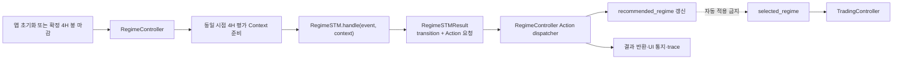
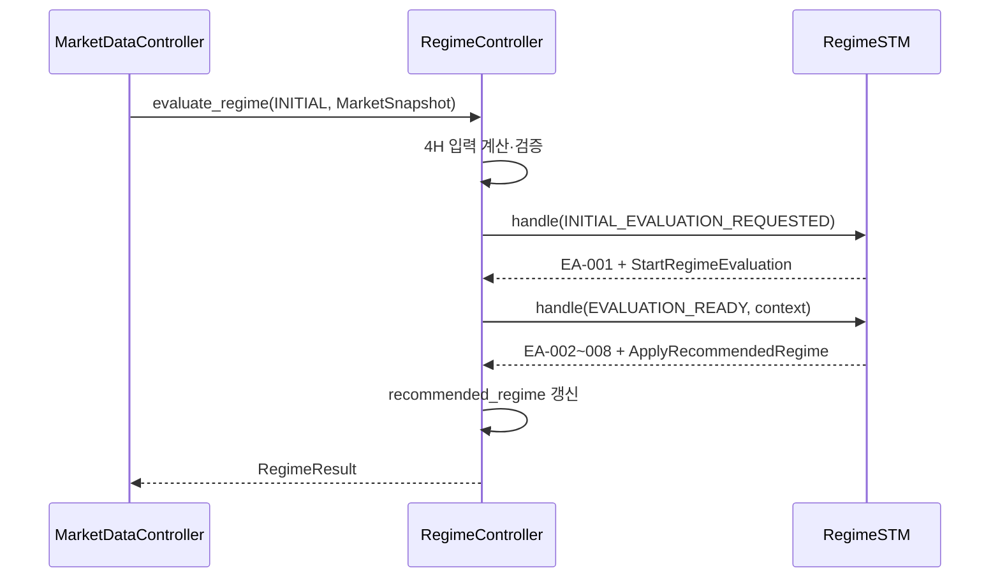
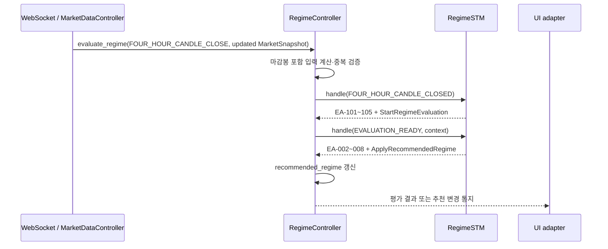

# RegimeSTM 구현 계획 — RegimeController와 책임 분리

| 항목 | 내용 |
|---|---|
| 문서 상태 | Accepted design — Phase 0 Communication/지표 정책 동기화 완료 |
| 작성일 | 2026-08-14 |
| 최종 명세 반영일 | 2026-08-20 |
| 대상 | `RegimeController`, `RegimeSTM`, 4H REGIME 추천 평가 경계 |
| 핵심 목표 | Event-Action Table의 상태·가드·다음 상태·Action 종류는 `RegimeSTM`이 결정하고, `Action` 열의 실제 작업은 `RegimeController`가 수행하도록 책임을 분리한다. |

## 1. 결론

`RegimeSTM`은 **현재 상태와 불변 4H 평가 입력을 받아 전이와 필요한 Action 요청을 결정하는 동기식 결정 엔진**으로 구현한다. `RegimeController`는 **평가 입력을 준비하고 STM 결과에 포함된 Action 요청을 실제로 수행하는 조정자**로 구현한다.

두 클래스의 경계는 다음 문장으로 고정한다.

> `RegimeSTM`은 어떤 상태로 전이하고 어떤 Action이 필요한지 결정하며, `RegimeController`는 그 Action을 실행한다.

이 원칙을 코드 수준으로 풀면 다음과 같다.

- `RegimeSTM`은 `current_state`, 이벤트, 읽기 전용 평가 Context만 사용한다.
- `RegimeSTM`은 Event-Action ID, 다음 상태, 수행할 Action 요청을 `RegimeSTMResult`로 반환한다.
- `RegimeSTM`이 자신의 `current_state`를 다음 상태로 바꾸는 것은 상태 전이 책임이며, Event-Action Table의 `Action`을 실행하는 것이 아니다.
- `RegimeSTM`은 `RegimeController.recommended_regime`, `selected_regime`, `IndicatorSnapshot`, UI 또는 거래 로직을 직접 변경하거나 호출하지 않는다.
- `RegimeController`는 4H 데이터와 현재가를 같은 평가 시점으로 고정하고, 지표를 계산하며, STM을 호출하고, 반환된 Action 요청을 순서대로 수행한다.
- 추천값을 `recommended_regime`에 반영하는 주체는 오직 `RegimeController`이다.
- 추천 결과는 사용자의 `selected_regime`을 자동으로 덮어쓰지 않는다. `selected_regime`은 사용자 선택 경로인 `set_regime_type()`에서만 변경한다.
- Event-Action Table의 `EA-001`~`EA-008`, `EA-101`~`EA-105`를 코드의 transition ID와 테스트 이름에 그대로 보존한다.

## 2. 검토 범위와 설계 기준

### 2.1 기준 문서

- [4H REGIME Event-Action Table](../Design/Trading_Logic/Event_Action_Table/4H_REGIME_Event_Action_Table.md)
- [Communication Diagram Message Flow Specification](../Design/Architecture/Communication_Diagram_Message_Flow_Specification.md)의 `8.11 RegimeController`, `8.13 RegimeSTM`
- [프로젝트 Coding Conventions](../CODING_CONVENTIONS.md)

### 2.2 문서별 적용 범위

| 관심사 | 1차 기준 | 적용 방식 |
|---|---|---|
| 상태, 이벤트, 가드, 다음 상태, 경계값 | 4H REGIME Event-Action Table | transition registry와 테스트 추적성의 원본으로 사용한다. |
| Controller/STM의 클래스 경계와 기존 operation | Communication Diagram 8.11, 8.13 | 기존 호출 의도를 유지하되 STM의 반환형을 결정 결과로 구체화한다. |
| Python 이름과 형식 | `CODING_CONVENTIONS.md` | 클래스는 `PascalCase`, 함수·변수는 `snake_case`를 사용한다. |

### 2.3 Event-Action Table에 반영된 해석

Event-Action Table은 기존의 단일 `액션` 표현을 `RegimeSTM 결정`과 `RegimeController 수행 Action`으로 분리했다. 구현에서는 다음 세 요소를 각각의 책임으로 유지한다.

1. **전이 선택:** 이벤트와 가드로 적용할 `EA-*` 행을 고른다. `RegimeSTM` 책임이다.
2. **상태 변경:** 선택된 행의 `다음 상태`로 `current_state`를 전이한다. `RegimeSTM` 책임이다.
3. **Action 수행:** 선택된 행의 Action 요청에 따라 평가를 진행하거나 추천값을 반영한다. `RegimeController` 책임이다.

`RegimeSTM`이 Action 요청 값을 만드는 것은 Action의 **결정**이지 Action의 **수행**이 아니다. Action 요청은 실행 가능한 callback이나 Controller 참조가 아니라 직렬화 가능한 불변 값이어야 한다.

## 3. 책임 분리

### 3.1 책임 매트릭스

| 책임 | RegimeSTM | RegimeController |
|---|---:|---:|
| 현재 `RegimeState` 소유 | O | X |
| 이벤트별 transition 후보 탐색 | O | X |
| `ema9_slope`, 구조, 가격 위치 가드 판정 | O | X |
| 적용할 Event-Action ID 선택 | O | X |
| 다음 상태 결정 및 상태 전이 | O | X |
| 수행할 Action 요청 생성 | O | X |
| `MarketSnapshot`에서 4H 봉 분리 | X | O |
| EMA9, slope, swing structure, live EMA9 계산 | X | O |
| 동일 평가 시점의 불변 Context 생성·검증 | X | O |
| 외부 4H 마감 이벤트 정규화와 중복 제거 | X | O |
| `RegimeSTMResult`의 Action 수행 | X | O |
| `recommended_regime` 갱신 | X | O |
| 추천 결과 통지와 trace 기록 | 결과 데이터 제공 | O |
| `selected_regime` 변경 | X | 사용자 선택 요청 시 O |
| `TradingController` 연결 | X | 사용자 선택 요청 시 O |
| 결측치, stale snapshot, 계산 실패 처리 | X | O |

### 3.2 RegimeSTM이 하지 않아야 하는 일

다음 동작이 `RegimeSTM` 또는 그 guard/transition 모듈에 들어가면 책임 분리가 실패한 것으로 본다.

- `RegimeController`, `MarketDataController`, `TradingController`, UI 클래스 호출
- `MarketSnapshot`이나 mutable `IndicatorSnapshot` 직접 조회 또는 변경
- `recommended_regime` 또는 `selected_regime` 쓰기
- EMA9, LR slope, swing high/low를 원시 candle에서 새로 계산
- WebSocket, REST API, 파일, DB, timer 또는 event bus 호출
- wall-clock을 직접 읽어 입력 snapshot의 시점을 보완
- Action 요청 안에 실행 함수, Controller 객체, mutable Entity를 넣기
- 가드와 같은 분기식을 Controller가 실행하도록 미루기

### 3.3 RegimeController가 하지 않아야 하는 일

Controller에도 추천 정책을 중복 작성하지 않는다.

- slope 구간으로 `TYPE_0`~`TYPE_4`를 선택하는 `if/elif`를 두지 않는다.
- `HH && HL`, `LH && LL`, 현재가와 live EMA9 관계로 추천 타입을 직접 결정하지 않는다.
- STM이 반환하지 않은 추천 타입을 기본값으로 임의 적용하지 않는다.
- 추천값 변경을 사용자 선택값 변경으로 해석하지 않는다.
- STM의 `current_state`를 직접 대입하거나 실패 복구를 이유로 되돌리지 않는다.

Controller는 입력의 완전성·시점·중복 여부와 Action 실행 전제조건을 검증할 수 있다. 이는 추천 가드를 중복 판정하는 것이 아니라 실행 안전성을 보장하는 책임이다.

## 4. 목표 실행 구조



의존성 방향은 다음과 같이 제한한다.

```text
RegimeController -> RegimeSTM
RegimeController -> MarketSnapshot / IndicatorSnapshot / TradingController / UI adapter
RegimeSTM        -> event / immutable evaluation context / state / guard / result / action request
RegimeSTM        -X-> Controller / Gateway / UI / mutable snapshot
```

## 5. 상태와 이벤트 모델

### 5.1 RegimeState

Event-Action Table의 상태를 다음 enum으로 정규화한다.

```python
class RegimeState(Enum):
    INITIAL = auto()
    FOUR_HOUR_CANDLE_EVALUATION = auto()
    TYPE_0_RECOMMENDED = auto()
    TYPE_1_RECOMMENDED = auto()
    TYPE_2_RECOMMENDED = auto()
    TYPE_3_RECOMMENDED = auto()
    TYPE_4_RECOMMENDED = auto()
```

- `current_state`는 `RegimeSTM`만 변경한다.
- 다섯 추천 상태는 각 `RegimeType`과 일대일로 매핑한다.
- Controller의 `recommended_regime`은 마지막으로 성공적으로 적용된 추천값이다.
- 정상적인 한 평가 cycle이 끝난 뒤에는 STM의 추천 상태와 Controller의 `recommended_regime`이 일치해야 한다.
- `FOUR_HOUR_CANDLE_EVALUATION`은 평가 cycle 중간 상태이며 추천값 저장소가 아니다. 이 상태에 있는 동안 기존 `recommended_regime`은 유지한다.

### 5.2 RegimeEvent

외부 이벤트와 내부 평가 이벤트를 구분한다.

```python
class RegimeEventType(Enum):
    INITIAL_EVALUATION_REQUESTED = auto()
    FOUR_HOUR_CANDLE_CLOSED = auto()
    EVALUATION_READY = auto()
```

```python
class RegimeEvaluationTrigger(Enum):
    INITIAL = auto()
    FOUR_HOUR_CANDLE_CLOSE = auto()
```

```python
@dataclass(frozen=True)
class RegimeEvent:
    event_type: RegimeEventType
    event_id: str
    occurred_at: datetime
    evaluation_id: str
    source_candle_id: str | None = None
```

- `INITIAL_EVALUATION_REQUESTED`는 최소 데이터가 준비된 최초 한 번의 평가를 시작한다.
- `FOUR_HOUR_CANDLE_CLOSED`는 `interval == FOUR_HOURS`이고 확정된 봉에 대해서만 생성한다.
- `EVALUATION_READY`는 Controller가 검증된 `RegimeEvaluationContext`를 준비한 뒤 생성하는 내부 이벤트다.
- `event_id`와 `source_candle_id`는 중복 4H close 처리를 막는다.
- `evaluation_id`는 시작 transition, 평가 transition, Action 실행 및 trace를 하나의 cycle로 묶는다.

### 5.3 한 평가 cycle의 두 단계

Event-Action Table의 구조를 보존하기 위해 평가 cycle을 두 transition으로 처리한다.

1. `EA-001` 또는 현재 추천 상태에 대응하는 `EA-101`~`EA-105`가 `FOUR_HOUR_CANDLE_EVALUATION`으로 전이하고 `StartRegimeEvaluation`을 요청한다.
2. Controller가 그 요청을 수행하여 동일 `evaluation_id`의 `EVALUATION_READY`를 전달한다.
3. `EA-002`~`EA-008` 중 정확히 하나가 가드에 따라 추천 상태로 전이하고 `ApplyRecommendedRegime`을 요청한다.
4. Controller가 추천값을 실제로 반영하고 결과를 반환·통지한다.

Controller는 첫 transition을 보내기 전에 평가 Context를 완전히 계산하고 검증한다. 따라서 `FOUR_HOUR_CANDLE_EVALUATION`으로 전이한 뒤 입력 결측 때문에 멈추는 상황을 만들지 않는다. 계산 또는 검증에 실패하면 STM 이벤트를 보내지 않고 마지막 정상 상태와 추천값을 유지한다.

## 6. 불변 평가 입력 계약

### 6.1 Phase 0 이전 계약의 입력 공백

Phase 0 이전 Communication Diagram 8.13의 operation은 다음과 같았다.

```text
run(indicators : IndicatorSnapshot) : RegimeType
```

이 signature는 Phase 0에서 canonical `handle(event, context) : RegimeSTMResult`로
교체되었다. 변경 이유는 Event-Action 가드가 `current_price`와
`realtime_4h_ema9`의 비교를 요구하지만 8.12의 `IndicatorSnapshot`만으로는 같은 시점의
가격과 snapshot version을 보장할 수 없었기 때문이다. STM이 `MarketSnapshot`이나
Controller에서 가격을 추가 조회하게 만들면 한 가드 안에서 시점이 다른 값이 섞일 수
있다.

따라서 STM에는 모든 가드 입력을 하나로 묶은 불변 `RegimeEvaluationContext`를 전달한다.

### 6.2 RegimeEvaluationContext

```python
@dataclass(frozen=True)
class RegimeEvaluationContext:
    evaluation_id: str
    symbol: str
    timeframe: Interval
    ema9_slope: Decimal
    has_higher_high: bool
    has_higher_low: bool
    has_lower_high: bool
    has_lower_low: bool
    current_price: Decimal
    live_ema9: Decimal
    source_market_version: int
    source_candle_id: str | None
    calculated_at: datetime
```

필수 불변식은 다음과 같다.

- `timeframe == FOUR_HOURS`이다.
- `ema9_slope`, `current_price`, `live_ema9`는 finite `Decimal`이다.
- 가격과 EMA9는 0보다 크다.
- 모든 값은 같은 `MarketSnapshot` version에서 파생된다.
- 재평가에서는 `source_candle_id`가 방금 확정된 4H 봉을 식별한다.
- `HH + HL`은 `has_higher_high and has_higher_low`로 판정한다.
- `LH + LL`은 `has_lower_high and has_lower_low`로 판정한다.
- 문자열 또는 산술 `+`로 swing 구조를 표현하지 않는다.

`RegimeController.calculate_4h_indicators()`는 기존 `IndicatorSnapshot`을 만들 수 있다. Controller가 여기에 같은 `MarketSnapshot`의 `current_price`, version, candle ID를 결합해 `RegimeEvaluationContext`를 생성한다. STM에는 mutable `IndicatorSnapshot` 자체를 전달하지 않는다.

### 6.3 입력 준비 실패 정책

다음 경우에는 `EVALUATION_READY`를 생성하지 않는다.

- EMA9 또는 slope 계산에 필요한 확정 4H 봉이 부족함
- swing structure 계산에 필요한 swing point가 부족함
- 현재가 또는 live EMA9가 결측·비정상 값임
- 계산 도중 원본 `MarketSnapshot` version이 변경됨
- 재평가 대상 4H 봉이 미확정이거나 이미 처리됨

이때 Controller는 다음 원칙을 지킨다.

- 최초 평가 전이면 `recommended_regime`을 `None`으로 유지한다.
- 기존 추천이 있으면 마지막 정상 추천과 STM 상태를 유지한다.
- 실패 원인, snapshot version, candle ID를 기록한다.
- 기본 `TYPE_0` 또는 다른 추천값을 임의 적용하지 않는다.
- retry 시점과 사용자 통지 정책은 구현 전에 별도로 확정한다.

## 7. 핵심 결과와 Action 계약

### 7.1 RegimeActionRequest

Event-Action Table의 Action은 다음 불변 값 타입으로 표현한다.

```python
@dataclass(frozen=True)
class StartRegimeEvaluation:
    evaluation_id: str
    trigger: RegimeEvaluationTrigger
    source_candle_id: str | None


@dataclass(frozen=True)
class ApplyRecommendedRegime:
    evaluation_id: str
    regime_type: RegimeType
    source_candle_id: str | None


RegimeActionRequest: TypeAlias = (
    StartRegimeEvaluation | ApplyRecommendedRegime
)
```

`RegimeSTM`은 이 값을 만들기만 한다. 실제 동작은 다음과 같이 Controller가 수행한다.

| Action 요청 | RegimeController 수행 내용 |
|---|---|
| `StartRegimeEvaluation` | 준비해 둔 Context와 같은 `evaluation_id`인지 검증하고 `EVALUATION_READY` 내부 이벤트를 STM에 전달한다. |
| `ApplyRecommendedRegime` | `recommended_regime`과 추천 결과 metadata를 원자적으로 갱신하고 결과를 반환·통지한다. |

Action 요청에는 함수, coroutine, Controller/Gateway/UI 객체 또는 mutable snapshot을 넣지 않는다.

### 7.2 RegimeSTMResult

```python
@dataclass(frozen=True)
class RegimeSTMResult:
    decision_id: str
    consumed: bool
    transition_id: str | None
    state_before: RegimeState
    state_after: RegimeState
    action_requests: tuple[RegimeActionRequest, ...]
    evaluation_id: str
```

필수 규칙은 다음과 같다.

- 한 `handle()` 호출은 최대 하나의 Event-Action transition을 선택한다.
- 선택된 경우 `transition_id`는 원문 `EA-*` ID이다.
- transition이 없으면 상태를 바꾸지 않는 명시적 no-op 결과를 반환한다.
- 실행 가능한 객체나 mutable 도메인 객체를 결과에 담지 않는다.
- `state_before`, `state_after`, Action 순서로 결정 과정을 완전히 추적할 수 있어야 한다.

### 7.3 Controller가 보유할 RegimeResult

Controller의 상세 결과는 추천 타입만 반환하는 것보다 다음 metadata를 함께 보존하는 것이 좋다.

```python
@dataclass(frozen=True)
class RegimeResult:
    evaluation_id: str
    recommended_type: RegimeType
    previous_recommended_type: RegimeType | None
    changed: bool
    transition_id: str
    state: RegimeState
    source_candle_id: str | None
    calculated_at: datetime
```

외부 호환성이 필요하면 `recommend_regime()`은 `RegimeResult.recommended_type`만 반환할 수 있다. 다만 내부 trace와 UI 갱신에는 전체 `RegimeResult`를 사용한다.

## 8. Event-Action Table 책임 매핑

아래 표에서 `RegimeSTM 결정`은 전이 선택과 Action 요청 생성을 뜻한다. 실제 Action은 마지막 열의 `RegimeController 수행`에만 존재한다.

| ID | RegimeSTM 결정 | 다음 상태 | RegimeController 수행 Action |
|---|---|---|---|
| `EA-001` | 최초 평가 시작 transition과 `StartRegimeEvaluation(INITIAL)` 요청 | `FOUR_HOUR_CANDLE_EVALUATION` | 준비된 최초 평가 Context를 검증하고 `EVALUATION_READY`를 전달한다. |
| `EA-002` | 횡보 가드 선택과 `ApplyRecommendedRegime(TYPE_0)` 요청 | `TYPE_0_RECOMMENDED` | `recommended_regime = TYPE_0`을 적용하고 결과를 통지한다. |
| `EA-003` | 약상승 slope 가드 선택과 `ApplyRecommendedRegime(TYPE_1)` 요청 | `TYPE_1_RECOMMENDED` | `recommended_regime = TYPE_1`을 적용하고 결과를 통지한다. |
| `EA-004` | 강상승 복합조건 실패 가드 선택과 `ApplyRecommendedRegime(TYPE_1)` 요청 | `TYPE_1_RECOMMENDED` | `recommended_regime = TYPE_1`을 적용하고 결과를 통지한다. |
| `EA-005` | 강상승 복합조건 성공 가드 선택과 `ApplyRecommendedRegime(TYPE_2)` 요청 | `TYPE_2_RECOMMENDED` | `recommended_regime = TYPE_2`를 적용하고 결과를 통지한다. |
| `EA-006` | 약하락 slope 가드 선택과 `ApplyRecommendedRegime(TYPE_3)` 요청 | `TYPE_3_RECOMMENDED` | `recommended_regime = TYPE_3`을 적용하고 결과를 통지한다. |
| `EA-007` | 강하락 복합조건 실패 가드 선택과 `ApplyRecommendedRegime(TYPE_3)` 요청 | `TYPE_3_RECOMMENDED` | `recommended_regime = TYPE_3`을 적용하고 결과를 통지한다. |
| `EA-008` | 강하락 복합조건 성공 가드 선택과 `ApplyRecommendedRegime(TYPE_4)` 요청 | `TYPE_4_RECOMMENDED` | `recommended_regime = TYPE_4`를 적용하고 결과를 통지한다. |
| `EA-101` | TYPE 0 상태의 4H 마감 transition과 `StartRegimeEvaluation(FOUR_HOUR_CANDLE_CLOSE)` 요청 | `FOUR_HOUR_CANDLE_EVALUATION` | 마감봉을 포함한 준비 Context로 `EVALUATION_READY`를 전달한다. |
| `EA-102` | TYPE 1 상태의 4H 마감 transition과 동일 요청 | `FOUR_HOUR_CANDLE_EVALUATION` | 위와 동일 |
| `EA-103` | TYPE 2 상태의 4H 마감 transition과 동일 요청 | `FOUR_HOUR_CANDLE_EVALUATION` | 위와 동일 |
| `EA-104` | TYPE 3 상태의 4H 마감 transition과 동일 요청 | `FOUR_HOUR_CANDLE_EVALUATION` | 위와 동일 |
| `EA-105` | TYPE 4 상태의 4H 마감 transition과 동일 요청 | `FOUR_HOUR_CANDLE_EVALUATION` | 위와 동일 |

같은 TYPE이 다시 추천되어도 STM transition과 평가 trace는 남긴다. Controller의 값 대입은 idempotent하게 수행하고, UI의 “추천 변경” 알림은 `previous_recommended_type != recommended_type`일 때만 발생시킨다. 매 평가 결과 표시가 필요하면 별도의 “평가 완료” 통지를 사용한다.

## 9. 가드 구현 방침

### 9.1 상수와 이름 정규화

경계값은 float literal이 아니라 `Decimal` 상수로 정의한다.

```python
SIDEWAYS_MIN_SLOPE = Decimal("-0.15")
SIDEWAYS_MAX_SLOPE = Decimal("0.15")
STRONG_DOWN_SLOPE = Decimal("-0.30")
STRONG_UP_SLOPE = Decimal("0.30")
```

- 구현 이름은 `ema9_slope`로 통일한다. 원문의 `ema_9_slope`를 별도 필드로 만들지 않는다.
- 실시간 EMA9는 `live_ema9`로 통일한다. 원문의 `realtime_4h_ema9`는 명세 표현 alias로만 취급한다.
- 강상승 구조는 `has_higher_high and has_higher_low`이다.
- 강하락 구조는 `has_lower_high and has_lower_low`이다.

### 9.2 순수 guard

각 guard는 상태나 외부 객체를 변경하지 않는 순수 함수로 만든다.

```python
def matches_type_2(context: RegimeEvaluationContext) -> bool:
    return (
        context.ema9_slope >= STRONG_UP_SLOPE
        and context.has_higher_high
        and context.has_higher_low
        and context.current_price >= context.live_ema9
    )
```

Controller는 guard 함수를 호출하지 않는다. `RegimeSTM`의 transition registry만 guard를 참조한다.

### 9.3 완전성과 배타성

유효한 평가 입력에는 `EA-002`~`EA-008` 중 정확히 하나만 선택되어야 한다. 구현 전에 다음 속성을 테스트로 고정한다.

- 모든 유효한 slope 값에 추천 결과가 존재한다.
- 같은 입력에서 두 transition이 동시에 참이 되지 않는다.
- `-0.15`, `0.15`는 `TYPE_0`이다.
- `-0.30`은 강하락 분기, `0.30`은 강상승 분기다.
- `current_price == live_ema9`는 강한 구조가 충족되면 각각 `TYPE_2` 또는 `TYPE_4`에 포함된다.

### 9.4 EA-007 정규화 결정

원문 `EA-007`은 아래 조건만 포함한다.

```text
ema9_slope <= -0.30
&& (LH && LL)
&& current_price > live_ema9
```

이 조건은 `ema9_slope <= -0.30`이지만 `LH && LL`이 성립하지 않는 경우를 처리하지 않는다. 수정된 Event-Action Table은 강하락 복합조건 전체의 실패를 `TYPE_3`으로 보내도록 다음 조건을 구현 기준으로 확정했다.

```text
ema9_slope <= -0.30
&& !((LH && LL) && current_price <= live_ema9)
```

따라서 `ema9_slope <= -0.30`인 유효 입력은 `EA-007` 또는 `EA-008` 중 정확히 하나로 처리된다. 원본 이미지와의 차이는 Event-Action Table 6절에 근거와 함께 보존되어 있다.

## 10. Controller 처리 알고리즘

### 10.1 단일 평가 진입점

권장 public API는 외부 trigger와 `MarketSnapshot`을 함께 받는 하나의 평가 operation이다.

```python
class RegimeController:
    def evaluate_regime(
        self,
        trigger: RegimeEvaluationTrigger,
        market_snapshot: MarketSnapshot,
    ) -> RegimeResult | None:
        ...

    def set_regime_type(self, regime_type: RegimeType) -> None:
        ...
```

`evaluate_regime()`의 처리 순서는 다음과 같다.

1. trigger가 최초 데이터 준비 또는 확정 4H 봉 마감인지 확인한다.
2. 중복 candle close와 stale `MarketSnapshot`을 차단한다.
3. 하나의 snapshot version에서 4H 지표와 현재가를 계산한다.
4. 불변 `RegimeEvaluationContext`를 만들고 완전성을 검증한다.
5. trigger에 대응하는 외부 `RegimeEvent`를 STM에 전달한다.
6. STM이 반환한 `StartRegimeEvaluation`을 Controller가 수행한다.
7. 같은 `evaluation_id`와 준비 Context로 `EVALUATION_READY`를 STM에 전달한다.
8. STM이 반환한 `ApplyRecommendedRegime`을 Controller가 수행한다.
9. 두 transition과 Action 결과를 하나의 evaluation trace로 기록한다.
10. `RegimeResult`를 호출자에게 반환한다.

Action 수행 중 STM을 재귀 호출하지 않는다. 위 6~7단계의 내부 이벤트는 Controller의 직렬 처리 loop에서 현재 transition 적용이 끝난 다음 microstep으로 처리한다. 동기 구현에서는 명시적인 local deque를 사용할 수 있다.

### 10.2 기존 operation의 구현 방침

Communication Diagram 8.11과 8.13의 operation은 다음처럼 구체화한다.

| 기존 Operation | 구현 방침 |
|---|---|
| `RegimeController.calculate4HIndicators(snapshot) : IndicatorSnapshot` | Controller의 순수 계산 보조 operation으로 유지한다. 확정봉과 진행봉을 분리하고 결과에 원본 snapshot version을 연결한다. |
| `RegimeController.recommendRegime(indicators) : RegimeType` | 기존 호출 호환용 façade로만 둔다. canonical 경로는 trigger와 MarketSnapshot을 함께 받는 `evaluate_regime()`이며, façade도 내부에서 동일 Action 실행 경로를 사용해야 한다. |
| `RegimeController.setRegimeType(regimeType) : void` | 사용자 선택값만 갱신하고 선택된 TradingSTM 연결을 수행한다. 추천 Action에서 호출하지 않는다. |
| `RegimeSTM.run(indicators) : RegimeType` (폐기된 초안) | 책임을 혼합하므로 canonical API로 사용하지 않는다. 초기화 wrapper가 필요하면 `handle()`을 호출해 `RegimeSTMResult`를 반환해야 한다. |

`RegimeSTM`의 canonical API는 다음과 같다.

```python
class RegimeSTM:
    def handle(
        self,
        event: RegimeEvent,
        context: RegimeEvaluationContext | None,
    ) -> RegimeSTMResult:
        ...
```

`INITIAL_EVALUATION_REQUESTED`와 `FOUR_HOUR_CANDLE_CLOSED`에는 이미 검증된 Context의 `evaluation_id`를 연결하되 가드 평가는 하지 않는다. `EVALUATION_READY`에서만 Context를 사용해 `EA-002`~`EA-008` 가드를 평가한다.

### 10.3 Action dispatcher

Controller는 Action 타입별 handler를 명시적으로 둔다.

```python
class RegimeController:
    def _apply_stm_result(self, result: RegimeSTMResult) -> None:
        ...

    def _execute_action(self, action: RegimeActionRequest) -> None:
        ...

    def _start_regime_evaluation(
        self,
        action: StartRegimeEvaluation,
    ) -> None:
        ...

    def _apply_recommended_regime(
        self,
        action: ApplyRecommendedRegime,
    ) -> RegimeResult:
        ...
```

Action dispatcher는 알 수 없는 Action 타입을 무시하지 않고 programming error로 실패시킨다.

## 11. 초기 평가와 4H 재평가 흐름

### 11.1 최초 평가



### 11.2 확정 4H 봉 마감 재평가



4H 마감 이벤트를 처리하는 동안에는 직전 추천을 화면과 거래 선택 상태에서 제거하지 않는다. 새 추천은 `ApplyRecommendedRegime`가 성공한 뒤 한 번에 교체한다.

## 12. 추천값과 사용자 선택값의 분리

`RegimeController`가 두 값을 모두 보유하더라도 갱신 경로는 완전히 분리한다.

| 값 | 의미 | 변경 가능한 경로 |
|---|---|---|
| `recommended_regime` | 마지막 정상 4H 평가 결과 | `ApplyRecommendedRegime` Action handler만 가능 |
| `selected_regime` | 사용자가 실제 거래에 적용한 REGIME | `set_regime_type()` 사용자 선택 경로만 가능 |

필수 불변식은 다음과 같다.

- 최초 추천이 계산되어도 `selected_regime`은 `None`일 수 있다.
- 새 4H 마감으로 추천값이 바뀌어도 `selected_regime`은 유지한다.
- `ApplyRecommendedRegime` handler는 `TradingController.fetch_selected_trading_logic()`를 호출하지 않는다.
- `set_regime_type()`은 STM의 추천 상태를 변경하지 않는다.
- UI에는 “추천”과 “선택”을 별도 필드로 전달한다.

## 13. 동시성, 중복 및 stale 결과 방지

### 13.1 단일 writer

`RegimeController`는 한 symbol의 평가 cycle을 직렬화한다. WebSocket callback에서 STM을 직접 동시에 호출하지 않는다.

- `RegimeSTM.handle()` 호출과 Action batch 등록은 한 evaluation lock 또는 단일 consumer queue 안에서 수행한다.
- `recommended_regime`은 해당 Controller만 쓴다.
- 내부 `EVALUATION_READY`는 다음 외부 4H close 이벤트보다 먼저 처리한다.

### 13.2 식별자와 중복 제거

- 확정봉은 `symbol + interval + open_time` 또는 거래소가 보장하는 동등한 candle ID로 식별한다.
- 이미 성공 처리한 `source_candle_id`는 다시 평가하지 않는다.
- 같은 `event_id`의 재전달은 no-op으로 기록한다.
- `evaluation_id`가 현재 준비 Context와 다르면 Action을 수행하지 않는다.

### 13.3 stale Context

Context 준비 중 `MarketSnapshot` version이 바뀌면 새 version으로 처음부터 다시 준비한다. 이전 Context 결과를 최신 추천값에 적용하지 않는다. 이미 시작된 평가보다 더 새로운 확정 4H 봉이 도착하면 현재 cycle을 끝낸 뒤 최신 봉을 다음 cycle로 처리한다.

## 14. 오류 처리 원칙

현재 Event-Action Table에는 계산 실패, 입력 결측, Action 실패에 대한 상태가 없다. 구현에서 임의의 실패 transition을 추가하지 않고 다음 경계를 사용한다.

| 오류 | 처리 주체 | 기본 처리 |
|---|---|---|
| 입력 부족·지표 계산 실패 | RegimeController | STM 호출 전 중단, 마지막 정상 추천 유지, 오류 기록 |
| 중복·오래된 4H close | RegimeController | 무시하되 dedup trace 기록 |
| 유효 입력인데 가드 미선택 | RegimeSTM 결과를 받은 Controller | 명세 결함으로 fail closed, 추천값 유지, 고우선 오류 기록 |
| 알 수 없는 Action 타입 | RegimeController | programming error로 실패, 임의 실행 금지 |
| 추천값 UI 통지 실패 | RegimeController/UI adapter | 추천값 적용은 유지하고 통지만 재시도 또는 오류 표시 |

가드 미선택은 기본 추천으로 보완하지 않는다. `EA-007` 공백을 정규화한 뒤에도 유효 입력에서 가드가 선택되지 않으면 명세 또는 구현 결함으로 처리한다.

## 15. 권장 파일 구조

실제 구현을 시작하면 `RegimeSTM` 아래를 다음처럼 구성한다.

```text
RegimeSTM/
├── Regime_STM_Implementation_Plan.md
├── pyproject.toml
├── src/
│   └── binance_auto_trader/
│       └── regime/
│           ├── controller.py
│           ├── states.py
│           ├── events.py
│           ├── evaluation.py
│           ├── action_requests.py
│           ├── results.py
│           ├── guards.py
│           ├── transitions.py
│           └── stm.py
└── tests/
    ├── unit/
    │   ├── test_guards.py
    │   ├── test_initial_transitions.py
    │   ├── test_recommendation_transitions.py
    │   └── test_re_evaluation_transitions.py
    ├── integration/
    │   ├── test_controller_action_execution.py
    │   ├── test_initial_evaluation_flow.py
    │   └── test_four_hour_close_flow.py
    └── architecture/
        └── test_regime_stm_boundaries.py
```

`controller.py`가 Action 수행의 유일한 진입점이다. 계산 코드가 커지면 순수 indicator calculator를 별도 모듈로 추출할 수 있지만, 계산 요청·snapshot 일관성·결과 적용의 조정 책임은 계속 `RegimeController`에 남긴다.

## 16. 클래스별 구현 항목

### 16.1 RegimeSTM

구현 항목은 다음과 같다.

- `current_state` 초기화와 읽기 전용 노출
- 상태와 이벤트별 transition index
- `EA-001`, `EA-101`~`EA-105` 시작 transition
- `EA-002`~`EA-008` 순수 guard와 추천 transition
- 상태 전이의 원자적 적용
- typed Action 요청 생성
- no-op 결과와 transition trace 데이터 반환

STM의 모든 메서드는 동기식으로 유지한다. STM 안에 `async`, timer 또는 I/O가 필요해지면 책임이 Controller에서 넘어온 것은 아닌지 먼저 검토한다.

### 16.2 RegimeController

구현 항목은 다음과 같다.

- 확정 4H 봉과 진행 중 4H 봉 분리
- EMA9 series, 최근 6개 EMA9 LR slope, swing structure, live EMA9 계산
- 같은 snapshot의 현재가 결합
- `RegimeEvaluationContext` validation
- initial/candle-close 이벤트 정규화와 deduplication
- `RegimeSTMResult` Action dispatcher
- `recommended_regime`과 `RegimeResult` 갱신
- 평가/transition/action trace 기록
- 추천 결과와 사용자 선택 결과의 별도 통지
- `set_regime_type()`에서만 TradingController 연결

## 17. 테스트 전략

### 17.1 Event-Action 추적성

현재 표에는 총 **13개 transition ID**가 있다.

- 시작: `EA-001`
- 추천 판정: `EA-002`~`EA-008`
- 재평가 시작: `EA-101`~`EA-105`

각 ID마다 최소 한 개의 positive transition test를 둔다. 구현의 transition registry ID 집합과 명세 ID 집합을 비교해 누락·중복을 실패시키는 coverage test를 추가한다.

### 17.2 STM 단위 테스트

STM 테스트에는 Controller나 Gateway mock이 필요 없어야 한다.

```text
Given: RegimeState + RegimeEvent + RegimeEvaluationContext
When:  RegimeSTM.handle()
Then:  transition ID + next state + ordered Action 요청
```

필수 검증 항목은 다음과 같다.

- `INITIAL`에서 `EA-001`만 선택됨
- 각 추천 상태에서 같은 4H close 이벤트가 각각 `EA-101`~`EA-105`로 매핑됨
- `FOUR_HOUR_CANDLE_EVALUATION`에서만 `EA-002`~`EA-008` 평가가 가능함
- 동일 입력의 결정론
- `-0.30`, `-0.15`, `0.15`, `0.30` 정확한 경계
- 강상승 구조 충족/미충족과 가격의 EMA9 상단/하단 조합
- 강하락 구조 충족/미충족과 가격의 EMA9 상단/하단 조합
- `ema9_slope <= -0.30`이고 `LH && LL`이 거짓일 때 `EA-007`이 선택되는지
- `current_price == live_ema9` 경계
- transition이 없는 이벤트가 상태를 변경하지 않음
- STM 결과 생성만으로 Controller의 추천값이나 입력 객체가 바뀌지 않음

### 17.3 Controller Action 테스트

fake market snapshot과 spy observer를 사용해 다음을 검증한다.

- 첫 STM 결과 후 `StartRegimeEvaluation`을 Controller가 실행하는가
- 두 번째 STM 결과 전에는 새 추천값을 적용하지 않는가
- `ApplyRecommendedRegime` 이후에만 `recommended_regime`이 바뀌는가
- 추천 변경이 `selected_regime`을 바꾸지 않는가
- 추천 Action 경로가 `TradingController`를 호출하지 않는가
- 같은 추천 재적용이 안전하고 중복 “변경” 알림을 만들지 않는가
- 결측 입력과 stale snapshot에서 STM을 호출하지 않는가
- 같은 4H candle close가 한 번만 처리되는가
- Action의 `evaluation_id`가 다르면 적용을 거부하는가

### 17.4 구조 테스트

- `stm.py`, `guards.py`, `transitions.py`에서 Controller, Gateway, UI package import를 금지한다.
- STM package에서 network, file API, timer, mutable `MarketSnapshot` 사용을 금지한다.
- `RegimeSTM.handle()` 반환형이 `RegimeType`이 아니라 `RegimeSTMResult`인지 검사한다.
- `recommended_regime` 대입이 Controller Action handler 외부에 존재하지 않는지 정적 검사한다.
- `selected_regime` 대입이 사용자 선택 경로 외부에 존재하지 않는지 검사한다.

### 17.5 통합 시나리오

- 초기 데이터 준비 → `EA-001` → `EA-002` → TYPE 0 추천 적용
- TYPE 0 → 4H 마감 → `EA-101` → `EA-003` → TYPE 1 변경
- TYPE 1 → 4H 마감 → `EA-102` → `EA-005` → TYPE 2 변경
- TYPE 2 → 4H 마감 → `EA-103` → `EA-006` → TYPE 3 변경
- TYPE 3 → 4H 마감 → `EA-104` → `EA-008` → TYPE 4 변경
- TYPE 4 → 4H 마감 → `EA-105` → `EA-002` → TYPE 0 변경
- 같은 TYPE 재추천과 변경 없음 통지
- 평가 입력 부족, 중복 candle, stale Context에서 마지막 추천 유지

동일 이벤트와 Context trace를 재생하면 동일 transition ID, 상태, Action 요청이 나와야 한다.

## 18. Phase 0 확정 항목

세부 공식과 golden vector는
`Design/Architecture/Decisions/ADR-004-persistence-performance-and-csv.md`를 기준으로 한다.

| 항목 | 확정 결정 |
|---|---|
| 지표 최소 데이터 | EMA9/LR slope는 최소 14개 확정 4H 봉, swing은 추가로 확정 high 2개와 low 2개가 모두 있어야 한다. |
| EMA9/LR slope | 9개 SMA seed, alpha `0.2`, 최근 6개 EMA9의 OLS slope를 같은 snapshot의 current price로 나누고 `* 100`한다. |
| snapshot 가격 시점 | 같은 MarketSnapshot version의 진행 중 4H 봉 최신 close를 current price와 live EMA9 입력으로 한 번만 사용한다. |
| swing | `left=2`, `right=2`, strict pivot, 유의 변화율 `0.30%`로 고정한다. |
| Decimal | precision 34, `ROUND_HALF_EVEN`; guard용 slope는 소수점 8자리로 고정한다. float는 금지한다. |
| 계산 실패 retry | 같은 snapshot version에서 즉시 반복하지 않는다. 다음 새 MarketSnapshot version 또는 다음 확정 4H close에서 다시 준비한다. 마지막 정상 추천은 유지한다. |
| process restart | 이전 STM 중간 상태를 복원하지 않고 최신 MarketSnapshot으로 새 `INITIAL_EVALUATION_REQUESTED` cycle을 실행한다. 입력 부족이면 추천은 `None`이며 기본 타입을 넣지 않는다. |

값을 변경하려면 ADR-004와 Communication 명세를 먼저 대체하고 golden fixture를 함께
갱신한다.

## 19. 구현 순서

### Phase 0 — 명세 정규화

- 완료: Event-Action Table을 `RegimeSTM 결정`과 `RegimeController 수행 Action`으로 분리했다.
- 완료: “STM은 Action 요청만 결정하고 Controller가 수행한다”는 계약을 추가했다.
- 완료: `EA-007`을 강하락 복합조건 전체 실패로 정규화했다.
- 완료: `ema9_slope`, `live_ema9`, `HH && HL`, `LH && LL`, 최초/재평가 이벤트와 입력 실패 원칙을 확정했다.
- 완료: Communication 메시지 `1.5.1`, 8.11과 8.13을 `handle(event, context) : RegimeSTMResult` 계약에 맞췄다.
- 완료: ADR-004에서 최소 데이터, snapshot tick, slope 단위, swing `0.30%`와 golden vector를 잠갔다.

완료 기준: 13개 행 모두에 전이 책임과 실제 Action 수행자가 분명히 지정되어 있다.

### Phase 1 — 불변 타입과 상태 골격

- `RegimeState`, `RegimeEvent`, `RegimeEvaluationContext`를 구현한다.
- `RegimeActionRequest`, `RegimeSTMResult`, `RegimeResult`를 구현한다.
- Context validation과 상태/추천 매핑 불변식 테스트를 먼저 작성한다.

완료 기준: 외부 I/O 없이 event, context, result를 만들 수 있다.

### Phase 2 — 순수 RegimeSTM

- `EA-001`, `EA-101`~`EA-105`를 구현한다.
- `EA-002`~`EA-008` guard와 transition registry를 구현한다.
- no-op, 결정론, 전체 경계값 테스트를 통과시킨다.

완료 기준: Controller 없이 13개 ID의 상태 전이와 Action 요청을 모두 검증할 수 있다.

### Phase 3 — RegimeController 입력 준비

- 4H 봉 분리와 지표 계산을 구현한다.
- 현재가를 결합한 불변 Context builder를 구현한다.
- 입력 부족, snapshot version, candle dedup 검증을 구현한다.

완료 기준: 같은 MarketSnapshot에서는 항상 같은 평가 Context가 생성된다.

### Phase 4 — Controller Action 수행

- 직렬 evaluation loop와 Action dispatcher를 구현한다.
- `StartRegimeEvaluation` → `EVALUATION_READY` microstep을 연결한다.
- `ApplyRecommendedRegime`과 `RegimeResult` 생성을 구현한다.
- 추천/선택 분리와 observer 통지를 검증한다.

완료 기준: STM 코드가 Controller 상태를 직접 변경하지 않고도 최초·재평가 cycle이 끝난다.

### Phase 5 — 통합과 추적성

- MarketDataController의 최초 평가와 4H close 호출을 연결한다.
- 13개 transition ID coverage test와 전체 시나리오 test를 통과시킨다.
- evaluation ID, candle ID, 전후 상태, 추천 전후값, Action 결과를 trace에 남긴다.

### Phase 6 — 설계 문서 동기화

- 완료: 4H REGIME Event-Action Table의 Action 수행 주체와 `EA-007`을 수정했다.
- 완료: Communication Diagram의 공통 타입, 메시지 `1.5/1.5.1`, 8.11, 8.12, 8.13을 실제 계약과 일치시켰다.
- 남음: production 통합 Phase에서 클래스/상태 다이어그램과 실제 import 의존성 방향을 architecture test로 확인한다.

## 20. 참조 문서에 필요한 후속 변경

4H REGIME Event-Action Table과 Communication 명세의 public 계약 변경은 완료되었다.
나머지 production 구조 검증은 해당 구현 Phase에서 수행한다.

### 20.1 4H REGIME Event-Action Table — 반영 완료

- 책임 계약을 추가하고 표를 `RegimeSTM 결정`과 `RegimeController 수행 Action`으로 구분했다.
- `EA-001`과 `EA-101`~`EA-105`에 `StartRegimeEvaluation` 요청과 Controller의 `EVALUATION_READY` 전달을 명시했다.
- `EA-002`~`EA-008`에 `ApplyRecommendedRegime` 요청과 Controller의 `recommended_regime` 갱신을 명시했다.
- `EA-007`을 강하락 복합조건 전체 실패가 `TYPE_3`으로 이어지는 완전한 조건으로 보완했다.
- 입력 snapshot, 추천/선택 분리, 중복·stale·결측 처리 계약을 추가했다.

### 20.2 Communication Diagram Message Flow Specification

- 완료: 공통 타입에 `RegimeEvent`, `RegimeEvaluationContext`, `RegimeActionRequest`, `RegimeSTMResult`를 추가했다.
- 완료: 메시지 `1.5.1`의 반환형을 `RegimeSTMResult`로 바꾸고 Controller의 두 microstep Action 수행을 명시했다.
- 완료: 8.11의 기능을 입력 준비, STM 실행, Action 수행과 추천/선택 분리로 명확히 했다.
- 완료: 8.13을 가드·다음 상태·Action 요청 결정 책임으로 바꾸고 canonical `handle`을 반영했다.
- 완료: 같은 snapshot의 `current_price`, version과 candle ID를 `RegimeEvaluationContext` 계약에 고정했다.

## 21. 구현 완료 기준

- `RegimeSTM`에는 외부 I/O, 지표 계산, Controller/Entity 변경 코드가 없다.
- `RegimeSTM.handle()`은 `RegimeType`이 아니라 `RegimeSTMResult`를 반환한다.
- Event-Action Table의 13개 ID가 transition registry와 테스트에 모두 연결되어 있다.
- `EA-002`~`EA-008`의 유효 입력에는 확정된 정책 기준으로 정확히 하나의 transition이 선택된다.
- `recommended_regime`은 `RegimeController`의 `ApplyRecommendedRegime` handler만 변경한다.
- 추천 평가가 `selected_regime`과 실제 TradingSTM을 자동 변경하지 않는다.
- 모든 guard 입력이 하나의 불변 평가 Context와 snapshot version에서 나온다.
- 확정 4H 봉 하나가 중복 평가되지 않고 stale 평가 결과가 적용되지 않는다.
- 입력 결측이나 계산 실패 시 임의 추천 없이 마지막 정상 추천을 유지한다.
- 같은 event/context trace를 재생하면 같은 transition, 상태 및 Action 요청이 나온다.
- trace만으로 evaluation ID, Event-Action ID, 전후 상태, 입력 snapshot, 요청 Action, 적용 추천을 역추적할 수 있다.

이 기준을 만족한 뒤에만 `RegimeController`의 추천 결과를 실제 UI 및 사용자 REGIME 선택 흐름과 연결한다.
