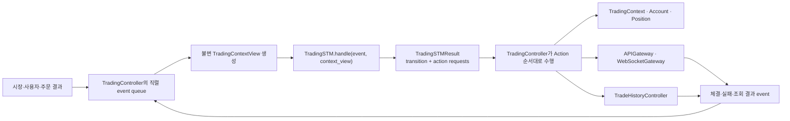
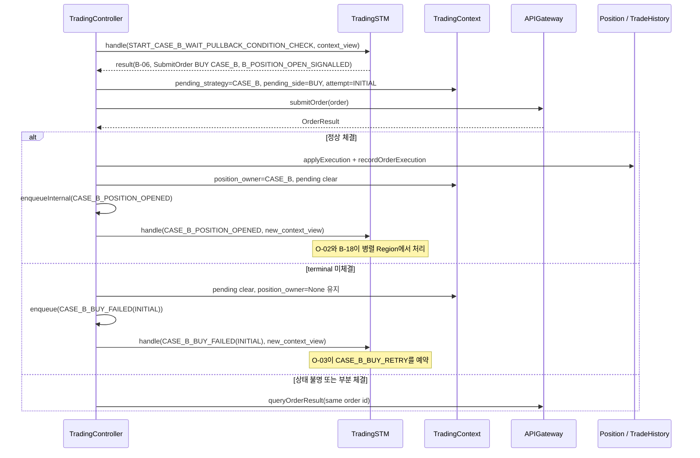

# TradingSTM 구현 계획 — TradingController와 책임 분리

| 항목 | 내용 |
|---|---|
| 문서 상태 | Proposed — Event-Action Table 책임 분리 반영 완료, 구현 전 설계 검토용 |
| 작성일 | 2026-08-14 |
| 최종 명세 반영일 | 2026-08-14 |
| 대상 | `TradingSTM`, `TradingController`, `TradingContext` 및 주문 결과 피드백 경계 |
| 핵심 목표 | Event-Action Table의 상태·Guard·우선순위는 `TradingSTM`이 판정하고, 모든 Action과 외부 효과는 `TradingController`가 수행하도록 책임을 분리한다. |

## 1. 결론

`TradingSTM`은 **상태 전이와 수행할 Action을 결정하는 동기식 결정 엔진**으로 구현한다. `TradingController`는 STM의 결정 결과를 받아 **Action을 실제로 수행하는 단일 조정자**로 구현한다.

따라서 두 클래스의 경계는 다음 한 문장으로 고정한다.

> `TradingSTM`은 무엇을 해야 하는지 결정하고, `TradingController`는 그것을 실행한 뒤 결과를 다시 이벤트로 전달한다.

구체적인 원칙은 다음과 같다.

- `TradingSTM`은 현재 상태, 입력 이벤트, 읽기 전용 Context snapshot만 사용해 Guard와 우선순위를 평가한다.
- `TradingSTM`은 자신의 상태 구성을 전이시키고, 실행할 Action을 값 객체인 `TradingSTMResult`에 담아 반환한다.
- `TradingSTM`은 `TradingContext`, `Account`, `Position`, 주문, 파일, 네트워크, timer, event queue를 직접 변경하거나 호출하지 않는다.
- `TradingController`만 `TradingSTMResult`의 Action 요청을 해석하고 `TradingContext`, `APIGateway`, `Position`, `TradeHistoryController` 등을 호출한다.
- Action 수행 결과는 Controller가 새로운 `TradingEvent`로 직렬화된 event queue에 넣는다. STM이 자기 자신을 재귀 호출하거나 즉시 무한 retry하지 않는다.
- 주문 요청과 체결 완료를 분리한다. `position_owner`는 매수 주문 요청 시점이 아니라 **terminal 결과의 실제 체결 수량을 Position에 반영한 뒤에만** Controller가 설정한다.
- Event-Action Table의 각 ID를 코드의 transition ID와 테스트 이름에 그대로 보존한다.
- 주문 결과로 Context가 먼저 변경된 경우 `CASE_*_POSITION_OPENED`, `CASE_*_SELL_FILLED`, `FORCE_SELL_FINISHED` 내부 EVENT를 다음 market EVENT보다 먼저 처리해 STM 상태와 Context를 즉시 다시 일치시킨다.

상태 전이는 STM의 고유 책임이며, Event-Action Table의 `Action` 열에 적힌 Context 변경, 이벤트 발생, 주문, 저장, 인계, 재평가 예약은 모두 Controller 실행 책임이다.

## 2. 검토 범위와 설계 기준

### 2.1 기준 문서

- [Trading Logic Event-Action Table](../Design/Trading_Logic/Event_Action_Table/Trading_Logic_Event_Action_Table.md)
- [Communication Diagram Message Flow Specification — 8.4 TradingController, 8.5 TradingSTM](../Design/Architecture/Communication_Diagram_Message_Flow_Specification.md#84-tradingcontroller)
- [프로젝트 Coding Conventions](../CODING_CONVENTIONS.md)

### 2.2 문서별 적용 범위

| 관심사 | 1차 기준 | 적용 방식 |
|---|---|---|
| 상태 이름, 이벤트, Guard, 전이, 판정 우선순위 | Trading Logic Event-Action Table | transition 정의와 테스트 추적성의 원본으로 사용한다. |
| 클래스 책임과 기존 public operation | Communication Diagram 8.4, 8.5 | Controller는 조정·실행, STM은 상태·Action 결정이라는 경계로 해석한다. |
| Python 이름과 형식 | `CODING_CONVENTIONS.md` | 클래스는 `PascalCase`, 함수·변수는 `snake_case`를 사용한다. |

Trading Logic Event-Action Table에는 본 계획의 책임 분리 결과가 반영되어 있다. 모든 표의 `TradingController 수행 Action` 열은 STM이 `TradingSTMResult.action_requests`로 결정한 뒤 Controller가 실제 수행하는 효과를 뜻한다. 주문 요청/결과 분리, `STOPPING`, pending 주문 Context, 체결 피드백 transition도 해당 문서를 구현 기준으로 사용한다.

### 2.3 `Action 결정`과 `Action 수행`의 의미

Communication Diagram 8.5의 “자동매매 상태 및 수행 action을 결정한다”는 표현은 STM이 Action을 직접 실행한다는 뜻이 아니다.

- **결정:** 어떤 transition ID가 선택되었는지, 다음 상태가 무엇인지, 어떤 Action 요청이 어떤 순서로 필요한지를 계산한다.
- **수행:** Context를 변경하고, 주문을 제출·조회하고, 체결을 Position과 이력에 반영하고, 후속 이벤트를 queue에 넣는다.

결정은 `TradingSTM`, 수행은 `TradingController`가 담당한다.

## 3. 책임 분리

### 3.1 책임 매트릭스

| 책임 | TradingSTM | TradingController |
|---|---:|---:|
| 현재 상태 구성 소유 | O | X |
| 이벤트별 적용 가능 transition 탐색 | O | X |
| Guard와 동일 주기 우선순위 평가 | O | X |
| Case C/Case B 동시 신호 arbitration | O | X |
| 다음 상태 결정 | O | X |
| 실행할 Action 요청 생성 | O | X |
| 시장·계좌·주문 이벤트 수신 및 정규화 | X | O |
| 읽기 전용 `TradingContextView` 생성 | X | O |
| `TradingContext` 및 도메인 Entity 변경 | X | O |
| 내부 후속 이벤트 queue 등록 | X | O |
| 재평가 시각 예약과 취소 | X | O |
| Binance REST/WebSocket 호출 | X | O |
| 주문 생성·조회·재조정 | X | O |
| 체결을 Position과 거래 이력에 반영 | X | O |
| 상단 BB 정책으로 인계 | X | O |
| transition/action 실행 trace 기록 | 결과 데이터 제공 | O |
| 기술 오류, timeout, rate limit 처리 | 결과 이벤트에 대한 정책 전이 | O |

### 3.2 TradingSTM이 하지 않아야 하는 일

다음 동작이 STM 코드에 들어가면 책임 분리가 실패한 것으로 본다.

- `APIGateway`, `WebSocketGateway`, `TradeHistoryController` 호출
- `Account`, `Position`, mutable `TradingContext` 직접 변경
- `asyncio.sleep()`, wall-clock 직접 조회, timer 생성
- event queue에 직접 publish하거나 `handle()`을 재귀 호출
- 파일·DB·네트워크 I/O
- 주문 재시도 loop 또는 polling
- 로깅을 제외한 외부 observer 통지
- Guard를 만족시키기 위해 데이터를 새로 계산하거나 외부에서 조회

### 3.3 TradingController가 하지 않아야 하는 일

Controller에도 전략 규칙을 중복해서 작성하지 않는다.

- `%B`, EMA slope, 보유 시간 등으로 Case B/C 전략 분기를 다시 판단하지 않는다.
- PB/PC/B/C transition 우선순위를 Controller의 `if/elif`로 복제하지 않는다.
- STM이 반환하지 않은 전략 Action을 Controller가 임의로 추가하지 않는다.
- 주문 성공 전 `position_owner`를 전략 예약 용도로 사용하지 않는다.

Controller는 Action 요청의 전제조건, Context version, 주문 idempotency 같은 **실행 안전성**은 검증할 수 있지만, 전략 Guard를 재판정하지 않는다.

## 4. 목표 실행 구조



의존성 방향은 다음과 같이 제한한다.

```text
TradingController -> TradingSTM
TradingController -> TradingContext / Entity / Gateway / Repository Controller
TradingSTM        -> event, context view, state, guard, result, action-request value type
TradingSTM        -X-> Gateway / Repository / mutable Entity
```

## 5. 상태 모델

### 5.1 단일 enum이 아닌 상태 구성

`TRADE_MANAGEMENT`는 세 Region이 병렬 실행되므로 `current_state` 하나의 enum만으로 표현하면 상태 조합을 잃는다. Communication Diagram의 `currentState : TradingState`는 구현에서 다음 상태 구성 값으로 구체화한다.

```python
@dataclass(frozen=True)
class TradingStateConfiguration:
    root_state: RootState
    ownership_state: OwnershipState | None
    case_b_signal_state: CaseBSignalState | None
    case_c_signal_state: CaseCSignalState | None
    case_b_position_state: CaseBPositionState | None
    case_c_position_state: CaseCPositionState | None
```

- `root_state`가 `TRADE_MANAGEMENT`일 때만 세 병렬 Region 상태가 활성화된다.
- Case B/C 포지션 복합 상태의 내부 상태는 각각 별도 필드로 보존한다.
- 비활성 Region은 `None`이어야 한다.
- 상태 구성은 STM만 교체할 수 있으며 외부에는 불변 snapshot으로 노출한다.

### 5.2 상태 계층

```text
ROOT
├── LOWER_TOUCH_WATCH
├── TRADE_MANAGEMENT (parallel)
│   ├── Region 1: OWNERSHIP
│   │   ├── NO_POSITION
│   │   ├── CASE_B_POSITION_MANAGEMENT
│   │   │   ├── CASE_B_HOLDING
│   │   │   ├── CASE_B_TREND_HOLD
│   │   │   └── CASE_B_CLOSED
│   │   └── CASE_C_POSITION_MANAGEMENT
│   │       ├── CASE_C_HOLDING
│   │       ├── CASE_C_TP_TRAILING
│   │       ├── CASE_C_CLOSED
│   │       └── CASE_C_RECOVERY_SUCCEEDED
│   ├── Region 2: CASE_B_SIGNAL
│   │   ├── B_WAIT_TOUCH
│   │   ├── B_WAIT_SIGNAL
│   │   ├── B_WAIT_PULLBACK
│   │   ├── B_POSITION_OPEN_SIGNALLED
│   │   └── CASE_B_FINAL_STATE
│   └── Region 3: CASE_C_SIGNAL
│       ├── C_WAIT_SETUP
│       ├── C_SETUP
│       ├── C_POSITION_OPEN_SIGNALLED
│       └── CASE_C_FINAL_STATE
├── UPPER_BB_STATE_MACHINE
├── STOPPING
└── LOGIC_TERMINATED
```

### 5.3 상태와 Context의 구분

| 구분 | 소유자 | 예시 |
|---|---|---|
| 상태 구성 | `TradingSTM` | `root_state`, 각 Region 상태, Case B/C 포지션 하위 상태 |
| 전략 runtime Context | `TradingContext`, Controller를 통해서만 변경 | `position_owner`, `lower_event_id`, pause/consumed/recovery flag, signal/timer 기준값 |
| 시장 입력 snapshot | 시장 데이터 계층, STM에는 불변 view 제공 | 가격, BB, `%B`, CCI, EMA slope, 확정봉 여부와 candle ID |
| 주문·체결 Entity | Controller와 Entity | pending order, fill, Position, Trade |

STM 상태와 Context 값을 이중으로 저장하지 않는다. 예를 들어 `CASE_C_HOLDING`은 STM 상태이고 `position_owner == CASE_C`는 체결 후 Context 불변식이다.

`STOPPING`에서는 신규 전략 Action과 일반 조건 검사를 차단한다. Controller가 pending 주문을 먼저 reconciliation하고 잔여 포지션을 전량 매도한 뒤 `FORCE_SELL_FINISHED`를 전달해야 `LOGIC_TERMINATED`로 전이한다.

## 6. 핵심 계약 타입

### 6.1 TradingEvent

모든 이벤트는 불변이며, event queue에서 순서를 판별할 수 있어야 한다.

```python
@dataclass(frozen=True)
class TradingEvent:
    event_type: TradingEventType
    occurred_at: datetime
    sequence_number: int
    priority: EventPriority
    lower_event_id: str | None
    candle_id: str | None
    order_id: str | None
    payload: TradingEventPayload | None
```

- `occurred_at`은 기록용 UTC 시각이다.
- 경과 시간 판정용 monotonic timestamp 또는 이미 계산된 duration은 `TradingContextView`에 별도로 넣는다.
- candle close와 주문 결과 이벤트는 고유 ID로 중복 처리하지 않는다.
- `attempt_kind`가 필요한 `CASE_B_BUY_FAILED`와 `CASE_C_BUY_FAILED`는 `INITIAL`/`RETRY` typed payload를 사용한다.
- `CASE_*_POSITION_OPENED`, `CASE_*_SELL_FILLED`, `CASE_*_SELL_FINISHED`, `FORCE_SELL_FINISHED`를 포함한 Controller 생성 후속 event는 현재 transition의 연속 microstep 우선순위를 가진다.
- mutable dictionary를 payload로 사용하지 않고 event별 dataclass를 사용한다.

### 6.2 TradingContextView

STM에는 mutable `TradingContext`를 넘기지 않고 한 평가 주기의 불변 snapshot을 넘긴다.

```python
@dataclass(frozen=True)
class TradingContextView:
    version: int
    evaluated_at: datetime
    market: MarketEvaluationSnapshot
    runtime: TradingRuntimeSnapshot
    position: PositionSnapshot
    pending_order: PendingOrderSnapshot | None
```

`MarketEvaluationSnapshot`에는 Event-Action Table의 Guard에 필요한 값만 동일 평가 시점으로 묶는다.

- `realtime_price`, `lower_band`, `upper_band`, `realtime_pct_b`
- `confirmed_30m_close`, `confirmed_1m_close`, candle ID와 OHLC
- `ema_slope_30m_close`, 실시간 30분봉 EMA slope, `current_close_ema_slope`
- `cci_30m_realtime`, `touch_candle_bbw`, `pct_b_close`
- 5초·3분 유지 여부와 holding/signal 경과 시간

`TradingRuntimeSnapshot`에는 최소한 다음 값을 포함한다.

- `position_owner`, `pending_strategy`, `pending_order_side`, `pending_order_id`, `pending_order_attempt_kind`
- `trading_phase`: `IDLE`, `ENTRY_ORDER_PENDING`, `EXIT_ORDER_PENDING`, `STOPPING`, `RECONCILIATION_REQUIRED`, `TERMINATED`
- Case B/C 활성화, pause, consumed, recovery flag
- signal, flush, timer, pending exit reason과 pending return state

STM은 서로 다른 수신 시점의 값을 개별 조회하지 않는다. 그래야 한 transition의 Guard가 원자적인 snapshot을 기준으로 평가된다.

### 6.3 TradingActionRequest

`TradingSTMResult`에 담기는 것은 실행 함수가 아니라 직렬화 가능한 Action 요청 값이다. 기본 Action 종류는 다음과 같다.

| Action 요청 | Controller 수행 내용 |
|---|---|
| `PatchRuntimeContext` | typed field 변경을 `TradingContext`의 도메인 메서드로 적용한다. |
| `OpenLowerEvent` | touch candle snapshot과 새 `lower_event_id`를 기록하고 관련 값을 초기화한다. |
| `CloseLowerEvent` | 현재 하단 이벤트를 종료하고 event-local 값을 정리한다. |
| `ResetCaseBContext` / `ResetCaseCContext` | 해당 Case의 signal, timer, pending reason을 범위에 맞게 초기화한다. |
| `QueueEvent` | STM이 결정한 즉시 후속 `TradingEvent`를 내부 queue에 넣어 다음 외부 market EVENT보다 먼저 처리한다. 시간·시장 변화를 기다리는 경우에는 `ScheduleReevaluation`을 사용한다. |
| `ScheduleReevaluation` | 특정 조건 변경 또는 deadline에서 재평가하도록 scheduler에 등록한다. |
| `CancelScheduledEvaluation` | state exit 시 더 이상 유효하지 않은 timer를 취소한다. |
| `SubmitOrder` | 전략, side, 청산 사유, 수량 정책을 가진 주문 의도를 실행한다. |
| `CancelPendingOrder` | 경쟁 전략 또는 중지/인계로 무효가 된 미제출·취소 가능 주문을 취소한다. |
| `ForceSellAll` | 매매 중지에 따른 전량 매도 흐름을 실행한다. |
| `HandoffToUpperBandPolicy` | 신규 하단 진입을 차단하고 현재 포지션 관리 책임을 인계한다. |
| `StopTradingRuntime` | 구독·timer·신규 이벤트 수신을 안전하게 종료한다. |
| `ReconcileOrder` | 상태 불명·부분 체결·중지 중 pending 주문을 같은 order ID로 조회하고 실제 fill과 잔여 수량을 일치시킨다. |

`PatchRuntimeContext`는 임의 문자열 dictionary가 아니라 허용 필드와 값 타입이 정해진 dataclass 조합으로 만든다. Context 변경 규칙을 Action 문자열 parsing에 의존하지 않는다.

### 6.4 TradingSTMResult

병렬 Region에서는 한 이벤트가 둘 이상의 Region transition을 만들 수 있으므로 transition ID와 상태도 복수 구성을 지원한다.

```python
@dataclass(frozen=True)
class TradingSTMResult:
    decision_id: str
    consumed: bool
    transition_ids: tuple[str, ...]
    state_before: TradingStateConfiguration
    state_after: TradingStateConfiguration
    action_requests: tuple[TradingActionRequest, ...]
    context_version: int
```

필수 규칙은 다음과 같다.

- `action_requests`의 순서는 Event-Action Table의 번호 순서를 보존한다.
- `decision_id`는 주문 idempotency key와 trace correlation ID의 기반으로 사용한다.
- `context_version`은 결정에 사용된 snapshot을 trace하고 단일-writer 규칙 위반을 탐지하는 데 사용한다.
- 실행 가능한 Python callable, Gateway 객체, mutable Entity를 결과에 담지 않는다.
- transition이 없더라도 명시적인 no-op 결과를 반환해 trace에서 누락과 no-op을 구분한다.

## 7. 이벤트 처리 알고리즘

### 7.1 Controller의 단일 event loop

`TradingController`는 자동매매 세션마다 단일 consumer queue를 가진다. WebSocket callback, candle close, 사용자 중지, 주문 결과는 모두 이 queue로 들어오며 STM은 동시에 호출되지 않는다.

1. Controller가 event를 dequeue한다.
2. 중복 event ID와 이미 종료된 `lower_event_id`를 검사한다.
3. 같은 평가 시점의 `TradingContextView`를 만든다.
4. `trading_stm.handle(event, context_view)`를 한 번 호출한다.
5. STM은 전역 상태와 활성 Region의 후보 transition을 찾는다.
6. STM은 Guard·우선순위·충돌 규칙을 적용하고 상태 구성을 원자적으로 전이한다.
7. Controller는 반환된 Action 요청을 순서대로 수행한다.
8. 외부 작업의 결과를 새로운 event로 queue에 넣는다. Context와 STM 상태를 맞추는 내부 주문 결과 event는 대기 중인 market event보다 먼저 처리한다.
9. decision, transition ID, 전후 상태, Action 결과를 한 trace로 기록한다.

Controller는 Action 실행 중 STM을 재귀 호출하지 않는다. 후속 event는 항상 queue를 한 번 거쳐 현재 microstep이 끝난 뒤 처리한다.

`pending_exit_reason != None`인 포지션 Region은 일반 조건 검사 event를 소비하지 않는다. 해당 주문의 `CASE_*_SELL_FILLED`, `CASE_*_SELL_FAILED`, `CASE_*_SELL_RETRY`와 전역 STOP 처리만 허용한다.

### 7.2 병렬 Region 처리

하나의 event는 다음 순서로 평가한다.

1. root/global transition 후보
2. Region 1 포지션 소유권 및 포지션 관리
3. Region 3 Case C signal
4. Region 2 Case B signal
5. Region 결과 충돌 해결과 Action 순서 확정

Case C와 Case B 매수 Action이 같은 평가 주기에 동시에 가능하면 Case C만 채택한다. 이 arbitration은 Controller 주문 코드가 아니라 STM transition 선택 단계에서 수행한다.

전역 순서가 모든 Case별 청산 우선순위를 무조건 덮어쓰는 것은 아니다. `PB`/`PC` 절에 명시된 청산 우선순위와 `G-07`의 위치를 그대로 transition 우선순위 표로 작성해 테스트한다.

### 7.3 재평가 이벤트

Table의 `RETRY_* EVENT 재발생`은 busy loop를 의미하지 않는다.

- 실시간 가격이나 지표가 바뀌면 시장 event가 재평가를 유발한다.
- 5초, 3분, 60분, 3시간, 6시간 경계는 Controller scheduler가 deadline event를 넣는다.
- 다음 확정 1분봉·30분봉 조건은 해당 candle close event에서만 재평가한다.
- 동일 데이터 version에서 같은 retry event를 연속 생성하지 않는다.

## 8. Event-Action Table의 구현 반영 규칙

Event-Action Table은 본 계획에 맞춰 수정되었으며 각 행은 이미 아래 세 요소를 분리해 표현한다.

1. `다음 상태`: STM이 수행하는 상태 전이
2. `TradingSTMResult.action_requests`: STM이 결정해 반환하는 typed 실행 명세
3. `TradingController 수행 Action`: Controller가 Context·Entity·Gateway에 실제 반영하고 결과 event를 생성하는 작업

구현은 표의 Action 문장을 STM transition 내부에서 실행하지 않는다. 해당 문장을 typed Action request payload로 구성하고 Controller handler가 수행한다.

### 8.1 ID 범위별 책임 매핑

| Event-Action ID | TradingSTM 결정 | TradingController 수행 |
|---|---|---|
| `G-01` | 초기 root transition | Context 초기화, owner/pending 초기값 적용 |
| `G-02`, `G-03` | 하단 접촉 Guard, 신규 이벤트 전이 | touch snapshot 저장, Case B/C flag 초기화, `ACTIVATE_TRADE_MANAGEMENT` 등록 |
| `G-04` | 세 Region 완료 Guard와 `LOWER_TOUCH_WATCH` 전이 | 하단 이벤트 종료와 감시 재개 처리 |
| `G-05` | 무포지션·무주문 중지 전이 | timer/구독 정리와 runtime 종료 |
| `G-06`, `G-06P` | 포지션 보유 또는 pending 주문 존재 시 `STOPPING` 전이 | pending 주문 reconciliation, 잔여 포지션 전량 매도 |
| `G-06F`, `G-06R` | 강제 매도 완료/실패 피드백 전이 | 완료 시 runtime 종료, 실패 시 idempotent retry/reconciliation |
| `G-07` | 상단 BB 인계 Guard와 대상 상태 | 신규 진입 차단, 하단 event 정리, 포지션 관리 책임 인계 |
| `O-01` | ownership 초기 상태 선택 | owner 초기값 적용 |
| `O-02`, `O-06` | 매수 체결 피드백과 포지션 관리 전이 | 포지션 조건 검사 event 등록 |
| `O-03`, `O-05`, `O-07`, `O-09` | 최초/재시도 매수 실패 피드백 | retry/backoff에 따른 재매수 event 예약 |
| `O-04`, `O-08` | Case B/C 재매수 Action 선택 | pending 예약, 주문 제출·조회, 체결 반영, 결과 event 생성 |
| `PB-01` | Case B 포지션 초기 하위 상태 | 외부 Action 없음 |
| `PB-02`~`PB-05` | Case B 보유 조건과 청산 우선순위 | 선택 event 등록 또는 다음 유효 시점 재평가 예약 |
| `PB-06`~`PB-13` | 청산 사유별 최초 매도와 실패 피드백 선택 | pending 사유 저장, 매도 실행 또는 retry 예약 |
| `PB-14`~`PB-16` | Trend Hold 진입·유지·이탈 판정 | 후속 조건 검사 event 또는 deadline 예약 |
| `PB-17`~`PB-22` | Trend Hold 매도와 재시도 정책 | 매도 실행, 체결 저장, retry scheduling |
| `PB-23F` | Case B 매도 체결 피드백과 `CASE_B_CLOSED` 전이 | pending 해제와 `CASE_B_SELL_FINISHED` 등록 |
| `PB-23`, `PB-24` | 청산 뒤 새 하단 이벤트 여부와 다음 상태 | Case B/하단 event 범위 초기화, 후속 event 등록 |
| `PC-01` | Case C 포지션 초기 하위 상태 | 외부 Action 없음 |
| `PC-02`~`PC-05` | 익절권·손절·시간 청산 우선순위 | 선택 event 등록 또는 다음 유효 시점 재평가 예약 |
| `PC-06`~`PC-09` | Case C 손절·시간 청산 및 retry 전이 | 매도 실행, pending 사유와 복귀 상태 반영, 결과 event 생성 |
| `PC-10`~`PC-15` | TP trailing 진입과 EMA 비교 전이 | TP 기준값 저장, 1분봉/deadline 재평가 예약 |
| `PC-16`~`PC-23` | TP fallback/trail 매도와 retry 전이 | 매도 실행, 체결 시점 `%B` 저장, 결과 event 생성 |
| `PC-23F` | Case C 매도 체결 피드백과 `CASE_C_CLOSED` 전이 | pending 해제와 `CASE_C_SELL_FINISHED` 등록 |
| `PC-24`~`PC-28` | 청산 후 회복 및 Case B 인계 분기 | consumed·pause·recovery flag 반영, 후속 event 등록 |
| `B-01`~`B-05` | Case B 활성화와 최초 signal Guard | Case B 변수 초기화, signal candle/time 저장, 재평가 예약 |
| `B-06`, `B-09` | pullback Guard와 Case B 최초 매수 Action 선택 | pending 예약, 최초 주문 실행, 결과 event 생성 |
| `B-07`, `B-08`, `B-10`, `B-11` | pullback 유지·만료 전이 | retry/deadline 예약, 만료 signal 초기화 |
| `B-12`~`B-19` | Case C 경쟁, pause/resume, 최종 상태 전이 | pause flag, pending 주문 취소, signal 유지·초기화 |
| `C-01`~`C-06` | setup 진입과 Case B 경쟁 전이 | setup 식별값 저장, 재평가 예약, 신규 진입 권한 종료 처리 |
| `C-07`~`C-11`, `C-13`, `C-14` | flush/timer/회복 Guard의 순서 판정 | flush·timer·entry 기준값 저장과 재평가 예약 |
| `C-12` | Case C 회복 매수 Action 선택 | pending 예약, 최초 주문 실행, 결과 event 생성 |
| `C-15`~`C-17` | 경쟁 포지션과 final 전이 | pending 주문 취소, setup 기록 정리·보존 |

### 8.2 `없음` Action

`PB-01`, `PC-01`, `B-01`, `C-01`, `B-18`, `C-16`처럼 Action이 `없음`인 행은 STM 상태 전이만 수행한다. Controller에 빈 Action 목록을 반환하며, 빈 목록을 임의 초기화 작업으로 해석하지 않는다.

### 8.3 Context 변경도 Controller Action이다

다음 항목은 외부 I/O가 아니더라도 STM이 직접 쓰지 않는다.

- `position_owner`
- `pending_strategy`, `pending_order_side`, `pending_order_id`, `pending_order_attempt_kind`, `trading_phase`
- `case_b_entry_paused`, `case_b_only_until_next_lower_touch`
- `allow_new_case_c_setup`, `case_c_consumed_for_event`, `case_c_recovery_confirmed`
- `signal_created`, `signal_time`, touch/signal candle snapshot
- `flush_low`, `timer_base_pct_b`, `entry_pct_b`
- `pending_exit_reason`, `pending_return_state`, exit reason과 exit `%B`
- 5초·3분 유지 구간의 시작·해제 시각

STM은 필요한 변경을 typed Action 요청으로 반환하고 Controller가 Context 메서드로 적용한다.

## 9. 주문 Action의 2단계 처리

Event-Action Table은 주문 요청과 결과 EVENT가 분리된 형태로 정규화되었다. 전략 Guard를 평가하는 transition은 주문 Action만 요청하고, 체결 성공 상태는 Controller가 Position·이력·Context를 반영한 뒤 보낸 결과 EVENT에서 전이한다.

### 9.1 매수 흐름



매수 요청 중에는 `position_owner == None`을 유지하되 `pending_strategy`, `pending_order_side`, `pending_order_id`, `trading_phase == ENTRY_ORDER_PENDING`으로 주문 자리를 예약한다. 모든 신규 매수 Guard에는 `pending_order_id == None`을 적용해 중복 주문을 막는다. 재시도 Action은 Case B의 O-04, Case C의 O-08에서만 실행한다.

### 9.2 매도 흐름

1. STM이 청산 Guard와 우선순위로 청산 사유를 결정한다.
2. STM은 `SubmitOrder(SELL, strategy, pending_exit_reason)`과 필요한 pending Context 변경을 반환한다. STM 포지션 상태는 결과가 올 때까지 현재 상태를 유지한다.
3. Controller가 동일 client order key로 주문을 제출하고 미확정 상태는 기존 주문을 조회한다.
4. 체결이 확인되면 Controller가 원가, Position, Trade, Performance, 저장소를 순서대로 반영하고 `position_owner = None`과 확정 exit reason을 적용한다.
5. Controller가 `CASE_B_SELL_FILLED` 또는 `CASE_C_SELL_FILLED`를 내부 우선순위 queue에 넣는다.
6. STM은 `PB-23F` 또는 `PC-23F`에서 `CASE_*_CLOSED`로 전이하고 Controller에 `CASE_*_SELL_FINISHED` 등록을 요청한다.
7. 확정 실패는 `CASE_*_SELL_FAILED`로 전달하고, STM의 청산 사유별 실패 행이 `CASE_*_SELL_RETRY`를 예약한다. 상태 불명은 새 주문을 만들지 않고 같은 주문을 먼저 조회한다.

청산 의도가 시작되면 `pending_strategy`, `pending_exit_reason`, `pending_return_state`, `trading_phase = EXIT_ORDER_PENDING`은 완전 청산 피드백까지 유지한다. terminal 미체결 후에는 주문 ID를 해제해 idempotent retry가 가능하게 하되 일반 포지션 조건 검사를 재개하지 않는다. PB-23F/PC-23F에서 pending 청산 값을 해제하고 `IDLE`로 돌아간다.

### 9.3 중지 흐름

- 무포지션·무주문 중지는 G-05에서 바로 종료한다.
- 포지션 보유·무주문 중지는 G-06에서 `STOPPING`으로 전이하고 전량 매도를 요청한다.
- pending 주문이 있는 중지는 G-06P에서 pending 주문을 먼저 취소·조회·reconciliation한 뒤 잔여 포지션을 전량 매도한다.
- `FORCE_SELL_FINISHED`는 G-06F에서만 `LOGIC_TERMINATED`로 전이한다. G-06R은 terminal 미체결의 retry/reconciliation을 담당한다.

### 9.4 주문 불변식

- `position_owner`는 terminal 결과의 실제 매수 체결 수량을 Position에 반영하기 전에는 `None`이다.
- pending 주문이 있으면 다른 Case의 신규 주문 Action을 실행하지 않는다.
- 같은 `decision_id`와 주문 의도는 같은 client order key를 사용한다.
- `UNKNOWN`, `NEW`, `PARTIALLY_FILLED`을 단순 실패로 간주해 새 주문을 제출하지 않는다.
- 실제 fill이 하나라도 있으면 잔여 주문 상태를 먼저 조정하고 Position을 실제 체결량과 일치시킨다. terminal 상태에서 체결 수량이 0보다 크면 단순 실패 retry로 보내지 않는다. 매도 뒤 잔여 Position이 있으면 owner와 포지션 상태를 유지하고 같은 청산 의도를 reconciliation하며, Position 수량이 0이 된 뒤에만 sell/force-sell 완료 event를 만든다.
- 저장 실패는 거래소 체결을 되돌리지 않는다. 동일 주문 ID로 이력 저장을 재시도하고 reconciliation 상태를 유지한다.
- Controller는 주문 완료 처리와 Context 반영을 끝낸 뒤에만 완료 event를 STM에 보낸다.
- `CASE_*_POSITION_OPENED`, `CASE_*_SELL_FILLED`, `CASE_*_SELL_FINISHED`, `FORCE_SELL_FINISHED`를 포함한 Controller 생성 후속 event는 다음 market event보다 먼저 처리하되 `handle()`을 재귀 호출하지 않는다.

## 10. 기존 TradingSTM operation의 구현 방침

Communication Diagram 8.5의 operation은 다음과 같이 구체화한다.

| 기존 Operation | 구현 방침 |
|---|---|
| `getSTMInstance(regimeType)` | Python에서는 `@classmethod` 또는 별도 factory 내부 함수로 구현한다. 생성된 STM은 하나의 trading session에만 속한다. |
| `run(context)` | 초기 이벤트를 한 번 처리하는 얇은 진입점이다. event loop나 장기 실행 loop를 STM 내부에서 시작하지 않는다. |
| `handle(event)` | hidden mutable Context를 사용하게 되므로 core API로 사용하지 않는다. 호환 wrapper가 필요하면 Controller가 명시적 Context view를 붙여 canonical method를 호출한다. |
| `handle(event, context)` | 유일한 canonical decision API로 구현한다. 실제 매개변수는 불변 `TradingContextView`이다. |
| `orderFinished()` | parameter 없는 호출만으로 성공·실패·전략·side를 안전하게 구분할 수 없으므로 core API로 사용하지 않는다. canonical 경로는 Controller가 `CASE_*_POSITION_OPENED`, `CASE_*_BUY_FAILED`, `CASE_*_SELL_FILLED`, `CASE_*_SELL_FAILED`, `FORCE_SELL_FINISHED`, `FORCE_SELL_FAILED` 중 구체 event를 `handle()`에 전달하는 방식이다. |

Python은 Java식 method overload를 직접 제공하지 않으므로 두 `handle` 시그니처를 이름만 같게 중복 정의하지 않는다.

`order_finished()` 호환 메서드가 반드시 필요하면 Controller가 결과를 Context에 모두 반영한 뒤 생성한 구체 event를 인자로 전달하는 adapter로만 둔다. STM이 mutable Context의 pending 값을 몰래 읽어 결과를 추론하는 방식은 사용하지 않는다.

## 11. Guard와 시간 판정

### 11.1 Guard 함수

각 Guard는 다음 형태의 순수 함수로 만든다.

```python
def can_open_case_b(
    event: TradingEvent,
    context: TradingContextView,
) -> bool:
    ...
```

- 상태 변경, logging 외부 전송, timer 시작을 하지 않는다.
- 같은 입력에는 같은 결과를 반환한다.
- Decimal과 timezone-aware timestamp를 사용한다.
- 한 Guard에서 사용하는 시장 값은 같은 `MarketEvaluationSnapshot` version이어야 한다.

### 11.2 시간 원칙

- 저장·감사용 시각은 UTC `datetime`으로 보존한다.
- 5초, 3분, 60분, 3시간, 6시간 duration은 system clock 변경에 영향받지 않는 monotonic time으로 측정한다.
- `<= 3시간`과 `> 3시간`, `< 60분`과 `>= 60분` 경계는 Table 표현을 그대로 테스트한다.
- “5초 유지”는 첫 참 시점부터 연속 참이어야 하며 중간에 거짓이면 Controller가 유지 시작값을 초기화한다.
- candle close 이벤트는 `interval + candle_id`로 한 번만 처리한다.

### 11.3 계산 값 이름 정규화

Event-Action Table은 현재가를 진행 중인 30분봉의 임시 close로 넣어 계산한 값을 `realtime_ema_slope`로 통일했다. 구현도 이 이름을 canonical 필드로 사용하며 과거 표기의 `ema_slope_30m_realtime` alias를 새 코드에 추가하지 않는다. `current_close_ema_slope`는 확정 1분봉 close를 임시 30분봉 close로 넣는 별도 값이므로 유지한다.

## 12. 동시성, 우선순위, stale event 방지

### 12.1 단일 writer

- STM 상태의 writer는 `TradingSTM.handle()` 하나다.
- trading runtime Context의 변경 진입점은 Controller 하나다.
- WebSocket callback은 Context나 STM을 직접 변경하지 않고 event queue에 입력만 한다.

### 12.2 우선순위 표의 코드화

우선순위는 transition 등록 순서에 우연히 의존하지 않고 명시적인 정수 또는 ordered tuple로 정의한다.

- Case B: 비상 손절 → 일반 손절 → Trend Hold 분기 → 일반 익절 → 시간 청산 → 상단 BB 인계
- Case C 익절권 전: 익절권 진입 → slope 손절 → 시간 청산
- Case C 익절권 후: TP fallback → 1분봉 EMA 비교 → 시간 청산
- Case C setup: `%B >= 0.25` 종료 → flush 갱신 → timer 재시작 → 회복 매수/비매수 → 감시 재시도
- 동시 진입: Case C → Case B
- 중지: G-05/G-06/G-06P가 신규 전략 Action보다 우선하며, 주문 결과 내부 event는 Context 반영 직후 다음 microstep에서 우선 처리

STOP이 pending 주문과 동시에 발생하면 G-06P에 따라 신규 전략 Action을 차단하고 기존 주문을 먼저 취소·조회·reconciliation한다. 실제 fill을 반영한 뒤 잔여 포지션을 전량 매도하며, G-06F 전에는 `LOGIC_TERMINATED`로 전이하지 않는다.

### 12.3 Context version

Controller는 Context snapshot 생성부터 STM 호출과 Action batch 등록까지 trading session lock을 유지한다. 따라서 정상 경로에서는 그 사이 Context version이 바뀌지 않는다.

- STM 결과의 `context_version`은 입력 snapshot version과 같아야 한다.
- 다르면 Controller 외부에서 Context를 변경한 programming error로 간주하고 외부 Action을 시작하지 않은 채 session을 fail-safe 상태로 보낸다. 이미 전이된 STM을 최신 Context로 자동 재평가하지 않는다.
- Action batch가 시작된 뒤의 Context version 증가는 그 batch의 Context Action에 따른 정상 변경으로 취급한다.
- 이미 거래소에 제출한 주문은 version 검사를 이유로 재실행하지 않고 order ID로 reconciliation한다.

## 13. 권장 파일 구조

실제 구현을 시작하면 `Trading_STM` 아래를 다음처럼 구성한다.

```text
Trading_STM/
├── Trading_STM_Implementation_Plan.md
├── pyproject.toml
├── src/
│   └── binance_auto_trader/
│       └── trading/
│           ├── controller.py
│           ├── context.py
│           ├── events.py
│           ├── action_requests.py
│           ├── results.py
│           ├── states.py
│           ├── stm.py
│           ├── guards.py
│           ├── scheduler.py
│           └── transitions/
│               ├── global_transitions.py
│               ├── ownership_transitions.py
│               ├── case_b_signal_transitions.py
│               ├── case_c_signal_transitions.py
│               ├── case_b_position_transitions.py
│               └── case_c_position_transitions.py
└── tests/
    ├── unit/
    │   ├── test_global_transitions.py
    │   ├── test_ownership_transitions.py
    │   ├── test_case_b_signal_transitions.py
    │   ├── test_case_c_signal_transitions.py
    │   ├── test_case_b_position_transitions.py
    │   └── test_case_c_position_transitions.py
    ├── integration/
    │   ├── test_controller_action_execution.py
    │   ├── test_order_feedback_flow.py
    │   └── test_scheduler_and_event_queue.py
    └── scenario/
        ├── test_case_b_scenarios.py
        ├── test_case_c_scenarios.py
        └── test_stop_and_handoff_scenarios.py
```

`controller.py`가 모든 Action 수행을 조정한다. 파일이 커지면 주문 제출·scheduler 같은 기술 코드를 private collaborator로 추출할 수 있지만, Action의 시작·순서·결과 이벤트 생성 책임은 계속 `TradingController`에 남긴다.

## 14. 클래스별 구현 항목

### 14.1 TradingSTM

권장 public API는 다음과 같다.

```python
class TradingSTM:
    @classmethod
    def get_stm_instance(cls, regime_type: RegimeType) -> "TradingSTM":
        ...

    def run(self, context: TradingContextView) -> TradingSTMResult:
        ...

    def handle(
        self,
        event: TradingEvent,
        context: TradingContextView,
    ) -> TradingSTMResult:
        ...
```

내부 구현 항목은 다음과 같다.

- 활성 상태별 transition index
- 전역/Region 후보 transition 수집
- 순수 Guard 호출
- priority 및 conflict resolution
- `TradingStateConfiguration` 원자적 교체
- typed Action 요청 생성
- transition ID와 전후 상태 trace 데이터 반환

STM의 모든 메서드는 동기식으로 유지한다. STM 안에 `async`가 필요해지면 외부 효과가 침범했는지 먼저 검토한다.

### 14.2 TradingController

Communication Diagram의 public operation을 유지하면서 다음 private 처리 단위를 둔다.

```python
class TradingController:
    async def load_account(self, asset: str = "ETH") -> Account:
        ...

    def fetch_selected_trading_logic(
        self,
        regime_type: RegimeType,
    ) -> TradingSTM:
        ...

    async def start_trading(self) -> None:
        ...

    async def stop_trading(self) -> None:
        ...

    async def _process_event(self, event: TradingEvent) -> None:
        ...

    async def _apply_stm_result(self, result: TradingSTMResult) -> None:
        ...

    async def _execute_action(self, action: TradingActionRequest) -> None:
        ...

    async def _execute_order(self, action: SubmitOrder) -> None:
        ...
```

Controller는 다음 순서를 보장한다.

1. Action 전제조건과 Context version 확인
2. 필요한 pending Context 변경
3. 주문 의도와 결정 시점 가격 고정
4. API 제출과 미확정 주문 조회
5. 실제 fill 집계
6. Position 반영
7. 거래 이력과 성과 저장
8. Context의 owner·pending·exit 값 반영
9. 성공/실패/재조정 event queue 등록

## 15. 테스트 전략

### 15.1 Event-Action 추적성

현재 Event-Action Table에는 `G` 10개, `O` 9개, `PB` 25개, `PC` 29개, `B` 19개, `C` 17개로 총 **109개 transition ID**가 있다. 기존 104개 정책 행에 `G-06P`, `G-06F`, `G-06R`, `PB-23F`, `PC-23F`가 추가되었다.

- 각 ID마다 최소 한 개의 positive transition test를 둔다.
- Guard가 있는 ID는 주요 부정 경계 test를 추가한다.
- 테스트 이름에 ID를 포함한다. 예: `test_pb_06_emergency_stop_requests_case_b_sell()`.
- 구현된 transition registry와 명세 ID 목록을 비교해 누락·중복을 실패시키는 coverage test를 둔다.

### 15.2 STM 단위 테스트

STM 테스트에서는 Gateway mock조차 필요 없어야 한다.

```text
Given: state configuration + TradingEvent + TradingContextView
When:  TradingSTM.handle()
Then:  transition IDs + next state configuration + ordered Action requests
```

필수 검증 항목은 다음과 같다.

- 같은 입력의 결정론
- Case B/Case C 청산 우선순위
- Case C 동시 매수 선점
- 정확히 3시간·60분·6시간인 경계
- 5초 및 3분 연속 유지의 reset
- Case C event당 1회 소비와 `%B >= 0.25` 회복
- 병렬 Region event broadcast와 final 조건
- `CASE_B_POSITION_OPENED`가 O-02와 B-18에서, `CASE_C_POSITION_OPENED`가 O-06과 C-16에서 같은 microstep에 처리되는지
- `CASE_*_SELL_FILLED`가 PB-23F/PC-23F를 통해서만 closed 상태로 전이하는지
- G-06/G-06P 이후 `FORCE_SELL_FINISHED` 전에는 종료 상태로 전이하지 않는지
- no-op event가 상태나 Context를 바꾸지 않음

### 15.3 Controller Action 테스트

Fake Gateway, fake clock, in-memory repository를 사용해 다음을 검증한다.

- Action 요청 순서대로만 collaborator가 호출되는가
- 주문 성공 전 owner가 설정되지 않는가
- Case C pending 중 Case B 주문이 제출되지 않는가
- 미확정 주문을 새 주문으로 재제출하지 않고 조회하는가
- 체결 뒤 Position → history → Context → 완료 event 순서가 지켜지는가
- 내부 주문 결과 event가 대기 중인 market event보다 먼저 처리되는가
- pending 주문 중 STOP이 G-06P reconciliation을 거치는가
- 저장 실패 시 주문을 중복 제출하지 않는가
- retry가 scheduler를 거치며 busy loop가 발생하지 않는가
- 허가되지 않은 동시 Context 변경이 version 검사에서 탐지되고 외부 Action을 차단하는가

### 15.4 구조 테스트

- `stm.py`, `guards.py`, `transitions/`에서 Gateway·Repository package import를 금지한다.
- STM package에서 `asyncio.sleep`, network client, file API 사용을 금지한다.
- mutable `TradingContext` 타입을 STM signature에 넣지 못하게 type/lint test를 둔다.

### 15.5 시나리오 및 재생 테스트

시장 snapshot과 event를 JSON trace로 저장해 동일 trace를 재생했을 때 같은 transition ID, 상태, Action 요청이 나오는지 검증한다. 실제 주문은 절대 재생하지 않고 Action 결과만 비교한다.

대표 시나리오는 다음과 같다.

- 하단 접촉 → Case B signal → pullback → 매수 → 일반 익절
- 하단 접촉 → Case B 매수 → Trend Hold → 추세 약화 매도
- 하단 접촉 → Case C flush → 3분 회복 → TP trailing → 매도 → 회복 → Case B 인계
- Case C와 Case B 동시 신호에서 Case C만 주문
- 주문 실패·상태 불명·부분 체결·저장 실패
- 포지션 보유/미보유 중지
- 상단 BB 접촉 시 하단 정책 인계

## 16. 명세 반영 결과와 남은 확정 항목

### 16.1 Event-Action Table에 반영 완료된 결정

| 항목 | 반영 결과 |
|---|---|
| Action 수행 주체 | 모든 표의 열을 `TradingController 수행 Action`으로 변경하고 STM은 typed Action 요청만 반환하도록 0절 계약을 추가했다. |
| 주문 Guard/Action 순환 | 주문 요청 행과 `*_POSITION_OPENED`, `*_BUY_FAILED`, `*_SELL_FILLED`, `*_SELL_FAILED` 결과 EVENT를 분리했다. |
| `position_owner` 갱신 | terminal 결과의 실제 매수 체결 수량을 Position·이력에 반영한 뒤에만 설정하도록 확정했다. 주문 중에는 pending 필드로 예약한다. |
| 매도 완료 전이 | `PB-23F`, `PC-23F`를 추가해 실제 매도 체결 피드백 뒤에만 closed 상태로 전이한다. |
| STOP lifecycle | `STOPPING`, G-06P/G-06F/G-06R을 추가해 pending reconciliation과 전량 매도 완료 뒤에만 종료한다. |
| 상태 불명·부분 체결 | 같은 주문 ID 조회와 실제 fill reconciliation을 신규 주문보다 우선하고, 실제 체결량이 있으면 단순 실패 retry로 보내지 않는다. |
| EMA slope 명칭 | 실시간 30분봉 slope를 `realtime_ema_slope`로 통일했다. |
| runtime Context | pending 주문 필드, `trading_phase`, Case 활성화와 exit 관련 공통 변수를 명세에 추가했다. |
| transition 추적성 | 기존 104개 행에 주문/중지 피드백 5개를 추가해 총 109개 ID로 확정했다. |

### 16.2 구현 전에 추가로 확정할 항목

아래 항목은 정책 값을 임의로 코드에 넣으면 실제 거래 결과가 달라질 수 있다.

| 항목 | 남은 결정 |
|---|---|
| 주문 retry 정책 | backoff 간격, rate limit 대응, 최대 시도, 운영자 개입 기준과 retry 포기 상태를 정한다. |
| 부분 체결 잔여 수량 | 실제 fill 반영 원칙은 확정했지만 잔여 주문 유지·취소 시점과 목표 수량 재주문 여부를 정한다. |
| 상단 BB 인계 계약 | 대상 Controller/STM operation, pending 주문이 있을 때의 인계 순서, Context 전달 범위와 인계 실패 처리를 정한다. |
| `orderFinished()` Communication Diagram | Event-Action Table의 구체 결과 EVENT 계약에 맞춰 parameter 없는 operation을 제거하거나 compatibility adapter로 표시하도록 Architecture 문서를 후속 수정한다. |
| `RECONCILIATION_REQUIRED` 복구 | Position 또는 이력 저장 실패 시 재시도 간격, 신규 전략 Action 재개 조건과 운영자 알림 기준을 정한다. |
| typed Context 전체 schema | signal/flush/timer의 정확한 타입, optional 여부, 초기값과 lower-event 종료 시 reset 범위를 dataclass 정의 전에 고정한다. |

## 17. 구현 순서

### Phase 0 — 명세 정규화

- 완료: Event-Action Table의 Action 책임 분리, 주문 2단계 EVENT, STOPPING과 109개 transition ID를 반영했다.
- 16.2절의 retry, 부분 체결 잔여 수량, 인계와 복구 정책을 확정한다.
- 109개 transition ID를 machine-readable 목록으로 옮긴다.
- Event, Context field, Action request catalog와 enum 이름을 고정한다.

완료 기준: 모든 Action 문장이 STM 결정 값과 Controller effect로 분해되어 owner가 지정되어 있다.

### Phase 1 — 불변 타입과 상태 구성

- Decimal, timestamp, enum, event payload dataclass를 작성한다.
- `TradingStateConfiguration`, `TradingContextView`, `TradingSTMResult`를 작성한다.
- 상태 조합 불변식 test를 먼저 작성한다.

완료 기준: 외부 I/O 없이 초기 상태와 snapshot을 생성할 수 있다.

### Phase 2 — 순수 STM 골격

- transition registry, Guard signature, priority resolver를 구현한다.
- `G`, `O`와 root/ownership 상태를 먼저 구현한다.
- 한 event의 병렬 Region microstep과 Action ordering을 구현한다.

완료 기준: root와 owner 전이가 Controller 없이 단위 테스트를 통과한다.

### Phase 3 — Case B/C signal Region

- `B-01`~`B-19`, `C-01`~`C-17`을 구현한다.
- signal/flush/timer Context 변경은 Action 요청으로만 반환한다.
- 동시 매수에서 Case C 우선 test를 통과시킨다.

### Phase 4 — Position management Region

- `PB-01`~`PB-24`와 `PB-23F`, `PC-01`~`PC-28`과 `PC-23F`를 구현한다.
- 청산 우선순위와 시간 경계를 table-driven test로 검증한다.

### Phase 5 — TradingController event loop와 Action 수행

- 단일 consumer queue와 scheduler를 구현한다.
- Context version, event deduplication, Action dispatcher를 구현한다.
- Context-only Action부터 fake collaborator로 통합 테스트한다.

### Phase 6 — 주문·체결·이력 파이프라인

- 매수/매도/강제 매도의 2단계 피드백 흐름을 구현한다.
- client order key, 미확정 조회, 부분 체결, retry와 reconciliation을 구현한다.
- Position과 history 반영 뒤 완료 event가 발생하는지 검증한다.

### Phase 7 — 중지·인계·복구

- STOP, 상단 BB 인계, process restart 후 open order reconciliation을 구현한다.
- timer와 구독 cleanup, 중복 event 억제를 검증한다.

### Phase 8 — 전체 추적성과 simulation

- 109개 transition ID coverage test를 통과시킨다.
- 대표 시나리오 trace replay를 수행한다.
- testnet 또는 mock exchange에서 fault injection을 통과하기 전에는 실계좌를 연결하지 않는다.

## 18. 구현 완료 기준

- `TradingSTM` package에는 외부 I/O와 mutable Context 변경 코드가 없다.
- Event-Action Table의 109개 ID가 transition registry와 테스트에 모두 연결되어 있다.
- `TradingController`가 모든 Action 요청의 유일한 실행 진입점이다.
- 주문 요청 전후에 `position_owner` 불변식이 지켜진다.
- 한 평가 주기에 경쟁하는 매수 주문이 하나만 생성된다.
- 모든 retry는 event queue와 scheduler를 통하며 재귀·busy loop가 없다.
- 같은 event trace를 재생하면 같은 transition과 Action 요청이 나온다.
- 주문 상태 불명, 부분 체결, 저장 실패 후 재시작에서도 중복 주문 없이 reconciliation할 수 있다.
- 중지 및 상단 BB 인계 중 신규 하단 BB 진입이 발생하지 않는다.
- transition trace만으로 어떤 문서 ID, 상태, Guard, Action, 주문 결과가 사용되었는지 역추적할 수 있다.

이 기준을 만족한 뒤에만 `TradingSTM`을 실제 Binance Gateway와 연결한다.
