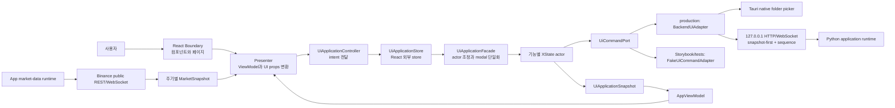

# Binance Auto Trader UI 아키텍처 및 파일 참조서

| 항목 | 내용 |
|---|---|
| 문서 상태 | As-built — 현재 구현 기준 |
| 작성일 | 2026-08-12 |
| 최종 갱신일 | 2026-08-24 |
| 대상 경로 | `/Users/oscar/Desktop/Binance_Auto/UI` |
| 대상 구현 | React + TypeScript + XState + Vite + Tauri 2 UI |
| 제외 범위 | 실제 Binance credential 기반 외부 실행, packaged sidecar 실행·종료 lifecycle |

## 1. 문서 목적

이 문서는 `UI_Implementation_Architecture_Plan.md`의 구현 전 제안과 달리, 현재 `UI` 폴더에 실제로 구현된 구조를 설명한다. 다음 내용을 한곳에서 확인할 수 있도록 작성했다.

- 유지보수 대상 디렉터리의 전체 트리
- 각 계층과 기능 모듈의 책임
- 사람이 관리하는 파일별 역할
- React Boundary, presenter, facade, XState actor, adapter 사이의 데이터 흐름
- UI Event-Action Table이 코드에 분산 구현된 위치
- Figma 16개 프레임과 Storybook/기준 이미지의 대응 관계
- 테스트, 실행, 확장 시 지켜야 할 규칙
- production live read와 demo/Storybook, 후속 command owner의 경계

`node_modules`, `dist`, `storybook-static`처럼 명령 실행으로 다시 생성할 수 있는 디렉터리는 파일을 하나씩 나열하지 않고 생성물로 따로 설명한다.

## 2. 현재 구현 요약

현재 UI는 다음 특성을 가진 데스크톱 SPA이다.

- React가 화면 Boundary와 페이지 composition을 담당한다.
- XState actor가 Event-Action Table의 상태와 전이를 기능별로 나누어 관리한다.
- `UiApplicationFacade`가 React intent를 적절한 actor event로 변환하고 전역 modal을 조정한다.
- `UiApplicationStore`가 facade를 React의 `useSyncExternalStore` 계약으로 감싼다.
- presenter가 actor의 `AppViewModel`을 각 페이지와 기능 컴포넌트의 props로 변환한다.
- backend 명령은 `UiCommandPort` 뒤로 격리되어 있다.
- production entry는 `BackendUiAdapter`의 ready snapshot을 먼저 적용하며, Storybook과 화면 tests만 `FakeUiCommandAdapter`를 명시적으로 사용한다.
- Phase 7의 REGIME 선택, split, 자동매매 start/stop은 `expected_version`과 idempotency key를 포함해 backend fake session owner에 연결되어 있다.
- Phase 10의 Trade History는 최초 `today/all`, 12개 결합 filter, D-12 summary/rows 분리와 order/account/performance event 및 sequence gap 재조회를 실제 backend에 연결한다.
- Phase 11의 CSV는 Tauri native folder picker, KST 자정 재개방, generated request/receipt,
  backend snapshot streaming과 실제 atomic file publication 결과에 연결한다.
- backend 계좌·REGIME·성과 read model은 ETHUSDT/USDT 단위를 유지하고 없는 position·entry price·slippage를 추측하지 않는다.
- 가격 차트는 Binance 공개 market-data REST/WebSocket에서 `ETHUSDT`의 `1m`, `30m`, `4h`, `1d` 봉을 조회·구독한다.
- 실시간 시장 데이터는 WebSocket을 먼저 시작한 뒤 REST 과거 봉과 병합하고, 동일 `symbol + interval + open_time`에는 WebSocket 값을 우선한다.
- Tauri는 1440×1024 데스크톱 창, memory-only one-shot backend descriptor와 native CSV
  directory picker command를 제공한다. sidecar 실행·패키징·종료는 Phase 12에 남아 있다.
- Storybook의 공통 harness가 Figma 16개 프레임을 상태 fixture로 재현한다.
- 스타일은 semantic CSS token, CSS Modules, Radix primitive를 중심으로 구성한다.
- `App.tsx`는 dashboard와 trade-history Route Boundary를 `React.lazy`와 동적 `import()`로 분리하고, 최초 로드 동안 접근 가능한 `Suspense` fallback을 표시한다.
- 조회·명령 실패는 actor의 공통 오류를 presenter와 modal Boundary에서 사용자에게 표시하고 재시도 흐름으로 연결한다.

demo bootstrap의 초기 상태는 API 연결 표시가 online이고 자동매매는 정지 상태이며,
실제 적용 REGIME은 `null`이다. production bootstrap은 이 fixture를 읽지 않고 backend의
추천/선택/account/recent/performance snapshot과 별도 Trade History details query를 사용한다.
추천값은 표시만 하며 사용자 선택값으로 자동 적용하지 않는다.

## 3. 전체 아키텍처



### 3.1 계층별 책임

| 계층 | 대표 위치 | 책임 |
|---|---|---|
| Entry/Provider | `src/main.tsx`, `src/app/providers` | native descriptor와 ready snapshot 뒤 React root와 전역 provider를 생성하며 실패 시 demo 대신 typed startup 화면을 표시한다. |
| App composition | `src/app/App.tsx` | 헤더, 지연 로딩되는 현재 route, 전역 modal host와 route loading fallback을 조합한다. |
| Route Boundary | `src/routes` | 기능 컴포넌트를 화면 레이아웃으로 배치한다. 업무 상태를 직접 판단하지 않는다. |
| Feature Boundary | `src/features/*/components` | ViewModel을 렌더링하고 typed intent만 상위로 보낸다. |
| Presenter | `src/app/presenters` | 공통 `AppViewModel`을 route/feature props로 변환한다. |
| Control facade | `src/app/control` | UI intent를 actor event로 라우팅하고 actor snapshot을 단일화한다. |
| State actor | `src/app/machines`, `src/features/*/machines` | Event-Action 상태, guard, action, 비동기 command lifecycle을 관리한다. |
| Runtime store | `src/app/runtime`, `src/app/hooks` | facade와 React 구독 수명주기, Tauri 창 종료를 연결한다. |
| Contract/Port | `src/shared/contracts`, `src/shared/ports` | Python에서 생성한 wire schema, 기능 간 데이터 형식과 backend 명령 경계를 정의한다. |
| Adapter/Fixture | `src/shared/api`, `src/shared/testing`, `src/app/bootstrap` | production loopback serialization/reconnect와 별도의 결정적 demo/test 경계를 제공한다. |
| Design system | `src/shared/styles`, `src/shared/ui` | 공통 token, 전역 규칙, 재사용 가능한 primitive를 제공한다. |
| Desktop shell | `apps/desktop/src-tauri` | Tauri 창, 권한, CSP, 최종 창 제거와 CSV native folder picker를 담당한다. |

### 3.2 사용자 입력에서 다시 렌더링되기까지

1. 사용자가 Boundary 컴포넌트의 버튼, 탭, slider, 달력 등을 조작한다.
2. 컴포넌트는 업무 event가 아니라 `PriceChartIntent`, `RegimePanelIntent` 같은 화면 intent를 방출한다.
3. presenter가 화면 intent를 `UiApplicationIntent`로 변환해 `UiApplicationController.dispatch()`에 전달한다.
4. `UiApplicationStore`가 intent를 `UiApplicationFacade`에 전달한다.
5. facade가 해당 기능의 XState actor event로 변환한다.
6. 필요하면 actor가 `UiCommandPort`의 비동기 명령을 invoke한다. Phase 5의 미구현 command는 backend typed failure로 닫힌다.
7. actor snapshot이 바뀌면 facade가 전역 modal slot을 다시 계산하고 전체 snapshot을 발행한다.
8. store가 새 `AppViewModel`을 캐시하고 React listener에 알린다.
9. presenter가 새 페이지 props를 만들고 React가 화면을 다시 그린다.
10. 처음 방문한 route module이 아직 없으면 `Suspense`가 로딩 상태를 표시하고 해당 production chunk를 받은 뒤 Route Boundary로 교체한다.

## 4. 최상위 디렉터리 트리

```text
UI/
├── .storybook/                       # Storybook 설정
│   ├── main.ts
│   └── preview.ts
├── apps/
│   └── desktop/
│       └── src-tauri/                # Tauri 2 데스크톱 shell
├── src/
│   ├── app/                          # 앱 조립, 제어, runtime
│   ├── assets/                       # Figma SVG asset
│   ├── features/                     # 기능별 Boundary와 actor
│   ├── routes/                       # 대시보드와 거래 내역 화면
│   ├── shared/                       # 공통 계약, port, primitive, token
│   ├── stories/                      # Figma 16개 상태 Story
│   ├── test/                         # 공통 테스트 설정
│   ├── main.tsx
│   └── vite-env.d.ts
├── visual-regression/
│   ├── figma/                        # Figma 1440×1024 기준 PNG 16개
│   └── README.md
├── .gitignore
├── index.html
├── package.json
├── pnpm-lock.yaml
├── pnpm-workspace.yaml
├── README.md
├── UI_Implementation_Architecture_Plan.md
├── UI_ARCHITECTURE_AND_FILE_REFERENCE.md
├── tsconfig.app.json
├── tsconfig.json
├── tsconfig.node.json
├── vite.config.ts
└── vitest.config.ts
```

### 4.1 최상위 파일 설명

| 파일 | 역할 |
|---|---|
| `.gitignore` | `node_modules`, 빌드 결과, Storybook 결과 등 UI 로컬 생성물을 Git 추적에서 제외한다. |
| `README.md` | 패키지 목적, 기본 실행·검증 명령, 상위 폴더 책임을 짧게 안내한다. |
| `UI_Implementation_Architecture_Plan.md` | 구현 전에 작성된 목표 기술·계층·모듈 구조 제안서다. 현재 소스의 사실 확인에는 이 문서를 사용한다. |
| `UI_ARCHITECTURE_AND_FILE_REFERENCE.md` | 현재 구현의 디렉터리, 파일, runtime 흐름을 기록하는 본 문서다. |
| `index.html` | Vite가 읽는 HTML entry이며 React가 연결될 `#root`를 제공한다. |
| `package.json` | React, XState, Radix, Lightweight Charts, Tauri 등 의존성과 실행 script를 정의한다. |
| `pnpm-lock.yaml` | 설치되는 JavaScript 패키지의 정확한 버전과 해시를 고정한다. 수동 편집하지 않는다. |
| `pnpm-workspace.yaml` | pnpm의 hoisted node linker 설정을 정의한다. |
| `tsconfig.json` | app과 Node 설정을 project reference로 묶는 TypeScript 최상위 설정이다. |
| `tsconfig.app.json` | DOM/React 소스의 strict typecheck, JSX, exact optional property 설정을 정의한다. |
| `tsconfig.node.json` | Vite와 Vitest 설정 파일을 검사하는 Node 측 TypeScript 설정이다. |
| `vite.config.ts` | React plugin과 고정 개발 서버 port 정책을 정의한다. |
| `vitest.config.ts` | jsdom, 공통 setup, CSS 처리를 사용하는 component/machine 테스트 환경을 정의한다. |

### 4.2 자동 생성 디렉터리

| 디렉터리 | 생성 명령/원천 | 취급 방법 |
|---|---|---|
| `node_modules/` | `pnpm install` | 외부 의존성이다. 직접 수정하지 않는다. |
| `dist/` | `pnpm build` | production web bundle이다. 소스가 아니므로 직접 수정하지 않는다. |
| `storybook-static/` | `pnpm build-storybook` | 정적 Storybook 결과다. 직접 수정하지 않는다. |
| `.pnpm-store/` 또는 pnpm cache | pnpm | 패키지 cache이며 구현 문서와 코드 검토 대상이 아니다. |

## 5. Storybook과 데스크톱 shell

### 5.1 `.storybook` 트리와 파일

```text
.storybook/
├── main.ts
└── preview.ts
```

| 파일 | 역할 |
|---|---|
| `.storybook/main.ts` | `src/stories/**/*.stories.tsx`를 story 원본으로 등록하고 React-Vite framework와 접근성 addon을 설정한다. |
| `.storybook/preview.ts` | 전역 CSS를 불러오고 fullscreen layout, dark canvas 배경, 접근성 오류 정책을 적용한다. |

### 5.2 `apps/desktop/src-tauri` 트리와 파일

```text
apps/desktop/src-tauri/
├── capabilities/
│   └── main-window.json
├── src/
│   ├── dialog.rs
│   ├── lib.rs
│   └── main.rs
├── build.rs
├── Cargo.toml
└── tauri.conf.json
```

| 파일 | 역할 |
|---|---|
| `Cargo.toml` | Tauri shell crate, Rust edition, `serde`, `tauri`와 공식 `tauri-plugin-dialog` 의존성을 정의한다. |
| `build.rs` | Tauri build-time code generation을 실행한다. |
| `src/main.rs` | native executable entry이며 library의 `run()`을 호출한다. |
| `src/dialog.rs` | 공식 dialog plugin의 folder picker를 absolute UTF-8 `string`, 취소 `null`, path-free typed failure로 제한한다. |
| `src/lib.rs` | 최소 권한 `tauri::Builder`, strict descriptor와 memory-only one-shot command, dialog plugin과 `choose_csv_export_directory` command를 등록한다. 초기 descriptor slot은 Phase 12 launcher가 stage하기 전까지 fail closed한다. |
| `tauri.conf.json` | 1440×1024 기본 창, 1180×760 최소 크기, Vite dev URL, frontend build 경로, CSP와 bundle 설정을 정의한다. |
| `capabilities/main-window.json` | 메인 창의 기본 API와 상태머신 종료 완료 후 `destroy` 권한만 허용한다. |

현재 Tauri Rust 코드는 거래나 sidecar spawn을 구현하지 않는다. 창, descriptor 전달, picker와
보안 경계만 제공하며, OS close event의 UI 순서는 TypeScript의
`DesktopWindowLifecycle`과 `appExitMachine`이 담당한다. Python executable 조립과
descriptor stage, 실제 안전 종료는 Phase 12 책임이다.

## 6. `src/app` 구조

```text
src/app/
├── bootstrap/
│   ├── createLiveUiApplication.ts
│   ├── createDemoUiApplication.ts
│   ├── createLiveUiApplication.process.test.mjs
│   ├── createLiveUiApplication.test.tsx
│   ├── demoFixtures.ts
│   ├── types.ts
│   └── index.ts
├── components/
│   ├── modals/
│   │   ├── ExitConfirmationDialog.module.css
│   │   ├── ExitConfirmationDialog.tsx
│   │   ├── OperationStatusDialog.module.css
│   │   └── OperationStatusDialog.tsx
│   ├── AppModalHost.tsx
│   └── index.ts
├── control/
│   ├── UiApplicationFacade.test.ts
│   ├── UiApplicationFacade.ts
│   └── index.ts
├── hooks/
│   ├── index.ts
│   ├── useCsvCalendarNavigation.ts
│   ├── useDesktopWindowLifecycle.ts
│   └── useUiApplication.ts
├── machines/
│   ├── index.ts
│   └── uiShellMachine.ts
├── presenters/
│   ├── csvExportPresenter.ts
│   ├── dashboardPresenter.ts
│   ├── index.ts
│   ├── presenters.test.ts
│   └── tradeHistoryPresenter.ts
├── providers/
│   └── AppProviders.tsx
├── runtime/
│   ├── DesktopWindowLifecycle.ts
│   ├── UiApplicationStore.test.ts
│   ├── UiApplicationStore.ts
│   └── index.ts
├── App.module.css
├── App.test.tsx
└── App.tsx
```

### 6.1 App와 bootstrap

| 파일 | 역할 |
|---|---|
| `App.tsx` | `AppHeader`, 현재 route, `AppModalHost`를 조합하는 최상위 Boundary다. dashboard와 trade-history page를 직접 동적 import해 route 단위 chunk를 만들고 `Suspense` fallback을 제공한다. 종료 final 상태에서는 안전 종료 안내만 표시한다. |
| `App.module.css` | 앱 canvas, 대시보드 여백, route loading 상태와 종료 final 화면의 layout을 정의한다. |
| `App.test.tsx` | 지연 로딩된 dashboard를 기다린 뒤 REGIME 선택, 자동매매 시작, route 이동, CSV, 중지까지 실제 runtime wiring을 통합 검증한다. |
| `bootstrap/createDemoUiApplication.ts` | `FakeUiCommandAdapter`와 모든 actor를 포함한 `UiApplicationFacade`를 Figma 기준 초기값으로 생성하고 demo online event를 주입한다. route barrel을 거치지 않고 `dashboardFixture.ts`를 직접 읽어 초기 chunk 경계를 보존한다. |
| `bootstrap/createLiveUiApplication.ts` | descriptor를 검증하고 전체 snapshot을 먼저 받은 뒤에만 facade를 생성한다. activation 시 actor startup, 단일 server-state sync와 WebSocket 연결을 수행하며 StrictMode와 one-shot token 수명주기를 보존한다. |
| `bootstrap/createLiveUiApplication.test.tsx` | snapshot-first 순서, StrictMode App render, USDT/음수 손익과 not-ready 무표시를 검증한다. |
| `bootstrap/createLiveUiApplication.process.test.mjs` | 실제 Python child process의 loopback snapshot을 React App에 표시하고 Communication 메시지 1~5 통합 trace를 검증한다. |
| `bootstrap/demoFixtures.ts` | Figma 거래 행과 지표를 공통 `TradeRecord`, `RegimeMetric` 계약으로 정규화한다. dashboard 표시 fixture는 route component와 분리된 직접 경로로 읽는다. |
| `bootstrap/types.ts` | demo와 live가 store에 주입하는 공통 runtime/factory lifecycle을 정의한다. |
| `bootstrap/index.ts` | bootstrap factory와 fixture의 공개 import 경계를 제공한다. |

`App.tsx`의 Route Boundary 직접 동적 import와 bootstrap/presenter의 `dashboardFixture.ts` 직접 import는 일반 barrel 규칙의 의도적인 예외다. route `index.ts`가 정적으로 page를 다시 참조해 초기 bundle에 포함시키는 것을 막기 위한 code-splitting 경계이며, 화면 상태나 기능 내부 구현을 우회하기 위한 import가 아니다.

### 6.2 전역 modal 구성

| 파일 | 역할 |
|---|---|
| `components/AppModalHost.tsx` | shell의 단일 modal 종류를 거래 확인, REGIME 확인, CSV, 종료, 진행·완료·오류 Dialog로 연결한다. trading/REGIME actor 오류 메시지를 해당 확인창에 전달하고 CSV 달력 navigation hook도 presenter에 전달한다. |
| `components/index.ts` | app-level modal 컴포넌트의 공개 barrel이다. |
| `components/modals/ExitConfirmationDialog.tsx` | 포지션이 없을 때의 일반 종료와 포지션이 있을 때의 강제 매도 후 종료 확인 문구를 표시한다. |
| `components/modals/ExitConfirmationDialog.module.css` | 종료 확인 dialog의 안내 박스와 버튼 행 스타일을 정의한다. |
| `components/modals/OperationStatusDialog.tsx` | CSV 처리 결과와 앱 종료 처리 중 상태를 공통 modal 표면으로 표시한다. |
| `components/modals/OperationStatusDialog.module.css` | 진행 표시, 성공·실패 tone, 결과 경로와 action 영역을 스타일링한다. |

### 6.3 Control facade

| 파일 | 역할 |
|---|---|
| `control/UiApplicationFacade.ts` | 모든 feature actor를 생성·시작·종료하고 intent를 actor event로 변환한다. coherent backend snapshot은 route/modal/chart 같은 UI-local 상태를 유지하면서 server-owned context만 한 notification으로 원자 교체한다. |
| `control/UiApplicationFacade.test.ts` | route 상태 보존, REGIME 미선택 경고, chart 선 interaction, account/history summary와 authoritative full resync를 검증한다. |
| `control/index.ts` | facade class, selector, intent/snapshot/ViewModel type을 공개한다. |

`UiApplicationFacade.ts`가 크지만 기능별 상태 자체를 소유하는 거대 상태머신은 아니다. 이 파일은 actor registry와 event router 역할을 하며, 실제 전이는 `features/*/machines`에 분리되어 있다.

### 6.4 Hooks, presenter, provider, runtime

| 파일 | 역할 |
|---|---|
| `hooks/useUiApplication.ts` | `UiApplicationStore`를 한 번 생성하고 `useSyncExternalStore`로 controller와 최신 ViewModel을 React에 제공한다. |
| `hooks/useCsvCalendarNavigation.ts` | 시작일·종료일 달력의 표시 연월만 React local state로 관리하고 이전/다음 월과 연·월 선택 함수를 제공한다. |
| `hooks/useDesktopWindowLifecycle.ts` | Tauri close event의 기본 종료를 막아 `APP_EXIT_CLICKED`를 보내고, actor가 final 상태가 되면 창을 실제 제거한다. |
| `hooks/index.ts` | app hook의 공개 barrel이다. |
| `presenters/dashboardPresenter.ts` | `AppViewModel`과 고정 chart fixture를 결합해 Dashboard props를 만들고 chart, trader, REGIME, split-order intent를 facade intent로 변환한다. route page를 초기 bundle로 가져오지 않도록 page type과 fixture를 type/direct import로 분리한다. |
| `presenters/tradeHistoryPresenter.ts` | actor의 거래 record와 filter enum을 표 행·필터 props로 변환한다. 기간·side·로딩·실패·실제 건수를 description에 반영하고, 실패 시 오래된 행을 비우며 필터 비활성화와 조회 재시도를 연결한다. |
| `presenters/csvExportPresenter.ts` | CSV actor의 draft, validation, calendar target을 `CSVExportDialogProps`로 변환한다. |
| `presenters/presenters.test.ts` | account/history 값 투영, 거래내역 동적 description·실패/재시도 상태와 chart 선 hover/context/delete intent 변환을 검증한다. |
| `presenters/index.ts` | 세 presenter 함수의 공개 barrel이다. |
| `providers/AppProviders.tsx` | Query client를 앱 수명주기에 맞춰 제공한다. Phase 5 server snapshot lifecycle은 `BackendUiAdapter`와 facade가 소유한다. |
| `runtime/UiApplicationStore.ts` | 명시적으로 주입된 demo/live runtime을 React 외부 store로 감싸며 최초 구독에서 시작하고 마지막 구독에서 정리한다. React StrictMode의 즉시 재구독에는 같은 runtime을 유지한다. |
| `runtime/UiApplicationStore.test.ts` | 최초 구독, dispatch 알림, StrictMode식 구독 교체 수명주기를 검증한다. |
| `runtime/DesktopWindowLifecycle.ts` | Tauri window API를 `on_close_requested()`와 `destroy()`만 가진 좁은 port로 감싸고 브라우저 실행에서는 `null`을 반환한다. |
| `runtime/index.ts` | runtime store와 desktop lifecycle 계약의 공개 barrel이다. |

### 6.5 App shell machine

| 파일 | 역할 |
|---|---|
| `machines/uiShellMachine.ts` | `dashboard`와 `trade_history` route 이동, dashboard deep-history 의미, 전역 modal 단일 slot을 병렬 region으로 관리한다. URL router 대신 이 actor가 현재 route를 소유한다. |
| `machines/index.ts` | shell machine과 route/modal type의 공개 barrel이다. |

## 7. `src/assets` 구조

```text
src/assets/figma/
├── chart-maximize.svg
├── chart-pen.svg
├── csv-export-icon-bg.svg
├── header-start.svg
├── header-stop-icon.svg
├── logo-frame.svg
├── logo-glyph.svg
├── modal-status-negative-bg.svg
├── modal-status-negative-dot.svg
├── modal-status-negative-ring.svg
├── modal-status-positive-bg.svg
├── modal-status-positive-dot.svg
└── modal-status-positive-ring.svg
```

| 파일 | 역할 |
|---|---|
| `chart-maximize.svg` | 차트 전체화면 진입·종료 버튼의 Figma 아이콘이다. |
| `chart-pen.svg` | 차트 선 그리기 mode 버튼 아이콘이다. |
| `csv-export-icon-bg.svg` | CSV dialog 제목 왼쪽의 배경 아이콘이다. |
| `header-start.svg` | 자동매매 실행 버튼 아이콘이다. |
| `header-stop-icon.svg` | 매매 중지 버튼 아이콘이다. |
| `logo-frame.svg` | 상단 브랜드 로고의 외곽 frame이다. |
| `logo-glyph.svg` | 상단 브랜드 로고의 내부 glyph다. |
| `modal-status-negative-bg.svg` | 경고·위험 modal 상태 아이콘의 바깥 배경층이다. |
| `modal-status-negative-ring.svg` | 경고·위험 modal 상태 아이콘의 중간 ring이다. |
| `modal-status-negative-dot.svg` | 경고·위험 modal 상태 아이콘의 중심 dot이다. |
| `modal-status-positive-bg.svg` | 확인·성공 modal 상태 아이콘의 바깥 배경층이다. |
| `modal-status-positive-ring.svg` | 확인·성공 modal 상태 아이콘의 중간 ring이다. |
| `modal-status-positive-dot.svg` | 확인·성공 modal 상태 아이콘의 중심 dot이다. |

## 8. `src/features` 구조

각 feature는 가능한 경우 `components`, `machines`, `data`, `hooks`, `presenters`, `types.ts`, `index.ts`로 나눈다. 컴포넌트는 표시와 intent 방출, machine은 상태 전이, data/hook은 외부 snapshot 수명주기, presenter는 표시 투영, `types.ts`는 Boundary 계약, `index.ts`는 외부에 허용할 공개 API를 맡는다.

```text
src/features/
├── account-summary/
├── app-exit/
├── connection-status/
├── csv-export/
├── price-chart/
├── recent-orders/
├── regime-selection/
├── split-order/
├── trade-history/
└── trading-control/
```

### 8.1 `account-summary`

```text
account-summary/
├── components/
│   ├── AccountSection.module.css
│   ├── AccountSection.tsx
│   ├── AssetCard.module.css
│   ├── AssetCard.tsx
│   ├── StrategyCard.module.css
│   └── StrategyCard.tsx
├── machines/
│   ├── accountSummaryMachine.test.ts
│   └── accountSummaryMachine.ts
├── index.ts
└── types.ts
```

| 파일 | 역할 |
|---|---|
| `components/AccountSection.tsx` | 전략 카드, 자산 카드, 분할 주문 control을 “거래 / 계좌” 영역에 배치한다. |
| `components/AccountSection.module.css` | 계좌 영역 제목, 3열 카드 layout과 구분선을 정의한다. |
| `components/StrategyCard.tsx` | 자동매매 작동 상태, 적용 전략, 수익률과 수익 금액을 표시한다. |
| `components/StrategyCard.module.css` | 전략 상태 dot, tone, 설명 목록을 스타일링한다. |
| `components/AssetCard.tsx` | demo의 KRW 또는 live의 USDT quote label을 보존해 총자산, quote/base asset과 평가 손익을 표시한다. backend가 제공하지 않은 값은 `-`로 표시한다. |
| `components/AssetCard.module.css` | 자산 값의 숫자 글꼴, 행 layout, 손익 tone을 정의한다. |
| `machines/accountSummaryMachine.ts` | 투자 로직 상태와 자산 snapshot을 `trading_logic_status`, `asset_summary` 독립 region으로 투영한다. |
| `machines/accountSummaryMachine.test.ts` | DI1/DI2 갱신이 서로 영향을 주지 않는지 검증한다. |
| `types.ts` | `StrategySummaryViewModel`, `AssetSummaryViewModel`, card tone과 section props를 정의한다. |
| `index.ts` | account-summary의 컴포넌트, machine, type 공개 API다. |

### 8.2 `app-exit`

```text
app-exit/
├── machines/
│   └── appExitMachine.ts
└── index.ts
```

| 파일 | 역할 |
|---|---|
| `machines/appExitMachine.ts` | OS 종료 요청을 포지션 유무에 따라 일반 종료 확인 또는 강제 매도 확인으로 나누고, force-sell, shutdown, UI final 상태까지 조정한다. |
| `index.ts` | 종료 machine과 context/event type을 공개한다. |

### 8.3 `connection-status`

```text
connection-status/
├── machines/
│   └── connectionMachine.ts
└── index.ts
```

| 파일 | 역할 |
|---|---|
| `machines/connectionMachine.ts` | `api_offline`, `connecting`, `api_online`, `reconnecting` 표시 상태와 reconnect 횟수·오류를 관리한다. 실제 WebSocket protocol은 구현하지 않는다. |
| `index.ts` | 연결 machine과 context/event type을 공개한다. |

### 8.4 `csv-export`

```text
csv-export/
├── components/
│   ├── CSVExportDialog.module.css
│   ├── CSVExportDialog.test.tsx
│   ├── CSVExportDialog.tsx
│   ├── CalendarPopover.module.css
│   ├── CalendarPopover.tsx
│   ├── index.ts
│   └── types.ts
├── machines/
│   ├── csvExportMachine.test.ts
│   └── csvExportMachine.ts
└── index.ts
```

| 파일 | 역할 |
|---|---|
| `components/CSVExportDialog.tsx` | 저장 위치, 기간 preset, 시작·종료일, 파일명과 validation 메시지를 표시하는 controlled Radix dialog다. 달력이 열려 있을 때 외부 입력은 달력만 닫는다. |
| `components/CSVExportDialog.module.css` | Figma 560px dialog, 입력 section, 날짜 field, 오류 상태와 action 행을 정의한다. |
| `components/CSVExportDialog.test.tsx` | 입력 intent, 달력 대상·월 이동, 외부 click 예외, validation, focus 복원을 검증한다. |
| `components/CalendarPopover.tsx` | 월별 날짜 cell 생성, 연·월 선택, 이전·다음 월, Escape와 방향키/Home/End navigation을 제공한다. |
| `components/CalendarPopover.module.css` | 244px 달력 popover, 요일, 날짜 grid, 선택일과 비활성 날짜를 스타일링한다. |
| `components/types.ts` | CSV draft, validation error, calendar target과 표시 월 ViewModel을 정의한다. |
| `components/index.ts` | CSV Boundary 컴포넌트와 표시 type의 공개 barrel이다. |
| `machines/csvExportMachine.ts` | dialog, directory picker, 기간/달력, 파일명 편집을 병렬 region으로 관리하고 validation 및 export invoke를 수행한다. directory picker 결과와 최종 draft 검증 모두 `trim()` 후 빈 경로를 거부한다. |
| `machines/csvExportMachine.test.ts` | null·공백 경로 거부와 export 미실행, 달력 외부 click, 반대 날짜 field 전환, picker 상태 보존, export 완료를 검증한다. |
| `index.ts` | CSV 컴포넌트와 machine API를 feature 외부에 공개한다. |

### 8.5 `price-chart`

```text
price-chart/
├── components/
│   ├── ChartCanvas.module.css
│   ├── ChartCanvasCoordinateDrawing.test.tsx
│   ├── ChartCanvas.tsx
│   ├── ChartToolbar.module.css
│   ├── ChartToolbar.tsx
│   ├── IndicatorSettingsPopover.module.css
│   ├── IndicatorSettingsPopover.tsx
│   ├── LightweightChartSurface.module.css
│   ├── LightweightChartSurface.test.tsx
│   ├── LightweightChartSurface.tsx
│   ├── PriceChartPanel.module.css
│   ├── PriceChartPanel.test.tsx
│   └── PriceChartPanel.tsx
├── data/
│   ├── binanceKlines.test.ts
│   ├── binanceKlines.ts
│   ├── index.ts
│   ├── klineCalculations.test.ts
│   ├── klineCalculations.ts
│   └── types.ts
├── hooks/
│   ├── index.ts
│   ├── useRealtimeChartData.test.tsx
│   └── useRealtimeChartData.ts
├── machines/
│   ├── chartMachine.test.ts
│   └── chartMachine.ts
├── presenters/
│   ├── createRealtimeChartViewModel.ts
│   └── index.ts
├── index.ts
└── types.ts
```

| 파일 | 역할 |
|---|---|
| `components/PriceChartPanel.tsx` | 차트 제목, `ETH/USDT` symbol, 실시간 연결 상태, timestamp, toolbar, chart surface, 지표 popover를 조합한다. fullscreen 상태를 panel layout에 반영하고, popover가 열렸을 때 document 단위 외부 pointer 입력을 감지해 닫기 intent를 보낸다. |
| `components/PriceChartPanel.module.css` | 472px 기본 panel, header, popover 위치와 fullscreen overlay layout을 정의한다. |
| `components/PriceChartPanel.test.tsx` | interval, 지표, drawing, fullscreen, 선 hover/context/delete intent와 지표 popover·선 context menu 외부 click 닫기를 검증한다. |
| `components/ChartToolbar.tsx` | 1분·30분·4시간·1일 interval, active trading state와 지표 설정 버튼을 표시한다. 설정 버튼은 `aria-expanded`와 `aria-controls`로 popover 상태·대상을 노출한다. |
| `components/ChartToolbar.module.css` | interval segmented control, active state badge, toolbar 버튼을 스타일링한다. |
| `components/IndicatorSettingsPopover.tsx` | EMA9, 볼린저밴드, 거래량 표시 여부를 controlled toggle로 노출한다. Escape 입력을 소비하고 명시적인 닫기 intent를 보낸다. |
| `components/IndicatorSettingsPopover.module.css` | Figma 지표 설정 popover, 색상 swatch, switch와 행 layout을 정의한다. |
| `components/LightweightChartSurface.tsx` | 실제 `open_time`과 volume으로 Lightweight Charts의 candle, EMA, Bollinger, volume series를 생성·갱신한다. 최초 1,000개 중 최신 180개를 표시하고, 이전 페이지 prepend 시 기존 visible time range를 복원한다. 적재 봉 수와 현재 time-scale 폭에 따라 `minBarSpacing`을 낮춰 전체 적재 범위보다 넓은 최대 축소 여유를 보장하며, sub-pixel 구간에는 Lightweight Charts conflation을 적용한다. 실시간 틱은 마지막 candle·volume·indicator point만 증분 갱신한다. 휠·핀치 확대/축소, drag, 동적 가격·시간축, crosshair OHLCV를 제공하며 현재 pane의 시각·가격 좌표 변환기는 내부 callback으로 drawing layer에 전달한다. |
| `components/LightweightChartSurface.module.css` | 일반·전체화면 금융 차트 canvas와 Binance 형식의 선택 봉 정보 overlay를 배치한다. |
| `components/LightweightChartSurface.test.tsx` | zoom/pan/축/crosshair 옵션, 정확한 OHLCV, 초기 180개 표시, 과거 prepend의 범위 보존, 실시간 마지막 봉 증분 갱신과 chart cleanup을 검증한다. |
| `components/ChartCanvas.tsx` | engine 미지원용 fallback SVG, 좌측 경계의 과거 페이지 요청, 실제 봉 시각·가격 기반 drawing 생성·재투영, 선 단위 hit stroke, hover, context menu, 삭제와 도구 버튼을 담당한다. 세로 wheel zoom은 과거 조회를 활성화하지 않고 실제 pointer drag·가로 이동만 이전 페이지 조회를 허용한다. 열린 선 context menu는 menu/hit area를 제외한 document 외부 click 또는 Escape로 닫는다. Lightweight Charts가 준비되면 대량 이력에서 중복 DOM 비용이 발생하지 않도록 fallback market SVG와 정적 축을 렌더하지 않는다. |
| `components/ChartCanvas.module.css` | chart pane과 동일 크기의 drawing overlay, 선 hit stroke, context menu와 fullscreen 크기를 정의한다. |
| `components/ChartCanvasCoordinateDrawing.test.tsx` | pointer 좌표를 실제 시각·가격으로 저장하고 축소·전체화면 좌표계에서 같은 anchor로 재투영하는지 검증한다. |
| `machines/chartMachine.ts` | interval, 지표 popover와 3개 indicator, active state, viewport, drawing, line selection을 병렬 region으로 관리한다. |
| `machines/chartMachine.test.ts` | interval별 drawing 보존, fullscreen, indicator 독립 toggle과 축소·전체화면 양쪽의 선 삭제를 검증한다. |
| `data/binanceKlines.ts` | Binance 공개 REST 네 주기 조회, 기준 `open_time` 이전의 단일 주기 1,000개 페이지 조회, combined WebSocket URL 생성과 payload runtime 검증·정규화를 담당한다. |
| `data/klineCalculations.ts` | REST/WS 봉을 WebSocket 우선으로 중복 제거·정렬·제한하고 EMA9과 BB20(2σ)을 계산한다. |
| `data/*.test.ts` | 네 REST 요청, WebSocket payload, 오류 검증, 병합 우선순위와 지표 warmup을 검증한다. |
| `hooks/useRealtimeChartData.ts` | WebSocket buffer 선시작 → 네 주기 최초 1,000개 REST 병합 → 선택 주기 과거 1,000개씩 지연 적재 → 증분 갱신 → backoff 재연결 → unmount 정리를 하나의 앱 수명주기로 관리한다. 주기별 요청·소진·오류 상태를 분리하고 적재한 과거 봉은 실시간 틱과 재연결 뒤에도 보존한다. |
| `hooks/useRealtimeChartData.test.tsx` | 초기화 순서, REST 중 buffer, 실시간 교체, 주기별 과거 페이지 병합·중복 요청 방지·재시도, 재연결 보존과 cleanup을 결정적으로 검증한다. |
| `presenters/createRealtimeChartViewModel.ts` | 현재 chart interval의 MarketSnapshot을 candle·EMA9·BB20·KST 갱신 라벨로 변환한다. |
| `types.ts` | chart ViewModel, candle/line 자료형과 모든 `PriceChartIntent`를 정의한다. |
| `index.ts` | chart Boundary, actor와 type의 공개 API다. `LightweightChartSurface`는 feature 내부 구현으로 유지한다. |

### 8.6 `recent-orders`

```text
recent-orders/
├── components/
│   ├── RealtimeIndicators.module.css
│   ├── RealtimeIndicators.tsx
│   ├── RecentOrdersList.module.css
│   ├── RecentOrdersList.tsx
│   ├── TraderPanel.module.css
│   ├── TraderPanel.test.tsx
│   └── TraderPanel.tsx
├── machines/
│   └── recentOrdersMachine.ts
├── index.ts
└── types.ts
```

| 파일 | 역할 |
|---|---|
| `components/TraderPanel.tsx` | “체결 내역”과 “실시간 지표” controlled tab을 표시하고 전체 거래 내역 이동 intent를 방출한다. |
| `components/TraderPanel.module.css` | 우측 412px panel, tab, panel body와 scroll 영역을 정의한다. |
| `components/TraderPanel.test.tsx` | tab 변경과 전체 보기 intent를 검증한다. |
| `components/RecentOrdersList.tsx` | 매수·매도 체결을 시간, 가격, 수량/수익률과 함께 목록으로 표시한다. |
| `components/RecentOrdersList.module.css` | 체결 side tone, 행 구분, 숫자 정렬을 정의한다. |
| `components/RealtimeIndicators.tsx` | 전략별 실시간 지표 그룹과 체류 시간을 표시한다. |
| `components/RealtimeIndicators.module.css` | 지표 grid, positive/negative dot와 숫자 tone을 정의한다. |
| `machines/recentOrdersMachine.ts` | 두 tab 상태, 최근 체결 prepend, 실시간 지표 갱신을 관리한다. |
| `types.ts` | 체결 행, 지표 그룹, tab, `TraderPanelIntent` 계약을 정의한다. |
| `index.ts` | recent-orders의 공개 Boundary와 actor API다. |

### 8.7 `regime-selection`

```text
regime-selection/
├── components/
│   ├── RegimeChangeDialog.module.css
│   ├── RegimeChangeDialog.tsx
│   ├── RegimeMetric.module.css
│   ├── RegimeMetric.tsx
│   ├── RegimePanel.module.css
│   ├── RegimePanel.test.tsx
│   ├── RegimePanel.tsx
│   ├── RegimeTypeButton.module.css
│   └── RegimeTypeButton.tsx
├── machines/
│   ├── regimeMachine.test.ts
│   └── regimeMachine.ts
├── index.ts
└── types.ts
```

| 파일 | 역할 |
|---|---|
| `components/RegimePanel.tsx` | 추천 타입, 실제 적용 타입, 5개 수동 선택 버튼, 4개 판단 지표와 강조 상태를 표시한다. backend `logic_coverage`의 지원/미지원 badge를 모든 타입에 같이 표시하고 미지원 타입도 추천·선택은 허용한다. 적용값이 `null`이면 아무 버튼도 선택하지 않는다. |
| `components/RegimePanel.module.css` | Figma 948×116 panel, 내부 3영역, 선택 button과 5회 glow animation/reduced-motion 대체를 정의한다. |
| `components/RegimePanel.test.tsx` | 초기 미선택과 적용 타입 표시/intent, REGIME 적용 실패 사유의 alert, 다섯 지원 badge와 미지원 타입 선택 허용을 검증한다. |
| `components/RegimeTypeButton.tsx` | 하나의 REGIME type을 상승·하락 tone, candidate/applied 상태, TradingSTM 지원 badge로 표시한다. 미지원 badge는 선택 버튼을 disabled로 만들지 않는다. |
| `components/RegimeTypeButton.module.css` | type별 color, selected, candidate outline, disabled 상태를 정의한다. |
| `components/RegimeMetric.tsx` | REGIME 판단 지표 이름과 값을 tone과 함께 표시한다. |
| `components/RegimeMetric.module.css` | 지표 label/value와 상태 dot를 스타일링한다. |
| `components/RegimeChangeDialog.tsx` | 후보 REGIME을 실제 적용하기 전 확인 modal을 표시한다. apply 실패 시 actor 오류를 `role="alert"`로 보여 주고 재확인을 허용한다. |
| `components/RegimeChangeDialog.module.css` | 확인 modal의 type 안내 박스, 오류 문구와 action 행을 Figma 좌표에 맞춘다. 오류가 있으면 고정 높이를 해제해 내용 잘림을 막는다. |
| `machines/regimeMachine.ts` | 추천값, 적용값, 확인 전 candidate, 4초/5회 panel 강조, 비동기 apply command를 관리한다. |
| `machines/regimeMachine.test.ts` | click만으로 적용되지 않는지, 취소 시 기존값 보존, 확인 후 adapter 적용을 검증한다. |
| `types.ts` | REGIME type, metric, `TradingLogicCoverage`를 받는 panel props와 `RegimePanelIntent`를 정의한다. |
| `index.ts` | regime-selection의 공개 Boundary와 actor API다. |

### 8.8 `split-order`

```text
split-order/
├── components/
│   ├── PercentSlider.module.css
│   ├── PercentSlider.tsx
│   ├── SplitOrderControls.module.css
│   ├── SplitOrderControls.test.tsx
│   └── SplitOrderControls.tsx
├── machines/
│   ├── splitOrderMachine.test.ts
│   └── splitOrderMachine.ts
├── index.ts
└── types.ts
```

| 파일 | 역할 |
|---|---|
| `components/PercentSlider.tsx` | 0~100 범위를 10 단위로 제한하는 native range input과 ±10 버튼을 제공한다. drag 중에도 연속 `onInput` 값을 전달한다. |
| `components/PercentSlider.module.css` | 매수/매도 tone, track progress, thumb, ± 버튼과 percentage badge를 정의한다. |
| `components/SplitOrderControls.tsx` | 분할 매수와 분할 매도 slider 두 개를 하나의 카드로 묶고 side별 intent를 방출한다. |
| `components/SplitOrderControls.module.css` | 분할 주문 카드와 두 slider의 세로 layout을 정의한다. |
| `components/SplitOrderControls.test.tsx` | 버튼 증가와 slider 연속 이동 intent를 검증한다. |
| `machines/splitOrderMachine.ts` | 비율 정규화, optimistic 표시, 비동기 저장, 저장 중 최신값 queue, 실패·재시도를 관리한다. |
| `machines/splitOrderMachine.test.ts` | 저장 중 연속 입력 시 최신 비율이 보존되고 순차 저장되는지 검증한다. |
| `types.ts` | side, slider props, control props와 `SplitOrderIntent`를 정의한다. |
| `index.ts` | split-order의 공개 Boundary와 actor API다. |

### 8.9 `trade-history`

```text
trade-history/
├── components/
│   ├── HistoryFilters.module.css
│   ├── HistoryFilters.tsx
│   ├── SummaryCards.module.css
│   ├── SummaryCards.tsx
│   ├── TradeHistoryComponents.test.tsx
│   ├── TradeTable.module.css
│   ├── TradeTable.tsx
│   ├── index.ts
│   └── types.ts
├── machines/
│   ├── tradeHistoryMachine.test.ts
│   ├── tradeHistoryMachine.ts
│   ├── tradeHistorySummaryMachine.test.ts
│   └── tradeHistorySummaryMachine.ts
├── fixtures.ts
└── index.ts
```

| 파일 | 역할 |
|---|---|
| `components/SummaryCards.tsx` | 당일 수익률, 매도 성과, 보유 ETH, 수수료 요약 카드 4개를 표시한다. |
| `components/SummaryCards.module.css` | 4열 요약 card, 수치 tone과 세부 통계를 정의한다. |
| `components/HistoryFilters.tsx` | 기간 4종과 거래 side 3종을 독립 group으로 제공하고 CSV action을 노출한다. |
| `components/HistoryFilters.module.css` | 64px toolbar, segmented filter와 CSV 버튼을 스타일링한다. |
| `components/TradeTable.tsx` | 11개 열의 거래 행, scroll 영역과 상태별 empty UI를 표시한다. 일반 empty에서는 자동매매 이동, 조회 실패에서는 presenter가 제공한 다시 시도 action을 사용한다. |
| `components/TradeTable.module.css` | 고정 header, 행/열 폭, side badge, 숫자 tone, empty layout과 scroll을 정의한다. |
| `components/TradeHistoryComponents.test.tsx` | 요약/행 구조, 두 filter intent, empty action을 검증한다. |
| `components/types.ts` | history 표시 filter, summary, 표 행, empty state ViewModel을 정의한다. |
| `components/index.ts` | 거래 내역 Boundary 컴포넌트의 공개 barrel이다. |
| `machines/tradeHistoryMachine.ts` | 기간·side filter를 조합해 `UiCommandPort.load_trade_history()`를 호출하고 idle/loading/ready/empty/failed, KST 자정 timer, in-flight 취소와 order/resync/summary revision 경쟁을 관리한다. |
| `machines/tradeHistoryMachine.test.ts` | 12개 filter, empty/failure/retry, KST 자정, load 중 체결, resync, 화면 이탈 취소와 재진입 stale 방어를 검증한다. |
| `machines/tradeHistorySummaryMachine.ts` | 수익률, 매도 성과, ETH 보유량, 수수료를 네 독립 표시 region으로 관리한다. |
| `machines/tradeHistorySummaryMachine.test.ts` | D1~D4 summary 갱신의 독립성을 검증한다. |
| `fixtures.ts` | Figma 요약 수치, empty 요약과 9개 상세 거래 행 fixture를 제공한다. |
| `index.ts` | component, fixture, query actor와 summary actor의 공개 API다. |

### 8.10 `trading-control`

```text
trading-control/
├── components/
│   ├── AppHeader.module.css
│   ├── AppHeader.tsx
│   ├── TradingConfirmationDialog.module.css
│   ├── TradingConfirmationDialog.test.tsx
│   └── TradingConfirmationDialog.tsx
├── machines/
│   ├── tradingCommandMachine.test.ts
│   └── tradingCommandMachine.ts
└── index.ts
```

| 파일 | 역할 |
|---|---|
| `components/AppHeader.tsx` | 브랜드, LIVE/OFFLINE 상태, 자동매매 실행과 매매 중지 버튼을 표시한다. 실행 상태와 pending 상태에 따라 버튼을 제어한다. |
| `components/AppHeader.module.css` | 72px header, logo, 연결 badge, 실행·중지 action을 Figma 규격으로 배치한다. |
| `components/TradingConfirmationDialog.tsx` | 시작, 시작 중, 일반 중지, 강제 매도 중지, REGIME 미선택, API 미연결, trading unavailable variant를 하나의 공통 확인 Boundary로 표시한다. unavailable은 `UNSUPPORTED_TRADING_LOGIC`과 `command_enabled = false`를 구분해 하나의 안내 modal slot에 설명하고, 명령 실패 시 actor 오류를 `role="alert"`로 표시한다. |
| `components/TradingConfirmationDialog.module.css` | 64px 안내 박스, 진행 bar, 오류 문구, tone과 버튼 행을 정의한다. 오류가 없을 때는 공통 modal 고정 좌표를 유지하고 오류가 있으면 높이를 확장한다. |
| `components/TradingConfirmationDialog.test.tsx` | 거래 명령 실패 사유가 재시도 확인창의 alert로 노출되는지와 미지원/command 미준비 안내 문구를 검증한다. |
| `machines/tradingCommandMachine.ts` | 시작 guard, 시작 확인, 실행, 일반 중지, 강제 매도 중지, API 단절 중지를 adapter invoke와 함께 관리한다. 시작 요청과 확인 둘 다에서 최신 `logic_coverage`/`command_enabled`를 검사해 stale confirmation의 zero-command를 보장한다. 실제 position snapshot은 성공한 강제 매도에서만 비운다. |
| `machines/tradingCommandMachine.test.ts` | REGIME 미선택, 미지원/command 미준비의 zero-command, 확인 대기 중 resync 후 차단, 중복 없는 시작, 강제 매도 실패·취소 시 position 보존, 성공 시 position clear를 검증한다. |
| `index.ts` | header, 거래 dialog와 command machine의 공개 API다. |

## 9. UI Event-Action Table 구현 위치

Event-Action Table은 한 파일의 switch문으로 구현하지 않았다. 서로 독립적으로 변하는 상태를 기능별 XState actor로 나누고, 각 transition의 `meta.spec_ids`에 원본 명세 ID를 기록한다. `UiApplicationFacade`는 이 actor들을 조정할 뿐 전이 원본은 각 machine 파일이다.

| Event-Action 영역 | 구현 파일 | 핵심 상태/책임 |
|---|---|---|
| 화면 이동과 modal slot | `src/app/machines/uiShellMachine.ts` | dashboard/history 이동, H* 의미, modal 단일화 |
| API 연결 표시 | `features/connection-status/machines/connectionMachine.ts` | offline, connecting, online, reconnecting |
| 자동매매 시작·중지 | `features/trading-control/machines/tradingCommandMachine.ts` | REGIME/API guard, REGIME coverage/command readiness guard, 확인, pending, running, force-sell |
| REGIME 선택·강조 | `features/regime-selection/machines/regimeMachine.ts` | recommended, candidate, applied, highlight, apply invoke |
| 차트 | `features/price-chart/machines/chartMachine.ts` | interval, indicator, fullscreen, drawing, line menu |
| 우측 트레이딩 panel | `features/recent-orders/machines/recentOrdersMachine.ts` | 최근 체결/실시간 지표 tab과 실시간 update |
| 계좌 요약 | `features/account-summary/machines/accountSummaryMachine.ts` | DI1/DI2 표시 snapshot |
| 분할 주문 | `features/split-order/machines/splitOrderMachine.ts` | SI/SO 비율 저장과 연속 변경 |
| 거래 내역 조회 | `features/trade-history/machines/tradeHistoryMachine.ts` | 기간/side filter와 조회 lifecycle |
| 거래 내역 summary | `features/trade-history/machines/tradeHistorySummaryMachine.ts` | D1~D4 독립 summary update |
| CSV | `features/csv-export/machines/csvExportMachine.ts` | CR1/CR2/CR3 draft와 TD4 export lifecycle |
| 프로그램 종료 | `features/app-exit/machines/appExitMachine.ts` | ES3 확인, force-sell, shutdown, final |

### 9.1 actor 구성 원칙

- actor가 다른 actor의 내부 state node를 직접 수정하지 않는다.
- actor 간 조정이 필요하면 facade가 read-only snapshot을 읽고 명시적 event를 보낸다.
- 비동기 작업은 XState `invoke`와 `onDone`/`onError`로 표현한다.
- 화면 컴포넌트는 actor를 직접 import하지 않고 presenter/controller를 통해 intent를 보낸다.
- 전역 modal은 shell에 단일 slot만 존재한다.
- Event-Action 추적이 필요한 transition은 `meta.spec_ids`를 유지한다.

## 10. `src/routes` 구조

```text
src/routes/
├── dashboard/
│   ├── DashboardPage.module.css
│   ├── DashboardPage.test.tsx
│   ├── DashboardPage.tsx
│   ├── dashboardFixture.ts
│   └── index.ts
└── trade-history/
    ├── TradeHistoryPage.module.css
    ├── TradeHistoryPage.test.tsx
    ├── TradeHistoryPage.tsx
    └── index.ts
```

| 파일 | 역할 |
|---|---|
| `dashboard/DashboardPage.tsx` | REGIME, 차트, 계좌/분할주문, 우측 트레이더 feature를 2열 dashboard로 배치한다. |
| `dashboard/DashboardPage.module.css` | 좌측 948px와 우측 412px grid, feature 사이 간격과 최소 폭 대응을 정의한다. |
| `dashboard/DashboardPage.test.tsx` | 모든 feature Boundary가 header 없는 dashboard에 배치되는지 검증한다. |
| `dashboard/dashboardFixture.ts` | Figma 기본 dashboard의 chart, 지표, 체결, 계좌, split-order 표시 데이터를 제공한다. |
| `dashboard/index.ts` | Storybook, 테스트 등 일반 소비자를 위한 dashboard page, props와 fixture의 공개 barrel이다. production App과 bootstrap은 code-splitting 경계를 위해 필요한 파일을 직접 import한다. |
| `trade-history/TradeHistoryPage.tsx` | 돌아가기, 제목, 요약, filter, table과 선택적 CSV dialog를 조합한다. |
| `trade-history/TradeHistoryPage.module.css` | 상세 route의 1440px 기준 여백, heading, summary, toolbar, table 위치를 정의한다. |
| `trade-history/TradeHistoryPage.test.tsx` | page composition과 돌아가기 intent를 검증한다. |
| `trade-history/index.ts` | 일반 소비자를 위한 trade-history page와 props의 공개 barrel이다. production App은 page module을 직접 동적 import한다. |

이 프로젝트의 route는 URL 기반 React Router가 아니라 `uiShellMachine`의 state다. 데스크톱 단일 창에서 dashboard state를 보존한 채 상세 화면으로 이동하기 위한 선택이다.

route 상태의 owner와 bundle loading 경계는 별개다. `uiShellMachine`이 현재 route를 결정하고, `App.tsx`가 `DashboardPage.tsx`와 `TradeHistoryPage.tsx`를 각각 `React.lazy`로 불러온다. dashboard는 앱 시작 직후 필요한 chunk로 로드되고, trade-history page의 JS/CSS는 최초 상세 화면 진입 시 로드된다. page가 준비되기 전에는 `aria-busy`와 `aria-live`가 적용된 route loading fallback을 표시한다.

## 11. `src/shared` 구조

```text
src/shared/
├── api/
│   ├── BackendUiAdapter.test.ts
│   ├── BackendUiAdapter.ts
│   ├── backendEventMapper.test.ts
│   ├── backendEventMapper.ts
│   ├── backendTestFixtures.ts
│   └── index.ts
├── contracts/
│   ├── backendContracts.generated.ts
│   ├── index.ts
│   └── uiContracts.ts
├── errors/
│   ├── commandFailure.ts
│   └── index.ts
├── formatting/
│   ├── decimalText.ts
│   └── index.ts
├── hooks/
│   ├── index.ts
│   └── useDialogFocusReturn.ts
├── ports/
│   ├── UiCommandPort.ts
│   └── index.ts
├── styles/
│   ├── global.css
│   └── tokens.css
├── testing/
│   ├── FakeUiCommandAdapter.ts
│   ├── fixtures.ts
│   └── index.ts
└── ui/
    ├── Button/
    │   ├── Button.module.css
    │   └── Button.tsx
    ├── ModalSurface/
    │   ├── ModalSurface.module.css
    │   └── ModalSurface.tsx
    ├── StatusIndicatorIcon/
    │   ├── StatusIndicatorIcon.module.css
    │   └── StatusIndicatorIcon.tsx
    ├── Surface/
    │   ├── Surface.module.css
    │   └── Surface.tsx
    └── index.ts
```

### 11.1 Live API, contract, port와 testing

| 파일 | 역할 |
|---|---|
| `api/BackendUiAdapter.ts` | Bearer/request/idempotency header, caller 취소·일반 timeout과 HTTP envelope를 처리하고 REGIME/start/stop/split, strict Trade History와 CSV command를 검증한다. CSV는 완료 결과가 불명확해지는 wall-clock timeout 없이 adapter stop만 수용하고, native picker 결과를 `string \| null`로 제한한다. WebSocket 인증, sequence dedup/gap과 snapshot-first resync를 구현하며 업무 guard는 소유하지 않는다. |
| `api/backendEventMapper.ts` | generated wire 값을 strict runtime 검증하고 backend snapshot/order/account/performance event를 계산 없는 UI record와 facade intent로 변환한다. ETHUSDT/ETH/USDT와 market-indicator version/price coherence, canonical 5개 `logic_coverage` 순서, support/status Guard, trading session/version/ratio/position 일치를 fail closed로 검증하며 KRW 환산, entry price, slippage나 상태별 성과를 추측하지 않는다. |
| `api/*.test.ts` | malformed/unknown schema, request/session mismatch, Trade History, CSV exact request/receipt·picker·장기 request stop, product/cross-field 불일치, event dedup/gap와 reconnect snapshot 우선을 검증한다. |
| `api/backendTestFixtures.ts` | production token과 분리된 transport contract unit fixture를 제공한다. |
| `contracts/backendContracts.generated.ts` | Python transport schema renderer의 deterministic 출력이다. trading snapshot/coverage, Trade History, CSV request/receipt와 order/performance event payload를 포함하며 backend drift test가 byte-for-byte로 확인한다. private `LOWER_BB` key와 transition ID는 UI에 노출하지 않는다. |
| `contracts/uiContracts.ts` | generated `RegimeType`을 재사용하고 `TradingLogicCoverage`와 production default(TYPE_0 supported, TYPE_1~4 unsupported), `TradeRecord`, `TradeHistoryQuery/Details`, chart drawing, CSV option/receipt와 공통 오류 형식을 정의한다. |
| `contracts/index.ts` | 공통 contract type의 공개 barrel이다. |
| `formatting/decimalText.ts` | 금융 문자열을 JS number 연산 없이 부호·소수점·quote asset 표시로 변환한다. |
| `errors/commandFailure.ts` | adapter typed failure의 code/message를 actor별 fallback과 한 형식으로 정규화한다. |
| `ports/UiCommandPort.ts` | versioned 자동매매 시작/중지, REGIME 적용, split ratio와 history 조회, 폴더 선택, CSV export, shutdown 명령 경계를 정의한다. |
| `ports/index.ts` | `UiCommandPort`를 공개한다. |
| `testing/FakeUiCommandAdapter.ts` | 모든 port 명령을 기록하고 결정적 성공/실패를 반환한다. Storybook, demo와 화면 단위 test만 사용한다. |
| `testing/fixtures.ts` | 공통 기준일, REGIME 지표, 거래 record와 chart drawing fixture를 제공한다. |
| `testing/index.ts` | fake adapter와 fixture의 공개 barrel이다. |

### 11.2 Style과 공통 UI

| 파일 | 역할 |
|---|---|
| `styles/tokens.css` | 배경, surface, border, text, 상태 color, shadow, radius, spacing, header 높이와 font family의 semantic token을 정의한다. |
| `styles/global.css` | Inter/IBM Plex Sans KR font, box sizing, root 최소 폭, focus, selection, screen-reader helper와 reduced-motion 정책을 적용한다. |
| `hooks/useDialogFocusReturn.ts` | 조건부 modal이 unmount될 때 다른 dialog가 없다면 원래 trigger로 focus를 복원한다. |
| `hooks/index.ts` | shared hook의 공개 barrel이다. |
| `ui/Button/Button.tsx` | neutral/positive/negative/info tone과 compact option을 가진 공통 버튼 primitive다. |
| `ui/Button/Button.module.css` | 버튼 높이, tone, hover, pressed, disabled와 compact 스타일을 정의한다. |
| `ui/ModalSurface/ModalSurface.tsx` | Radix Dialog의 focus trap, overlay, 외부 click/Escape 정책, 제목·설명·leading visual을 공통화한다. |
| `ui/ModalSurface/ModalSurface.module.css` | 420×232 compact와 560px wide modal, overlay, heading, 고정 내부 좌표를 정의한다. |
| `ui/StatusIndicatorIcon/StatusIndicatorIcon.tsx` | 긍정/부정 Figma SVG 3개를 겹쳐 modal 상태 아이콘을 만든다. |
| `ui/StatusIndicatorIcon/StatusIndicatorIcon.module.css` | 아이콘 3개 layer의 정확한 크기와 위치를 정의한다. |
| `ui/Surface/Surface.tsx` | section/article/div 중 하나로 렌더링할 수 있는 범용 panel 표면이다. |
| `ui/Surface/Surface.module.css` | 공통 surface 배경, border, radius를 정의한다. |
| `ui/index.ts` | shared UI primitive의 유일한 공개 import 경계다. |

## 12. Entry, Story, 테스트 설정

### 12.1 `src` entry 파일

| 파일 | 역할 |
|---|---|
| `src/main.tsx` | loading boundary를 먼저 표시하고 Tauri one-shot descriptor와 ready snapshot을 받은 경우에만 React StrictMode, `AppProviders`, live `App`을 mount한다. browser/IPC/snapshot 실패는 demo 없이 safe failure code를 표시한다. |
| `src/vite-env.d.ts` | Vite의 `import.meta`와 asset module type을 TypeScript에 제공한다. |
| `src/test/setup.ts` | 모든 Vitest 파일에 `@testing-library/jest-dom` matcher를 등록한다. |

### 12.2 Storybook 구조

```text
src/stories/
├── FigmaFrames.stories.tsx
└── figma-frames/
    ├── FigmaFrameHarness.module.css
    ├── FigmaFrameHarness.tsx
    └── figmaFrameFixtures.ts
```

| 파일 | 역할 |
|---|---|
| `stories/FigmaFrames.stories.tsx` | 공통 harness에 frame key만 주입해 Figma 16개 story export를 선언한다. |
| `stories/figma-frames/FigmaFrameHarness.tsx` | 공통 header와 route Boundary를 조합하고 frame별 modal/tab/empty/highlight 상태를 주입한다. Story 상호작용은 정적 비교를 위해 무시한다. |
| `stories/figma-frames/FigmaFrameHarness.module.css` | 1440×1024 고정 story viewport와 route 위치를 정의한다. |
| `stories/figma-frames/figmaFrameFixtures.ts` | 16개 frame key와 각 frame의 header, dashboard, history, CSV, modal 상태 fixture를 정의한다. |

### 12.3 테스트 파일 요약

2026-08-24 Phase 11 검증 기준 전체 suite는 31개 파일, 220개 test이며 다음 계층을 확인한다.

| 범위 | 테스트 파일 |
|---|---|
| App runtime 통합 | `app/App.test.tsx` |
| live bootstrap/actual process | `app/bootstrap/createLiveUiApplication.test.tsx`, `createLiveUiApplication.process.test.mjs` |
| backend adapter/mapper | `shared/api/BackendUiAdapter.test.ts`, `backendEventMapper.test.ts` |
| Facade 조정 | `app/control/UiApplicationFacade.test.ts` |
| Presenter 변환 | `app/presenters/presenters.test.ts` |
| Store 수명주기 | `app/runtime/UiApplicationStore.test.ts` |
| Route composition | `routes/dashboard/DashboardPage.test.tsx`, `routes/trade-history/TradeHistoryPage.test.tsx` |
| Account actor | `features/account-summary/machines/accountSummaryMachine.test.ts` |
| Trading | `features/trading-control/components/TradingConfirmationDialog.test.tsx`, `machines/tradingCommandMachine.test.ts` |
| REGIME | `features/regime-selection/components/RegimePanel.test.tsx`, `machines/regimeMachine.test.ts` |
| Chart | `features/price-chart/components/PriceChartPanel.test.tsx`, `machines/chartMachine.test.ts` |
| Split order | `features/split-order/components/SplitOrderControls.test.tsx`, `machines/splitOrderMachine.test.ts` |
| Trader panel | `features/recent-orders/components/TraderPanel.test.tsx` |
| History | `features/trade-history/components/TradeHistoryComponents.test.tsx`, 두 machine test |
| CSV | `features/csv-export/components/CSVExportDialog.test.tsx`, `machines/csvExportMachine.test.ts` |

## 13. Visual regression 기준 자료

```text
visual-regression/
├── README.md
└── figma/
    ├── 01-realtime-indicator.png
    ├── 02-recent-orders.png
    ├── 03-indicator-settings.png
    ├── 04-trade-history.png
    ├── 05-start-confirm.png
    ├── 06-stop-with-position.png
    ├── 07-stop-no-position.png
    ├── 08-csv-end-calendar.png
    ├── 09-csv-start-calendar.png
    ├── 10-csv-no-calendar.png
    ├── 11-regime-confirm.png
    ├── 12-regime-required.png
    ├── 13-regime-highlight.png
    ├── 14-history-empty.png
    ├── 15-start-loading.png
    └── 16-csv-error.png
```

| 파일/그룹 | 역할 |
|---|---|
| `visual-regression/README.md` | Figma file key, viewport, Story 순서와 비교 규칙을 설명한다. |
| `01-realtime-indicator.png` | 우측 실시간 지표 tab 기준이다. |
| `02-recent-orders.png` | 우측 최근 체결 tab 기준이다. |
| `03-indicator-settings.png` | 차트 지표 설정 popover 기준이다. |
| `04-trade-history.png` | 거래 내역 상세 기준이다. |
| `05-start-confirm.png` | 자동매매 시작 확인 modal 기준이다. |
| `06-stop-with-position.png` | 포지션 보유 중지 modal 기준이다. |
| `07-stop-no-position.png` | 포지션 미보유 중지 modal 기준이다. |
| `08-csv-end-calendar.png` | CSV 종료일 달력 기준이다. |
| `09-csv-start-calendar.png` | CSV 시작일 달력 기준이다. |
| `10-csv-no-calendar.png` | CSV dialog 기본 기준이다. |
| `11-regime-confirm.png` | REGIME 적용 확인 modal 기준이다. |
| `12-regime-required.png` | REGIME 미선택 경고 modal 기준이다. |
| `13-regime-highlight.png` | REGIME panel glow 기준이다. |
| `14-history-empty.png` | 거래 내역 empty state 기준이다. |
| `15-start-loading.png` | 자동매매 시작 pending modal 기준이다. |
| `16-csv-error.png` | CSV validation error 기준이다. |

PNG는 모두 1440×1024, `deviceScaleFactor=1` 기준이다. 구현 variant를 복제 컴포넌트로 만들지 않고 같은 Boundary에 다른 fixture를 주입해 비교한다.

## 14. 상태 소유권

| 상태 종류 | 현재 owner | 예시 |
|---|---|---|
| 전역 route/modal | `uiShellMachine` | dashboard/history, 활성 modal 하나 |
| 기능 UI 상태 | 기능별 XState actor | tab, interval, filter, candidate, pending |
| backend 표시 snapshot/query | Python runtime → `BackendUiAdapter` → read-only actor context | REGIME 추천/선택, USDT account, recent/performance snapshot과 filtered history details |
| UI 순간 상태 | React component/hook | 달력 표시 월, drawing 중 pointer, chart instance, focus return |
| 화면용 파생값 | `AppViewModel`과 presenter | status label, table row, component props |
| 외부 명령 결과 | `UiCommandPort` 구현체 | 시작/중지, 조회, CSV, shutdown |
| demo/Storybook 원본 | fixture와 `FakeUiCommandAdapter` | 고정 KRW 거래, 지표, 경로, 성공 결과 |

같은 값을 React state, actor context와 fixture에 동시에 authoritative하게 두지 않는다.
React local state는 사용 중인 임시 표현만 소유하며 server-owned 확정 상태는 backend
snapshot/event가 소유한다.

## 15. Modal 정책

- 확인 modal은 backdrop click과 Escape만으로 닫히지 않는다.
- CSV dialog는 외부 click 정책을 actor event로 전달한다.
- CSV 달력이 열려 있으면 외부 click, 다른 입력 영역 click, 반대 날짜 field click이 먼저 달력 상태를 정리한다.
- `AppModalHost`와 `uiShellMachine`은 동시에 전역 modal 하나만 보이게 한다.
- modal이 닫히면 `use_dialog_focus_return()`이 원래 trigger로 focus를 복원한다.
- compact 확인 modal은 오류가 없을 때 420×232이며 내부 안내 박스와 버튼 위치가 설명문의 줄 수에 따라 변하지 않도록 고정한다. trading/REGIME 명령 오류가 있으면 고정 높이를 해제해 alert 내용이 잘리지 않게 한다.
- trading/REGIME actor의 명령 오류는 활성 확인 modal 안에서 `role="alert"`로 표시하고, modal을 유지해 취소 또는 재시도를 선택할 수 있게 한다.
- 종료, 자동매매, REGIME, CSV가 동시에 상태 변화를 요청할 때는 안전과 데이터 손실 위험이 큰 흐름을 우선한다.

## 16. 디자인 시스템과 접근성

### 16.1 디자인 규칙

- Figma 기준 viewport는 1440×1024다.
- web root 최소 폭은 1180px이고 Tauri 최소 창은 1180×760이다.
- 한국어 UI는 IBM Plex Sans KR, 숫자·영문 수치는 Inter를 우선 사용한다.
- color를 component 안에 반복하지 않고 `tokens.css`의 semantic token을 우선 사용한다.
- component style은 같은 폴더의 `*.module.css`에 둬 selector 충돌을 막는다.
- 공통 역할까지 같은 요소만 `shared/ui`에 둔다. 업무 의미가 있는 버튼은 feature 내부에 둔다.

### 16.2 접근성 구현

- Radix Dialog로 focus trap과 background inert 처리를 제공한다.
- tab, slider, dialog, menu, table에 적절한 ARIA role과 accessible name을 사용한다.
- 상승/하락, 매수/매도를 색상만으로 표현하지 않고 text와 부호를 함께 표시한다.
- chart의 가는 선은 별도 HTML hit area로 keyboard focus와 context-menu key를 지원한다.
- 지표 설정 버튼은 `aria-expanded`와 `aria-controls`로 popover 상태를 알리고, 지표 popover와 선 context menu는 외부 click과 Escape로 닫힌다.
- route chunk를 기다리는 fallback은 `aria-busy`와 `aria-live="polite"`로 로딩 상태를 알린다.
- 조회·거래·REGIME 오류 메시지는 `role="alert"`로 즉시 노출한다.
- 달력은 Escape, 방향키, Home, End를 지원한다.
- `:focus-visible`을 전역 token으로 표시한다.
- `prefers-reduced-motion`에서는 animation 시간을 제거하고 REGIME 강조 outline은 유지한다.

## 17. 현재 구현 범위와 실제 backend 연결 지점

### 17.1 현재 가능한 것

- Figma 기준 dashboard와 거래 내역 화면 렌더링
- REGIME 선택 확인과 미선택 경고/강조
- 자동매매 시작·중지 UI state, 확인 modal과 명령 실패 사유 표시
- 분할 매수·매도 slider interaction
- 차트 interval, indicator, 휠·핀치 확대/축소, drag, 동적 축, crosshair OHLCV, fullscreen, 시각·가격 기반 drawing, 양 화면 선 삭제와 popover/context menu 외부 닫기
- Binance 공개 `ETHUSDT` 1분·30분·4시간·1일 과거 봉 및 실시간 진행 봉 표시
- 최초 주기별 1,000개와 좌측 이동 시 1,000개 단위 지연 적재를 통한 Binance 첫 거래 봉까지의 과거 탐색
- 주기별 실제 시각·거래량, EMA9·BB20, 연결/재연결/오류 상태 표시
- 최근 체결/실시간 지표 tab
- live history 최초 `today/all`, 12개 결합 filter, loading/ready/empty/failed/retry와 실제 상태 기반 description
- `ORDER_EXECUTED` recent/history 갱신, Account/Performance summary 갱신, sequence gap 및 KST 자정 현재 query 재조회
- CSV 입력·달력·validation, dialog 재개방 KST rollover, Tauri native folder picker 취소 보존,
  실제 backend streaming export와 absolute path/row-count success·typed failure modal
- dashboard/trade-history route 단위 production code splitting
- 앱 종료 확인과 Tauri 창 close interception
- ready backend snapshot-first hydration, sequence 기반 account event와 full resync
- fake backend session의 REGIME 선택, split, 자동매매 start/stop과 versioned lifecycle event 동기화
- actual Python child process의 read-only snapshot을 표시하는 Communication 1~5 통합 test
- Storybook 16개 Figma 상태 확인

### 17.2 아직 demo 또는 경계만 있는 것

| 항목 | 현재 상태 | 실제 구현 시 교체/확장 위치 |
|---|---|---|
| backend 계좌·REGIME read | production `BackendUiAdapter` snapshot/event 연결 완료 | 실제 Binance client와 credential은 Phase 9 |
| Binance 공개 차트 | REST/WebSocket 실시간 연결 완료 | 향후 Python market-data backend 도입 시 hook 내부 adapter 교체 |
| 자동매매 | Phase 7 fake REGIME/start/stop/split command, version/idempotency와 stopping/reconciliation/terminated 표시 연결 완료. `disabled`·`testnet`·`live`는 fail closed | Phase 8 order/fill owner, Phase 9 실제 Binance client |
| REGIME 계산 | backend 추천/지표 read와 sole-writer `set_regime_type` 적용 command 완료. active 변경은 `TRADING_ACTIVE` | 새 REGIME 전략은 Event-Action Table/registry 선행 |
| 계좌/포지션 | live Account와 Phase 7 authoritative `PositionSnapshot`/보유 여부 read 완료 | Phase 8 mutable Position과 execution 반영 |
| shutdown | live route는 typed unavailable, demo는 fake 완료 | Phase 12 거래 engine flush, stream close, sidecar 종료 |
| native sidecar | one-shot descriptor state/command만 구현 | Phase 12 process spawn, stage, package와 crash lifecycle |
| E2E | actual Python process→React read와 real Repository→Controller→CSV gateway temporary-directory E2E 존재 | packaged Tauri/real testnet E2E는 Phase 12~13 |

후속 업무 owner를 추가할 때 React 표시 component가 Binance SDK, Tauri file API 또는
거래 계산을 직접 import하면 안 된다. 인증 transport는 `BackendUiAdapter`, command의
지원/거래 판단은 기존 backend Controller/domain에 유지한다.

## 18. 실행과 검증

### 18.1 pnpm 명령이 있는 경우

```bash
cd /Users/oscar/Desktop/Binance_Auto/UI
pnpm install
pnpm dev
```

브라우저에서 `http://127.0.0.1:5173`을 연다. 개발 서버 종료는 실행한 terminal에서 `Control+C`를 누른다.

### 18.2 `pnpm: command not found`인 경우

Node.js에 포함된 Corepack을 사용할 수 있다.

```bash
cd /Users/oscar/Desktop/Binance_Auto/UI
corepack pnpm install
corepack pnpm dev
```

### 18.3 주요 script

| 명령 | 역할 |
|---|---|
| `pnpm dev` | Vite 개발 서버를 `127.0.0.1:5173`에 실행한다. |
| `pnpm typecheck` | strict TypeScript project build 검사를 수행한다. |
| `pnpm test` | Vitest 전체 suite를 한 번 실행한다. |
| `pnpm test:watch` | 파일 변경을 감시하며 관련 테스트를 다시 실행한다. |
| `pnpm build` | typecheck 후 production bundle을 `dist`에 만든다. |
| `pnpm storybook` | Storybook 개발 서버를 6006 port에 실행한다. |
| `pnpm build-storybook` | 정적 Storybook을 `storybook-static`에 만든다. |
| `pnpm desktop:dev` | Rust/Cargo 환경에서 Tauri desktop 개발 앱을 실행한다. |
| `pnpm desktop:build` | Tauri desktop bundle을 생성한다. |

### 18.4 2026-08-24 Phase 11 검증 결과

- strict TypeScript typecheck가 오류 없이 통과했다.
- Vitest 전체 suite 31개 파일, 220개 test가 모두 통과했다.
- 실제 Python child process가 제공한 loopback snapshot을 React App에 표시하고 메시지 1~5 순서를 검증했다.
- Python renderer와 `backendContracts.generated.ts`의 byte-for-byte drift 검사가 통과했다.
- native picker cancel/malformed failure, exact CSV request/receipt, pending duplicate 차단, 실패 option 보존과 KST 자정 rollover가 통과했다.
- CSV wall-clock timeout은 적용하지 않고 adapter stop이 진행 중 request를 abort하는 600초 fake-timer 검증이 통과했다.
- Vite production build가 성공했고 dashboard/history route별 asset 분리가 유지됐다.
- build 결과에 `DashboardPage`와 `TradeHistoryPage` JS/CSS가 별도 asset으로 생성됐다.
- Storybook static build가 성공해 demo/Figma fixture bootstrap 회귀를 보존했다.
- 현재 환경에는 Cargo/Rust toolchain이 없어 `src/lib.rs`와 `src/dialog.rs`의 native unit test 6개는 실행하지 못했으며, 해당 compile/test는 Phase 12 toolchain 검증에도 남긴다.

## 19. 새 기능을 추가할 때의 순서

1. 화면 내부에서만 쓰는 type은 해당 feature의 `types.ts`에 정의한다.
2. 여러 feature나 adapter가 공유하는 type만 `shared/contracts`에 둔다.
3. 외부 작업이 필요하면 component에서 직접 호출하지 말고 `UiCommandPort` 또는 별도 port를 정의한다.
4. 표시 컴포넌트와 `*.module.css`를 feature `components`에 둔다.
5. 상태 전이가 필요하면 feature `machines`에 actor와 test를 추가한다.
6. Event-Action Table과 관련된 전이는 `meta.spec_ids`에 원본 ID를 기록한다.
7. feature 외부에 필요한 symbol만 `index.ts`에서 공개한다.
8. presenter에서 `AppViewModel`과 component props/intent를 변환한다.
9. facade에 새 actor 또는 intent routing을 연결한다.
10. 전역 modal이면 `UiModalKind`, modal derivation 우선순위, `AppModalHost`를 함께 갱신한다.
11. route는 feature를 배치하고 업무 guard를 직접 작성하지 않는다.
12. 새 최상위 route는 `App.tsx`의 직접 동적 import와 `Suspense` 경계를 유지하고, 초기 실행 코드가 route barrel을 정적으로 참조하지 않는지 production build에서 확인한다.
13. component/machine test와 필요한 Figma Story state를 추가한다.

## 20. 유지보수 시 주의사항

- `UI_Implementation_Architecture_Plan.md`는 제안서이고 본 문서는 현재 구현 설명서다. 코드 확인 시 두 문서의 상태를 혼동하지 않는다.
- 일반 feature 소비자는 `index.ts` 공개 경계를 우회해 다른 feature의 내부 파일을 직접 import하지 않는다. 예외는 `App.tsx`의 route page 동적 import와 app bootstrap/presenter의 route fixture·type import처럼 production code-splitting 경계를 보존하는 경우뿐이며, 새 예외는 build 결과로 필요성을 확인한다.
- `UiApplicationFacade`에 화면 markup이나 금융 계산을 넣지 않는다.
- presenter에 상태 전이 규칙을 넣지 않는다. presenter는 변환과 intent 연결만 담당한다.
- machine action에서 DOM을 직접 조작하지 않는다.
- finance 값은 contract에서 문자열로 유지하고 UI에서 표시 목적 이외의 부동소수 계산을 하지 않는다.
- fixture는 실제 backend 원본이 아니다. live 연결 후에는 snapshot으로 대체한다.
- Figma frame마다 component를 복제하지 말고 기존 component의 state/props variant로 표현한다.
- `dist`, `storybook-static`, `node_modules`, lockfile 내부를 문제 해결 목적으로 직접 고치지 않는다.
- route/import 경계를 바꾼 뒤에는 typecheck와 전체 test뿐 아니라 production build asset 분리와 실제 route 진입도 확인한다.
- 함수와 class를 추가할 때 프로젝트의 구조화된 한국어 설명 주석과 코딩 convention을 유지한다.

## 21. 관련 문서

- `../CODING_CONVENTIONS.md` — 코딩 convention과 주석 형식
- `../Design/Architecture/Communication_Diagram_Message_Flow_Specification.md` — Boundary/Control/backend 메시지 흐름
- `../Design/UI/UI_Behavior.md` — 사용자 관점 동작
- `../Design/UI/UI_Rule.md` — UI 상태와 표시 규칙
- `../Design/UI/UI_Event_Action_Table.md` — event, guard, action, 다음 상태 명세
- `UI_Implementation_Architecture_Plan.md` — 구현 전 목표 아키텍처와 기술 선택 근거
- `visual-regression/README.md` — Figma 기준 이미지와 Story 대응
