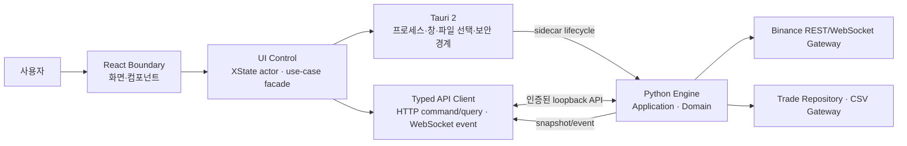
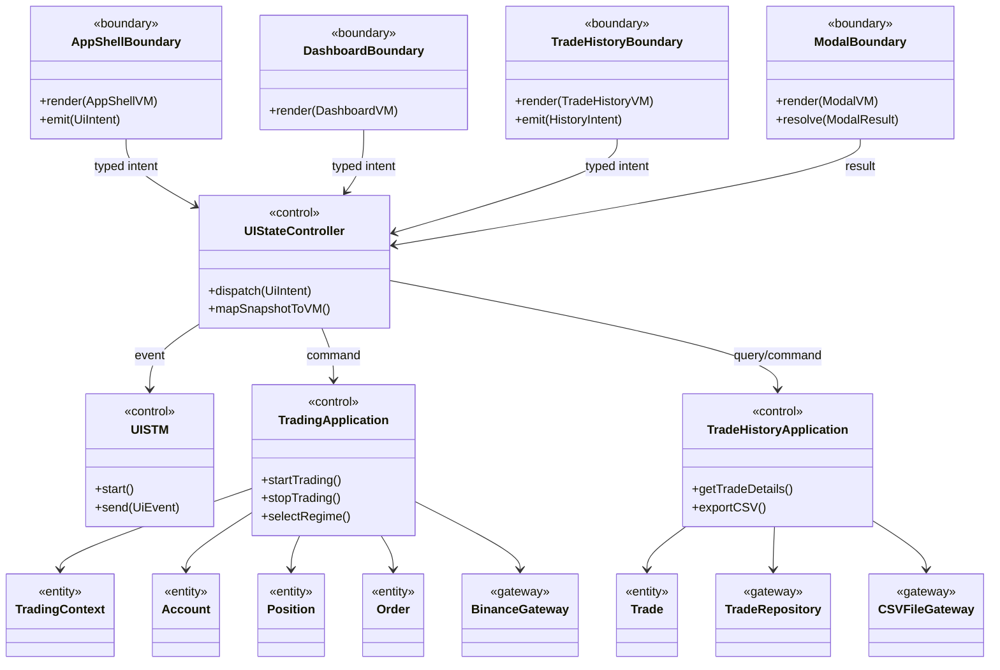

# Binance Auto Trader UI 구현 아키텍처 제안서

| 항목 | 내용 |
|---|---|
| 문서 상태 | Proposed — 구현 전 검토용 |
| 작성일 | 2026-08-10 |
| 대상 | Binance Auto Trader 데스크톱 UI와 UI-백엔드 경계 |
| 핵심 목표 | Figma 화면을 재현하면서 UI를 기능 단위로 모듈화하고, 상태 전이와 거래 도메인을 분리해 유지보수성과 테스트 가능성을 확보한다. |

## 1. 결론

이 프로젝트에는 다음 구성을 권장한다.

- **데스크톱 셸:** Tauri 2
- **UI 언어/프레임워크:** TypeScript + React + Vite
- **UI 상태 제어:** XState 기반의 계층형·병렬 상태 머신
- **서버 상태 조회/동기화:** TanStack Query + WebSocket event 반영
- **디자인 시스템:** CSS Custom Properties 기반 semantic token + CSS Modules + Radix Primitives
- **금융 차트:** TradingView Lightweight Charts와 별도 drawing primitive 모듈
- **거래 엔진:** Python `asyncio` 기반 application/domain 모듈
- **로컬 API:** FastAPI + Pydantic, command/query는 HTTP, 실시간 갱신은 WebSocket
- **외부 연동:** Binance REST/WebSocket을 감싸는 Gateway adapter
- **테스트:** Vitest, React Testing Library, Storybook, Playwright, pytest

가장 중요한 원칙은 **React 컴포넌트가 Binance API, 파일 시스템, 주문 로직을 직접 호출하지 않는 것**이다. UI는 화면을 표시하고 사용자의 의도를 typed event로 전달하는 `Boundary`여야 한다. 상태 전이와 use case 조정은 `Control`, 금액·주문·포지션·거래 이력은 Python의 `Entity`, Binance와 파일 시스템 접근은 `Gateway`가 맡아야 한다.

권장 구조는 하나의 데스크톱 앱 패키지로 배포되는 **모듈러 모놀리스 데스크톱 앱**이다. 초기 단계부터 마이크로서비스로 나누지 않는다. 프로세스 경계는 UI/Tauri와 Python 거래 엔진 사이에만 두고, Python 내부는 패키지 계층으로 분리한다.

## 2. 검토 범위와 근거 자료

### 2.1 입력 자료

- [Figma — Binance Auto Trader UI Framework](https://www.figma.com/design/kzt9vOXj0QmPeYxO8SVPax/Binance-Auto-Trader-%E2%80%94-UI-Framework?node-id=0-1&t=rGP6jjm1Yp3bXBzs-1)
- [Communication Diagram 메시지 호출 명세](../Design/Architecture/Communication_Diagram_Message_Flow_Specification.md)
- [UI Behavior 명세서](../Design/UI/UI_Behavior.md)
- [UI Rule 명세서](../Design/UI/UI_Rule.md)
- [UI Event-Action Table](../Design/UI/UI_Event_Action_Table.md)
- [프로젝트 Coding Conventions](../CODING_CONVENTIONS.md)

### 2.2 자료별 적용 범위

문서가 서로 다른 관점을 설명하므로 하나의 전역 우선순위를 두기보다, 관심사별 원본을 다음처럼 사용한다.

| 관심사 | 1차 기준 | 보조 기준 |
|---|---|---|
| 화면 배치, 시각적 상태, 컴포넌트 이름 | Figma | UI Rule |
| 사용자 event, guard, 상태 전이 | UI Event-Action Table + UI Rule | UI Behavior |
| Controller/Entity/Gateway 호출 계약 | Communication Diagram 메시지 명세 | UI Event-Action Table |
| Python 코드 형식 | `CODING_CONVENTIONS.md` | Python 표준 관례 |

자료끼리 충돌하는 항목은 임의로 섞어 구현하지 않고 14절의 결정 사항으로 관리해야 한다.

## 3. Figma 구조에서 확인한 구현 단위

Figma 페이지에는 1440×1024 기준의 16개 최상위 프레임이 있다. 이들은 독립된 16개 화면이 아니라, 아래 공통 화면과 팝업의 **상태별 시각 자료**로 보는 편이 맞다.

| 분류 | Figma 프레임 |
|---|---|
| 메인 화면 변형 | 최근 체결, 실시간 지표, 지표 설정 팝업 |
| 자동매매 흐름 | 시작 확인, 중지 확인(포지션 있음/없음), loading |
| REGIME 흐름 | 미선택 경고, 선택 확인, 패널 점멸 강조 |
| 거래 내역 | 상세, empty state |
| CSV 흐름 | 기본 팝업, 시작일 달력, 종료일 달력, 달력 없음, 오류 상태 |

Figma layer name은 이미 `RegimePanel/*`, `RegimeTypeButton/*`, `SplitOrder/*`, `TradeHistory/*`, `CSVExportPopup/*`, `CalendarPopup/*`처럼 재사용 가능한 경계를 제안하고 있다. 이 이름을 React 컴포넌트 이름과 Storybook story 이름의 출발점으로 사용할 수 있다.

반면, Figma 대상 노드의 variable definition 조회 결과는 비어 있었다. 즉 현재 색상, 여백, 글꼴 크기가 정식 design token으로 연결되어 있지 않고 다수의 raw 값으로 존재한다. 따라서 구현 전에 아래 token을 코드의 단일 원본으로 먼저 정의해야 한다.

- 색상: background, surface, border, text, positive, negative, info, warning, focus
- 타이포그래피: Inter, IBM Plex Sans KR, 숫자/본문/제목 scale
- 간격: 4px 기반 spacing scale
- 크기: control height, radius, border width, shadow, overlay blur
- motion: popup, tab indicator, REGIME 점멸 횟수와 duration

Figma에서 생성된 React/Tailwind 형태의 코드는 구조 확인용 참고 자료일 뿐이다. 전체 화면의 absolute positioning과 raw hex를 그대로 복사하면 반응형 처리, 접근성, 상태별 재사용이 어려워진다.

## 4. 목표 런타임 아키텍처



Tauri가 Python sidecar의 시작·종료와 native capability를 관리하고, React의 typed client는 세션 token이 적용된 loopback HTTP/WebSocket으로 Python API에 연결하는 방식을 기본안으로 한다. Tauri command가 API를 대신 중계하는 구조도 가능하지만, 두 통신 경로를 동시에 운영하지는 않는다.

### 4.1 왜 데스크톱 앱인가

현재 설계에는 OS 폴더 선택, 로컬 CSV 생성, 프로그램 종료, 장시간 실행되는 WebSocket과 자동매매 프로세스가 포함된다. 순수 브라우저 앱보다 데스크톱 셸이 다음 요구에 더 잘 맞는다.

- OS directory picker와 파일 저장 경로를 일관되게 제어한다.
- 창을 닫아도 거래 엔진을 어떻게 종료할지 명시적인 lifecycle을 둘 수 있다.
- Binance credential을 renderer 밖에 보관할 수 있다.
- Python 거래 엔진을 sidecar로 함께 배포할 수 있다.
- React로 Figma UI를 직접 구현하면서도 네이티브 기능을 좁은 권한으로 제공할 수 있다.

Tauri는 OS WebView와 Rust host를 사용하고 외부 binary sidecar를 묶을 수 있으므로 이 구조에 적합하다. Rust 코드는 shell lifecycle, 권한, sidecar 실행, 파일 선택 같은 좁은 범위로 제한한다.

### 4.2 모듈러 모놀리스를 권장하는 이유

초기 제품은 한 사용자, 한 거래 symbol, 한 로컬 앱을 중심으로 한다. 이 단계에서 서비스별 배포와 네트워크 장애까지 추가하면 구현·운영 복잡도가 이득보다 커진다. 대신 다음 경계는 코드상 엄격히 유지한다.

- UI와 거래 엔진의 프로세스 경계
- application과 domain의 의존성 경계
- Binance/File System adapter의 port 경계
- feature별 UI module 경계

이렇게 하면 나중에 Python 엔진을 별도 서비스로 이동해도 UI 계약은 유지할 수 있다.

## 5. 언어와 기술 선택

| 계층 | 권장 기술 | 역할 | 선택 이유 |
|---|---|---|---|
| UI 언어 | TypeScript | props, event, API payload의 정적 타입 | 금액 문자열, 상태 enum, modal result 같은 계약 오류를 컴파일 시점에 줄인다. |
| UI | React | Boundary component와 화면 composition | Figma의 반복되는 패널·행·팝업을 props 기반으로 분리하고 state별 재사용하기 쉽다. |
| 빌드 | Vite | 개발 서버, HMR, production bundle | 데스크톱 SPA에 SSR이 필요하지 않으며 React/TypeScript 개발 루프가 단순하다. Vite는 transpile만 하므로 CI에서 `tsc --noEmit`을 별도 수행한다. |
| 데스크톱 | Tauri 2 | 창, 권한, sidecar, native dialog, bundle | renderer와 native capability를 분리하며 Python executable sidecar를 함께 배포할 수 있다. |
| UI 상태 | XState | 계층·병렬 상태, guard, invoked service | Event-Action Table의 orthogonal region, popup 상태, deep history를 코드로 직접 추적하기 좋다. |
| 서버 상태 | TanStack Query | snapshot 조회, cache, invalidation | API/서버 소유 데이터와 UI-local 상태를 분리해 중복 store를 방지한다. |
| UI primitive | Radix Primitives | Dialog, AlertDialog, Popover, Tabs, Slider, ToggleGroup | Figma 스타일을 유지하면서 focus trap, keyboard navigation, ARIA 동작을 재사용할 수 있다. |
| 스타일 | CSS Custom Properties + CSS Modules | semantic token과 feature별 스타일 캡슐화 | raw hex와 전역 selector 확산을 막고 Figma token 변경 영향을 한곳에 모은다. |
| 차트 | Lightweight Charts | candle, line, volume, 실시간 update | 금융 차트에 특화되어 있고 plugin primitive로 trend line과 annotation을 확장할 수 있다. |
| 거래 엔진 | Python + `asyncio` | 시장 데이터, STM, 주문, 성과, 저장 | 현재 프로젝트의 Python convention과 맞고, REST/WebSocket 및 수치 처리 모듈을 UI와 분리할 수 있다. |
| API | FastAPI + Pydantic | loopback command/query와 WebSocket event contract | async endpoint와 WebSocket을 한 프로세스에서 제공하고 schema validation/OpenAPI 생성을 활용할 수 있다. |
| Binance adapter | 공식 Spot SDK 또는 공식 REST/WebSocket 명세 기반 adapter | 외부 API 캡슐화 | SDK 객체가 domain으로 새지 않게 하고 교체·testnet·mock을 가능하게 한다. |
| 금융 수치 | Python `Decimal`; wire에서는 decimal string | 가격, 수량, 수수료, 수익률 | binary float 오차를 거래 계산에서 배제한다. renderer의 JavaScript `number`로 금융 계산을 하지 않는다. |
| 패키지 관리 | `pnpm` + `uv` | UI workspace와 Python lock | 두 runtime의 의존성과 재현 가능한 build를 분리한다. |
| 테스트 | Vitest/RTL, Storybook, Playwright, pytest | unit, component, visual, E2E, domain test | Figma 상태와 Event-Action ID를 각 테스트 계층에 추적할 수 있다. |

버전은 구현을 시작하는 날의 지원 중인 stable release를 확인한 뒤 lockfile과 `.python-version`에 고정한다. 라이브러리 major version을 범위 지정 없이 자동 상승시키지 않는다.

### 5.1 선택하지 않은 대안

| 대안 | 장점 | 이번 프로젝트의 단점 | 판단 |
|---|---|---|---|
| 순수 브라우저 React | 배포가 단순함 | 로컬 폴더 선택, credential, 앱 종료, background lifecycle이 브라우저 정책에 종속됨 | 데스크톱 요구가 사라질 때만 고려 |
| Electron + React | Node 생태계와 desktop API가 성숙함 | Chromium/Node runtime을 함께 배포해 자원 사용량과 공격 표면이 커짐 | Tauri sidecar 검증 실패 시 대안 |
| PySide6/QML 단일 Python | 언어 수가 줄고 native API 접근이 쉬움 | Figma-to-web 매핑과 web chart/plugin 생태계를 활용하기 어렵고 UI 인력 선택 폭이 좁음 | Python 단일 언어가 최우선일 때 대안 |
| React renderer가 Binance 직접 호출 | 초기 코드가 짧음 | API key 노출, 화면 unmount와 거래 lifecycle 결합, 테스트/재시도/멱등성 관리 악화 | 사용하지 않음 |
| 하나의 전역 Redux store | 도구가 익숙할 수 있음 | server state, state machine state, draft form이 섞여 중복 원본이 생기기 쉬움 | XState + Query로 먼저 시작 |
| Figma 생성 코드 그대로 사용 | 빠른 정적 화면 확인 | absolute layout, raw color, 중복 frame, 접근성 부족 | prototype 확인 외에는 사용하지 않음 |

## 6. Boundary-Control-Entity 분리

### 6.1 분류 원칙

- `<<boundary>>`: 사용자 입력을 받고 ViewModel을 렌더링한다. 업무 규칙을 판단하지 않는다.
- `<<control>>`: event를 해석하고 guard, 상태 전이, use case 호출 순서를 조정한다.
- `<<entity>>`: 수명과 불변식을 가진 거래 도메인 객체이다. React lifecycle과 독립적이다.
- `<<value object>>`: 날짜 범위, 금액, 비율, filter처럼 값으로 동등성을 판단한다.
- `<<gateway>>`: Binance, 파일 시스템, OS 기능 같은 외부 세계를 감싼다.

UML `class`가 반드시 TypeScript의 `class` 문법이어야 하는 것은 아니다. React function component, XState machine, hook, Python dataclass도 같은 논리적 classifier를 구현할 수 있다.

### 6.2 권장 클래스 다이어그램 초안



### 6.3 Boundary 상세

| Boundary | React 구현 단위 | 포함 요소 | 소유할 수 있는 상태 |
|---|---|---|---|
| `AppShellUI` | `AppShell`, `AppHeader` | 로고, 연결 상태, 중지/시작 control, route outlet, modal host | 현재 route와 focus 복귀 위치 정도 |
| `MainDashboardUI` | `DashboardPage` | REGIME, 차트, 트레이더, 계좌 영역의 배치 | 페이지 layout 상태만 |
| `RegimePanelUI` | `RegimePanel`, `RegimeTypeButton`, `RegimeMetric` | 추천 type, 적용 type, 5개 버튼, 4개 지표, glow | candidate 강조 여부는 ViewModel로 받음 |
| `PriceChartUI` | `PriceChartPanel`, `ChartToolbar`, `ChartCanvas` | interval, active state, indicator 설정, drawing/fullscreen | chart library instance와 pointer interaction |
| `RecentOrderUI` | `TraderPanel`, `RecentTrades`, `RealtimeIndicators` | tabs, 최근 체결, 전체 보기 | 선택 tab은 machine snapshot으로 받음 |
| `AccountSummaryUI` | `AccountSection`, `StrategyCard`, `AssetCard` | 전략 상태, 수익률, 자산 | 없음 |
| `SplitOrderUI` | `SplitOrderControls`, `PercentSlider` | 매수/매도 비율 | drag 중 임시 값; 확정값은 backend 소유 |
| `TradeHistoryUI` | `TradeHistoryPage`, `SummaryCards`, `HistoryFilters`, `TradeTable` | 요약, 기간/side filter, table, empty state | table scroll/virtualization 상태 |
| `PopupUI`의 구현 분할 | 아래의 구체 dialog/popover | 확인·입력·오류 상태 | 입력 draft와 focus state만 |

`PopupUI`를 모든 팝업을 조건문으로 처리하는 하나의 거대 컴포넌트로 만들지 않는다. 공통 `ModalSurface`/`ModalOverlay`를 공유하되 아래 Boundary를 분리한다.

- `IndicatorSettingsPopover`
- `StartTradingDialog`
- `StopTradingDialog` — position 유무를 variant로 받거나 두 content component로 분리
- `RegimeRequiredDialog`
- `RegimeChangeDialog`
- `CSVExportDialog`
- `CalendarPopover`
- `ExportProgressDialog`, `ExportResultDialog`
- `ApiConnectionRequiredDialog`

### 6.4 Control 상세

| Control | 책임 | 하지 말아야 할 일 |
|---|---|---|
| `UIStateController` | Boundary intent를 event/command/query로 변환하고 backend snapshot을 ViewModel로 매핑 | Binance 호출, 금융 계산, DOM 직접 조작 |
| `uiShellMachine` | navigation, 전역 modal exclusivity, deep history, app exit 조정 | 거래 판단 |
| `connectionMachine` | offline/online, reconnect 표시와 start guard 입력 | WebSocket protocol 구현 |
| `tradingCommandMachine` | start/stop/force-sell 확인, pending/success/failure | 주문 수량 계산 |
| `regimeMachine` | candidate, confirm/cancel, glow, selected 표시 | REGIME 추천 알고리즘 |
| `chartMachine` | interval, indicator popup, toggle, drawing, fullscreen | candle/indicator 계산의 원본 소유 |
| `tradeHistoryMachine` | route entry, period/side filter, loading/empty/error | 파일 직접 읽기 |
| `csvExportMachine` | draft, picker, calendar target, validation 표시, export 상태 | CSV 직렬화와 파일 쓰기 |
| Python `TradingController` | TradingSTM, context, order use case, stop sequence 조정 | UI modal 표시 |
| Python `TradeHistoryController` | 조회, 성과, persistence, CSV use case 조정 | React state 변경 |

Communication Diagram의 `UIStateController`를 React hook 하나로 흩어 놓기보다, 위 actor들을 조정하는 façade로 유지하면 기존 명세와 추적성이 남는다.

### 6.5 Entity와 Value Object

다음 객체는 Python backend가 authoritative owner가 된다.

- Entity/Aggregate: `Account`, `Position`, `Order`, `Trade`, `TradeHistory`, `Performance`, `TradingContext`, `MarketSnapshot`, `IndicatorSnapshot`
- Domain state machine: `TradingSTM`, `RegimeSTM`
- Value Object: `Money`, `Quantity`, `Percentage`, `RegimeType`, `Interval`, `HistoryPeriod`, `TradeSide`, `TradeHistoryQuery`, `CSVPeriod`, `CSVExportOptions`

`CSVExportOptions`는 UI에 draft 표현이 있지만 최종 검증 규칙은 backend에도 반드시 존재해야 한다. UI 검증은 빠른 피드백이고 backend 검증이 보안·정합성의 최종 기준이다.

### 6.6 Gateway와 Repository

- `BinanceRestGateway`: kline/account/order REST 호출, 응답 정규화, timeout, rate limit 정보
- `BinanceWebSocketGateway`: market/user stream 구독, reconnect, sequence 정합성
- `TradeHistoryRepository`: 저장 format을 감추고 `Trade` 기준으로 load/save/stream
- `CSVFileGateway`: directory/path 검증, 임시 파일 기록 후 atomic rename
- `CredentialGateway`: OS credential store 접근; renderer에는 key를 전달하지 않음
- `Clock`과 `IdGenerator`: KST 표시, test clock, idempotency key를 위해 port로 둠

## 7. React 모듈 구조

```text
UI/
├── apps/
│   └── desktop/
│       ├── src-tauri/                 # 최소 Rust shell, capability, sidecar lifecycle
│       └── tauri.conf.json
├── src/
│   ├── app/
│   │   ├── App.tsx
│   │   ├── router.tsx
│   │   ├── providers/
│   │   └── machines/uiShellMachine.ts
│   ├── routes/
│   │   ├── dashboard/
│   │   └── trade-history/
│   ├── features/
│   │   ├── connection-status/
│   │   ├── trading-control/
│   │   ├── regime-selection/
│   │   ├── price-chart/
│   │   ├── recent-orders/
│   │   ├── account-summary/
│   │   ├── split-order/
│   │   ├── trade-history/
│   │   └── csv-export/
│   ├── shared/
│   │   ├── api/
│   │   ├── contracts/
│   │   ├── formatting/
│   │   ├── ui/
│   │   └── styles/
│   └── test/
├── storybook/
└── e2e/
```

Python은 UI 폴더와 분리해 다음과 같은 방향으로 구성한다.

```text
backend/src/binance_auto/
├── domain/             # Entity, Value Object, TradingSTM, RegimeSTM
├── application/        # Controller/use case, port
├── adapters/
│   ├── binance/
│   ├── persistence/
│   └── csv/
├── transport/          # FastAPI HTTP/WebSocket DTO
└── bootstrap/          # dependency wiring, lifecycle
```

### 7.1 모듈화 규칙

1. feature 내부 구현을 다른 feature가 직접 import하지 않는다. 공개 `index.ts` 계약만 사용한다.
2. `shared/ui`에는 업무 의미가 없는 primitive만 둔다. `RegimeTypeButton`은 `shared`가 아니라 `regime-selection`에 둔다.
3. page는 feature를 배치할 뿐 업무 규칙을 갖지 않는다.
4. Boundary component는 API client를 import하지 않는다.
5. selector는 machine/backend snapshot을 화면용 ViewModel로 변환한다.
6. 한 Figma variant마다 컴포넌트를 복사하지 않고, 같은 component에 다른 state fixture를 주는 Story를 만든다.
7. 재사용은 모양이 같다는 이유만으로 하지 않고 역할과 interaction contract까지 같을 때만 한다.

## 8. UI 상태 설계

### 8.1 하나의 거대 machine 대신 actor composition

Event-Action Table 전체를 한 파일의 거대한 switch문으로 옮기면 수정 범위가 커진다. root machine은 병렬 region의 조정만 하고, feature machine을 actor로 분리한다.

| Event-Action 영역 | 권장 actor |
|---|---|
| Upper Status Bar / API Display | `connectionMachine` |
| 시작·중지·강제 매도 | `tradingCommandMachine` |
| REGIME Panel | `regimeMachine` |
| Display Chart | `chartMachine` |
| Account/Split Order | backend snapshot + `splitOrderMachine` |
| 최근 체결/실시간 지표 tab | `traderPanelMachine` |
| Main ↔ Trading Details / H* | `navigationMachine` 또는 root history state |
| Trade Details filter | `tradeHistoryMachine` |
| CSV export와 calendar | `csvExportMachine` |
| 프로그램 종료 | `appExitMachine` |

actor 사이에서 다른 actor의 내부 state를 직접 읽지 않는다. 필요한 사실은 event 또는 read-only selector로 전달한다. 예를 들어 `STOP_BUTTON_CLICKED`의 position guard는 `PositionSnapshot.hasOpenPosition`을 입력으로 받는다.

### 8.2 상태 소유권

| 상태 | authoritative owner | UI 처리 |
|---|---|---|
| API 연결 상태 | backend connection manager | badge와 guard에 투영 |
| 자동매매 실행 상태 | Python TradingSTM/TradingContext | command pending과 결과 표시 |
| 추천/적용 REGIME | Python RegimeController | candidate 선택만 임시 보관 |
| Account/Position/Performance | Python entity | snapshot을 읽기 전용 표시 |
| 최근 체결/거래 이력 | Python repository/application | Query cache와 table projection |
| 분할 매수/매도 확정 비율 | Python TradingContext | drag draft 후 command ack로 확정 |
| 차트 interval/indicator 표시 | UI 설정 | interval별 설정을 local persistence 가능 |
| 열린 popup, calendar target | XState actor | UI-local ephemeral state |
| CSV 입력 중 draft | `csvExportMachine` | 성공/취소 시 폐기, backend에서 재검증 |
| table scroll, hover, focus | React component | component-local state |

같은 값을 React state, XState context, Query cache에 동시에 저장하지 않는다. 다른 계층에는 원본이 아니라 selector로 파생한 값을 제공한다.

### 8.3 Modal 정책

- 확인성 dialog는 backdrop 클릭으로 닫히지 않고 명시적인 action만 허용한다.
- Indicator settings와 CSV dialog는 현재 Rule에 따라 외부 클릭을 허용하되, dirty draft 폐기 여부를 명확히 표시한다.
- Calendar가 열렸을 때 외부 클릭은 Calendar만 닫고 CSV dialog는 유지한다.
- 전역 `ModalHost`가 z-index, inert background, focus trap, focus restore를 책임진다.
- 동시에 두 개의 confirmation dialog가 열리지 않도록 root machine이 modal slot을 단일화한다.

## 9. Boundary 계약과 통신 방식

Boundary에는 Entity 전체를 그대로 넘기지 않고 필요한 표시 모델과 의도 event만 전달한다.

```ts
type DecimalString = string;
type RegimeType = 'type0' | 'type1' | 'type2' | 'type3' | 'type4';

interface RegimePanelViewModel {
  recommended: RegimeType | null;
  applied: RegimeType | null;
  candidate: RegimeType | null;
  metrics: ReadonlyArray<{
    id: 'emaSlope' | 'ema' | 'swingLow' | 'swingHigh';
    label: string;
    value: string;
    tone: 'positive' | 'negative' | 'neutral';
  }>;
  highlight: boolean;
  disabled: boolean;
}

interface RegimePanelIntent {
  type: 'REGIME_TYPE_REQUESTED';
  regime: RegimeType;
}
```

`RegimePanel`은 `REGIME_TYPE_REQUESTED`만 방출한다. 즉시 적용할지, 확인 popup을 열지, 실행 중 변경이 가능한지는 Control이 결정한다.

### 9.1 command/query/event 분리

- Query: 초기 snapshot, trade details, history page 조회
- Command: select regime, start, stop, change split ratio, export CSV
- Event: connection changed, market updated, regime recommended, order executed, account updated, export progress/result

command에는 `command_id`, `issued_at`, `expected_state_version`을 포함하는 방식을 권장한다. 중복 click이나 reconnect 재전송이 같은 주문을 두 번 만들지 않도록 backend가 idempotency를 보장해야 한다.

WebSocket event의 공통 envelope 예시는 다음과 같다.

```json
{
  "schema_version": 1,
  "event_id": "evt_...",
  "sequence": 1024,
  "occurred_at": "2026-08-10T10:00:00Z",
  "type": "ACCOUNT_UPDATED",
  "payload": {}
}
```

연결이 끊겼다가 복구되면 마지막 event를 무조건 이어 붙이지 않는다. 최신 snapshot과 `sequence`를 먼저 확인하고 누락 구간을 복구하거나 전체 snapshot으로 재동기화한다.

### 9.2 금융 수치와 시간

- Python에서 `Decimal`을 사용하고 문자열 입력으로 생성한다.
- API wire format에서도 가격·수량·수수료·수익률은 decimal string으로 보낸다.
- TypeScript는 표시 형식 변환 외의 금융 계산을 하지 않는다.
- 비율 slider는 0~100의 정수 percentage 또는 basis point로 보낸다.
- 저장 시각은 UTC `Instant`, 날짜 filter는 명시적 `LocalDate`, 표시만 `Asia/Seoul`로 변환한다.
- CSV의 날짜 경계는 KST 기준인지 UTC 기준인지 계약에 명시한다. 권장값은 UI 선택일의 KST `00:00:00`부터 `23:59:59.999...`까지이다.

## 10. 디자인 시스템과 UI 구현 규칙

### 10.1 token 예시

```css
:root {
  --color-bg-canvas: #0b0e11;
  --color-bg-surface: #182431;
  --color-border-default: #3b4755;
  --color-text-primary: #f0f1f2;
  --color-text-secondary: #a7afbb;
  --color-status-positive: #0ea66b;
  --color-status-negative: #e63752;
  --color-status-info: #1454c5;
  --radius-control: 0.5rem;
  --focus-ring: 0 0 0 2px color-mix(in srgb, var(--color-status-info), white 30%);
}
```

위 값은 Figma에서 출발한 초기 token이며, 실제 구현 전 모든 프레임의 raw 값을 수집해 이름과 값의 중복을 정리해야 한다. component 파일에서 raw hex를 반복하지 않는다.

### 10.2 layout

- 기준 viewport는 Figma의 1440×1024이지만 고정 좌표를 사용하지 않는다.
- Dashboard는 CSS Grid로 `main content + trader panel` 두 column을 구성한다.
- 좁은 desktop window에서는 trader panel을 아래로 내리거나 최소 폭을 강제하는 정책을 선택한다.
- 거래 내역 table은 column 의미를 유지하며 horizontal scroll 또는 virtualization을 사용한다.
- popup은 viewport 중앙/anchor 기준으로 배치하고 Figma의 절대 좌표에 고정하지 않는다.

### 10.3 접근성

- 상승/하락을 초록/빨강 색만으로 전달하지 않고 `매수`, `매도`, `+`, `-` text와 icon을 병행한다.
- 모든 icon-only button에 accessible name과 tooltip을 제공한다.
- Dialog는 focus trap, Escape 정책, 초기 focus, 닫힘 후 trigger focus 복귀를 검증한다.
- ToggleGroup, Tabs, Slider, Calendar는 keyboard navigation을 지원한다.
- 실시간 수치 전체를 매 tick마다 screen reader에 알리지 않는다. 주문 성공, 연결 끊김 같은 중요 event만 적절한 live region으로 알린다.
- `prefers-reduced-motion`에서는 REGIME 점멸을 정적인 outline 강조로 대체한다.

## 11. 테스트 전략

### 11.1 추적성

각 test 이름이나 metadata에 Rule/Event ID를 포함한다.

| 명세 | 테스트 예 |
|---|---|
| `VR-01`, `U3-03` | REGIME 미선택 상태에서 start click 시 경고 dialog, start command 미전송 |
| `U3-04`, `U3-12` | offline start 차단, 실행 중 disconnect 시 중단 표시 |
| `VR-03`, `U2-02`, `U2-03` | position 유무에 따른 stop dialog variant |
| `CR-02` | 모든 single-select group에서 하나만 selected |
| `DC1-*` | interval 변경 후 indicator/drawing state 보존 |
| `VR-11`, `ER-16` | calendar 외부 click 시 calendar만 닫힘 |
| `TD4-*` | CSV validation, progress, success, failure transition |
| `ES2-03` | Trade History에서 복귀할 때 main deep history 복원 |

### 11.2 테스트 계층

- Domain unit: Decimal, Position, Order fill 집계, Performance, STM guard
- Application unit: start/stop/force-sell, history query, CSV use case
- Contract: Pydantic/OpenAPI schema와 생성된 TypeScript type 호환
- Machine: 모든 Event-Action transition과 invalid event 무시/오류 처리
- Component: 각 Boundary의 loading, empty, error, disabled, selected state
- Storybook visual: Figma의 16개 프레임을 공통 component의 story fixture로 재현
- E2E: start/stop, reconnect, history filter, CSV 성공/실패, window close
- Adapter integration: Binance Spot Testnet 또는 deterministic fake gateway

실거래 API key를 CI에 넣지 않는다. 주문 E2E는 기본적으로 testnet/fake gateway에서 수행한다.

## 12. 보안과 장애 처리

- Binance API key/secret은 OS credential store에 저장하고 React renderer, URL, localStorage, log에 노출하지 않는다.
- Tauri capability는 필요한 dialog, process, file scope만 허용한다.
- Python sidecar가 loopback server를 사용하면 random port와 세션 token을 사용하고 외부 interface에 bind하지 않는다.
- frontend CSP에서 임의 원격 script 실행을 금지한다.
- 주문 command는 timeout 이후 곧바로 재주문하지 않는다. 먼저 client order ID나 exchange order ID로 상태를 조회한다.
- force-sell retry는 UI timer가 아니라 backend use case가 담당한다. 각 재시도 전 기존 주문 상태와 남은 position을 다시 확인한다.
- CSV는 임시 파일에 기록한 뒤 성공 시 rename하여 중간 실패로 깨진 최종 파일이 남지 않게 한다.
- WebSocket reconnect에는 exponential backoff와 jitter를 사용하고, offline 동안 신규 주문을 차단한다.
- 앱 종료 시 position 처리 정책, sidecar 종료 순서, stream close, 저장 flush를 `appExitMachine`과 backend shutdown hook 양쪽에서 검증한다.

## 13. 기존 Communication Diagram 클래스와 구현 매핑

| 기존 classifier | 권장 구현 | 비고 |
|---|---|---|
| `AppShellUI` | `AppShell` + `AppHeader` + `ModalHost` | `<<boundary>>`; ES class일 필요 없음 |
| `RecentOrderUI` | `RecentOrdersPanel` | main trader panel의 history tab |
| `TradeHistoryUI` | `TradeHistoryPage` | 기존 alias는 새 코드에 사용하지 않음 |
| `PopupUI` | `CSVExportDialog`와 공통 modal primitive | 분석 모델 이름은 유지하되 구현은 구체화 |
| `UIStateController` | `UiApplicationFacade` | feature actor와 API port 조정 |
| `UISTM` | root XState machine + feature actors | Event-Action ID를 transition metadata로 보존 가능 |
| `TradingController` | Python application service | renderer에 두지 않음 |
| `TradeHistoryController` | Python application service | UI의 history controller와 이름 충돌 방지 |
| `CSVExportOptions` | TS draft DTO + Python validated value object | 최종 검증은 Python |
| `APIGateway`, `WebSocketGateway` | Python adapter | Binance SDK type을 domain에서 차단 |
| `CSVFileGateway` | Python CSV writer + Tauri directory picker port | picker와 write 책임을 구분 |

## 14. 구현 전에 확정해야 할 명세 충돌

아래는 코드 작성 전에 ADR 또는 명세 수정으로 확정해야 한다. 이 문서는 참고 문서를 변경하지 않고 권장 결정을 제시한다.

| 항목 | 확인된 차이 | 권장 결정 | 이유 |
|---|---|---|---|
| REGIME type 확인 | UI Rule/Figma는 확인 dialog를 요구하지만 Event-Action Table은 실행 중에만 확인하고, Communication Diagram은 직접 적용한다. | 정지/실행 중 모두 확인 dialog 후 적용 | 실제 주문 기준을 바꾸는 고위험 action이고 Figma에 전용 frame이 있다. |
| REGIME button 임시 강조 | 일부 Event-Action은 확인 전 새 button을 먼저 색칠한다. UI Rule은 실행 전 기존 선택 유지로 읽힌다. | candidate는 outline, applied는 solid로 구분하고 취소 시 candidate 제거 | 적용값과 선택 중 값을 혼동하지 않는다. |
| API offline start | Event-Action Table에는 connection-required popup이 있으나 다른 문서와 Figma 목록에는 상세가 부족하다. | start를 차단하고 전용 dialog/toast를 추가 | offline 주문 시작은 허용하면 안 된다. |
| position 없는 stop | UI Rule/Event-Action은 매도 없이 중지하지만 Communication Diagram 4.7은 position guard 없이 `sellAllPosition`을 호출한다. | position이 0이면 sell API를 호출하지 않고 STM만 중지 | 불필요하거나 잘못된 수량의 주문을 막는다. |
| force-sell 재시도 | UI Rule은 3초 간격 4회를 말하지만 Communication Diagram은 retry 흐름을 정의하지 않는다. | backend가 주문 조회 후 bounded retry; 같은 주문의 중복 제출 금지 | timeout과 실패를 구분해야 한다. |
| 거래 내역 기간 filter | Event-Action/Communication은 오늘·7일·30일·전체를 정의하지만 현재 Figma toolbar는 오늘과 side filter 중심으로 보인다. | 기간 4개와 side 3개를 서로 독립된 두 그룹으로 확정하고 Figma 후속 반영 | 상태 머신에 이미 두 orthogonal filter가 존재한다. |
| filter 시 summary | UI Rule은 summary가 갱신될 수 있다고 하고 Communication Diagram은 filter 변경 시 trade rows만 갱신한다. | summary는 account/day 기준 고정인지 filter 기준인지 제품 결정 필요; 권장값은 account/day 기준 고정 | 같은 숫자의 의미가 filter마다 바뀌면 오해 가능성이 크다. |
| CSV 빈 결과 | UI Rule이 정책 미정으로 남겨 둔다. | 기본은 파일 생성 차단 + “해당 기간 거래 없음”; 명시적 요구가 있으면 header-only 허용 | 실수로 빈 파일을 성공으로 오해하는 것을 방지한다. |
| CSV 파일명 | Event-Action/Communication은 편집 가능하지만 Figma에서는 preview처럼 보일 수 있다. | 유효성 검증되는 editable field로 확정 | 기존 state와 operation을 살리고 사용자 요구를 충족한다. |
| CSV dialog 외부 click | UI Rule은 외부 클릭 시 draft를 폐기하고 닫는다. | dirty 상태에서는 확인 없이 닫을지 UX 결정; 권장값은 dirty면 폐기 확인 | 경로·날짜 입력 손실을 방지한다. |
| chart drawing 저장 | UI Rule에서 별도 정책으로 남아 있다. | interval별 local persistence, 거래 판단에는 사용하지 않음 | interval 전환 시 기존 drawing을 불러오는 Event-Action과 맞는다. |
| 프로그램 종료 UI | Event-Action에는 종료 state가 있으나 Figma/Behavior에 trigger가 없다. | OS window close를 `EXIT_CLICKED`로 매핑하고 position별 dialog를 디자인 | desktop lifecycle을 완결한다. |

## 15. 권장 구현 순서

1. **명세 결정:** 14절의 충돌을 확정하고 Rule/Event/Message ID traceability 표를 만든다.
2. **계약 먼저:** Python DTO/OpenAPI/WebSocket event schema와 TypeScript 생성 type을 정의한다.
3. **Design token:** Figma raw 값을 semantic token으로 수집하고 font/icon asset 정책을 확정한다.
4. **UI primitive:** Button, ToggleGroup, Tabs, Slider, ModalSurface, Calendar, StatusBadge를 Storybook에서 만든다.
5. **정적 composition:** Dashboard와 Trade History를 mock ViewModel로 구현한다.
6. **State machine:** root와 feature actor를 Event-Action Table ID 기준으로 구현·테스트한다.
7. **Python application/domain:** Entity, STM, Controller, port를 작성하고 fake adapter로 검증한다.
8. **실시간 연결:** snapshot query, WebSocket sequence/reconnect, Query cache update를 연결한다.
9. **Binance adapter:** 공식 testnet에서 market/account/order 흐름을 통합 테스트한다.
10. **CSV/desktop:** directory picker, atomic CSV write, sidecar packaging, shutdown을 연결한다.
11. **회귀 검증:** Figma visual, accessibility, E2E, failure/reconnect 시나리오를 완료한다.

초기 UI 개발은 backend가 완성될 때까지 기다리지 않고 typed fake adapter와 fixture로 진행할 수 있다. 단, fake와 실제 adapter는 같은 port contract를 구현해야 한다.

## 16. 구현 완료 기준

- Figma 16개 frame이 복사된 16개 component가 아니라 공통 component의 state/Story로 재현된다.
- Boundary에서 Binance SDK, file API, 금융 계산 code를 찾을 수 없다.
- 모든 UI Rule과 Event-Action transition에 대응하는 자동화 test 또는 명시적인 미구현 사유가 있다.
- start/stop/regime/export command는 pending 동안 중복 제출되지 않는다.
- 금융 값은 backend `Decimal`과 decimal string contract를 사용한다.
- reconnect 후 화면과 backend의 trading/account state가 자동으로 재동기화된다.
- modal keyboard/focus 동작과 reduced-motion 대체가 검증된다.
- API secret이 renderer와 log에 노출되지 않는다.
- CSV validation/error/success와 position 유무별 stop flow가 E2E로 통과한다.
- Tauri bundle이 Python sidecar를 포함하고 정상 종료/비정상 종료 복구 정책이 검증된다.

## 17. 공식 기술 근거

- [Tauri Architecture](https://v2.tauri.app/concept/architecture/) — WebView/Rust host와 message passing 구조
- [Tauri External Binaries](https://v2.tauri.app/develop/sidecar/) — Python executable/API server sidecar bundling
- [React with TypeScript](https://react.dev/learn/typescript) — typed props와 event 작성 방식
- [Vite Getting Started](https://vite.dev/guide/) — React/TypeScript template과 build 구성
- [XState Parallel States](https://stately.ai/docs/parallel-states) — Event-Action Table의 orthogonal region 대응
- [XState state/history 개념](https://stately.ai/docs/editor-states-and-transitions) — main 화면 deep history 대응
- [TanStack Query Overview](https://tanstack.com/query/latest/docs/framework/react/overview) — server state fetch/cache/sync
- [Radix Primitives Accessibility](https://www.radix-ui.com/primitives/docs/overview/accessibility) — focus, keyboard, ARIA 기반 UI primitive
- [FastAPI WebSockets](https://fastapi.tiangolo.com/advanced/websockets/) — Python 실시간 event channel
- [Python `decimal`](https://docs.python.org/3/library/decimal.html) — 정확한 decimal 산술과 금융 계산 근거
- [Lightweight Charts Plugins](https://tradingview.github.io/lightweight-charts/docs/plugins/intro) — indicator, drawing, annotation 확장
- [Binance Spot API 공식 문서](https://github.com/binance/binance-spot-api-docs) — 지원되는 REST/stream 계약
- [Binance Python Connectors](https://github.com/binance/binance-connector-python) — 공식 Python SDK 선택지
- [Storybook UI Testing](https://storybook.js.org/docs/writing-tests) — component state와 interaction/visual test
- [Playwright](https://playwright.dev/docs/intro) — desktop WebView UI의 핵심 사용자 흐름 E2E 기반
